# 第 1 章　導論

> 本講義以《最新計算機概論》第十二版 第 1 章 PPT 的架構為骨架，重新撰寫為適合課堂詳細講解的完整教學文字稿。圖片素材取自原簡報，內文則大幅擴寫，加入故事脈絡、類比說明、範例與課堂討論問題，方便直接對照講解。

## 本章學習地圖

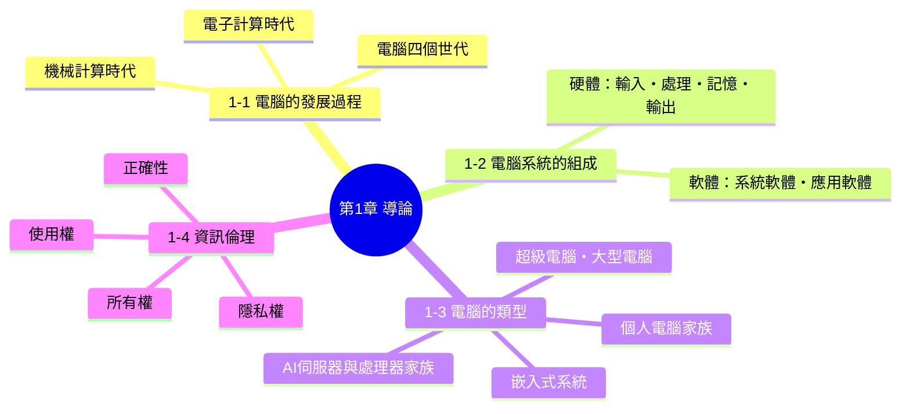

**這一章要帶學生想清楚三件事：**

1. 電腦不是憑空出現的，它是人類幾千年來想要「算得更快、算得更準」這個念頭，一步步累積出來的成果。
2. 不管電腦長什麼樣子——教室裡的桌上型電腦、口袋裡的手機、手腕上的智慧手錶——它們的核心運作邏輯永遠是「輸入 → 處理 → 輸出」，加上背後的「軟體」在指揮一切。
3. 電腦愈方便，責任愈大。學會使用電腦之前，更要學會尊重別人的隱私、資料與智慧財產。

---

## 1-1　電腦的發展過程

### 開場：想像一個沒有「計算工具」的世界

在正式介紹電腦之前，先讓學生想像一個情境：**如果你是三千年前的商人，要計算今天賣出多少匹布、收了多少銀兩，你會怎麼做？** 用手指頭數？在地上畫記號？這正是人類發明「計算工具」的起點——電腦的故事，其實就是一部「人類想辦法讓自己算得更快、更準、更省力」的歷史。

這段歷史大致可以分成兩個階段：

- **機械計算時代**：靠齒輪、木桿、卡片等純機械結構來輔助計算，還沒有用到電。
- **電子計算時代**：開始用真空管、電子訊號來運算，速度從此不可同日而語。

---

### 機械計算時代：從算盤到分析機

#### 西元前 3000 年｜中國算盤
<table>
<tr>
<td width="35%">

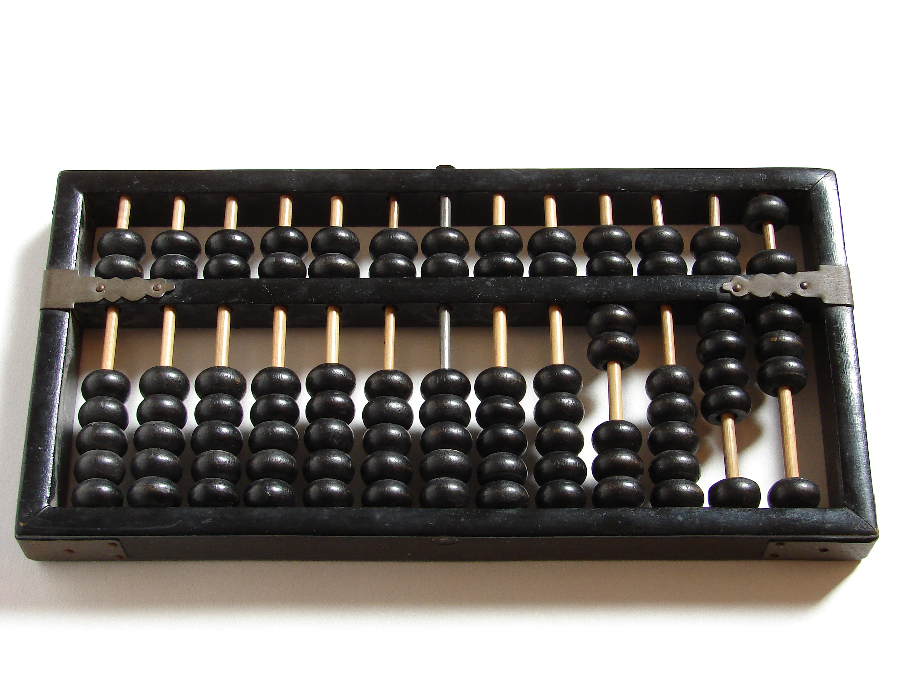
*中國算盤（圖片來源：維基百科）*

</td>
<td>

算盤可以說是人類最早、也是使用時間最長的計算工具，起源於中國，至今在珠算教學、部分市場交易中仍看得到它的身影。算盤的巧妙之處在於，它把「進位」這個抽象的數學概念，變成了看得見、摸得著的「珠子移動」——這其實已經具備了現代計算機「用實體元件表示數字狀態」的雛形精神。

</td>
</tr>
</table>

#### 1642 年｜巴斯卡（Blaise Pascal）與 Pascaline 齒輪計算機
<table>
<tr>
<td width="35%">
  
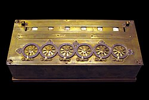

*Pascaline 齒輪計算機（圖片來源：維基百科）*

</td>
<td>

法國數學家 **Blaise Pascal** 當時年僅十幾歲，是為了幫在稅務機關工作、每天要處理大量加減法的父親分擔工作，才設計出這台以齒輪轉盤組成的機械式計算機 **Pascaline**。它可以自動處理「進位」——當某一位數字轉到 10 時，會自動帶動下一位數字前進一格，這個「進位」的機械原理，其實和我們今天計算機、汽車里程表的運作邏輯是一脈相承的。

</td>
</tr>
</table>

> **課堂小提醒**：Pascal 這個程式語言（Pascal 語言）就是後人為了紀念他而命名的，可以順帶連結到後面「第三代電腦」的高階語言介紹。

#### 1801 年｜賈卡（Joseph Jacquard）與提花織布機
<table>
<tr>
<td width="35%">

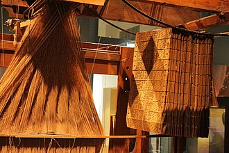
*Jacquard 提花織布機（圖片來源：維基百科）*

</td>
<td>

法國織布工人 **Joseph Jacquard** 發明了一種用「打孔卡片」控制織布圖案的織布機。卡片上打孔與否，決定了織線要往上還是往下——這其實就是最早的「二進位控制」概念：**有孔 / 無孔，等同於今天電腦裡的 1 / 0**。這個「用卡片上的孔洞來儲存與控制資訊」的想法，後來直接影響了打孔卡片計算機、甚至早期電腦程式的輸入方式。

</td>
</tr>
</table>

#### 1830～1833 年｜巴貝奇（Charles Babbage）的差分機與分析機
<table>
<tr>
<td width="35%">

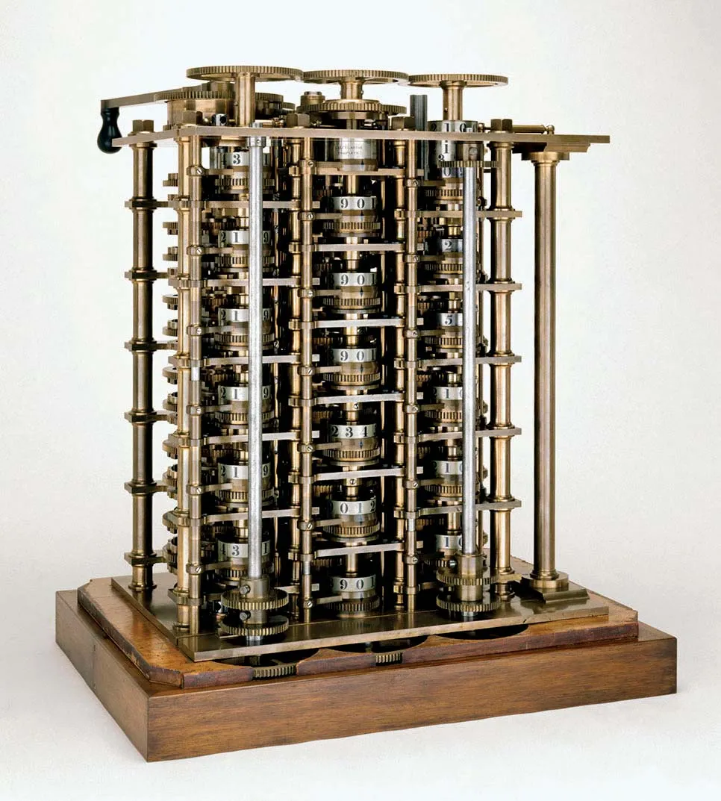
*差分機（圖片來源：Science Museum London）*

</td>
<td>

英國數學家 **Charles Babbage** 常被稱為「電腦之父」。1830 年，他設計了**差分機（Difference Engine）**，目的是要用機械取代人工計算數學表格（例如航海用的對數表），因為當時人工計算的表格錯誤百出，甚至造成船隻失事。

</td>
</tr>
<tr>
<td width="35%">

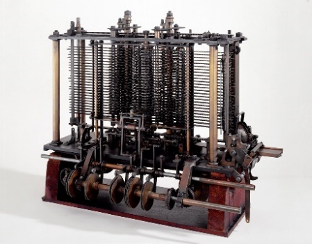
*分析機（圖片來源：維基百科）*

</td>
<td>

1833 年，巴貝奇進一步構想出更先進的**分析機（Analytical Engine）**。分析機的劃時代之處在於，它已經具備了現代電腦的基本架構雛形：用打孔卡片輸入「資料」與「運算指令」、有儲存數字的「儲存庫」（相當於今天的記憶體）、有負責運算的「運算室」（相當於今天的 CPU）。可惜受限於當時的工藝技術，分析機終其一生都沒有真正完整打造出來，但它的設計理念比實際做出電腦早了超過一百年。

</td>
</tr>
</table>

> **人物補充**：詩人拜倫的女兒 **Ada Lovelace** 曾為分析機寫下一套運算流程，被公認是史上第一位「程式設計師」，這也是程式語言 **Ada** 命名的由來。

#### 1890 年｜霍列瑞斯（Herman Hollerith）與打孔卡片製表機器

<table>
<tr>
<td width="35%">

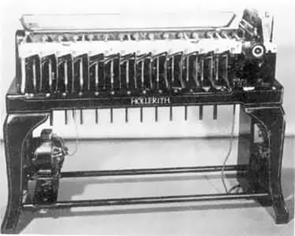

*圖片來源：www.computerhistory.org*

</td>
<td>

美國的人口普查在 1880 年代面臨一個大麻煩：人工統計一次全國人口普查竟然要花上將近 8 年，等統計完，下一次普查都快到了。美國科學家 **Herman Hollerith** 從賈卡織布機的打孔卡片得到靈感，設計出用電力驅動的**打孔卡片製表機器**，把人口普查的統計時間從 8 年大幅縮短到約 1 年。Hollerith 後來成立的公司，幾經合併，最終演變成今天赫赫有名的 **IBM（國際商業機器公司）**。

</td>
</tr>
</table>

---

### 電子計算時代：從 ABC 到 UNIVAC

機械計算機的極限，在於「機械結構的運轉速度」怎麼樣都比不上「電子訊號的傳遞速度」。1940 年代，隨著電子學的發展，人類終於跨入了用電子訊號運算的時代。

<table>
<tr>
<td width="25%">

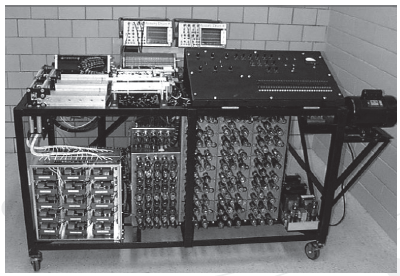

</td>
<td>

**1942 年｜ABC 電腦**
美國愛荷華州立大學教授 **John V. Atanasoff** 與研究生 **Clifford E. Berry** 建造出世界第一台**電子式數位電腦 ABC**（Atanasoff-Berry Computer）。它雖然還不能像現代電腦一樣「儲存程式」，但已經用真空管取代機械齒輪來運算，運算速度比純機械式裝置快上許多。

</td>
</tr>
<tr>
<td width="25%">

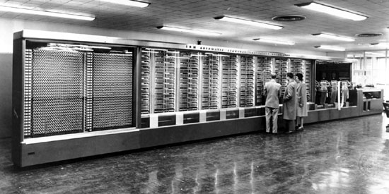

</td>
<td>

**1944 年｜Mark I 電腦**
美國哈佛大學教授 **Howard Aiken** 建造的 **Mark I**，是一台結合了機械與電子元件的「電子機械式電腦」，體積龐大（長度超過 15 公尺），主要用於美國海軍的彈道計算。

</td>
</tr>
<tr>
<td width="25%">

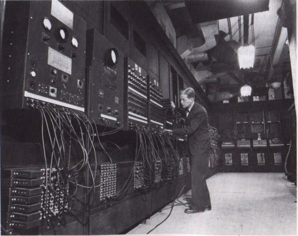

</td>
<td>

**1946 年｜ENIAC 電腦**
美國軍方為了計算火砲的彈道表，邀請賓州大學教授 **John W. Mauchly** 與 **J. Presper Eckert Jr.** 建造了 **ENIAC**（Electronic Numerical Integrator And Computer）。ENIAC 用了將近 18,000 支真空管，佔地約 170 平方公尺、重達 30 噸，是公認第一台「泛用型」電子計算機——意思是它不像 ABC 只能做特定計算，而是可以透過重新配線來處理不同的計算任務。

</td>
</tr>
<tr>
<td width="25%">

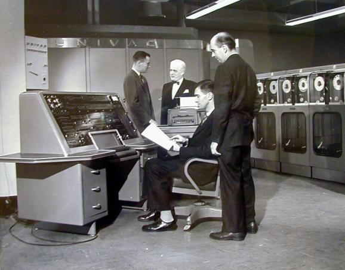

</td>
<td>

**1951 年｜UNIVAC 電腦**
UNIVAC 是第一台**商用**電腦，美國人口普查局在 1951 年用它完成全美人口普查，也是電腦第一次真正走出實驗室、進入政府與企業的日常作業。1952 年，UNIVAC 甚至還成功「預測」了美國總統大選的結果，讓社會大眾第一次感受到電腦運算的威力。

</td>
</tr>
</table>

> **課堂討論**：從算盤到 UNIVAC，橫跨了將近 5000 年；但從 ABC 電腦（1942）到 UNIVAC（1951），只花了不到 10 年。請學生想一想：**為什麼「電子化」之後，技術進步的速度突然變快了？**（提示：可以連結後面「電腦四個世代」的元件微縮化來回答。）

---

### 電腦的四個世代：元件愈做愈小，能力愈來愈強

電腦發明之後，並沒有停止進化。學界通常以「構成電腦運算核心的關鍵元件」作為劃分世代的依據——因為元件的材質，直接決定了電腦的速度、體積、耗電量與價格。

| | 第一代 | 第二代 | 第三代 | 第四代 |
|---|---|---|---|---|
| **時期** | 1946～1955 | 1956～1963 | 1964～1970 | 1971～現在 |
| **關鍵元件** | 真空管 | 電晶體 | 積體電路（IC） | 超大型積體電路（VLSI） |
| **程式語言** | 機器語言（0與1） | 組合語言／早期高階語言（FORTRAN、COBOL…） | 高階語言（Pascal、BASIC…） | 高階語言（C、C++、Java、Python…） |

<table>
<tr>
<td width="25%">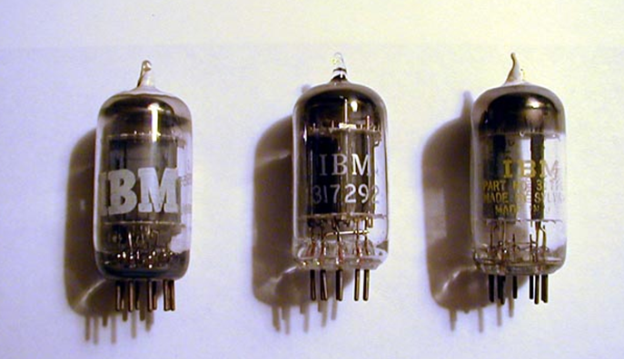 <i>真空管</i></td>
<td>

**第一代｜真空管（Vacuum Tube）**
真空管利用電子在真空玻璃管內的流動來控制訊號，是最早能做電子開關的元件。缺點很明顯：**體積大、耗電量驚人、發熱嚴重，而且非常容易故障**——據說 ENIAC 平均每隔幾分鐘就會有一支真空管燒壞，需要專人巡邏更換。

</td>
</tr>
<tr>
<td width="25%">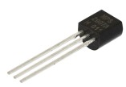 <i>電晶體</i></td>
<td>

**第二代｜電晶體（Transistor）**
1947 年貝爾實驗室發明電晶體後，工程師發現它可以做到和真空管一樣的「開關」功能，但**體積只有指甲片大小、耗電量大幅降低、也更耐用**。電腦第一次有機會做得比一個房間小。

</td>
</tr>
<tr>
<td width="25%">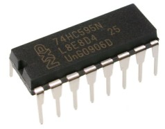 <i>積體電路</i></td>
<td>

**第三代｜積體電路 IC（Integrated Circuit）**
工程師想到：既然電晶體已經很小了，那能不能把好幾個電晶體、甚至整個電路，直接「印」在同一小片矽晶片上？這就是積體電路。IC 讓電腦的體積再度大幅縮小，速度更快、成本也更低，個人電腦開始有機會走入一般家庭與辦公室。

</td>
</tr>
<tr>
<td width="25%">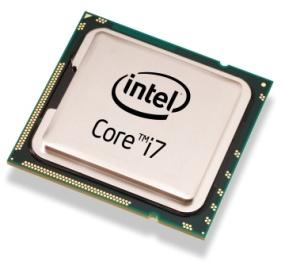 <i>微處理器（VLSI的代表產品）</i></td>
<td>

**第四代｜超大型積體電路 VLSI（Very Large Scale Integration）**
隨著半導體製程技術突飛猛進，工程師能在**一片指甲大小的晶片上塞入數十億顆電晶體**，這正是我們現在用的微處理器（CPU）。VLSI 的出現，直接催生了個人電腦、筆記型電腦，一路發展到今天口袋裡的智慧型手機。

</td>
</tr>
</table>

**這條演進路線給我們的啟示是：**

> 體積更小 → 速度更快 → 價格更低 → 耗電更省
>
> 這四個「更」，正是電腦從軍方、政府專屬的龐然大物，一路「飛入尋常百姓家」，變成人手一機的關鍵原因。

---

## 1-2　電腦系統的組成

### 開場：電腦系統 = 硬體（身體）＋ 軟體（靈魂）

可以先問學生一個問題：**「你覺得一台沒有安裝任何軟體、也沒有連網路的電腦，開機之後能做什麼？」** 答案是：幾乎什麼都不能做。

這正是這一節要帶出的核心觀念——一部完整能運作的電腦系統，缺一不可地包含兩個部分：

- **硬體（Hardware）**：看得到、摸得到的實體裝置，好比人的「身體」——有手（輸入）、有腦（處理）、有記憶（大腦皮質）、有嘴巴（輸出）。
- **軟體（Software）**：看不到、摸不到，但真正指揮身體該做什麼事的「靈魂」與「知識」。

---

### 1-2-1　硬體：電腦的身體

電腦硬體不論品牌、不論大小，基本組成都可以歸納成四個單元，資料就在這四個單元之間流動：

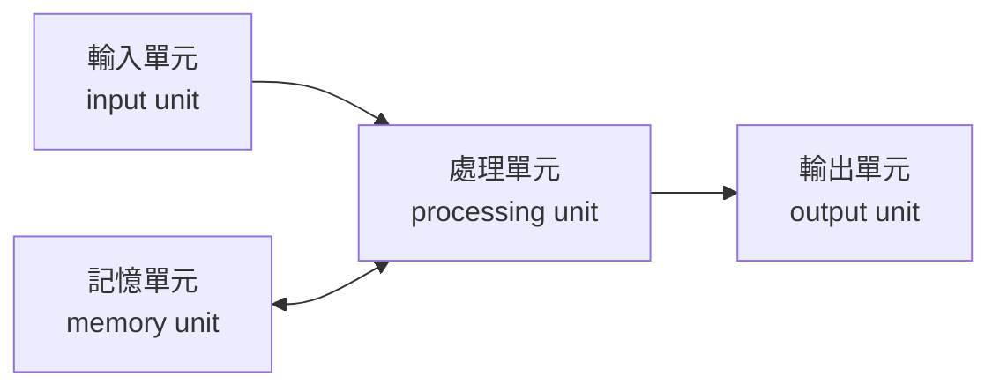

**用一個生活例子把這張圖說清楚**：當你在電腦上打一份報告——

1. 你的手指敲打鍵盤（**輸入單元**接收「按了哪個鍵」這個資料）
2. CPU（**處理單元**）判斷這個按鍵應該顯示成哪個文字
3. 這個過程中，還沒存檔的文字暫時被放在**記憶單元**（RAM）裡
4. 處理完的結果被送到螢幕（**輸出單元**），你才看得到自己剛剛打了什麼字

<table>
<tr>
<td width="25%">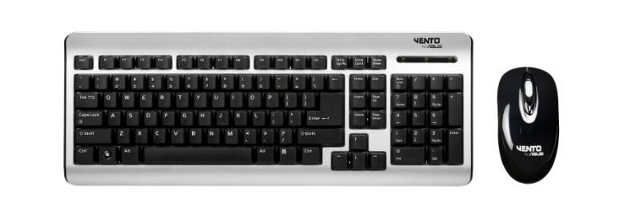</td>
<td>

**① 輸入單元（Input Unit）**

負責接收外部世界的資料，並轉換成電腦看得懂的格式（0與1），送給處理單元運算。

**常見裝置**：鍵盤、滑鼠、掃描器、觸控螢幕、麥克風、攝影機、讀卡機

</td>
</tr>
<tr>
<td width="25%">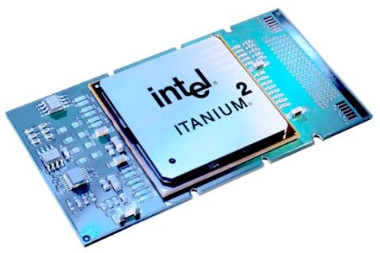</td>
<td>

**② 處理單元（Processing Unit）**

就是俗稱的「中央處理器」**CPU（Central Processing Unit）**，是電腦的運算核心，所有的算術運算（加減乘除）與邏輯運算（比較大小、真假判斷）都由它負責執行，可以說是電腦的「大腦」。CPU 的運算速度，往往是決定一台電腦「快不快」的最關鍵指標。

</td>
</tr>
<tr>
<td width="25%">
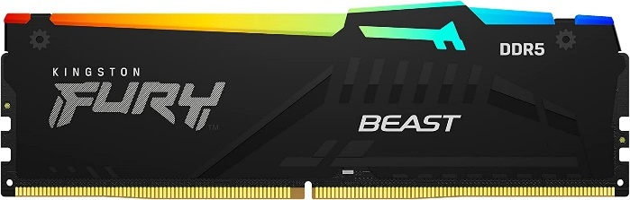 
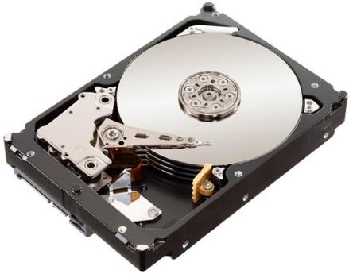
</td>
<td>

**③ 記憶單元（Memory Unit）**

負責儲存處理單元運算時所需要的資料／程式，以及運算完畢的結果。記憶單元又可以分成兩種，這裡是學生很容易搞混的地方，建議特別強調對比：

| | 主記憶體（RAM） | 輔助記憶體 |
|---|---|---|
| 常見裝置 | 記憶體模組（如上圖 Kingston） | 硬碟、SSD（如上圖 WD） |
| 特性 | 存取速度快，但**關機後資料會消失** | 存取速度較慢，但**關機後資料仍保留** |
| 比喻 | 像是你「正在使用」的辦公桌桌面 | 像是「長期存放」文件的檔案櫃 |

</td>
</tr>
<tr>
<td width="25%">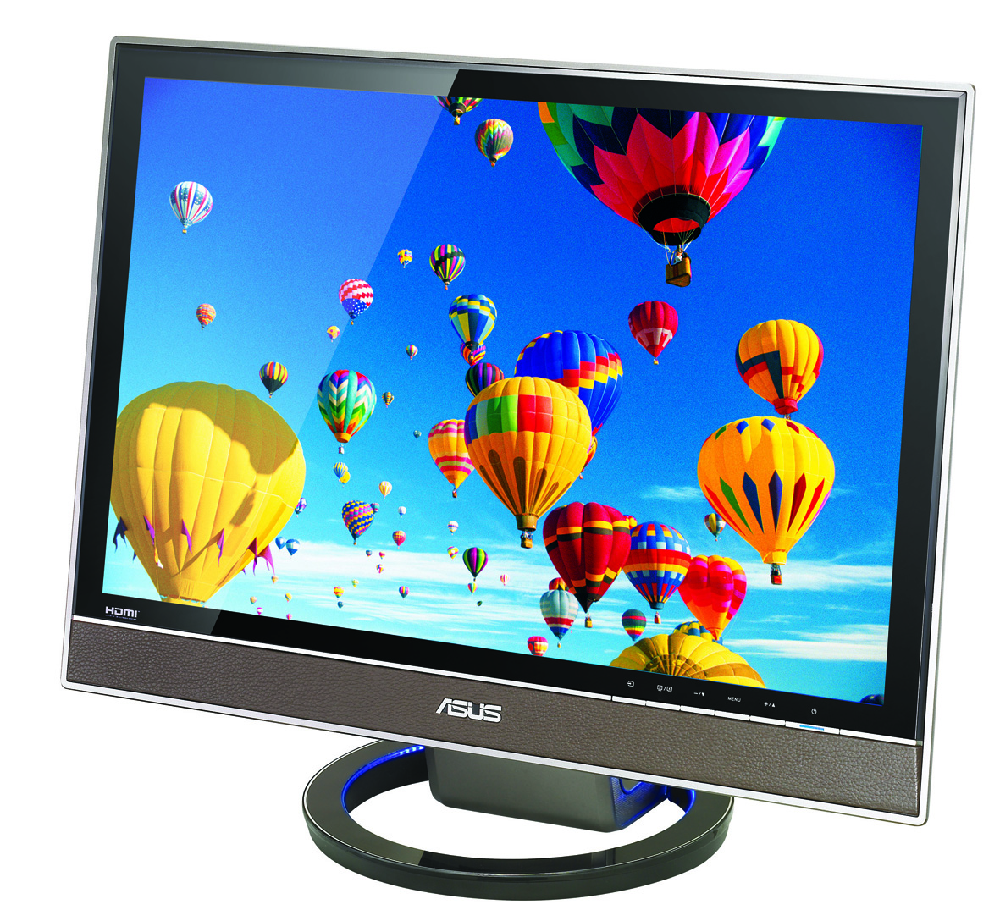</td>
<td>

**④ 輸出單元（Output Unit）**

負責把處理單元運算完畢、電腦看得懂的資料（0與1），轉換成人類能理解的文字、圖形、聲音與視訊，並且呈現出來。

**常見裝置**：螢幕、印表機、喇叭、投影機

</td>
</tr>
</table>

---

### 1-2-2　軟體：電腦的靈魂

有了硬體之後，電腦還需要「指令」才知道該做什麼事，這些指令的集合就是**軟體（Software）**。電腦軟體可以分成兩大類型：

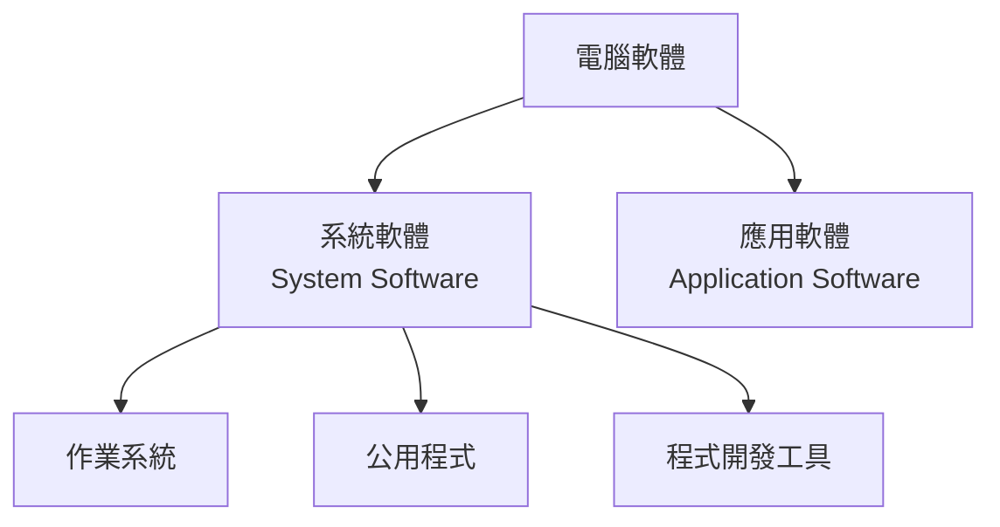

#### 系統軟體（System Software）

系統軟體是「管理硬體、伺候應用軟體」的幕後功臣，使用者通常不會直接感受到它的存在，但少了它，電腦寸步難行。系統軟體又包含三種：

- **作業系統（Operating System, OS）**：系統軟體中最核心的一種，負責管理硬體資源（CPU、記憶體、儲存空間）、管理檔案、提供使用者操作介面。常見的作業系統有 Windows、macOS、Linux、Android、iOS。
- **公用程式（Utility）**：協助維護、優化電腦系統的小工具，例如防毒軟體、磁碟重組工具、壓縮軟體。
- **程式開發工具**：讓工程師撰寫、除錯、編譯程式所使用的工具，例如編譯器（Compiler）、整合開發環境（IDE）。

<table>
<tr>
<td width="45%">

*Windows 作業系統屬於系統軟體*

</td>
<td width="45%">

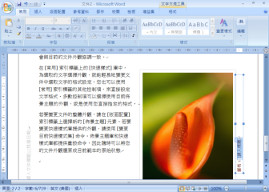
*Word 文書處理軟體屬於應用軟體*

</td>
</tr>
</table>

#### 應用軟體（Application Software）

應用軟體是使用者為了完成「特定實際工作」而使用的軟體，例如：

- 文書處理：Word
- 簡報：PowerPoint
- 試算表：Excel
- 瀏覽器：Chrome、Edge、Safari
- 多媒體娛樂：影音播放器、繪圖軟體、遊戲

> **課堂小技巧**：可以請學生現場判斷「這是系統軟體還是應用軟體？」──例如「掃毒軟體」「LINE」「檔案總管」「小畫家」，訓練他們用定義去分類，而不是死背。**判斷關鍵句：這個軟體是在「管理電腦本身」，還是在「幫我完成一件具體的事」？**

---

## 1-3　電腦的類型

### 開場：電腦不是只有「桌上型電腦」一種樣子

問學生：**「你今天已經用過幾種電腦了？」** 答案通常會讓他們嚇一跳——手機是電腦、智慧手錶是電腦、公車的到站系統是電腦、教室的冷氣搖控也可能內建電腦。電腦的分類，一般是依照**運算能力、體積大小、使用場景**來區分。

### 依運算規模由大到小

<table>
<tr>
<td width="30%"></td>
<td>

**1-3-1　超級電腦（Supercomputer）**

功能最強、執行速度最快的電腦，每秒鐘能夠執行數兆個運算。造價極為昂貴，通常只有國家級單位或大型機構才有能力使用，應用在需要極大量運算的領域，例如： **武器研發、天氣預測、生物實驗、新藥開發、航太科技、能源探勘、地質分析、天文研究** 。可以跟學生強調：超級電腦不是「一台很貴的個人電腦」，而是把成千上萬個處理器連結起來協同運算的龐大系統。

</td>
</tr>
<tr>
<td width="30%">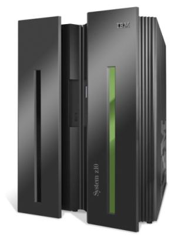</td>
<td>

**1-3-2　大型電腦（Mainframe）**

從 IBM System/360 開始發展的一系列電腦，功能與速度僅次於超級電腦，最大特色是**內建多層次的安全措施，能夠同時服務非常多位使用者**，提供集中式的資料儲存與處理。適合金融業、保險業、航空業、製造業、政府單位等需要同時處理大量交易、且對穩定性要求極高的機構——例如你每天刷的提款卡、訂的機票，背後很可能就是大型電腦在支撐。

</td>
</tr>
</table>

### 1-3-3　個人電腦（PC, Personal Computer）家族

個人電腦是指在**功能、速度、大小及價格**等方面，適合個人使用的電腦。隨著技術演進，個人電腦已經分裂成一個龐大的家族：

<table>
<tr>
<td width="22%">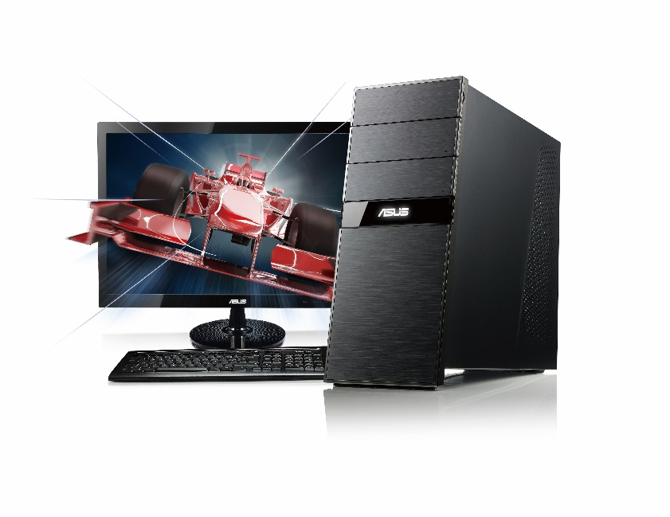 <b>桌上型電腦</b></td>
<td>由主機、螢幕、鍵盤、滑鼠等周邊組成，為固定在桌上使用而設計。其中專為高運算需求的遊戲玩家設計、配備高階硬體的機型，稱為電競電腦（Gaming Computer）。</td>
</tr>
<tr>
<td width="22%">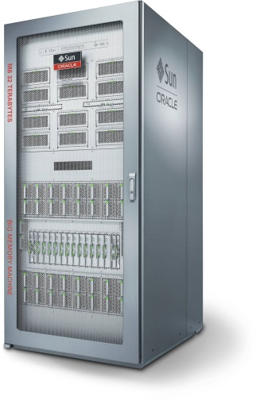 <b>工作站</b></td>
<td>運算能力強大的高階桌上型電腦，適合從事財務分析、電腦動畫、工程設計、軟體開發等對運算資源要求較高的專業工作。</td>
</tr>
<tr>
<td width="22%">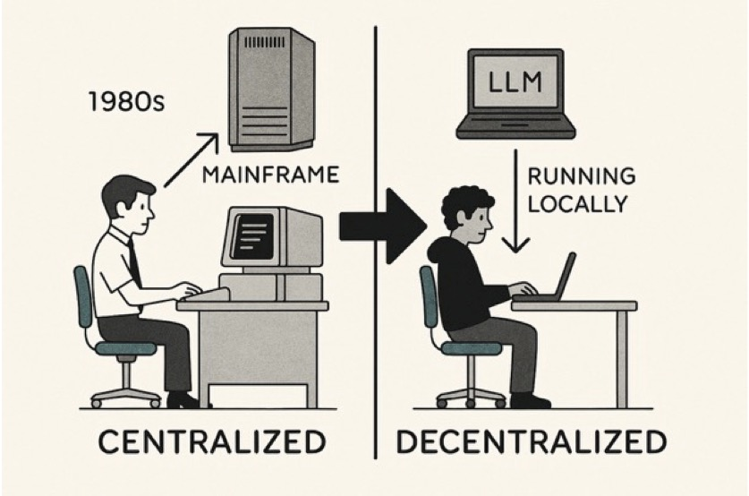 <b>AI PC</b></td>
<td>具備人工智慧功能的 PC，通常內建 AI 晶片，例如 GPU（圖形處理器）、NPU（神經處理器），讓 AI 模型與應用可以直接在本機端運行，不必事事都連到雲端伺服器。</td>
</tr>
<tr>
<td width="22%">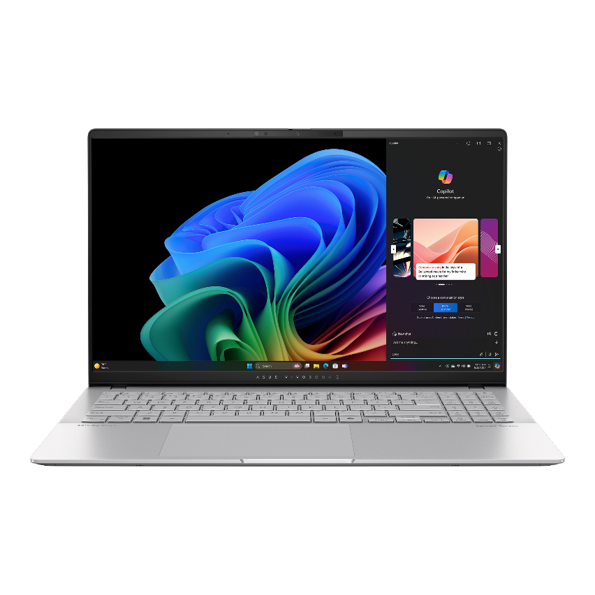 <b>筆記型電腦</b></td>
<td>內建螢幕與鍵盤的可攜式個人電腦（notebook、laptop）。為了方便攜帶，機體必須輕巧、穩定性高、電池續航力長，並支援無線通訊。</td>
</tr>
<tr>
<td width="22%">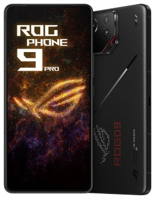 <b>行動裝置</b></td>
<td>輕便、可攜式，通常以觸控、手寫或語音輸入的電子設備，小到可放進口袋。支援無線通訊、電話、簡訊、瀏覽網頁、電子郵件、影音多媒體、照相、GPS 等功能，例如智慧型手機、平板電腦、電子閱讀器。</td>
</tr>
<tr>
<td width="22%">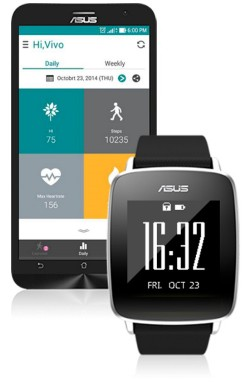 <b>穿戴式裝置</b></td>
<td>將行動裝置的功能移植到可穿戴的裝置上，常見的有智慧眼鏡、智慧手錶、智慧手環、智慧服飾、智慧運動鞋等。</td>
</tr>
</table>

> **補充分類角度**：除了依「功能／體積」分類，個人電腦也可以依**系統架構**分為「IBM 相容 PC」與「麥金塔（Mac）」兩大陣營，這是另一條可以跟學生延伸討論的分類軸線。

### 1-3-4　嵌入式系統（Embedded System）

<table>
<tr>
<td width="30%">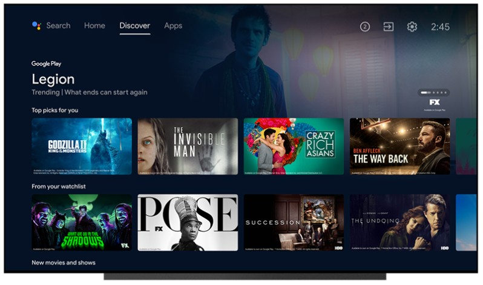</td>
<td>

生活中有許多「只做某些特定工作」的特殊用途電腦，例如遊戲機、冷氣、冰箱、智慧家電、車用電子產品、醫療監視儀器、交通號誌等。這些電子產品內部都嵌入了微處理器來加以控制，這種**專為特定功能設計、深藏在產品內部運作**的電腦系統，就稱為嵌入式系統。

**判斷關鍵**：嵌入式系統通常「使用者感覺不到它是電腦」——你不會覺得自己在「操作一台電腦」去開冷氣，但冷氣裡確實有一顆微處理器在運算溫度、風速與時間。

</td>
</tr>
</table>

---

### 資訊部落：AI 伺服器、CPU、GPU、NPU 與 TPU

<table>
<tr>
<td width="45%">

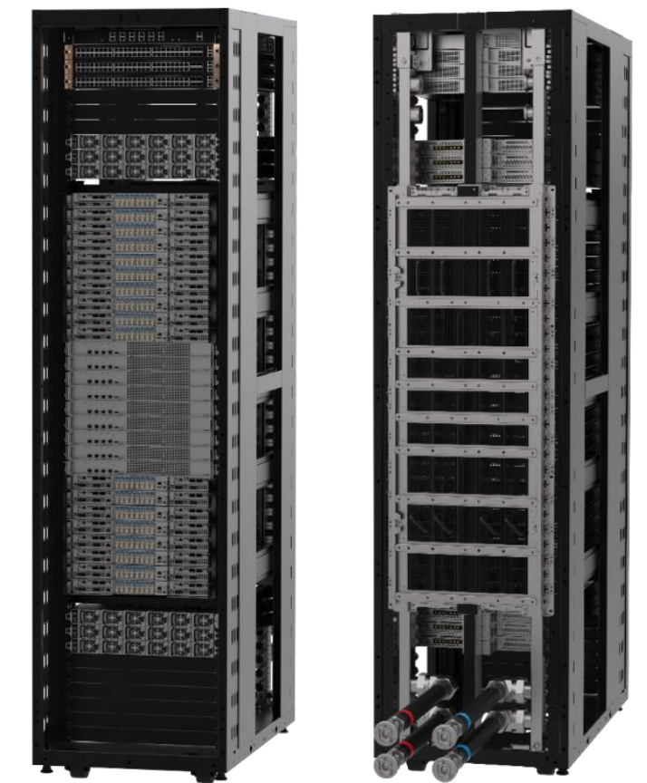
*搭載 GB300 NVL72 的 AI 伺服器（圖片來源：ASUS）*

</td>
<td width="45%">

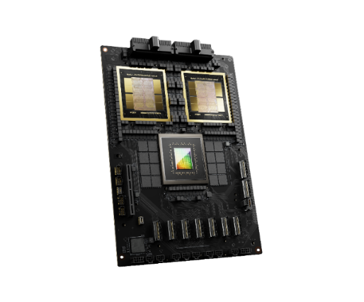
*Blackwell GPU（圖片來源：輝達）*

</td>
</tr>
</table>

隨著人工智慧（AI）快速發展，「一般伺服器」已經不夠用了。**AI 伺服器**是專為訓練與部署 AI 模型所設計的高性能運算設備，針對 AI 訓練及推論進行最佳化，和一般伺服器最主要的差異，就在於它搭載了強大的 CPU、GPU 或專用的 AI 晶片。以下四種處理器，很適合用「分工」的角度來跟學生說明差異：

| 處理器 | 全名 | 最擅長的工作 | 生活比喻 |
|---|---|---|---|
| **CPU** | Central Processing Unit（中央處理器） | 負責「通用型」運算，一次把一件複雜的事情做好、做對，指令執行順序很重要 | 像一位經驗豐富的總經理，什麼事都能處理，但一次只能專心做少數幾件事 |
| **GPU** | Graphics Processing Unit（圖形處理器） | 原本設計來處理畫面上成千上萬個像素的平行運算，後來被發現非常適合 AI 訓練所需要的大量矩陣運算 | 像一大群工讀生，每人只會做簡單的事，但人數眾多、可以同時開工，適合「量大且重複」的工作 |
| **NPU** | Neural Processing Unit（神經處理器） | 專門為「類神經網路」運算而設計的晶片，讓 AI 模型可以在手機、筆電等終端裝置上，用更省電的方式直接運行 | 像一位只會做「一種專業手術」的專科醫師，做那件事特別快、特別省力 |
| **TPU** | Tensor Processing Unit（張量處理器） | Google 設計的專用晶片，針對深度學習中的「張量（Tensor）運算」做極致優化，多用於雲端 AI 訓練與推論 | 像一條專門生產單一產品的自動化生產線，效率極高但彈性較低 |

> **課堂類比總結**：CPU 是「什麼都會、但一次做不了太多」的通才；GPU／NPU／TPU 則是「只做一種事，但可以海量同時進行」的專才。AI 之所以近年突飛猛進，很大一部分原因就是工程師學會了用 GPU 這種「大量平行運算」的架構，去加速 AI 訓練所需要的大量矩陣計算。

---

## 1-4　資訊倫理

### 開場：能力愈大，責任愈大

電腦與網路讓我們能做到過去做不到的事——瞬間把訊息傳到世界另一端、無限次複製一份檔案、搜尋到幾乎任何人的公開資訊。但這些「超能力」，也讓濫用資訊科技造成的傷害，比過去大上非常多倍。這正是為什麼我們需要認識**資訊倫理**。

**倫理（ethics）** 指的是定義個人或群體行為的道德標準，而 **資訊倫理（computer ethics）** 就是和資訊相關的道德標準——當法律還來不及規範新科技帶來的新問題時，倫理往往是我們判斷「這件事該不該做」的第一道防線。

### PAPA：資訊時代的四項倫理課題

資訊倫理涉及下列四個議題，簡稱為 **PAPA**，源自 **Richard O. Mason** 所提出的論文《Four Ethical Issues of the Information Age》：

<table>
<tr>
<td width="12%" align="center"><h2>P</h2></td>
<td width="38%"><b>隱私權 Privacy</b></td>
<td width="50%">個人資料是否被合法蒐集、使用與保護？</td>
</tr>
<tr>
<td colspan="3">

**思考問題**：App 要求存取你的通訊錄、相簿、定位，你會直接按「同意」嗎？學校的監視器拍到的畫面，可以隨意公開嗎？

**案例**：某網站在使用者不知情的狀況下，蒐集瀏覽紀錄並轉賣給廣告商；有心人士側錄、跟蹤他人的社群動態。

</td>
</tr>
<tr>
<td align="center"><h2>A</h2></td>
<td><b>正確性 Accuracy</b></td>
<td>所提供的資訊是否真實正確？</td>
</tr>
<tr>
<td colspan="3">

**思考問題**：在社群媒體上看到一則聳動的新聞，轉發之前你會先查證嗎？AI 產生的內容一定正確嗎？

**案例**：假新聞、竄改過的圖片或數據、未經查證就大量轉傳的謠言，都可能對個人名譽或社會信任造成嚴重傷害。

</td>
</tr>
<tr>
<td align="center"><h2>P</h2></td>
<td><b>所有權 Property</b></td>
<td>資訊、軟體與數位內容的智慧財產權歸屬？</td>
</tr>
<tr>
<td colspan="3">

**思考問題**：下載盜版電影、使用破解版軟體，真的「沒有受害者」嗎？把別人的圖片或文章直接複製貼上當作自己的作業，算不算侵權？

**案例**：非法下載音樂、影片；使用未經授權的盜版軟體；抄襲他人著作。

</td>
</tr>
<tr>
<td align="center"><h2>A</h2></td>
<td><b>使用權 Accessibility</b></td>
<td>什麼樣的人在什麼情況下可以取得與使用資訊？</td>
</tr>
<tr>
<td colspan="3">

**思考問題**：住在偏鄉、家裡沒有網路的同學，跟都市裡人手一台平板的同學，在「資訊近用」上是平等的嗎？

**案例**：數位落差（Digital Divide）——弱勢族群、偏鄉地區、身心障礙人士，可能因為經濟或環境限制，無法平等地取得與使用數位資訊，進而在教育、就業上處於劣勢。

</td>
</tr>
</table>

> **參考資源**：可搭配《教育部校園網路使用規範》，作為課堂上討論校園情境的實際依據。

### 課堂延伸討論（可作隨堂提問或小組討論）

1. 你曾經在網路上分享過朋友的照片嗎？分享之前有沒有先問過對方？這牽涉到 PAPA 中的哪一項？
2. 如果你在網路上看到一則「未經查證、但看起來很驚人」的新聞，你會怎麼做？
3. 你是否用過盜版軟體或非法下載的影片／音樂？如果知道創作者可能因此收不到應得的報酬，你的想法會不會改變？
4. 如果你是政府官員，要如何幫助偏鄉地區的孩子，享有和都市孩子一樣的資訊近用權？

---

## 本章總結

| 小節 | 核心觀念一句話 |
|---|---|
| 1-1 電腦的發展過程 | 電腦是人類從機械計算走向電子計算、元件不斷微縮化的長期演進成果 |
| 1-2 電腦系統的組成 | 硬體（輸入‧處理‧記憶‧輸出）負責「做事」，軟體（系統軟體‧應用軟體）負責「指揮」 |
| 1-3 電腦的類型 | 從超級電腦到穿戴式裝置、嵌入式系統，電腦依運算規模與使用場景發展出龐大家族 |
| 1-4 資訊倫理 | 使用資訊科技，同時要對隱私權、正確性、所有權、使用權（PAPA）負起責任 |

### 關鍵詞彙表（Glossary）

`算盤` `Pascaline` `差分機` `分析機` `打孔卡片` `ABC電腦` `Mark I` `ENIAC` `UNIVAC` `真空管` `電晶體` `積體電路 IC` `超大型積體電路 VLSI` `輸入單元` `處理單元` `記憶單元` `輸出單元` `CPU` `RAM` `系統軟體` `應用軟體` `作業系統` `超級電腦` `大型電腦` `個人電腦` `工作站` `AI PC` `嵌入式系統` `GPU` `NPU` `TPU` `資訊倫理` `PAPA`

---

## 學習評量

> 本評量涵蓋 1-1～1-4 全部內容，分為「一、選擇題」與「二、簡答題」兩部分，每題均附完整解析，方便對照講解或作為隨堂測驗、回家作業使用。

### 一、選擇題

**1. 下列何者被公認為「電腦之父」，其設計的分析機（Analytical Engine）已具備現代電腦的基本架構雛形？**
(A) Blaise Pascal　(B) Charles Babbage　(C) Herman Hollerith　(D) Howard Aiken

▶ 參考答案與解析

**答案：(B)**

Charles Babbage 於 1830 年設計差分機，1833 年進一步構想出分析機。分析機的設計已經包含「打孔卡片輸入」「儲存庫（相當於記憶體）」「運算室（相當於CPU）」等概念，是現代電腦架構最早的雛形，因此他被稱為「電腦之父」。(A) Pascal 建造的是機械齒輪計算機 Pascaline；(C) Hollerith 建造打孔卡片製表機器；(D) Aiken 建造 Mark I，三者的時間或貢獻性質皆與「電腦之父」的頭銜不符。

---

**2. 世界第一台「電子式數位電腦」ABC，是由哪一所大學的教授與研究生所建造？**
(A) 哈佛大學　(B) 賓州大學　(C) 愛荷華州立大學　(D) 麻省理工學院

▶ 參考答案與解析

**答案：(C)**

ABC 電腦（Atanasoff-Berry Computer）是美國愛荷華州立大學教授 John V. Atanasoff 與研究生 Clifford E. Berry 於 1942 年建造。(A) 哈佛大學的 Howard Aiken 建造的是 Mark I；(B) 賓州大學的 Mauchly 與 Eckert 建造的是 ENIAC。

---

**3. 下列哪一部電腦是「第一台商用電腦」，並曾成功用於美國人口普查及總統大選預測？**
(A) ENIAC　(B) UNIVAC　(C) Mark I　(D) ABC

▶ 參考答案與解析

**答案：(B)**

UNIVAC 於 1951 年推出，是第一台走出實驗室、進入政府與企業日常作業的商用電腦；美國人口普查局用它完成全美人口普查，1952 年還成功預測總統大選結果。ENIAC、Mark I、ABC 皆屬於軍方或學術研究用途的電腦，並非商用機型。

---

**4. 電腦第三代的關鍵元件是下列何者？**
(A) 真空管　(B) 電晶體　(C) 積體電路（IC）　(D) 超大型積體電路（VLSI）

▶ 參考答案與解析

**答案：(C)**

第一代（1946～1955）關鍵元件為真空管；第二代（1956～1963）為電晶體；第三代（1964～1970）為積體電路 IC；第四代（1971～現在）為超大型積體電路 VLSI。判斷世代的依據就是「構成電腦運算核心的關鍵元件」。

---

**5. 小美在電腦上打報告時，剛輸入但尚未存檔的文字暫時被放在哪一個單元？**
(A) 輸入單元　(B) 處理單元　(C) 記憶單元（主記憶體）　(D) 輸出單元

▶ 参考答案與解析

**答案：(C)**

尚未存檔的資料會暫存在主記憶體（RAM）中，其特性是存取速度快，但關機後資料會消失，這也是為什麼「忘記存檔」會導致資料遺失的原因。若要長期保存，必須存入輔助記憶體（如硬碟、SSD）。

---

**6. 下列何者屬於「系統軟體」，而非「應用軟體」？**
(A) PowerPoint　(B) Windows 作業系統　(C) Chrome 瀏覽器　(D) LINE

▶ 參考答案與解析

**答案：(B)**

判斷關鍵句：這個軟體是在「管理電腦本身」，還是在「幫我完成一件具體的事」？Windows 作業系統負責管理硬體資源、提供操作介面，屬於系統軟體；PowerPoint、Chrome、LINE 都是使用者用來完成特定工作（簡報、瀏覽網頁、通訊）的應用軟體。

---

**7. 某金融機構需要同時服務大量使用者進行提款、轉帳等交易，並要求極高的穩定性與安全性，最適合採用下列何種電腦？**
(A) 超級電腦　(B) 大型電腦（Mainframe）　(C) 工作站　(D) 嵌入式系統

▶ 參考答案與解析

**答案：(B)**

大型電腦內建多層次安全措施，能夠同時服務多位使用者，提供集中式資料儲存與處理，特別適合金融業、保險業、航空業等需要同時處理大量交易且穩定性要求極高的機構。超級電腦強調的是「極大量科學運算」（如天氣預測、新藥開發），而非交易處理。

---

**8. 智慧型手機在本機端執行 AI 人臉辨識、語音助理等功能時，主要仰賴下列哪一種晶片來提升效率並節省電力？**
(A) CPU　(B) NPU　(C) TPU　(D) 硬碟控制晶片

▶ 參考答案與解析

**答案：(B)**

NPU（Neural Processing Unit，神經處理器）專門為類神經網路運算設計，讓 AI 模型能以更省電的方式直接在手機、筆電等終端裝置上運行。TPU 是 Google 設計、多用於雲端 AI 訓練與推論的晶片，並非手機終端常見配置；CPU 雖然也能執行運算，但效率與省電程度不如專用的 NPU。

---

**9. 冷氣機內建微處理器來自動控制溫度與風速，使用者通常不會意識到自己正在「操作一台電腦」，這是屬於下列哪一類電腦？**
(A) 工作站　(B) AI PC　(C) 嵌入式系統　(D) 穿戴式裝置

▶ 參考答案與解析

**答案：(C)**

嵌入式系統是「專為特定功能設計、深藏在產品內部運作」的電腦系統，判斷關鍵在於使用者通常感覺不到它是電腦。冷氣、冰箱、智慧家電、車用電子產品、交通號誌等都是典型的嵌入式系統應用。

---

**10. 小明將網路上找到、未經查證的驚人消息直接轉發分享，結果被證實是假消息，這件事主要違反 PAPA 中的哪一項倫理課題？**
(A) 隱私權（Privacy）　(B) 正確性（Accuracy）　(C) 所有權（Property）　(D) 使用權（Accessibility）

▶ 參考答案與解析

**答案：(B)**

正確性（Accuracy）關注的是「所提供的資訊是否真實正確」，未經查證就轉傳假新聞、謠言，正是典型的正確性倫理問題，可能對他人名譽或社會信任造成傷害。

### 二、簡答題

**1. 請簡述「賈卡（Joseph Jacquard）提花織布機」與現代電腦二進位概念之間的關聯。**

▶ 參考答案

賈卡於 1801 年發明用打孔卡片控制織布圖案的織布機，卡片上「有孔」與「無孔」決定織線的走向。這種「用兩種狀態（有孔／無孔）來控制與儲存資訊」的原理，與現代電腦用「1／0」兩種狀態表示所有資料與指令的二進位概念是相通的，是二進位控制思想在機械時代的早期實踐。

---

**2. 請說明電腦「四個世代」劃分的依據是什麼？並簡述元件演進帶來的四項共同趨勢。**

▶ 參考答案

四個世代的劃分依據是「構成電腦運算核心的關鍵元件」——第一代真空管、第二代電晶體、第三代積體電路（IC）、第四代超大型積體電路（VLSI）。元件不斷微縮化，帶來的共同趨勢是：**體積更小、速度更快、價格更低、耗電更省**，這正是電腦從軍方、政府專屬的龐然大物，逐漸普及到一般家庭與個人的關鍵原因。

---

**3. 請以「打一份報告」為例，說明資料如何依序流經電腦硬體的四大單元。**

▶ 參考答案

① 手指敲打鍵盤，**輸入單元**接收「按了哪個鍵」的資料；② **處理單元**（CPU）判斷這個按鍵應顯示成哪個文字並執行運算；③ 運算過程中，尚未存檔的文字暫時存放在**記憶單元**（主記憶體 RAM）中；④ 處理完的結果送到螢幕，由**輸出單元**呈現讓使用者看到。四大單元的資料流動方向為：輸入 → 處理（配合記憶）→ 輸出。

---

**4. 主記憶體（RAM）與輔助記憶體（如硬碟、SSD）有何不同？請各舉一項特性說明。**

▶ 參考答案

主記憶體（RAM）存取速度快，但屬於**揮發性**記憶體，關機後資料會消失，適合暫存正在執行中的程式與資料；輔助記憶體（硬碟、SSD）存取速度相對較慢，但屬於**非揮發性**記憶體，關機後資料仍會保留，適合長期儲存檔案。可以用「辦公桌桌面（RAM）」與「檔案櫃（輔助記憶體）」的比喻來理解兩者差異。

---

**5. 請判斷「防毒軟體」屬於系統軟體還是應用軟體？並說明判斷理由。**

▶ 參考答案

防毒軟體屬於**系統軟體**中的「公用程式（Utility）」。判斷理由：系統軟體的功能是管理、維護或優化電腦系統本身；防毒軟體的工作是掃描、保護電腦系統不受惡意程式侵害，屬於維護電腦系統運作的工具，而非幫助使用者完成特定實際工作（如文書處理、瀏覽網頁）的應用軟體。

---

**6. 請說明 CPU 與 GPU 在設計理念上的核心差異，並解釋為什麼 GPU 特別適合用於 AI 模型訓練。**

▶ 參考答案

CPU 是「通用型」處理器，設計理念是把少數複雜的工作依序做好、做對，執行指令的先後順序很重要；GPU 原本設計來平行處理畫面上成千上萬個像素的運算，核心數量龐大但每個核心相對單純，適合「量大且重複」的工作。AI 模型訓練需要進行大量且重複的矩陣運算，正好符合 GPU「大量平行運算」的架構特性，因此 GPU 能大幅加速 AI 訓練的效率，這也是近年 AI 快速發展的重要推手之一。

---

**7. 何謂「嵌入式系統」？請再舉出書中範例之外的兩個生活中的嵌入式系統應用。**

▶ 參考答案

嵌入式系統是指專為特定功能設計、內部嵌入微處理器來控制運作的電腦系統，使用者通常不會意識到自己正在操作一台電腦。書中範例包括遊戲機、冷氣、冰箱、智慧家電、車用電子產品、醫療監視儀器、交通號誌等。

其他生活中的例子（參考答案，答案不限於此）：**自動洗衣機**（依感測到的水量、髒污程度自動調整洗程）、**電梯控制系統**（自動判斷樓層、開關門時機與安全偵測）。

---

**8. 請解釋資訊倫理 PAPA 架構中的「使用權（Accessibility）」議題，並說明它與「數位落差」的關係。**

▶ 參考答案

「使用權（Accessibility）」關注的是什麼樣的人、在什麼情況下可以取得與使用資訊。由於經濟條件、居住地區（如偏鄉）、身心障礙等因素，不同族群在取得數位設備、網路資源的機會並不平等，這種現象稱為「數位落差（Digital Divide）」。數位落差可能進一步造成教育、就業機會上的不平等，因此使用權議題不只是「能不能上網」的技術問題，更牽涉到社會公平與資源分配的價值課題。

---

**9. 小華在未經同意的情況下，將同學的照片與所在地標記後公開分享到社群媒體。請問這件事違反了 PAPA 中的哪一項？並說明理由。**

▶ 參考答案

違反**隱私權（Privacy）**。隱私權關注的是個人資料是否被合法蒐集、使用與保護。未經同事意公開他人的照片與所在位置，等同於在當事人不知情、未同意的狀況下，公開了屬於個人的資訊（肖像與行蹤），可能對當事人的人身安全或個人意願造成侵害，屬於典型的隱私權侵犯案例。

---

**10. 請綜合本章內容，說明「電腦運算能力愈來愈強、應用範圍愈來愈廣」這件事，為什麼會讓資訊倫理變得比過去更重要？**

▶ 參考答案（開放性題目，鼓勵學生延伸思考）

隨著電腦運算能力的提升與應用場景的擴大（從超級電腦到穿戴式裝置、嵌入式系統，處處都是電腦），人類蒐集、複製、傳播資訊的能力也呈倍數成長：一鍵可以把訊息傳到世界各地、無限次複製檔案、快速搜尋到大量個人資訊。這些「超能力」若被濫用，造成的傷害範圍與速度，都遠遠超過過去純機械時代所能造成的損害。因此，科技能力愈強，使用者更需要主動具備資訊倫理的自覺——包括尊重他人隱私、查證資訊正確性、尊重智慧財產權、關注資訊近用的公平性——法律與制度的建立往往落後於科技發展，倫理判斷正是在這段落差期間，約束我們「該不該做」的第一道防線。

---

*本講義圖片素材取自《最新計算機概論》第十二版 第 1 章 原版簡報，內文與學習評量為教學擴寫版本，僅供授課教師課堂講解使用。*
