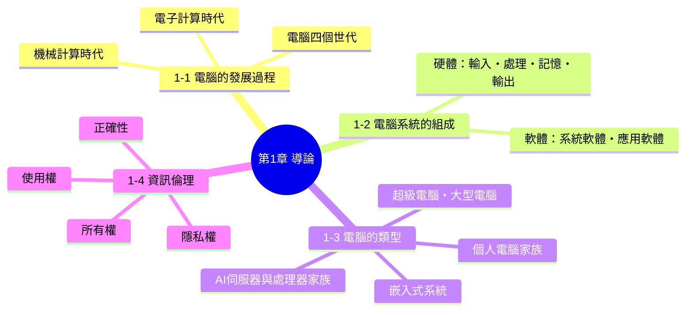
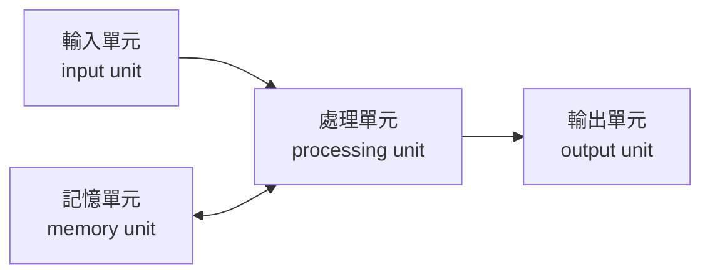
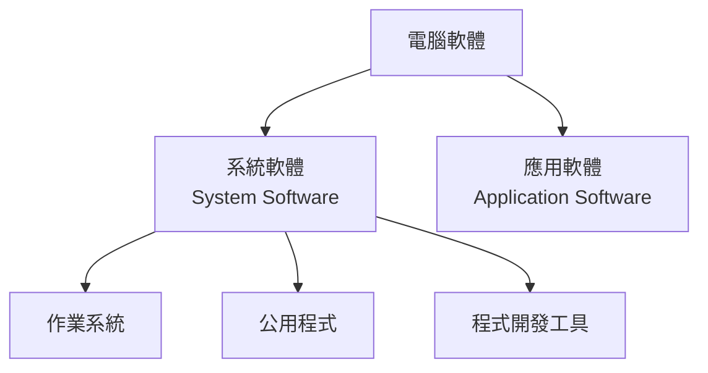

# 第 1 章　導論

> 本講義以《最新計算機概論》第十二版 第 1 章 PPT 的架構為骨架，重新撰寫為適合課堂詳細講解的完整教學文字稿。圖片素材取自原簡報，內文則大幅擴寫，加入故事脈絡、類比說明、範例與課堂討論問題，方便直接對照講解。

## 本章學習地圖

**這一章要帶學生想清楚三件事：**

1. 電腦不是憑空出現的，它是人類幾千年來想要「算得更快、算得更準」這個念頭，一步步累積出來的成果。
2. 不管電腦長什麼樣子——教室裡的桌上型電腦、口袋裡的手機、手腕上的智慧手錶——它們的核心運作邏輯永遠是「輸入 → 處理 → 輸出」，加上背後的「軟體」在指揮一切。
3. 電腦愈方便，責任愈大。學會使用電腦之前，更要學會尊重別人的隱私、資料與智慧財產。

---

## 1-1　電腦的發展過程

### 開場：想像一個沒有「計算工具」的世界

在正式介紹電腦之前，先讓學生想像一個情境：**如果你是三千年前的商人，要計算今天賣出多少匹布、收了多少銀兩，你會怎麼做？** 用手指頭數？在地上畫記號？這正是人類發明「計算工具」的起點——電腦的故事，其實就是一部「人類想辦法讓自己算得更快、更準、更省力」的歷史。

這段歷史大致可以分成兩個階段：

- **機械計算時代**：靠齒輪、木桿、卡片等純機械結構來輔助計算，還沒有用到電。
- **電子計算時代**：開始用真空管、電子訊號來運算，速度從此不可同日而語。

---

### 機械計算時代：從算盤到分析機

#### 西元前 3000 年｜中國算盤
<table>
<tr>
<td width="35%">

*中國算盤（圖片來源：維基百科）*

</td>
<td>

算盤可以說是人類最早、也是使用時間最長的計算工具，起源於中國，至今在珠算教學、部分市場交易中仍看得到它的身影。算盤的巧妙之處在於，它把「進位」這個抽象的數學概念，變成了看得見、摸得著的「珠子移動」——這其實已經具備了現代計算機「用實體元件表示數字狀態」的雛形精神。

</td>
</tr>
</table>

#### 1642 年｜巴斯卡（Blaise Pascal）與 Pascaline 齒輪計算機
<table>
<tr>
<td width="35%">
  

*Pascaline 齒輪計算機（圖片來源：維基百科）*

</td>
<td>

法國數學家 **Blaise Pascal** 當時年僅十幾歲，是為了幫在稅務機關工作、每天要處理大量加減法的父親分擔工作，才設計出這台以齒輪轉盤組成的機械式計算機 **Pascaline**。它可以自動處理「進位」——當某一位數字轉到 10 時，會自動帶動下一位數字前進一格，這個「進位」的機械原理，其實和我們今天計算機、汽車里程表的運作邏輯是一脈相承的。

</td>
</tr>
</table>

> **課堂小提醒**：Pascal 這個程式語言（Pascal 語言）就是後人為了紀念他而命名的，可以順帶連結到後面「第三代電腦」的高階語言介紹。

#### 1801 年｜賈卡（Joseph Jacquard）與提花織布機
<table>
<tr>
<td width="35%">

*Jacquard 提花織布機（圖片來源：維基百科）*

</td>
<td>

法國織布工人 **Joseph Jacquard** 發明了一種用「打孔卡片」控制織布圖案的織布機。卡片上打孔與否，決定了織線要往上還是往下——這其實就是最早的「二進位控制」概念：**有孔 / 無孔，等同於今天電腦裡的 1 / 0**。這個「用卡片上的孔洞來儲存與控制資訊」的想法，後來直接影響了打孔卡片計算機、甚至早期電腦程式的輸入方式。

</td>
</tr>
</table>

#### 1830～1833 年｜巴貝奇（Charles Babbage）的差分機與分析機
<table>
<tr>
<td width="35%">

*差分機（圖片來源：Science Museum London）*

</td>
<td>

英國數學家 **Charles Babbage** 常被稱為「電腦之父」。1830 年，他設計了**差分機（Difference Engine）**，目的是要用機械取代人工計算數學表格（例如航海用的對數表），因為當時人工計算的表格錯誤百出，甚至造成船隻失事。

</td>
</tr>
<tr>
<td width="35%">

*分析機（圖片來源：維基百科）*

</td>
<td>

1833 年，巴貝奇進一步構想出更先進的**分析機（Analytical Engine）**。分析機的劃時代之處在於，它已經具備了現代電腦的基本架構雛形：用打孔卡片輸入「資料」與「運算指令」、有儲存數字的「儲存庫」（相當於今天的記憶體）、有負責運算的「運算室」（相當於今天的 CPU）。可惜受限於當時的工藝技術，分析機終其一生都沒有真正完整打造出來，但它的設計理念比實際做出電腦早了超過一百年。

</td>
</tr>
</table>

> **人物補充**：詩人拜倫的女兒 **Ada Lovelace** 曾為分析機寫下一套運算流程，被公認是史上第一位「程式設計師」，這也是程式語言 **Ada** 命名的由來。

#### 1890 年｜霍列瑞斯（Herman Hollerith）與打孔卡片製表機器

<table>
<tr>
<td width="35%">

*圖片來源：www.computerhistory.org*

</td>
<td>

美國的人口普查在 1880 年代面臨一個大麻煩：人工統計一次全國人口普查竟然要花上將近 8 年，等統計完，下一次普查都快到了。美國科學家 **Herman Hollerith** 從賈卡織布機的打孔卡片得到靈感，設計出用電力驅動的**打孔卡片製表機器**，把人口普查的統計時間從 8 年大幅縮短到約 1 年。Hollerith 後來成立的公司，幾經合併，最終演變成今天赫赫有名的 **IBM（國際商業機器公司）**。

</td>
</tr>
</table>

---

### 電子計算時代：從 ABC 到 UNIVAC

機械計算機的極限，在於「機械結構的運轉速度」怎麼樣都比不上「電子訊號的傳遞速度」。1940 年代，隨著電子學的發展，人類終於跨入了用電子訊號運算的時代。

<table>
<tr>
<td width="25%">

</td>
<td>

**1942 年｜ABC 電腦**
美國愛荷華州立大學教授 **John V. Atanasoff** 與研究生 **Clifford E. Berry** 建造出世界第一台**電子式數位電腦 ABC**（Atanasoff-Berry Computer）。它雖然還不能像現代電腦一樣「儲存程式」，但已經用真空管取代機械齒輪來運算，運算速度比純機械式裝置快上許多。

</td>
</tr>
<tr>
<td width="25%">

</td>
<td>

**1944 年｜Mark I 電腦**
美國哈佛大學教授 **Howard Aiken** 建造的 **Mark I**，是一台結合了機械與電子元件的「電子機械式電腦」，體積龐大（長度超過 15 公尺），主要用於美國海軍的彈道計算。

</td>
</tr>
<tr>
<td width="25%">

</td>
<td>

**1946 年｜ENIAC 電腦**
美國軍方為了計算火砲的彈道表，邀請賓州大學教授 **John W. Mauchly** 與 **J. Presper Eckert Jr.** 建造了 **ENIAC**（Electronic Numerical Integrator And Computer）。ENIAC 用了將近 18,000 支真空管，佔地約 170 平方公尺、重達 30 噸，是公認第一台「泛用型」電子計算機——意思是它不像 ABC 只能做特定計算，而是可以透過重新配線來處理不同的計算任務。

</td>
</tr>
<tr>
<td width="25%">

</td>
<td>

**1951 年｜UNIVAC 電腦**
UNIVAC 是第一台**商用**電腦，美國人口普查局在 1951 年用它完成全美人口普查，也是電腦第一次真正走出實驗室、進入政府與企業的日常作業。1952 年，UNIVAC 甚至還成功「預測」了美國總統大選的結果，讓社會大眾第一次感受到電腦運算的威力。

</td>
</tr>
</table>

> **課堂討論**：從算盤到 UNIVAC，橫跨了將近 5000 年；但從 ABC 電腦（1942）到 UNIVAC（1951），只花了不到 10 年。請學生想一想：**為什麼「電子化」之後，技術進步的速度突然變快了？**（提示：可以連結後面「電腦四個世代」的元件微縮化來回答。）

---

### 電腦的四個世代：元件愈做愈小，能力愈來愈強

電腦發明之後，並沒有停止進化。學界通常以「構成電腦運算核心的關鍵元件」作為劃分世代的依據——因為元件的材質，直接決定了電腦的速度、體積、耗電量與價格。

| | 第一代 | 第二代 | 第三代 | 第四代 |
|---|---|---|---|---|
| **時期** | 1946～1955 | 1956～1963 | 1964～1970 | 1971～現在 |
| **關鍵元件** | 真空管 | 電晶體 | 積體電路（IC） | 超大型積體電路（VLSI） |
| **程式語言** | 機器語言（0與1） | 組合語言／早期高階語言（FORTRAN、COBOL…） | 高階語言（Pascal、BASIC…） | 高階語言（C、C++、Java、Python…） |

<table>
<tr>
<td width="25%"> <i>真空管</i></td>
<td>

**第一代｜真空管（Vacuum Tube）**
真空管利用電子在真空玻璃管內的流動來控制訊號，是最早能做電子開關的元件。缺點很明顯：**體積大、耗電量驚人、發熱嚴重，而且非常容易故障**——據說 ENIAC 平均每隔幾分鐘就會有一支真空管燒壞，需要專人巡邏更換。

</td>
</tr>
<tr>
<td width="25%"> <i>電晶體</i></td>
<td>

**第二代｜電晶體（Transistor）**
1947 年貝爾實驗室發明電晶體後，工程師發現它可以做到和真空管一樣的「開關」功能，但**體積只有指甲片大小、耗電量大幅降低、也更耐用**。電腦第一次有機會做得比一個房間小。

</td>
</tr>
<tr>
<td width="25%"> <i>積體電路</i></td>
<td>

**第三代｜積體電路 IC（Integrated Circuit）**
工程師想到：既然電晶體已經很小了，那能不能把好幾個電晶體、甚至整個電路，直接「印」在同一小片矽晶片上？這就是積體電路。IC 讓電腦的體積再度大幅縮小，速度更快、成本也更低，個人電腦開始有機會走入一般家庭與辦公室。

</td>
</tr>
<tr>
<td width="25%"> <i>微處理器（VLSI的代表產品）</i></td>
<td>

**第四代｜超大型積體電路 VLSI（Very Large Scale Integration）**
隨著半導體製程技術突飛猛進，工程師能在**一片指甲大小的晶片上塞入數十億顆電晶體**，這正是我們現在用的微處理器（CPU）。VLSI 的出現，直接催生了個人電腦、筆記型電腦，一路發展到今天口袋裡的智慧型手機。

</td>
</tr>
</table>

**這條演進路線給我們的啟示是：**

> 體積更小 → 速度更快 → 價格更低 → 耗電更省
>
> 這四個「更」，正是電腦從軍方、政府專屬的龐然大物，一路「飛入尋常百姓家」，變成人手一機的關鍵原因。

---

## 1-2　電腦系統的組成

### 開場：電腦系統 = 硬體（身體）＋ 軟體（靈魂）

可以先問學生一個問題：**「你覺得一台沒有安裝任何軟體、也沒有連網路的電腦，開機之後能做什麼？」** 答案是：幾乎什麼都不能做。

這正是這一節要帶出的核心觀念——一部完整能運作的電腦系統，缺一不可地包含兩個部分：

- **硬體（Hardware）**：看得到、摸得到的實體裝置，好比人的「身體」——有手（輸入）、有腦（處理）、有記憶（大腦皮質）、有嘴巴（輸出）。
- **軟體（Software）**：看不到、摸不到，但真正指揮身體該做什麼事的「靈魂」與「知識」。

---

### 1-2-1　硬體：電腦的身體

電腦硬體不論品牌、不論大小，基本組成都可以歸納成四個單元，資料就在這四個單元之間流動：

**用一個生活例子把這張圖說清楚**：當你在電腦上打一份報告——

1. 你的手指敲打鍵盤（**輸入單元**接收「按了哪個鍵」這個資料）
2. CPU（**處理單元**）判斷這個按鍵應該顯示成哪個文字
3. 這個過程中，還沒存檔的文字暫時被放在**記憶單元**（RAM）裡
4. 處理完的結果被送到螢幕（**輸出單元**），你才看得到自己剛剛打了什麼字

<table>
<tr>
<td width="25%"></td>
<td>

**① 輸入單元（Input Unit）**

負責接收外部世界的資料，並轉換成電腦看得懂的格式（0與1），送給處理單元運算。

**常見裝置**：鍵盤、滑鼠、掃描器、觸控螢幕、麥克風、攝影機、讀卡機

</td>
</tr>
<tr>
<td width="25%"></td>
<td>

**② 處理單元（Processing Unit）**

就是俗稱的「中央處理器」**CPU（Central Processing Unit）**，是電腦的運算核心，所有的算術運算（加減乘除）與邏輯運算（比較大小、真假判斷）都由它負責執行，可以說是電腦的「大腦」。CPU 的運算速度，往往是決定一台電腦「快不快」的最關鍵指標。

</td>
</tr>
<tr>
<td width="25%">
 

</td>
<td>

**③ 記憶單元（Memory Unit）**

負責儲存處理單元運算時所需要的資料／程式，以及運算完畢的結果。記憶單元又可以分成兩種，這裡是學生很容易搞混的地方，建議特別強調對比：

| | 主記憶體（RAM） | 輔助記憶體 |
|---|---|---|
| 常見裝置 | 記憶體模組（如上圖 Kingston） | 硬碟、SSD（如上圖 WD） |
| 特性 | 存取速度快，但**關機後資料會消失** | 存取速度較慢，但**關機後資料仍保留** |
| 比喻 | 像是你「正在使用」的辦公桌桌面 | 像是「長期存放」文件的檔案櫃 |

</td>
</tr>
<tr>
<td width="25%"></td>
<td>

**④ 輸出單元（Output Unit）**

負責把處理單元運算完畢、電腦看得懂的資料（0與1），轉換成人類能理解的文字、圖形、聲音與視訊，並且呈現出來。

**常見裝置**：螢幕、印表機、喇叭、投影機

</td>
</tr>
</table>

---

### 1-2-2　軟體：電腦的靈魂

有了硬體之後，電腦還需要「指令」才知道該做什麼事，這些指令的集合就是**軟體（Software）**。電腦軟體可以分成兩大類型：

#### 系統軟體（System Software）

系統軟體是「管理硬體、伺候應用軟體」的幕後功臣，使用者通常不會直接感受到它的存在，但少了它，電腦寸步難行。系統軟體又包含三種：

- **作業系統（Operating System, OS）**：系統軟體中最核心的一種，負責管理硬體資源（CPU、記憶體、儲存空間）、管理檔案、提供使用者操作介面。常見的作業系統有 Windows、macOS、Linux、Android、iOS。
- **公用程式（Utility）**：協助維護、優化電腦系統的小工具，例如防毒軟體、磁碟重組工具、壓縮軟體。
- **程式開發工具**：讓工程師撰寫、除錯、編譯程式所使用的工具，例如編譯器（Compiler）、整合開發環境（IDE）。

<table>
<tr>
<td width="45%">

*Windows 作業系統屬於系統軟體*

</td>
<td width="45%">

*Word 文書處理軟體屬於應用軟體*

</td>
</tr>
</table>

#### 應用軟體（Application Software）

應用軟體是使用者為了完成「特定實際工作」而使用的軟體，例如：

- 文書處理：Word
- 簡報：PowerPoint
- 試算表：Excel
- 瀏覽器：Chrome、Edge、Safari
- 多媒體娛樂：影音播放器、繪圖軟體、遊戲

> **課堂小技巧**：可以請學生現場判斷「這是系統軟體還是應用軟體？」──例如「掃毒軟體」「LINE」「檔案總管」「小畫家」，訓練他們用定義去分類，而不是死背。**判斷關鍵句：這個軟體是在「管理電腦本身」，還是在「幫我完成一件具體的事」？**

---

## 1-3　電腦的類型

### 開場：電腦不是只有「桌上型電腦」一種樣子

問學生：**「你今天已經用過幾種電腦了？」** 答案通常會讓他們嚇一跳——手機是電腦、智慧手錶是電腦、公車的到站系統是電腦、教室的冷氣搖控也可能內建電腦。電腦的分類，一般是依照**運算能力、體積大小、使用場景**來區分。

### 依運算規模由大到小

<table>
<tr>
<td width="30%"></td>
<td>

**1-3-1　超級電腦（Supercomputer）**

功能最強、執行速度最快的電腦，每秒鐘能夠執行數兆個運算。造價極為昂貴，通常只有國家級單位或大型機構才有能力使用，應用在需要極大量運算的領域，例如： **武器研發、天氣預測、生物實驗、新藥開發、航太科技、能源探勘、地質分析、天文研究** 。可以跟學生強調：超級電腦不是「一台很貴的個人電腦」，而是把成千上萬個處理器連結起來協同運算的龐大系統。

</td>
</tr>
<tr>
<td width="30%"></td>
<td>

**1-3-2　大型電腦（Mainframe）**

從 IBM System/360 開始發展的一系列電腦，功能與速度僅次於超級電腦，最大特色是**內建多層次的安全措施，能夠同時服務非常多位使用者**，提供集中式的資料儲存與處理。適合金融業、保險業、航空業、製造業、政府單位等需要同時處理大量交易、且對穩定性要求極高的機構——例如你每天刷的提款卡、訂的機票，背後很可能就是大型電腦在支撐。

</td>
</tr>
</table>

### 1-3-3　個人電腦（PC, Personal Computer）家族

個人電腦是指在**功能、速度、大小及價格**等方面，適合個人使用的電腦。隨著技術演進，個人電腦已經分裂成一個龐大的家族：

<table>
<tr>
<td width="22%"> <b>桌上型電腦</b></td>
<td>由主機、螢幕、鍵盤、滑鼠等周邊組成，為固定在桌上使用而設計。其中專為高運算需求的遊戲玩家設計、配備高階硬體的機型，稱為電競電腦（Gaming Computer）。</td>
</tr>
<tr>
<td width="22%"> <b>工作站</b></td>
<td>運算能力強大的高階桌上型電腦，適合從事財務分析、電腦動畫、工程設計、軟體開發等對運算資源要求較高的專業工作。</td>
</tr>
<tr>
<td width="22%"> <b>AI PC</b></td>
<td>具備人工智慧功能的 PC，通常內建 AI 晶片，例如 GPU（圖形處理器）、NPU（神經處理器），讓 AI 模型與應用可以直接在本機端運行，不必事事都連到雲端伺服器。</td>
</tr>
<tr>
<td width="22%"> <b>筆記型電腦</b></td>
<td>內建螢幕與鍵盤的可攜式個人電腦（notebook、laptop）。為了方便攜帶，機體必須輕巧、穩定性高、電池續航力長，並支援無線通訊。</td>
</tr>
<tr>
<td width="22%"> <b>行動裝置</b></td>
<td>輕便、可攜式，通常以觸控、手寫或語音輸入的電子設備，小到可放進口袋。支援無線通訊、電話、簡訊、瀏覽網頁、電子郵件、影音多媒體、照相、GPS 等功能，例如智慧型手機、平板電腦、電子閱讀器。</td>
</tr>
<tr>
<td width="22%"> <b>穿戴式裝置</b></td>
<td>將行動裝置的功能移植到可穿戴的裝置上，常見的有智慧眼鏡、智慧手錶、智慧手環、智慧服飾、智慧運動鞋等。</td>
</tr>
</table>

> **補充分類角度**：除了依「功能／體積」分類，個人電腦也可以依**系統架構**分為「IBM 相容 PC」與「麥金塔（Mac）」兩大陣營，這是另一條可以跟學生延伸討論的分類軸線。

### 1-3-4　嵌入式系統（Embedded System）

<table>
<tr>
<td width="30%"></td>
<td>

生活中有許多「只做某些特定工作」的特殊用途電腦，例如遊戲機、冷氣、冰箱、智慧家電、車用電子產品、醫療監視儀器、交通號誌等。這些電子產品內部都嵌入了微處理器來加以控制，這種**專為特定功能設計、深藏在產品內部運作**的電腦系統，就稱為嵌入式系統。

**判斷關鍵**：嵌入式系統通常「使用者感覺不到它是電腦」——你不會覺得自己在「操作一台電腦」去開冷氣，但冷氣裡確實有一顆微處理器在運算溫度、風速與時間。

</td>
</tr>
</table>

---

### 資訊部落：AI 伺服器、CPU、GPU、NPU 與 TPU

<table>
<tr>
<td width="45%">

*搭載 GB300 NVL72 的 AI 伺服器（圖片來源：ASUS）*

</td>
<td width="45%">

*Blackwell GPU（圖片來源：輝達）*

</td>
</tr>
</table>

隨著人工智慧（AI）快速發展，「一般伺服器」已經不夠用了。**AI 伺服器**是專為訓練與部署 AI 模型所設計的高性能運算設備，針對 AI 訓練及推論進行最佳化，和一般伺服器最主要的差異，就在於它搭載了強大的 CPU、GPU 或專用的 AI 晶片。以下四種處理器，很適合用「分工」的角度來跟學生說明差異：

| 處理器 | 全名 | 最擅長的工作 | 生活比喻 |
|---|---|---|---|
| **CPU** | Central Processing Unit（中央處理器） | 負責「通用型」運算，一次把一件複雜的事情做好、做對，指令執行順序很重要 | 像一位經驗豐富的總經理，什麼事都能處理，但一次只能專心做少數幾件事 |
| **GPU** | Graphics Processing Unit（圖形處理器） | 原本設計來處理畫面上成千上萬個像素的平行運算，後來被發現非常適合 AI 訓練所需要的大量矩陣運算 | 像一大群工讀生，每人只會做簡單的事，但人數眾多、可以同時開工，適合「量大且重複」的工作 |
| **NPU** | Neural Processing Unit（神經處理器） | 專門為「類神經網路」運算而設計的晶片，讓 AI 模型可以在手機、筆電等終端裝置上，用更省電的方式直接運行 | 像一位只會做「一種專業手術」的專科醫師，做那件事特別快、特別省力 |
| **TPU** | Tensor Processing Unit（張量處理器） | Google 設計的專用晶片，針對深度學習中的「張量（Tensor）運算」做極致優化，多用於雲端 AI 訓練與推論 | 像一條專門生產單一產品的自動化生產線，效率極高但彈性較低 |

> **課堂類比總結**：CPU 是「什麼都會、但一次做不了太多」的通才；GPU／NPU／TPU 則是「只做一種事，但可以海量同時進行」的專才。AI 之所以近年突飛猛進，很大一部分原因就是工程師學會了用 GPU 這種「大量平行運算」的架構，去加速 AI 訓練所需要的大量矩陣計算。

---

## 1-4　資訊倫理

### 開場：能力愈大，責任愈大

電腦與網路讓我們能做到過去做不到的事——瞬間把訊息傳到世界另一端、無限次複製一份檔案、搜尋到幾乎任何人的公開資訊。但這些「超能力」，也讓濫用資訊科技造成的傷害，比過去大上非常多倍。這正是為什麼我們需要認識**資訊倫理**。

**倫理（ethics）** 指的是定義個人或群體行為的道德標準，而 **資訊倫理（computer ethics）** 就是和資訊相關的道德標準——當法律還來不及規範新科技帶來的新問題時，倫理往往是我們判斷「這件事該不該做」的第一道防線。

### PAPA：資訊時代的四項倫理課題

資訊倫理涉及下列四個議題，簡稱為 **PAPA**，源自 **Richard O. Mason** 所提出的論文《Four Ethical Issues of the Information Age》：

<table>
<tr>
<td width="12%" align="center"><h2>P</h2></td>
<td width="38%"><b>隱私權 Privacy</b></td>
<td width="50%">個人資料是否被合法蒐集、使用與保護？</td>
</tr>
<tr>
<td colspan="3">

**思考問題**：App 要求存取你的通訊錄、相簿、定位，你會直接按「同意」嗎？學校的監視器拍到的畫面，可以隨意公開嗎？

**案例**：某網站在使用者不知情的狀況下，蒐集瀏覽紀錄並轉賣給廣告商；有心人士側錄、跟蹤他人的社群動態。

</td>
</tr>
<tr>
<td align="center"><h2>A</h2></td>
<td><b>正確性 Accuracy</b></td>
<td>所提供的資訊是否真實正確？</td>
</tr>
<tr>
<td colspan="3">

**思考問題**：在社群媒體上看到一則聳動的新聞，轉發之前你會先查證嗎？AI 產生的內容一定正確嗎？

**案例**：假新聞、竄改過的圖片或數據、未經查證就大量轉傳的謠言，都可能對個人名譽或社會信任造成嚴重傷害。

</td>
</tr>
<tr>
<td align="center"><h2>P</h2></td>
<td><b>所有權 Property</b></td>
<td>資訊、軟體與數位內容的智慧財產權歸屬？</td>
</tr>
<tr>
<td colspan="3">

**思考問題**：下載盜版電影、使用破解版軟體，真的「沒有受害者」嗎？把別人的圖片或文章直接複製貼上當作自己的作業，算不算侵權？

**案例**：非法下載音樂、影片；使用未經授權的盜版軟體；抄襲他人著作。

</td>
</tr>
<tr>
<td align="center"><h2>A</h2></td>
<td><b>使用權 Accessibility</b></td>
<td>什麼樣的人在什麼情況下可以取得與使用資訊？</td>
</tr>
<tr>
<td colspan="3">

**思考問題**：住在偏鄉、家裡沒有網路的同學，跟都市裡人手一台平板的同學，在「資訊近用」上是平等的嗎？

**案例**：數位落差（Digital Divide）——弱勢族群、偏鄉地區、身心障礙人士，可能因為經濟或環境限制，無法平等地取得與使用數位資訊，進而在教育、就業上處於劣勢。

</td>
</tr>
</table>

> **參考資源**：可搭配《教育部校園網路使用規範》，作為課堂上討論校園情境的實際依據。

### 課堂延伸討論（可作隨堂提問或小組討論）

1. 你曾經在網路上分享過朋友的照片嗎？分享之前有沒有先問過對方？這牽涉到 PAPA 中的哪一項？
2. 如果你在網路上看到一則「未經查證、但看起來很驚人」的新聞，你會怎麼做？
3. 你是否用過盜版軟體或非法下載的影片／音樂？如果知道創作者可能因此收不到應得的報酬，你的想法會不會改變？
4. 如果你是政府官員，要如何幫助偏鄉地區的孩子，享有和都市孩子一樣的資訊近用權？

---

## 本章總結

| 小節 | 核心觀念一句話 |
|---|---|
| 1-1 電腦的發展過程 | 電腦是人類從機械計算走向電子計算、元件不斷微縮化的長期演進成果 |
| 1-2 電腦系統的組成 | 硬體（輸入‧處理‧記憶‧輸出）負責「做事」，軟體（系統軟體‧應用軟體）負責「指揮」 |
| 1-3 電腦的類型 | 從超級電腦到穿戴式裝置、嵌入式系統，電腦依運算規模與使用場景發展出龐大家族 |
| 1-4 資訊倫理 | 使用資訊科技，同時要對隱私權、正確性、所有權、使用權（PAPA）負起責任 |

### 關鍵詞彙表（Glossary）

`算盤` `Pascaline` `差分機` `分析機` `打孔卡片` `ABC電腦` `Mark I` `ENIAC` `UNIVAC` `真空管` `電晶體` `積體電路 IC` `超大型積體電路 VLSI` `輸入單元` `處理單元` `記憶單元` `輸出單元` `CPU` `RAM` `系統軟體` `應用軟體` `作業系統` `超級電腦` `大型電腦` `個人電腦` `工作站` `AI PC` `嵌入式系統` `GPU` `NPU` `TPU` `資訊倫理` `PAPA`

---

## 第 1 章　學習評量
 
> 以下為課本第 1 章隨附之官方學習評量，題目逐字謄錄。答案為課本官方解答，並在其下補充**完整解說**，方便課堂上直接點開講解、對答案。
 
### 一、選擇題
 
**1. 第二代電腦與第三代電腦的分野是發明了什麼技術？**
A. 超大型積體電路　B. 電晶體　C. 積體電路　D. 真空管
 

▶ 參考答案與解說

**答案：C　積體電路（IC）**
 
四個世代的分野，是依「構成電腦運算核心的關鍵元件」來劃分：第一代真空管、第二代電晶體、第三代積體電路（IC）、第四代超大型積體電路（VLSI）。因此第二代與第三代之間的分野，就是「積體電路」的發明——工程師把好幾個電晶體、甚至整個電路，直接「印」在同一片矽晶片上，讓電腦體積再度大幅縮小、速度更快、成本更低。
 

---
 
**2. 根據由早到晚的順序寫出後述元件的演進過程：(1) VLSI (2) 電晶體 (3) 真空管 (4) IC**
A. 1234　B. 3412　C. 3241　D. 3214
 

▶ 參考答案與解說

**答案：C　3241**
 
正確的時間順序是：**(3) 真空管 → (2) 電晶體 → (4) IC → (1) VLSI**，對應第一代到第四代電腦。記憶技巧：元件是「愈做愈小、愈做愈密集」——真空管像燈泡一樣大，電晶體縮小到指甲片大小，IC 把好幾顆電晶體印在一片晶片上，VLSI 則是在同一片晶片上塞進數十億顆電晶體，順序自然就是由大到小、由少到多。
 

---
 
**3. 下列對於電腦未來發展的敘述何者錯誤？**
A. 體積愈來愈小　B. 速度愈來愈快　C. 重量愈來愈輕　D. 耗電量愈來愈大
 

▶ 參考答案與解說

**答案：D　耗電量愈來愈大（此為錯誤敘述）**
 
從電腦四個世代的演進趨勢來看，元件微縮化帶來的是「體積更小、速度更快、價格更低、**耗電更省**」，而不是耗電量愈來愈大。雖然近年 AI 資料中心整體用電量因為算力需求暴增而大幅上升，但那是「總體用電量」的議題（屬於本章末段負面影響中的環保爭議），並不是題目所問的「單一元件／裝置」耗電趨勢——就元件本身而言，愈新的技術通常愈省電。
 

---
 
**4. 電腦硬體的基本組成不包括下列哪個單元？**
A. 處理單元　B. 快取單元　C. 記憶單元　D. 輸入單元
 

▶ 參考答案與解說

**答案：B　快取單元**
 
電腦硬體的基本組成只有四個單元：**輸入單元、處理單元、記憶單元、輸出單元**。快取（Cache）其實是存在於 CPU 內部、用來加速資料存取的一種高速小型記憶體，屬於「處理單元」或「記憶單元」內部更細部的設計，並不是與這四大單元並列的獨立基本單元，因此本題答案選 B。
 

---
 
**5. 下列何者不屬於電腦的輸出單元？**
A. 螢幕　B. 印表機　C. 喇叭　D. 固態硬碟
 

▶ 參考答案與解說

**答案：D　固態硬碟**
 
螢幕、印表機、喇叭都是把電腦運算結果轉換成人類看得懂／聽得懂的形式（文字、圖形、聲音）並呈現出來的裝置，屬於輸出單元。固態硬碟（SSD）則是用來**長期儲存資料**的輔助記憶體，屬於記憶單元的一種，不是輸出裝置——判斷關鍵是「這個裝置的功能是呈現資料，還是儲存資料？」
 

---
 
**6. 下列哪種活動往往需要連線到大型電腦？**
A. 列印文件　B. 製作投影片　C. 播放音樂　D. 從 ATM 櫃員機提款
 

▶ 參考答案與解說

**答案：D　從 ATM 櫃員機提款**
 
大型電腦（Mainframe）的特色是內建多層次安全措施、能同時服務大量使用者，並提供集中式的資料儲存與處理，特別適合金融業等需要同時處理大量交易且穩定性要求極高的機構。當你用 ATM 提款時，銀行需要即時查核你的帳戶餘額、扣款、更新交易紀錄，這些工作背後往往就是由銀行的大型電腦系統在支撐。列印文件、製作投影片、播放音樂則是個人電腦就能獨立完成的日常工作，不需要連線到大型電腦。
 

---
 
**7. 下列何者不是超級電腦的用途？**
A. 天氣預測　B. 彈道模擬　C. 武器研發　D. 車載系統
 

▶ 參考答案與解說

**答案：D　車載系統**
 
超級電腦（Supercomputer）是功能最強、執行速度最快的電腦，應用在需要極大量運算的領域，例如天氣預測、彈道模擬、武器研發、生物實驗、新藥開發、航太科技等。車載系統（例如汽車的行車電腦、advanced driver-assistance system）是嵌入在汽車內部、專門負責特定功能（如引擎控制、防鎖死煞車）的**嵌入式系統**，運算規模與超級電腦完全不在同一等級，因此不屬於超級電腦的用途。
 

---
 
**8. 歷史上第一位程式設計師是誰？**
A. Steve Jobs　B. Bill Gates　C. Ada Lovelace　D. Thomas J. Watson
 

▶ 參考答案與解說

**答案：C　Ada Lovelace**
 
Ada Lovelace 是詩人拜倫的女兒，她為 Charles Babbage 設計的分析機（Analytical Engine）寫下了一套完整的運算流程（可視為早期的「演算法」），被公認為史上第一位程式設計師。後人也用她的名字命名了程式語言 **Ada**。Steve Jobs 是蘋果公司創辦人、Bill Gates 是微軟創辦人、Thomas J. Watson 是 IBM 早期的重要領導者，三者的貢獻性質都與「撰寫程式」不同。
 

---
 
**9. 下列何者違反網路應用倫理守則？**
A. 不隨意破解他人的密碼　B. 善用電子郵件發送大量廣告　C. 對自己的言論負責　D. 不以訛傳訛
 

▶ 參考答案與解說

**答案：B　善用電子郵件發送大量廣告**
 
「不隨意破解他人密碼」「對自己言論負責」「不以訛傳訛」都是良好的網路使用倫理（分別對應隱私權、言論責任、資訊正確性）。而「發送大量廣告郵件」，即使加上「善用」二字修飾，本質上仍是未經他人同意、大量佔用他人信箱資源的**濫發垃圾郵件（Spam）**行為，這正是網路倫理明文禁止的行為之一，因此本題要選出的「違反」項目是 B。
 

---
 
**10. 四核心微處理器使用下列哪種元件？**
A. 超大型積體電路　B. 電晶體　C. 積體電路　D. 真空管
 

▶ 參考答案與解說

**答案：A　超大型積體電路（VLSI）**
 
現代的微處理器（例如四核心、八核心 CPU）在一片指甲大小的晶片上塞入數十億顆電晶體，這正是第四代電腦「超大型積體電路 VLSI」的技術特徵。電晶體、積體電路則是更早期、整合密度遠遠不及 VLSI 的技術。
 

---
 
**11. 下列何者指的是蝕刻在硬體中的軟體？**
A. 區塊鏈　B. 韌體　C. 記憶體　D. 電晶體
 

▶ 參考答案與解說

**答案：B　韌體（Firmware）**
 
韌體是一種預先寫入、燒錄在硬體晶片（如唯讀記憶體 ROM）中的軟體，用來控制硬體裝置最基本的運作邏輯，例如電腦主機板上的 BIOS／UEFI、印表機或路由器內部的控制程式。因為它「介於硬體與軟體之間、直接蝕刻於硬體上」，所以常被形容為「蝕刻在硬體中的軟體」。區塊鏈是一種分散式帳本技術、記憶體是儲存資料的硬體、電晶體是構成電路的基本元件，三者皆與題意不符。
 

---
 
**12. 人工智慧技術可以應用到下列何者？**
A. 自駕車　B. 自然語言處理　C. 機器人　D. 以上皆是
 

▶ 參考答案與解說

**答案：D　以上皆是**
 
人工智慧的應用範圍非常廣泛：自駕車需要 AI 進行即時影像辨識與決策；自然語言處理（NLP）讓電腦能理解、生成人類語言（如聊天機器人、翻譯軟體）；機器人則結合感測、控制與 AI 決策來執行任務。三者皆是目前 AI 技術實際落地應用的重要領域，因此答案選 D。
 

---
 
**13. 下列何者原本專門用來處理圖形運算，近年亦被用來訓練 AI 模型？**
A. CPU　B. GPU　C. NPU　D. ALU
 

▶ 參考答案與解說

**答案：B　GPU**
 
GPU（Graphics Processing Unit，圖形處理器）原本是為了平行處理畫面上成千上萬個像素而設計，後來工程師發現這種「大量平行運算」的架構，非常適合 AI 訓練所需要的大量矩陣運算，因此近年被大量用於 AI 模型訓練。CPU 是通用型處理器；NPU 是「一開始就為 AI 而生」的神經處理器，並非「原本用於圖形運算」；ALU（算術邏輯單元）則是 CPU 內部負責執行運算的元件，並非獨立的處理器晶片。
 

---
 
**14. 下列何者不屬於電腦的輸入單元？**
A. 觸控板　B. 滑鼠　C. 投影機　D. 電競耳麥
 

▶ 參考答案與解說

**答案：C　投影機**
 
觸控板、滑鼠是把使用者的操作動作轉換成電腦看得懂的資料，屬於輸入裝置；電競耳麥同時具備麥克風（輸入語音）功能，也常被歸類在輸入裝置。投影機則是把電腦運算完的畫面「放大呈現」給使用者看的裝置，功能是呈現資料而非接收資料，因此屬於**輸出單元**，不屬於輸入單元。
 

---
 
**15. ns（奈秒）為 10 的幾次方秒？**
A. -3　B. -6　C. -9　D. -12
 

▶ 參考答案與解說

**答案：C　10⁻⁹**
 
常見的時間單位換算：毫秒（ms）= 10⁻³ 秒、微秒（μs）= 10⁻⁶ 秒、**奈秒（ns）= 10⁻⁹ 秒**、皮秒（ps）= 10⁻¹² 秒。奈秒常用來描述電腦運算的極短時間單位，例如記憶體的存取速度，就常以奈秒為單位來衡量。
 

### 二、簡答題
 
**1. 簡單說明第一代到第四代電腦之間的分野。**
 

▶ 參考答案

第一代電腦是由**真空管**所組成，第二代電腦是由**電晶體**所組成，第三代電腦是由**積體電路（IC）**所組成，第四代電腦是由**超大型積體電路（VLSI）**所組成。元件不斷微縮化，也帶來「體積更小、速度更快、價格更低、耗電更省」的共同趨勢。
 

---
 
**2. 簡單說明電腦硬體的基本組成包括哪四個單元？各舉出一個實例。**
 

▶ 參考答案

電腦硬體的基本組成包括下列四個單元：
 
- **輸入單元（input unit）**：負責接收外面的資料，然後傳送給處理單元做運算，例如**鍵盤、滑鼠**。
- **處理單元（processing unit）**：負責執行算術與邏輯運算，例如 **Intel Core 系列 CPU**。
- **記憶單元（memory unit）**：負責儲存資料，例如**主記憶體**。
- **輸出單元（output unit）**：負責將處理單元運算完畢的資料呈現出來，例如**螢幕、印表機**。

---
 
**3. 簡單說明電腦軟體可以分為哪兩種類型？各舉出一個實例。**
 

▶ 參考答案

電腦軟體可以分成下列兩種類型：
 
- **系統軟體（system software）**：支援電腦運作的程式，包括作業系統、公用程式和程式開發工具，例如 **Microsoft Windows**。
- **應用軟體（application software）**：針對特定事務或工作所撰寫的程式，目的是協助使用者解決問題，例如 **Microsoft Office**。

---
 
**4. 簡單說明何謂超級電腦、大型電腦、AI 伺服器。**
 

▶ 參考答案與完整解說

- **超級電腦（Supercomputer）**：功能最強、執行速度最快的電腦，每秒鐘能夠執行數兆個運算，造價昂貴，通常只有國家級單位或大型機構才可能使用，用來進行大量儲存與高速運算，例如武器研發、天氣預測、生物實驗、新藥開發、航太科技、能源探勘、地質分析、天文研究等。
- **大型電腦（Mainframe）**：指的是從 IBM System/360 開始發展的一系列電腦，功能及執行速度僅次於超級電腦，內建多層次的安全措施，能夠同時服務多位使用者，提供集中式的資料儲存與處理功能，適合金融業、保險業、航空業、製造業、政府單位等機構，用來執行大規模的工作。
- **AI 伺服器**：是為了訓練與部署 AI 模型所設計的高性能運算設備，針對 AI 訓練及推論進行優化，和一般伺服器主要的差異在於搭載強大的 CPU、GPU 或專用的 AI 晶片（例如 NPU、TPU），以應付 AI 模型所需要的大量平行運算。
**三者的關係可以這樣理解**：超級電腦與大型電腦的分類方式，是依「運算規模與服務對象」（極致科學運算 vs. 大量多人交易）來區分；AI 伺服器則是近年因應 AI 浪潮，特別針對「AI 模型訓練與推論」這項任務所發展出來的新一代高性能運算設備，三者的服務對象與最佳化目標各有不同。
 

---
 
**5. 仔細閱讀「教育部校園網路使用規範」，想想看，透過 P2P 軟體下載 MP3 音樂是否違反資訊倫理？**
 

▶ 參考答案與完整解說

**答案：是，這樣的行為通常違反資訊倫理，特別是 PAPA 架構中的「所有權（Property）」議題。**
 
**完整說明**：
 
1. **著作權歸屬問題**：音樂作品是創作者投入大量心血完成的智慧財產，受著作權法保護。除非該 MP3 檔案是創作者主動授權免費分享，或已進入公共領域，否則未經授權下載受著作權保護的音樂，就是在**未付出任何代價的情況下，取得他人享有著作權的作品**，屬於典型的侵犯智慧財產權行為。
2. **P2P 的特殊之處——不只是「下載」，同時也在「散布」**：P2P（Peer-to-Peer，點對點）軟體的運作原理，是每個使用者的電腦同時身兼「下載者」與「上傳提供者」的角色。也就是說，當你透過 P2P 下載一首受版權保護的 MP3 音樂時，你的電腦上這份檔案往往也會同步分享給其他正在下載同一首歌的使用者。這意味著你不只是「非法重製」了這份著作，還可能同時觸犯「**未經授權公開散布**」的責任，情節可能比單純下載更嚴重。
3. **對照教育部校園網路使用規範**：該規範明文要求師生不得利用校園網路資源，從事侵害他人智慧財產權的行為，包括非法下載、重製或散布受著作權保護之音樂、影片、軟體等。透過 P2P 軟體下載未經授權的 MP3 音樂，正是這項規範所要禁止的行為之一。
**結論**：除非音樂是合法免費授權（例如創作者主動釋出的免費試聽、公共領域作品，或使用正版付費音樂串流平台），否則透過 P2P 軟體下載受版權保護的 MP3 音樂，會構成侵犯智慧財產權，違反資訊倫理與校園網路使用規範，情節嚴重者甚至可能觸犯著作權法而須負擔法律責任。
 

---
 
**6. 簡單說明資訊科技可能帶來的負面影響。**
 

▶ 參考答案與完整解說

資訊科技改善了生活，卻也引發了社會與道德議題，可能的負面影響如下：
 
- **健康風險**：長時間使用電腦可能帶來緊張與壓力，使人易怒、焦慮或精神耗弱，還可能引起視力衰退、肌腱炎、頭肩痛、脊髓神經傷害等「電腦終端機症候群」，而這通常是缺乏活動、坐姿錯誤、使用高度不當的桌椅或光線不足所致。
- **環保爭議**：資訊產業對環保帶來嚴峻挑戰，例如電腦的製造過程可能造成污染、廢棄電腦的可回收資源偏低、AI 資料中心耗費大量電量等。
- **取代人力**：對於重複性的工作，電腦和 AI 往往能夠做得比人力好，雖然有些人因為資訊科技獲得新興的工作，例如 AI 訓練師、AI 顧問、提示工程師等，卻有更多人因為資訊科技失去原有的工作，被迫從事更低薪、低技能的工作，造成貧富懸殊和相對剝奪感。隨著 AI 的應用逐漸落實到職場、生活、教育、製造、金融、醫療、零售、交通、休閒娛樂等場域，取代人力的問題將日益惡化。
- **非人性化**：企業大量電腦化與自動化造成失業，連帶衍生出詐騙、偷竊、暴力、離婚等社會問題；電腦結合生物科技（例如人工生命），造成機器與生物之間的分際日趨模糊；具有人工智慧的機器愈來愈聰明，說不定有天會超出人類所能控制的範圍，演變成愈來愈聰明的人或機器主宰多數人的局面；無所不在的雲端運算、行動運算、遠距辦公打破了工作、家庭與休閒的界線，造成愈來愈多人時時處在待命工作的狀態。
- **現實與虛擬混淆**：身處在充斥著高模擬、步調緊湊、快速變化的資訊科技時代，使得有些人逐漸迷失在大量資訊或過度依賴資訊科技，造成身體負擔、精神壓力、心靈空虛、社交恐懼、科技冷漠、家庭崩解、人際關係疏離，現實與虛擬混淆。
- **數位落差**：電腦與網路提供了存取各項資訊的管道，引爆了空前的知識交流熱潮，但這僅限於懂得使用電腦與網路的人，對於偏遠落後地區的人，反倒加深數位落差，造成資源分配不均，甚至資訊科技讓先進國家得以透過遠距的方式剝削其它國家。
- **侵犯隱私權**：資訊科技讓偷窺、跟拍、竊聽、盜取個資等侵犯隱私權的行為變得更加容易，而當人們在進行網頁瀏覽、網路購物、網路遊戲等活動時，無意間在多部電腦中留下個資，亦會威脅到隱私權。
- **侵犯智慧財產權**：無論是書籍、繪畫、音樂、影片或軟體，這些作品在開發的過程中往往有著許多人智慧的結晶，然資訊科技的發達，使得人們可以輕易地不付出任何代價，就違法取得有版權的著作，或利用生成式 AI 工具抄襲模仿他人的創作、圖像或聲音，這些盜版行為不僅侵犯智慧財產權，更會扼殺作者繼續從事原創的意願。
- **電腦犯罪**：資訊科技使得電腦犯罪手法不斷翻新，例如層出不窮的電腦病毒與駭客入侵事件、散布腥羶暴力色情的網路媒體，隨意下載並散布音樂、影片或軟體，濫發垃圾郵件，發表言論誹謗中傷侮辱、恐嚇、製造並散布假新聞、肉搜公布個資、交易贓物、違禁品、管制品或黃牛票、援交、詐騙、盜刷、網路釣魚、網路霸凌、網路公審、網路賭博、盜賣個資等。
隨著生成式 AI 工具的普及，相關問題也逐漸浮現出來，除了抄襲模仿等侵權行為，其它常見的還有利用「深偽」(deepfake) 技術將人物影像換臉，製造假影片欺騙大眾，帶風向加深社會對立，或利用生成式 AI 工具撰寫惡意程式，以及說服力十足、真假難辨的網路釣魚簡訊，令詐騙更加氾濫。
 

---
 
*本講義圖片素材取自《最新計算機概論》第十二版 第 1 章 原版簡報，內文為教學擴寫版本；學習評量題目依課本原文謄錄，答案與解說在課本官方解答基礎上補充完整說明，僅供授課教師課堂講解使用。*
