# 第 2 章　人工智慧與其它新發展

> 本講義以《最新計算機概論》第十二版 第 2 章 PPT 的架構為骨架，重新撰寫為適合課堂詳細講解的完整教學文字稿。圖片素材取自原簡報；內文除大幅擴寫外，另外標註多處「延伸閱讀」，連結至維基百科的相關條目（連結網址穩定不易失效），補充課本沒有詳述的背景知識與技術細節。

## 本章學習地圖

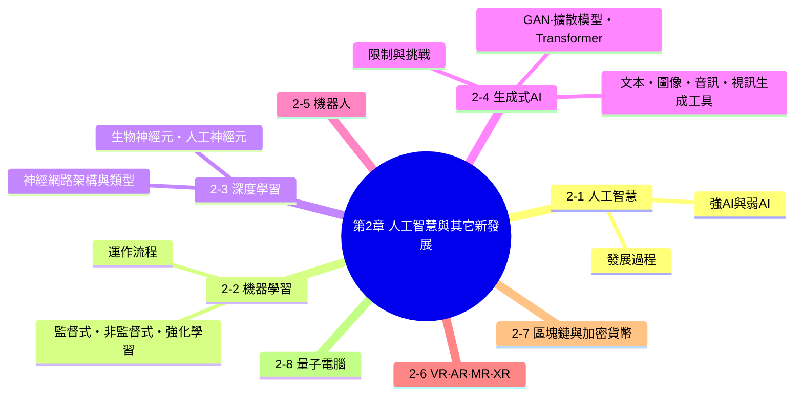

**這一章要帶學生建立的核心概念：**

1. 人工智慧不是一夕之間冒出來的技術，它經歷過兩次寒冬、兩次浪潮，才走到今天生成式 AI 百花齊放的局面——理解這段歷史，才能明白為什麼業界對 AI 的能力邊界依然保持謹慎樂觀。
2. 「人工智慧、機器學習、深度學習、生成式AI」是一層包一層的包含關係，不是四個互相獨立的名詞。
3. VR/AR/MR/XR、區塊鏈、量子電腦，都是目前正在快速發展、與電腦科學緊密相關的新興技術，理解它們的基本原理，才能對新聞中的科技議題有判斷力。

---

## 2-1　人工智慧

### 開場：什麼是「智慧」？機器真的有智慧嗎？

先問學生一個問題：**「你覺得 Siri、Google 小姐算不算有智慧？」** 大部分人的直覺反應可能是否定的——它們只是「看起來」很聰明。這正是人工智慧領域從一開始就在辯論的核心問題：我們該如何定義、又該如何判斷一台機器是否具備「智慧」？

人工智慧（AI，Artificial Intelligence）是資訊科學的一個領域，目的是創造出具有智慧的機器，用來解決與人類智慧相關的問題，例如理解語言、辨識影像、做出判斷、規劃行動等。

### 人工智慧的發展過程：兩次浪潮、兩次寒冬

AI 的發展史，其實是一部「充滿樂觀期待、又不斷被現實澆冷水」的故事，很適合用「潮汐」的意象來理解：

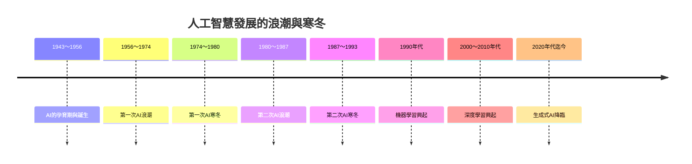

<table>
<tr>
<td width="30%">

*第一個神經網路電腦 SNARC（圖片來源：the-scientist.com）*

</td>
<td>

**AI 的孕育期與誕生（1943～1956）**

這段期間，數學家、神經科學家、工程師開始認真討論「機器是否能思考」這個問題。其中一個重要的里程碑，是 1956 年在美國達特茅斯學院（Dartmouth College）舉辦的一場夏季研討會——**「人工智慧」這個詞，正是在這場會議的提案書中第一次被正式提出**，因此這場會議也被視為 AI 作為一個學術領域正式誕生的起點。

> **延伸閱讀**：這場會議由 John McCarthy、Marvin Minsky、Nathaniel Rochester、Claude Shannon 四人共同發起，會中一項重要成果，是由 Allen Newell 與 Herbert Simon 展示的「邏輯理論家」（Logic Theorist）程式，被認為是史上第一個 AI 程式。詳見維基百科 [Dartmouth workshop](https://en.wikipedia.org/wiki/Dartmouth_workshop) 條目。

圖中的 **SNARC** 則是 1951 年由哈佛大學學生 Marvin Minsky 建造的早期神經網路電腦，用類比電路模擬了 40 個神經元，用來讓一隻虛擬老鼠學習走迷宮——雖然規模極小，卻是「用機器模擬神經網路」這個構想最早的具體實踐。

</td>
</tr>
</table>

**第一次 AI 浪潮（1956～1974）**：達特茅斯會議之後，研究者對 AI 的未來極度樂觀，開發出許多能解數學證明、玩西洋跳棋、進行簡單對話的程式，政府也投入大量研究經費。

**第一次 AI 寒冬（1974～1980）**：樂觀的承諾遲遲無法兌現——當時的電腦運算能力與資料量都遠遠不足以支撐真正複雜的智慧行為，多國政府大幅刪減研究經費，AI 研究進入第一次寒冬。

**第二次 AI 浪潮（1980～1987）**：「專家系統」（把某個領域專家的知識寫成一條條規則，讓電腦依規則做判斷）興起，在醫療診斷、化學分析等領域展現商業價值，帶動了第二波投資熱潮。

**第二次 AI 寒冬（1987～1993）**：專家系統的規則需要人工一條條撰寫與維護，難以應付真實世界的複雜與例外狀況，維護成本過高、擴充性不佳，市場對 AI 的信心再度冷卻。

**機器學習興起（1990 年代）**：研究者體認到「與其寫死規則，不如讓機器自己從資料中找出規律」，機器學習開始成為 AI 研究的主流典範，這也是下一節要介紹的重點。

**深度學習興起（2000～2010 年代）**：隨著網際網路帶來海量資料、以及 GPU 平行運算能力大幅提升，以類神經網路為核心的深度學習技術終於能發揮實力，在影像辨識、語音辨識等任務上超越傳統方法。

<table>
<tr>
<td width="30%">

</td>
<td>

**生成式 AI 降臨（2020 年代迄今）**：以 Transformer 架構為核心的大型語言模型快速發展，2022 年底 ChatGPT 的問世更是讓一般大眾第一次近距離感受到 AI 的威力，帶動全球生成式 AI 熱潮，如圖中透過整合 DALL·E 模型，ChatGPT 可以根據使用者輸入的文字敘述來生成圖像，這正是本章後面 2-4 節要深入介紹的主題。

</td>
</tr>
</table>

### 人工智慧的類型：強 AI 與弱 AI

<table>
<tr>
<td width="30%">

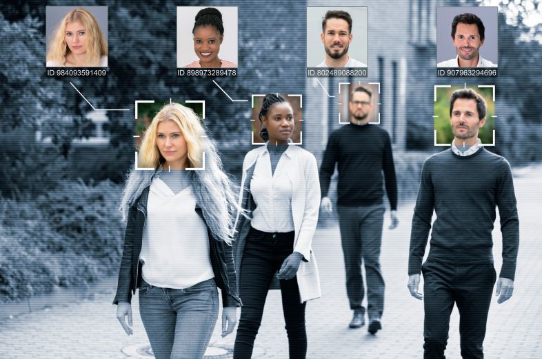
*隨著深度學習的發展，人臉辨識的準確率也愈來愈高了（圖片來源：shutterstock）*

</td>
<td>

- **弱 AI（Weak AI）**：只能在特定、限定的任務範圍內表現出類似智慧的行為，例如人臉辨識、語音助理、下棋程式、推薦系統。**我們目前生活中接觸到的 AI，幾乎全部都屬於弱 AI**——包括 ChatGPT 這類大型語言模型，本質上仍是在完成「預測下一個字」這個特定任務，而不是具備真正、全面的理解與意識。

- **強 AI（Strong AI）**：具備與人類相當、甚至超越人類的全面智慧，能夠像人一樣理解、學習、推理、規劃任何任務。**強 AI 目前仍停留在理論與科幻想像階段，尚未真正實現**。

</td>
</tr>
</table>

> **課堂討論**：讓學生舉出生活中用過的 AI 應用（例如 Google 地圖導航、Netflix 推薦片單、手機拍照美肌），逐一討論這些應用屬於強 AI 還是弱 AI，藉此釐清「AI 很聰明」不等於「AI 有自我意識」。

---

## 2-2　機器學習

### 從「寫死規則」到「讓機器自己學」

回顧上一節提到的「第二次 AI 寒冬」：專家系統之所以難以維護，根本原因是工程師必須把每一條判斷邏輯都用程式明確寫出來。**機器學習（ML，Machine Learning）** 換了一個思路：與其人工寫規則，不如給機器大量資料，讓它自己從資料中「歸納」出規則。機器學習是人工智慧的一個分支，指的正是讓 AI 自動學習的技術。

### 機器學習的運作流程

一個典型的機器學習專案，大致會經過以下五個步驟：

1. **蒐集資料**：例如蒐集上千張貓和狗的照片
2. **選擇模型**：決定要用哪一種演算法或神經網路架構
3. **訓練模型**：讓模型不斷檢視資料、調整內部參數
4. **評估模型**：用模型沒看過的資料測試準確率
5. **實際預測**：把訓練好的模型部署到真實場景中使用

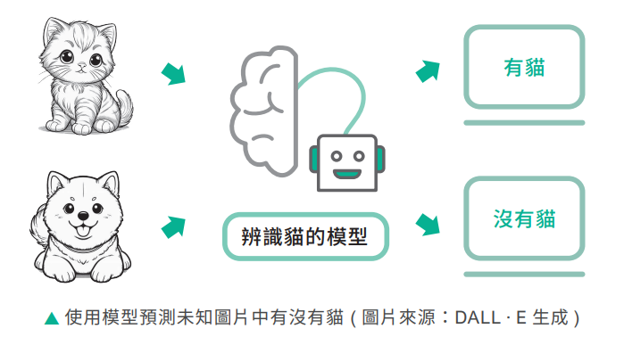

### 機器學習的三種類型

機器學習依照「訓練資料有沒有正確答案」「有沒有明確的獎懲回饋」，可以分成三大類型：

<table>
<tr>
<td width="30%">

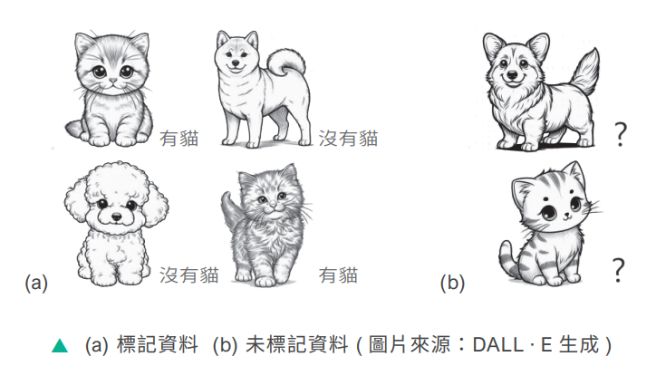
*(a) 標記資料 (b) 未標記資料（圖片來源：DALL·E生成）*

</td>
<td>

**① 監督式學習（Supervised Learning）**

從**有標籤（答案）**的資料中學習規則，然後對未知資料進行預測。就像老師出考卷附標準答案，讓學生對照學習。

**應用實例**：天氣預測、房價預測、過濾垃圾郵件、圖像分類等。

</td>
</tr>
<tr>
<td width="30%">

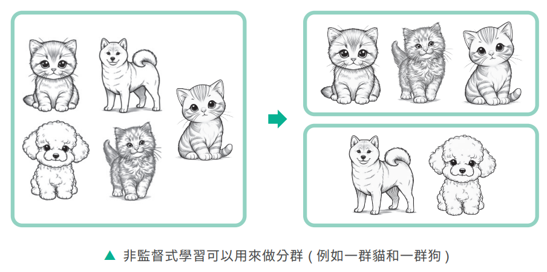
*沒有標記的資料可以未來自動分群（例如一群蝴蝶和一隻蜜蜂）*

</td>
<td>

**② 非監督式學習（Unsupervised Learning）**

從**沒有標籤**的資料中，自行找出潛在的分群或關聯，模型必須自己發現資料裡藏著的規律。

**應用實例**：客戶分類、購物推薦、詐騙行為關聯分析、圖像分割、異常偵測、資料降維等。

</td>
</tr>
<tr>
<td width="30%">

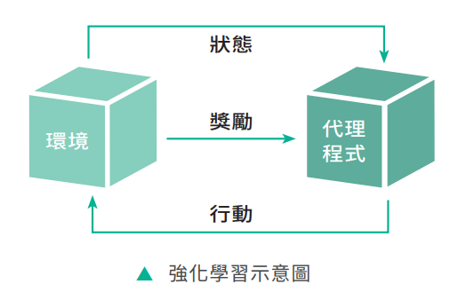
*強化學習示意圖：狀態、代理程式、行動的循環*

</td>
<td>

**③ 強化學習（Reinforcement Learning）**

代理程式（agent）在環境中不斷嘗試行動，並根據行動的結果獲得**獎勵或懲罰**來學習如何達到目標，過程很像訓練寵物——做對了給獎勵，做錯了不給獎勵，讓牠自己摸索出最佳行為模式。

**應用實例**：棋類遊戲（如 AlphaGo）、自動駕駛決策、機器人動作控制等。

</td>
</tr>
</table>

> **課堂小技巧**：三種學習方式的口訣可以這樣記——**監督式學習「有考古題有答案」、非監督式學習「有考古題沒答案」、強化學習「沒考古題但有獎懲」**。

---

## 2-3　深度學習

### 從模仿大腦開始說起

**深度學習（DL，Deep Learning）** 是機器學習的一種方法，利用**神經網路**技術從大量資料中進行學習（learning）與推論（inference）。而神經網路的設計靈感，正是來自於人類大腦裡真正的神經細胞。

<table>
<tr>
<td width="45%">

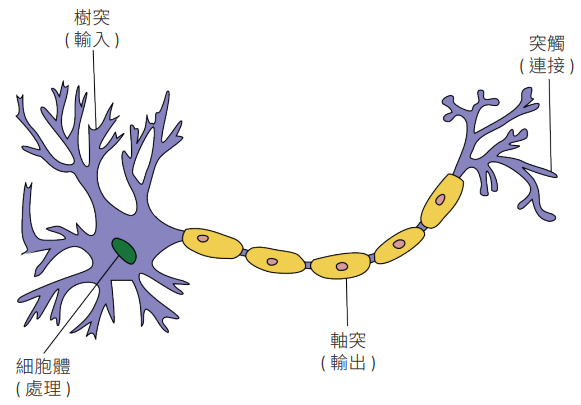
*生物神經元的結構（圖片來源：Quasar Jarosz at Wikipedia 經作者修圖）*

</td>
<td width="45%">

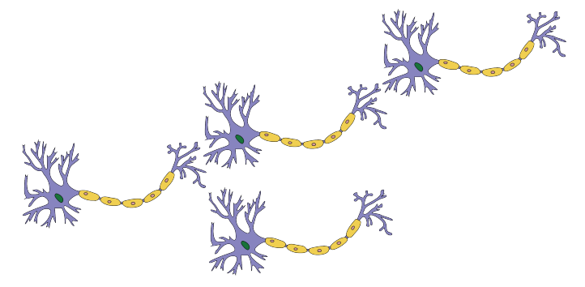
*神經元透過突觸連接其它神經元（圖片來源：Quasar Jarosz at Wikipedia 經作者修圖）*

</td>
</tr>
</table>

**生物神經元（biological neuron）** 是神經系統的基本單位，又稱為神經細胞（nerve cell）。它透過「樹突」接收其他神經元傳來的訊號，在「細胞體」中整合處理，如果訊號強度超過某個門檻，就會透過「軸突」把訊號傳遞出去，並經由「突觸」傳給下一個神經元——這一整套「接收、處理、輸出」的邏輯，正是人工神經元設計的原型。

<table>
<tr>
<td width="45%">

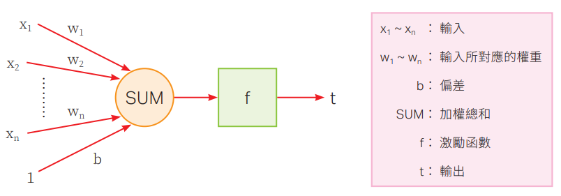

</td>
<td width="45%">

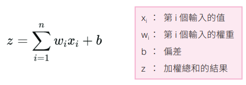

</td>
</tr>
</table>

**人工神經元（artificial neuron）** 是神經網路的基本單位，在深度學習中，神經元其實是一個數學模型，用來接收輸入、進行運算並產生輸出，又稱為**感知器（perceptron）**。它把每個輸入值乘上一個「權重」後加總，再加上一個偏差值，最後透過「激勵函數」決定要不要把訊號往下傳遞。

> **課堂提醒**：「激勵函數（activation function）」的白話解釋——如果沒有激勵函數，神經網路無論疊多少層，本質上都只是在做線性的加權加總，永遠學不會「彎彎曲曲」的複雜規律。激勵函數的作用就是**替神經網路加入「非線性」的能力**，讓它足以逼近真實世界中複雜、非線性的規律（例如判斷一張圖是不是貓，這件事顯然不是幾條直線就能切分清楚的）。

### 神經網路的架構

<table>
<tr>
<td width="45%">

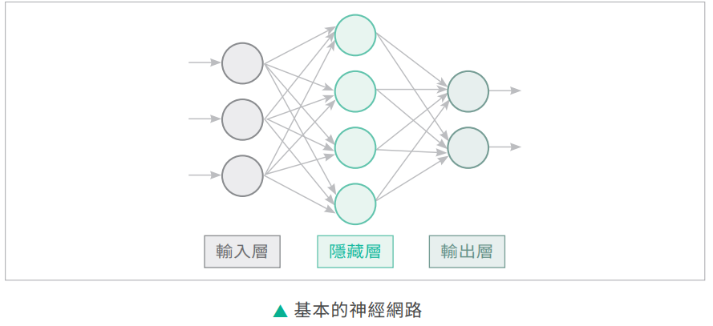
*基本的神經網路*

</td>
<td width="45%">

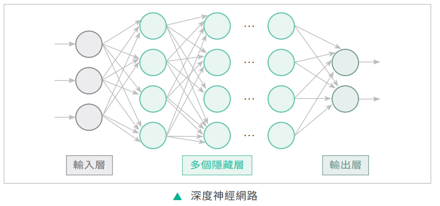
*深度神經網路（多個隱藏層）*

</td>
</tr>
</table>

一個基本的神經網路包含三個層次：

- **輸入層（input layer）**：負責接收輸入資料。
- **隱藏層（hidden layer）**：負責根據從輸入層傳遞過來的特徵進行處理與學習，然後將結果傳遞到輸出層。當隱藏層的數量增加到很多層，就形成了「深度」神經網路，這也是「深度學習」名稱的由來。
- **輸出層（output layer）**：負責產生最終的預測結果。

**訓練神經網路的兩個關鍵機制**，很適合花時間跟學生講清楚，因為這是選擇題常考的重點：

- **損失函數（loss function）**：用來評估模型的預測結果與正確答案之間的差距有多大，差距愈小代表模型表現愈好。訓練的目標，就是想辦法讓損失函數的值愈來愈小。
- **反向傳播（backpropagation）**：訓練過程中，模型會先做出預測、用損失函數算出誤差，接著反向傳播就負責**計算這個誤差是哪些權重造成的、影響程度各是多少**，讓模型知道該往哪個方向調整每一個權重，才能讓下一次的預測更準確。

### 神經網路的類型

<table>
<tr>
<td width="45%">

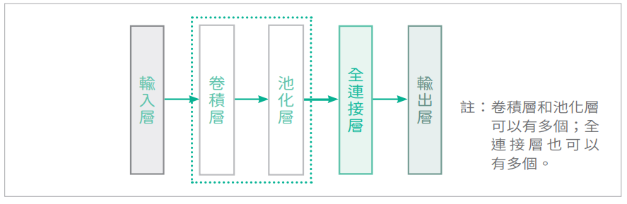
*卷積神經網路 CNN*

</td>
<td width="45%">

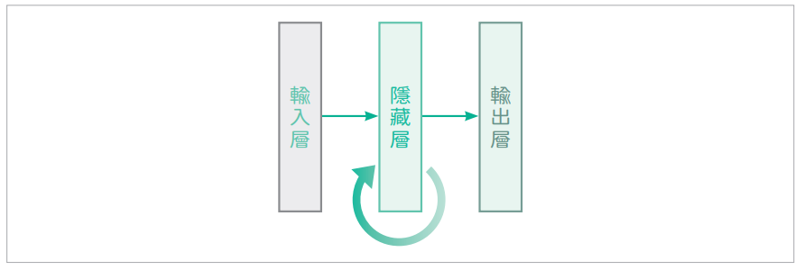
*循環神經網路 RNN*

</td>
</tr>
</table>

- **前饋神經網路（FNN，Feedforward Neural Network）**：資料只朝一個方向流動，從輸入層依序流向輸出層，是最基本的神經網路架構。

- **卷積神經網路（CNN，Convolutional Neural Network）**：透過「卷積層」在圖像中滑動一個小視窗，逐步提取局部特徵（例如邊緣、紋理、形狀），產生「特徵圖」；再透過「池化層」縮減特徵圖的大小、保留最重要的資訊。這種架構特別擅長處理**影像資料**，因此被廣泛用於圖像辨識、醫療影像分析、人臉辨識等任務。

- **循環神經網路（RNN，Recurrent Neural Network）**：具備「記憶」前面輸入資料的能力，會把前一個時間點的運算結果，一併帶入下一個時間點的運算中，因此特別適合處理**有先後順序的序列資料**，例如文字、語音、股價走勢。不過 RNN 的缺點是**必須按照時間順序一步步計算，無法有效平行運算，訓練速度較慢**，這也是後面要介紹的 Transformer 架構之所以能取而代之的重要原因。

---

## 2-4　生成式 AI

### 從「辨識」到「創造」的關鍵一步

前面介紹的機器學習、深度學習應用，大多是在做「**判斷**」——這張圖是不是貓、這封信是不是垃圾郵件。但**生成式 AI（Generative AI）** 做的是完全不同的事：它是利用人工智慧技術來**生成全新的內容**。我們把使用生成式 AI 技術所生成的內容，稱為 **AIGC（Artificial Intelligence Generated Content）**。

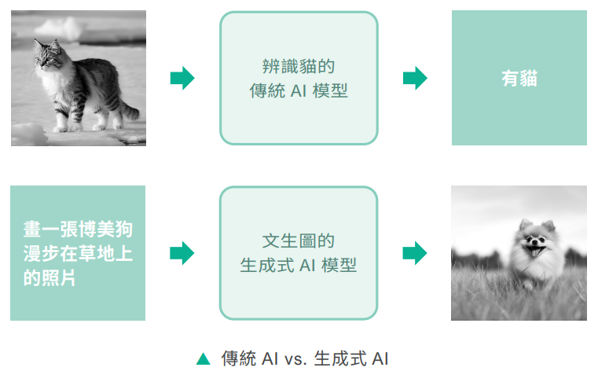
*判斷式 AI（判斷是不是狗）vs. 生成式 AI（生成一張新的狗圖片）*

生成式 AI 之所以能在近幾年爆發式成長，背後主要仰賴三項深度學習關鍵技術：**生成對抗網路（GAN）、擴散模型、Transformer**。

### 2-4-1　生成對抗網路（GAN）

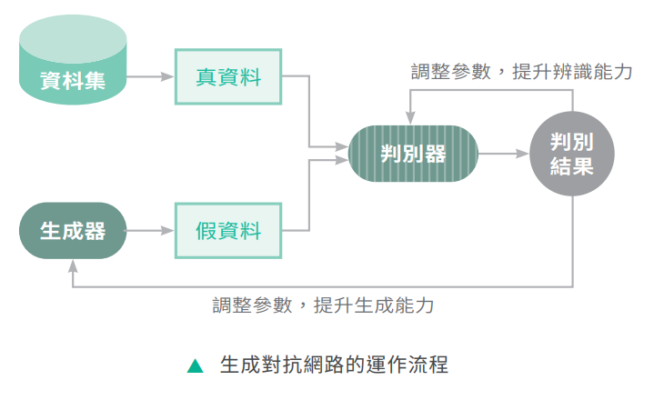

GAN 的巧妙之處在於「左右互搏」的訓練方式，內部包含兩個互相對抗的神經網路：

- **生成器（Generator）**：負責產生「假資料」，目標是騙過判別器。
- **判別器（Discriminator）**：負責判斷資料是「真資料」還是生成器產生的「假資料」。

兩者像是一場「偽鈔製造者」與「警察」的軍備競賽——生成器不斷提升偽造技巧，判別器也不斷提升辨識能力，兩者互相較勁、共同進步，最終生成器就能產生以假亂真的內容。

> **延伸閱讀**：GAN 的概念由電腦科學家 **Ian Goodfellow** 於 2014 年提出，是深度學習領域最具影響力的發明之一。詳見維基百科 [Generative adversarial network](https://en.wikipedia.org/wiki/Generative_adversarial_network) 條目。

### 2-4-2　擴散模型（Diffusion Model）

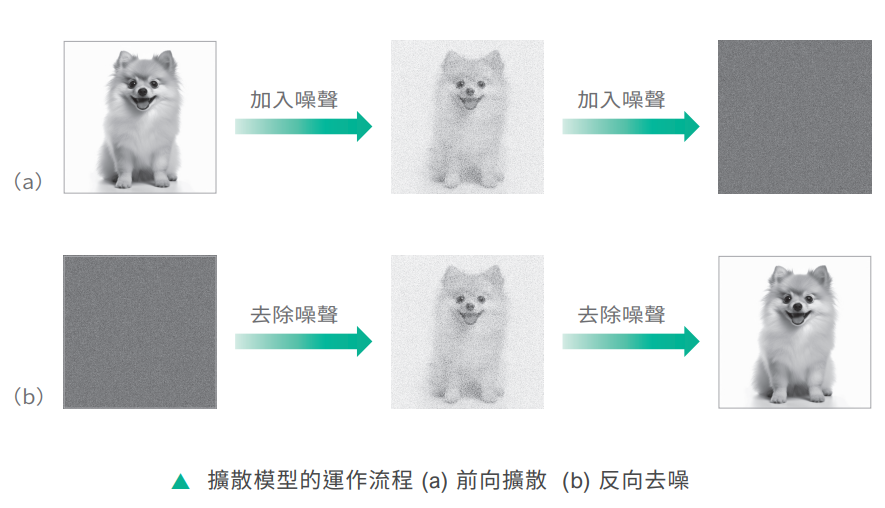
*擴散模型的運作流程：(a) 前向擴散 (b) 反向還原*

擴散模型的訓練邏輯很有意思：**先學會「如何把一張清晰的圖片，一步步加入雜訊直到變成一團亂碼」，再反過來學會「如何把一團隨機雜訊，一步步去除雜訊、還原成一張清晰的圖片」**。訓練完成後，我們只要給模型一段文字描述，讓它從一團純隨機的雜訊開始，一步步「去噪」，最後就能生成一張全新的、符合描述的圖片。目前主流的圖像生成工具（如 Stable Diffusion）大多採用這項技術。

### 2-4-3　Transformer

<table>
<tr>
<td width="45%">

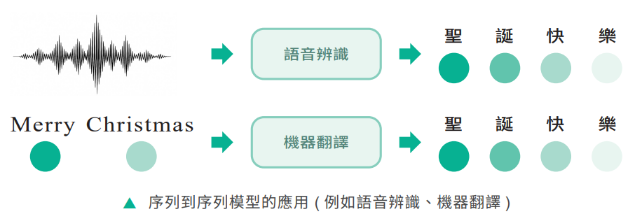
*序列到序列模型的應用（例如語音辨識、機器翻譯）*

</td>
<td width="45%">

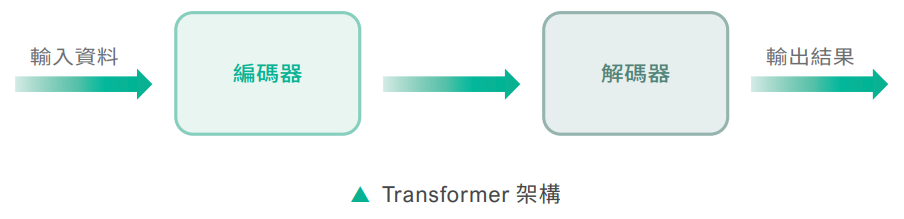
*Transformer 架構：編碼器與解碼器*

</td>
</tr>
</table>

在 Transformer 出現之前，處理文字這種「序列資料」的主流做法是前面提過的 RNN，但 RNN 必須按順序逐字處理，速度慢、也難以記住太久以前的內容。**Transformer** 最大的特點，是引入了 **自注意力機制（self-attention mechanism）**——讓模型在處理一個字的時候，能夠同時看過整句話裡的所有字，直接算出這個字跟句子中其他每個字的關聯程度，藉此掌握上下文語意。因為不必按順序一步步計算，Transformer 可以大量平行運算，訓練速度遠遠快過 RNN，這正是目前 ChatGPT、Gemini 等大型語言模型背後的核心架構。

> **延伸閱讀**：Transformer 架構由 Google 研究團隊於 2017 年在論文《Attention Is All You Need》中提出，是近十年 AI 領域影響力最大的技術突破之一，其自注意力機制的設計，讓它成為圖像、語音、影片生成模型也普遍採用的骨幹架構。詳見維基百科 [Transformer (deep learning architecture)](https://en.wikipedia.org/wiki/Transformer_(deep_learning_architecture)) 條目。

### 2-4-4　生成式 AI 工具

<table>
<tr>
<td width="30%">

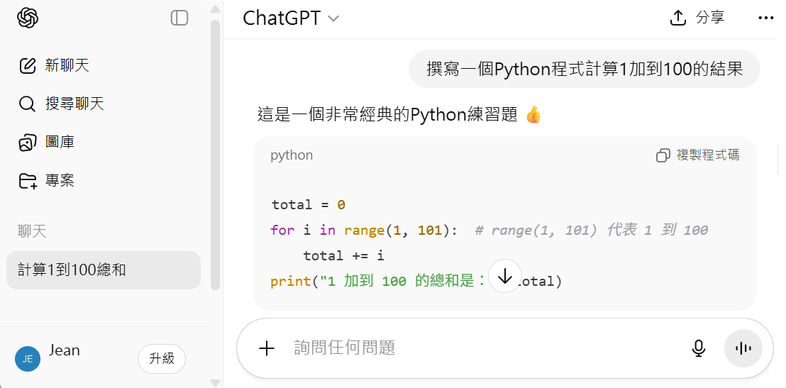

</td>
<td>

**文本生成工具**

可以根據文字敘述自動產生符合語意、文法正確且具創造力的文字內容，例如文章、詩歌、小說、報告等。常見工具：**ChatGPT、Gemini、Microsoft Copilot** 等。

</td>
</tr>
</table>

**圖像生成工具**

可以根據文字敘述自動產生符合要求的圖像。下面是分別利用 Midjourney、Imagen（Gemini）、DALL-E（ChatGPT）、DALL-E（Copilot）等模型，根據相同提示詞「a boy, gakuen anime style」（一個男孩，學園動漫風格）所生成的圖像，可以明顯看出**不同模型即使收到一模一樣的提示詞，畫風與詮釋方式也會有所不同**：

<table>
<tr>
<td width="25%"></td>
<td width="25%"></td>
<td width="25%"></td>
<td width="25%"></td>
</tr>
</table>

<table>
<tr>
<td width="30%">

</td>
<td>

**音訊生成工具**

通常是從大量聲音資料中學習語音特徵、音色、節奏與旋律結構，進而產生自然流暢的音訊內容，常見應用如下：

- 語音合成
- 音樂生成（如上圖 Suno 可以根據文字提示直接生成一整首歌曲）
- 音效生成

</td>
</tr>
<tr>
<td width="30%">

*利用 Sora 根據書籍封面和提示詞生成宣傳影片*

</td>
<td>

**視訊生成工具**

可以根據文字敘述或圖像自動產生影片，常見應用如下：

- 文字轉影片
- 圖像轉影片
- 影片編輯與續拍

</td>
</tr>
</table>

### 2-4-5　生成式 AI 的限制與挑戰

生成式 AI 雖然強大，但絕對不是萬能，課堂上很值得花時間跟學生一一討論以下幾項限制：

- **生成內容可能有錯（AI 幻覺）**：模型有時會一本正經地生成看似合理、實則錯誤或憑空捏造的內容，這種現象稱為「AI 幻覺（hallucination）」。
- **成本高且耗能**：訓練與運行大型生成式 AI 模型需要龐大的運算資源與電力，對環境造成不小的負擔。
- **隱私與安全風險**：模型的訓練資料可能包含個人隱私資訊，也可能被用來生成假訊息或詐騙內容。
- **智慧財產權爭議**：AI 生成的內容如果模仿了他人的創作風格、圖像或聲音，容易引發著作權歸屬的爭議。
- **工作取代與經濟衝擊**：許多內容創作、客服、翻譯等工作，可能因生成式 AI 的普及而受到衝擊。
- **過度依賴的隱憂**：長期仰賴 AI 生成內容，可能讓使用者逐漸喪失獨立思考、查證與創作的能力。

---

## 2-5　機器人

### 開場：機器人一定要長得像人嗎？

先破除一個常見迷思：機器人不一定要有手有腳、長得像人形機器人才叫機器人。**機器人（robot）** 是一種能夠自動執行特定任務的裝置，通常包含下列幾個部分：

- **機械結構**：機器人的實體骨架與可動部件。
- **感測器（sensor）**：負責感知外部環境的資訊，例如攝影機、距離感測器、溫度感測器。
- **控制器（controller）**：機器人的「大腦」，負責處理感測器傳來的資訊、做出決策。
- **執行器（actuator）**：負責把控制器的決策轉換成實際動作，例如馬達、機械手臂關節。
- **人機介面**：讓人類可以與機器人溝通、下達指令的介面。

> **延伸閱讀**：科幻小說家 Isaac Asimov 在 1942 年的短篇小說中提出了知名的「機器人三大法則」：①機器人不得傷害人類，或坐視人類受到傷害；②機器人必須服從人類的命令，除非命令與第一法則衝突；③機器人必須保護自己的存在，但不得違背第一與第二法則。這套虛構的倫理框架雖然誕生於科幻小說，卻深遠地影響了後世對「AI 安全性」與「機器人倫理」的討論。詳見維基百科 [Three Laws of Robotics](https://en.wikipedia.org/wiki/Three_Laws_of_Robotics) 條目。

> **課堂討論**：讓學生想一想，掃地機器人、工廠裡的機械手臂、手術機器人，分別對應到上述五個組成部分中的哪些？藉此具體理解抽象定義。

---

## 2-6　VR、AR、MR 與 XR

### 開場：這四個英文縮寫，差別到底在哪？

這四個名詞常常被搞混，最適合的教法是畫一條「現實 → 虛擬」的光譜，讓學生看清楚彼此的相對位置：

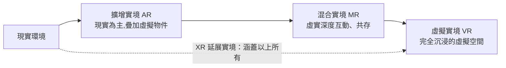

<table>
<tr>
<td width="30%">

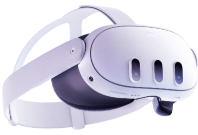

*VR 頭戴式顯示器和手持控制器（圖片來源：Meta Quest）*

</td>
<td>

**虛擬實境（VR，Virtual Reality）**

利用電腦產生一個虛擬的三度空間，使用者只要穿戴 VR 裝置就能進入該空間，感受到視覺、聽覺及觸覺。當使用者移動時，電腦會立刻進行運算，進而產生影像、聲音或觸覺回饋給使用者。

</td>
</tr>
</table>

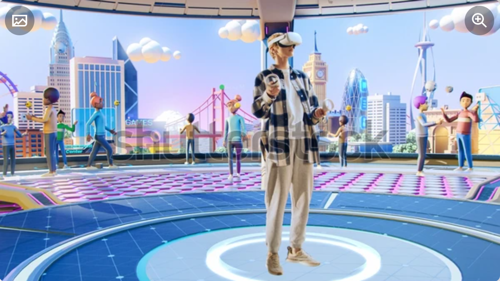
*VR 的使用者會完全沉浸在虛擬的空間*

<table>
<tr>
<td width="30%">

*建築師透過 AR 頭戴式裝置討論 3D 城市模型（圖片來源：shutterstock）*

</td>
<td>

**擴增實境（AR，Augmented Reality）**

利用電腦將虛擬的物件投射到現實的環境，讓虛擬的物件與現實的環境進行結合與互動，例如「寶可夢 Go」遊戲——手機鏡頭拍到的是真實街道，畫面上疊加的寶可夢則是虛擬物件。

</td>
</tr>
<tr>
<td width="30%">

*在 Microsoft Mesh 平台使用虛擬人偶和沈浸式的 3D 空間連結企業的員工*

</td>
<td>

**混合實境（MR，Mixed Reality）**

混合了虛擬實境和擴增實境，通常是以現實的環境為基礎，在上面搭建一個虛擬的空間，讓現實的物件能夠與虛擬的物件**共同存在並互動**，打破現實與虛擬的界線——這是 MR 和 AR 最關鍵的差異：AR 通常只是把虛擬物件「疊加」在現實畫面上，而 MR 講求的是虛擬物件與真實物件之間更深度的互動與共存關係。

</td>
</tr>
</table>

**延展實境（XR，Extended Reality）** 是虛擬與現實融合技術的總稱，前面介紹的 VR、AR、MR 都可以視為 XR 的一部分——可以把 XR 想成一把「大傘」，把這一整個技術家族都罩在裡面。

---

## 2-7　區塊鏈與加密貨幣

### 開場：為什麼區塊鏈的資料「幾乎不可能被竄改」？

**區塊鏈（blockchain）** 是一種用來記錄資料的技術，這些資料會被寫入一個個「區塊」，每個區塊會經由**雜湊（hash）運算**加到一條不斷延伸的「鏈」（chain）上。

*區塊鏈的每個區塊會包含前一個區塊的雜湊值而鏈結在一起（圖片來源：shutterstock）*

> **延伸閱讀（原理補充）**：雜湊函數有一個關鍵特性——只要輸入的資料有任何一丁點改變，算出來的雜湊值就會變得完全不同。區塊鏈正是利用這個特性：**每一個新區塊，都會把「前一個區塊的雜湊值」一併記錄進來**，這樣就把所有區塊緊密串連成一條鏈。如果有心人士想竄改其中一個舊區塊的內容，該區塊的雜湊值就會跟著改變，導致後面所有區塊記錄的「前一個區塊雜湊值」全部對不上——除非他能同時重新計算並修改後面所有的區塊（在公開的區塊鏈上，這在計算上幾乎不可行），否則竄改馬上會被發現。這就是區塊鏈「不可竄改性」的技術原理。詳見維基百科 [Blockchain](https://en.wikipedia.org/wiki/Blockchain) 條目。

### 區塊鏈的特點

- **去中心化**：資料不儲存在單一中央伺服器，而是分散儲存在網路上眾多節點。
- **匿名性**：交易通常只對應到一組加密位址，不直接綁定真實身分。
- **可追溯性**：每一筆交易紀錄都被永久保存，可以完整追蹤資料的來龍去脈。
- **不可竄改性**：如上方原理說明，篡改歷史紀錄在技術上極度困難。
- **安全性與透明性**：資料經過加密保護，且鏈上所有參與者都能查驗交易紀錄。

### 區塊鏈的類型

| 類型 | 說明 | 舉例 |
|---|---|---|
| **公有鏈**（public chain） | 任何人都可以自由加入、參與驗證 | 比特幣、以太坊 |
| **私有鏈**（private chain） | 僅限特定組織內部使用，存取權限受控管 | 企業內部帳務系統 |
| **聯盟鏈**（consortium chain） | 由多個組織共同管理，介於公有鏈與私有鏈之間 | 跨銀行聯盟清算系統 |

### 區塊鏈的應用

*加密貨幣交易平台 Binance*

- **加密貨幣（cryptocurrency）**：利用密碼學的加密技術所創造出來的虛擬貨幣，例如比特幣、以太幣、幣安幣、瑞波幣、萊特幣、泰達幣、狗狗幣等。
- **智慧合約（smart contract）**：把合約條件寫成程式碼，條件一旦滿足就自動執行，不需要透過第三方。
- **元宇宙**：結合區塊鏈、VR/AR 等技術打造的虛擬世界經濟系統。
- **NFT（Non-Fungible Token，非同質化代幣）**：用來證明數位資產（如數位藝術品）獨一無二所有權的代幣。
- **去中心化金融（DeFi，Decentralized Finance）**：不透過銀行等傳統金融機構，直接在區塊鏈上進行借貸、交易等金融活動。
- **去中心化醫療**：利用區塊鏈技術安全地共享與管理病歷等醫療資料。

---

## 2-8　量子電腦

### 開場：如果一枚硬幣可以同時是正面「也」是反面……

量子電腦是這一章最抽象、也最容易讓學生覺得「有點玄」的主題，建議先用一個生活化的思想實驗開場：**想像一枚旋轉中、還沒落地的硬幣——在它落地之前，你能不能說它「現在」是正面還是反面？**這正是量子力學中「疊加態」概念的生活版比喻。

**量子電腦（quantum computer）** 是基於量子力學原理所發展的電腦，其資料的基本單位叫做**量子位元（qubit）**。

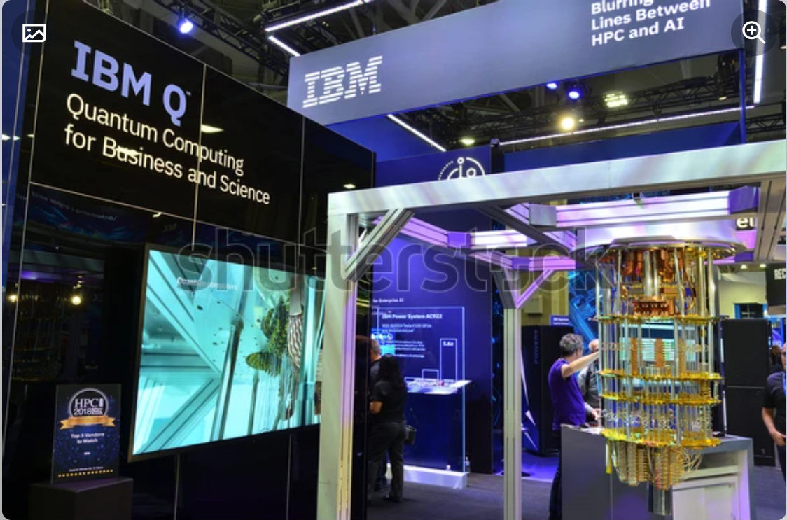
*全球首款商業化量子電腦 IBM Q System One（圖片來源：shutterstock）*

### 量子電腦的兩大關鍵原理

**① 疊加狀態（superposition state）**

傳統電腦的位元（bit）只能是 0 或 1，兩者只能擇一。但一個量子位元卻可以**同時處於 0 和 1 的疊加狀態**，直到我們實際測量它的那一刻，才會「塌縮」成確定的 0 或 1。

> **延伸閱讀**：這個概念最著名的比喻，就是物理學家薛丁格提出的思想實驗「薛丁格的貓」——在箱子打開之前，貓被形容成同時處於「活著」與「死亡」的疊加狀態。量子電腦正是利用類似的疊加特性，讓 *n* 個量子位元能同時代表 2 的 *n* 次方種可能的組合狀態，進行大規模的平行運算。詳見維基百科 [Quantum superposition](https://en.wikipedia.org/wiki/Quantum_superposition) 條目。

**② 量子糾纏（quantum entanglement）**

此外，量子電腦可以利用量子糾纏來進行更複雜的運算，這是量子位元之間的一種特殊關聯——**改變其中一個量子位元的狀態，就會立即影響另一個量子位元的狀態**，即使兩者相隔遙遠的距離也一樣。這個現象曾讓愛因斯坦大感困惑，稱之為「鬼魅般的超距作用」。

> **課堂比喻**：可以把糾纏的兩個量子位元比喻成一對心有靈犀的雙胞胎——即使分隔兩地，其中一人的狀態發生變化，另一人也會「同步」跟著改變，不需要任何訊息傳遞的時間。

**疊加態負責「讓運算量指數增長」，量子糾纏則負責「讓大量量子位元能夠協同運作」**，兩者合力賦予了量子電腦在特定問題上（例如新藥分子模擬、密碼破解、複雜最佳化問題）遠遠超越傳統電腦的潛力。不過也要跟學生澄清一個常見的迷思：量子電腦並不是「什麼問題都比傳統電腦快」，它在目前已知最擅長的，是傳統電腦計算上極度困難的特定類型問題，日常文書處理、上網瀏覽等一般任務，傳統電腦仍然又快又划算。

---

## 本章總結

| 小節 | 核心觀念一句話 |
|---|---|
| 2-1 人工智慧 | AI 的發展歷經兩次浪潮與寒冬，目前生活中接觸到的都屬於「弱 AI」 |
| 2-2 機器學習 | 讓機器從資料中自己歸納規則，分為監督式、非監督式、強化學習三大類型 |
| 2-3 深度學習 | 模仿生物神經元設計的神經網路，透過損失函數與反向傳播不斷修正權重 |
| 2-4 生成式AI | 利用 GAN、擴散模型、Transformer 等技術，讓 AI 從「判斷」進化到「創造」 |
| 2-5 機器人 | 由機械結構、感測器、控制器、執行器、人機介面組成的自動化裝置 |
| 2-6 VR‧AR‧MR‧XR | 依虛擬與現實的融合程度排列在同一條光譜上，XR 是涵蓋全部的總稱 |
| 2-7 區塊鏈與加密貨幣 | 利用雜湊鏈結技術達成去中心化、不可竄改的資料紀錄方式 |
| 2-8 量子電腦 | 利用量子疊加與量子糾纏，在特定問題上獲得指數級的運算優勢 |

### 關鍵詞彙表（Glossary）

`人工智慧` `強AI` `弱AI` `達特茅斯會議` `機器學習` `監督式學習` `非監督式學習` `強化學習` `深度學習` `生物神經元` `人工神經元` `感知器` `激勵函數` `損失函數` `反向傳播` `前饋神經網路 FNN` `卷積神經網路 CNN` `循環神經網路 RNN` `生成式AI` `AIGC` `生成對抗網路 GAN` `擴散模型` `Transformer` `自注意力機制` `AI幻覺` `機器人三大法則` `虛擬實境 VR` `擴增實境 AR` `混合實境 MR` `延展實境 XR` `區塊鏈` `雜湊` `去中心化` `加密貨幣` `智慧合約` `NFT` `DeFi` `量子電腦` `量子位元 qubit` `疊加狀態` `量子糾纏`

---

## 第 2 章　學習評量

> 以下為課本第 2 章隨附之官方學習評量，題目逐字謄錄。答案為課本官方解答，並在其下補充**完整解說**，方便課堂上直接點開講解、對答案。

### 一、選擇題

**1. 卷積神經網路特別擅長處理下列哪種類型的資料？**
A. 表格資料　B. 文本分類　C. 影像資料　D. 遊戲策略

▶ 參考答案與解說

**答案：C　影像資料**

卷積神經網路（CNN）透過卷積層在圖像上滑動小視窗，逐步提取邊緣、紋理、形狀等局部特徵，再透過池化層濃縮成更精簡的特徵圖，這種「先抓局部特徵、再逐層組合成整體概念」的運作方式，特別適合處理具有空間結構的**影像資料**。文本分類通常用循環神經網路或 Transformer 處理效果更好；表格資料則較常用傳統機器學習方法或全連接的前饋神經網路；遊戲策略多半採用強化學習來處理。

---

**2. 下列何者是 Transformer 的特點？**
A. 卷積　B. 池化　C. 循環結構　D. 自注意力機制

▶ 參考答案與解說

**答案：D　自注意力機制**

Transformer 最核心的創新，就是**自注意力機制（self-attention mechanism）**——讓模型在處理一個字時，能同時看過整句話裡的所有字，直接算出彼此的關聯程度，藉此掌握上下文語意，且可以大量平行運算。卷積、池化是 CNN 的特徵；循環結構則是 RNN 的特徵，Transformer 正是為了取代 RNN 循環結構「無法平行運算」的缺點而誕生的。

---

**3. 在神經網路的架構中，下列哪個層次負責從特徵進行處理與學習？**
A. 輸入層　B. 隱藏層　C. 輸出層　D. 池化層

▶ 參考答案與解說

**答案：B　隱藏層**

神經網路基本的三個層次中，輸入層只負責「接收」原始資料；隱藏層負責根據輸入層傳來的特徵進行**處理與學習**，並將結果往下傳遞；輸出層則負責產生最終的預測結果。池化層是 CNN 架構中專門用來縮減特徵圖大小的特殊層次，不是神經網路的基本三層次之一。

---

**4. 在卷積神經網路中，下列哪個層次負責從圖像中提取局部特徵，以產生特徵圖？**
A. 輸入層　B. 卷積層　C. 池化層　D. 全連接層

▶ 參考答案與解說

**答案：B　卷積層**

卷積層（Convolutional Layer）透過一個小的濾波器（filter）在圖像上滑動，計算局部區域的加權總和，藉此偵測邊緣、紋理等局部特徵，產生「特徵圖（feature map）」。池化層的工作是在卷積層之後，進一步縮減特徵圖的尺寸；全連接層則通常放在網路的最後，把提取到的特徵整合起來做出最終分類。

---

**5. 下列哪個工具可以根據使用者輸入的文字敘述自動產生圖像？**
A. Stable Diffusion　B. Midjourney　C. DALL·E　D. 以上皆可

▶ 參考答案與解說

**答案：D　以上皆可**

Stable Diffusion、Midjourney、DALL·E 都是目前主流的文字轉圖像（text-to-image）生成式 AI 工具，使用者只要輸入文字描述（提示詞），模型就能生成對應的圖像，只是各家模型底層採用的技術與畫風詮釋略有不同。

---

**6. 在機器學習中，下列何者是利用有答案的大量資料來訓練機器，讓機器學習如何解決問題？**
A. 非監督式學習　B. 監督式學習　C. 階層分群　D. 強化學習

▶ 參考答案與解說

**答案：B　監督式學習**

監督式學習的定義正是「從有標籤（答案）的資料中學習規則，然後對未知資料進行預測」。非監督式學習的訓練資料沒有標準答案；強化學習則是透過獎懲機制、而非預先給定答案來學習；階層分群是非監督式學習底下的一種分群演算法，不是獨立的學習類型。

---

**7. 在機器學習中，下列何者是代理程式在環境中行動，透過所獲得的獎勵或懲罰來學習如何達到目標？**
A. 非監督式學習　B. 監督式學習　C. 階層分群　D. 強化學習

▶ 參考答案與解說

**答案：D　強化學習**

強化學習的核心正是「代理程式（agent）在環境中不斷嘗試行動，根據行動結果獲得獎勵或懲罰，藉此學習如何達到目標」，這與監督式學習「直接給答案」的機制明顯不同，強化學習是透過反覆試誤與回饋來逐步逼近最佳策略。

---

**8. 神經網路中的「激勵函數」（activation function）主要目的為：**
A. 增加模型訓練速度　B. 引入非線性能力　C. 讓模型輸出變亮　D. 減少參數數量

▶ 參考答案與解說

**答案：B　引入非線性能力**

如果沒有激勵函數，神經網路無論疊加多少層，數學上都只是在做一連串線性加權加總的組合，本質上仍然只是一個線性模型，無法學會真實世界中複雜、彎曲的非線性規律。激勵函數的關鍵作用，就是為神經網路的每一層引入非線性轉換能力，讓深層神經網路真正具備逼近複雜函數的能力。

---

**9. 在訓練神經網路時，反向傳播（backpropagation）主要負責：**
A. 計算預測結果　B. 計算損失　C. 儲存訓練資料　D. 計算權重對損失的影響

▶ 參考答案與解說

**答案：D　計算權重對損失的影響**

訓練流程大致是：模型先做出預測（這一步不是反向傳播的工作）→ 用損失函數計算預測與正確答案的差距（這也不是反向傳播的工作）→ 接著才輪到反向傳播，負責計算「每一個權重，各自對這個誤差的影響程度有多大」，讓模型知道該往哪個方向、調整多少幅度，才能讓下一次的預測更準確。

---

**10. 下列何者是循環神經網路的缺點？**
A. 無法辨識影像　B. 無法有效平行運算、訓練較慢　C. 不能做語音辨識　D. 無法處理序列資料

▶ 參考答案與解說

**答案：B　無法有效平行運算、訓練較慢**

RNN 因為必須依照時間順序、一步接一步地處理序列中的每個元素（後一步的計算依賴前一步的結果），無法像 Transformer 那樣同時平行處理整個序列，因此訓練速度明顯較慢，這正是 Transformer 架構之所以能取而代之的關鍵原因。RNN 本身就是專門設計來處理序列資料（如語音、文字）的架構，選項 C、D 恰好與 RNN 的特性相反，並非其缺點。

---

**11. 深度學習中的「損失函數」（loss function）主要目的為：**
A. 控制訓練速度　B. 決定 GPU 數量　C. 降低資料維度　D. 評估模型與正確答案的差距

▶ 參考答案與解說

**答案：D　評估模型與正確答案的差距**

損失函數（loss function）的作用，就是量化模型目前的預測結果，與真實正確答案之間差距有多大，差距愈小代表模型表現愈好。訓練神經網路的過程，本質上就是不斷調整權重，設法讓損失函數的數值持續下降。

---

**12. 下列敘述何者正確？**
A. 機器學習不需要資料也能運作　B. 機器學習完全依賴人工撰寫規則　C. 語音辨識需要大量資料做訓練　D. AI 系統的決策絕對是正確且公平

▶ 參考答案與解說

**答案：C　語音辨識需要大量資料做訓練**

機器學習的本質，就是讓機器從**大量資料**中自動歸納規則，因此資料是機器學習不可或缺的根本要素，選項 A 明顯錯誤。機器學習的精神正是「不需要人工寫死所有規則」，選項 B 也與定義相反。至於選項 D，AI 系統的決策品質高度仰賴訓練資料與演算法設計，如果訓練資料本身存在偏見或不完整，AI 的判斷就可能出現錯誤或不公平的結果，因此「絕對正確且公平」的說法過於武斷，是錯誤敘述。

---

**13. 量子電腦的資料基本單位叫做什麼？**
A. qubit　B. bit　C. TB　D. EB

▶ 參考答案與解說

**答案：A　qubit（量子位元）**

傳統電腦的資料基本單位是 bit（位元），只能是 0 或 1；量子電腦的資料基本單位則是 **qubit（量子位元）**，可以同時處於 0 和 1 的疊加狀態。TB（terabyte）、EB（exabyte）則是資料儲存容量的單位，與資料的「基本單位」性質不同。

---

**14. 下列何者有使用到區塊鏈的技術？**
A. 自駕車　B. IBM Deep Blue　C. 比特幣　D. 寶可夢 Go 遊戲

▶ 參考答案與解說

**答案：C　比特幣**

比特幣是最早、也是最知名的加密貨幣，其交易紀錄正是透過區塊鏈技術來儲存與驗證。自駕車主要仰賴電腦視覺與強化學習等 AI 技術；IBM Deep Blue 是 1997 年擊敗西洋棋王的西洋棋程式，屬於傳統搜尋演算法的應用；寶可夢 Go 則是擴增實境（AR）技術的知名應用，三者皆與區塊鏈技術無關。

---

**15. 下列何者不屬於深度學習的應用？**
A. 分析醫療影像　B. 深偽（deepfake）　C. 自然語言處理　D. 加密貨幣

▶ 參考答案與解說

**答案：D　加密貨幣**

分析醫療影像仰賴卷積神經網路（CNN）；深偽技術是利用生成對抗網路（GAN）等深度學習技術合成人物影像；自然語言處理則大量仰賴 Transformer 等深度學習架構，三者都是深度學習的重要應用領域。加密貨幣的核心技術是**區塊鏈與密碼學**，與深度學習屬於不同的技術體系，因此不屬於深度學習的應用。

---

**16. 下列何者可以讓使用者置身於模擬環境中，感受到視覺、聽覺及觸覺？**
A. VR　B. IoT　C. ANI　D. AGI

▶ 參考答案與解說

**答案：A　VR（虛擬實境）**

VR 的定義正是利用電腦產生一個虛擬的三度空間，使用者穿戴裝置後即可進入該空間，感受到視覺、聽覺及觸覺回饋。IoT（Internet of Things，物聯網）是指透過網路連結各種裝置、交換資料的技術；ANI（Artificial Narrow Intelligence，即前面提過的「弱 AI」）與 AGI（Artificial General Intelligence，即「強 AI」）則是描述 AI 能力範疇的分類名詞，三者皆與「沉浸式模擬環境」的定義無關。

### 二、簡答題

**1. 簡單說明何謂人工智慧（AI）？舉出兩個生活中看得到的 AI 應用實例。**

▶ 參考答案

人工智慧（AI）是資訊科學的一個領域，目的是創造出具有智慧的機器，解決與人類智慧相關的問題。我們可以根據能力，將人工智慧分成**強 AI** 和**弱 AI**。生活中的應用很多，例如**機器翻譯、自動駕駛、虛擬助理**等（任選其中兩項作答即可）。

---

**2. 簡單說明何謂機器學習？根據不同的學習方式，又分為哪些類型？**

▶ 參考答案

機器學習（machine learning）是人工智慧的一個分支，指的是讓 AI 自動學習的技術，可以分為**有答案的監督式學習**、**沒有答案的非監督式學習**，以及**沒有答案但有目標的強化學習**等類型。

---

**3. 簡單說明何謂深度學習？**

▶ 參考答案

深度學習（deep learning）是機器學習的一種方法，利用神經網路技術從大量資料中進行學習與推論。

---

**4. 簡單說明何謂神經網路？基本的神經網路有哪三個層次？其功能為何？**

▶ 參考答案

神經網路（neural network）是一種模擬生物神經系統的功能與結構所產生的數學模型或計算模型。基本的神經網路包含三個層次：

- **輸入層**：負責接收輸入資料。
- **隱藏層**：負責根據從輸入層所傳遞過來的特徵進行處理與學習，然後將結果傳遞到輸出層。
- **輸出層**：負責產生最終的預測結果。

---

**5. 簡單說明何謂擴散模型。**

▶ 參考答案與完整解說

擴散模型（diffusion model）是生成式 AI 背後的一項關鍵深度學習技術，訓練過程分成兩個階段：

1. **前向擴散**：先學會如何把一張清晰的圖片，一步步加入雜訊，直到最終變成一團完全隨機的雜訊。
2. **反向還原**：接著反過來訓練模型，學會如何把一團隨機雜訊，一步步去除雜訊、逐漸還原成一張清晰的圖片。

訓練完成後，只要給模型一段文字描述，讓它從一團純隨機的雜訊開始，依照學到的「去噪」規律一步步運算，最終就能生成一張全新的、符合描述內容的圖片。目前主流的圖像生成工具（例如 Stable Diffusion）大多採用這項技術。

---

**6. 簡單說明何謂生成式 AI？舉出三種生成式 AI 工具。**

▶ 參考答案

生成式 AI 是透過學習大量資料，然後生成與原始資料類似的新內容，主要仰賴於深度學習技術，例如生成對抗網路（GAN）、擴散模型、Transformer 等。目前有很多生成式 AI 工具，例如 **ChatGPT、Gemini、Microsoft Copilot** 等（任選三項作答即可）。

---

**7. 簡單說明何謂加密貨幣並舉出三種實例。**

▶ 參考答案

加密貨幣（cryptocurrency）是利用密碼學的加密技術所創造出來的虛擬貨幣，例如**比特幣、以太幣、幣安幣、瑞波幣、萊特幣、泰達幣、狗狗幣**等（任選三項作答即可）。

---

**8. 簡單說明何謂虛擬實境（VR）、擴增實境（AR）與混合實境（MR）。**

▶ 參考答案與完整解說

- **虛擬實境（VR，Virtual Reality）**：利用電腦產生一個完全虛擬的三度空間，使用者只要穿戴 VR 裝置就能進入該空間，感受到視覺、聽覺及觸覺。當使用者移動時，電腦會立刻運算，產生對應的影像、聲音或觸覺回饋，使用者會完全沉浸在虛擬空間之中，與現實環境隔絕。

- **擴增實境（AR，Augmented Reality）**：利用電腦將虛擬的物件投射到現實的環境中，讓虛擬物件與現實環境結合、互動，但現實環境本身並未被取代，使用者仍看得到、處在真實的世界裡，例如「寶可夢 Go」遊戲會把虛擬的寶可夢疊加在手機拍到的真實街景上。

- **混合實境（MR，Mixed Reality）**：混合了虛擬實境和擴增實境的特性，通常以現實環境為基礎，在上面搭建一個虛擬空間，讓現實物件能夠與虛擬物件**共同存在並深度互動**（不只是單純疊加），打破現實與虛擬的界線，例如企業可以在 Microsoft Mesh 平台上，讓虛擬人偶與沉浸式 3D 空間，把分散各地的員工連結在一起共同協作。

**三者的關鍵差異**，可以用「虛實融合的程度」來理解：VR 是完全的虛擬、AR 是現實為主、虛擬為輔的疊加，MR 則介於兩者之間，講求虛擬與現實物件的深度共存互動。

---

**9. 假設要訓練一個「幫忙辨識垃圾分類」的模型，請想一想需要哪些資料？需要做標記嗎？為什麼？**

▶ 參考答案

您需要蒐集大量不同種類垃圾的影像資料，例如：

- **可回收物**（塑膠瓶、鋁罐、玻璃瓶、紙箱、報紙、鐵罐…）
- **廚餘**（水果皮、剩菜、廚房廢棄物…）
- **一般垃圾**（髒污紙張、汙染過的塑膠袋、剩餘衛生紙…）
- **有害垃圾**（電池、燈泡、藥品廢棄物…）

資料愈接近真實使用情境，模型就會愈準確。

這是一個**監督式學習**的分類問題，**需要標記**，讓模型知道每張照片屬於哪一類，才能正確做分類。

---

**10. 假設有一家醫院使用機器學習來預測病人的疾病，若訓練資料中的病人大多是年輕人，試問該模型對老年人的預測會準確嗎？為什麼？**

▶ 參考答案與完整解說

**該模型對老年人的預測可能不會準確，甚至會表現得很差**，原因有二：

1. **訓練數據分布不均**：模型的訓練資料偏重在年輕人的健康數據，而老年人的數據極少甚至沒有，模型自然缺乏足夠的資訊來學習老年族群的疾病規律。

2. **年輕人與老年人的疾病特徵不同**：年輕人的疾病模式可能偏向於急性感染、運動傷害與生活習慣相關的早期慢性病等，他們的身體恢復能力通常較好，對藥物的反應也可能不同；而老年人的疾病模式則更傾向於多重慢性病（例如高血壓、糖尿病、心血管疾病、關節炎、失智症），生理機能普遍衰退、免疫力下降，藥物代謝和反應也與年輕人不同。

這個案例也呼應了第 1 章提過的資訊倫理概念：訓練資料如果不夠多元、涵蓋不了所有使用族群，AI 模型的決策就可能對特定族群產生不公平的落差。

---

**11. AI 做出的決策可能會有錯誤或偏見，請寫出兩個可能造成此現象的原因。**

▶ 參考答案

- **訓練數據中的偏見**：AI 模型是從其訓練數據中學習規律和模式，若這些訓練數據本身就包含偏見、不完整、不均衡或歧視性的資訊，那麼模型就會「學會」並在做決策時將這些偏見複製甚至放大。

- **演算法或模型設計上的限制**：即使數據看起來相對「公平」，模型本身的演算法設計或其優化目標也可能導致偏見或錯誤。模型可能無法捕捉數據中的所有複雜關係，或者過於簡化了現實世界的複雜性。

---

**12. 有些人擔心 AI 會取代人類工作，請寫出您的看法，哪些工作可能會被取代？哪些工作較不容易被完全取代？為什麼？**

▶ 參考答案（開放性題目，鼓勵學生說出自己的觀察與理由）

這是一題開放性題目，鼓勵學生說出自己的觀察，以下提供一個可參考的完整論述方向：

**較容易被取代的工作**，通常具備「規則明確、重複性高、資料化程度高」的特徵，例如：

- **資料輸入、基礎會計核帳**：規則清楚、大量重複，AI 可以快速且準確地處理。
- **基礎客服與電話行銷**：常見問題有固定的應對話術，聊天機器人已能處理大部分標準化問題。
- **初階翻譯與文案草稿**：生成式 AI 已能產生語句通順的初稿，雖然品質仍需人工把關。
- **生產線上的組裝與檢測**：機器人結合電腦視覺，已能穩定執行重複性高的組裝與瑕疵檢測工作。

**較不容易被完全取代的工作**，通常具備以下一種或多種特質：

- **需要高度同理心與人際信任的工作**：例如心理諮商師、護理師、幼教老師——病人與學生需要的不只是「正確答案」，更需要被理解、被信任的情感連結，這是目前 AI 難以真正做到的。
- **需要複雜、跨領域判斷與究責的工作**：例如醫師的最終診斷決策、法官的判決、企業的重大策略決策——這些工作往往需要為結果承擔法律與道德責任，AI 目前只能作為輔助工具，最終責任仍必須由人來承擔。
- **需要在非結構化環境中靈活操作的工作**：例如水電工、居家照護、廚師——這些工作面對的環境變化多端，難以像工廠產線那樣被標準化，對機器人的感知與操作能力要求極高。
- **高度原創性的藝術與創意工作**：雖然生成式 AI 已經能產生風格相似的作品，但真正具備獨特觀點、能引領潮流、承載文化與時代意義的頂尖創作，仍然仰賴人類獨特的生命經驗與情感。

**結論**：AI 比較可能取代的是「工作中的某些重複性任務」，而不是「整份工作」。更務實的態度，或許不是擔心被 AI 取代，而是思考如何學會運用 AI 工具，把自己從重複性事務中解放出來，專注在 AI 難以取代的判斷、創造與人際互動能力上。

---

*本講義圖片素材取自《最新計算機概論》第十二版 第 2 章 原版簡報，內文為教學擴寫版本；文中「延伸閱讀」段落之背景知識參考維基百科相關條目並以自己的文字重新敘述，連結列於各段落中；學習評量題目依課本原文謄錄，答案與解說在課本官方解答基礎上補充完整說明，僅供授課教師課堂講解使用。*
