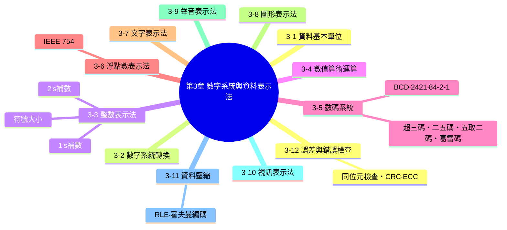
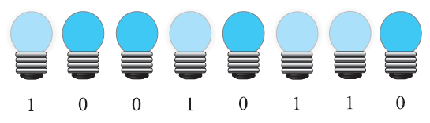
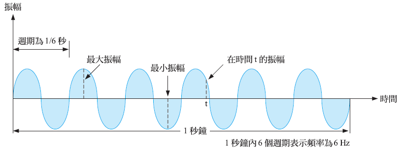
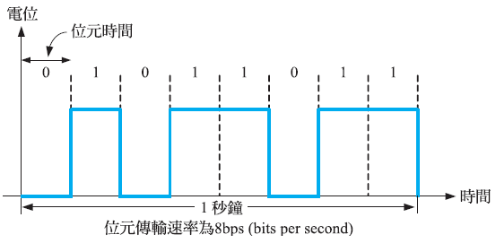
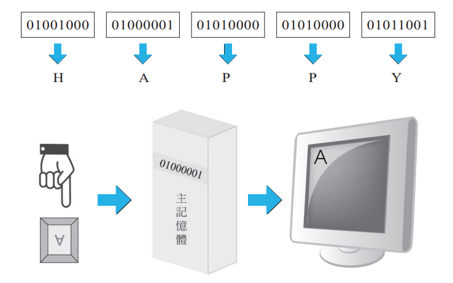
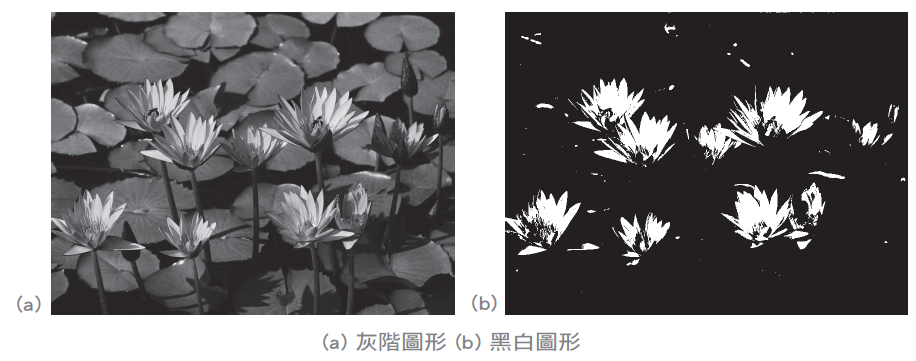
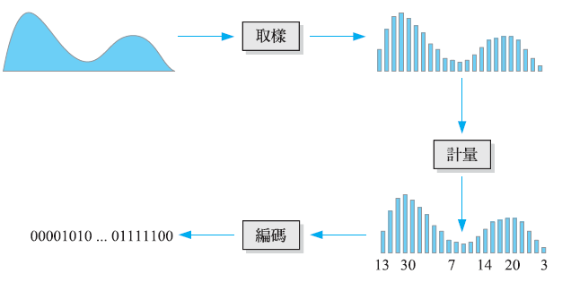
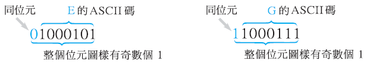

# 第 3 章　數字系統與資料表示法

> 本講義以《最新計算機概論》第十二版 第 3 章 PPT 的架構為骨架，重新撰寫為適合課堂詳細講解的完整教學文字稿。這一章是全書計算量最大的一章，因此內文特別強調**步驟拆解**與**大量對照驗算的worked example**，並將課本隨附的「練習題」全部補上**完整計算過程**（原書僅提供最終答案），方便老師直接照著步驟板書講解。

## 本章學習地圖



**這一章要帶學生建立的核心能力：**

1. 電腦內部只認得 0 與 1，因此不管是數字、文字、圖片、聲音、影片，最終都要想辦法「翻譯」成一連串位元——這一整章其實都在回答同一個問題：**「這種資料，究竟是怎麼被翻譯成 0 與 1 的？」**
2. 二、八、十六進位之間的互相轉換，是後面所有章節（整數表示法、浮點數、編碼）的基本功，值得花時間讓學生練到手熟。
3. 資料在儲存與傳輸過程中一定會有雜訊與誤差，因此人類設計了各種「容錯」機制（同位元檢查、CRC、ECC），這也是為什麼隨身碟壞軌、網路封包遺失時，資料通常還救得回來的原因。

---

## 3-1　電腦的資料基本單位

### 從一顆燈泡的「開」與「關」說起

<table>
<tr>
<td width="40%">



</td>
<td>

電腦內部是由電子迴路構成，而電子迴路最容易穩定辨識的，就是「通電／不通電」這兩種狀態——就像一整排燈泡，每一顆燈泡都只有「亮」與「不亮」兩種狀態。電腦正是利用這種特性，發展出只有兩個值的計數系統。

</td>
</tr>
</table>

**類比資料 vs. 數位資料**：類比資料的數值是連續變化的（例如溫度、聲音的音量），數位資料則是以一格一格、不連續的數值來表示。

**類比訊號 vs. 數位訊號**：

<table>
<tr>
<td width="45%">



</td>
<td width="45%">



</td>
</tr>
</table>

電腦的資料基本單位叫做**位元（bit，binary digit）**，一個位元只有 0 與 1 兩個值，我們將這種只有兩個值的系統稱為**二進位系統（binary system）**。

### 資料單位換算表

位元是最小單位，但實務上我們更常用「位元組（byte）」及其倍數單位來描述儲存容量，換算時要特別注意是 **2 的次方倍**（1024 進位），而不是我們日常慣用的十進位千位：

| 單位 | 全名 | 換算關係 | 位元組數 |
|---|---|---|---|
| KB | 千位元組（Kilobyte） | 2¹⁰ Bytes | 1,024 Bytes |
| MB | 百萬位元組（Megabyte） | 2²⁰ Bytes | 1,048,576 Bytes |
| GB | 十億位元組（Gigabyte） | 2³⁰ Bytes | 1,073,741,824 Bytes |
| TB | 兆位元組（Terabyte） | 2⁴⁰ Bytes | 1,099,511,627,776 Bytes |
| PB | 千兆位元組（Petabyte） | 2⁵⁰ Bytes | 1,125,899,906,842,624 Bytes |
| EB | 百萬兆位元組（Exabyte） | 2⁶⁰ Bytes | 1,152,921,504,606,846,976 Bytes |

> **課堂提醒**：這正是為什麼你買的「500GB」隨身碟，插進電腦後系統顯示的容量通常會比 500GB「少一點」——因為硬體廠商在標示容量時，習慣用「1GB=10 億 Bytes」的十進位定義，但作業系統讀取容量時，用的卻是「1GB=2³⁰ Bytes（約 10.74 億）」的二進位定義，兩者換算基準不同，才會產生這個常見的認知落差。

---

## 3-2　數字系統轉換

我們日常使用的是**十進位系統**（0~9 共 10 個數字），但電腦內部使用**二進位系統**（0、1），為了方便人類閱讀，也常用**八進位系統**（0~7）與**十六進位系統**（0~9、A~F）來精簡表示二進位數字。

| 十進位 | 二進位 | 八進位 | 十六進位 |
|---|---|---|---|
| 0 | 0000 | 0 | 0 |
| 1 | 0001 | 1 | 1 |
| 2 | 0010 | 2 | 2 |
| 3 | 0011 | 3 | 3 |
| 4 | 0100 | 4 | 4 |
| 5 | 0101 | 5 | 5 |
| 6 | 0110 | 6 | 6 |
| 7 | 0111 | 7 | 7 |
| 8 | 1000 | 10 | 8 |
| 9 | 1001 | 11 | 9 |
| 10 | 1010 | 12 | A |
| 11 | 1011 | 13 | B |
| 12 | 1100 | 14 | C |
| 13 | 1101 | 15 | D |
| 14 | 1110 | 16 | E |
| 15 | 1111 | 17 | F |

> **課堂記憶技巧**：八進位每 1 位數字，剛好對應二進位的 **3 位**（因為 2³=8）；十六進位每 1 位數字，剛好對應二進位的 **4 位**（因為 2⁴=16）。這個「位數對應關係」是 3-2-3、3-2-4 小節「直接轉換法」的關鍵，務必讓學生記熟。

### 3-2-1　將二、八、十六進位數字轉換成十進位數字

**方法**：把每一位數字乘上該進位制的「位權」（該位所在位置的次方），再全部加總。

**範例 1**：5621.78₁₀（十進位數字本身就是十進位，這裡示範「位權」的概念）
$$5621.78_{10} = (5×10^3)+(6×10^2)+(2×10^1)+(1×10^0)+(7×10^{-1})+(8×10^{-2})$$

**範例 2**：10110.0011₂ 轉十進位
$$= (1×2^4)+(0×2^3)+(1×2^2)+(1×2^1)+(0×2^0)+(0×2^{-1})+(0×2^{-2})+(1×2^{-3})+(1×2^{-4})$$
$$= 16+0+4+2+0+0+0+0.125+0.0625 = 22.1875_{10}$$

**範例 3**：51763.2₈ 轉十進位
$$= (5×8^4)+(1×8^3)+(7×8^2)+(6×8^1)+(3×8^0)+(2×8^{-1})$$
$$= 20480+512+448+48+3+0.25 = 21491.25_{10}$$

**範例 4**：F2A9.C₁₆ 轉十進位
$$= (F×16^3)+(2×16^2)+(A×16^1)+(9×16^0)+(C×16^{-1})$$
$$= (15×4096)+(2×256)+(10×16)+(9×1)+(12×0.0625)$$
$$= 61440+512+160+9+0.75 = 62121.75_{10}$$

### 3-2-2　將十進位數字轉換成二、八、十六進位數字

**方法**：整數部分「不斷除以進位基底、由下往上記餘數」；小數部分「不斷乘以進位基底、由上往下記整數部分」。

**範例**：59.75₁₀ 轉二進位

**(1) 拆成整數與小數部分**：59.75₁₀ = 59₁₀ + 0.75₁₀

**(2) 整數部分 59 不斷除以 2、記餘數（由下往上讀）**：

```
2 | 59
2 | 29 ... 餘 1  ↑
2 | 14 ... 餘 1  │
2 |  7 ... 餘 0  │ 由下往上讀
2 |  3 ... 餘 1  │
2 |  1 ... 餘 1  │
     0 ... 餘 1  ┘
```
除到商為 0 時停止，然後由下往上（最後的餘數是最高位）讀出：**111011**

**(3) 小數部分 0.75 不斷乘以 2、取整數部分（由上往下讀）**：

```
0.75 × 2 = 1.50 → 取整數部分 1，剩小數 0.50
0.50 × 2 = 1.00 → 取整數部分 1，剩小數 0（到此為止）
```
由上往下讀出：**11**

**(4) 合併整數與小數部分**：59.75₁₀ = **111011.11₂**

### 3-2-3　將八或十六進位數字轉換成二進位數字（直接轉換法）

因為 8=2³、16=2⁴，只要把每一位數字**直接展開成固定位數的二進位**即可，不需要先轉十進位再轉換，速度快很多：

**範例**：5762.13₈ 轉二進位（每位展開成 3 位元）

$$5\ 7\ 6\ 2\ .\ 1\ 3 \rightarrow 101\ 111\ 110\ 010\ .\ 001\ 011$$

合併去掉不必要的前導 0：**101111110010.011₂**

**範例**：E8C4.B₁₆ 轉二進位（每位展開成 4 位元）

$$E\ 8\ C\ 4\ .\ B \rightarrow 1110\ 1000\ 1100\ 0100\ .\ 1011$$

**1110100011000100.1011₂**

### 3-2-4　將二進位數字轉換成八或十六進位數字（直接轉換法）

反過來，只要**從小數點為中心，往左往右每 3 位（轉八進位）或每 4 位（轉十六進位）分一組**，不足的位數補 0，再各自轉成對應的數字即可。

**範例**：10110111.1001₂ 轉八進位（從小數點左右每 3 位一組）

$$010\ 110\ 111\ .\ 100\ 100 \rightarrow 2\ 6\ 7\ .\ 4\ 4 = 267.44_8$$

**範例**：10010111.0100011₂ 轉十六進位（每 4 位一組）

$$1001\ 0111\ .\ 0100\ 0110 \rightarrow 9\ 7\ .\ 4\ 6 = 97.46_{16}$$

> **課堂提醒**：分組時「整數部分由小數點往左補 0」、「小數部分由小數點往右補 0」，方向千萬不能搞反，這是學生最常出錯的地方。

---

## 3-3　整數表示法

電腦要表示「負數」，需要一套規則，常見的有三種表示法，都假設使用 n 個位元、**最左邊的位元（MSD）代表正負符號**（0 為正、1 為負）：

| 表示法 | 剩下 n-1 位元的意義 | 正整數範圍 | 負整數範圍 |
|---|---|---|---|
| **符號大小**（signed-magnitude） | 直接表示數值大小 | 0 ~ 2ⁿ⁻¹−1 | −(2ⁿ⁻¹−1) ~ 0 |
| **1's 補數** | 正數：直接表示數值；負數：把正數每一位元都反相（0↔1） | 0 ~ 2ⁿ⁻¹−1 | −(2ⁿ⁻¹−1) ~ 0 |
| **2's 補數** | 正數：直接表示數值；負數：1's 補數再 +1 | 0 ~ 2ⁿ⁻¹−1 | −2ⁿ⁻¹ ~ 0 |

> **課堂重點提醒**：**2's 補數是目前電腦實際採用的表示法**，因為它有兩大優勢：① 沒有「正零」與「負零」的區別問題（符號大小法與 1's 補數法都會出現 +0 和 -0 兩種不同的位元圖樣表示 0，2's 補數則只有一種）；② 加減法可以統一用同一套電路處理，不需要額外判斷正負號，大幅簡化硬體設計。

### 不同數值表示法對照表（4 位元示範）

| 十進位 | 符號大小 | 1's補數 | 2's補數 |
|---|---|---|---|
| +8 | 無 | 無 | 1000 |
| +7 | 0111 | 0111 | 0111 |
| +6 | 0110 | 0110 | 0110 |
| +5 | 0101 | 0101 | 0101 |
| +4 | 0100 | 0100 | 0100 |
| +3 | 0011 | 0011 | 0011 |
| +2 | 0010 | 0010 | 0010 |
| +1 | 0001 | 0001 | 0001 |
| +0 | 0000 | 0000 | 0000 |
| −0 | 1000 | 1111 | 無 |
| −1 | 1001 | 1110 | 1111 |
| −2 | 1010 | 1101 | 1110 |
| −3 | 1011 | 1100 | 1101 |
| −4 | 1100 | 1011 | 1100 |
| −5 | 1101 | 1010 | 1011 |
| −6 | 1110 | 1001 | 1010 |
| −7 | 1111 | 1000 | 1001 |

觀察這張表可以發現：**2's 補數比符號大小法／1's 補數法「多表示了一個負數」（−8），卻少了一個重複的 0**，這正是因為 2's 補數沒有 −0 的緣故。

**如何快速求一個數的 2's 補數？** 兩種等價方法：

- **方法一**：先取 1's 補數（每位元反相），再整體 +1。
- **方法二（更快）**：由右往左找到第一個 1，這個 1 保持不變，這個 1 左邊的所有位元全部反相。

**範例**：求 −48 的 2's 補數表示法（假設 8 位元）

48₁₀ = 00110000₂ → 1's 補數（每位反相）：11001111 → +1 → **11010000**（這就是 −48 的 2's 補數表示法）

---

## 3-4　數值算術運算

電腦內部的加減乘除，最終都是透過二進位的加法電路來完成（減法＝加上被減數的補數；乘法＝多次加法；除法＝多次減法），這裡示範基本的二進位四則運算規則。

### 3-4-1　加法

二進位加法規則：0+0=0、0+1=1、1+0=1、**1+1=10（進位）**、1+1+1=11（進位）

**範例**：111010₂ + 110011₂

```
    111010
  + 110011
  --------
   1101101
```

### 3-4-2　減法

二進位減法規則：0−0=0、1−0=1、1−1=0、**0−1=1（向前借位）**

**範例**：00001010₂ − 00000011₂

```
    00001010
  − 00000011
  ----------
    00000111
```

### 3-4-3　乘法

和十進位直式乘法邏輯相同：把被乘數乘上乘數的每一位，對齊位數後全部相加。

**範例**：1101₂ × 1011₂

```
      1101
    ×  1011
    -------
      1101
     1101
    0000
   1101
   --------
   10001111
```

### 3-4-4　除法

和十進位長除法邏輯相同：反覆比較、減法、記下商數。

**範例**：11110001₂ ÷ 1001₂

```
        11001   ← 商數
      -------
1001 ) 11110001
       1001
       ----
        1011
        1001
        ----
         0100 1
         1001... (不足，商為0，往下取一位)
        -----
          10001
           1001
           ----
           1000  ← 餘數
```

---

## 3-5　數碼系統

除了直接的二進位表示法，工程上還發展出多種「數碼」，用固定長度的位元圖樣來表示 0~9 的十進位數字，各有不同的應用場景（例如節省硬體電路、方便偵錯、方便類比訊號轉換等）。以下用「數字 62」貫穿全部範例，方便對照。

### 3-5-1　BCD 碼（Binary-Coded Decimal，8421 碼）

最直覺的數碼，就是把每個十進位數字，各自獨立轉換成 4 位元二進位（權重 8,4,2,1）。

| 十進位 | BCD碼 | 十進位 | BCD碼 |
|---|---|---|---|
| 0 | 0000 | 5 | 0101 |
| 1 | 0001 | 6 | 0110 |
| 2 | 0010 | 7 | 0111 |
| 3 | 0011 | 8 | 1000 |
| 4 | 0100 | 9 | 1001 |

**62 的 BCD 碼** = 6(0110) + 2(0010) = **01100010**

### 3-5-2　2421 碼

權重為 2,4,2,1 的自補碼（每個數字的碼與其 9 的補數，碼型剛好互為反相）。

| 十進位 | 2421碼 | 十進位 | 2421碼 |
|---|---|---|---|
| 0 | 0000 | 5 | 1011 |
| 1 | 0001 | 6 | 1100 |
| 2 | 0010 | 7 | 1101 |
| 3 | 0011 | 8 | 1110 |
| 4 | 0100 | 9 | 1111 |

### 3-5-3　84-2-1 碼

權重為 8,4,−2,−1 的自補碼。

| 十進位 | 84-2-1碼 | 十進位 | 84-2-1碼 |
|---|---|---|---|
| 0 | 0000 | 5 | 1011 |
| 1 | 0111 | 6 | 1010 |
| 2 | 0110 | 7 | 1001 |
| 3 | 0101 | 8 | 1000 |
| 4 | 0100 | 9 | 1111 |

**62 的 84-2-1 碼** = 6(1010) + 2(0110) = **10100110**

### 3-5-4　超三碼（Excess-3 code）

把每個數字的 BCD 碼**再加上 3**（0011），因此得名。

| 十進位 | 超三碼 | 十進位 | 超三碼 |
|---|---|---|---|
| 0 | 0011 | 5 | 1000 |
| 1 | 0100 | 6 | 1001 |
| 2 | 0101 | 7 | 1010 |
| 3 | 0110 | 8 | 1011 |
| 4 | 0111 | 9 | 1100 |

**62 的超三碼** = 6(1001) + 2(0101) = **10010101**

### 3-5-5　二五碼（Biquinary code）

7 位元的碼，前 2 位元表示「屬於 0~4 還是 5~9 這一組」，後 5 位元用「其中一位是 1、其餘為 0」表示組內的確切位置。

| 十進位 | 二五碼 | 十進位 | 二五碼 |
|---|---|---|---|
| 0 | 0100001 | 5 | 1000001 |
| 1 | 0100010 | 6 | 1000010 |
| 2 | 0100100 | 7 | 1000100 |
| 3 | 0101000 | 8 | 1001000 |
| 4 | 0110000 | 9 | 1010000 |

**62 的二五碼** = 6(1000010) + 2(0100100) = **10000100100100**

### 3-5-6　五取二碼（Two-out-of-five code）

5 位元的碼，其中恰好有 2 個位元是 1，因此天生具有簡單的錯誤偵測能力（只要解碼時發現 1 的個數不是 2 個，就知道發生錯誤）。

| 十進位 | 五取二碼 | 十進位 | 五取二碼 |
|---|---|---|---|
| 0 | 00011 | 5 | 01100 |
| 1 | 00101 | 6 | 10001 |
| 2 | 00110 | 7 | 10010 |
| 3 | 01001 | 8 | 10100 |
| 4 | 01010 | 9 | 11000 |

**62 的五取二碼** = 6(10001) + 2(00110) = **1000100110**

### 3-5-7　葛雷碼（Gray code）

葛雷碼最大的特色是**相鄰兩個數字的碼，恰好只差一個位元**，這個特性讓它特別適合用在旋轉編碼器、類比訊號轉換等場合——因為機械或訊號在切換相鄰數值時，只需要翻轉一個位元，可以大幅降低切換瞬間產生的雜訊與誤判。

**反射葛雷碼（reflected gray code）公式**：
$$G_{n+1} = \{0G_n,\ 1G_n^{ref}\}，\quad G_1=\{0,1\}，\quad n\geq1$$

也就是：**下一階的葛雷碼＝「0＋目前的葛雷碼」接上「1＋目前葛雷碼上下顛倒（鏡射）」**。

**建構過程**：
- G₁ = {0, 1}
- G₂ = {0+G₁, 1+G₁的鏡射} = {00, 01, 11, 10}
- G₃ = {0+G₂, 1+G₂的鏡射} = {000, 001, 011, 010, 110, 111, 101, 100}

**二進位 ↔ 葛雷碼互轉公式**：

- 二進位 BₙBₙ₋₁…B₁ 轉葛雷碼 GₙGₙ₋₁…G₁：$$G_k = \begin{cases}B_k, & k=n \\ B_{k+1}\oplus B_k, & 1\leq k\leq n-1\end{cases}$$
- 葛雷碼 GₙGₙ₋₁…G₁ 轉二進位 BₙBₙ₋₁…B₁：$$B_k = \begin{cases}G_k, & k=n \\ B_{k+1}\oplus G_k, & 1\leq k\leq n-1\end{cases}$$

白話來說：**二進位轉葛雷碼**——最高位不變，其餘每一位都是「自己與左邊相鄰位元」做 XOR；**葛雷碼轉二進位**——最高位不變，其餘每一位都是「自己與剛剛算出的左邊二進位結果」做 XOR（必須從左往右依序計算）。

---

## 3-6　浮點數表示法（IEEE 754）

整數表示法沒辦法表示小數，因此電腦另外設計了一套模仿「科學記號」的浮點數表示法，業界標準是 **IEEE 754**：

<table>
<tr>
<td colspan="4" align="center"><b>IEEE 754 Single 格式（32 位元）</b></td>
</tr>
<tr>
<td align="center">1 位元</td><td align="center">8 位元</td><td colspan="2" align="center">23 位元</td>
</tr>
<tr>
<td align="center">S（符號）</td><td align="center">E（偏移指數）</td><td colspan="2" align="center">F（尾數）</td>
</tr>
</table>

- **S（符號位元）**：0 表示正數，1 表示負數。
- **E（偏移指數，8 位元）**：真正的指數 = E − 127（這個 127 稱為「偏移值 bias」，用意是讓指數可以用無符號的方式儲存正負指數）。
- **F（尾數，23 位元）**：數字正規化成 1.xxxx × 2ⁿ 之後，小數點後面的部分（開頭的 1 因為固定存在，不需要儲存，稱為「隱含位元」）。

Double 格式則是用 64 位元（1 位符號 + 11 位指數 + 52 位尾數），原理完全相同，只是精確度更高。

### 完整範例：以 IEEE 754 Single 格式表示 22.5

1. **正規化**：22.5₁₀ = 10110.1₂ = **1.01101 × 2⁴**
2. **求 S**：22.5 是正數，S = **0**
3. **求 E**：真正指數為 4，偏移指數 E = 4+127 = 131 = **10000011**
4. **求 F**：正規化後小數點後為 01101，補滿 23 位元 → **01101000000000000000000**
5. **合併 S、E、F**：**0 10000011 01101000000000000000000**

### IEEE 754 Single 格式所能表示的最大與最小數字

- 最大 normalized 正數：2²⁵⁴⁻¹²⁷ × (1.1111111111111111111111)
- 最小 normalized 正數：2¹⁻¹²⁷ × (1.0000000000000000000000)
- 最大 denormalized 正數：2⁰⁻¹²⁶ × (0.1111111111111111111111)
- 最小 denormalized 正數：2⁰⁻¹²⁶ × (0.0000000000000000000001)

（負數部分的最大最小值，只要在上述數值前面加上負號即可，數值大小完全對稱。）

> **課堂補充：特殊值的判讀**——IEEE 754 保留了 E 的兩個極端值做特殊用途：
> - **E 全為 1（255）、F=0**：表示「無限大」（正負號由 S 決定）
> - **E 全為 1（255）、F≠0**：表示 **NaN**（Not a Number，不是一個合法數字，通常是 0/0 或 ∞−∞ 這類未定義運算的結果）
> - **E 全為 0（0）、F=0**：表示 **0**（正負號由 S 決定）
> - **E 全為 0（0）、F≠0**：表示前面提到的 **denormalized（非正規化）數字**，用來表示比最小正規化數字還要更接近 0 的極小數字
> - **E=0、F≠0（也就是 denormalized 的情況）**：這種情況下數字**無法正規化**，因為最小的正規化數字已經是 2⁻¹²⁶ 這個下限了。
## 3-7　文字表示法

<table>
<tr>
<td width="40%">



</td>
<td>

當你按下鍵盤上的「A」鍵，電腦其實是把這個按鍵轉換成一組固定的二進位編碼（例如 01000001）存進記憶體，螢幕收到這組編碼後，再把它顯示成「A」這個字元——文字表示法要解決的問題，就是「幫每一個字元，指定一組固定的位元編碼」。

</td>
</tr>
</table>

**常見的文字編碼方式：**

- **ASCII（American Standard Code for Information Interchange，唸作 "as-key"）**：用 7 個位元表示 128 個字元，涵蓋英文大小寫字母、數字、標點符號與控制字元。
- **EASCII（Extended ASCII）**：把 ASCII 擴充到 8 個位元，多出的 128 個編碼可以表示各國語言的特殊符號。
- **中文編碼方式**：中文字數龐大，需要用 2 個位元組（16 位元）以上才能表示，常見的有 Big5（繁體中文）、GB2312（簡體中文）等。
- **Unicode**：為了統一全世界所有語言的文字編碼、解決不同編碼系統互相衝突的問題所制定的萬國碼，目前是網路與作業系統的主流標準，最常見的實作方式是 UTF-8。

### ASCII 字元表（節錄英文字母與數字，共 26+26+10=62 個常用字元）

| 字元 | ASCII碼(十進位) | ASCII碼(二進位) | 字元 | ASCII碼(十進位) | ASCII碼(二進位) |
|---|---|---|---|---|---|
| A | 65 | 01000001 | S | 83 | 01010011 |
| B | 66 | 01000010 | T | 84 | 01010100 |
| C | 67 | 01000011 | U | 85 | 01010101 |
| D | 68 | 01000100 | V | 86 | 01010110 |
| E | 69 | 01000101 | W | 87 | 01010111 |
| F | 70 | 01000110 | X | 88 | 01011000 |
| G | 71 | 01000111 | Y | 89 | 01011001 |
| H | 72 | 01001000 | Z | 90 | 01011010 |
| I | 73 | 01001001 | 0 | 48 | 00110000 |
| J | 74 | 01001010 | 1 | 49 | 00110001 |
| K | 75 | 01001011 | 2 | 50 | 00110010 |
| L | 76 | 01001100 | 3 | 51 | 00110011 |
| M | 77 | 01001101 | 4 | 52 | 00110100 |
| N | 78 | 01001110 | 5 | 53 | 00110101 |
| O | 79 | 01001111 | 6 | 54 | 00110110 |
| P | 80 | 01010000 | 7 | 55 | 00110111 |
| Q | 81 | 01010001 | 8 | 56 | 00111000 |
| R | 82 | 01010010 | 9 | 57 | 00111001 |

> **課堂記憶技巧**：大寫字母 A~Z 的 ASCII 碼是連續的 65~90，小寫字母 a~z 則是連續的 97~122（大寫恰好比小寫少 32，也就是二進位的第 6 個位元剛好相反）——只要記住 A=65、a=97，其餘字母都可以用「字母順序＋起始值」推算出來，不需要死背整張表。

---

## 3-8　圖形表示法

電腦圖形依照儲存原理不同，分成點陣圖與向量圖兩大類，兩者的優缺點恰好互補：

### 3-8-1　點陣圖（Bitmap）

<table>
<tr>
<td width="45%">



</td>
<td>

點陣圖是由一個個小方格所組成，以矩形格線排列方式排列，每一個小方格稱為一個**像素（pixel）**。相片、螢幕截圖幾乎都是點陣圖格式，**放大到一定程度就會看到一格一格的鋸齒**，這正是像素被放大的結果。

</td>
</tr>
</table>

**色彩深度（color depth）**：決定每個像素能表示多少種顏色，深度愈高、檔案愈大、色彩愈細緻：

| 色彩深度 | 每像素位元數 | 可表示顏色數 |
|---|---|---|
| 黑白 | 1 位元 | 2 種（黑／白） |
| 灰階 | 8 位元 | 256 種灰階 |
| 16 色 | 4 位元 | 16 種 |
| 256 色 | 8 位元 | 256 種 |
| 高彩（16-bit） | 16 位元 | 65,536 種 |
| 全彩（24-bit） | 24 位元 | 16,777,216 種 |

**常見的點陣圖檔格式**：BMP、JPEG、GIF、PNG、WebP。

**點陣圖檔案大小的計算公式**：
$$\text{檔案大小（位元）} = \text{影像寬度（像素）} \times \text{影像高度（像素）} \times \text{每像素位元數}$$

**範例**：一張 1024×1024 的 256 色圖形需要多少空間？

256 色需要 8 位元／像素（因為 2⁸=256），所以：
$$1024 \times 1024 \times 8\ \text{bits} = 8,388,608\ \text{bits} = 1,048,576\ \text{Bytes} = 1024\text{KB} = 1\text{MB}$$

### 3-8-2　向量圖（Vector Graphic）

<table>
<tr>
<td width="45%">


*AutoCAD 使用向量圖檔（圖片來源：Autodesk 網站）*

</td>
<td>

向量圖是由數學方式產生的點、線、多邊形等形狀所組成，能夠隨意縮放、旋轉及傾斜，**不會失真或出現鋸齒狀**——這正是向量圖與點陣圖最根本的差異：點陣圖放大會模糊、鋸齒化，向量圖放大後線條依然銳利平滑，因為它本質上是用數學公式重新計算，而不是把既有的像素格放大。

**常見的向量圖檔格式**：SVG、DXF、DWG、AI、EPS。這類格式很適合用在商標設計、工程製圖、需要反覆縮放輸出的場合。

</td>
</tr>
</table>

### 掃描解析度（PPI）的計算

掃描器、印表機常用 **PPI（Pixels Per Inch）或 DPI（Dots Per Inch）**表示解析度，計算公式為：

$$\text{PPI} = \sqrt{\dfrac{\text{總像素數}}{\text{影像面積（平方英吋）}}}$$

**範例**：把一張 4×6 英吋的彩色照片掃描成 3,840,000 像素的圖檔，掃描器的解析度應該設定多少？

$$\text{面積}=4\times6=24\ \text{平方英吋}$$
$$\text{PPI}=\sqrt{\dfrac{3{,}840{,}000}{24}}=\sqrt{160{,}000}=400$$

答：掃描器解析度應設定為 **400 PPI（400dpi）**。

---

## 3-9　聲音表示法

<table>
<tr>
<td width="45%">



</td>
<td>

由於聲音（audio）屬於連續的類比訊號，而電腦只能接受 0 與 1 的數位訊號，因此，聲音必須經過如下圖的轉換過程，才能儲存於電腦：**取樣（sampling）→ 量化（quantization）→ 編碼（encoding）**。

</td>
</tr>
</table>

- **取樣頻率（sampling rate）**：每秒對聲音波形擷取多少個樣本，單位是 Hz。取樣頻率愈高，還原出來的聲音愈接近原始聲音，但檔案也愈大。CD 音質的取樣頻率是 44.1KHz（每秒取樣 44,100 次）。
- **取樣解析度（bit depth）**：每個樣本用多少位元來記錄音量大小，位元數愈多、音量的層次愈細緻。CD 音質使用 16 位元。
- **聲道數**：單聲道（mono）記錄 1 軌，立體聲（stereo）記錄 2 軌（左、右耳分開）。

**未壓縮音訊檔案大小的計算公式**：
$$\text{檔案大小} = \text{取樣頻率} \times \dfrac{\text{取樣解析度}}{8} \times \text{聲道數} \times \text{時間（秒）}$$

**常見的聲音檔格式**：WAV、AIFF、MP3、WMA、AAC、Vorbis、Opus、FLAC、ALAC——其中 **WAV、AIFF、FLAC、ALAC 屬於無失真格式**，MP3、WMA、AAC、Vorbis、Opus 則屬於失真壓縮格式（詳見 3-11 節）。

---

## 3-10　視訊表示法

視訊本質上就是「連續播放的一張張影像（畫格）」加上「同步的聲音」，因此檔案大小會同時受到畫面解析度、畫格率（fps）與音訊品質三者影響。

**常見的數位電視解析度標準**：SDTV、HDTV、UHDTV（解析度依序遞增）

**常見的視訊檔格式**：AVI、MPEG、MOV、WMV、Ogg、WebM

**常見的視訊編解碼器（codec）**：H.264、H.265、H.266、VP8、VP9、AV1——編解碼器負責把體積龐大的原始影像資料，壓縮成容易儲存與傳輸的檔案，同一部影片用不同編碼器壓縮，畫質與檔案大小可能有明顯差異。

---

## 3-11　資料壓縮

資料壓縮（data compression）的目的在於減少資料的儲存空間，常見的壓縮技術分為兩種：

- **無失真壓縮（lossless compression）**：解壓縮後可以完全還原成原始資料，不會遺失任何資訊，適合文字、程式檔案等不容許失真的資料。
- **失真壓縮（lossy compression）**：解壓縮後無法完全還原，會犧牲部分細節換取更高的壓縮率，適合圖片、音訊、視訊等人類感官不容易察覺細微差異的資料（例如 JPEG、MP3）。

### 3-11-1　重複次數編碼（RLE，Run-Length Encoding）

RLE 是最簡單的無失真壓縮技術，原理是**記錄符號連續出現的次數**，而不是把每個符號都存一遍——愈是有大量連續重複符號的資料（例如傳真文件的大片空白），壓縮效果愈好。

**範例**（原始資料以 4 位元一組記錄「連續出現的次數」，並假設交替紀錄 1 與 0 的連續長度，從資料的第一個位元開始）：

```
原始資料：1111111111101100111000111
壓縮後　：1110  0011  0000  0111
          (14個1)(3個0)(0個1，佔位)(7個0)
```

> **課堂重點**：RLE 的壓縮效果高度仰賴資料本身「有沒有大量連續重複」的特性——如果資料是 010101010101 這種每個符號都在變化，RLE 完全沒有壓縮效果，甚至可能讓檔案「愈壓愈大」，這是使用 RLE 前必須評估的重點。

### 3-11-2　霍夫曼編碼（Huffman Coding）

RLE 只對「連續重複」有效，霍夫曼編碼則是更聰明的做法：**讓出現頻率愈高的符號，用愈短的編碼表示；出現頻率愈低的符號，用愈長的編碼表示**，藉此讓整體平均編碼長度最短。這正是摩斯電碼「E 用一個點、Q 用較長編碼」背後同樣的設計精神。

**霍夫曼編碼的步驟：**

1. 找出所有符號的出現頻率。
2. 將頻率最低的兩者相加，得出另一個頻率（合併成一個新節點）。
3. 重複步驟 2，不斷將頻率最低的兩者相加，直到只剩下一個頻率為止（樹的根）。
4. 根據合併的關係配置 0 與 1（例如每次合併時，左分支給 0、右分支給 1），而形成一棵編碼樹；從樹根走到每個符號的路徑，就是該符號的編碼。

**完整範例**：假設資料是由 20 個 A、15 個 B、30 個 C、18 個 D、5 個 E、12 個 F 所組成，試據此建構霍夫曼樹，並求出資料的最小編碼長度。

**步驟 1**：資料長度 = 20+15+30+18+5+12 = 100 個字母，出現頻率如下：

| A | B | C | D | E | F |
|---|---|---|---|---|---|
| 20/100 (0.2) | 15/100 (0.15) | 30/100 (0.3) | 18/100 (0.18) | 5/100 (0.05) | 12/100 (0.12) |

**步驟 2～4**：反覆合併最小的兩個頻率——

- E(5) + F(12) = 17
- B(15) + 17 = 32
- D(18) + A(20) = 38
- 32 + C(30) = 62
- 38 + 62 = 100（樹根）

**依合併順序配置 0/1、回推每個符號的編碼長度**（採用課本範例的配置方式）：

| 符號 | A | B | C | D | E | F |
|---|---|---|---|---|---|---|
| 出現次數 | 20 | 15 | 30 | 18 | 5 | 12 |
| 編碼長度 | 2 bits | 3 bits | 2 bits | 2 bits | 4 bits | 4 bits |

**最小編碼總長度** = 20×2 + 15×3 + 30×2 + 18×2 + 5×4 + 12×4 = 40+45+60+36+20+48 = **249 位元**（相較於固定用 3 位元編碼 6 個符號、需要 100×3=300 位元，霍夫曼編碼省下了約 17% 的空間）。

> **課堂提醒**：霍夫曼樹在「頻率相同」的情況下，合併順序可能有多種選擇，因此不同人畫出來的樹形狀可能不完全相同，但只要遵循「每次合併最小的兩個」這個規則，**算出來的整體最小編碼總長度必定相同**，這是霍夫曼演算法「最優性」的保證。

---

## 3-12　誤差與錯誤檢查

資料在儲存與傳輸過程中，除了人為操作或程式邏輯造成的錯誤外，電腦本身也存在著誤差的問題：

- **固有誤差（inherent error）**：資料本身在轉換過程中，因為有效位數限制而產生的誤差（例如 1/3 這種無窮小數，儲存時必然要在某處被截斷）。
- **捨棄誤差**：包含「round-off error（四捨五入誤差）」與「truncation error（無條件捨去誤差）」。

而資料在傳輸過程中，也可能因為雜訊干擾導致位元被錯誤翻轉（0 變 1 或 1 變 0），因此需要**錯誤檢查技術**，常見的有三種：

### 3-12-1　同位元檢查（Parity Bit Check）

<table>
<tr>
<td width="45%">



</td>
<td>

原理是在發送端開始傳送資料前，先在原始資料的位元圖樣加上一個同位位元（parity bit），令整個位元圖樣包含的 1 的個數為**偶數**（偶同位）或**奇數**（奇同位）；接收端接收之後，就檢查收到的位元圖樣是否仍符合原本約定的奇偶規則，若不符合，就代表發生錯誗。

</td>
</tr>
</table>

**範例（偶同位）**：E 的 ASCII 碼是 1000101（7 位元），1 的個數為 3 個（奇數），因此同位元設為 **1**，讓整個位元圖樣（含同位元）的 1 有偶數個（4 個）：**01000101**。

**判斷是否偵測到錯誤，只要重新計算收到的位元圖樣中 1 的個數，是否符合原本約定的奇偶性即可。**

> **課堂重點（也是選擇題常考重點）**：同位元檢查有一個關鍵限制——**只能偵測「奇數個」位元發生錯誤**（例如 1 個、3 個位元被翻轉），**如果剛好有「偶數個」位元同時發生錯誤（例如 2 個位元都被翻轉），則整體 1 的個數的奇偶性不會改變**，因此同位元檢查會誤判為「沒有錯誗」，完全偵測不出來。這正是同位元檢查最大的弱點：它是一種簡單但不完備的錯誤偵測機制。

### 3-12-2　循環冗餘碼（CRC，Cyclic Redundancy Check）

CRC 比同位元檢查更可靠，原理是把資料視為一個二進位多項式，除以一個事先約定好的「生成多項式」，取得的**餘數**就是 CRC 碼，一併附加在資料後面送出；接收端收到後，用同樣的生成多項式再除一次，若餘數為 0，就代表資料正確無誤。

**範例**：假設資料位元為 110101110，生成多項式 X³+1（1001），試求 CRC 碼及加上 CRC 碼後的完整訊息。

1. 先在原始資料的位元圖樣後面加上 3 個 0（因為生成多項式的最高次方是 3），得到 110101110000。
2. 使用 modulo-2 除法運算求取 110101110000 除以生成多項式 X³+1（1001）的餘數。

```
              110100001
        ------------------
 1001 ) 110101110000
        1001
        ----
         1001
         1001
         ----
          0111
             0
          ----
           1110
           1001
           ----
            1111
            1001
            ----
             1100
             1001
             ----
              1010
              1001
              ----
               0110
                  0
               ----
                111  ← 餘數（CRC碼）
```

3. CRC 碼為步驟 2 求出的餘數 **111**，完整訊息則是在原始資料後面加上 CRC 碼，得到 **110101110111**。

### 3-12-3　錯誤更正碼（ECC，Error Correcting Code）

同位元檢查與 CRC 都只能**偵測**錯誗，但沒辦法知道究竟是哪一個位元錯了，因此無法自動修正。**錯誤更正碼**則更進一步，讓每一組合法的位元圖樣（碼字）彼此之間都保持足夠大的差異（**漢明距離**），只要傳輸過程中發生的錯誤位元數不超過容許範圍，接收端就能自動找出「最接近的合法碼字」，直接修正錯誗，不必要求重新傳送。

**漢明距離（Hamming Distance）**：兩個等長位元圖樣之間，「不同位元」的個數。例如 000000 與 010011 之間，有 3 個位元不同，漢明距離為 3。

**範例**：以下表的錯誤更正碼為例，每個位元圖樣之間的漢明距離均大於等於 3：

| 字元 | 位元圖樣 | 字元 | 位元圖樣 |
|---|---|---|---|
| A | 000000 | E | 100110 |
| B | 001111 | F | 101001 |
| C | 010011 | G | 110101 |
| D | 011100 | H | 111010 |

假設接收到的位元圖樣為 111011，我們可以計算該位元圖樣與每個字元的漢明距離，得到與字元 **H** 的漢明距離最短（只差 1 個位元），於是將之更正為 **H**（111010）。

**為什麼漢明距離要「大於等於 3」？** 因為只要任兩個合法碼字之間的漢明距離都 ≥3，當某個碼字只發生 1 個位元錯誗時，錯誤後的位元圖樣與「正確碼字」的距離是 1，但與「其他任何碼字」的距離必定 ≥2，因此永遠可以正確地找到唯一、最接近的合法碼字，達到「更正 1 個位元錯誤」的效果。**但如果同時發生 2 個位元錯誤，就可能造成誤判**（錯誤後的位元圖樣可能剛好與另一個錯誤的碼字距離更近），這也是為什麼要偵測與更正愈多位元的錯誤，就需要讓碼字之間的漢明距離設計得愈大。

> **課堂公式補充**：一組具備「更正 t 個位元錯誤」能力的錯誤更正碼，任兩個合法碼字之間的最小漢明距離，必須滿足 $d_{min} \geq 2t+1$。這也是練習題「錯誤更正碼漢明距離必須大於等於多少，系統才能更正 x 個錯誤」的計算依據：$d_{min}=2x+1$，也就是選項中的 **(2x+1)**。

---

## 本章總結

| 小節 | 核心觀念一句話 |
|---|---|
| 3-1 資料基本單位 | 位元是最小單位，容量換算是「2 的次方倍」而非十進位千位 |
| 3-2 數字系統轉換 | 八進位對應二進位 3 位一組、十六進位對應 4 位一組，可直接互轉 |
| 3-3 整數表示法 | 2's 補數是電腦實際採用的表示法，沒有 −0、加減法電路可共用 |
| 3-4 數值算術運算 | 二進位加減乘除的邏輯與十進位完全相同，只是進位基準改成 2 |
| 3-5 數碼系統 | 不同數碼各有巧妙的權重或自我糾錯設計（自補、恰兩個1等） |
| 3-6 浮點數表示法 | IEEE 754 用符號、偏移指數、尾數三段式模仿科學記號表示小數 |
| 3-7 文字表示法 | ASCII 用固定編碼對應字元，中文與多語言則需要 Unicode |
| 3-8 圖形表示法 | 點陣圖由像素組成、會失真；向量圖由數學公式組成、可任意縮放 |
| 3-9 聲音表示法 | 類比聲音須經取樣、量化、編碼才能變成電腦看得懂的數位訊號 |
| 3-10 視訊表示法 | 視訊＝畫格序列＋聲音，檔案大小取決於解析度、畫格率與編碼器 |
| 3-11 資料壓縮 | RLE 靠連續重複、霍夫曼編碼靠出現頻率，都是無失真壓縮技術 |
| 3-12 誤差與錯誤檢查 | 同位元檢查只能測奇數個錯誤，CRC 更可靠，ECC 甚至能自動修正 |

### 關鍵詞彙表（Glossary）

`位元` `位元組` `二進位系統` `八進位系統` `十六進位系統` `符號大小` `1's補數` `2's補數` `BCD碼` `2421碼` `84-2-1碼` `超三碼` `二五碼` `五取二碼` `葛雷碼` `IEEE 754` `正規化` `尾數` `偏移指數` `ASCII` `Unicode` `點陣圖` `向量圖` `像素` `色彩深度` `PPI` `取樣` `量化` `編碼` `無失真壓縮` `失真壓縮` `RLE` `霍夫曼編碼` `固有誤差` `捨棄誤差` `同位元檢查` `CRC` `漢明距離` `ECC`
## 第 3 章　練習題（附完整計算過程）

> 課本原書「練習題」只提供最終答案，以下把**每一題的完整計算過程**補上，方便老師直接照著步驟板書講解，也方便學生對照自己的計算哪一步出錯。

**1. 將下列數字轉換成二進位數字：**

<details>
<summary>▶ 完整解答</summary>

**(1) 132.15（十進位）**

整數 132 除以 2 取餘數：132→66(0)→33(0)→16(1)→8(0)→4(0)→2(0)→1(0)→0(1)，由下往上讀：**10000100**

小數 0.15 乘以 2 取整數：0.15×2=0.30(0)、0.30×2=0.60(0)、0.60×2=1.20(1)、0.20×2=0.40(0)、0.40×2=0.80(0)、0.80×2=1.60(1)、0.60×2=1.20(1)、0.20×2=0.40(0)、0.40×2=0.80(0)、0.80×2=1.60(1)…（循環不盡，取到題目要求位數）

答：**10000100.001001100110…₂**

**(2) 7543.65₈ → 每位展開成 3 位元**

7→111、5→101、4→100、3→011、.、6→110、5→101

答：**111101100011.110101₂**

**(3) F29B.17D₁₆ → 每位展開成 4 位元**

F→1111、2→0010、9→1001、B→1011、.、1→0001、7→0111、D→1101

答：**1111001010011011.000101111101₂**

**(4) 31/32 → 先轉十進位小數 0.96875，再乘 2 取整數**

31/32 = 0.96875；0.96875×2=1.9375(1)、0.9375×2=1.875(1)、0.875×2=1.75(1)、0.75×2=1.5(1)、0.5×2=1.0(1)，到此小數為 0，停止

答：**0.11111₂**（也可以直接觀察：31=11111₂，31/32=31/2⁵，相當於把 11111 右移 5 位，直接得到 0.11111₂，是更快的解法）

</details>

**2. 將下列數字轉換成十進位數字：**

<details>
<summary>▶ 完整解答</summary>

**(1) 1101.111₂**
$$=(1×2^3)+(1×2^2)+(0×2^1)+(1×2^0)+(1×2^{-1})+(1×2^{-2})+(1×2^{-3})$$
$$=8+4+0+1+0.5+0.25+0.125=\mathbf{13.875_{10}}$$

**(2) 156.22₈**
$$=(1×8^2)+(5×8^1)+(6×8^0)+(2×8^{-1})+(2×8^{-2})$$
$$=64+40+6+0.25+0.03125=\mathbf{110.28125_{10}}$$

**(3) 59C.A₁₆**
$$=(5×16^2)+(9×16^1)+(12×16^0)+(10×16^{-1})$$
$$=1280+144+12+0.625=\mathbf{1436.625_{10}}$$

</details>

**3. 將下列數字轉換成八進位數字：**

<details>
<summary>▶ 完整解答</summary>

**(1) 11100111111.001111₂ → 從小數點左右每 3 位一組**

整數部分由右往左每 3 位一組（不足補 0）：011 100 111 111 → 3 4 7 7；小數部分由左往右每 3 位一組：001 111 → 1 47（補0後為 001 111 0 → 001 111 0…實際上 6 位剛好整除，得 1 7）

答：**3477.17₈**

**(2) 132.15（十進位）→ 除 8 取餘數 / 乘 8 取整數**

132÷8=16餘4、16÷8=2餘0、2÷8=0餘2，由下往上讀：204

0.15×8=1.2(1)、0.2×8=1.6(1)、0.6×8=4.8(4)、0.8×8=6.4(6)、0.4×8=3.2(3)…循環

答：**204.1146̄3₈**（1463 循環）

**(3) F29B.17D₁₆ → 先轉二進位，再每 3 位一組**

由題1(3)已知二進位為 1111001010011011.000101111101₂，重新分組（從小數點左右每 3 位）：
001 111 001 010 011 011 . 000 101 111 101 → 1 7 1 2 3 3 . 0 5 7 5（不足位補0）

答：**171233.0575₈**

**(4) 49/64（十進位分數）→ 49/64 = 0.765625**

0.765625×8=6.125(6)、0.125×8=1.0(1)，到此小數為0，停止

答：**0.61₈**

</details>

**4. 將下列數字轉換成十六進位數字：**

<details>
<summary>▶ 完整解答</summary>

**(1) 11100111111.001111₂ → 每 4 位一組**

0111 0011 1111 . 0011 11(00) → 7 3 F . 3 C

答：**73F.3C₁₆**

**(2) 132.15（十進位）→ 除 16 取餘數 / 乘 16 取整數**

132÷16=8餘4，8÷16=0餘8，由下往上讀：84

0.15×16=2.4(2)、0.4×16=6.4(6)、0.4×16=6.4(6)…循環（2 之後 6 不斷循環）

答：**84.26̄₁₆**（6 循環）

**(3) 7543.65₈ → 先轉二進位再每 4 位一組**

由題1(2)已知二進位為 111101100011.110101₂，重新分組：1111 0110 0011 . 1101 01(00) → F 6 3 . D 4

答：**F63.D4₁₆**

**(4) 142/256（十進位分數）= 0.5546875**

0.5546875×16=8.875(8)、0.875×16=14.0(E)，到此小數為0，停止

答：**0.8E₁₆**

</details>

**5. 寫出 IEEE 754 Single 格式所能表示的最大數字與最小數字。**

<details>
<summary>▶ 完整解答</summary>

- 最大 normalized 正數：2²⁵⁴⁻¹²⁷ × (1.11111111111111111111111)
- 最小 normalized 正數：2¹⁻¹²⁷ × (1.00000000000000000000000)
- 最大 normalized 負數：−2²⁵⁴⁻¹²⁷ × (1.11111111111111111111111)
- 最小 normalized 負數：−2¹⁻¹²⁷ × (1.00000000000000000000000)
- 最大 denormalized 正數：2⁰⁻¹²⁶ × (0.11111111111111111111111)
- 最小 denormalized 正數：2⁰⁻¹²⁶ × (0.00000000000000000000001)
- 最大 denormalized 負數：−2⁰⁻¹²⁶ × (0.11111111111111111111111)
- 最小 denormalized 負數：−2⁰⁻¹²⁶ × (0.00000000000000000000001)

（E 最大只能取 254，因為 255 保留給無限大／NaN 使用；denormalized 情況下 E=0，此時指數固定為 1−127=−126，且尾數不再有隱含的最高位 1。）

</details>

**6. 寫出下列運算式的值（假設使用 8 位元的 2's 補數表示法）：**

<details>
<summary>▶ 完整解答</summary>

先將 1101101₂（=109₁₀）與 110010₂（=50₁₀）都視為 8 位元正數：01101101、00110010

**(1) 1101101₂ + 110010₂**

```
  01101101
+ 00110010
----------
  10011111
```
兩個正數（最高位皆為 0）相加，結果最高位卻變成 1（在 8 位元 2's 補數中會被誤判為負數），這代表**發生溢位（overflow）**——因為 109+50=159，已經超出 8 位元 2's 補數能表示的正數上限（127），無法用 8 位元正確表示。

答：**發生溢位**

**(2) 1101101₂ − 110010₂**

減法＝加上減數的 2's 補數：110010 的 8 位元 2's 補數 = 11001110（先取 1's 補數 11001101，再 +1）

```
  01101101
+ 11001110
----------
 100111011 → 捨去超出8位元的最高位進位 → 00111011
```

109−50=59，00111011₂ 換算成十進位確實是 59，在正確範圍內，沒有溢位。

答：**00111011₂**

</details>

**7. 寫出 62 的 BCD 碼、84-2-1 碼、超三碼、二五碼、五取二碼。**

<details>
<summary>▶ 完整解答</summary>

拆成 6 與 2 兩個數字，分別查表後合併：

- **BCD 碼**：6=0110，2=0010 → **01100010**
- **84-2-1 碼**：6=1010，2=0110 → **10100110**
- **超三碼**：6=1001，2=0101 → **10010101**
- **二五碼**：6=1000010，2=0100100 → **10000100100100**
- **五取二碼**：6=10001，2=00110 → **1000100110**

</details>

**8. 若要將一張 4×6 彩色照片掃描成 3,840,000 像素的圖檔，那麼掃描器的解析度應該設定多少？**

<details>
<summary>▶ 完整解答</summary>

$$\text{面積}=4\times6=24\text{平方英吋}$$
$$\text{PPI}=\sqrt{\dfrac{3{,}840{,}000}{24}}=\sqrt{160{,}000}=\mathbf{400}$$

答：掃描器解析度應設定為 **400 dpi（PPI）**。

</details>

**9. 以 IEEE 754 Single 格式表示 −756.32₈。**

<details>
<summary>▶ 完整解答</summary>

**第一步：756.32₈ 轉十進位**
$$=(7×8^2)+(5×8^1)+(6×8^0)+(3×8^{-1})+(2×8^{-2})=448+40+6+0.375+0.03125=494.40625_{10}$$

**第二步：494.40625 轉二進位**

整數 494 → 111101110₂；小數 0.40625×2=0.8125(0)、0.8125×2=1.625(1)、0.625×2=1.25(1)、0.25×2=0.5(0)、0.5×2=1.0(1) → 01101

合併：**111101110.01101₂**

**第三步：正規化**：111101110.01101₂ = **1.1110111001101 × 2⁸**

**第四步：求 S、E、F**

- 是負數，S=**1**
- 真正指數=8，E=8+127=135=**10000111**
- 尾數（去掉開頭的1）＝1110111001101，補滿23位＝**11101110011010000000000**

**合併**：1　10000111　11101110011010000000000

答：**11000011111101110011010000000000**

</details>

**10. 將下列的 2's 補數表示法轉換成十進位（假設使用 4 位元儲存整數）：**

<details>
<summary>▶ 完整解答</summary>

4 位元 2's 補數：最高位為 0 表示正數（直接讀值），最高位為 1 表示負數（先取 2's 補數還原大小、再加負號）

- **(1) 0000**：最高位0，正數，值＝**0**
- **(2) 1000**：最高位1，取2's補數：0111+1=1000…（1000本身取補數＝0111反相=0111，再+1=1000，剛好繞回自己，這是4位元2's補數中唯一的特例，代表 **−8**）
- **(3) 1101**：取2's補數：0010+1=0011=3，所以原數為 **−3**
- **(4) 0110**：最高位0，正數，值＝**6**

答：**0、−8、−3、6**

</details>

**11. 根據 2's 補數表示法，一個正數加上一個負數是否會發生溢位？**

<details>
<summary>▶ 完整解答</summary>

答：**否，不會發生溢位。**

**原因**：溢位發生的條件，是運算結果的「數值大小」超出了該位元數所能表示的範圍。一個正數加上一個負數，其結果的绝對值，必定介於這兩個運算元的絕對值之間（不會比原本任一個數的絕對值更大），因此運算結果必定仍落在合法的表示範圍內，不可能發生溢位。**只有「兩個同號數（同正或同負）相加」時，才有可能發生溢位**——這也是判斷是否發生溢位的實務口訣：檢查兩個加數是否同號，若同號、且結果的符號與兩者不同，就代表發生了溢位。

</details>

**12. 根據 IEEE 754 Single 格式將 01000011000001001000000000000000 轉換成十進位數字。**

<details>
<summary>▶ 完整解答</summary>

拆解：S=0，E=10000110，F=00001001000000000000000

- S=0 → 正數
- E=10000110₂=134₁₀，真正指數＝134−127=**7**
- 尾數還原（補回隱含的1）：1.00001001

$$1.00001001_2 \times 2^7 = 10000100.1_2$$

轉十進位：$1.00001001_2 = 1+2^{-5}+2^{-8}=1+0.03125+0.00390625=1.03515625$

$$1.03515625 \times 128 = \mathbf{132.5}$$

答：**132.5**

</details>

**13. 以 IEEE 754 Single 格式表示下列數字：**

<details>
<summary>▶ 完整解答</summary>

**(1) 98.625**

98.625₁₀ 轉二進位：98=1100010₂，0.625=0.101₂，合併＝1100010.101₂

正規化：1.100010101 × 2⁶

S=0；E=6+127=133=10000101；F=100010101 補滿23位＝10001010100000000000000

答：**01000010110001010100000000000000**

**(2) −1.25**

1.25₁₀ 轉二進位：1.25 = 1.01₂（已經是正規化型式：1.01 × 2⁰）

S=1（負數）；E=0+127=127=01111111；F=01 補滿23位＝01000000000000000000000

答：**10111111101000000000000000000000**

</details>

**14. 01001001 01001101 00110010 以 ASCII 解碼的結果為＿＿＿。**

<details>
<summary>▶ 完整解答</summary>

拆成3組8位元，查ASCII表：01001001=73=I，01001101=77=M，00110010=50=2

答：**IM2**

</details>

**15. 根據第 3-12-3 節定義的錯誤更正碼將 010011101011111000000001 解碼，會得到＿＿＿，請注意，這串資料有一個位元是錯誤的。**

<details>
<summary>▶ 完整解答</summary>

拆成4組6位元：010011、101011、111000、000001

分別與表中 8 個合法碼字（A~H）逐一計算漢明距離，找出距離最短（最多差1個位元）者：

- 010011 → 與 **C**(010011) 距離0，完全相符
- 101011 → 與 **F**(101001) 距離1（只有倒數第2位不同）
- 111000 → 與 **H**(111010) 距離1（只有倒數第2位不同）
- 000001 → 與 **A**(000000) 距離1（只有最後1位不同）

答：**CFHA**

</details>

**16. 假設訊息為 1101101011，生成多項式為 X⁴+X+1（10011），那麼 CRC 碼為＿＿＿，而加上 CRC 碼後的完整訊息為＿＿＿。**

<details>
<summary>▶ 完整解答</summary>

生成多項式最高次方為4，先在訊息後面補4個0：11011010110000，再用 modulo-2 除法除以 10011：

```
              1101110
        --------------
10011 ) 11011010110000
        10011
        -----
         10001
         10011
         -----
            10 1 0
                1 0011
             -------
               0 1110
                  ...
```

逐步 XOR 運算後，得到餘數為 **0001**。

答：CRC 碼為 **0001**，完整訊息為原訊息接上 CRC 碼，即 **11011010110001**。

> **老師講解提醒**：此類長除法的 XOR 過程，建議實際在黑板上逐位示範（每次只在「最高位為1」的位置才進行 XOR，最高位為0則直接把下一位落下來延續），學生初次接觸時很容易在「補0的位數」與「何時該做XOR」這兩個地方出錯，值得放慢速度、多帶幾次範例。

</details>

**17. LUCKY 以 ASCII 編碼的結果為＿＿＿。**

<details>
<summary>▶ 完整解答</summary>

查表：L=76=01001100，U=85=01010101，C=67=01000011，K=75=01001011，Y=89=01011001

答：**01001100 01010101 01000011 01001011 01011001**

</details>

**18. 假設訊息為 ADFBBACGEECADFGACEDCCEEGFFBACDABBCAA，試據此畫出霍夫曼樹並寫下各個字母的編碼。**

<details>
<summary>▶ 完整解答</summary>

**第一步：統計出現頻率**（訊息共 36 個字母）

| 字母 | A | C | B | E | D | F | G |
|---|---|---|---|---|---|---|---|
| 次數 | 8 | 7 | 5 | 5 | 4 | 4 | 3 |

**第二步：反覆合併最小的兩個頻率**

- D(4)+F(4)=8
- G(3)+B(5)=8　（或 G 與其他頻率為5者合併，依實作習慣而定）
- E(5)+8[DF]=13
- 8[GB]+C(7)=15
- A(8)+13[EDF]=21
- 15[GBC]+21[AEDF]=36（樹根）

**第三步：配置 0/1、回推每個符號的編碼**（其中一種合法配置，長度分配符合最優解）：

| 字母 | A | B | C | D | E | F | G |
|---|---|---|---|---|---|---|---|
| 編碼 | 01 | 110 | 111 | 100 | 101 | 001 | 000 |
| 位元數 | 2 | 3 | 3 | 3 | 3 | 3 | 3 |

**驗算總長度**：8×2+5×3+7×3+4×3+5×3+4×3+3×3 = 16+15+21+12+15+12+9 = **100 位元**（相較於固定用 3 位元編碼 7 個符號、需 36×3=108 位元，霍夫曼編碼略微省下空間，符號分佈愈不平均，省下的比例會愈明顯）。

> **教學提醒**：由於 B、C、D、E、F、G 六個符號的頻率彼此接近（5,7,4,5,4,3），霍夫曼樹在合併順序上有一定彈性，只要符合「頻率最高的 A 得到最短編碼（2 bits）、其餘皆為 3 bits」這個結構，就是正確答案，不需要要求學生的 0/1 排列與課本完全一致。

</details>

**19. 假設以 ASCII 碼表示數字，那麼 3 個位元組所能表示的最大數字為何？若改成二進位，那麼 3 個位元組所能表示的最大數字為何？**

<details>
<summary>▶ 完整解答</summary>

**以 ASCII 表示**：每個位元組表示 1 個十進位數字字元（0~9），3 個位元組最多能表示 3 位數，最大為 **999**。

**以二進位表示**：3 個位元組＝24 個位元，可表示的最大無符號整數為 $2^{24}-1=$ **16,777,215**。

這題很適合拿來凸顯「用 ASCII 儲存數字」與「直接用二進位儲存數字」的效率差異——同樣是 3 個位元組（24 bits），ASCII 只能表示到 999，二進位卻能表示到超過 1600 萬，這也是為什麼程式在儲存大量數值資料時，通常會用二進位格式而非文字格式，藉此節省儲存空間。

</details>

**20. 假設使用偶同位檢查，下列哪些位元圖樣表示發生錯誤？**

<details>
<summary>▶ 完整解答</summary>

偶同位要求整個位元圖樣中 1 的個數為**偶數**，逐一計算：

- (1) 00111000：1的個數＝3（奇數）→ **發生錯誤**
- (2) 10101010：1的個數＝4（偶數）→ 正常
- (3) 00110011：1的個數＝4（偶數）→ 正常
- (4) 11000001：1的個數＝3（奇數）→ **發生錯誤**

答：**(1)、(4)**

</details>

**21. 承上題，改為奇同位檢查，答案為何？**

<details>
<summary>▶ 完整解答</summary>

奇同位要求 1 的個數為**奇數**，因此上一題中「1的個數為偶數」的選項，在奇同位規則下就變成錯誤：

答：**(2)、(3)**

</details>

**22. 請據此解出 010010 000000 000111 和 111011 100111 000010 011100 兩個位元圖樣所代表的資料為何？**

<details>
<summary>▶ 完整解答</summary>

沿用第 3-12-3 節的錯誤更正碼表，逐組計算漢明距離：

**第一組（010010 000000 000111）**：

- 010010 → 與 **C**(010011) 距離1
- 000000 → 與 **A**(000000) 距離0
- 000111 → 與 **B**(001111) 距離1

→ **CAB**

**第二組（111011 100111 000010 011100）**：

- 111011 → 與 **H**(111010) 距離1
- 100111 → 與 **E**(100110) 距離1
- 000010 → 與 **A**(000000) 距離1
- 011100 → 與 **D**(011100) 距離0

→ **HEAD**

答：**CAB、HEAD**

</details>

**23. 當有兩個位元發生錯誤時，奇同位檢查是否能檢查出來？為什麼？**

<details>
<summary>▶ 完整解答</summary>

答：**不能。**

**原因**：同位元檢查的原理，是檢查整個位元圖樣中「1 的個數」的奇偶性。當恰好有 2 個位元發生錯誤時，會出現以下三種情況之一：

- 兩個 0 都被翻轉成 1：1 的個數增加 2（+2）
- 兩個 1 都被翻轉成 0：1 的個數減少 2（−2）
- 一個 0 被翻轉成 1、另一個 1 被翻轉成 0：1 的個數不變（±0）

不論是哪一種情況，**1 的個數改變的幅度都是「偶數」（+2、−2 或 0），因此整體的奇偶性不會改變**。既然奇偶性沒有改變，接收端用同樣的奇同位規則去檢查，會得到「符合原本奇偶規則」的錯誤結論，誤判資料正確無誤。

**結論**：同位元檢查（不論奇同位或偶同位）**只能可靠地偵測「奇數個」位元的錯誤，無法偵測「偶數個」位元同時發生的錯誤**，這正是它作為一種簡易檢查機制的根本限制。

</details>

**24. 設計一組位元圖樣長度為 5 的錯誤更正碼來表示字元 A、B、C、D，而且任二位元圖樣之間的漢明距離必須大於等於 3。**

<details>
<summary>▶ 完整解答</summary>

答：**A=00000、B=01111、C=11100、D=10011**（一種可行解，答案不唯一）

**驗證任兩碼字之間的漢明距離**：

| | A(00000) | B(01111) | C(11100) | D(10011) |
|---|---|---|---|---|
| A | — | 4 | 3 | 3 |
| B | 4 | — | 3 | 3 |
| C | 3 | 3 | — | 4 |
| D | 3 | 3 | 4 | — |

所有配對的漢明距離皆 ≥3，符合題目要求。

> **教學補充**：可以進一步帶學生驗證——在長度為 5 位元的空間中，要找出「任兩碼字漢明距離都 ≥3」的一組碼，最多只能同時找到 4 個這樣的碼字（這是編碼理論中球堆積界限 sphere-packing bound 的簡化案例），因此本題如果要求超過 4 個字元、卻仍要用 5 位元長度、且維持漢明距離 ≥3，會是無解的，這也是為什麼題目只要求 A、B、C、D 四個字元。

</details>

**25. 假設 A、B、C、D、E 等五個符號的出現次數為 15、8、6、35、5，試據此建構霍夫曼樹，然後寫出符號 A、B、C、D 分別是以多少個位元來表示。**

<details>
<summary>▶ 完整解答</summary>

**第一步：反覆合併最小的兩個頻率**

- C(6)+E(5)=11
- B(8)+11[CE]=19
- A(15)+19[BCE]=34
- D(35)+34[ABCE]=69（樹根）

**第二步：回推每個符號的編碼長度**（從樹根走到葉節點的路徑長度）

- D：只需 1 次分支就到達（因為 D 是在最後一次合併時，直接與其他所有符號的集合做二分）→ **1 位元**
- A：需要 2 次分支 → **2 位元**
- B：需要 3 次分支 → **3 位元**
- C、E：需要 4 次分支 → **4 位元**

答：**A=2位元、B=3位元、C=4位元、D=1位元**

**驗算總長度**：15×2+8×3+6×4+35×1+5×4 = 30+24+24+35+20 = 133 位元（35 次出現的 D 只用 1 個位元表示，正是霍夫曼編碼「愈常出現、編碼愈短」精神的最佳體現）。

</details>

**26. 根據重複次數編碼（RLE）技術將下列資料加以編碼：**

<details>
<summary>▶ 完整解答</summary>

RLE 編碼方式：從資料的第一個位元開始，依序記錄每一段「連續相同位元」的長度，每段長度以 4 位元二進位表示（最多可表示 0~15），並且**交替**代表 1 與 0 的連續長度（若同一符號連續超過 15 個，則用 15 搭配一個 0000 佔位後再繼續計數）。

**(1) 0111111111000111101111111111111**

逐段拆解（從頭數連續相同的位元）：0(1個)、1(9個)、0(3個)、1(4個)、0(1個)、1(13個)

轉成4位元二進位：0001　1001　0011　0100　0001　1101

答：**0001 1001 0011 0100 0001 1101**

**(2) 111111111111110110111111111111011111**

逐段拆解：1(14個)、0(1個)、1(2個)、0(1個)、1(12個)、0(1個)、1(5個)

轉成4位元二進位：1110　0001　0010　0001　1100　0001　0101

答：**1110 0001 0010 0001 1100 0001 0101**

> **教學提醒**：RLE 的編碼慣例（例如每段長度用幾個位元表示、是否假設固定從 1 或從 0 開始、超過上限如何處理）**依教材或系統設計而略有不同**，帶班時建議先跟學生說明清楚課堂採用的慣例，再進行練習，避免各自套用不同假設而對不上答案。

</details>

**27. 根據重複次數編碼（RLE）技術將下列資料加以解碼：**

<details>
<summary>▶ 完整解答</summary>

解碼方式與編碼相反：每 4 位元一組還原成十進位數字，代表連續位元的長度，並從資料實際的第一個位元開始，交替視為 1 與 0 的連續長度。

**(1) 1111 0000 0000 1111**

還原長度：15、0、0、15，交替代表 1、0、1、0 的連續長度：

15個1　+　0個0　+　0個1　+　15個0

答：**111111111111111000000000000000**（15 個 1 接 15 個 0，共 30 位元）

**(2) 0101 0011 0000 1000**

還原長度：5、3、0、8，交替代表 1、0、1、0 的連續長度：

5個1　+　3個0　+　0個1　+　8個0

答：**1111100000000000**（5 個 1 接 3 個 0 接 8 個 0，共 16 位元）

</details>

**28. 一般音樂 CD 的取樣頻率為 44.1KHz、雙聲道、取樣解析度為 16 位元，試問，一首 1 分鐘的歌曲在沒有壓縮時，需要多少儲存空間？**

<details>
<summary>▶ 完整解答</summary>

套用公式：檔案大小 = 取樣頻率 × (取樣解析度/8) × 聲道數 × 時間（秒）

$$44100 \times \dfrac{16}{8} \times 2 \times 60 = 44100 \times 2 \times 2 \times 60 = 10{,}584{,}000\ \text{Bytes}$$

換算成 KB（此處依業界慣例採用 1KB=1000Bytes 的十進位換算）：

$$10{,}584{,}000 \div 1000 = \mathbf{10{,}584\ KB}$$

答：約需要 **10,584 KB**（約 10.58 MB）的儲存空間。

> **教學補充**：若題目改為單聲道，則儲存空間只需雙聲道的一半，約為 44100×(16/8)×1×60 = 5,292,000 Bytes ≈ 5,292 KB。可藉此題向學生說明，為什麼早期 CD 或串流音樂在頻寬有限的年代，經常會提供「單聲道」或「較低取樣頻率」的版本以節省空間。

</details>
## 第 3 章　學習評量

> 以下為課本第 3 章隨附之官方學習評量，題目逐字謄錄。答案為課本官方解答，並在其下補充**完整解說與計算過程**，方便課堂上直接點開講解、對答案。

### 一、選擇題

**1. 電腦的資料基本單位為何？**
A. 位元　B. 位元組　C. 字元　D. 字組

<details>
<summary>▶ 參考答案與解說</summary>

**答案：A　位元**

電腦最小的資料單位是位元（bit），只有 0 與 1 兩個值。位元組（byte，通常＝8 位元）、字元、字組都是由多個位元組合而成的「更大」單位，並非最基本的單位。

</details>

---

**2. 1GB 等於多少位元組？**
A. 2¹⁰　B. 2²⁰　C. 2³⁰　D. 2⁴⁰

<details>
<summary>▶ 參考答案與解說</summary>

**答案：C　2³⁰**

依照容量換算表：1KB=2¹⁰、1MB=2²⁰、**1GB=2³⁰**、1TB=2⁴⁰ Bytes，換算基礎是「1024（2¹⁰）進位」而非日常的十進位千位。

</details>

---

**3. 53₈ = 47ₓ，x 為何？**
A. 16　B. 12　C. 10　D. 9

<details>
<summary>▶ 參考答案與解說</summary>

**答案：D　9**

先把 53₈ 轉成十進位：$5×8+3=43$。接著設 47ₓ 也等於 43：$4x+7=43 \Rightarrow 4x=36 \Rightarrow x=9$。

</details>

---

**4. 10110111 是下列哪個整數的 2's 補數？**
A. 73　B. 81　C. −73　D. −81

<details>
<summary>▶ 參考答案與解說</summary>

**答案：C　−73**

最高位元為 1，代表這是一個負數的 2's 補數表示法。還原方法：先取 1's 補數（每位反相）01001000，再 +1 得 01001001＝73，因此原數為 **−73**。

</details>

---

**5. 48 的 2's 補數為何？（假設使用 8 位元儲存整數）**
A. 10110000　B. 00110000　C. 00011000　D. 10001011

<details>
<summary>▶ 參考答案與解說</summary>

**答案：B　00110000**

因為 48 是正數，正數在 2's 補數系統中的表示法，就是它原本的二進位值本身，不需要做任何補數運算：48₁₀=00110000₂。（提醒：只有要表示「負數」時，才需要經過「反相＋1」的補數運算步驟。）

</details>

---

**6. −55 的 1's 補數為何？（假設使用 8 位元儲存整數）**
A. 10110111　B. 11001010　C. 11001001　D. 11001000

<details>
<summary>▶ 參考答案與解說</summary>

**答案：D　11001000**

先求 55 的二進位：55=00110111₂。1's 補數只需要「每一位元反相」（不需要再 +1），因此：00110111 反相 → **11001000**。

</details>

---

**7. 11011₂ × 10.1₂ 等於多少？**
A. 1000011.1₂　B. 1100011.1₂　C. 10000111₂　D. 11000111₂

<details>
<summary>▶ 參考答案與解說</summary>

**答案：A　1000011.1₂**

轉十進位驗算：11011₂=27，10.1₂=2.5，$27×2.5=67.5$。67.5 轉二進位：67=1000011₂，0.5=0.1₂，合併得 **1000011.1₂**，與直接做二進位乘法的結果一致。

</details>

---

**8. 1101101₂ ÷ 1101₂ 的餘數為何？**
A. 10₂　B. 101₂　C. 111₂　D. 110₂

<details>
<summary>▶ 參考答案與解說</summary>

**答案：B　101₂**

轉十進位驗算：1101101₂=109，1101₂=13。$109 ÷ 13 = 8$ 餘 $5$。5 轉二進位為 **101₂**。

</details>

---

**9. 10010011 是下列哪個整數的 2's 補數？**
A. 147　B. 109　C. −147　D. −109

<details>
<summary>▶ 參考答案與解說</summary>

**答案：D　−109**

最高位元為 1，是負數的 2's 補數表示法。還原：取 1's 補數 01101100，再 +1 得 01101101＝109，因此原數為 **−109**。

</details>

---

**10. 假設以 16 位元的 2's 補數表示整數，那麼能夠表示的最小整數為何？**
A. −65536　B. −65535　C. −32768　D. −32767

<details>
<summary>▶ 參考答案與解說</summary>

**答案：C　−32768**

n 位元 2's 補數能表示的負整數範圍下限為 $-2^{n-1}$。當 n=16 時，$-2^{15}=-32768$。（−65536 是 2¹⁶，比 16 位元的實際範圍多了一倍，是常見的誤選陷阱。）

</details>

---

**11. 15×14 等於多少？**
A. 11010110　B. 11010010　C. 10110111　D. 11110010

<details>
<summary>▶ 參考答案與解說</summary>

**答案：B　11010010**

$15×14=210$。210 轉二進位：$210=128+64+16+2$，即 **11010010**。

</details>

---

**12. 101101₂ 轉換成反射葛雷碼的結果為何？**
A. 111010ᴿᴳ　B. 111011ᴿᴳ　C. 110011ᴿᴳ　D. 110010ᴿᴳ

<details>
<summary>▶ 參考答案與解說</summary>

**答案：B　111011ᴿᴳ**

套用公式 $G_k=B_{k+1}\oplus B_k$（最高位不變）。二進位 B = 1 0 1 1 0 1（由高到低）：

- G₆=B₆=1
- G₅=B₆⊕B₅=1⊕0=1
- G₄=B₅⊕B₄=0⊕1=1
- G₃=B₄⊕B₃=1⊕1=0
- G₂=B₃⊕B₂=1⊕0=1
- G₁=B₂⊕B₁=0⊕1=1

合併：**111011**

</details>

---

**13. 11010ᴿᴳ 轉換成二進位數字的結果為何？**
A. 11111₂　B. 10111₂　C. 10001₂　D. 10011₂

<details>
<summary>▶ 參考答案與解說</summary>

**答案：D　10011₂**

套用公式 $B_k=B_{k+1}\oplus G_k$（最高位不變，且必須從左到右依序計算）。葛雷碼 G = 1 1 0 1 0：

- B₅=G₅=1
- B₄=B₅⊕G₄=1⊕1=0
- B₃=B₄⊕G₃=0⊕0=0
- B₂=B₃⊕G₂=0⊕1=1
- B₁=B₂⊕G₁=1⊕0=1

合併：**10011**

</details>

---

**14. 以 600 PPI 的裝置輸出 3266×2450 的數位照片會得到多大的結果？**
A. 5.12×7.24　B. 5.44×4.08　C. 6.34×4.52　D. 8.32×6.36

<details>
<summary>▶ 參考答案與解說</summary>

**答案：B　5.44×4.08**

實際輸出尺寸（英吋）＝像素數 ÷ PPI：$3266÷600=5.443...$，$2450÷600=4.083...$，約為 **5.44×4.08 英吋**。

</details>

---

**15. 下列有關時間或儲存容量的換算何者錯誤？**
A. 1PB = 1024TB　B. 1EB = 2⁶⁰B　C. 1 毫秒 = 10⁻⁶ 秒　D. 1 奈秒 = 10⁻⁹ 秒

<details>
<summary>▶ 參考答案與解說</summary>

**答案：C（此為錯誤敘述）**

正確的時間單位換算應該是：**1 毫秒（millisecond）＝10⁻³ 秒**；10⁻⁶ 秒指的其實是「1 微秒（microsecond）」。選項 A、B、D 的換算關係都正確。

</details>

---

**16. 根據 IEEE 754 Single 格式，當 S=1、E=255、F=0 時，表示哪個值？**
A. 正無限大　B. 負無限大　C. −0　D. NaN

<details>
<summary>▶ 參考答案與解說</summary>

**答案：B　負無限大**

E 全為 1（255）且 F=0，表示「無限大」，正負號則由 S 決定：S=1 表示**負無限大**。若 S=0 才是正無限大。

</details>

---

**17. 承上題，下列何者表示無法正規化？**
A. E=255、F=0　B. E=0、F=0　C. E=255、F≠0　D. E=0、F≠0

<details>
<summary>▶ 參考答案與解說</summary>

**答案：D　E=0、F≠0**

E=0 且 F≠0 的情況，屬於「denormalized（非正規化）數字」——因為 IEEE 754 正規化數字的最小指數已經到達下限（E=0 對應真正指數為 1−127=−126），沒有辦法再透過調整指數把數字正規化成 1.xxxx 的形式，因此需要用特殊的「非正規化」方式來表示比最小正規化數字更接近 0 的極小數字。

</details>

---

**18. 假設網路下載速度是 15Mbps，那麼下載 200GB 的檔案需要多少時間？**
A. 約 2.9 小時　B. 約 3.7 小時　C. 約 29 小時　D. 約 37 小時

<details>
<summary>▶ 參考答案與解說</summary>

**答案：C　約 29 小時**

**注意單位陷阱**：網路速度的 Mbps 是「百萬**位元**（bit）每秒」，而檔案容量的 GB 是「十億**位元組**（Byte）」，兩者必須先統一成同樣的單位（位元）才能相除。

$$200\text{GB} = 200×8 = 1600\text{Gb} = 1{,}600{,}000\text{Mb}$$
$$\text{時間} = 1{,}600{,}000 ÷ 15 ≈ 106{,}667\text{秒} ≈ 29.6\text{小時}$$

答案約為 **29 小時**。

</details>

---

**19. 下列哪些 2's 補數表示法的加法會因為溢位而導致錯誤？（複選，假設 4 位元）**
A. 0111+0001　B. 0110+0101　C. 1010+1010　D. 0111+1010

<details>
<summary>▶ 參考答案與解說</summary>

**答案：ABC**

逐一驗算（4 位元 2's 補數表示範圍為 −8~+7）：

- A：0111(+7)+0001(+1)=8，超出 +7 上限 → **溢位**
- B：0110(+6)+0101(+5)=11，超出 +7 上限 → **溢位**
- C：1010(−6)+1010(−6)=−12，超出 −8 下限 → **溢位**
- D：0111(+7)+1010(−6)=1，在 −8~+7 範圍內 → 沒有溢位

**判斷口訣**：只有「兩個同號數相加」才可能溢位，選項 D 是一正一負相加，必定不會溢位（可對照前面練習題第 11 題的原理）。

</details>

---

**20. 已知 00000001 是 2's 補數表示法，試問其負數的 2's 補數表示法為何？**
A. 10000000　B. 11111110　C. 11111111　D. 01111111

<details>
<summary>▶ 參考答案與解說</summary>

**答案：C　11111111**

00000001 代表 +1，求其負數（−1）的 2's 補數：先取 1's 補數（每位反相）11111110，再 +1，得 **11111111**。

</details>

---

**21. 一張 1024×1024 的 256 色圖形約需要多少空間？**
A. 516KB　B. 32KB　C. 1MB　D. 256MB

<details>
<summary>▶ 參考答案與解說</summary>

**答案：C　1MB**

256 色＝8 位元／像素（2⁸=256）：$1024×1024×8\text{bits}=1{,}048{,}576\text{Bytes}=1024\text{KB}=$ **1MB**。

</details>

---

**22. 一張 800×600 的高彩圖形約需要多少空間？**
A. 1MB　B. 500KB　C. 10MB　D. 3MB

<details>
<summary>▶ 參考答案與解說</summary>

**答案：A　1MB**

高彩（16-bit）＝16 位元／像素：$800×600×16\text{bits}=7{,}680{,}000\text{bits}=960{,}000\text{Bytes}≈937.5\text{KB}$，最接近選項中的 **1MB**。

</details>

---

**23. 錯誤更正碼的漢明距離必須大於等於多少，系統才能更正 x 個錯誤？**
A. (x−1)/2　B. x/2　C. 2x+1　D. 2x−1

<details>
<summary>▶ 參考答案與解說</summary>

**答案：C　2x+1**

一組具備「更正 x 個位元錯誤」能力的錯誤更正碼，任兩個合法碼字之間的最小漢明距離，必須滿足 $d_{min}\geq2x+1$。這個公式的直覺理解是：發生 x 個錯誤時，錯誤後的位元圖樣與「正確碼字」的距離是 x；只要正確碼字與「所有其他碼字」的距離都至少是 $2x+1$，那麼錯誤後的位元圖樣與其他碼字的距離必定大於 x，仍然最接近正確碼字，因此可以被正確更正。

</details>

---

**24. 已知大寫字母 M 的 ASCII 碼為 01001101，則大寫字母 K 的 ASCII 碼為何？**
A. 01001110　B. 01101111　C. 01101100　D. 01001011

<details>
<summary>▶ 參考答案與解說</summary>

**答案：D　01001011**

英文字母的 ASCII 碼是依字母順序連續編排的，M 是十進位 77，K 在字母順序上比 M 早兩位（K→L→M），因此 K＝77−2＝75，轉二進位為 **01001011**。

</details>

---

**25. 下列哪種技術可以用來壓縮音訊？**
A. PNG　B. JPEG　C. MP3　D. TIFF

<details>
<summary>▶ 參考答案與解說</summary>

**答案：C　MP3**

MP3 是專門用來壓縮**音訊**的失真壓縮格式。PNG、JPEG、TIFF 都是**圖形**檔案格式，並非音訊壓縮技術。

</details>

---

**26. 下列哪種格式屬於無失真壓縮？**
A. MPEG　B. MP3　C. JPEG　D. ZIP

<details>
<summary>▶ 參考答案與解說</summary>

**答案：D　ZIP**

ZIP 是通用的無失真壓縮格式，解壓縮後資料可以完全還原，常用來壓縮文件、程式檔案。MPEG（視訊）、MP3（音訊）、JPEG（圖形）皆屬於**失真壓縮**格式，會犧牲部分細節換取更高的壓縮率。

</details>

---

**27. 假設圖形的每個像素最多有 256 色，試問，至少需要多少位元才能儲存一個像素的色彩？**
A. 32　B. 16　C. 8　D. 4

<details>
<summary>▶ 參考答案與解說</summary>

**答案：C　8**

要表示 256 種不同的顏色，需要滿足 $2^n\geq256$，也就是 $n\geq8$（因為 $2^8=256$ 恰好足夠），因此至少需要 **8 位元**。

</details>

---

*本講義圖片素材取自《最新計算機概論》第十二版 第 3 章 原版簡報，內文為教學擴寫版本；練習題與學習評量題目依課本原文謄錄，答案在課本官方解答基礎上，補齊完整計算過程與解說，僅供授課教師課堂講解使用。*
