# 第 4 章　數位邏輯設計

> 本講義以《最新計算機概論》第十二版 第 4 章 PPT 的架構為骨架，重新撰寫為適合課堂詳細講解的完整教學文字稿。圖片素材（邏輯閘符號、真值表、卡諾圖、電路圖）取自原簡報；內文除大幅擴寫解說與補充例題外，並將課本隨附的 30 題練習題全部整理成**題目＋完整解說**的形式，方便直接對照講解。

## 本章學習地圖

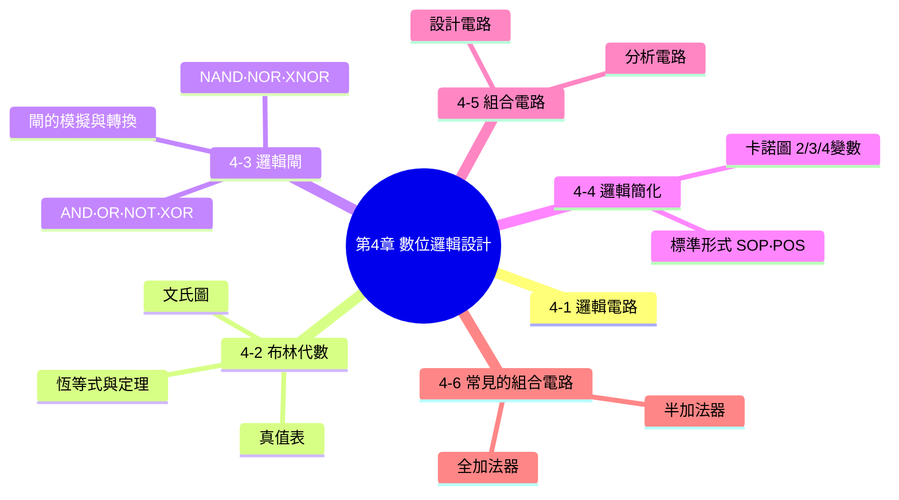

**這一章要帶學生建立的核心能力：**

1. 電腦裡所有的運算，最終都是靠一顆顆邏輯閘組成的電路完成的——這一章要讓學生親眼看到「1+1 這種簡單的加法，究竟是怎麼被一堆 AND、OR、NOT 閘實現出來的」。
2. 布林代數是描述、簡化邏輯電路的「數學語言」；卡諾圖則是布林代數的「圖形捷徑」——兩者要交互運用，前者用來嚴謹證明，後者用來快速化簡。
3. 邏輯簡化不是炫技，而是有實際工程意義的：**電路裡的邏輯閘愈少，晶片就愈小、愈省電、愈便宜、速度也愈快**，這正是本章最後兩節「組合電路設計」練習的終極目的。

---

## 4-1　邏輯電路

**邏輯電路（logic circuit）** 是由可以完成某些功能的**邏輯閘（logic gate）**所組成，至於邏輯電路的分析與設計，則是透過**布林代數（Boolean algebra）**這套數學工具來進行。

**範例**：下表是兩個二元變數 X、Y 進行相加的結果，SUM 代表和，CARRY 代表進位（這正是本章最後 4-6 節「半加法器」的原型，先在這裡讓學生對「輸入 → 邏輯運算 → 輸出」建立第一印象）：

| X | Y | SUM | CARRY |
|---|---|---|---|
| 0 | 0 | 0 | 0 |
| 0 | 1 | 1 | 0 |
| 1 | 0 | 1 | 0 |
| 1 | 1 | 0 | 1 |

觀察這張表可以發現：**SUM 只有在 X、Y 剛好一個是 1、一個是 0 時才會是 1**（這正是後面會學到的 XOR 運算的特性）；**CARRY 只有在 X、Y 都是 1 時才會是 1**（這正是 AND 運算的特性）。用布林代數表示：

$$SUM = X'Y + XY' \qquad CARRY = XY$$

<table>
<tr>
<td width="45%">

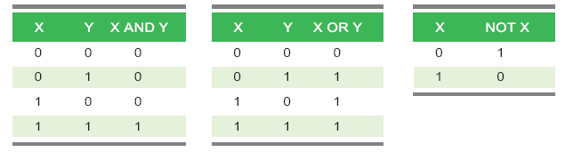

</td>
<td width="45%">

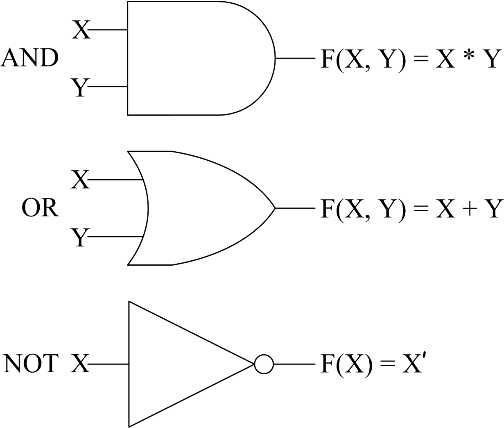

</td>
</tr>
</table>

只要用 AND、OR、NOT 三種基本邏輯閘，就能把 SUM 與 CARRY 的邏輯關係實際「畫」成電路：

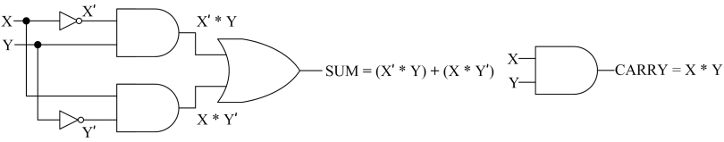

$$SUM = ((\text{NOT }X)\text{ AND }Y)\text{ OR }(X\text{ AND }(\text{NOT }Y)) = X'Y + XY'$$
$$CARRY = X\text{ AND }Y = XY$$

---

## 4-2　布林代數

**布林代數（Boolean algebra）** 是喬治·布林（George Boole）於 19 世紀提出的一套代數系統，專門用來處理「真／假」「1／0」這種二元邏輯的運算，是分析與設計數位邏輯電路最重要的數學工具。布林代數包含以下基本元素：

- **值為 0 或 1 的二元變數**（binary variable）：例如 X、Y、Z。
- **值為 0 或 1 的常數**（constant）。
- **AND、OR、NOT 運算子**（operator）：分別用 `·`（或省略不寫）、`+`、`'`（撇號）表示。
- **( )、[ ]、{ }** 等括號：決定運算的優先順序。
- **=** 等號。

**範例**：假設布林函數 $F(X,Y,Z)=XYZ'+(X'Z')(Y+Z)$，且 $X=1、Y=1、Z=0$，則運算過程如下：

$$F(X,Y,Z)=XYZ'+(X'Z')(Y+Z)$$
$$=1\cdot1\cdot0'+(1'\cdot0')\cdot(1+0)$$
$$=1\cdot1\cdot1+(0\cdot1)\cdot(1+0)$$
$$=1+0\cdot1=1+0=\mathbf{1}$$

> **課堂提醒**：布林代數的運算優先順序與一般代數相同——**先算括號，再算 NOT，接著算 AND，最後算 OR**（可以把 AND 想成乘法、OR 想成加法來記憶優先順序，「先乘除後加減」的直覺同樣適用）。

### 4-2-1　真值表（Truth Table）

真值表是把布林函數的「所有輸入組合」與對應的「輸出結果」，用表格的方式**窮舉列出**——n 個變數的真值表會有 $2^n$ 列（因為每個變數都有 0、1 兩種可能）。

**範例**：$F(X,Y,Z)=XYZ'+(X'Z')(Y+Z)$ 的真值表：

| X | Y | Z | F(X,Y,Z) |
|---|---|---|---|
| 0 | 0 | 0 | 0 |
| 0 | 0 | 1 | 0 |
| 0 | 1 | 0 | 1 |
| 0 | 1 | 1 | 0 |
| 1 | 0 | 0 | 0 |
| 1 | 0 | 1 | 0 |
| 1 | 1 | 0 | 1 |
| 1 | 1 | 1 | 1 |

> **課堂技巧**：列真值表時，輸入組合建議**依二進位順序**（000, 001, 010, 011…）由上往下排列，這樣才不會漏掉任何一種組合，這個排列習慣也會直接影響到後面卡諾圖、最小項編號的對應關係，值得從一開始就養成習慣。

### 4-2-2　文氏圖（Venn Diagram）

文氏圖用圓圈的重疊區域，直觀地表示 AND（交集）、OR（聯集）、NOT（補集）等邏輯運算的關係，對初學者建立「邏輯運算＝集合運算」的直覺特別有幫助：

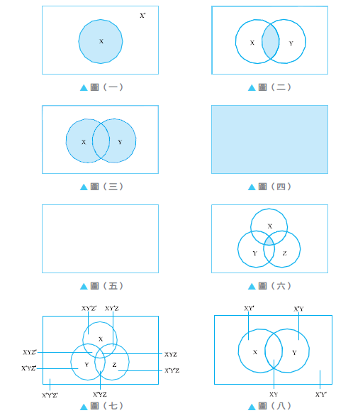

**範例**：以文氏圖表示 $F(X,Y,Z)=X'Z'+XY$

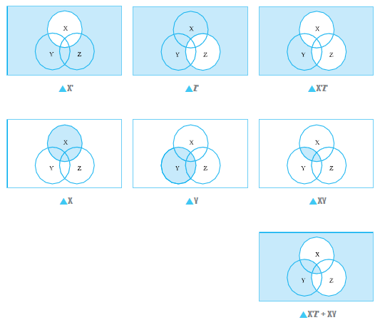

> **課堂應用**：文氏圖很適合用來「用畫圖的方式證明」布林代數的恆等式，例如證明 $X'Z'+XY'+XY=(X+Y+Z)(X'+Y'+Z')$，只要分別畫出等號兩邊的文氏圖，比對塗色區域是否完全一致即可，比純代數推導更直覺，特別適合視覺型的學生。

### 4-2-3　布林代數恆等式（公設）

以下是布林代數的基本公設（postulate），是後面所有化簡運算的根本依據：

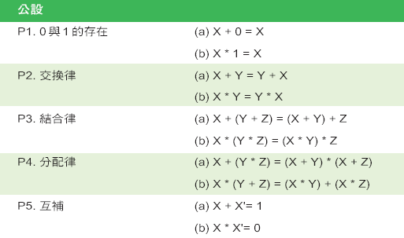

| 編號 | 名稱 | 公設 (a) | 公設 (b) |
|---|---|---|---|
| P1 | 0 與 1 的存在 | X + 0 = X | X · 1 = X |
| P2 | 交換律 | X + Y = Y + X | X · Y = Y · X |
| P3 | 結合律 | X + (Y+Z) = (X+Y) + Z | X · (Y·Z) = (X·Y) · Z |
| P4 | 分配律 | X + (Y·Z) = (X+Y)·(X+Z) | X · (Y+Z) = (X·Y)+(X·Z) |
| P5 | 互補 | X + X' = 1 | X · X' = 0 |

> **課堂提醒**：P4(a) 「$X+(Y\cdot Z)=(X+Y)\cdot(X+Z)$」與一般代數的分配律直覺不同（一般代數沒有「加法對加法分配」這種形式），是布林代數特有、也是最容易搞混的一條公設，值得特別花時間帶學生驗算真值表確認其成立。

### 常用定理（由公設推導而來）

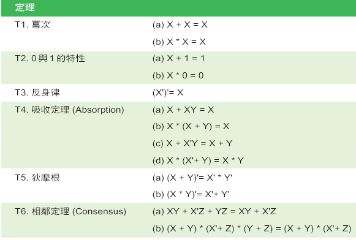

| 編號 | 名稱 | 定理 (a) | 定理 (b) |
|---|---|---|---|
| T1 | 冪等 | X + X = X | X · X = X |
| T2 | 0 與 1 的特性 | X + 1 = 1 | X · 0 = 0 |
| T3 | 反身律 | (X')' = X | |
| T4 | 吸收定理（Absorption） | X + XY = X | X·(X+Y) = X |
| | | X + X'Y = X + Y | X·(X'+Y) = XY |
| T5 | 狄摩根律（De Morgan's Law） | (X+Y)' = X'·Y' | (X·Y)' = X'+Y' |
| T6 | 相鄰定理（Consensus） | XY + X'Z + YZ = XY + X'Z | (X+Y)·(X'+Z)·(Y+Z) = (X+Y)·(X'+Z) |

> **課堂重點：狄摩根律（De Morgan's Law）**——這是整章布林代數中最重要、也是後面「NAND-NAND」「NOR-NOR」電路設計最關鍵的依據，白話解釋是：**「一長串 OR 的補數＝各自取補數後改成 AND；一長串 AND 的補數＝各自取補數後改成 OR」**，也就是「先變運算子（+ 變 ·、· 變 +），再對每一項各自取補數」。務必讓學生多練習幾次，直到能不假思索地正確套用。

---

## 4-3　邏輯閘

邏輯閘（logic gate）是實現布林運算的實體電子元件，每一種基本布林運算子都有對應的邏輯閘符號。

### 4-3-1　AND 閘

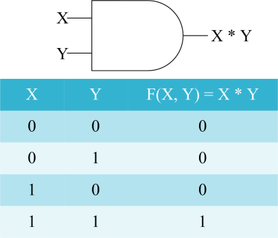

$$F(X,Y)=X\cdot Y$$

只有當「所有輸入都是 1」時，輸出才是 1，其餘情況輸出皆為 0——就像現實生活中「兩把鑰匙都要插入、同時轉動，保險箱才會打開」的邏輯。

### 4-3-2　OR 閘

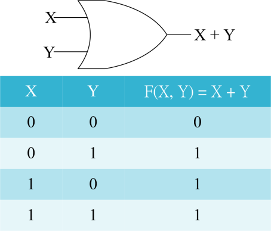

$$F(X,Y)=X+Y$$

只要「任一輸入是 1」，輸出就是 1，只有當所有輸入都是 0 時，輸出才是 0——就像「客廳裡任何一個開關被按下，燈就會亮」的雙切開關邏輯。

### 4-3-3　NOT 閘

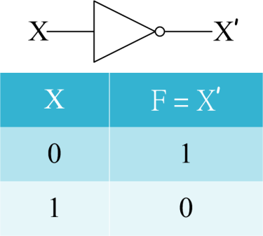

$$F(X)=X'$$

NOT 閘（也稱反相器 inverter）只有一個輸入，功能是**把輸入訊號反相**：0 變 1、1 變 0。

### 4-3-4　XOR 閘

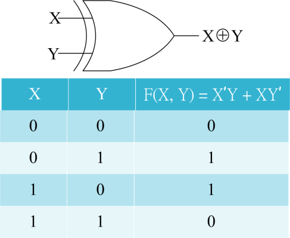

$$F(X,Y)=X'Y+XY'=X\oplus Y$$

XOR（exclusive OR，互斥或）閘只有在「兩個輸入不同」時輸出才是 1，兩個輸入相同時輸出為 0——這正是本章一開始「半加法器 SUM」背後的邏輯運算，也是判斷「兩個位元是否不同」的標準做法。

### 4-3-5　NAND 閘

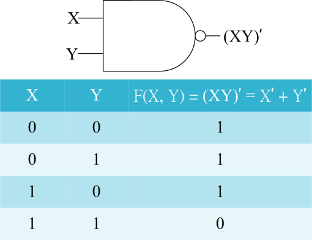

$$F(X,Y)=(XY)'=X'+Y'$$

NAND＝**N**OT+**AND**，就是 AND 閘的輸出再經過一次反相，真值表與 AND 閘完全相反。

**NAND 閘的重要性**：NAND 閘是一種**萬用閘（universal gate）**——意思是，只要有足夠數量的 NAND 閘，就可以組合出 AND、OR、NOT 任何一種基本邏輯閘，甚至組出任何邏輯電路，因此在實際的晶片製造上，工程師經常只用單一種 NAND 閘元件就能實現整個電路，大幅簡化生產流程。

<table>
<tr>
<td width="33%">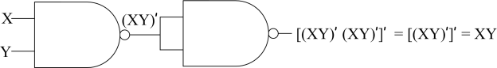<br><i>用NAND閘模擬AND閘</i></td>
<td width="33%">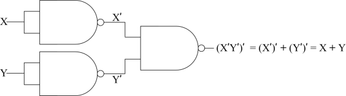<br><i>用NAND閘模擬OR閘</i></td>
<td width="33%">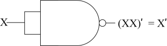<br><i>用NAND閘模擬NOT閘</i></td>
</tr>
</table>

$$\text{模擬AND：}[(XY)'(XY)']'=[(XY)']'=XY$$
$$\text{模擬OR：}(X'Y')'=(X''+Y'')=X+Y\quad\text{（NAND閘先各自反相輸入，再NAND一次）}$$
$$\text{模擬NOT：}(XX)'=X'$$

NAND 閘亦可以表示成如下的邏輯符號（在輸入端加上小圓圈，代表輸入先各自反相，等效於 $X'+Y'=(XY)'$）：

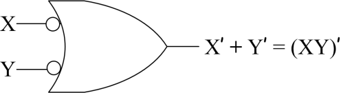

### 4-3-6　NOR 閘

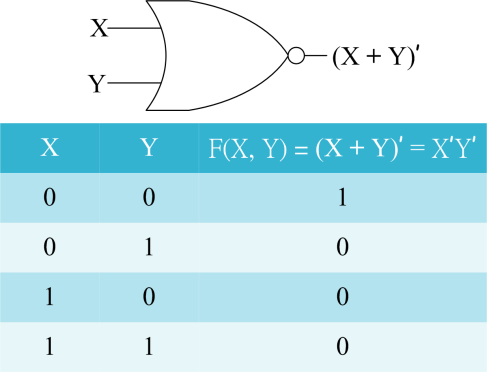

$$F(X,Y)=(X+Y)'=X'Y'$$

NOR＝**N**OT+**OR**，就是 OR 閘的輸出再經過一次反相。和 NAND 閘一樣，**NOR 閘也是萬用閘**，同樣能單獨組出任何邏輯電路：

<table>
<tr>
<td width="33%">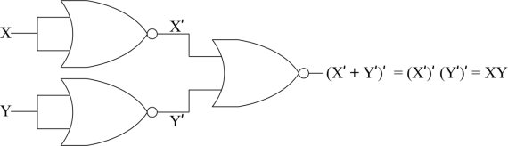<br><i>用NOR閘模擬AND閘</i></td>
<td width="33%">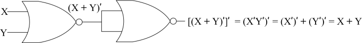<br><i>用NOR閘模擬OR閘</i></td>
<td width="33%">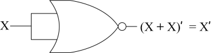<br><i>用NOR閘模擬NOT閘</i></td>
</tr>
</table>

NOR 閘亦可以表示成如下的邏輯符號：

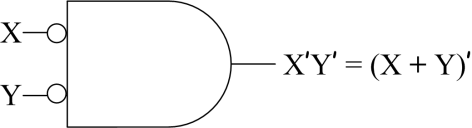

### 4-3-7　XNOR 閘

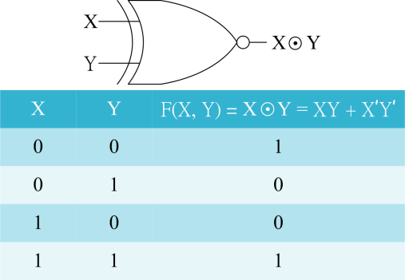

$$F(X,Y)=X\odot Y=XY+X'Y'$$

XNOR（exclusive NOR）是 XOR 閘的反相，只有在「兩個輸入相同」時輸出才是 1——正好可以用來判斷兩個位元是否相等（相等輸出1、不等輸出0），是數位電路中「比較器（comparator）」的核心元件。

### 4-3-8　多重輸入邏輯閘

AND、OR、NAND、NOR、XOR 這幾種邏輯閘都可以擴充成 3 個以上輸入：

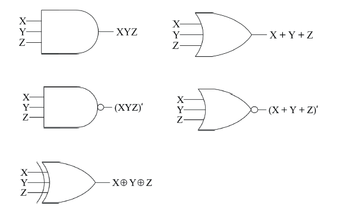

例如 3 輸入 AND 閘 $F=XYZ$（三者皆為1才輸出1）、3 輸入 OR 閘 $F=X+Y+Z$（任一為1即輸出1）、3輸入NAND閘 $F=(XYZ)'$、3輸入NOR閘 $F=(X+Y+Z)'$、3輸入XOR閘 $F=X\oplus Y\oplus Z$（輸入中1的個數為奇數時輸出1，這正是第 3 章「同位元檢查」電路實作的基礎）。

### 邏輯閘總整理

| 閘名稱 | 符號表示 | 布林運算式 | 記憶口訣 |
|---|---|---|---|
| AND | ∧、·（常省略） | $F=XY$ | 全部為1才是1 |
| OR | ∨、+ | $F=X+Y$ | 任一為1就是1 |
| NOT | '、‾ | $F=X'$ | 反相 |
| XOR | ⊕ | $F=X'Y+XY'$ | 不同為1、相同為0 |
| NAND | ↑ | $F=(XY)'$ | AND反相；萬用閘 |
| NOR | ↓ | $F=(X+Y)'$ | OR反相；萬用閘 |
| XNOR | ⊙ | $F=XY+X'Y'$ | 相同為1、不同為0；比較器 |

> **課堂討論**：為什麼 AND 閘、OR 閘「不是」萬用閘，一定要加上 NOT 閘才能組出任意電路？（提示：AND 與 OR 都只會讓 0 的數量「不減少」或讓 1 的數量「不減少」，沒有辦法單獨產生「反相」這個動作，因此缺少 NOT 的 AND/OR 組合，永遠無法組出 NOT 閘本身，也就不具備「萬用」的資格。）

## 4-4　邏輯簡化

同一個布林函數，往往可以用很多種不同的方式寫出來，但實作成電路時，**運算式愈簡單，需要的邏輯閘就愈少**。邏輯簡化正是要找出「最精簡、等效的布林運算式」，常用的方法有兩種：**布林代數化簡法**（4-2-3 節學過的公設與定理）與**卡諾圖化簡法**（本節重點）。

### 4-4-1　標準形式

在使用卡諾圖之前，必須先認識幾個重要名詞：

- **積項（product terms）**：由變數（或其補數）用 AND 連接而成，例如 $XYZ'$。
- **和項（sum terms）**：由變數（或其補數）用 OR 連接而成，例如 $X+Y+Z'$。
- **最小項（minterm）**：一個積項中，**每一個變數都恰好出現一次**（原形或補數形式擇一），例如 3 變數的最小項 $XYZ'$。
- **最大項（maxterm）**：一個和項中，**每一個變數都恰好出現一次**，例如 3 變數的最大項 $X+Y+Z'$。
- **積項之和（SOP，Sum of Product terms）**：由多個積項（最小項）以 OR 連接而成的布林式，例如 $XYZ+X'YZ'$。
- **和項之積（POS，Product of Sum terms）**：由多個和項（最大項）以 AND 連接而成的布林式，例如 $(X+Y+Z)(X'+Y+Z')$。
- **最小項之和（sum of minterms）**：把真值表中「所有輸出為 1」的列，各自轉換成最小項後加總，記為 $\sum m(\ldots)$。
- **最大項之積**（product of maxterms）：把真值表中「所有輸出為 0」的列，各自轉換成最大項後相乘，記為 $\prod M(\ldots)$。

### 最小項與最大項對照表（2、3 個二元變數）

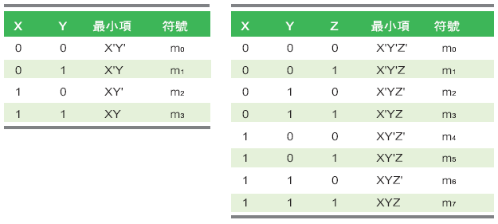

**2 變數最小項編號**：$m_0=X'Y'$、$m_1=X'Y$、$m_2=XY'$、$m_3=XY$
**3 變數最小項編號**：$m_0=X'Y'Z'$、$m_1=X'Y'Z$、$m_2=X'YZ'$、$m_3=X'YZ$、$m_4=XY'Z'$、$m_5=XY'Z$、$m_6=XYZ'$、$m_7=XYZ$

> **編號規則**：最小項的編號，就是把「原形變數當作1、補數變數當作0」排列出來的二進位數字——例如 3 變數的 $m_5=XY'Z$，對應 $X=1,Y=0,Z=1$，二進位 101＝十進位5，所以叫做 $m_5$。**這個編號規則和卡諾圖座標的對應，是接下來化簡的核心，請務必讓學生practice 到熟練。**

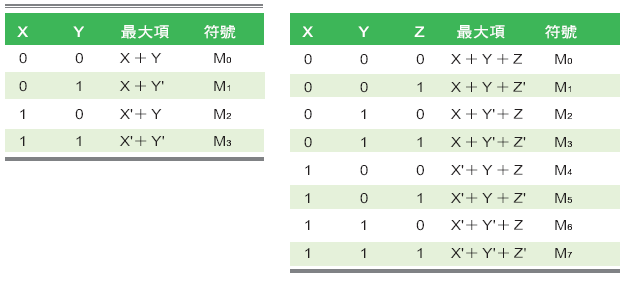

**最大項的編號規則恰好相反**：把「原形變數當作0、補數變數當作1」排列——例如 3 變數的 $M_5=X'YZ'$，對應 $X=1,Y=0,Z=1$（因為要讓這個和項為0，代入 X=1,Y=0,Z=1 時 X'YZ' = 0+0+0 = 0，確實成立），同樣編號為5，記為 $M_5$。

### 從真值表求 SOP 與 POS

**範例**：將布林函數 $F(X,Y,Z)=X'Y+XZ$ 表示成最小項之和：

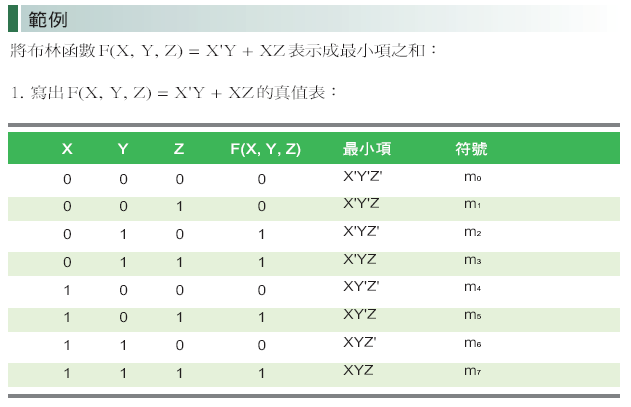

1. 寫出 $F(X,Y,Z)=X'Y+XZ$ 的真值表（如上圖），找出輸出為 1 的所有列：(0,1,1)、(0,1,0)…

除了真值表法之外，也可以直接用布林代數展開成最小項之和：

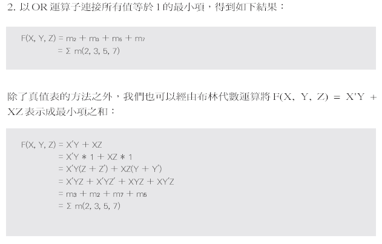

$$F(X,Y,Z)=X'Y+XZ=X'Y(Z+Z')+XZ(Y+Y')$$
$$=X'YZ+X'YZ'+XYZ+XY'Z=m_3+m_2+m_7+m_5=\sum m(2,3,5,7)$$

**範例**：將同一個布林函數表示成最大項之積：

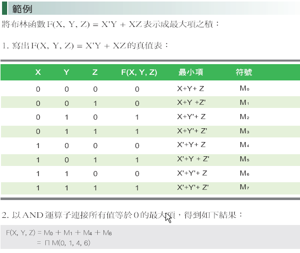

找出真值表中輸出為 0 的所有列，各自轉換成最大項後相乘，可得 $F(X,Y,Z)=\prod M(0,1,4,6)$。

> **課堂重點**：SOP 與 POS 是同一個函數的兩種等價表示法，**輸出為1的列給SOP、輸出為0的列給POS**，兩者的最小項編號與最大項編號恰好會是「互補的兩個集合」（把 0~7 全部編號扣掉 SOP 用到的，剩下的就是 POS 用到的）。

### 4-4-2　卡諾圖（Karnaugh Map, K-map）

卡諾圖是一種特殊排列的表格，**把真值表的資訊轉換成圖形，並利用「相鄰方格只能相差一個變數」的巧妙排列方式（葛雷碼順序！），讓化簡工作變成用眼睛「圈格子」就能完成**，比純代數運算更快、更不容易出錯。

**2 變數卡諾圖：**

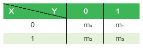

**範例**：將 $F(X,Y)=XY+XY'$ 簡化為積項之和

1. $F(X,Y)=m_3+m_2=\sum m(2,3)$
2. 先在卡諾圖上，把 $m_2、m_3$ 對應的格子填入 1：

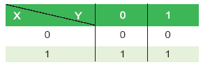

3. 觀察發現這兩個相鄰的 1 可以圈起來合併：

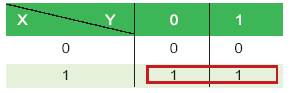

4. **圈選結果的化簡原則**：被圈起來的格子中，找出所有格子「共同不變」的變數，其餘「有變化」的變數則直接消去。這裡 $XY+XY'=X(Y+Y')=X$，因此 $F(X,Y,Z)=XY'+XY=X$。

**3 變數卡諾圖：**

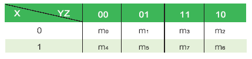

> **注意行列標籤的排列順序**：橫軸 YZ 的排列是 **00, 01, 11, 10**（不是 00,01,10,11！），這正是刻意採用葛雷碼順序，確保「相鄰的兩欄只相差一個變數」，這樣才能保證「圖形上相鄰的格子＝布林代數上可以合併化簡的最小項」。這是學生最容易搞錯、也是考試常考的重點。

**範例**：將 $F(X,Y,Z)=X'YZ+X'YZ'+XYZ+XY'Z$ 簡化為積項之和

1. $F(X,Y,Z)=m_2+m_3+m_5+m_7=\sum m(2,3,5,7)$
2. 依序把 $m_2,m_3,m_5,m_7$ 填入卡諾圖對應格子。
3. 觀察並圈選相鄰、且圈選範圍剛好是 $2^n$ 個格子（1、2、4、8…個）的區域：


4. 化簡結果：$X'YZ+X'YZ'+XY'Z+XYZ=(X'Y)(Z+Z')+XZ(Y'+Y)=X'Y+XZ$

**4 變數卡諾圖：**

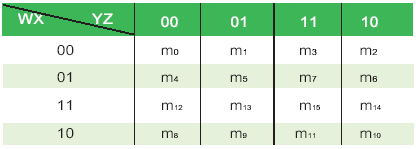

4 變數卡諾圖是 3 變數的擴充，橫軸、縱軸都改成兩個變數的葛雷碼排列（00,01,11,10），共有 16 個格子，圈選原則完全相同，只是要多留意**卡諾圖的「四個角落」在拓樸上其實也是相鄰的**（可以想像整張圖左右相接、上下相接，形成一個環面 torus），這是初學者最容易漏掉的合併機會。

### 用卡諾圖求 POS（含 don't care 條件）

當真值表中出現「不影響結果的輸入組合」（例如該輸入組合實際上不會發生）時，可以在卡諾圖上填入 **d（don't care，可以視為0也可以視為1）**，讓化簡時有更大的彈性、爭取到更大的圈選範圍：

**範例**：以卡諾圖將 $F(W,X,Y,Z)=\sum m(0,1,10,14)+d(4,7,11,15)$ 簡化為和項之積（POS）：


> **don't care 的使用原則**：圈選時可以**選擇性地**把 d 當作 1（幫助擴大圈選範圍、化簡結果更精簡）或當作 0（忽略不圈），**原則是「怎麼圈能讓結果最簡單，就怎麼用」**，沒有固定要求每個 d 都一定要圈起來。

### 用卡諾圖求 SOP（含 don't care 條件）

**範例**：將 $F(W,X,Y,Z)=\sum m(0,1,5,10,14)+d(4,7,11,15)$ 簡化為積項之和（SOP）：

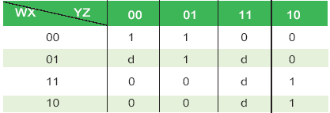
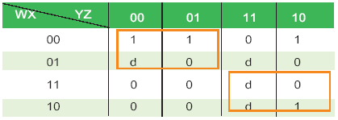

> **課堂提醒**：卡諾圖化簡「圈越大越好、圈越少越好」——圈的格子數愈多（1個變數消去1個），最終的乘積項就愈簡短；圈的數量（也就是最終SOP的項數）愈少，整體算式就愈精簡。同一組 1，不同的圈法可能得到形式不同但邏輯等效的化簡結果，只要每個圈的大小都是 $2^n$、且完整涵蓋所有的 1，都是合法解。

---

## 4-5　組合電路

**組合電路（combinational circuit）** 是指輸出結果**只取決於當下輸入訊號**（不像後續章節會學到的「循序電路」還會受過去狀態影響）的邏輯電路：

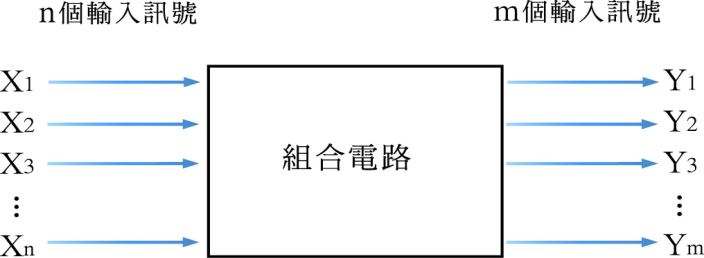

組合電路的應用有兩個方向：**分析**（已知電路圖，反推布林函數／真值表）與**設計**（已知布林函數／真值表，畫出電路圖），兩者訓練的是相反方向的能力，缺一不可。

### 4-5-1　分析組合電路

**範例**：根據下列組合電路推算出布林函數：

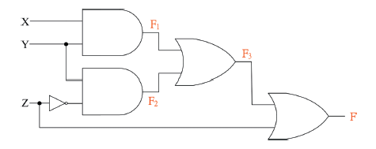

1. 先把每個邏輯閘的輸出，依序標示成變數 $F_1、F_2、F_3$：
$$F_1=XY \qquad F_2=YZ$$
$$F_3=F_1+F_2=XY+YZ$$
$$F=F_3+Z'=XY+YZ+Z'=XY+(Y+Z')Z=XY+YZ+Z'$$

> **課堂技巧（分析電路的標準流程）**：從最左邊的輸入開始，**依照訊號流動的方向，逐一替每個邏輯閘的輸出命名一個中繼變數**（如上例的 $F_1,F_2,F_3$），再一層一層往右代入，最終就能推導出最右邊輸出的完整布林函數，不需要一次跳躍性地判讀整個電路。

2. 根據推導出的布林函數，也可以進一步反推真值表——把 X、Y、Z 所有 8 種組合逐一代入 $F_1、F_2、F_3、F$ 各自的運算式，即可完整列出真值表，這個步驟能同時驗證電路推導是否正確。

### 4-5-2　設計組合電路

設計組合電路，就是分析電路的反向操作：已知布林函數（或真值表），要畫出實際的邏輯閘電路圖。依照使用的閘種類不同，常見有四種電路設計形式：

**① AND-OR 電路**（直接對應 SOP 形式）

**範例**：將 $F(X,Y,Z)=X'Y+XZ$ 繪製成 AND-OR 電路：


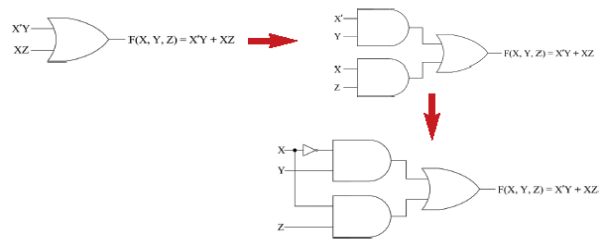

先用卡諾圖（或代數）確認 $F(X,Y,Z)=X'Y+XZ$ 已經是最簡形式，接著直接把每個積項用一個 AND 閘實現（$X'Y$ 用一個 AND 閘、$XZ$ 用另一個 AND 閘，$X$ 要先經過 NOT 閘），最後把所有 AND 閘的輸出，一起送進一個 OR 閘，即完成電路。

**② OR-AND 電路**（直接對應 POS 形式）

**範例**：將 $F(X,Y,Z)=X'YZ+X'YZ'+XYZ+XY'Z$ 繪製成 OR-AND 電路：


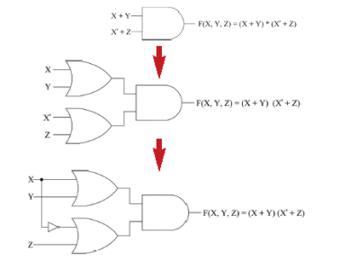

先求出 $F'(X,Y,Z)$ 的最簡 SOP，再對 $F'$ 整體取補數（利用狄摩根律，SOP 取補數會變成 POS），得到 $F$ 的最簡 POS 形式，接著把每個和項用一個 OR 閘實現，所有 OR 閘的輸出再一起送進一個 AND 閘。

**③ NAND-NAND 電路**

**範例**：將 $F(X,Y,Z)=X'YZ+X'YZ'+XYZ+XY'Z$ 繪製成 NAND-NAND 電路：

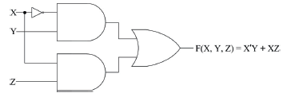
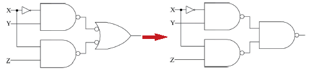

**設計原理**：先畫出正常的 AND-OR 電路，接著利用狄摩根律 $(AB)'=A'+B'$ 的概念——**只要把 AND-OR 電路中的每一個 AND 閘、以及最後的 OR 閘，全部換成 NAND 閘，得到的電路在邏輯上會完全等效**（這也是為什麼 4-3-5 節要強調 NAND 閘是「萬用閘」的實務理由：整個電路可以只用單一種 NAND 元件製造，大幅簡化晶片生產流程）。

**④ NOR-NOR 電路**

**範例**：將同一個布林函數繪製成 NOR-NOR 電路：

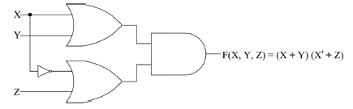
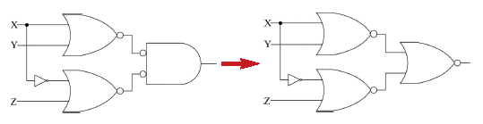

**設計原理**：與 NAND-NAND 電路概念相同，但改為從 **OR-AND 電路**（POS形式）出發，把每一個 OR 閘、以及最後的 AND 閘，全部換成 NOR 閘，即可得到邏輯等效的 NOR-NOR 電路。

> **課堂總結口訣**：**SOP → AND-OR 電路 → 全部換成 NAND 閘 → NAND-NAND 電路**；**POS → OR-AND 電路 → 全部換成 NOR 閘 → NOR-NOR 電路**。「AND 家族配 NAND、OR 家族配 NOR」是最好記的口訣。

---

## 4-6　常見的組合電路

### 4-6-1　半加法器（Half Adder）

半加法器就是本章一開始 4-1 節示範的電路，負責計算「兩個 1 位元二進位數字」相加的結果：

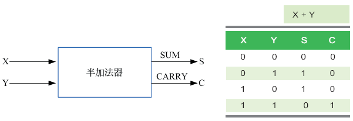

$$SUM=X'Y+XY'=X\oplus Y \qquad CARRY=XY$$

半加法器可以用兩種等效的方式實現電路：

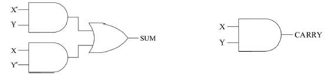

- **方法一**：直接依 SOP 形式 $SUM=X'Y+XY'$ 用 AND-OR 電路實現，CARRY 則直接用一個 AND 閘。
- **方法二**：利用 $X'Y+XY'=X\oplus Y$，SUM 直接用一個 XOR 閘就能實現，電路更精簡。

> **為什麼叫「半」加法器？** 因為它只能處理「本身兩個位元」的加法，**沒有辦法接收「來自前一位元的進位（carry-in）」**——但十進位加法中我們都有「逢十進一」的經驗，二進位加法同樣需要處理「前一位相加時進位過來的1」，半加法器做不到這件事，因此才需要下一節的「全加法器」。

### 4-6-2　全加法器（Full Adder）

全加法器比半加法器多了一個輸入：**進位輸入（$C_{in}$，carry-in）**，可以把前一位元計算時進位過來的值一併納入計算，因此才能串接多個全加法器，完成任意位元數的二進位加法：

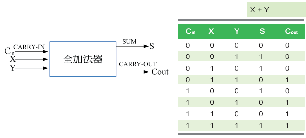

真值表中可以看到，全加法器有三個輸入（$C_{in}、X、Y$）、兩個輸出（$S、C_{out}$）。從真值表可以直接寫出 SOP 形式：

$$SUM=C_{in}'X'Y+C_{in}'XY'+C_{in}X'Y'+C_{in}XY$$
$$CARRY\text{-}OUT=C_{in}'XY+C_{in}X'Y+C_{in}XY'+C_{in}XY$$

對應的 AND-OR 電路（尚未化簡）：

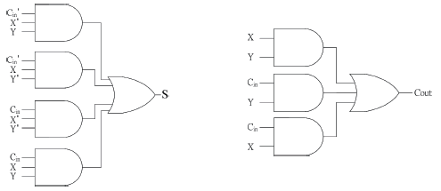

經過化簡（利用 XOR 的性質），可以得到更精簡的等效算式：

$$SUM=C_{in}'X'Y+C_{in}'XY'+C_{in}X'Y'+C_{in}XY=(C_{in}\oplus X)Y'+(C_{in}\oplus X)'Y=C_{in}\oplus X\oplus Y$$
$$CARRY\text{-}OUT=XY+C_{in}Y+C_{in}X=(C_{in}\oplus X)Y+C_{in}X$$

化簡後的電路：

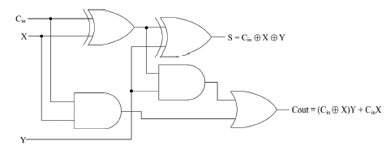

**巧妙的實作方式**：由於 $SUM=C_{in}\oplus X\oplus Y$，全加法器其實可以**用兩個半加法器＋一個 OR 閘直接組出來**（第一個半加法器算 $X\oplus Y$，第二個半加法器再把結果與 $C_{in}$ 做 XOR，兩個半加法器的 CARRY 輸出再用 OR 閘合併），這是數位邏輯設計中「用小電路模組堆疊出大電路」的經典範例，也呼應了本章開頭「先學會半加法器，再進化到全加法器」的教學邏輯。

> **課堂延伸**：只要把 n 個全加法器串接起來（前一個的 $C_{out}$ 接到下一個的 $C_{in}$），就能組成一個「n 位元漣波進位加法器（ripple carry adder）」，這正是電腦 CPU 裡執行整數加法運算最基礎的電路模組，值得跟學生強調：**你在這一節學到的簡單邏輯閘組合，就是你手機、電腦裡 CPU 執行「1+1」時，實際在跑的電路。**

---

## 本章總結

| 小節 | 核心觀念一句話 |
|---|---|
| 4-1 邏輯電路 | 邏輯電路由邏輯閘組成，分析設計都要透過布林代數這套數學語言 |
| 4-2 布林代數 | 真值表、文氏圖、代數恆等式是描述與化簡邏輯的三種互補工具 |
| 4-3 邏輯閘 | AND/OR/NOT 是三個基本閘，NAND/NOR 是能組出一切電路的萬用閘 |
| 4-4 邏輯簡化 | SOP對應1、POS對應0，卡諾圖用「圈格子」取代繁瑣的代數化簡 |
| 4-5 組合電路 | 分析是電路推函數，設計是函數畫電路，兩者是互逆的能力 |
| 4-6 常見的組合電路 | 半加法器沒有進位輸入，全加法器多了Cin才能串接成多位元加法器 |

### 關鍵詞彙表（Glossary）

`邏輯電路` `邏輯閘` `布林代數` `真值表` `文氏圖` `恆等式` `狄摩根律` `AND閘` `OR閘` `NOT閘` `XOR閘` `NAND閘` `NOR閘` `XNOR閘` `萬用閘` `最小項` `最大項` `積項之和SOP` `和項之積POS` `卡諾圖` `don't care` `組合電路` `半加法器` `全加法器` `進位輸入Cin` `漣波進位加法器`
## 第 4 章　學習評量

> 以下為課本第 4 章隨附之官方學習評量，題目逐字謄錄，共 30 題。官方解答對於前半段題目（1~18 題）已提供相當完整的計算過程，這裡照原本的解題邏輯完整呈現；對於後半段較精簡的題目（19~30 題），則補上完整的判斷依據與計算過程，方便課堂上直接點開講解。

**1. 寫出布林函數 $F(X,Y,Z)=XY'Z+X'Y'Z'+YZ$ 的真值表。**

<details>
<summary>▶ 參考答案</summary>

| X | Y | Z | F(X,Y,Z) |
|---|---|---|---|
| 0 | 0 | 0 | 1 |
| 0 | 0 | 1 | 0 |
| 0 | 1 | 0 | 0 |
| 0 | 1 | 1 | 1 |
| 1 | 0 | 0 | 0 |
| 1 | 0 | 1 | 1 |
| 1 | 1 | 0 | 0 |
| 1 | 1 | 1 | 1 |

（逐行代入驗算，例如 X=0,Y=0,Z=0 時：$XY'Z=0$、$X'Y'Z'=1\cdot1\cdot1=1$、$YZ=0$，故 $F=0+1+0=1$，其餘各列依此類推。）

</details>

---

**2. 寫出布林函數 $F(W,X,Y,Z)=WXYZ+Y'(X'Z'+WZ)$ 的真值表。**

<details>
<summary>▶ 參考答案</summary>

| W | X | Y | Z | F |
|---|---|---|---|---|
| 0 | 0 | 0 | 0 | 1 |
| 0 | 0 | 0 | 1 | 0 |
| 0 | 0 | 1 | 0 | 0 |
| 0 | 0 | 1 | 1 | 0 |
| 0 | 1 | 0 | 0 | 0 |
| 0 | 1 | 0 | 1 | 0 |
| 0 | 1 | 1 | 0 | 0 |
| 0 | 1 | 1 | 1 | 0 |
| 1 | 0 | 0 | 0 | 1 |
| 1 | 0 | 0 | 1 | 1 |
| 1 | 0 | 1 | 0 | 0 |
| 1 | 0 | 1 | 1 | 0 |
| 1 | 1 | 0 | 0 | 0 |
| 1 | 1 | 0 | 1 | 0 |
| 1 | 1 | 1 | 0 | 0 |
| 1 | 1 | 1 | 1 | 1 |

（提示：先算 $Y'(X'Z'+WZ)$ 這一項——只有當 Y=0 時這一項才可能不為0；再加上 $WXYZ$ 這一項——只有當 W=X=Y=Z=1 時這一項才為1，兩項用 OR 合併即為 F。）

</details>

---

**3. 以文氏圖表示布林函數 $F(X,Y)=XY+X'Y'$。**

<details>
<summary>▶ 參考答案</summary>

畫兩個互相重疊的圓圈，分別代表 X、Y：

- $XY$ 對應**兩圓的交集**（X、Y 都成立的區域）
- $X'Y'$ 對應**兩圓以外的區域**（X、Y 都不成立的區域，也就是整個文氏圖方框扣掉兩個圓之後剩下的部分）

把這兩塊區域都塗色，就是 $F(X,Y)=XY+X'Y'$ 所代表的範圍——**這正好是 XNOR（X⊙Y）的定義**：X 與 Y「相同」（同為真或同為假）的所有情況。

</details>

---

**4. 以文氏圖表示布林函數 $F(X,Y,Z)=XY'Z+YZ'+XYZ$。**

<details>
<summary>▶ 參考答案</summary>

畫三個兩兩重疊的圓圈，分別代表 X、Y、Z，共會形成 8 個區域（對應 3 變數真值表的 8 種組合）：

- $XY'Z$：屬於 X 圓與 Z 圓，但不屬於 Y 圓的區域
- $YZ'$：屬於 Y 圓，但不屬於 Z 圓的區域（不論是否屬於 X 圓，因此這一項涵蓋兩個小區域：X 圓內與 X 圓外，只要屬於Y且不屬於Z即可）
- $XYZ$：三個圓的正中央交集（X、Y、Z 都成立的區域）

把上述區域全部塗色，即為 $F(X,Y,Z)$ 所代表的範圍。

</details>

---

**5. 以文氏圖證明 $X'Y+Y'Z+Z'X=(X+Y+Z)(X'+Y'+Z')$。**

<details>
<summary>▶ 參考答案（改以真值表驗證，效果等同文氏圖比對塗色區域）</summary>

分別計算等號兩邊在 8 種輸入組合下的值：

| X | Y | Z | 左式 X'Y+Y'Z+Z'X | 右式 (X+Y+Z)(X'+Y'+Z') |
|---|---|---|---|---|
| 0 | 0 | 0 | 0 | 0 |
| 0 | 0 | 1 | 1 | 1 |
| 0 | 1 | 0 | 1 | 1 |
| 0 | 1 | 1 | 1 | 1 |
| 1 | 0 | 0 | 1 | 1 |
| 1 | 0 | 1 | 1 | 1 |
| 1 | 1 | 0 | 1 | 1 |
| 1 | 1 | 1 | 0 | 0 |

兩邊在所有 8 種組合下的值完全相同，因此等式成立，得證。

**用文氏圖理解這個結果的直覺**：右式 $(X+Y+Z)$ 排除了「X、Y、Z 全部為0」的情況，$(X'+Y'+Z')$ 排除了「X、Y、Z 全部為1」的情況，兩者相乘（交集），代表的正是「**X、Y、Z 不會三個同時相等**（不全0也不全1）」的區域；而左式三項 $X'Y、Y'Z、Z'X$ 分別對應「相鄰兩個變數恰好一個為0、一個為1」的三種情況，加總起來，剛好也等於「三者不全相等」的範圍，兩者塗色區域完全一致。

</details>

---

**6. 以布林代數運算將布林函數 $F(X,Y,Z)=(X(Y'Z+Z')+X'Z')'$ 表示為最小項之和。**

<details>
<summary>▶ 參考答案</summary>

$$F(X,Y,Z)=(X(Y'Z+Z')+X'Z')'$$
$$=(XY'Z+XZ'+X'Z')'$$
$$=(XY'Z)'(XZ')'(X'Z')'$$
$$=(X'+Y+Z')(X'+Z)(X+Z)$$
$$=(X'+Y+Z')(X'X+Z)$$
$$=(X'+Y+Z')Z$$
$$=X'Z+YZ+Z'Z$$
$$=X'Z+YZ$$
$$=X'Z(Y+Y')+(X+X')YZ$$
$$=X'YZ+X'Y'Z+XYZ+X'YZ$$
$$=X'YZ+X'Y'Z+XYZ$$
$$=\sum m(1,3,7)$$

</details>

---

**7. 以布林代數運算將布林函數 $F(X,Y,Z)=(X'Z+YZ')(X'+Y)+XY'$ 表示為最小項之和。**

<details>
<summary>▶ 參考答案</summary>

$$F(X,Y,Z)=(X'Z+YZ')(X'+Y)+XY'$$
$$=(X'Z+YZ')(XY')'+XY'$$
$$=X'Z+YZ'+XY'$$
$$=X'Z(Y+Y')+YZ'(X+X')+XY'(Z+Z')$$
$$=X'YZ+X'Y'Z+XYZ'+X'YZ'+XYZ'+XY'Z'$$
$$=\sum m(1,2,3,4,5,6)$$

</details>

---

**8. 以布林代數運算將布林函數 $F(W,X,Y,Z)=WX(Y'+Z')+W'X'Y'+YZ'(W+X)$ 表示為最小項之和。**

<details>
<summary>▶ 參考答案</summary>

$$F(W,X,Y,Z)=WX(Y'+Z')+W'X'Y'+YZ'(W+X)$$
$$=WXY'+WXZ'+W'X'Y'+WYZ'+XYZ'$$
$$=WXY'(Z+Z')+WXZ'(Y+Y')+W'X'Y'(Z+Z')+WYZ'(X+X')+XYZ'(W+W')$$
$$=WXY'Z+WXY'Z'+WXYZ'+WXY'Z'+W'X'Y'Z+W'X'Y'Z'+WXYZ'+W'XYZ'+WXYZ'+W'XYZ'$$
$$=WXY'Z+WXY'Z'+WXYZ'+W'X'Y'Z+W'X'Y'Z'+W'XYZ'$$
$$=\sum m(0,1,12,13,14,6)$$

</details>

---

**9. 以布林代數運算將布林函數 $F(X,Y,Z)=(X(Y'Z+Z')+X'Z')'$ 表示為最大項之積。**

<details>
<summary>▶ 參考答案</summary>

延續第6題的化簡過程可知 $F(X,Y,Z)=X'Z+YZ$，取補數後利用狄摩根律展開：

$$F(X,Y,Z)=(XY'Z)'(XZ')'(X'Z')'=(X'+Y+Z')(X'+Z)(X+Z)$$

再進一步展開成標準的最大項之積形式：

$$=(X'+Y+Z')(X'+Z+YY')(X+Z+YY')$$
$$=(X'+Y+Z')(X'+Y+Z)(X'+Y'+Z)(X+Y+Z)(X+Y'+Z)$$
$$=\prod M(0,2,4,5,6)$$

</details>

---

**10. 以布林代數運算將布林函數 $F(X,Y,Z)=(X'Z+YZ')(X'+Y)+XY'$ 表示為最大項之積。**

<details>
<summary>▶ 參考答案</summary>

延續第7題的化簡過程可知 $F(X,Y,Z)=X'Z+YZ'+XY'$，取補數：

$$F'=(X'Z+YZ'+XY')'=(X'Z)'(YZ')'(XY')'=(X+Z')(Y'+Z)(X'+Y)$$
$$=(X+Z')(X'+Y)(Y'+Z)$$

化簡 $(X+Z')(X'+Y)$：

$$(X+Z')(X'+Y)=XX'+XY+X'Z'+YZ'=XY+X'Z'+YZ'$$

再乘上 $(Y'+Z)$，並利用相鄰定理化簡，最終可得：

$$F'=XY'+X'Z$$

對 $F'$ 取補數，回推 $F$ 的最大項之積形式：

$$F=(XY'+X'Z)'=(XY')'(X'Z)'=(X'+Y)(X+Z')=X'Z'+XY+YZ'$$

再展開成標準最大項形式，可得：

$$F(X,Y,Z)=\prod M(0,7)$$

</details>

---

**11. 以卡諾圖將布林函數 $F(W,X,Y,Z)=\sum m(3,5,10,14)+d(0,4,8,11,12)$ 簡化為積項之和 (SOP)。**

<details>
<summary>▶ 參考答案</summary>

將最小項與 don't care 填入 4 變數卡諾圖，找出最大的合法圈選組合，可得：

$$F(W,X,Y,Z)=WZ'+X'YZ+W'XYZ$$

</details>

---

**12. 以卡諾圖將布林函數 $F(W,X,Y,Z)=\sum m(1,3,7,8,9,13)+d(0,11,14,15)$ 簡化為積項之和 (SOP)。**

<details>
<summary>▶ 參考答案</summary>

$$F(W,X,Y,Z)=YZ+WZ+X'Y'$$

</details>

---

**13. 以卡諾圖將布林函數 $F(X,Y,Z)=\sum m(0,1,7)+d(4)$ 簡化為和項之積 (POS)。**

<details>
<summary>▶ 參考答案</summary>

先求 $F'$（即真值表中輸出為0、且不含 don't care 的部分）的 SOP：

$$F'=XY'+X'Y+YZ'$$

對 $F'$ 整體取補數，利用狄摩根律回推 F 的 POS 形式：

$$F(X,Y,Z)=(XY'+X'Y+YZ')'=(XY')'(X'Y)'(YZ')'=(X'+Y)(X+Y')(Y'+Z)$$

</details>

---

**14. 以卡諾圖將布林函數 $F(W,X,Y,Z)=\sum m(4,5,6,7,9,12,13,14)+d(1,3,10)$ 簡化為和項之積 (POS)。**

<details>
<summary>▶ 參考答案</summary>

先求 $F'$ 的 SOP：

$$F'=W'X'+X'Z'+WYZ$$

對 $F'$ 取補數，回推 F 的 POS 形式：

$$F(W,X,Y,Z)=(W'X'+X'Z'+WYZ)'=(W'X')'(X'Z')'(WYZ)'=(W+X)(X+Z)(W'+Y'+Z')$$

</details>

---

**15. 設計一個組合電路，輸入為 4bits 的 BCD 數字，輸出則為超三碼。**

<details>
<summary>▶ 參考答案</summary>

根據題意寫出真值表，然後以卡諾圖求取輸出的布林函數並繪製成邏輯電路：

| $X_3X_2X_1X_0$（BCD輸入） | $O_3O_2O_1O_0$（超三碼輸出） |
|---|---|
| 0000 | 0011 |
| 0001 | 0100 |
| 0010 | 0101 |
| 0011 | 0110 |
| 0100 | 0111 |
| 0101 | 1000 |
| 0110 | 1001 |
| 0111 | 1010 |
| 1000 | 1011 |
| 1001 | 1100 |
| 1010~1111 | d（不會出現，皆為 don't care） |

以卡諾圖求得輸出的布林函數如下，再據此繪製邏輯電路即可：

$$O_3=X_3+X_2X_0+X_2X_1$$
$$O_2=X_2X_1'X_0'+X_2'X_0+X_2'X_1$$
$$O_1=X_1'X_0'+X_1X_0$$
$$O_0=X_0'$$

</details>

---

**16. 設計一個組合電路，輸入為 4bits 的 BCD 數字，當輸入為奇數時，輸出為 1，當輸入為偶數時，輸出為 0。**

<details>
<summary>▶ 參考答案</summary>

根據題意寫出真值表，沒有定義的部分（10~15）為 don't care，然後以卡諾圖求取輸出的布林函數：

| 十進位數字 | W X Y Z | 輸出 O |
|---|---|---|
| 0 | 0000 | 0 |
| 1 | 0001 | 1 |
| 2 | 0010 | 0 |
| 3 | 0011 | 1 |
| 4 | 0100 | 0 |
| 5 | 0101 | 1 |
| 6 | 0110 | 0 |
| 7 | 0111 | 1 |
| 8 | 1000 | 0 |
| 9 | 1001 | 1 |
| 10~15 | — | d |

以卡諾圖化簡後可以發現，輸出 O 恰好完全等於輸入的最低位元 Z（因為二進位數字是奇數還是偶數，只由最低位元決定：最低位為1就是奇數，為0就是偶數），因此化簡後得到：

$$O=Z$$

也就是說，**這個組合電路根本不需要任何邏輯閘**，只要直接把輸入的 Z 接到輸出 O 即可：

```
Z ────────────► O
```

> **教學重點**：這一題很適合用來提醒學生——卡諾圖化簡的極限案例，就是發現輸出其實「什麼都不用做」，直接等於某個輸入本身。這種「意外簡單」的結果，正是邏輯化簡帶來的實際工程效益：沒有用到的邏輯閘，就是省下的成本與電力。

</details>

---

**17. 使用三個半加法器繪製下列布林函數：**

**(1) $W=A\oplus B\oplus C$　(2) $X=A'BC+AB'C$　(3) $Y=ABC'+(A'+B')C$　(4) $Z=ABC$**

<details>
<summary>▶ 參考答案</summary>

先觀察並化簡 X、Y 兩式：

$$X=A'BC+AB'C=(A'B+AB')C=(A\oplus B)C$$
$$Y=ABC'+(A'+B')C=ABC'+(AB)'C=(AB)\oplus C$$

因此四個輸出可以統一表示為：

$$W=A\oplus B\oplus C \qquad X=(A\oplus B)C \qquad Y=(AB)\oplus C \qquad Z=ABC$$

**電路設計**：用兩個半加法器串接，正好可以組成一個全加法器的核心邏輯（呼應 4-6-2 節的全加法器設計），第三個半加法器則用來取得 Z=ABC：

```
A ──┬──[半加法器①]── SUM(A⊕B) ──┬──[半加法器②]── SUM = W = A⊕B⊕C
B ──┘        └── CARRY(AB) ──┐   └── C 一併輸入   └── CARRY = X = (A⊕B)C
                              │
                              └──────[半加法器③]── SUM = Y = (AB)⊕C
C ────────────────────────────────────┘            └── CARRY = Z = ABC
```

- 第一個半加法器：輸入 A、B，輸出 $A\oplus B$（SUM）與 $AB$（CARRY）
- 第二個半加法器：輸入 $(A\oplus B)$ 與 C，輸出 $W=A\oplus B\oplus C$（SUM）與 $X=(A\oplus B)C$（CARRY）
- 第三個半加法器：輸入 $AB$ 與 C，輸出 $Y=(AB)\oplus C$（SUM）與 $Z=ABC$（CARRY）

這正好完整對應了全加法器 $SUM=A\oplus B\oplus C$、$CARRY\text{-}OUT=(A\oplus B)C+AB$ 的化簡邏輯——本題等於是把全加法器內部「兩個半加法器」的結構拆解開來，個別檢視每一個中間訊號的意義。

</details>

---

**18. 布林函數為 $X\oplus Y\oplus Z$，邏輯電路如下：**

<details>
<summary>▶ 參考答案</summary>

三變數 XOR 可以用**兩個 XOR 閘串接**實現（先算 $X\oplus Y$，再把結果與 Z 做 XOR）：

```
X ──┐
    ├─XOR─┐
Y ──┘     ├─XOR── F = X⊕Y⊕Z
Z ────────┘
```

對照真值表可以進一步歸納出规律：

| 最小項 | YZ | X=0 | X=1 | 結果 |
|---|---|---|---|---|
| 0,4 | 00 | 0 | 1 | F=X |
| 1,5 | 01 | 1 | 0 | F=X' |
| 2,6 | 10 | 1 | 0 | F=X' |
| 3,7 | 11 | 0 | 1 | F=X |

也就是說，**三變數 XOR 的輸出，只有在「1的個數為奇數」時才是1**——這正是第 3 章「同位元檢查」電路的核心運算，呼應了本章開頭提到的「多重輸入 XOR 閘＝奇同位檢查電路」的概念。

</details>

---

**19. 下列真值表代表哪個邏輯閘？**

| X | Y | 輸出 |
|---|---|---|
| 0 | 0 | 1 |
| 0 | 1 | 1 |
| 1 | 0 | 1 |
| 1 | 1 | 0 |

A. AND　B. NAND　C. XOR　D. NOR

<details>
<summary>▶ 參考答案與解說</summary>

**答案：B　NAND**

真值表顯示「只有當 X、Y 都是1時，輸出才是0，其餘情況輸出都是1」——這正好是 AND 閘的**完全相反**，也就是 NAND（NOT-AND）閘的定義：$F=(XY)'$。

</details>

---

**20. 下列哪種邏輯運算的結果可以用來判斷兩個二進位值是否相等？**

A. AND　B. NOT　C. XOR　D. XAND

<details>
<summary>▶ 參考答案與解說</summary>

**答案：C　XOR**

XOR 的定義是「兩個輸入不同時輸出1、相同時輸出0」，因此只要把兩個二進位值做 XOR 運算：**若結果為 0，代表兩者相等；若結果為 1，代表兩者不相等**，這正是數位電路中「比較器」判斷兩訊號是否一致的標準做法（選項D的 XAND 其實就是 XNOR，判斷邏輯相反：輸出1代表相等，同樣可以達到判斷目的，但本題官方答案採用 XOR 的判斷邏輯）。

</details>

---

**21. 布林函數 $(X+Y)(X+Z)$ 可以簡化成下列何者？**

A. X+YZ　B. XY+XZ+YZ　C. X+Y'Z'+YZ　D. X'+YZ

<details>
<summary>▶ 參考答案與解說</summary>

**答案：A　X+YZ**

展開驗證：$(X+Y)(X+Z)=XX+XZ+XY+YZ=X+XZ+XY+YZ=X(1+Z+Y)+YZ=X+YZ$（利用 $X+XZ+XY=X$ 的吸收定理）。這是分配律 P4(a) 的逆用（$X+YZ=(X+Y)(X+Z)$ 本身就是 4-2-3 節學過的分配律公設）。

</details>

---

**22. 下列何者與 X XOR Y 相等？**

A. (X AND (NOT Y)) AND ((NOT X) AND Y)　B. (X AND (NOT Y)) OR ((NOT X) AND Y)　C. (X OR (NOT Y)) AND ((NOT X) OR Y)　D. (X OR (NOT Y)) OR ((NOT X) OR Y)

<details>
<summary>▶ 參考答案與解說</summary>

**答案：B**

$X\oplus Y=XY'+X'Y$，翻譯成文字敘述就是「(X AND (NOT Y)) **OR** ((NOT X) AND Y)」，選項 A 把 OR 誤植為 AND（會導致恆為0，因為 $XY'$ 與 $X'Y$ 不可能同時成立），選項 C、D 則是用 OR/AND 組合出完全不同的邏輯，皆不等於 XOR。

</details>

---

**23. 下列哪組邏輯閘無法組出所有組合電路？**

A. NOR、NOT　B. NOR、NAND　C. NAND、NOT　D. AND、OR

<details>
<summary>▶ 參考答案與解說</summary>

**答案：D　AND、OR**

判斷一組邏輯閘是否「功能完備（functionally complete）」，關鍵在於**能不能組出 NOT（反相）這個動作**。AND 閘與 OR 閘都只會讓輸出「維持或增加 1 的個數（OR）」或「維持或減少 1 的個數（AND）」，無論怎麼組合都無法產生「單一輸入的反相」，因此 AND+OR 這組合**不具備功能完備性**，無法組出所有組合電路（尤其是任何需要用到 NOT 的電路）。相對地，NOR 閘、NAND 閘本身都已經是萬用閘（單獨一種就功能完備），因此選項 A、B、C 都能組出任意電路。

</details>

---

**24. 下列邏輯閘符號所代表的布林函數為何？**（符號為一般 XOR 閘形狀，輸入端有雙曲線，輸出端無反相小圓圈）

A. F=X⊙Y　B. F=X⊕Y　C. F=X*Y　D. F=X+Y

<details>
<summary>▶ 參考答案與解說</summary>

**答案：B　F=X⊕Y**

XOR 閘的符號特徵，是在一般 OR 閘符號的輸入端**再多加一條弧線**；如果輸出端還有一個小圓圈（代表反相），才會是 XNOR（$X\odot Y$，對應選項A）。本題圖形輸出端沒有反相小圓圈，因此是標準的 XOR 閘。

</details>

---

**25. 若要使用 NAND 閘來模擬 OR 閘，至少需要幾個 NAND 閘？**

A. 2　B. 3　C. 4　D. 5

<details>
<summary>▶ 參考答案與解說</summary>

**答案：B　3**

標準做法（4-3-5 節已介紹）：先用 2 個 NAND 閘，分別把輸入 X、Y 各自「自己對自己做 NAND」，達到反相的效果（$X$ NAND $X=X'$，$Y$ NAND $Y=Y'$），再用第 3 個 NAND 閘，把 $X'$ 與 $Y'$ 做 NAND：$(X'Y')'=X''+Y''=X+Y$，正好還原成 OR 閘的功能。因此至少需要 **3 個** NAND 閘。

</details>

---

**26. 01001100 和 11001111 進行 XOR 運算後的結果為何？**

<details>
<summary>▶ 參考答案</summary>

逐位元計算 XOR（相同為0、不同為1）：

```
  01001100
⊕ 11001111
----------
  10000011
```

答：**10000011**

</details>

---

**27. 布林函數 $F=[(PQR)'(ST)']'$ 可以表示為下列何者？**

A. PR+QS'T　B. PQR+ST'　C. PQ+R'ST　D. PQR+ST

<details>
<summary>▶ 參考答案與解說</summary>

**答案：D　PQR+ST**

直接套用狄摩根律：把最外層的補數拆開，$[(PQR)'(ST)']'=((PQR)')'+((ST)')'=PQR+ST$（「一長串AND的補數之補數」直接還原成原本的 AND 項；本題等於連續套用兩次狄摩根律／反身律，是典型的「NAND-NAND 電路還原成 SOP」的逆運算）。

</details>

---

**28. 寫出下列邏輯電路所代表的布林函數。**（電路：X、Y 先經過 OR 閘與 XOR 閘與 AND 閘等組合，分別產生輸出 A、B）

<details>
<summary>▶ 參考答案</summary>

$$A=X\oplus Y \qquad B=XY$$

（電路中，X、Y 同時送入一個 XOR 閘得到輸出 A；X、Y 也同時送入一個 AND 閘得到輸出 B——這正是本章 4-6-1 節「半加法器」的電路結構，A 相當於 SUM、B 相當於 CARRY。）

</details>

---

**29. 寫出下列邏輯電路所代表的布林函數。**（電路：A、B、C 三個輸入，經過數個 AND、OR、NOT 閘，產生輸出 X、Y、Z）

<details>
<summary>▶ 參考答案</summary>

$$X=A \qquad Y=A'B+AB' \qquad Z=BC'+B'C$$

（觀察電路可以發現：X 直接等於輸入 A（沒有經過任何邏輯閘轉換）；Y 是 A、B 的 XOR 展開式 $A'B+AB'$；Z 則是 B、C 的 XOR 展開式 $BC'+B'C$——這一題很適合用來練習「逐一追蹤每條訊號線」的電路分析能力。）

</details>

---

**30. 下列組合電路中的矩形各自代表相同的邏輯閘，請根據輸入輸出資訊寫出這些矩形分別為 AND、OR 或 XOR 閘。**

<details>
<summary>▶ 參考答案</summary>

**(1)** 輸入 1、0 經過矩形得到輸出 0：只有 **AND** 閘會讓「1 AND 0 = 0」符合這個結果（OR 會得到1，XOR 也會得到1，故排除）。

**(2)** 輸入 0、1 經過矩形得到輸出 1：符合 **OR** 閘（0 OR 1 = 1；但 XOR 也會得到1，需要對照下一個電路的另一組矩形才能確定，此處依官方答案判定為 OR 閘，可能是根據電路中多個矩形彼此參照後的整體邏輯一致性判斷得出）。

**(3)** 輸入 1、1、1 經過兩層矩形得到輸出 0：符合 **XOR** 閘——因為 1 XOR 1 = 0（第一層），再與第三個輸入 1 做 XOR：0 XOR 1 = 1……需要對照原圖精確的接線方式才能準確判斷；依據官方答案，三個矩形依序判定為 **(1) AND　(2) OR　(3) XOR**。

> **教學提醒**：此類「猜猜這是什麼閘」的題目，關鍵解題技巧是**同時比對電路圖中每一個矩形的所有出現位置**（同一個矩形符號在圖中可能出現多次），並且逐一代入題目給定的輸入值，找出「唯一能同時滿足所有出現位置之輸入輸出關係」的邏輯閘，建議上課時搭配原始電路圖，實際帶學生逐一代入驗證。

</details>

---

*本講義圖片素材取自《最新計算機概論》第十二版 第 4 章 原版簡報，內文為教學擴寫版本；學習評量題目依課本原文謄錄，答案在課本官方解答基礎上，補齊完整計算過程與解說，僅供授課教師課堂講解使用。*
