# 第 5 章　計算機組織

> 本講義以《最新計算機概論》第十二版 第 5 章 PPT 的架構為骨架，重新撰寫為適合課堂詳細講解的完整教學文字稿。圖片素材取自原簡報；內文除大幅擴寫解說外，特別針對本章大量出現的「CPU 效能計算」題型，補充完整的公式推導與 step-by-step 計算過程。

## 本章學習地圖

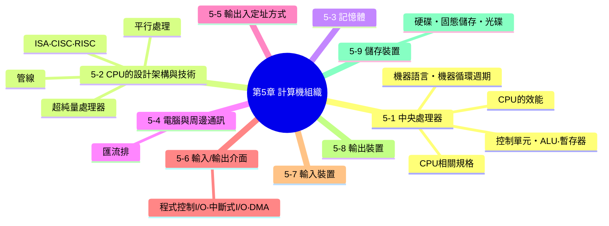
```mermaid
mindmap
  root((第5章 計算機組織))
    5-1 中央處理器
      控制單元‧ALU‧暫存器
      CPU的效能
      CPU相關規格
      機器語言‧機器循環週期
    5-2 CPU的設計架構與技術
      ISA‧CISC‧RISC
      管線
      超純量處理器
      平行處理
    5-3 記憶體
    5-4 電腦與周邊通訊
      匯流排
    5-5 輸出入定址方式
    5-6 輸入/輸出介面
      程式控制I/O‧中斷式I/O‧DMA
    5-7 輸入裝置
    5-8 輸出裝置
    5-9 儲存裝置
      硬碟‧固態儲存‧光碟
```

**這一章要帶學生建立的核心能力：**

1. 電腦不是一個模糊的黑盒子——這一章要讓學生看清楚，一台電腦實際上是由 CPU、記憶體、匯流排、輸出入裝置這幾個具體的零件，依照固定的分工彼此溝通合作組成的。
2. **CPU 的效能不是單一數字決定的**，時脈速度、CPI、指令數三者環環相扣，這也是本章計算題的核心——務必讓學生熟練 $CPU\text{時間}=\text{指令數}\times CPI\times\text{時脈週期時間}$ 這條公式與它的各種變形應用（管線、超純量）。
3. 電腦要處理輸出入裝置，需要一套「定址」與「溝通協定」，理解程式控制、中斷、DMA 三種 I/O 方式的差異，才能理解「為什麼電腦可以一邊聽音樂一邊打字，還能同時下載檔案」。

---

## 5-1　中央處理器

**中央處理器（CPU，central processing unit）** 的功能是進行算術運算與邏輯運算，由**控制單元、算術邏輯單元**及部分的**記憶單元（暫存器）**所組成：

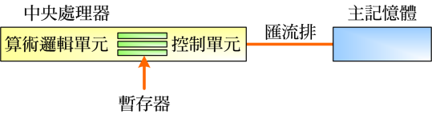

<table>
<tr>
<td width="45%">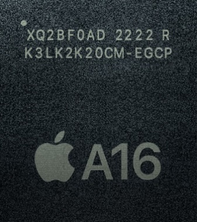</td>
<td width="45%">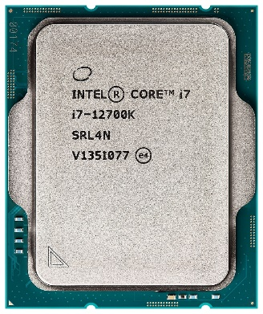</td>
</tr>
<tr><td colspan="2" align="center"><i>圖片來源：Apple、by Eric Gaba 維基百科</i></td></tr>
</table>

### 5-1-1　控制單元（CU）

**控制單元（control unit）** 是負責控制資料流與指令流的電路，可以讀取並解碼指令，然後產生訊號控制 CPU 內部的元件完成工作，製作方式有下列兩種：

- **硬體線路控制**（hardwired control）：直接用實體電路實現控制邏輯，速度快，但設計固定、不易修改。
- **微程式控制**（microprogrammed control）：用一組儲存在控制記憶體中的「微指令」來實現控制邏輯，彈性較高、方便除錯與修改。

### 5-1-2　算術邏輯單元（ALU）

**算術邏輯單元（arithmetic/logic unit）** 是負責算術運算與邏輯運算的電路——第 4 章學到的加法器電路，正是 ALU 內部的核心元件之一。

### 5-1-3　暫存器

**暫存器（register）** 是位於 CPU 內部的記憶體，用來暫時存放目前正在進行運算的資料或目前正好運算完的資料，通常區分成下列兩種類型：

- **程式設計人員能夠存取的可見暫存器**：例如通用暫存器，可以直接被組合語言指令讀寫。
- **程式設計人員無法存取的控制與狀態暫存器**：例如程式計數器（PC）、指令暫存器（IR），由 CPU 內部自動使用，不開放給一般程式直接操作。

> 暫存器的存取速度是目前所有記憶體中**最快**的（比快取記憶體、主記憶體都快），但容量也最小，這是後面 5-3 節「記憶體階層」的重要伏筆。

### 5-1-4　電腦的效能

我們可以使用下列公式計算 CPU 時間：

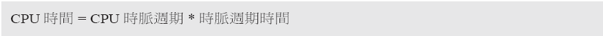

$$CPU\text{時間} = \text{指令數} \times CPI \times \text{時脈週期時間}$$

（其中 **CPI，Cycles Per Instruction** 代表平均每個指令需要花費幾個時脈週期）

- **時脈速度（clock rate）** 是時脈計數的速度，單位為 **MHz**（百萬赫茲）或 **GHz**（十億赫茲），時脈週期時間為時脈速度的倒數，故 1MHz、1GHz 對應的時脈週期時間為 $10^{-6}$ 秒、$10^{-9}$ 秒。
- 電腦的效能取決於**時脈速度、CPI 和指令數目**三大因素——這句話務必請學生背熟，因為後面所有計算題，本質上都是在操弄這三個變數其中之一（改變 CPI 就是管線/超純量技術的效果、改變指令數就是 CISC/RISC 或編譯最佳化的效果）。

電腦的效能也可以使用下列詞彙來描述：

- **MIPS**（million instructions per second）：意指每秒鐘可以完成幾百萬個指令
- **MFLOPS**（million floating operations per second）：意指每秒鐘可以完成幾百萬個浮點數運算
- **TPS**（transactions per second）：意指每秒鐘可以完成幾個交易

### 完整例題：CPI 與效能比較

**範例一**：假設一部時脈速度為 100MHz 的電腦執行 10,000,000 個指令需要 0.25 秒，試問，這部電腦的 CPI 是多少？

1. 計算電腦的時脈週期時間，即時脈速度的倒數：$1/(100\times10^6)=10^{-8}$ 秒。
2. 計算執行每個指令需要多少時間，即 $0.25/(10\times10^6)=2.5\times10^{-8}$ 秒。
3. 計算執行每個指令需要多少時脈週期，即 $2.5\times10^{-8}/10^{-8}=2.5$，故 **CPI 為 2.5**。

**範例二**：假設有兩部指令集相同的電腦 A、B，其中 A 的時脈週期時間為 10ns，CPI 為 2，B 的時脈週期時間為 20ns，CPI 為 1.5，試問，同一個程式在 A 執行較快？還是在 B 執行較快？快多少？（假設程式中的指令數目為 N）

1. 計算 A 的 CPU 時間，即 $CPI \times N = 2N$。
2. 計算 A 的 CPU 時間，即 CPU 時脈週期 $\times$ 時脈週期時間 $= 2N\times10=20N$。
3. 計算 B 的 CPU 時間，即 $CPI\times N=1.5N$。
4. 計算 B 的 CPU 時間，即 CPU 時脈週期 $\times$ 時脈週期時間 $=1.5N\times20=30N$。
5. 得到 A 的執行速度較快，而且是快了 $30N/20N=1.5$ 倍。

> **課堂重點提醒**：這一題最容易讓學生誤判的地方，是「時脈週期時間較短（B看起來較快）」不代表「總執行時間較短」——**還要把 CPI 一併考慮進去**，時脈快但每個指令要花的週期數（CPI）多，總時間不見得比較短，這正是單看時脈速度（俗稱「跑分」）評斷 CPU 好壞並不可靠的原因。

### 5-1-5　CPU 的相關規格

| 規格 | 說明 |
|---|---|
| **頻率** | CPU 外部的工作頻率稱為**外頻**，CPU 內部的工作頻率稱為**內頻**，通常內頻是外頻的倍數，舉例來說，假設 CPU 的內頻為 3.2GHz、外頻為 800MHz，故倍頻為 3.2GHz／800MHz＝4。 |
| **封裝** | CPU 是一個晶片，需要包裝起來以茲保護，並提供腳位與外界溝通，這個包裝過程稱為封裝。 |
| **核心數目** | 早期的 CPU 只有單核心，而現在的 CPU 則是以多核心（multi-core）為主流，是將多個獨立的處理器封裝在同一顆晶片。 |
| **CPU 插槽** | CPU socket，這是主機板上面用來安插 CPU 的插槽，不同的主機板可能會有不同形式的 CPU 插槽。 |
| **快取記憶體** | cache memory，這是介於 CPU 與主記憶體之間的記憶體，又分為二至三種層次，**L1 快取、L2 快取和 L3 快取**。 |
| **匯流排寬度** | bus width，匯流排決定了電腦所能傳送的位元數，電路愈多、傳送速度愈快。 |
| **字組大小** | word size，這是 CPU 在固定時間內能夠解碼並執行多少位元，所謂 8、16、32 或 64 位元電腦指的就是一次最多可以處理 8、16、32 或 64 位元的 CPU。 |

### 5-1-6　機器語言

**機器語言（machine language）** 是程式與電腦溝通的介面，定義了程式可以使用的指令與編碼方式，一個機器指令（machine instruction）的編碼方式通常包含**運算碼（op-code）**和**運算元（operand）**兩個部分。

<table>
<tr>
<td width="55%">

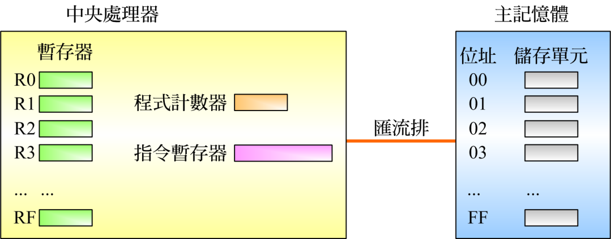
*(a) 我們所設計的系統*

</td>
<td width="45%">

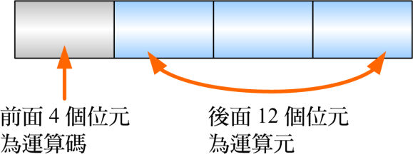
*(b) 指令格式*

</td>
</tr>
</table>

### 5-1-7　機器循環週期

CPU 執行一個指令的過程叫做**機器循環週期（machine cycle）**，包含下列四個步驟：

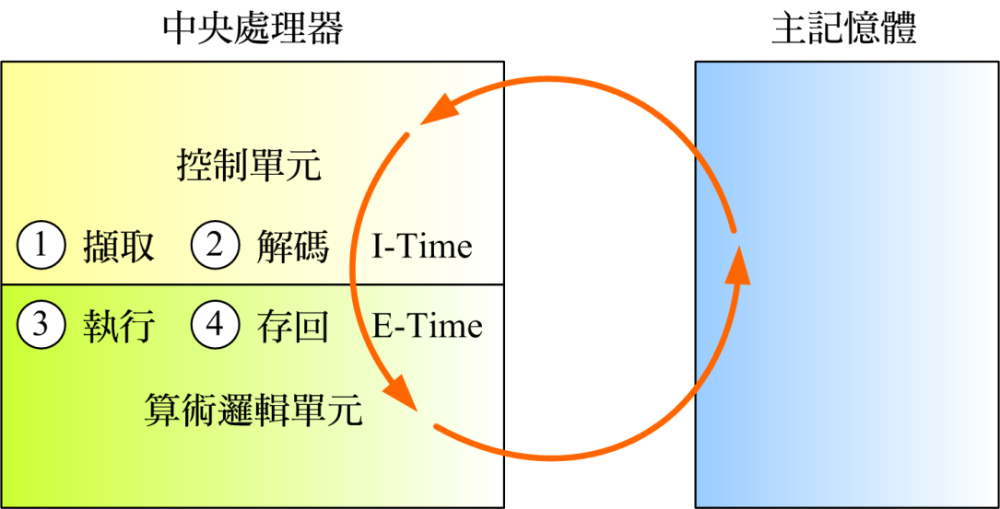

1. **指令擷取**（instruction fetch）：從主記憶體讀取下一個要執行的指令
2. **指令解碼**（instruction decode）：判讀這個指令要做什麼事、需要哪些運算元
3. **指令執行**（instruction execution）：實際執行運算
4. **結果存回**（result restored）：把運算結果寫回暫存器或記憶體

前兩步驟合稱 **I-Time**（instruction time），後兩步驟合稱 **E-Time**（execution time）——這個劃分方式，正是下一節「管線技術」得以把 CPU 拆成多個獨立元件、平行作業的理論基礎。

---

## 5-2　CPU 的設計架構與技術

### 5-2-1　ISA、CISC 與 RISC

**ISA（Instruction Set Architecture，指令集架構）** 是一種抽象模型，用來定義 CPU 的可程式化介面。ISA 分為下列兩種類型：

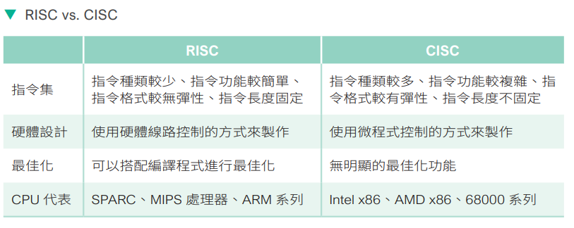

| | RISC（精簡指令集） | CISC（複雜指令集） |
|---|---|---|
| **指令集** | 指令種類較少、指令功能較簡單、指令格式較無彈性、指令長度固定 | 指令種類較多、指令功能較複雜、指令格式較有彈性、指令長度不固定 |
| **硬體設計** | 使用硬體線路控制的方式來製作 | 使用微程式控制的方式來製作 |
| **最佳化** | 可以搭配編譯程式進行最佳化 | 無明顯的最佳化功能 |
| **CPU 代表** | SPARC、MIPS 處理器、ARM 系列 | Intel x86、AMD x86、68000 系列 |

> **課堂記憶技巧**：RISC＝「**R**educed」（精簡）＝指令少但每個都簡單、固定長度、靠硬體線路直接跑，速度快但每個指令能做的事有限；CISC＝「**C**omplex」（複雜）＝指令多、功能強、但長度不固定、要靠微程式一步步翻譯執行，彈性大但速度相對較慢。手機、平板用的 ARM 處理器是 RISC 陣營的代表，而傳統 Windows 個人電腦用的 Intel／AMD x86 處理器則是 CISC 陣營的代表。

### 5-2-2　管線（Pipelining）

假設 CPU 有四個元件分別負責指令的擷取、解碼、執行與存回，所需的時間為 10ns、5ns、8ns、7ns，若以傳統做法執行 100 個指令，可以表示如下圖：

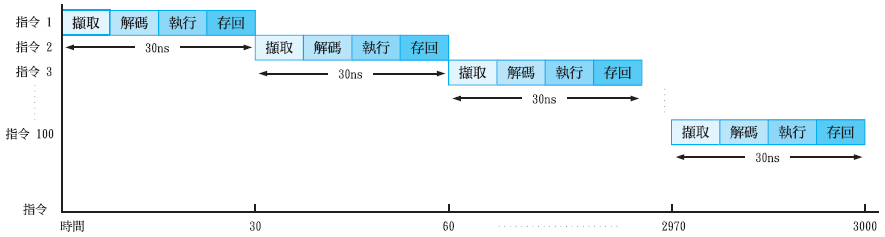

**傳統做法**：每個指令必須等前一個指令的四個步驟**全部做完**，才能開始下一個指令，因此總時間＝指令數 × 單一指令總耗時 $=100\times(10+5+8+7)=100\times30=3000$ns。

若改以管線技術執行 100 個指令，可以表示如下圖：

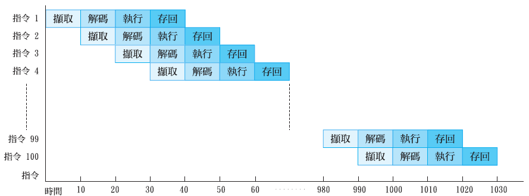

**管線技術**：把指令執行過程拆成多個獨立步驟（就像工廠的生產線），**讓不同指令的不同步驟同時、交疊進行**——第一個指令進入「解碼」階段的同時，第二個指令已經可以開始「擷取」階段，不需要空等。

**管線技術的效能公式**：

$$\text{管線執行時間} = (k-1+n)\times T_{max}$$

其中 $k$ 為管線的階段數（步驟數）、$n$ 為指令數目、$T_{max}$ 為**最長的單一步驟耗時**（因為管線的節奏，取決於最慢的那一站，就像生產線的速度取決於最慢的那個工人）。

**驗算範例**：4 個步驟（k=4）中最長的是擷取的 10ns，執行 100 個指令：$(4-1+100)\times10=103\times10=1030$ns，遠比傳統做法的 3000ns 快上許多。

> **課堂比喻**：管線技術就像洗衣店的「流水線作業」——如果每件衣服都要「洗、烘、摺」三個步驟各花 10 分鐘，傳統做法是洗完第一件、烘完第一件、摺完第一件，才開始洗第二件（每件都要等 30 分鐘）；管線做法則是第一件衣服進入「烘」的階段時，第二件衣服已經可以開始「洗」，三台機器同時運轉、沒有人閒著，大幅縮短整體完成 100 件衣服所需要的總時間。

### 5-2-3　超純量處理器（Superscalar Processor）

擁有多個相同元件以同時執行多個指令的處理器叫做**超純量處理器（superscalar processor）**，而且超純量處理器若是再結合管線技術，效能會更佳：

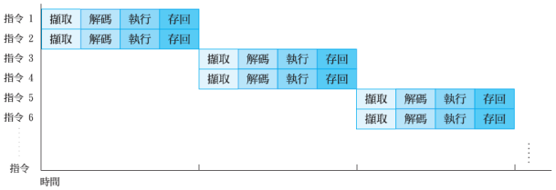
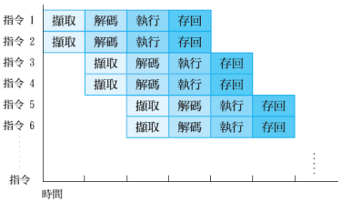

**超純量處理器的效能公式**（未結合管線，n 個指令、每次可同時執行 m 個指令）：

$$\text{執行時間} = \dfrac{n}{m}\times T_{single}$$

其中 $T_{single}$ 為單一指令（未管線化）的總耗時。

**超純量處理器結合管線技術的效能公式**：

$$\text{執行時間} = \left(k-1+\dfrac{n}{m}\right)\times T_{max}$$

> **課堂重點：四種架構效能比較的計算邏輯總整理**——這正是本章學習評量第 10~14 題的完整命題邏輯，強烈建議在黑板上把四種公式並排比較：
>
> | 架構 | 公式 | 直覺理解 |
> |---|---|---|
> | 傳統（單指令、非管線） | $n\times T_{total}$ | 每個指令從頭做到尾，完全不重疊 |
> | 管線（單指令、管線化） | $(k-1+n)\times T_{max}$ | 拆成k步驟交疊執行，速度取決於最慢那一站 |
> | 超純量（m指令、非管線） | $(n/m)\times T_{total}$ | 一次做m個指令，但每個指令仍是從頭做到尾 |
> | 超純量＋管線（m指令、管線化） | $(k-1+n/m)\times T_{max}$ | 一次處理m個指令、且每個都用管線加速 |

### 5-2-4　平行處理（Parallel Processing）

一部電腦裡面有多個處理器，每個處理器都像一個 CPU，可以獨立執行工作，至於主記憶體及 I/O 則是共用：

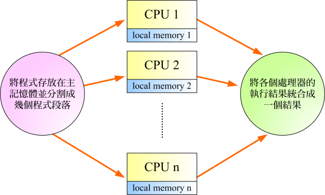

程式或資料存在主記憶體並分割成幾個程式片段，分別交給 CPU 1、CPU 2……CPU n 各自處理，最後再把各個處理器的執行結果統合成一個結果。

> **課堂比較**：超純量處理器是「**一顆 CPU 內部**塞進多組執行單元」，平行處理則是「**多顆獨立的 CPU（或多核心）**分工合作」，兩者的層次不同，但精神都是「用同時做很多事來換取速度」，也是目前所有多核心手機、電腦晶片能夠又快又省電的關鍵技術。

---

## 5-3　記憶體

**記憶體（memory）** 可以用來儲存資料，例如暫存器、快取記憶體、主記憶體等。我們可以根據儲存能力與電源的關係，將記憶體分為如下：

<table>
<tr>
<td width="55%">

- **RAM**（隨機存取記憶體，關機後資料消失）
  - DRAM（動態隨機存取記憶體）
  - SRAM（靜態隨機存取記憶體，速度較快，常用於快取）
- **ROM**（唯讀記憶體，關機後資料保留）
  - PROM（可程式化唯讀記憶體）
  - EPROM（可清除可程式化唯讀記憶體）
  - EEPROM（電子式可清除可程式化唯讀記憶體）
  - 快閃記憶體（Flash Memory）

</td>
<td width="45%">

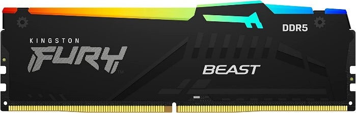
*DDR5 SDRAM（圖片來源：Kingston）*

</td>
</tr>
</table>

### 記憶體的階層

我們可以根據記憶體所在的位置、用途及速度，將記憶體劃分成如下的階層：

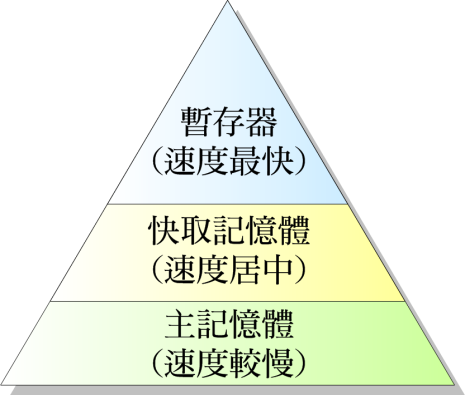

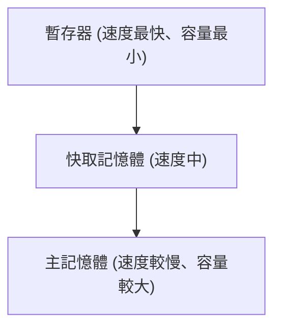
```mermaid
flowchart TD
    A["暫存器 (速度最快、容量最小)"] --> B["快取記憶體 (速度中)"]
    B --> C["主記憶體 (速度較慢、容量較大)"]
```

> **課堂重點**：記憶體階層的設計原則是**「愈快的記憶體愈貴、容量也愈小，所以只能拿來放最常用到的一小部分資料」**，愈往金字塔底層走，速度愈慢但容量愈大、成本愈低——這正是電腦系統設計中「速度」與「成本」互相權衡的經典案例，第 5-9 節的儲存裝置（硬碟、SSD）則是這個金字塔更底層、速度更慢但容量更大的延伸。

### 記憶體的定址方式

主記憶體是由許多**記憶體單元（cell）**所組成，為了加以辨識，每個記憶體單元都有唯一的**位址（address）**，同時這些位址是從 0 開始，依照順序編號：

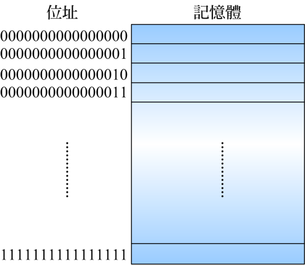

> **課堂連結**：這正好呼應第 3 章「位元組」的概念——每一個位址對應到「一個位元組」的儲存空間，而電腦要能夠定址多大的記憶體空間，就取決於「位址匯流排」有幾條線（幾個位元）。若位址匯流排為 n 位元，最多可以定址 $2^n$ 個位元組，這也是本章學習評量第 16、21 題的計算依據。

---

## 5-4　電腦與周邊通訊

電腦內部的電子訊號是由**匯流排（bus）**進行傳送，匯流排是主機板上面的銅線電路，由三組不同的電路所組成：

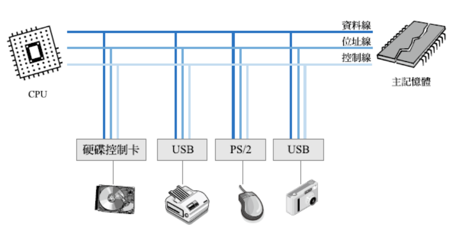

- **資料匯流排（data bus）**：負責實際傳送資料本身。
- **位址匯流排（address bus）**：負責傳送資料要存放（或讀取）的位址。
- **控制匯流排（control bus）**：負責傳送控制訊號（例如讀取／寫入的指令）。

### 主機板內建的連接埠

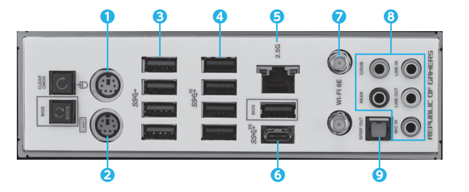

主機板上通常內建多種連接埠，方便直接連接鍵盤、滑鼠、螢幕、USB 隨身碟、音訊輸出入裝置、網路線等周邊設備，常見的連接埠包括 PS/2（滑鼠、鍵盤專用的圓形接頭）、USB、HDMI、音訊插孔（通常以顏色區分：粉藍色為 LINE IN 音訊輸入、粉綠色為 LINE OUT 音訊輸出）、網路孔（RJ-45）等。

### 常見的介面卡

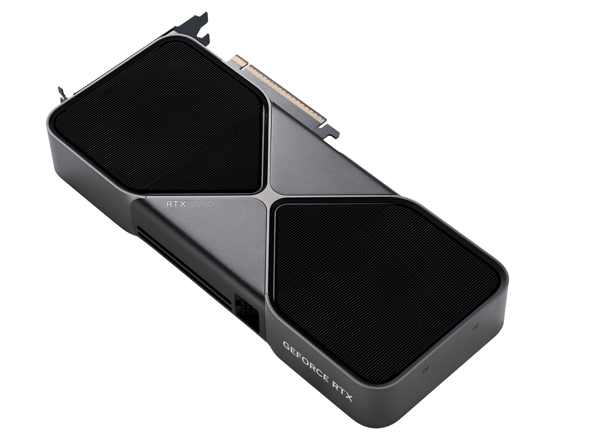
*圖片來源：NVIDIA 顯示卡*

當主機板內建的功能不敷使用時，可以透過**介面卡（expansion card）**插在主機板的擴充匯流排插槽（例如 PCI-E）上來擴充功能，常見的介面卡如下：

- **音效卡**：處理音訊輸出入
- **數據卡**：處理數據機通訊
- **網路卡**：連接有線／無線網路
- **顯示卡**：D-sub、DVI（Digital Visual Interface）、HDMI（High Definition Multimedia Interface）、DP（DisplayPort）等多種輸出介面

## 5-5　輸入／輸出的定址方式

除了主記憶體之外，CPU 也會與周邊溝通，因此，**周邊和主記憶體的記憶體單元一樣會被賦予唯一的位址**，常見的定址方式有兩種：

<table>
<tr>
<td width="50%">

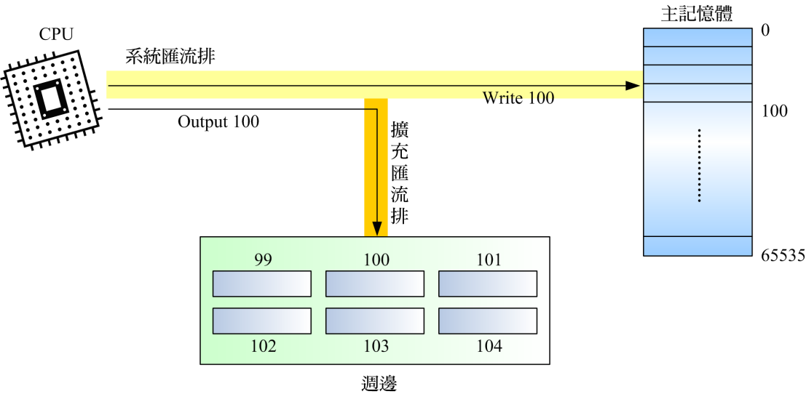

**隔離 I/O（isolated I/O）**

每個周邊均有唯一的位址，但這些位址卻可能和主記憶體的記憶體單元重疊於是得需要**額外設計不同的指令**來進行主記憶體的讀寫與周邊的讀寫。

</td>
<td width="50%">

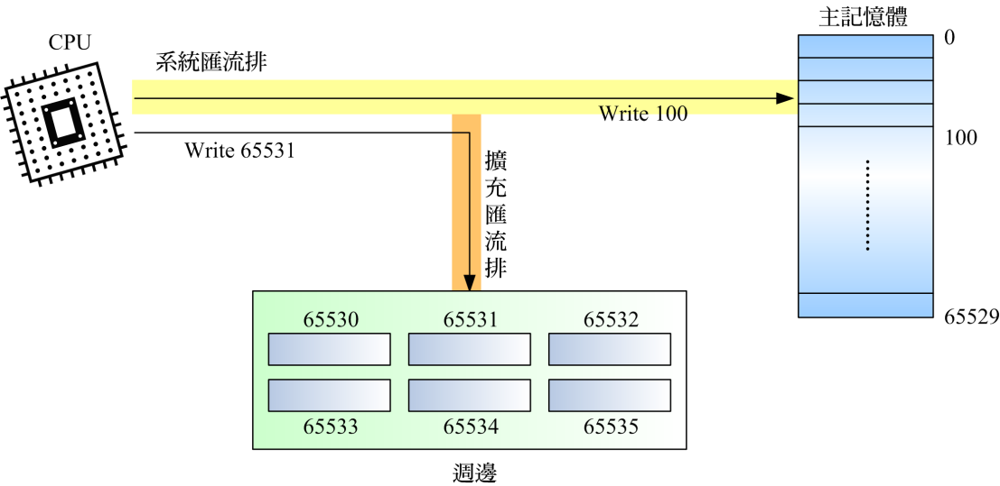

**記憶體映射 I/O（memory-mapped I/O）**

每個周邊均有唯一的位址，而且這些位址是從主記憶體的部分定址空間配置出來，所以**不會和主記憶體的記憶體單元重複**，因此可以直接沿用讀寫主記憶體的指令來存取周邊，不需要另外設計專用指令。

</td>
</tr>
</table>

> **課堂記憶技巧**：隔離 I/O 就像「飯店房間號碼」與「員工工號」各自獨立編號、可能重複（1號房與1號員工不衝突，因為要用不同的「叫法」——房卡 vs 員工證——來區分），需要專用指令；記憶體映射 I/O 則像是「把員工也編進房號系統」，直接借用同一套編號規則，不會重複，可以用同一套方式存取。

---

## 5-6　輸入／輸出介面

輸入／輸出介面主要的工作有：（1）與周邊溝通；（2）與 CPU 及主記憶體溝通；（3）做為資料緩衝區；（4）錯誤偵測與回報。

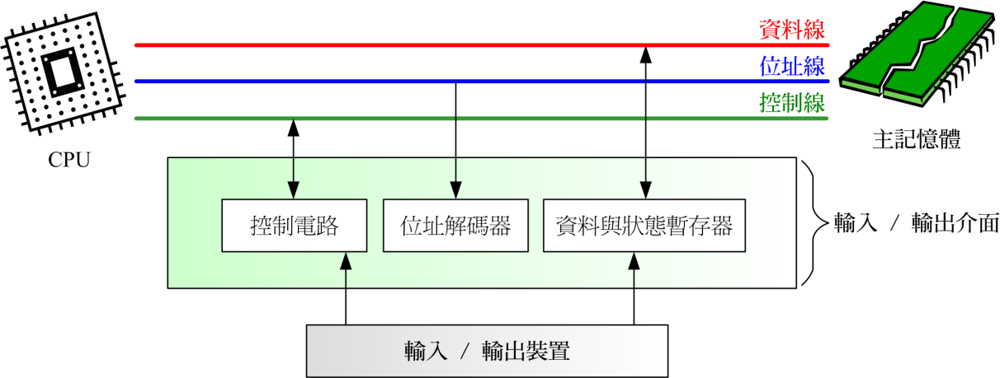

輸入／輸出介面的資料傳輸方式則有**程式控制 I/O、中斷式 I/O 和直接記憶體存取（DMA）**：

### 程式控制 I/O（Programmed I/O）

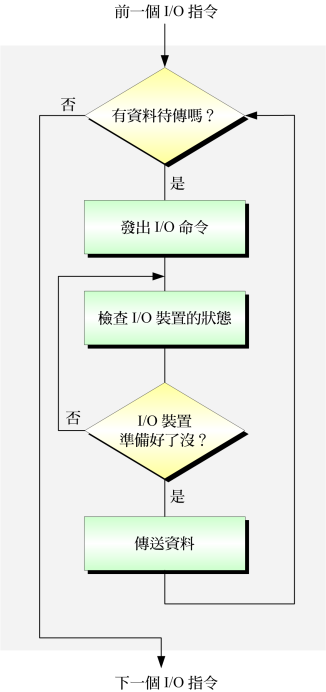

CPU 執行程式，**主動、反覆地**檢查 I/O 裝置是否已經準備好資料，如果還沒準備好，就持續等待（忙碌檢查，busy waiting），直到裝置就緒才進行資料傳送。

**缺點**：CPU 在等待期間**什麼別的事都不能做**，完全被卡住，浪費運算資源——這是三種 I/O 方式中效率最差、但實作最簡單的一種。

### 中斷式 I/O（Interrupt-driven I/O）

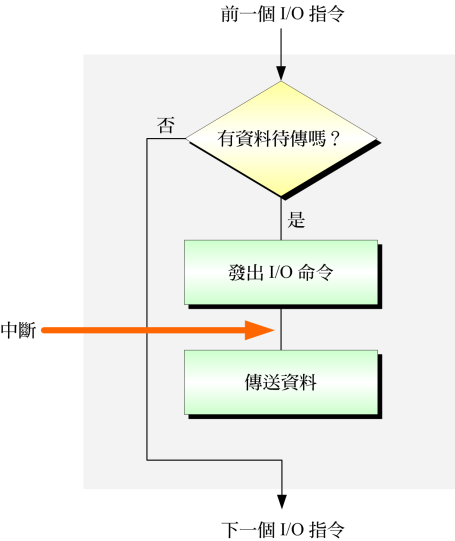

CPU 發出 I/O 指令後，**先去處理其他工作**，等 I/O 裝置準備好資料時，會主動發出一個「中斷（interrupt）」訊號通知 CPU，CPU 才會**暫停手邊工作**、轉去處理這筆 I/O 資料，處理完再回到原本被中斷的工作繼續執行。

**優點**：CPU 不需要浪費時間空等，效率比程式控制 I/O 好很多。

### 直接記憶體存取（DMA，Direct Memory Access）

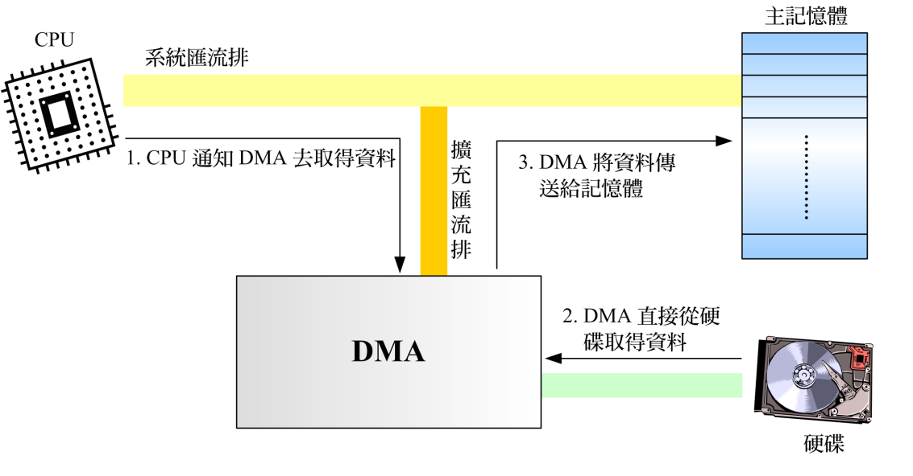

即使是中斷式 I/O，資料仍然需要「先進 CPU、再由 CPU 轉存進主記憶體」，當資料量很大時（例如整部影片），仍然會佔用大量 CPU 時間。**DMA** 的做法是額外設置一個專用的 DMA 控制器：

1. CPU 通知 DMA 去取得資料（只需一道簡短指令，之後 CPU 就可以去忙別的事）
2. DMA **直接**從硬碟取得資料（完全不經過 CPU）
3. DMA 將資料直接傳送給主記憶體（同樣不經過 CPU）

**優點**：大量資料傳輸期間，CPU 幾乎完全被釋放出來處理其他工作，這正是電腦能夠一邊播放影片、一邊執行其他程式而不會嚴重卡頓的關鍵技術。

> **課堂總結比較**：三種 I/O 方式的效率排序是 **程式控制 I/O ＜ 中斷式 I/O ＜ DMA**，差異的關鍵在於「CPU 需要親自介入處理資料的程度」——程式控制 I/O 要 CPU 全程緊盯、中斷式 I/O 只需要 CPU 在資料就緒的那一刻介入、DMA 則讓 CPU 幾乎全程置身事外。

---

## 5-7　輸入裝置

**輸入裝置（input device）** 可以接收外面的資料，包括文字、圖形、聲音與視訊，然後將這些資料轉換成電腦能夠讀取的格式，傳送給 CPU 做運算，例如：

<table>
<tr>
<td width="50%">

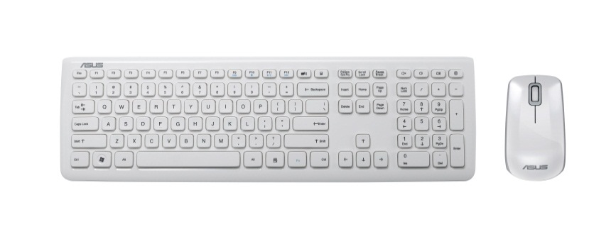

</td>
<td width="50%">

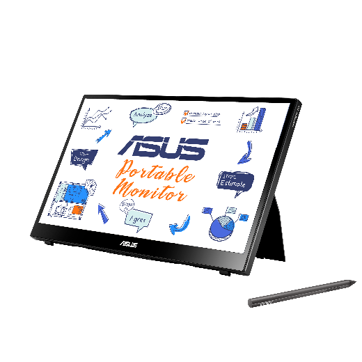
*圖片來源：ASUS*

</td>
</tr>
</table>

- 鍵盤
- 指向裝置（滑鼠、軌跡球等）
- 觸控螢幕
- 體感操控介面
- 掃描器
- 數位相機
- 數位攝影機
- 生物回饋裝置（指紋辨識、虹膜辨識等）

---

## 5-8　輸出裝置

**輸出裝置（output device）** 可以將 CPU 運算完畢的資料轉換成使用者能夠理解的文字、圖形、聲音與視訊，然後顯示出來，例如：

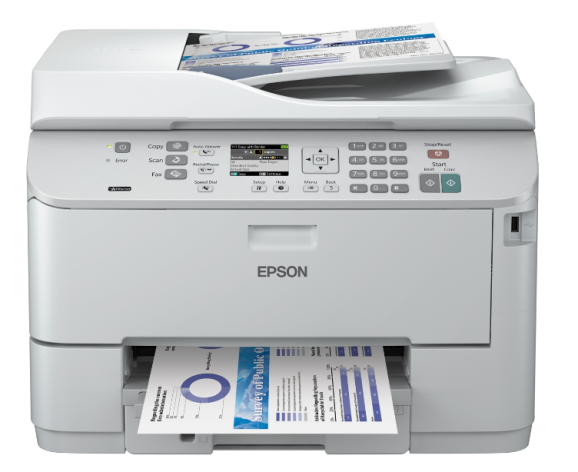

- **螢幕**：映像管螢幕（CRT）、液晶螢幕（LCD）

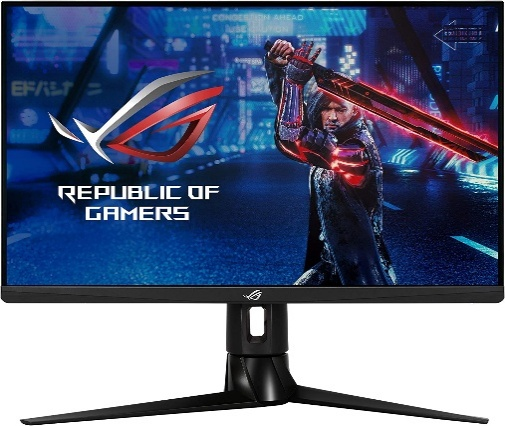
*圖片來源：ASUS、EPSON*

- **印表機**：點陣印表機、噴墨印表機、雷射印表機、多功能事務機、繪圖機

---

## 5-9　儲存裝置

**儲存裝置（storage device）** 可以用來長時間儲存資料，又稱為**次要儲存媒體（secondary storage）**或**輔助儲存媒體（auxiliary storage）**，例如硬碟、光碟、隨身碟、記憶卡、固態硬碟等。

對使用者來說，無論是文字、圖形或程式，均以**檔案（file）**的形式儲存在儲存裝置，而檔案或資料夾儲存在儲存裝置的方式取決於**檔案系統（file system）**。

> **課堂連結**：這正好接續 5-3 節的記憶體階層——儲存裝置的存取速度比主記憶體慢上許多，但容量大、成本低，而且**關機後資料不會消失**（非揮發性），因此扮演的是整個記憶體階層金字塔「最底層、容量最大」的角色。

### 5-9-1　硬碟（Hard Disk）

<table>
<tr>
<td width="50%">

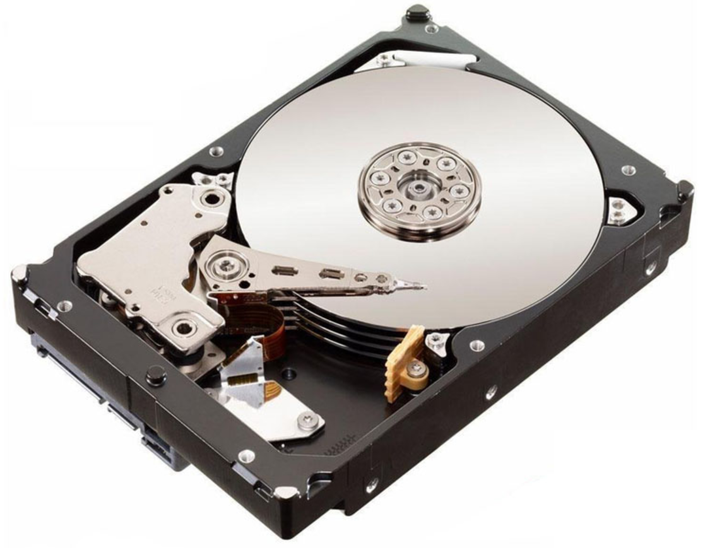

</td>
<td width="50%">

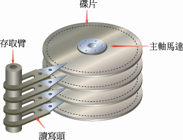

</td>
</tr>
</table>

<table>
<tr>
<td width="45%">

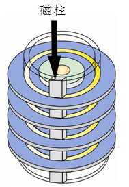

</td>
<td width="55%">

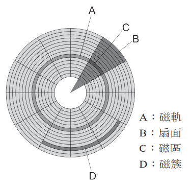

</td>
</tr>
</table>

硬碟內部由多片堆疊的**碟片**組成，每片碟片上下兩面都可以儲存資料，透過**存取臂**上的**讀寫頭**在碟片表面移動，讀取或寫入資料，關鍵術語：

- **磁軌（track）**：碟片上以主軸為中心的同心圓
- **磁區（sector）**：每個磁軌再切割成的小區塊，是硬碟讀寫的最小單位
- **磁柱（cylinder）**：多片碟片上，相同半徑的磁軌所組成的柱狀集合（讀寫頭通常同時移動、對齊同一個磁柱，藉此加快存取效率）
- **磁簇（cluster）**：作業系統配置檔案空間時使用的最小單位，通常由數個磁區組成

### 硬碟的規格

硬碟的規格常用下列幾項描述：

- **尺寸**（size）
- **容量**（capacity）
- **硬碟控制介面**（HDC，hard disk controler，例如 SATA）
- **轉速**（spindle speed，單位 RPM，每分鐘轉速愈高，理論存取速度愈快）
- **平均搜尋時間**（average seek time）：讀寫頭找到目標資料所在位置需要花費的平均時間

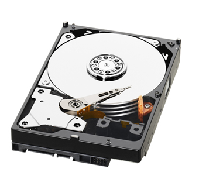

硬碟存取一筆資料，實際上要經過兩個階段：**① 將讀寫頭移到資料所在的磁軌**（這段時間即為搜尋時間）**② 將資料所在的磁區，隨著碟片旋轉到讀寫頭下方**（這段等待時間稱為「旋轉延遲」）——這也是為什麼「磁碟重組」（把零散的檔案資料，重新整理成連續集中排列）能夠提升傳統硬碟效能的原因：資料愈集中，讀寫頭移動的距離就愈短。

### 5-9-2　固定狀態儲存裝置（Solid State Storage Device）

**固定狀態儲存裝置** 是使用非揮發性記憶體晶片儲存資料，常見的如下：

<table>
<tr>
<td width="33%">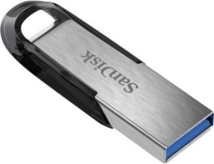 <i>(a) 隨身碟</i></td>
<td width="33%">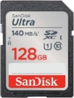 <i>(b) SD 記憶卡</i></td>
<td width="33%">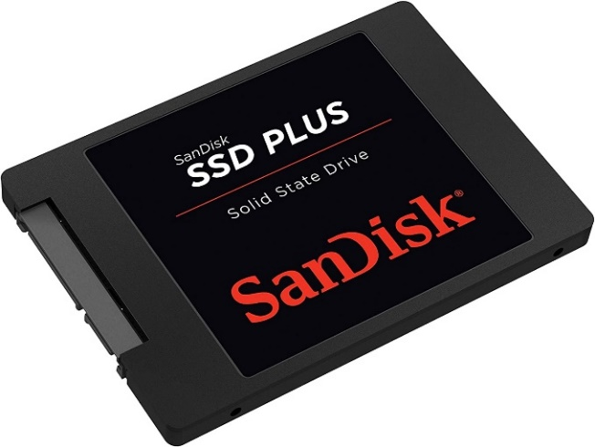 <i>(c) 固態硬碟</i></td>
</tr>
</table>

- **固態硬碟**（SSD，Solid State Drive）
- **隨身碟**
- **記憶卡**

> **課堂重點（呼應學習評量第 37 題）**：固態硬碟與傳統硬碟最主要的區別，在於固態硬碟**沒有可移動的機械式存取臂與讀寫頭**，完全依靠電子迴路存取資料，因此**存取速度更快、沒有噪音、更耐震動**，但傳統硬碟在同樣價格下通常能提供更大的容量。也因為固態硬碟沒有機械讀寫頭，「磁碟重組」對它幾乎沒有效益，反而會增加不必要的寫入次數、縮短使用壽命——這是本章學習評量第 26 題的命題重點。

### 5-9-3　光碟（Optical Disk）

**光碟（optical disk）** 是一種以光學技術進行資料讀寫的儲存裝置，其原理是利用雷射光束在光碟表面讀取或寫入資料。常見的光碟類型如下：

<table>
<tr>
<td width="50%">

- **CD**（Compact Disc）
  - CD-ROM（CD-Read Only Memory）
  - CD-R（CD-Recordable）
  - CD-RW（CD-ReWritable）
- **DVD**（Digital Video Disc）
  - DVD-ROM（儲存資料）
  - DVD-Video（儲存影像）
  - DVD-Audio（儲存音樂）
  - DVD-R（寫入一次）
  - DVD-RAM（重複寫入）
- **BD**（Blu-ray Disc）

</td>
<td width="50%">

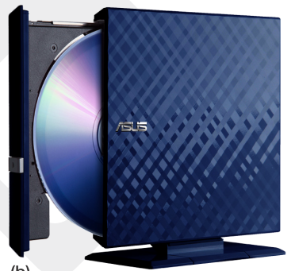

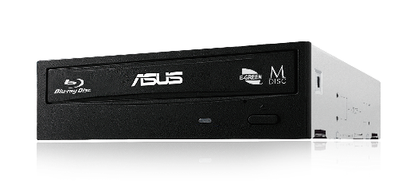

*圖片來源：ASUS*

</td>
</tr>
</table>

> **課堂記憶技巧**：光碟格式名稱中，**ROM＝唯讀（出廠就寫好，不能再改）、R＝Recordable（可以自己燒錄一次，燒完就不能再改）、RW／RAM＝可重複寫入（可以像隨身碟一樣反覆清除重寫）**，這個字尾規則放諸 CD、DVD 皆準，可以幫助學生快速判讀各種縮寫的意義，也是本章學習評量第 32 題（哪種光碟無法重複寫入資料）的判斷依據。

---

## 本章總結

| 小節 | 核心觀念一句話 |
|---|---|
| 5-1 中央處理器 | CPU由CU、ALU、暫存器組成，效能取決於時脈速度、CPI與指令數目 |
| 5-2 CPU的設計架構與技術 | RISC精簡指令、CISC複雜指令；管線與超純量都是靠「同時處理」換取速度 |
| 5-3 記憶體 | 記憶體依速度與容量分成金字塔階層：暫存器最快最小、主記憶體較慢較大 |
| 5-4 電腦與周邊通訊 | 匯流排＝資料+位址+控制三組電路，是CPU與周邊溝通的實體通道 |
| 5-5 輸出入定址方式 | 隔離I/O需要專用指令；記憶體映射I/O可沿用讀寫記憶體的指令 |
| 5-6 輸入/輸出介面 | 程式控制I/O要CPU全程緊盯，中斷式較省力，DMA讓CPU幾乎不用介入 |
| 5-7 輸入裝置 | 負責把外部資料轉換成CPU看得懂的格式，例如鍵盤、滑鼠、掃描器 |
| 5-8 輸出裝置 | 負責把CPU運算結果轉換成人類能理解的形式，例如螢幕、印表機 |
| 5-9 儲存裝置 | 硬碟、SSD、光碟是記憶體階層最底層，容量大、速度慢、關機資料不消失 |

### 關鍵詞彙表（Glossary）

`CPU` `控制單元CU` `算術邏輯單元ALU` `暫存器` `CPU時間` `CPI` `時脈速度` `MIPS` `MFLOPS` `TPS` `外頻` `內頻` `多核心` `快取記憶體` `機器語言` `運算碼` `運算元` `機器循環週期` `ISA` `RISC` `CISC` `管線` `超純量處理器` `平行處理` `RAM` `ROM` `記憶體階層` `匯流排` `隔離I/O` `記憶體映射I/O` `程式控制I/O` `中斷式I/O` `DMA` `輸入裝置` `輸出裝置` `儲存裝置` `硬碟` `磁軌` `磁區` `磁柱` `磁簇` `轉速` `搜尋時間` `固態硬碟SSD` `光碟`
## 第 5 章　學習評量

> 以下為課本第 5 章隨附之官方學習評量，題目逐字謄錄。答案為課本官方解答，並在其下補充**完整解說與計算過程**，方便課堂上直接點開講解、對答案。

### 一、選擇題

**1. 下列何者不是 CPU 主要的工作？**
A. 資料列印　B. 指令解碼　C. 結果存回　D. 指令執行

▶ 參考答案與解說

**答案：A　資料列印**

CPU 的機器循環週期包含指令擷取、**指令解碼**、指令執行、**結果存回**四個步驟，這些都是 CPU 的核心工作。「資料列印」是印表機（輸出裝置）的工作，CPU 只負責把要列印的資料準備好、透過輸出入介面送出去，實際的列印動作並非 CPU 本身在執行。

---

**2. 下列關於 CPU 的敘述何者正確？**
A. 算術邏輯單元是負責儲存算術邏輯運算結果的電路　B. 控制單元是負責控制資料流與指令流的電路　C. 暫存器是位於 CPU 外部的記憶體，中間透過匯流排排來存取　D. Google Tensor 是常見的 PC 微處理器

▶ 參考答案與解說

**答案：B**

控制單元（CU）的定義正是「負責控制資料流與指令流的電路」。選項 A 錯誤：算術邏輯單元（ALU）是負責**執行**算術與邏輯運算的電路，不是單純「儲存結果」的電路（儲存結果是暫存器的工作）。選項 C 錯誤：暫存器是位於 CPU **內部**的記憶體，不是外部。選項 D 錯誤：Google Tensor 是 Google 手機（Pixel系列）使用的行動裝置晶片，並非常見的 PC（個人電腦）微處理器。

---

**3. 下列關於電腦硬體的敘述何者錯誤？**
A. 晶片組的功能是控制主機板上面的元件與電路　B. SATA 介面可以用來連接內接式的硬碟、光碟與固態硬碟　C. BIOS 是儲存硬碟型態、開機順序等系統參數的晶片　D. PS/2 介面可以用來連接滑鼠或鍵盤

▶ 參考答案與解說

**答案：C（此為錯誤敘述）**

**BIOS（Basic Input Output System）本身是一套韌體程式**，負責開機自我測試、載入作業系統等工作；真正**儲存**硬碟型態、開機順序等這些可調整系統參數的，是主機板上另一顆由鈕扣電池供電的 **CMOS 記憶體晶片**，兩者概念不同，不應該混為一談。選項 A、B、D 的敘述皆正確。

---

**4. 根據由快到慢的順序寫出後述裝置的速度：(1) 硬碟 (2) 暫存器 (3) 主記憶體 (4) L1 快取 (5) L3 快取**
A. 54321　B. 45231　C. 25431　D. 24531

▶ 參考答案與解說

**答案：D　24531**

依照 5-3 節記憶體階層的速度排序（由快到慢）：**暫存器 > L1快取 > L3快取 > 主記憶體 > 硬碟**，對應題號為 (2)(4)(5)(3)(1)，也就是 **24531**。（提示：CPU內部的暫存器最快；快取記憶體中L1最靠近核心、比L3更快；主記憶體比快取慢，但比機械式的硬碟快上非常多。）

---

**5. 下列何者可以用來描述 CPU 的速度？**
A. bps　B. GHz　C. DPI　D. MB

▶ 參考答案與解說

**答案：B　GHz**

GHz（十億赫茲）是時脈速度的單位，用來描述 CPU 每秒鐘可以執行的時脈週期數，是描述 CPU 速度最直接的單位。bps（bits per second）用於描述網路或資料傳輸速度；DPI（Dots Per Inch）用於描述印表機、掃描器的解析度；MB（Megabyte）則是儲存容量的單位。

---

**6. 下列哪個因素不會影響 CPU 的效能？**
A. 製程　B. 快取記憶體　C. 工作時脈　D. 介面卡插槽數量

▶ 參考答案與解說

**答案：D　介面卡插槽數量**

製程（愈先進的製程通常代表電晶體愈小、效率愈高）、快取記憶體（容量愈大，CPU 愈不需要頻繁存取較慢的主記憶體）、工作時脈（時脈愈高，單位時間內能完成的運算愈多）都是直接影響 CPU 效能的關鍵因素。主機板上「介面卡插槽的數量」只影響電腦能擴充多少周邊裝置，與 CPU 本身的運算效能無關。

---

**7. 和 CISC 相比，RISC 具有下列哪個特點？**
A. 指令功能較複雜　B. 指令長度不一　C. 指令格式較有彈性　D. 指令種類較少

▶ 參考答案與解說

**答案：D　指令種類較少**

RISC（精簡指令集）的特色正是指令種類較少、指令功能較簡單、指令格式較無彈性、指令長度固定——選項 A、B、C 描述的其實都是 **CISC** 的特性，恰好與 RISC 相反，是本題常見的誘答陷阱。

---

**8. 下列關於 USB 的敘述何者錯誤？**
A. Universal Serial Bus 的縮寫　B. 支援隨插即用　C. 最多可以串接 63 個周邊　D. 傳輸速率比序列埠快

▶ 參考答案與解說

**答案：C（此為錯誤敘述）**

USB 的位址空間是 7 位元，扣除保留給主機控制器本身使用的位址，理論上**最多可以串接 127 個周邊裝置**（透過集線器 hub 擴充），而不是 63 個。選項 A（Universal Serial Bus 縮寫）、B（支援隨插即用 plug and play）、D（USB 傳輸速率遠比早期序列埠 RS-232 快上許多）皆為正確敘述。

---

**9. 下列何者是以多個處理器來執行程式以提升效率？**
A. 管線　B. 超純量　C. 平行處理　D. 神經網路

▶ 參考答案與解說

**答案：C　平行處理**

平行處理（parallel processing）的定義正是使用**多個獨立的處理器**分工執行程式片段，最後統合結果。管線與超純量則是在**單一 CPU 內部**透過拆解步驟或增加執行單元來加速（詳見 5-2 節的比較說明）；神經網路是人工智慧的技術，與提升 CPU 執行效率的架構設計無關。

---

**10. 假設 CPU 裡面有三個元件分別負責指令的擷取、解碼、執行/存回，所需的時間為 12ns、10ns、15ns，若以傳統的做法來執行 100 個指令，則所需的時間為何？**
A. 3700ns　B. 1850ns　C. 925ns　D. 1530ns

▶ 參考答案與解說

**答案：A　3700ns**

傳統做法（無管線、無超純量）：每個指令依序完整走完三個步驟，單一指令耗時 $=12+10+15=37$ns，100 個指令總時間 $=100\times37=$ **3700ns**。

---

**11. 承第 10 題，若改以管線技術來執行 100 個指令，則所需的時間為何？**
A. 3700ns　B. 1850ns　C. 925ns　D. 1530ns

▶ 參考答案與解說

**答案：D　1530ns**

套用管線公式 $(k-1+n)\times T_{max}$：三個步驟中最長的是 15ns，$k=3$（三階段）、$n=100$：

$$(3-1+100)\times15=102\times15=\mathbf{1530ns}$$

---

**12. 承第 10 題，若改以能夠同時執行兩個指令的超純量處理器來執行 100 個指令，則所需的時間為何？**
A. 3700ns　B. 1850ns　C. 925ns　D. 1530ns

▶ 參考答案與解說

**答案：B　1850ns**

超純量（未結合管線）公式 $(n/m)\times T_{total}$：$m=2$（一次執行2個指令）、$T_{total}=37$ns（單一指令總耗時，同第10題）：

$$(100/2)\times37=50\times37=\mathbf{1850ns}$$

（也可以理解成：傳統做法 3700ns，因為一次做 2 個指令，時間直接減半。）

---

**13. 承第 10 題，若改以能夠同時執行四個指令的超純量處理器來執行 100 個指令，則所需的時間為何？**
A. 3700ns　B. 1850ns　C. 925ns　D. 1530ns

▶ 參考答案與解說

**答案：C　925ns**

$$(100/4)\times37=25\times37=\mathbf{925ns}$$

（傳統做法 3700ns，一次做 4 個指令，時間變成四分之一。）

---

**14. 承第 10 題，若改以能夠同時執行兩個指令的超純量處理器結合管線技術來執行 100 個指令，則所需的時間為何？**
A. 1850ns　B. 1560ns　C. 390ns　D. 780ns

▶ 參考答案與解說

**答案：D　780ns**

超純量＋管線公式 $(k-1+n/m)\times T_{max}$：$k=3$、$m=2$、$T_{max}=15$ns：

$$(3-1+100/2)\times15=(2+50)\times15=52\times15=\mathbf{780ns}$$

**四種架構效能總比較（同一組資料）**：傳統 3700ns → 管線 1530ns → 2路超純量 1850ns → 4路超純量 925ns → **2路超純量+管線 780ns 最快**——可以帶學生觀察：把「多發射（超純量）」與「管線化」兩種技術結合，效果會比單獨使用任何一種技術都更好。

---

**15. 假設 CPU 的時脈週期是 50 皮秒 (ps)，則其時脈速度為多少 GHz？**
A. 20GHz　B. 50GHz　C. 200GHz　D. 500GHz

▶ 參考答案與解說

**答案：A（皮秒為 $10^{-12}$ 秒，$1/(50\times10^{-12})=20\times10^9=$ 20GHz）**

時脈速度是時脈週期的倒數：$\dfrac{1}{50\times10^{-12}\text{秒}}=2\times10^{10}\text{Hz}=20\text{GHz}$。

---

**16. 假設電腦的主記憶體容量最大為 128MB，那麼需要多少位元來做定址？**
A. 26　B. 27　C. 28　D. 30

▶ 參考答案與解說

**答案：B（$128\text{MB}=2^{27}\text{bits}$，應為 $2^{27}$ 個位元組）**

$128\text{MB}=128\times2^{20}\text{Bytes}=2^7\times2^{20}\text{Bytes}=2^{27}\text{Bytes}$，因此需要 **27** 個位元的位址，才能唯一標示每一個位元組（$2^{27}$ 個不同的位址剛好對應 $2^{27}$ 個位元組）。

---

**17. 下列何者不屬於輸入裝置？**
A. 數位攝影機　B. 投影機　C. 掃描器　D. 滑鼠

▶ 參考答案與解說

**答案：B　投影機**

投影機是把電腦運算完畢的畫面放大投射出來，屬於**輸出裝置**。數位攝影機、掃描器、滑鼠都是負責把外部資料（影像、文件、操作動作）傳送給電腦的輸入裝置。

---

**18. 下列何者不屬於輸出裝置？**
A. 螢幕　B. 語音辨識系統　C. 喇叭　D. 印表機

▶ 參考答案與解說

**答案：B　語音辨識系統**

語音辨識系統的工作是把使用者說出的**聲音轉換成文字或指令**輸入給電腦，屬於**輸入裝置**的範疇。螢幕、喇叭、印表機則是把電腦運算結果轉換成人類可以感知的畫面、聲音、紙本輸出，屬於輸出裝置。

---

**19. 假設電腦的處理速度為 50MIPS，試問，每分鐘可以處理幾個指令？**
A. $3\times10^9$　B. $3\times10^8$　C. $5\times10^9$　D. $5\times10^8$

▶ 參考答案與解說

**答案：A**

$50\text{MIPS}=50\times10^6$ 個指令／秒，一分鐘有 60 秒：

$$50\times10^6\times60=3000\times10^6=\mathbf{3\times10^9}\text{個指令}$$

---

**20. 下列何者是使用快閃記憶體儲存資料？**
A. 硬碟　B. 固態硬碟　C. BD　D. CD-ROM

▶ 參考答案與解說

**答案：B　固態硬碟**

固態硬碟（SSD）內部使用**快閃記憶體（Flash Memory）**晶片來儲存資料，這也是 5-9-2 節「固定狀態儲存裝置」的定義依據。硬碟使用磁性碟片儲存；BD（藍光光碟）、CD-ROM 則是使用光學方式儲存資料，皆非快閃記憶體。

---

**21. 已知 80286 的位址匯流排為 24 位元，試問，其可定址的最大記憶體空間為多少？**
A. 128MB　B. 32MB　C. 16MB　D. 512KB

▶ 參考答案與解說

**答案：C　16MB**

24 位元的位址匯流排，最多可以表示 $2^{24}$ 個不同的位址：

$$2^{24}=16{,}777{,}216\text{Bytes}=16\text{MB}$$

---

**22. 下列何者不屬於儲存裝置？**
A. DVD　B. 記憶卡　C. SSD　D. LCD

▶ 參考答案與解說

**答案：D　LCD**

LCD（液晶顯示器）是**輸出裝置**（螢幕），負責顯示畫面，並非用來長時間儲存資料的裝置。DVD、記憶卡、SSD 皆屬於本章 5-9 節介紹的儲存裝置。

---

**23. 下列何者具有揮發性？**
A. 快閃記憶體　B. Blu-ray Disc　C. EPROM　D. SRAM

▶ 參考答案與解說

**答案：D　SRAM**

SRAM（靜態隨機存取記憶體）屬於 **RAM** 家族，一旦斷電，資料就會消失，具有揮發性，常用於 CPU 的快取記憶體。快閃記憶體、EPROM 都屬於 **ROM** 家族（非揮發性，斷電後資料仍保留）；Blu-ray Disc（藍光光碟）則是光學儲存媒體，同樣屬於非揮發性儲存。

---

**24. 下列哪個裝置可以同時作為輸入及輸出裝置？**
A. 滑鼠　B. 觸控螢幕　C. 鍵盤　D. 印表機

▶ 參考答案與解說

**答案：B　觸控螢幕**

觸控螢幕**兼具兩種功能**：作為螢幕顯示畫面時是輸出裝置；當使用者用手指或觸控筆點按操作時，又能接收操作訊號，扮演輸入裝置的角色，因此是同時具備輸入與輸出功能的裝置。滑鼠、鍵盤僅能輸入；印表機僅能輸出。

---

**25. 下列何者可以用來描述硬碟的轉速？**
A. RPM　B. GHz　C. DPI　D. BPS

▶ 參考答案與解說

**答案：A　RPM**

RPM（Revolutions Per Minute，每分鐘轉速）是描述硬碟碟片轉速的標準單位，轉速愈高，理論上資料存取速度愈快。GHz 用於描述 CPU 時脈；DPI 用於描述列印或掃描解析度；BPS 用於描述資料傳輸速率。

---

**26. 下列哪個動作可能會減損固態硬碟的壽命？**
A. 磁碟分割　B. 磁碟重組　C. 磁碟檢查　D. 磁碟格式化

▶ 參考答案與解說

**答案：B　磁碟重組**

磁碟重組的目的是把零散的檔案資料重新整理成連續集中排列，藉此縮短傳統硬碟機械讀寫頭的移動距離。但固態硬碟**沒有機械讀寫頭**，資料是否連續排列對存取速度幾乎沒有影響，反而磁碟重組過程會**增加大量不必要的寫入次數**，而快閃記憶體的每個儲存單元都有寫入次數上限，因此磁碟重組動作反而會**縮短固態硬碟的使用壽命**。

---

**27. 時脈是 CPU 的重要元件，常用單位是 GHz，試問 GHz 為下列何者？**
A. 每秒 10 億次　B. 每秒 1 億次　C. 每秒 1 千萬次　D. 每秒 1 百萬次

▶ 參考答案與解說

**答案：A　每秒 10 億次**

GHz（Gigahertz）＝$10^9$ Hz＝**每秒 10 億次**。MHz（Megahertz）才是每秒 1 百萬次（$10^6$ 次），兩者級距差了 1000 倍，是常見的混淆點。

---

**28. 當電腦同時執行數個應用程式時，下列何者對於效能的影響最大？**
A. 電腦連線速度　B. 光碟機倍速　C. 主記憶體容量　D. 硬碟容量

▶ 參考答案與解說

**答案：C　主記憶體容量**

同時執行多個應用程式時，每個程式都需要佔用一部分主記憶體空間來運作。如果主記憶體容量不足，作業系統就必須頻繁把資料搬到速度慢很多的硬碟（虛擬記憶體置換），導致整體效能大幅下降，因此**主記憶體容量**是這種情境下影響效能最直接、最關鍵的因素。電腦連線速度、光碟機倍速與「同時執行多個應用程式」的情境關聯不大；硬碟容量影響的是能否儲存更多資料，而非執行速度。

---

**29. 下列何者不是數位視訊傳輸介面？**
A. DisplayPort　B. HDMI　C. DVI　D. VGA

▶ 參考答案與解說

**答案：D　VGA**

VGA（Video Graphics Array）是傳輸**類比**訊號的視訊介面，是相對古老的技術。DisplayPort、HDMI、DVI（部分模式）皆為**數位**視訊傳輸介面，畫質與訊號穩定性通常優於類比介面。

---

**30. 手機常用的 ARM 處理器採用 RISC 架構，下列何者也是 RISC 架構？**
A. Intel Core　B. AMD Ryzen　C. 68000 系列　D. MIPS

▶ 參考答案與解說

**答案：D　MIPS**

依照 5-2-1 節的分類，**SPARC、MIPS 處理器、ARM 系列屬於 RISC 陣營**；而 **Intel x86（含 Intel Core）、AMD x86（含 AMD Ryzen）、68000 系列則屬於 CISC 陣營**，因此本題只有 MIPS 屬於 RISC 架構。

---

**31. 假設 CPU 的執行速度為 10MIPS，試問，該 CPU 執行 1 億個指令需要多少時間？**
A. 1 秒　B. 10 秒　C. 100 秒　D. 5 秒

▶ 參考答案與解說

**答案：B　10 秒**

$10\text{MIPS}=10\times10^6$ 個指令／秒，執行 1 億（$10^8$）個指令所需時間：

$$\dfrac{10^8}{10\times10^6}=\dfrac{100{,}000{,}000}{10{,}000{,}000}=\mathbf{10}\text{秒}$$

---

**32. 下列何者無法重複寫入資料？**
A. CD-ROM　B. CD-RW　C. 隨身碟　D. DVD-RAM

▶ 參考答案與解說

**答案：A　CD-ROM**

依照光碟格式命名規則：**ROM＝出廠寫死、唯讀，無法重複寫入**；**RW（ReWritable）與 RAM 都代表可重複寫入**；隨身碟本身是快閃記憶體，天生就支援重複讀寫。因此只有 CD-ROM 無法重複寫入資料。

---

**33. 個人電腦的顯示卡通常可以安插在下列哪個匯流排擴充槽？**
A. PCI-E　B. ATA　C. LPT　D. 以上皆非

▶ 參考答案與解說

**答案：A　PCI-E**

現代個人電腦的顯示卡，絕大多數是安插在主機板的 **PCI-E（PCI Express）** 擴充插槽上，這種插槽提供足夠的頻寬來支援高效能顯示卡的資料傳輸需求。ATA 是早期硬碟的連接介面；LPT 是早期印表機使用的並列埠，兩者皆非用來安插顯示卡。

---

**34. 下列哪個單位適合用來衡量 AI 硬體（例如 GPU、NPU）的效能？**
A. TOPS　B. RPM　C. TFLOPS　D. Gbps

▶ 參考答案與解說

**答案：C　TFLOPS**

TFLOPS（Tera Floating-point Operations Per Second，每秒兆次浮點運算）是衡量 GPU 等硬體**浮點運算**效能的常用單位，特別適合用來描述 AI 模型訓練與推論這類大量浮點矩陣運算的效能表現。（補充：TOPS，Tera Operations Per Second，則是另一個常見於衡量 NPU 等**整數運算**為主之 AI 加速晶片效能的單位，實務上 TOPS 與 TFLOPS 常依硬體運算型態交替使用，但本題依課本標準答案採 TFLOPS。）RPM 是轉速單位；Gbps 是資料傳輸速率單位，皆非用來衡量運算效能。

---

**35. 假設電腦的時脈速度為 100MHz，而且執行每個指令都需要 10 個時脈週期，試問，該電腦每秒鐘可以執行幾個指令？**
A. $10^5$　B. $10^6$　C. $10^7$　D. $10^8$

▶ 參考答案與解說

**答案：C　$10^7$**

$100\text{MHz}=100\times10^6$ 個時脈週期／秒，每個指令需要 10 個時脈週期：

$$\dfrac{100\times10^6}{10}=10\times10^6=\mathbf{10^7}\text{個指令／秒}$$

---

**36. 下列何者不是電腦的資料儲存元件？**
A. ALU　B. Cache　C. Disk　D. Register

▶ 參考答案與解說

**答案：A　ALU**

ALU（算術邏輯單元）是負責**執行運算**的電路，本身並不是用來儲存資料的元件。Cache（快取記憶體）、Disk（硬碟）、Register（暫存器）都是電腦中用來儲存資料的元件，只是速度與容量各有不同。

---

**37. 下列何者是固態硬碟與傳統硬碟的主要區別？**
A. 固態硬碟所儲存的資料不會隨著電源關閉而消失　B. 固態硬碟的存取速度較慢、沒有噪音　C. 固態硬碟沒有可移動的存取臂和讀寫頭　D. 固態硬碟的容量較大、成本較低

▶ 參考答案與解說

**答案：C**

固態硬碟與傳統硬碟最本質的差異，在於固態硬碟**完全以電子迴路（快閃記憶體晶片）存取資料，沒有機械式的存取臂與讀寫頭**，因此速度更快、更耐震動、沒有噪音。選項 A 錯誤：傳統硬碟同樣屬於非揮發性儲存，關機後資料也不會消失，這並非兩者的「主要區別」。選項 B 錯誤：固態硬碟存取速度是**較快**而非較慢。選項 D 錯誤：一般而言，**同樣價格下傳統硬碟的容量通常更大、成本更低**，而非固態硬碟。

---

**38. 32 位元的 PCI 匯流排使用 33MHz 傳送資料，試問其傳輸速率為何？**
A. 256Mbytes/s　B. 132Mbytes/s　C. 1056Mbytes/s　D. 33Mbytes/s

▶ 參考答案與解說

**答案：B　132Mbytes/s**

32 位元＝4 個位元組（Bytes），每個時脈週期可傳送 4 Bytes：

$$4\text{Bytes}\times33\times10^6\text{Hz}=132\times10^6\text{Bytes/s}=\mathbf{132\text{Mbytes/s}}$$

### 二、簡答題

**1. 簡單說明 CPU 的結構包含哪三個部分及其功能為何？**

▶ 參考答案

CPU 的結構包含下列三個部分：

- **控制單元（CU）**：負責控制資料流與指令流的電路，可以讀取並解碼指令，然後產生訊號控制 CPU 內部的元件完成工作。
- **算術邏輯單元（ALU）**：負責算術運算與邏輯運算的電路。
- **暫存器（register）**：位於 CPU 內部的記憶體，用來暫時存放目前正在進行運算的資料或目前剛運算完的資料。

---

**2. 名詞解釋：CPU、BIOS、GHz、TOPS、匯流排、RAM、ROM、暫存器、快取記憶體、PCI-E、USB、HDMI、GPU、RPM、BD、SSD。**

▶ 參考答案

- **CPU**（中央處理器）：進行算術運算與邏輯運算的電腦核心元件。
- **BIOS**（基本輸出入系統）：電腦開機時最先執行的一套韌體程式，負責開機自我測試、載入作業系統等工作。
- **GHz**（十億赫茲）：時脈速度的單位，1GHz 代表每秒鐘 10 億次的時脈週期。
- **TOPS**（Tera Operations Per Second）：每秒兆次運算，常用來衡量 AI 加速晶片（如 NPU）的整數運算效能。
- **匯流排（bus）**：電腦內部用來傳送電子訊號的銅線電路，由資料、位址、控制三組電路組成。
- **RAM**（隨機存取記憶體）：具揮發性的記憶體，斷電後資料會消失，例如主記憶體。
- **ROM**（唯讀記憶體）：具非揮發性的記憶體，斷電後資料仍會保留。
- **暫存器（register）**：CPU 內部速度最快的記憶體，用來暫存正在運算的資料。
- **快取記憶體（cache memory）**：介於 CPU 與主記憶體之間的高速記憶體，用來減少 CPU 存取主記憶體的次數。
- **PCI-E**（PCI Express）：主機板上常見的高速擴充匯流排插槽，常用來安插顯示卡等介面卡。
- **USB**（Universal Serial Bus）：通用序列匯流排，支援隨插即用，是目前最普及的周邊連接介面之一。
- **HDMI**（High Definition Multimedia Interface）：高畫質多媒體介面，可同時傳輸數位視訊與音訊。
- **GPU**（Graphics Processing Unit）：圖形處理器，除了處理繪圖運算，也常被用來加速 AI 模型的訓練與推論。
- **RPM**（Revolutions Per Minute）：每分鐘轉速，常用來描述硬碟碟片的轉速。
- **BD**（Blu-ray Disc）：藍光光碟，容量比傳統 DVD 更大的光學儲存媒體。
- **SSD**（Solid State Drive）：固態硬碟，使用快閃記憶體晶片儲存資料，沒有機械式讀寫頭。

---

**3. 簡單比較 CISC 與 RISC 架構的差異。**

▶ 參考答案

| | RISC（精簡指令集） | CISC（複雜指令集） |
|---|---|---|
| 指令集 | 指令種類較少、功能較簡單、格式較無彈性、長度固定 | 指令種類較多、功能較複雜、格式較有彈性、長度不固定 |
| 硬體設計 | 使用硬體線路控制的方式來製作 | 使用微程式控制的方式來製作 |
| 最佳化 | 可以搭配編譯程式進行最佳化 | 無明顯的最佳化功能 |
| CPU 代表 | SPARC、MIPS 處理器、ARM 系列 | Intel x86、AMD x86、68000 系列 |

---

**4. 簡單說明輸入裝置的用途並舉出三個實例。**

▶ 參考答案

輸入裝置（input device）可以接收外面的資料，包括文字、圖形、聲音與視訊，然後將這些資料轉換成電腦能夠讀取的格式，傳送給 CPU 做運算。實例（任舉三項）：**鍵盤、滑鼠、觸控螢幕、掃描器、數位相機、數位攝影機、生物回饋裝置**等。

---

**5. 簡單說明輸出裝置的用途並舉出三個實例。**

▶ 參考答案

輸出裝置（output device）可以將 CPU 運算完畢的資料轉換成使用者能夠理解的文字、圖形、聲音與視訊，然後顯示出來。實例（任舉三項）：**螢幕（CRT、LCD）、點陣印表機、噴墨印表機、雷射印表機、多功能事務機、繪圖機**等。

---

**6. 寫出 PS/2 滑鼠、PS/2 鍵盤、USB 隨身碟、音訊輸入裝置、音訊輸出裝置、網路線等周邊可以分別連接到主機板背板的哪個連接埠。**

▶ 參考答案

- **PS/2 滑鼠**：連接到 PS/2 滑鼠專用圓形接孔（通常為綠色）
- **PS/2 鍵盤**：連接到 PS/2 鍵盤專用圓形接孔（通常為紫色）
- **USB 隨身碟**：連接到任一 USB 連接埠（通常為藍色或黑色的長方形插槽）
- **音訊輸入裝置**（如麥克風）：可以連接到粉藍色的 **LINE IN** 插孔
- **音訊輸出裝置**（如喇叭、耳機）：可以連接到粉綠色的 **LINE OUT** 插孔
- **網路線**：連接到 RJ-45 網路孔

> **提示**：主機板背板的音訊插孔通常以顏色區分不同用途，除了粉藍（Line In）、粉綠（Line Out）之外，粉紅色通常是麥克風專用插孔，記熟顏色配置可以快速正確接線。

---

**7. 簡單說明何謂機器循環週期 (machine cycle)？**

▶ 參考答案

CPU 執行一個指令的過程叫做機器循環週期，包含下列四個步驟：**指令擷取（instruction fetch）→ 指令解碼（instruction decode）→ 指令執行（instruction execution）→ 結果存回（result restored）**。其中前兩步驟合稱 I-Time，後兩步驟合稱 E-Time。

---

**8. 已知一個管線處理器的每個指令有五個步驟，執行 N 個指令需要 100ns，假設時脈速度為 500MHz，試問，執行 2N 個指令需要多少時間？**

▶ 參考答案

時脈速度 500MHz，時脈週期時間 $=1/(500\times10^6)=2$ns。

套用管線公式 $(k-1+n)\times T=$ 總時間，其中 $k=5$（五個步驟）：

$$[(5-1)+N]\times2=100$$
$$4+N=50$$
$$N=46$$

執行 $2N=92$ 個指令所需時間：

$$[(5-1)+92]\times2=96\times2=\mathbf{192ns}$$

---

**9. 假設有兩部編譯程式在一部時脈速度為 800MHz 的電腦上做測試，該電腦的指令有 A、B、C 三種類型，時脈週期分別為 3、2、1，已知第一個編譯程式產生的目的碼包含 10 百萬指令 A、10 百萬指令 B、50 百萬指令 C，而第二個編譯程式產生的目的碼包含 10 百萬指令 A、10 百萬指令 B、100 百萬指令 C，試問：**

**(1) 根據 MIPS 的定義，哪個編譯程式編譯出來的目的碼執行較快？**
**(2) 根據執行時間的長短，哪個編譯程式編譯出來的目的碼執行較快？**

▶ 參考答案與完整解說

**(1) 根據 MIPS 的定義比較**

第一個編譯程式：

- 總共使用的時脈週期數 $=3\times10+2\times10+1\times50=30+20+50=100$ 百萬個時脈週期
- 產生的目的碼共 $10+10+50=70$ 百萬個指令
- $MIPS=\dfrac{70}{100}\times800M=560$

第二個編譯程式：

- 總共使用的時脈週期數 $=3\times10+2\times10+1\times100=30+20+100=150$ 百萬個時脈週期
- 產生的目的碼共 $10+10+100=120$ 百萬個指令
- $MIPS=\dfrac{120}{150}\times800M=640$

**由於第二個編譯程式的 MIPS（640）比第一個（560）高，依 MIPS 的定義判斷，第二個編譯程式編譯出來的目的碼執行較快。**

**(2) 根據實際執行時間比較**

第一個編譯程式：使用 100 百萬個時脈週期，執行時間 $=100\times10^6\times(1/800\times10^6)=100\times10^6\times(1/800M)=0.125$ 秒

第二個編譯程式：使用 150 百萬個時脈週期，執行時間 $=150\times10^6\times(1/800M)=0.1875$ 秒

**由於第一個編譯程式實際執行時間（0.125秒）比第二個（0.1875秒）短，因此根據執行時間長短判斷，第一個編譯程式編譯出來的目的碼執行反而較快。**

> **課堂重點：這一題是本章最重要的「觀念陷阱」示範**——MIPS 只計算「平均每秒執行的指令數量」，但兩個編譯程式產生的**指令總數量並不相同**（70 百萬 vs 120 百萬），MIPS 較高不代表總執行時間較短，只有**實際執行時間**才是真正客觀比較效能的標準。這正好呼應 5-1-4 節「不能只看時脈速度或單一效能指標，要綜合考量」的核心觀念——MIPS 這類「速度指標」在指令組成比例不同的情況下，可能會產生誤導的比較結果，這也是計算機組織領域中一個經典的效能評估陷阱。

---

*本講義圖片素材取自《最新計算機概論》第十二版 第 5 章 原版簡報，內文為教學擴寫版本；學習評量題目依課本原文謄錄，答案在課本官方解答基礎上，補齊完整計算過程與解說，僅供授課教師課堂講解使用。*
