# 第 6 章　電腦軟體與作業系統

> 本講義以《最新計算機概論》第十二版 第 6 章 PPT 的架構為骨架，重新撰寫為適合課堂詳細講解的完整教學文字稿。圖片素材取自原簡報；內文除大幅擴寫解說外，並針對「智慧財產權與軟體授權」這類與生活高度相關的主題，補充了具體案例與課堂討論問題。

## 本章學習地圖

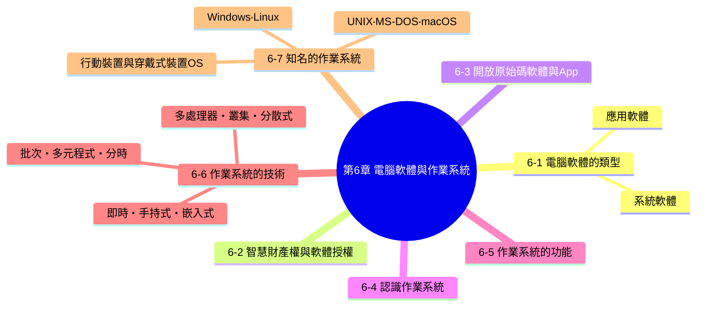

**這一章要帶學生建立的核心概念：**

1. 電腦軟體有清楚的分類邏輯——系統軟體「管好硬體、伺候應用軟體」，應用軟體「幫使用者完成具體工作」，而作業系統正是系統軟體中最核心的靈魂人物。
2. 軟體不是憑空存在的，它是人類智慧的結晶，受到智慧財產權保護——理解著作權與各種授權方式，是每一位資訊使用者的基本素養，也是避免誤觸法律的必修課。
3. 作業系統的發展史，就是一部「如何讓昂貴的電腦資源被更多人、更有效率地共用」的技術演進史，從單工到批次、多元程式、分時，一路發展到今天無所不在的手持式與嵌入式系統。

---

## 6-1　電腦軟體的類型

電腦軟體可以分成兩大類型：

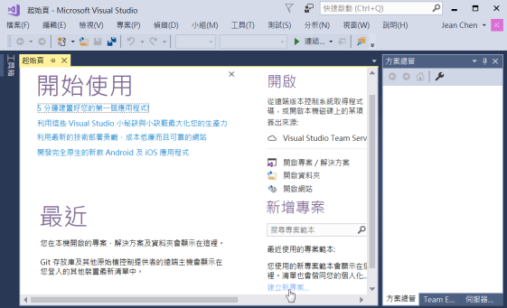

<table>
<tr>
<td width="50%">

**系統軟體（system software）**：支援電腦運作的程式，包括：

- **作業系統**（operating system）
- **公用程式**（utility）
- **程式開發工具**（program development tool）

</td>
<td width="50%">

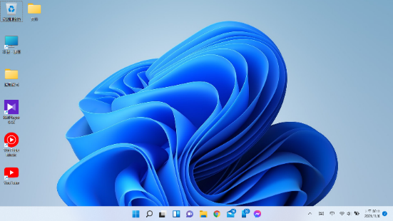
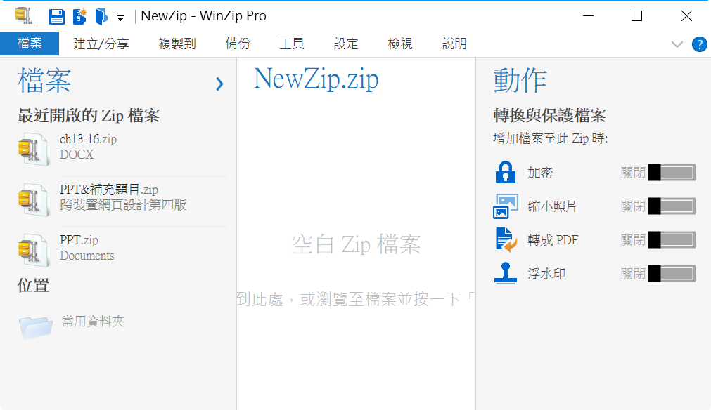

</td>
</tr>
</table>

**應用軟體（application software）**：針對特定事務或工作所撰寫的程式，目的是協助使用者解決問題。依設計的目的不同，應用軟體又分成下列兩種類型：

- **橫向應用軟體**（horizontal application software）：功能通用、適用於各行各業廣泛使用者的軟體，例如文書處理、試算表、簡報軟體。
- **縱向應用軟體**（vertical application software）：針對特定產業或特定工作流程量身打造的軟體，例如醫院的病歷管理系統、餐廳的點餐系統。

> **課堂記憶技巧**：「橫向」代表**橫跨很多不同領域的人都會用**（像 Word，學生、上班族、老師都在用）；「縱向」代表**只服務某一個特定領域、往深處扎根**（像醫院專用的掛號系統，只有醫療院所會用，但功能做得非常深入專精）。

---

## 6-2　智慧財產權與軟體授權

### 什麼是智慧財產權？

**智慧財產（intellectual property）** 指的是由人類的精神活動所產生的成果，而佔有和支配智慧財產的法律地位即為**智慧財產權（intellectual property rights）**，其所涵蓋的範圍廣泛，包括：

- 著作權
- 商標權
- 專利權
- 產地標示
- 工業設計
- 積體電路之電路佈局權
- 未公開資訊之保護（營業秘密）
- 授權契約中違反競爭行為之管理（公平交易）

### 與電腦軟體關係最密切的：著作權

和電腦軟體關係最密切的當屬著作權，包括下列兩個部分：

- **著作人格權**：保護著作人與其作品之間精神層面的連結，例如「姓名表示權」（有權要求在作品上標示自己的姓名）、「禁止不當修改權」（有權禁止他人以扭曲、割裂等方式改變自己的作品，致損害名譽）——著作人格權**專屬於著作人本身，無法轉讓或繼承**。
- **著作財產權**：保護著作人對其作品的經濟利益，例如重製權、公開傳輸權、散布權等，這部分權利**可以透過買賣、授權、繼承等方式轉讓給他人**。

> **課堂案例討論**：如果一位攝影師受公司委託拍攝形象照，事後公司未經同意就把照片修圖到「面目全非」拿去做負面行銷，這牽涉到著作人格權中的哪一項？（提示：禁止不當修改權，即使公司可能已經買下了照片的著作財產權，攝影師的人格權仍然受到保護。）

> **課堂重點（呼應學習評量第 16 題）**：許多人誤以為著作權需要「申請」才會產生，但事實上，**只要作品完成創作，著作權就自動產生，不需要另外申請登記**——這與必須提出申請、經過審查的「專利權」性質不同，是常見的迷思，值得特別澄清。

---

## 6-3　開放原始碼軟體與 App

### 開放原始碼軟體（Open Source Software）

**開放原始碼軟體** 是任何人都能夠免費取得、使用、修改與共享（以修改或未修改的形式）的軟體，由多人共同開發，並在遵循**開放原始碼定義（open source definition）**的授權下散布。

> **課堂重點（呼應學習評量第 1 題）**：「開放原始碼」不等於「完全沒有著作權、想怎麼用都可以」——開放原始碼軟體依然受著作權保護，只是著作人選擇用特定的**開放授權條款**（例如 GPL、MIT License、Apache License 等），主動允許他人在符合條款規定的前提下自由取得、使用、修改與再散布原始碼。常見的開放原始碼軟體包括 Linux 作業系統、MySQL 資料庫、Python 程式語言、LibreOffice 辦公軟體等；相對地，像 AutoCAD、Microsoft Office 這類商業軟體，原始碼是不公開的（閉源軟體），這也是本章學習評量第 1 題的判斷依據。

### App（Application）

**App** 一詞泛指智慧型手機、平板電腦等行動裝置上的小型應用程式：

<table>
<tr>
<td width="45%"></td>
<td width="45%">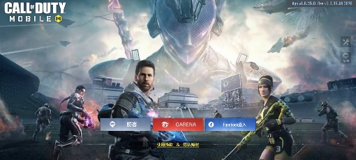</td>
</tr>
<tr><td colspan="2" align="center"><i>手機遊戲 App</i></td></tr>
</table>

---

## 6-4　認識作業系統

**作業系統（OS，operating system）** 是介於電腦硬體與應用軟體之間的程式，除了提供執行應用軟體的環境，還負責分配系統資源，例如 CPU、記憶體、磁碟、輸入／輸出等。

<table>
<tr>
<td width="50%">

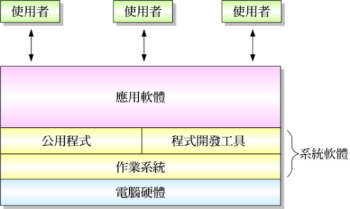

</td>
<td width="50%">

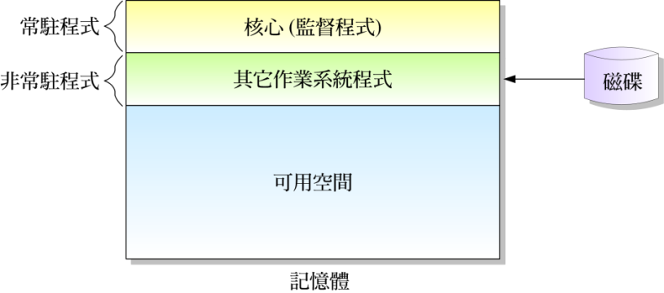

</td>
</tr>
</table>

作業系統中實際負責管理系統資源的是數個不同的**處理程式**，而負責協調與控制這些處理程式，並維持整個作業系統正常運作的程式叫做**核心（kernel）**或**監督程式（supervisor program）**。

> **課堂重點**：核心是整個作業系統中「常駐」在記憶體裡、隨時待命的最重要部分（對照上方右圖），其它作業系統程式則相對「非常駐」，需要時才會被載入記憶體執行——**核心可以說是作業系統的靈魂，一旦核心當機（俗稱 kernel panic），整台電腦就會停止運作**，這也是為什麼作業系統的核心程式碼往往是整套系統中最被謹慎維護、測試最嚴格的部分。

---
## 6-5　作業系統的功能

作業系統的功能主要有下列幾項：

- **分配系統資源**：例如決定哪個程式可以使用 CPU、分配多少記憶體空間給每個執行中的程式。
- **提供執行應用軟體的環境**：應用軟體不需要直接跟硬體打交道，只要透過作業系統提供的介面，就能請求硬體資源。
- **提供使用者介面**（user interface）：讓使用者能夠對電腦下達指令、操作電腦。

在過去，作業系統所提供的是**命令列使用者介面**（command line user interface）：

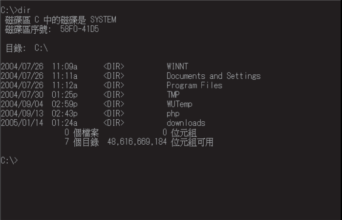

而現在，作業系統所提供的是**圖形化使用者介面**（GUI，graphical user interface）：

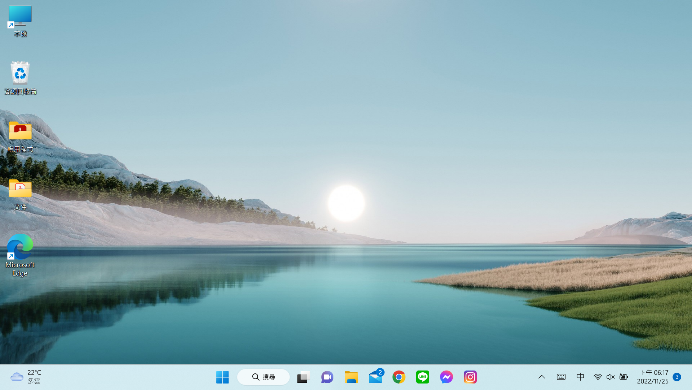

> **課堂比較**：命令列介面（CLI）需要使用者記住並手動輸入正確的指令語法，學習門檻較高，但執行效率高、適合自動化批次處理（例如系統管理員撰寫的自動化腳本）；圖形化介面（GUI）透過視窗、圖示、選單，讓使用者能用滑鼠點選操作，學習門檻低、適合一般大眾使用，這也是為什麼從 1980 年代開始，GUI 逐漸取代 CLI 成為主流作業系統介面的原因（詳見 6-7 節 Apple 與 Microsoft 的發展歷史）。不過 CLI 並未消失，在伺服器管理、程式開發等場合，CLI 至今仍是專業人員愛用的高效工具。

---

## 6-6　作業系統的技術

作業系統的發展史，其實是一部「如何讓昂貴的電腦資源被更多使用者、更有效率共用」的技術演進史，以下依照這條演進脈絡逐一介紹。

### 6-6-1　批次系統（Batch System）

早期電腦的作業系統主要就是將一個工作轉移到下一個工作，屬於**單工系統**（single task system），一次只能服務一位使用者：

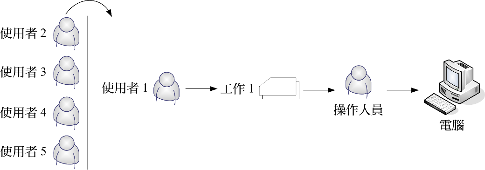

為了提升效率，於是電腦的操作人員將這些工作加以排序，把相同或類似的工作集中在一起，稱為一個**批次（batch）**，然後交給電腦分批執行，再將輸出結果送回給所屬的使用者，稱為**批次處理（batch processing）**：

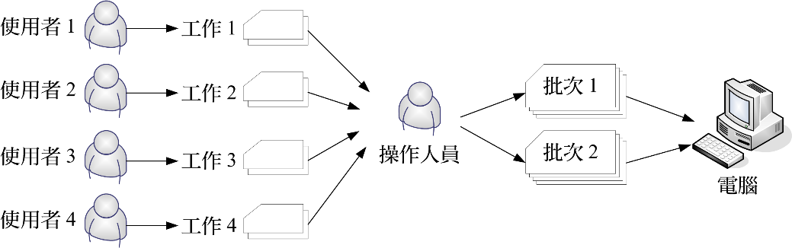

> **課堂比喻**：單工系統就像銀行只有一個窗口、一次只服務一位客人，其他人只能排隊枯等；批次系統則像是把「今天要辦理的所有存款業務」集中在早上處理、「所有提款業務」集中在下午處理，雖然還是要排隊，但同類型的工作被集中處理，操作人員不用一直切換作業模式，效率因此提升。

### 6-6-2　多元程式系統（Multiprogramming）

**多元程式系統（multiprogramming）** 的目的是同時服務多位使用者或多個程式，以提升 **CPU 的使用率**：

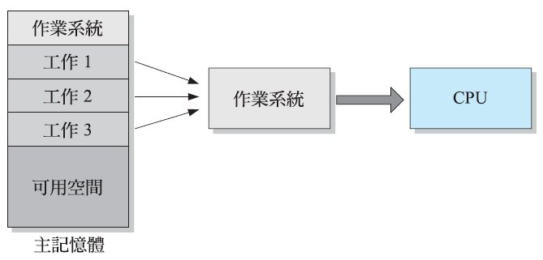

批次系統雖然改善了效率，但當某個工作正在等待輸入／輸出裝置（例如讀取磁碟）時，CPU 其實是閒置的。多元程式系統把多個工作同時放進主記憶體，只要某個工作因為等待 I/O 而暫停，CPU 立刻切換去執行另一個已經準備好的工作，讓 CPU 幾乎不會有閒置的空檔。

### 6-6-3　分時系統（Time-Sharing）

**分時處理（time-sharing）** 是一種特殊形式的多元程式處理，主要應用於**「互動式系統」**（interactive system）：

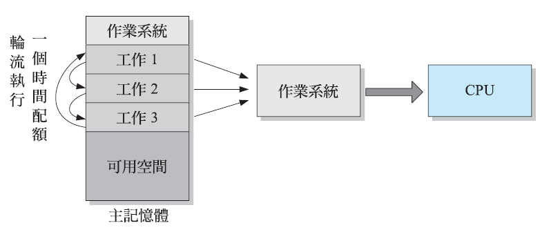

分時系統把 CPU 的時間切割成一個個極短的「時間片段（time slice）」，輪流分配給每一個工作使用。因為每個時間片段都非常短暫（通常只有幾毫秒），使用者幾乎感覺不到自己是在跟其他人「輪流」使用同一顆 CPU，會誤以為整台電腦是自己獨佔的——這正是「多人同時登入同一台伺服器工作」得以順暢運作的技術基礎。

> **課堂比較：多元程式系統 vs. 分時系統**——兩者都是讓多個工作共用 CPU，但**多元程式系統的設計目標是「提升 CPU 使用率」**（讓 CPU 盡量不要閒置，較適合批次性質、不急著馬上看到結果的工作），**分時系統的設計目標則是「提升使用者的互動體驗」**（讓每個使用者都感覺自己被即時回應），兩者的技術手段類似，但出發點不同。

### 6-6-4　多處理器系統（Multiprocessor System）

**多處理器系統（multiprocessor system）** 是具有多個 CPU 的系統，又稱為**平行系統（parallel system）**：

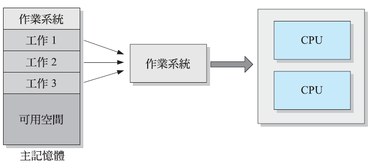

前面幾種技術，都是想辦法讓「一顆 CPU」被更有效率地共用；多處理器系統則是直接**增加 CPU 的數量**，讓多個工作可以真正同時（而不是「輪流假裝同時」）被執行，這正好呼應第 5 章「平行處理」的概念。

### 6-6-5　叢集式系統（Clustered System）

**叢集式系統（clustered system）** 的概念類似多處理器系統，不過，它是由多個**相互連接的節點**所組成，節點之間可以共用系統的資源，目的是提升效能、可靠度與可擴展性，其成本效益往往優於同等級的大型電腦。

> **課堂重點**：叢集式系統與多處理器系統最大的差異，在於**多處理器系統的多個 CPU 通常封裝在同一台機器裡（共用同一個主記憶體）**，而**叢集式系統的每個節點往往是各自獨立、完整的電腦**（各自有自己的記憶體與儲存裝置），透過高速網路連接起來共同工作——這讓叢集式系統擁有更好的「可擴展性」（想要更強的效能，只要多接幾台機器進叢集即可），也是許多網站背後的伺服器架構所採用的技術。

### 6-6-6　分散式系統（Distributed System）

在分散式系統中，**同一個工作可以拆成幾個部分**，然後透過快速的網路連結指派給多部電腦分別執行：

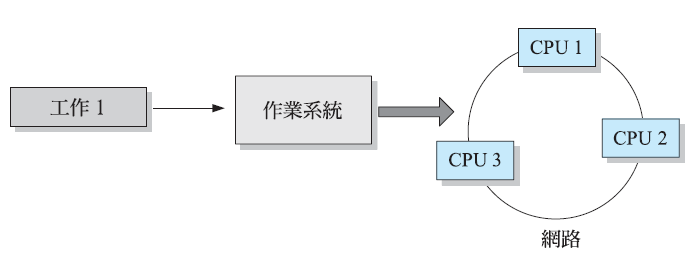

> **課堂比較：叢集式系統 vs. 分散式系統**——兩者都仰賴網路連接多台電腦，但叢集式系統中的節點通常**位置相近、規格相似、緊密協同**（像是機房裡整齊排列的一群伺服器，一起分擔同一批類似的工作）；分散式系統則更強調把**單一個大工作，拆解成多個獨立的小部分**，分別交給（可能位於不同地點、規格不盡相同的）多部電腦去執行，再統合各自的執行結果，概念上更接近「分工合作解決一個大問題」。

### 6-6-7　即時系統（Real-Time System）

**即時系統（real-time system）** 必須在預定的時間限制內正確地完成工作，通常應用於非常重視回應時間的系統，例如生產線自動控制系統、飛機導航系統等，又分成硬即時系統（hard real time system）和軟即時系統（soft real time system）：

- **硬即時系統**：**絕對不能**超過時間限制，一旦超時就視為系統失敗，可能造成嚴重後果（例如飛機自動駕駛系統、心律調節器）。
- **軟即時系統**：超過時間限制雖然不理想，但不會造成災難性後果，只是服務品質下降（例如影音串流播放，畫面偶爾延遲一兩秒，使用者頂多感到卡頓，不至於造成危險）。

### 6-6-8　手持式系統（Handheld System）

**手持式系統（handheld system）** 泛指應用於智慧型手機或平板電腦的作業系統，在設計上必須考慮到體積小巧、有效管理記憶體、減輕處理器的負荷、降低消耗的電力、擷取顯示部分內容、支援無線通訊等：

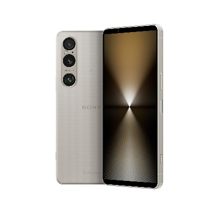
*圖片來源：SONY Xperia*

> **課堂重點**：手持式系統跟一般桌上型電腦作業系統最大的不同，在於**「省電」是最優先的設計考量之一**——桌機插著電源可以無限供電，但手機、平板要靠電池撐過一整天，因此手持式系統的核心工作排程、螢幕更新頻率、背景程式的管理，都要在「效能」與「省電」之間做出精細的權衡取捨。

### 6-6-9　嵌入式系統（Embedded System）

**嵌入式系統（embedded system）** 沒有或只有少許介面，功能有限且較陽春，傾向於監督並控制硬體裝置等特殊用途：

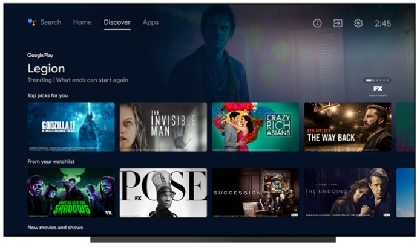
*圖片來源：Google TV*

> **課堂連結**：這正好呼應第 2 章提過的嵌入式系統定義（冷氣、冰箱、智慧電視等專為特定功能設計的裝置），這裡進一步從「作業系統」的角度切入——這些裝置內部同樣需要一套作業系統來管理硬體資源，只是這套作業系統通常經過大幅精簡，只保留該裝置需要的極少數功能，不像桌機或手機的作業系統那樣「什麼都要能做」。

---

## 6-7　知名的作業系統

### 6-7-1　UNIX

- UNIX 是 AT&T 貝爾實驗室的 **Ken Thompson** 和 **Dennis Ritchie**，於 1971 年針對 DEC 迷你電腦所開發的多使用者分時作業系統。
- 早期 UNIX 為命令列使用者介面，後來亦推出圖形化使用者介面－ **X Window**。
- UNIX 的成就之一是提出**主從式架構（client server model）**。

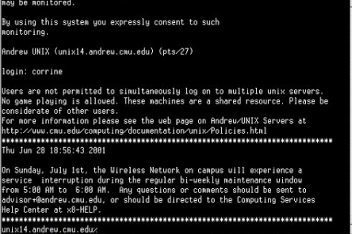

### 6-7-2　MS-DOS

**MS-DOS（Microsoft disk operating system）** 是 Microsoft 公司於 1975 年針對 IBM PC 所推出的作業系統，採用**命令列使用者介面**，使用者必須透過鍵盤輸入指定的指令集，才能指揮電腦完成工作。

### 6-7-3　macOS

<table>
<tr>
<td width="60%">

- Apple 公司的創始人之一——**Steve Jobs** 意識到圖形化使用者介面的重要性及未來前景，於 1983 年、1984 年推出採取圖形化使用者介面的個人電腦 **Lisa** 和 **Macintosh**（麥金塔）。
- **macOS** 指的就是安裝於 Apple Macintosh 電腦的作業系統，傳統的 macOS 是以卡內基美隆大學開發的 **Mach** 做為核心，最終版本為 1999 年推出的 **Mac OS 9**。之後 Apple 公司改以 **BSD UNIX** 為基礎推出 **OS X**，並於 2016 年將 OS X 更名為 **macOS**。

</td>
<td width="40%">

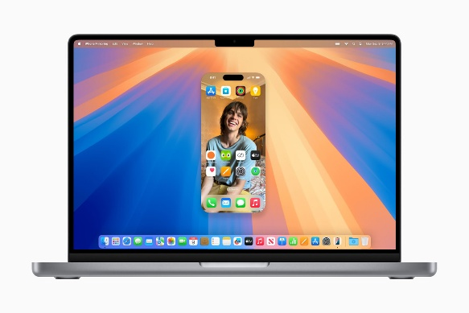
*macOS（圖片來源：Apple）*

</td>
</tr>
</table>

### 6-7-4　Microsoft Windows

<table>
<tr>
<td width="60%">

- Microsoft 公司於 1985 年、1987 年所推出的 **Windows 1.0** 和 **Windows 2.0** 順利成為 IBM 相容 PC 的標準圖形化使用者介面系統。
- Microsoft 公司於 1990 年推出 **Windows 3.0** 並獲得了空前的迴響。
- Microsoft 公司於 1995 年推出 **Windows 95**，Windows 才從殼層程式轉變為真正的作業系統，**不再包含 MS-DOS**。
- 之後 Microsoft 公司不斷推出新版的 Windows 作業系統，包括 Windows Me、Windows XP、Windows Vista、Windows 7、Windows 8、Windows 10、Windows 11。

</td>
<td width="40%">

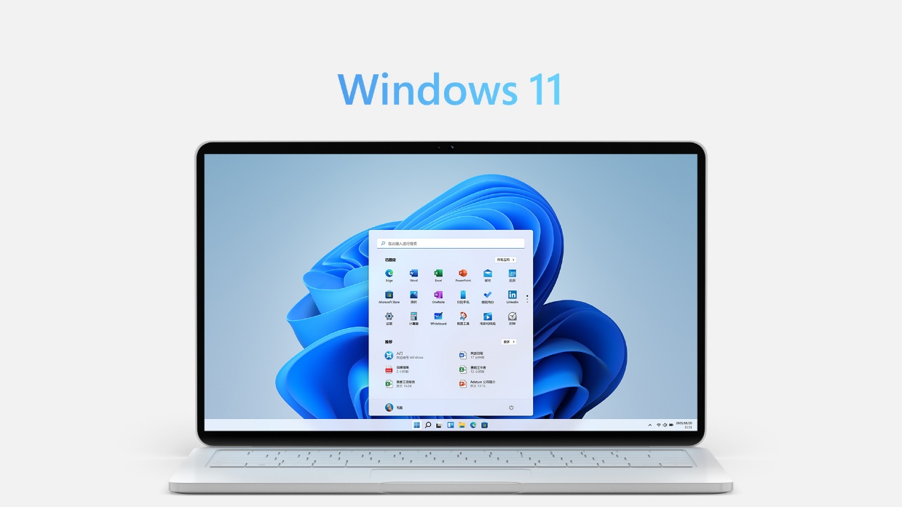

</td>
</tr>
</table>

> **課堂重點（呼應學習評量易混淆點）**：**Windows 95 是一個重要的分水嶺**——在此之前，Windows 其實只是「跑在 MS-DOS 之上的圖形化殼層程式（shell）」，本質上還是依賴 MS-DOS 作業系統；從 Windows 95 開始，Windows 才正式獨立成為一套完整的作業系統，不再需要依附 MS-DOS。

### 6-7-5　Linux

<table>
<tr>
<td width="55%">

Linux 是芬蘭程式設計師 **Linus Torvalds**（林納斯·托華茲）於 1991 年以 UNIX 為基礎所開發的作業系統，除了個人電腦，Linux 還被移植到多個平台，而在行動裝置上廣泛使用的 **Android** 作業系統也是建立在 Linux 的核心之上。

</td>
<td width="45%">

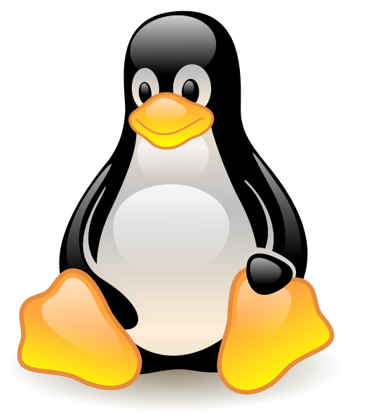
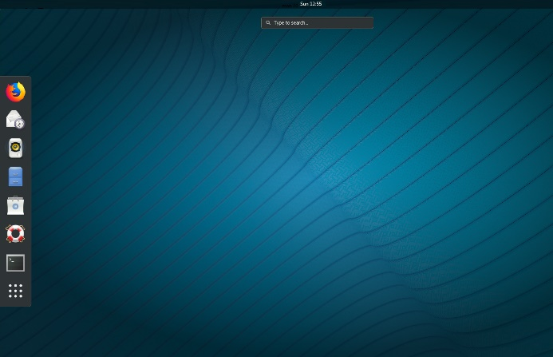

*Linux 與官方吉祥物 Tux（圖片來源：Oracle Linux、維基百科）*

</td>
</tr>
</table>

> **課堂重點（呼應學習評量第1題）**：Linux 是最知名的**開放原始碼軟體**代表之一，任何人都可以免費取得、閱讀、修改 Linux 的原始碼，這也是為什麼全世界有數不清的公司與開發者基於 Linux 核心，打造出各自的作業系統版本（發行版，distribution），例如 Ubuntu、Fedora、Debian，乃至於手機上最普及的 **Android** 系統。

### 6-7-6　行動裝置與穿戴式裝置作業系統

行動裝置與穿戴式裝置的作業系統和一般電腦不同，常見的如下：

<table>
<tr>
<td width="50%">

- iOS（Apple 手機）
- iPadOS（Apple 平板）
- watchOS（Apple Watch）
- Android（Google 陣營手機／平板）
- Wear OS（Google 陣營智慧手錶）

</td>
<td width="50%">

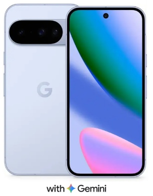
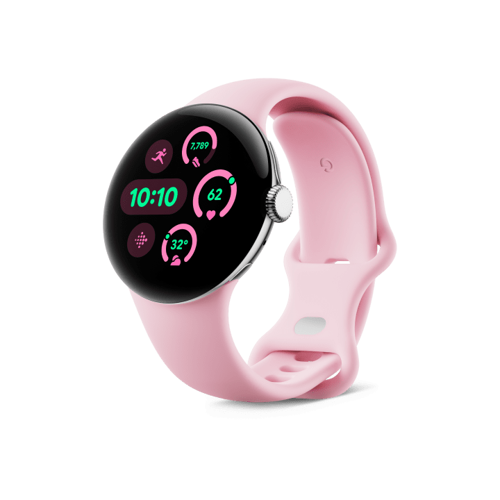

*Google Pixel 內建 AI 助理 Gemini；搭載 Wear OS 的智慧型手錶（圖片來源：Google）*

</td>
</tr>
</table>

---

## 本章總結

| 小節 | 核心觀念一句話 |
|---|---|
| 6-1 電腦軟體的類型 | 系統軟體管硬體、伺候應用軟體；應用軟體再分橫向（通用）與縱向（專用） |
| 6-2 智慧財產權與軟體授權 | 著作權自動產生不需申請，包含不可轉讓的人格權與可轉讓的財產權 |
| 6-3 開放原始碼軟體與App | 開放原始碼依然受著作權保護，只是著作人主動開放特定使用權限 |
| 6-4 認識作業系統 | 作業系統介於硬體與應用軟體之間，核心（kernel）是常駐記憶體的靈魂 |
| 6-5 作業系統的功能 | 分配資源、提供執行環境、提供使用者介面（CLI演進到GUI）三大功能 |
| 6-6 作業系統的技術 | 從單工到批次、多元程式、分時，再到多處理器、叢集、分散式的演進 |
| 6-7 知名的作業系統 | UNIX孕育出主從架構；Windows 95後才真正獨立於DOS；Linux開源孕育Android |

### 關鍵詞彙表（Glossary）

`系統軟體` `應用軟體` `橫向應用軟體` `縱向應用軟體` `智慧財產權` `著作權` `著作人格權` `著作財產權` `開放原始碼軟體` `App` `作業系統` `核心kernel` `監督程式` `命令列使用者介面CLI` `圖形化使用者介面GUI` `單工系統` `批次系統` `多元程式系統` `分時系統` `多處理器系統` `叢集式系統` `分散式系統` `即時系統` `硬即時系統` `軟即時系統` `手持式系統` `嵌入式系統` `UNIX` `主從式架構` `MS-DOS` `macOS` `Windows` `Linux` `Android` `iOS` `watchOS` `Wear OS`
## 第 6 章　學習評量

> 以下為課本第 6 章隨附之官方學習評量，題目逐字謄錄。答案為課本官方解答，並在其下補充**完整解說**，方便課堂上直接點開講解、對答案。

### 一、選擇題

**1. 下列何者不屬於開放原始碼軟體？**
A. Linux　B. MySQL　C. AutoCAD　D. Python

▶ 參考答案與解說

**答案：C　AutoCAD**

AutoCAD 是 Autodesk 公司開發的商業繪圖軟體，原始碼並未公開，屬於閉源（proprietary）軟體，使用者須付費取得授權才能使用。Linux（作業系統核心）、MySQL（資料庫）、Python（程式語言）都是知名的開放原始碼軟體，任何人都能免費取得、使用、修改與共享其原始碼。

---

**2. 下列何者通常會被歸類為系統軟體？**
A. ChatGPT　B. Midjourney　C. UNIX　D. 診療系統

▶ 參考答案與解說

**答案：C　UNIX**

UNIX 是一套作業系統，作業系統正是系統軟體最核心的代表。ChatGPT、Midjourney 是生成式 AI 應用工具；診療系統是醫療院所使用的縱向應用軟體，三者皆屬於應用軟體，並非系統軟體。

---

**3. 下列何者屬於雲端軟體服務？**
A. PowerPoint　B. Google Colab　C. Visual Studio　D. Anaconda

▶ 參考答案與解說

**答案：B　Google Colab**

Google Colab 是完全在瀏覽器中透過雲端運行的 Python 開發環境，不需要在本機安裝任何程式，屬於雲端軟體服務（SaaS）。PowerPoint、Visual Studio、Anaconda 則都是必須先安裝在本機電腦上才能使用的傳統桌面應用軟體。

---

**4. 下列何者不是個人電腦的作業系統？**
A. Windows　B. Linux　C. macOS　D. Android

▶ 參考答案與解說

**答案：D　Android**

Android 是專為智慧型手機、平板電腦等行動裝置設計的作業系統，屬於本章 6-6-8 節「手持式系統」的範疇。Windows、Linux、macOS 則都是設計來運行在個人電腦（桌上型電腦、筆記型電腦）上的作業系統。

---

**5. 下列何者採取命令列使用者介面？**
A. iOS　B. MS-DOS　C. Linux　D. Wear OS

▶ 參考答案與解說

**答案：B　MS-DOS**

MS-DOS 從設計之初就採用命令列使用者介面（CLI），使用者必須透過鍵盤輸入指定的指令集才能操作電腦，本身並未內建圖形化介面。iOS、Wear OS 是行動裝置與穿戴式裝置採用的圖形化觸控介面系統；Linux 雖然核心可以純用 CLI 操作，但目前主流的桌面發行版通常預設搭載圖形化使用者介面，因此本題以「典型、原始設計即為命令列介面」的 MS-DOS 為標準答案。

---

**6. 在一部僅有一個 CPU 的電腦中，為了讓不同的使用者可以同時執行各自的程式，必須採取下列哪種技術，才能讓每個使用者覺得電腦持續為其程式進行運算？**
A. 分散式系統　B. 管理系統　C. 平行系統　D. 分時系統

▶ 參考答案與解說

**答案：D　分時系統**

分時系統把 CPU 的時間切割成極短的時間片段，輪流分配給每一位使用者的工作，因為切換速度極快，每位使用者幾乎感覺不到自己是在「輪流」使用同一顆 CPU，誤以為電腦是自己獨佔的——這正是本題「僅有一個 CPU、卻要讓多位使用者都覺得電腦持續為自己運算」情境的標準解法。平行系統（多處理器）需要多顆 CPU，與題目「僅有一個 CPU」的前提矛盾；分散式系統則是把工作拆給多部電腦，同樣不符合單一 CPU 的情境。

---

**7. 下列何者不在著作權法的保護範圍內？**
A. 美術創作　B. 電腦程式　C. 建築著作　D. 政府公文

▶ 參考答案與解說

**答案：D　政府公文**

依照著作權法的規定，**政府機關製作的公文、法令、依法舉行的各類考試試題**等具有公共性質的文件，通常不受著作權法保護，目的是讓大眾能夠自由取得、傳播這些攸關公共事務的資訊。美術創作、電腦程式、建築著作則都是著作權法明文保護的著作類型。

---

**8. 下列何者可能構成侵權行為？**
A. 複製購買的軟體作為備份　B. 使用創用 CC 授權作品設計網頁　C. 複製購買的音樂轉賣同學　D. 複製開放原始碼軟體送給同學

▶ 參考答案與解說

**答案：C　複製購買的音樂轉賣同學**

未經著作財產權人（通常是唱片公司或音樂創作者）同意，擅自複製並「轉賣」音樂作品給他人，已經超出個人合理使用的範圍，構成侵犯重製權與散布權的行為。選項 A 為個人合理使用範圍內的備份，通常是被允許的；選項 B 創用 CC（Creative Commons）授權作品，本來就允許他人在授權條款範圍內使用；選項 D 開放原始碼軟體的授權精神本來就鼓勵自由分享，複製送給同學並不構成侵權。

---

**9. 下列關於應用軟體的敘述何者錯誤？**
A. 可以協助使用者解決問題　B. 主要負責分配系統資源　C. Illustrator 屬於向量繪圖軟體　D. Photoshop 屬於影像處理軟體

▶ 參考答案與解說

**答案：B（此為錯誤敘述）**

**「分配系統資源」是作業系統（系統軟體）的核心工作**，不是應用軟體的職責，應用軟體的定位是「針對特定事務或工作所撰寫、協助使用者解決問題」的程式，選項 A 才是應用軟體真正的定義。選項 C、D 分別正確描述了 Illustrator（向量繪圖）與 Photoshop（點陣影像處理）這兩款知名應用軟體的性質。

---

**10. 下列何者不是作業系統的功能？**
A. 儲存資料　B. 提供執行應用軟體的環境　C. 分配系統資源　D. 提供使用者介面

▶ 參考答案與解說

**答案：A　儲存資料**

依 6-5 節定義，作業系統的三大主要功能是**分配系統資源、提供執行應用軟體的環境、提供使用者介面**。「儲存資料」本身是儲存裝置與檔案系統負責的工作範疇，並非作業系統對外定義的核心功能項目之一。

---

**11. 下列何者是電腦升級到新版作業系統時最有可能發生的風險？**
A. 感染電腦病毒　B. 螢幕的相容性　C. 電腦硬體損壞　D. 應用軟體的相容性

▶ 參考答案與解說

**答案：D　應用軟體的相容性**

作業系統升級後，內部的系統架構、函式庫或介面規格可能有所變動，導致原本在舊版作業系統上運作正常的應用軟體，在新版作業系統上發生無法執行或運作異常的情況，這是作業系統升級時最常見、也最實際的風險。感染病毒、硬體損壞、螢幕相容性則與「作業系統升級」這個動作本身沒有直接、必然的因果關係。

---

**12. 下列關於作業系統的敘述何者錯誤？**
A. OS 負責管理 CPU 的使用　B. OS 包含硬體驅動程式　C. OS 負責管理記憶體的使用　D. 諸如 Word 等應用程式是 OS 的一部分

▶ 參考答案與解說

**答案：D（此為錯誤敘述）**

Word 是一套獨立的**應用軟體**，用來協助使用者進行文書處理，它是安裝在作業系統之上、透過作業系統提供的環境來運行的程式，**並不屬於作業系統本身的一部分**。選項 A、B、C 描述的管理 CPU、包含硬體驅動程式、管理記憶體，都是作業系統確實負責的核心工作。

---

**13. 下列關於編譯程式的敘述何者正確？**
A. 將高階語言程式翻譯成機器指令　B. 處理基本的輸入/輸出動作　C. 配置系統資源使之有效率的運作　D. 將符號表示的程式轉換成二進位

▶ 參考答案與解說

**答案：A**

編譯程式（compiler）的核心定義，就是把程式設計人員用高階語言（如 C、Java、Python）撰寫的原始碼，翻譯成 CPU 能夠直接執行的機器指令。選項 B、C 描述的分別是輸入輸出介面與作業系統資源分配的工作，並非編譯程式的職責；選項 D「將符號表示的程式轉換成二進位」比較接近組譯器（assembler，把組合語言翻譯成機器碼）的工作，與編譯高階語言的定義不完全相同，因此本題最精確的答案是 A。

---

**14. 下列敘述何者錯誤？**
A. 分散式系統的 CPU 排程演算法比一般的作業系統簡單　B. 即時系統通常應用於非常重視回應時間的系統　C. 單工系統一次只能服務一位使用者　D. 多處理器系統能夠增加工作量、提升效能

▶ 參考答案與解說

**答案：A（此為錯誤敘述）**

分散式系統需要協調**多部彼此獨立、透過網路連接**的電腦共同完成一個工作，必須處理網路延遲、節點故障容錯、資料同步等額外的複雜問題，因此其排程與資源協調機制，通常會比運行在單一機器上的一般作業系統**更加複雜**，而不是更簡單。選項 B、C、D 的敘述皆正確，分別對應即時系統、單工系統、多處理器系統的正確定義。

---

**15. 下列敘述何者正確？**
A. 作業系統的殼層指的是使用者介面　B. 手持式系統並不需要加入無線通訊的技術　C. 分時系統是透過網路連結多部電腦來執行工作　D. 由於記憶體很便宜，所以手持式系統無須考慮到有效管理記憶體

▶ 參考答案與解說

**答案：A**

作業系統的「殼層（shell）」概念上正是指介於使用者與作業系統核心（kernel）之間、負責接收與解讀使用者操作的介面層，因此選項 A 正確。選項 B 錯誤：手持式系統（智慧型手機等）恰恰非常需要無線通訊技術（Wi-Fi、藍牙、行動網路），這是其核心應用場景之一。選項 C 錯誤：透過網路連結多部電腦執行工作，是**分散式系統**的定義，並非分時系統（分時系統是在單一 CPU 上切割時間片段輪流服務多個工作）。選項 D 錯誤：手持式裝置受限於體積與電池續航，記憶體資源依然相對有限，有效管理記憶體、降低耗電，仍是手持式系統設計上非常重要的考量。

---

**16. 下列關於著作權的敘述何者正確？**
A. 學校只要購買一套電腦軟體，就可以安裝在電腦教室的每部電腦　B. 在合法使用他人已公開發表的著作時，應標示著作人出處　C. 高普考的考題是有著作權的，不得隨意使用　D. 著作人需要為自己的著作申請著作權，否則視同放棄

▶ 參考答案與解說

**答案：B**

在合法使用（例如合理使用範圍內引用）他人已公開發表的著作時，依照著作人格權中的「姓名表示權」精神，應該標示著作人出處，這是對創作者最基本的尊重，敘述正確。選項 A 錯誤：軟體授權通常會明確限制可安裝的電腦數量（例如單機授權、若干台授權），並非「買一套就能裝滿整間教室」，需要視實際授權合約條款而定，任意大量安裝可能構成侵權。選項 C 錯誤：依法舉行的各類考試試題（包括高普考）通常**不受著作權法保護**，屬於前面第 7 題所提到的例外情形。選項 D 錯誤：著作權是**創作完成當下就自動產生**，不需要另外申請登記，這與需要提出申請、經過審查的專利權不同。

### 二、簡答題

**1. 簡單說明何謂系統軟體並舉出三個實例。**

▶ 參考答案

系統軟體（system software）是支援電腦運作的程式，包括作業系統、公用程式和程式開發工具。實例（任舉三項）：**Windows（作業系統）、防毒軟體（公用程式）、壓縮軟體（公用程式）、Visual Studio（程式開發工具）**等。

---

**2. 簡單說明何謂應用軟體並舉出三個實例。**

▶ 參考答案

應用軟體（application software）是針對特定事務或工作所撰寫的程式，目的是協助使用者解決問題。依設計目的可分為橫向應用軟體（通用型，如文書處理、簡報軟體）與縱向應用軟體（特定產業專用，如醫院病歷系統）。實例（任舉三項）：**Word（文書處理）、Excel（試算表）、Photoshop（影像處理）、Illustrator（向量繪圖）**等。

---

**3. 簡單說明何謂作業系統並舉出三個實例。**

▶ 參考答案

作業系統（OS，operating system）是介於電腦硬體與應用軟體之間的程式，負責分配系統資源（CPU、記憶體、磁碟、輸入/輸出等）、提供執行應用軟體的環境，以及提供使用者介面。實例（任舉三項）：**Windows、macOS、Linux、UNIX、Android、iOS**等。

---

**4. 簡單說明何謂開放原始碼軟體並舉出三個實例。**

▶ 參考答案

開放原始碼軟體（open source software）是任何人都能夠免費取得、使用、修改與共享（以修改或未修改的形式）的軟體，由多人共同開發，並在遵循開放原始碼定義（open source definition）的授權下散布。實例（任舉三項）：**Linux、MySQL、Python、LibreOffice**等。

---

**5. 舉出智慧型手機所使用的作業系統兩種，並加以簡單說明。**

▶ 參考答案

- **iOS**：由 Apple 公司開發，專用於 iPhone 智慧型手機的作業系統，強調與 Apple 自家生態系（如 iPad、Mac、Apple Watch）的整合體驗，系統較為封閉，僅能安裝經過 App Store 審核的應用程式。
- **Android**：由 Google 主導開發、以 Linux 核心為基礎的開放原始碼行動作業系統，被全球眾多手機品牌（如 Samsung、Google Pixel、小米等）採用，相較 iOS 更為開放，使用者能有較高的系統客製化彈性。

---

*本講義圖片素材取自《最新計算機概論》第十二版 第 6 章 原版簡報，內文為教學擴寫版本；學習評量題目依課本原文謄錄，答案在課本官方解答基礎上，補齊完整解說（含官方原本僅標示「參閱本書第6章」的簡答題完整內容），僅供授課教師課堂講解使用。*
