# 第 7 章　電腦網路與無線通訊

> 本講義以《最新計算機概論》第十二版 第 7 章 PPT 的架構為骨架，重新撰寫為適合課堂詳細講解的完整教學文字稿。圖片素材取自原簡報；內文除大幅擴寫解說外，特別針對「OSI 七層模型」「各種網路設備的分工」等抽象概念補充了具體生活類比，方便課堂講解。

## 本章學習地圖

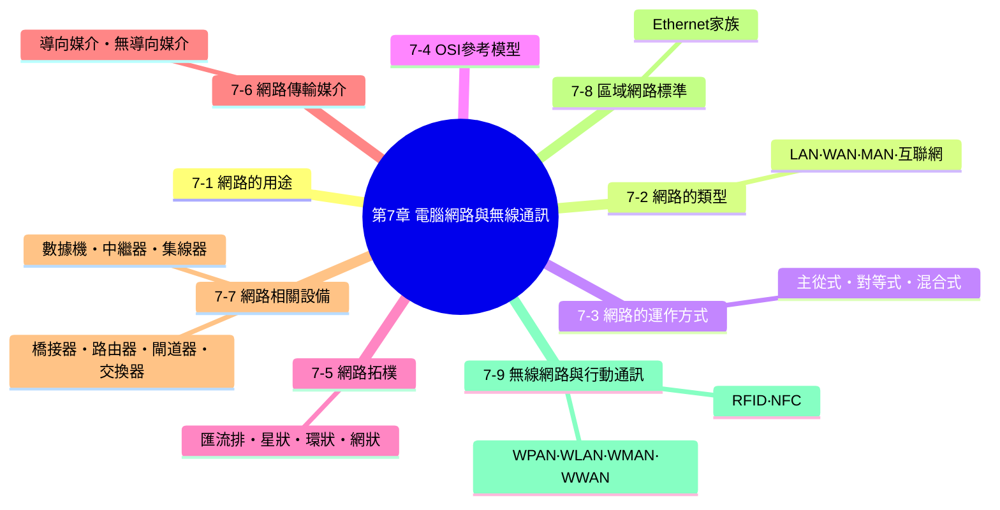
```mermaid
mindmap
  root((第7章 電腦網路與無線通訊))
    7-1 網路的用途
    7-2 網路的類型
      LAN‧WAN‧MAN‧互聯網
    7-3 網路的運作方式
      主從式‧對等式‧混合式
    7-4 OSI參考模型
    7-5 網路拓樸
      匯流排‧星狀‧環狀‧網狀
    7-6 網路傳輸媒介
      導向媒介‧無導向媒介
    7-7 網路相關設備
      數據機‧中繼器‧集線器
      橋接器‧路由器‧閘道器‧交換器
    7-8 區域網路標準
      Ethernet家族
    7-9 無線網路與行動通訊
      WPAN‧WLAN‧WMAN‧WWAN
      RFID‧NFC
```

**這一章要帶學生建立的核心概念：**

1. 網路的分類看似名詞很多（LAN、WAN、MAN、WPAN、WLAN…），但其實背後只有一條簡單的分類邏輯：**依照「涵蓋範圍的大小」由小到大排列**，理解這條主軸，就不會被一堆縮寫搞混。
2. **OSI 七層模型**是這一章最抽象、但也最重要的觀念——它把「兩台電腦如何互相溝通」這件複雜的事，拆解成七個各司其職的層次，這種「分層負責」的設計思維，也是整個網際網路能夠穩定運作的關鎮。
3. 網路設備（中繼器、集線器、橋接器、路由器、閘道器、交換器）常常讓學生傻傻分不清楚，這一章會用「各自負責在 OSI 模型的哪一層工作」這條主軸，把它們的功能差異梳理清楚。

---

## 7-1　網路的用途

**網路（network）** 指的是將多部電腦或周邊裝置透過纜線或無線傳輸媒介連接在一起，以達到資源分享的目的：

*圖片來源：ASUS*

常見的用途如下：

- **硬體共用**：多部電腦可以共用同一台印表機、掃描器等周邊設備，不需要每台電腦都各自添購一套。
- **資料分享**：透過網路，檔案、資料庫可以在不同電腦之間快速傳遞與共用。
- **提高可靠度**：資料可以備份到網路上的多個地點，即使其中一部電腦故障，資料仍然可以從其他地方復原。
- **訊息傳遞與交換**：電子郵件、即時通訊、視訊會議等，都是建立在網路基礎上的溝通方式。

---

## 7-2　網路的類型

原則上，只要是將超過一部的電腦連接在一起就能形成網路。我們通常會根據電腦所在的**範圍**，將網路分為區域網路、廣域網路、都會網路、互聯網等類型：

<table>
<tr>
<td width="50%">

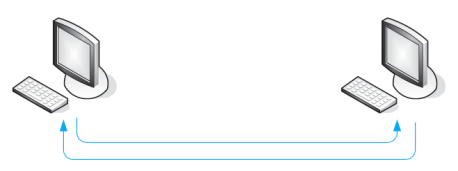
*連接兩部短距離的電腦*

</td>
<td width="50%">

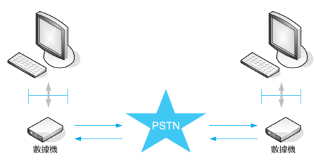
*連接兩部長距離的電腦*

</td>
</tr>
</table>

### 區域網路（LAN，Local Area Network）

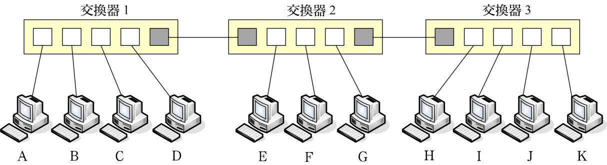

當電腦的數目不只一部，而且所在的位置可能是**同一棟建築物的不同辦公室或不同建築物、同一個公司或同一個學校內**的不同建築物，那麼將這些電腦連接在一起所形成的網路，就叫做區域網路。**校園網路**通常就屬於區域網路。

### 廣域網路（WAN，Wide Area Network）

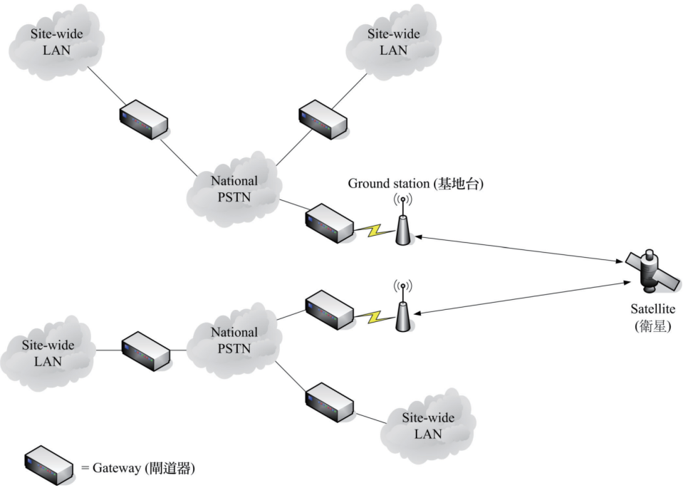

當電腦的數目不只一部，而且所在的位置可能在**不同城鎮、不同國家甚至不同洲**，例如一個公司在不同國家有分公司，那麼將這些電腦連接在一起所形成的網路，就叫做廣域網路。**連接跨國企業各個分公司的網路**通常就屬於廣域網路。

### 都會網路（MAN，Metropolitan Area Network）

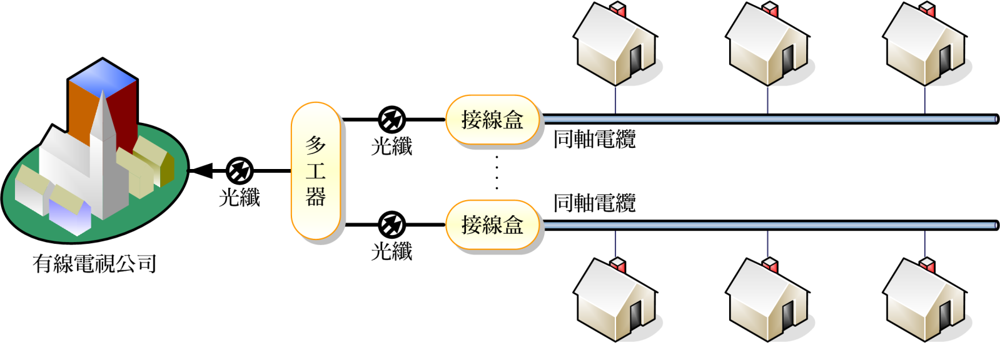

都會網路涵蓋的範圍大小介於 LAN 與 WAN 之間，使用與 LAN 類似的技術連接位於不同辦公室或城鎮的電腦。

### 互聯網（Internetwork）

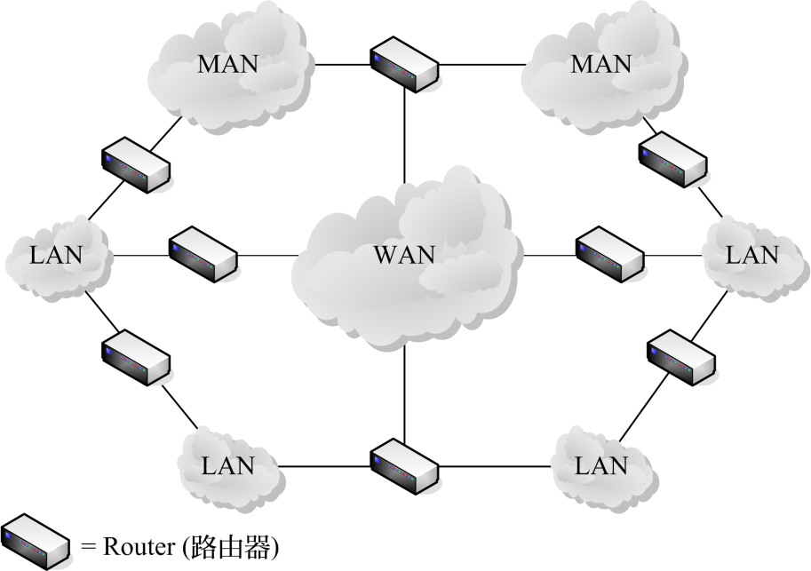

當有兩個或多個網路連接在一起時，便形成了所謂的**互聯網（internetwork）**，簡稱為 internet，例如數個 LAN 連接在一起。

> **課堂重點提醒（常考易混淆點）**：請特別留意，**internet（小寫字首 i）**和 **Internet（大寫字首 I）**的意義是不同的——前者泛指「相互連接的網路」這個一般性概念，後者則專指我們平常說的「網際網路」這個全世界獨一無二、由眾多網路互聯而成的特定網路。

> **課堂記憶技巧：LAN／MAN／WAN 範圍比較**——可以用「一間學校 < 一整座城市 < 橫跨國家或洲」的直覺順序來記憶三者的涵蓋範圍：**LAN（校園網路）< MAN（都會網路）< WAN（跨國企業網路）**，這正好呼應本章學習評量第 2、3 題的判斷依據。

---

## 7-3　網路的運作方式

網路的運作方式主要有下列幾種：

<table>
<tr>
<td width="50%">

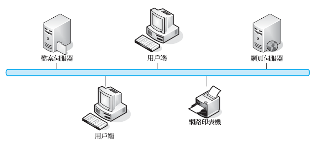
*主從式網路*

</td>
<td width="50%">

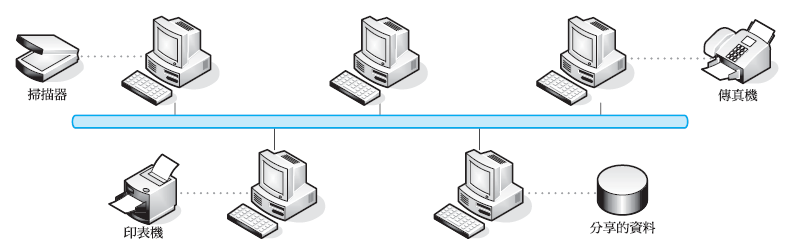
*對等式網路*

</td>
</tr>
</table>

### 主從式網路（Client-Server Network）

多數網路屬於主從式網路，也就是有一或多部電腦專門負責管理檔案、使用者、列印/傳真、電子郵件、網頁快取等資源並提供服務給其它電腦（**伺服器**），其餘電腦則作為請求服務的一方（**用戶端**）。

- **優點**：集中管理，安全控管較佳，方便統一備份與維護。
- **缺點**：伺服器一旦當機，會影響整個網路的運作（單點故障）。

### 對等式網路（Peer-to-Peer Network）

對等式網路的每部電腦的地位均相同，沒有伺服器與用戶端之分，使用者可以自行管理電腦、決定要開放哪些資源給其它電腦分享。

- **優點**：不需要專用伺服器，架設成本較低，適合小型網路。
- **缺點**：缺乏集中管理，安全控管相對較弱，資源分散在各台電腦上，維護較不方便。

### 混合式網路

在實際應用上，多數網路屬於混合式網路，也就是混合了主從式網路與對等式網路的運作方式——例如公司內部可能有專門的檔案伺服器（主從式），但同事之間又能直接互相分享資料夾（對等式）。

> **課堂重點（呼應學習評量第 4 題）**：主從式網路的伺服器如果當機，**確實會影響整個網路的運作**（例如檔案伺服器當機，所有人都無法存取共用檔案），這正是主從式網路「單點故障」的風險所在，不能誤以為「伺服器當機不會影響整體」。

---

## 7-4　OSI 參考模型

**OSI 參考模型（Open Systems Interconnection Reference Model）** 是國際標準組織制定的一套網路通訊標準，把兩台電腦之間複雜的通訊過程，拆解成七個各自獨立、但又緊密合作的**層次**：

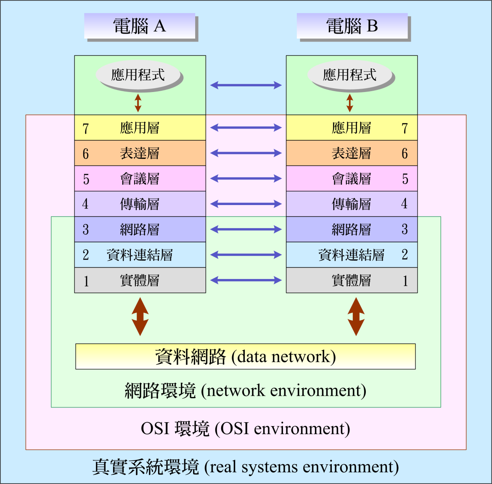

| 層次 | 名稱 | 主要工作 |
|---|---|---|
| 7 | **應用層**（Application Layer） | 提供應用程式使用網路服務的介面，例如瀏覽器、電子郵件用戶端 |
| 6 | **表達層**（Presentation Layer） | 負責資料格式的轉換、加密解密、壓縮解壓縮 |
| 5 | **會議層**（Session Layer） | 負責建立、管理、結束兩台電腦之間的連線會談 |
| 4 | **傳輸層**（Transport Layer） | 負責端對端的可靠傳輸，確保資料完整送達（例如 TCP 協定） |
| 3 | **網路層**（Network Layer） | 負責封包的定址與選擇傳送路徑（routing），例如 IP 協定 |
| 2 | **資料連結層**（Data Link Layer） | 負責在實體媒介上，把資料組成訊框（frame）並偵測傳輸錯誤 |
| 1 | **實體層**（Physical Layer） | 負責實際的訊號傳輸，定義傳輸媒介、訊號編碼方式、網路拓樸等硬體規格 |

> **課堂比喻**：OSI 七層模型很像「寄一封跨國掛號信」的完整流程——你（應用層）寫好信件內容；郵局把信件翻譯成標準格式、蓋郵戳（表達層）；建立起投遞這封信的「委託關係」（會議層）；確保信件完整送達、遺失了會重寄（傳輸層）；決定信件要經過哪些轉運站、選擇路線（網路層）；把信件裝進符合規格的貨櫃、途中發現包裝破損要處理（資料連結層）；最後由實際的飛機、卡車運送（實體層）。**每一層只需要專心做好自己的工作，不需要知道其他層在做什麼**，這種分層負責的設計，正是 OSI 模型最重要的精神，也讓不同廠商的軟硬體設備能夠依照共同標準彼此相容。

> **課堂重點（呼應學習評量第 5、6、13 題）**：
> - 判斷「某個軟體或技術屬於哪一層」的訣竅是問自己：**這個東西是在處理『訊號本身』，還是在處理『使用者看得懂的內容』？** 愈靠近實體層，處理的東西愈接近電子訊號、位元流；愈靠近應用層，處理的東西愈接近人類看得懂的內容。例如瀏覽器（Safari、Chrome）這類讓使用者直接操作的軟體，屬於**應用層**；而 HTTP（網頁瀏覽的通訊協定）也是應用層的協定。
> - **實體層的工作是定義訊號編碼方式、傳輸媒介、網路拓樸**等硬體規格，並不負責定義任何一種「通訊協定」的具體內容（例如 TCP 通訊協定的定義，是更高層次——傳輸層——的工作，不是實體層的工作）。

---

## 7-5　網路拓樸

網路通常會包含兩部以上的電腦，而電腦之間是如何連接成網路則有數種方式，我們將這些方式統稱為**拓樸（topology）**，常見的拓樸如下：

### 匯流排拓樸（Bus Topology）

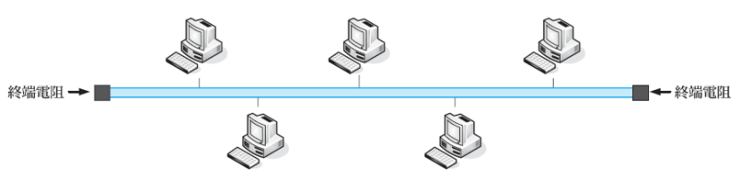

在匯流排拓樸中，所有電腦是連接到同一條網路線，而資料就是在這條網路線上傳送。

- **優點**：佈線簡單、成本低廉。
- **缺點**：**容易產生碰撞**（多台電腦同時傳送資料時容易互相干擾）；主幹線故障會導致整個網路癱瘓。

### 星狀拓樸（Star Topology）

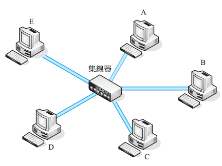

在星狀拓樸中，所有電腦必須連接到**集線器（hub）**。

- **優點**：某一部電腦或某條連線故障，不會影響其他電腦的正常運作，容易安裝與擴充。
- **缺點**：集線器一旦故障，會導致整個網路癱瘓（集中化的單點故障風險）。

### 環狀拓樸（Ring Topology）

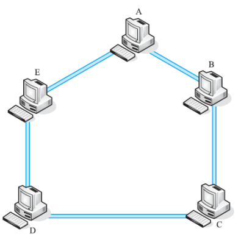

在環狀拓樸中，所有電腦是以環狀方式連接在一起，第一部電腦連接到第二部電腦，第二部電腦連接到第三部電腦……最後一部電腦再連接到第一部電腦。

- **缺點**：任何一部電腦或任一段網路線故障，都可能導致整個網路癱瘓（除非有備援環路）。

### 網狀拓樸（Mesh Topology）

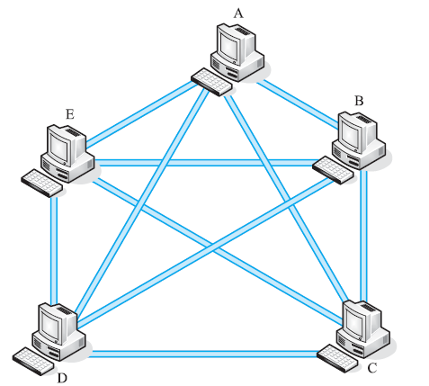

在網狀拓樸中，所有電腦之間互相都有網路線連接，**不會因為任何一部電腦故障或網路線上任何一段線路故障而導致網路癱瘓**。

- **優點**：**容錯能力最好**，任一節點或連線故障，資料仍可透過其他路徑傳遞。
- **缺點**：佈線最複雜、成本最高（因為需要的纜線數量隨節點數量呈平方成長）。

> **課堂總結比較表（呼應學習評量第 8 題）**：

| 拓樸 | 容錯能力 | 佈線與安裝難度 | 纜線用量 | 容易碰撞 |
|---|---|---|---|---|
| 匯流排 | 差（主幹斷裂則全毀） | 簡單 | 最少 | 是（因為所有電腦共用同一條線） |
| 星狀 | 中（集線器是單點故障） | 容易安裝與擴充 | 中等 | 否 |
| 環狀 | 差（除非有備援環） | 中等 | 中等 | 否 |
| 網狀 | **最好** | 最複雜 | 最多 | 否 |

> **課堂記憶技巧**：這張表正是本章學習評量第 8 題「下列關於各種拓樸的敘述何者正確」的完整命題依據——**「網狀拓樸的容錯能力最好」**、**「星狀拓樸容易安裝」**、**「匯流排拓樸容易產生碰撞」**這三句話務必請學生背熟，同時要澄清常見的錯誤敘述：「網狀拓撲使用的纜線最少」是錯的（網狀拓樸恰好是纜線用量**最多**的拓樸）。

## 7-6　網路傳輸媒介

我們可以將傳輸媒介歸納為下列兩種類型：

### 導向媒介（Directed Media）

導向媒介是提供一條有實體限制的路徑給訊號，包括**雙絞線、同軸電纜及光纖**。

<table>
<tr>
<td width="50%">

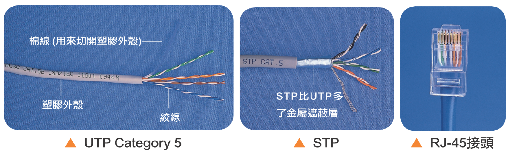

</td>
<td width="50%">

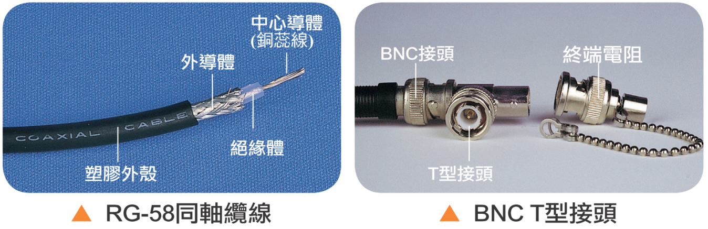

</td>
</tr>
</table>

**雙絞線（twisted pair）** 是由多對外覆絕緣材料的實心銅芯線扭紋而成，目的在於減少電磁干擾，電話線即其中一種，又分為下列兩種類型：

- **UTP**（Unshield Twisted-Pair，無遮蔽雙絞線）：成本較低，但抗干擾能力較弱，是一般家用網路線最常見的類型。
- **STP**（Shield Twisted-Pair，遮蔽式雙絞線）：多了一層金屬遮蔽網，抗干擾能力較好，但成本較高。

**同軸電纜（coaxial cable）** 可以傳輸影像與聲音，傳輸速率為 10Mbps，有線電視所使用的纜線就是其中一種。

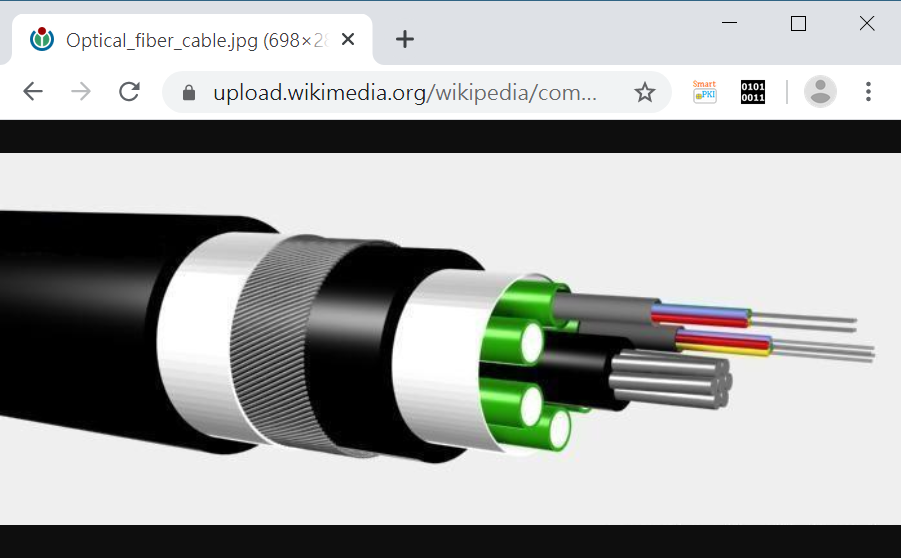
*圖片來源：維基百科*

**光纖（optical fiber）** 是透過玻璃或塑膠纖線以光波的形式傳送訊號，傳輸速率高達數十 Gbps，傳輸距離長達數十公里。

> **課堂重點（呼應學習評量第 9 題）**：光纖的優點是**傳輸速率快、傳輸距離長、不受電磁干擾**（因為傳遞的是光訊號而非電訊號），但**安裝需要專業技術、成本較高**——這也是為什麼光纖普及到一般家庭的速度，比銅線類的媒介慢上許多，需要專業施工人員精準熔接光纖線路。

### 無導向媒介（Undirected Media）

無導向媒介不需要實體媒介，而是透過開放空間以電磁波的形式傳送訊號，包括**無線電（radio）、微波（microwave）及紅外線（infrared）**。

<table>
<tr>
<td width="45%">

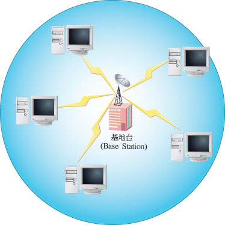

</td>
<td width="55%">

**無線電（radio）** 是頻率介於 3KHz～300GHz 的電磁波，通常是全向性的，適合群播（一對多通訊），優點是收訊端無須對準發訊端、能夠穿透障礙物，缺點則是容易洩密及受到干擾。

</td>
</tr>
</table>

<table>
<tr>
<td width="45%">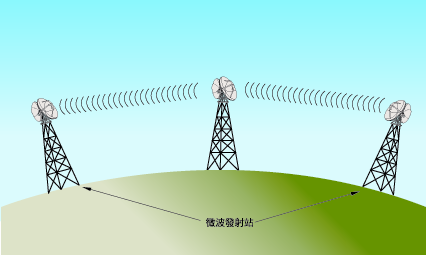 <i>地面微波（terrestrial microwave）</i></td>
<td width="45%">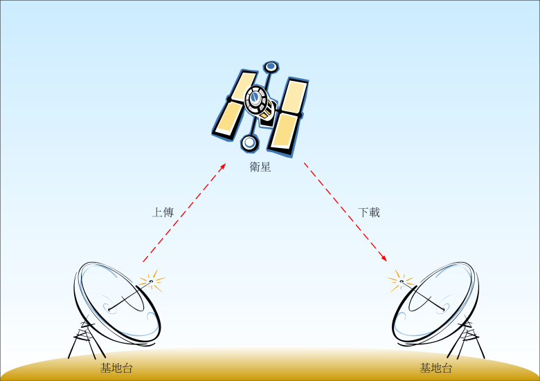 <i>衛星微波（satellite microwave）</i></td>
</tr>
</table>

**微波（microwave）** 是頻率介於 300MHz～300GHz 的電磁波，又分為兩種類型：地面微波（透過地面基地台傳送）與衛星微波（透過人造衛星轉發）。

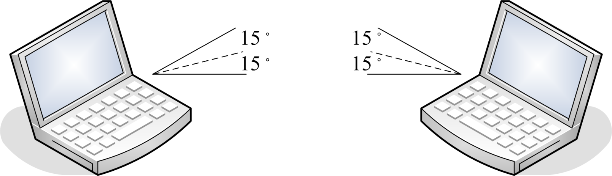

**紅外線（infrared）** 是頻率介於 300GHz～400THz 的電磁波，**無法穿透障礙物**，會受到障礙物阻隔或光源干擾，但不會受到電磁干擾。紅外線的傳輸標準有下列兩種：**IrDA Date、IrDA Control**。

> **課堂總結比較（呼應學習評量第 11 題）**：無線電、微波、紅外線都屬於無導向媒介，但**光纖屬於導向媒介**（需要實體纖線傳遞光訊號），這是本章學習評量第 11 題「下列何者不屬於無線網路的傳輸媒介」的判斷關鍵——光纖雖然傳遞的是光訊號，但仍然需要「一條實體纖線」做為路徑，本質上與無線傳輸的「開放空間、無實體路徑限制」定義不同。

---

## 7-7　網路相關設備

這一節介紹的設備，最適合用「各自在 OSI 模型的哪一層工作、負責解決什麼問題」這條主軸來記憶，避免死背定義：

<table>
<tr>
<td width="50%">

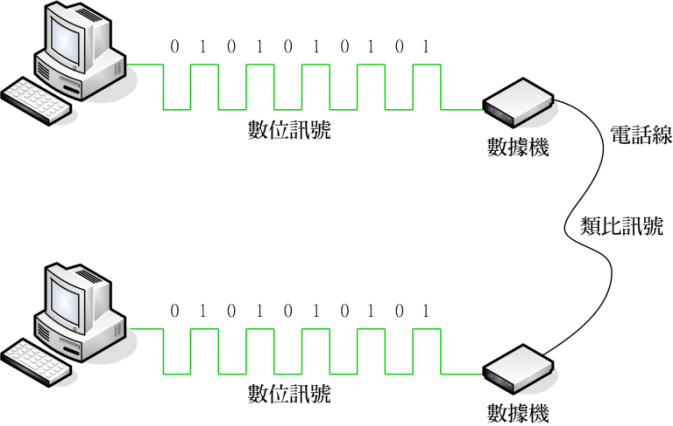

</td>
<td width="50%">

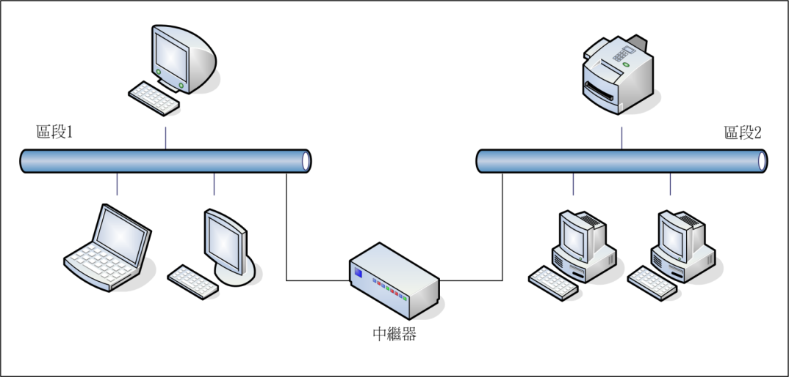

</td>
</tr>
</table>

- **數據機（modem）**：負責將數位訊號與類比訊號互相轉換（modulation/demodulation 調變與解調變），讓數位電腦訊號能夠透過類比的電話線路傳輸出去。
- **中繼器（repeater）**：功能是接收訊號，然後重新產生強度不減弱的訊號送到網路上其他地方，用來延伸網路可以到達的距離。

<table>
<tr>
<td width="50%">

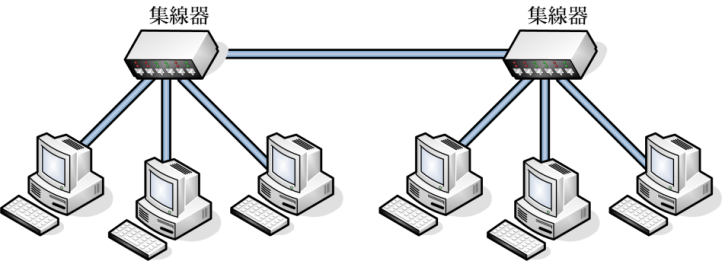

</td>
<td width="50%">

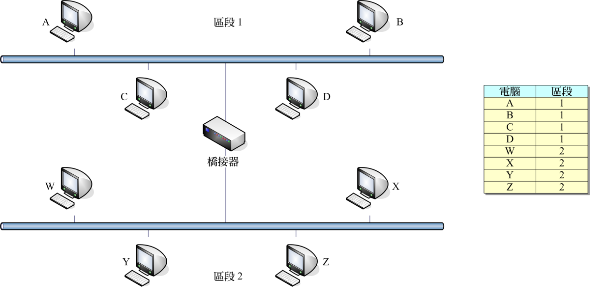

</td>
</tr>
</table>

- **集線器（hub）** 的功能是接收訊號，然後傳送到連接到集線器的所有網段，這是屬於星狀拓樸的核心設備。串接多個集線器可以擴充區域網路內的電腦數目。
- **橋接器（bridge）** 可以連接同一個網路的不同區段，並具有過濾訊框的功能——透過紀錄各個網段上有哪些設備位址，橋接器只把資料傳送到目的地真正所在的網段，藉此減少不必要的網路流量。

<table>
<tr>
<td width="50%">

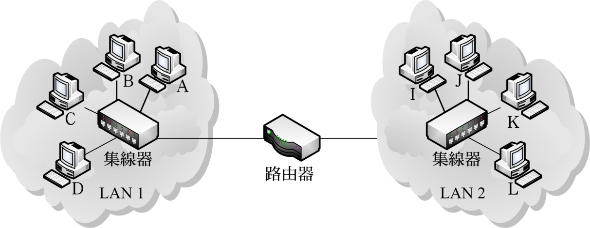

</td>
<td width="50%">

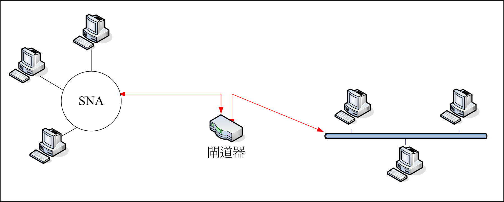

</td>
</tr>
</table>

- **路由器（router）** 可以連接多個區域網路或廣域網路以形成一個互聯網，負責在複雜的網路拓樸中，選擇最有效率的路徑，把封包一步步轉送到目的地。
- **閘道器（gateway）** 可以連接不同的網路，而且能夠轉換不同的通訊協定，讓原本使用不同「語言」（協定）的網路能夠互相溝通——這是閘道器與路由器最大的差異：路由器連接的網路通常使用**相同**的通訊協定，閘道器則專門處理**不同**通訊協定之間的轉換。

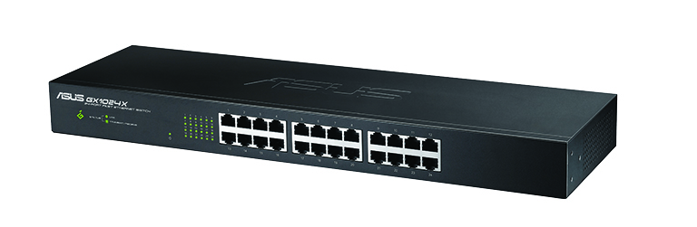
*圖片來源：ASUS*

**交換器（switch）** 又分為下列兩種類型：

- **第二層交換器（layer 2 switch）**：相當於具有橋接器功能的集線器，只會將資料傳送給指定的電腦（而非像集線器一樣廣播給所有連接的裝置）。
- **第三層交換器（layer 3 switch）**：相當於改良型的路由器，因為是將路由器的部分功能改由硬體執行，效能比傳統的路由器好。

> **課堂總結：網路設備 OSI 分層對照表**（這張表是釐清設備功能差異最有效的方式）：

| 設備 | 對應 OSI 層次 | 核心功能 |
|---|---|---|
| 中繼器（repeater） | 實體層 | 單純放大、重新產生訊號，延伸傳輸距離 |
| 集線器（hub） | 實體層 | 多埠的中繼器，把訊號廣播給所有連接裝置 |
| 橋接器（bridge） | 資料連結層 | 過濾訊框，只轉送到正確的網段 |
| 第二層交換器 | 資料連結層 | 具橋接功能的智慧型集線器，點對點傳送 |
| 路由器（router） | 網路層 | 依 IP 位址選擇路徑，連接不同網路 |
| 第三層交換器 | 網路層 | 硬體化的路由器，效能更佳 |
| 閘道器（gateway） | 可跨越到高層 | 轉換不同通訊協定，讓異質網路能夠溝通 |

> **課堂記憶技巧（呼應學習評量第 10 題）**：這張表也直接回答了「下列哪個網路設備可以找出傳送封包的最佳路徑」這類題目——**只有路由器（以及功能相近的第三層交換器）具備「選擇路徑」的智慧**，中繼器、集線器只是單純放大訊號、橋接器只是簡單過濾，都沒有「規劃路徑」的能力。

---

## 7-8　區域網路標準

區域網路標準指的是區域網路所使用的通訊標準、傳輸媒介、傳輸速率、佈線方式等規格，其中最常見的區域網路標準就是 **Ethernet（乙太網路）**：

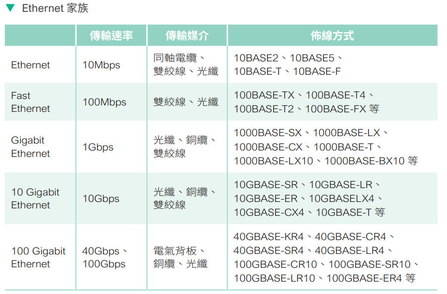

| Ethernet 家族 | 傳輸速率 | 傳輸媒介 |
|---|---|---|
| Ethernet | 10Mbps | 同軸電纜、雙絞線、光纖 |
| Fast Ethernet | 100Mbps | 雙絞線、光纖 |
| Gigabit Ethernet | 1Gbps | 光纖、銅纜、雙絞線 |
| 10 Gigabit Ethernet | 10Gbps | 光纖、銅纜、雙絞線 |
| 100 Gigabit Ethernet | 40Gbps、100Gbps | 電氣背板、銅纜、光纖 |

> **課堂重點（呼應學習評量第 12 題）**：Ethernet 是目前**最常見、最普及的區域網路標準**，幾乎所有現代區域網路（不論是學校、公司或家庭網路）都是以 Ethernet 為基礎架設的。其他選項如藍牙（無線個人網路標準）、FDDI（早期光纖環狀網路標準）、Token Ring（早期環狀網路標準，現已式微），都不是目前最主流的區域網路標準。

---

## 7-9　無線網路與行動通訊

我們可以根據無線網路所涵蓋的範圍，將之分為下列幾種類型：

```mermaid
flowchart LR
    A["無線個人網路 WPAN<br/>(數公尺)"] --> B["無線區域網路 WLAN<br/>(數十~百公尺)"]
    B --> C["無線都會網路 WMAN<br/>(整座城市)"]
    C --> D["無線廣域網路 WWAN<br/>(跨國‧全球)"]
```

### 無線個人網路（WPAN，Wireless Personal Area Network）

主要是提供小範圍的無線通訊，其標準是 **IEEE 802.15** 工作小組於 2002 年以**藍牙（Bluetooth）** 為基礎所提出的：

<table>
<tr>
<td width="45%">

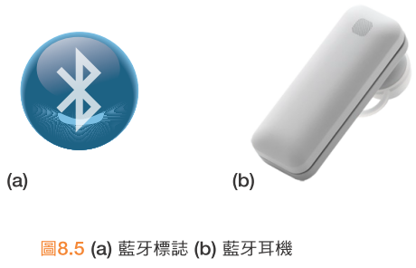

</td>
<td width="55%">

藍牙是 Bluetooth SIG 於 1999 年所提出之短距離、低速率、低功耗、低成本的無線通訊標準，使用 **2.4GHz** 頻段，可以傳送語音與數據資料。藍牙常見的應用有行動裝置的無線傳輸（例如手機免持聽筒）、電腦與周邊的無線傳輸（例如無線滑鼠）、傳統有線裝置的無線化（例如醫療儀器、遊戲機的無線搖桿）、智慧家庭與物聯網等。

除了藍牙之外，比較熱門的 WPAN 技術還有下列兩種：

- **ZigBee**：低功耗、低速率，常用於智慧家庭感測網路。
- **UWB**（Ultra Wide Band）：超寬頻技術，適合高精度室內定位與短距離高速傳輸。

</td>
</tr>
</table>

### 無線區域網路（WLAN，Wireless Local Area Network）

主要是提供範圍在數十公尺左右的無線通訊，網路的連結方式主要標準是 **IEEE 802.11** 工作小組於 1997 年所發布的 802.11，之後延伸出 802.11a、802.11b、802.11g、802.11n、802.11ac、802.11ax 等。為了讓不同廠商製造的 WLAN 所配備能夠互通，WECA 提出 **Wi-Fi 認證**：

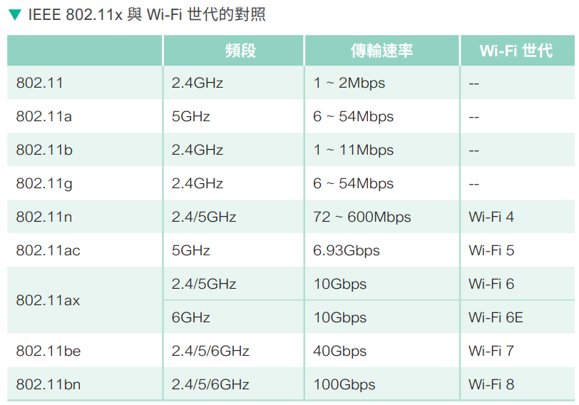

| IEEE 802.11 標準 | 頻段 | 傳輸速率 | Wi-Fi 世代 |
|---|---|---|---|
| 802.11 | 2.4GHz | 1～2Mbps | -- |
| 802.11a | 5GHz | 6～54Mbps | -- |
| 802.11b | 2.4GHz | 1～11Mbps | -- |
| 802.11g | 2.4GHz | 6～54Mbps | -- |
| 802.11n | 2.4/5GHz | 72～600Mbps | Wi-Fi 4 |
| 802.11ac | 5GHz | 6.93Gbps | Wi-Fi 5 |
| 802.11ax | 2.4/5GHz、6GHz | 10Gbps | Wi-Fi 6、Wi-Fi 6E |
| 802.11be | 2.4/5/6GHz | 40Gbps | Wi-Fi 7 |
| 802.11bn | 2.4/5/6GHz | 100Gbps | Wi-Fi 8 |

> **課堂重點**：我們平常說的「Wi-Fi 6」「Wi-Fi 7」這類世代命名，其實是從 802.11n（對應 Wi-Fi 4）才開始被賦予的親民世代編號，方便一般消費者理解與選購設備，數字愈大代表愈新的標準、傳輸速率也愈快。

### 無線都會網路（WMAN，Wireless Metropolitan Area Network）

WMAN 的標準是 IEEE 於 2002 年所提出的 **802.16**。為了研發及確保 802.16 相關產品的互通性，**WiMAX Forum** 根據 802.16 提出 WiMAX 認證，凡通過 WiMAX 認證的產品，表示能夠互通，不會發生不相容的問題。IEEE 802.16 標準包括 802.16、802.16a、802.16c、802.16d、802.16e、802.16f、802.16g、802.16m 等，其中 802.16m 於 2010 年通過並定名為 WiMAX 2，屬於 4G 行動通訊標準之一。

### 無線廣域網路（WWAN，Wireless WAN）

無線廣域網路（Wireless WAN）包括「衛星網路」和「行動通訊」，而根據所使用的技術可以分成不同的世代：

- **第一代行動通訊（1G）**：主要系統有 AMPS（Advanced Mobile Phone System）
- **第二代行動通訊（2G）**：用來傳送數位語音，主要的系統有 D-AMPS（Digital AMPS）、GSM（Global System for Mobile communication）、CDMA（Code Division Multiple Access）
- **第三代行動通訊（3G）**：用來傳送數位語音與資料，主要的系統有 WCDMA（Wideband CDMA）和 CDMA2000
- **第四代行動通訊（4G）**：用來傳送數位語音與資料，但傳輸速率比 3G 更快，主要標準有 LTE 和 LTE Advanced（LTE-A）
- **第五代行動通訊（5G）**：3GPP 於 2017 年發布 Release 13、Release 14 導入 LTE-Advanced Pro（LTE-A Pro），作為 LTE 邁向 5G 過渡技術的橋接，又稱為 4.5G，之後 3GPP 提出 5G NR（New Radio），Release 15～19 陸續發布 5G 各項標準，而 Release 20 尚在制定階段，是視為 5G-Advanced 與 6G 的橋樑。
- **第六代行動通訊（6G）**：目前 5G 之後的新一代技術，例如 3GPP 預計於 2028 年完成 Release 21 作為 6G 規格，目前商用服務則預計於 2030 年推出。

> **課堂重點（呼應學習評量第 17 題）**：由於 WLAN（Wi-Fi）多半是**短距離、高頻寬**的技術，較適合應用在資料量較大的手機行動支付這類「近距離、高速交易」場景嗎？其實不然——請留意本章學習評量第 16、17 題分別詢問「適合應用於手機行動支付」與「適合應用於無線感測網路」的不同無線通訊標準，這正是提醒學生：**不同無線通訊標準各自有其設計初衷與最適合的應用場景**，不能只看「速度快就是好」，還要考慮功耗、成本、涵蓋範圍等因素綜合判斷。

### 資訊部落：RFID

<table>
<tr>
<td width="45%">

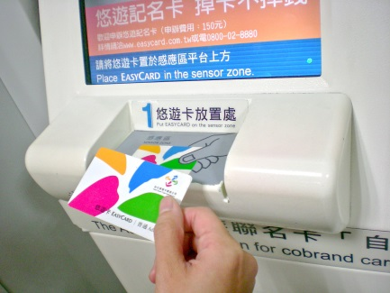

</td>
<td width="55%">

**RFID（Radio Frequency IDentification，無線射頻辨識）** 是透過無線電傳遞資料的近距離無線通訊技術，生活中有許多 RFID 的應用，例如**悠遊卡、高品的電子標籤、寵物晶片**等。

RFID 系統包含電子標籤、讀卡機與應用系統三個部分。

</td>
</tr>
</table>

> **課堂重點（呼應學習評量第 15 題）**：RFID 具有**防水、耐磁、耐高溫**的特點，這是 RFID 廣泛應用在門禁卡、物流追蹤等惡劣環境的重要原因；不過要特別澄清一個常見的誤解——**RFID 並不等於平常看見的「條碼」**，條碼是用**光學**方式讀取印刷圖案，而 RFID 是用**無線電波**傳遞資料，兩者原理完全不同，這是本章學習評量第 15 題「下列關於 RFID 的敘述何者錯誤」的核心判斷依據。

### 資訊部落：NFC

<table>
<tr>
<td width="45%">

</td>
<td width="55%">

**NFC（Near Field Communication，近距離無線通訊）** 是從 RFID 發展而來的近距離無線通訊技術，使用 13.56MHz 頻段，傳輸距離為 20 公分，傳輸速率為 106、212、424Kbps。

NFC 支援下列幾種工作模式：

- **點對點模式**
- **卡片模式**
- **讀卡機模式**

</td>
</tr>
</table>

> **課堂重點（呼應學習評量第 16 題）**：NFC 由於通訊距離極短（僅約數公分），且傳輸速度足夠快，非常適合應用於手機行動支付（例如 Apple Pay、Google Pay）這種「輕觸感應」的場景——距離短反而是優點，可以避免使用者不小心刷到旁人的裝置，同時降低被側錄側刷的資安風險。

---

## 本章總結

| 小節 | 核心觀念一句話 |
|---|---|
| 7-1 網路的用途 | 硬體共用、資料分享、提高可靠度、訊息傳遞是網路四大用途 |
| 7-2 網路的類型 | 依涵蓋範圍由小到大：LAN < MAN < WAN，多個網路互聯即互聯網 |
| 7-3 網路的運作方式 | 主從式集中管理但有單點故障風險；對等式成本低但缺乏集中管理 |
| 7-4 OSI參考模型 | 七層分層負責，愈上層愈接近使用者、愈下層愈接近實體訊號 |
| 7-5 網路拓樸 | 網狀容錯最好但佈線最貴；星狀好安裝；匯流排易碰撞 |
| 7-6 網路傳輸媒介 | 導向媒介需要實體線路(雙絞線/同軸/光纖)；無導向媒介靠電磁波 |
| 7-7 網路相關設備 | 依OSI層次分工：中繼器/集線器在實體層，橋接器/交換器在連結層，路由器在網路層 |
| 7-8 區域網路標準 | Ethernet是目前最普及的區域網路標準 |
| 7-9 無線網路與行動通訊 | WPAN<WLAN<WMAN<WWAN依範圍遞增；RFID/NFC是近距離感應技術 |

### 關鍵詞彙表（Glossary）

`網路` `硬體共用` `資料分享` `LAN` `WAN` `MAN` `互聯網internet` `Internet` `主從式網路` `對等式網路` `混合式網路` `OSI參考模型` `應用層` `表達層` `會議層` `傳輸層` `網路層` `資料連結層` `實體層` `拓樸` `匯流排拓樸` `星狀拓樸` `環狀拓樸` `網狀拓樸` `導向媒介` `無導向媒介` `雙絞線UTP` `STP` `同軸電纜` `光纖` `無線電` `微波` `紅外線` `數據機` `中繼器` `集線器` `橋接器` `路由器` `閘道器` `交換器` `Ethernet` `WPAN` `藍牙` `ZigBee` `UWB` `WLAN` `Wi-Fi` `WMAN` `WiMAX` `WWAN` `1G~6G` `RFID` `NFC`

---

## 第 7 章　學習評量

> 以下為課本第 7 章隨附之官方學習評量，題目逐字謄錄。答案為課本官方解答，並在其下補充**完整解說**，方便課堂上直接點開講解、對答案。

### 一、選擇題

**1. 下列何者不是網路的用途？**
A. 資源分享　B. 不會感染病毒　C. 雲端運算　D. 電子商務

▶ 參考答案與解說

**答案：B　不會感染病毒**

網路的用途是促成硬體共用、資料分享、提高可靠度、訊息傳遞與交換等（延伸應用包括雲端運算、電子商務等）。事實上，**連上網路反而增加了感染電腦病毒或遭受駭客攻擊的風險**，並非網路的「用途」，這是本題的反向陷阱。

---

**2. 校園網路通常屬於下列哪種網路類型？**
A. 區域網路　B. 廣域網路　C. 網際網路　D. 都會網路

▶ 參考答案與解說

**答案：A　區域網路**

校園網路的電腦通常位於同一所學校內的不同建築物，範圍相對集中，符合區域網路（LAN）「同一棟建築物或同一個學校內不同建築物」的定義。

---

**3. 連接跨國企業各個分公司的網路通常屬於下列哪種網路類型？**
A. 區域網路　B. 廣域網路　C. 網際網路　D. 都會網路

▶ 參考答案與解說

**答案：B　廣域網路**

跨國企業的各個分公司分散在不同國家甚至不同洲，符合廣域網路（WAN）「不同城鎮、不同國家甚至不同洲」的定義。

---

**4. 下列關於主從式網路的敘述何者正確？**
A. 伺服器當機並不會影響整個網路　B. 適用於小型網路　C. 使用者可以決定要開放哪些資源　D. 安全控管較佳

▶ 參考答案與解說

**答案：D　安全控管較佳**

主從式網路由專門的伺服器集中管理檔案、使用者權限等資源，因此安全控管相對較佳。選項 A 錯誤：伺服器一旦當機，會直接影響整個網路的服務（單點故障風險）。選項 B 錯誤：主從式網路通常需要架設專用伺服器，成本較高，更適合中大型網路；小型網路更常採用對等式網路。選項 C 錯誤：「使用者可以自行決定要開放哪些資源」是**對等式網路**的特色，並非主從式網路（主從式網路的資源開放與否，是由伺服器集中管理決定的）。

---

**5. 在 OSI 參考模型中，諸如 Safari 等瀏覽器軟體應該屬於哪個層次？**
A. 應用層　B. 表達層　C. 會議層　D. 傳輸層

▶ 參考答案與解說

**答案：A　應用層**

瀏覽器是讓使用者直接操作、存取網路服務（例如瀏覽網頁）的應用程式，屬於 OSI 模型中最上層、最接近使用者的**應用層**。

---

**6. 在 OSI 參考模型中，下列何者不是實體層的工作？**
A. 定義 TCP 通訊協定　B. 定義傳輸媒介　C. 定義訊號編碼方式　D. 定義網路拓樸

▶ 參考答案與解說

**答案：A　定義 TCP 通訊協定**

實體層的工作是定義傳輸媒介、訊號編碼方式、網路拓樸等硬體層級的規格。**TCP 是傳輸層的通訊協定**，負責端對端的可靠傳輸，並非實體層的工作範疇，這是本題的判斷關鍵。

---

**7. 無線電火腿族的溝通模式屬於下列何者？**
A. 全雙工　B. 半雙工　C. 單工　D. 全單工

▶ 參考答案與解說

**答案：B　半雙工**

無線電火腿族使用對講機式的通訊方式，同一時間只能有一方講話、另一方聆聽（雙方輪流使用同一個頻道傳輸，不能同時進行），這種「雙向但不能同時」的傳輸模式稱為**半雙工（half-duplex）**。全雙工是指雙方可以同時傳送與接收（如一般電話通話）；單工則是資料只能單方向傳送（如廣播電台）。

---

**8. 下列關於各種拓樸的敘述何者正確？**
A. 星狀拓樸的容錯能力最好　B. 網狀拓樸使用的纜線最少　C. 匯流排拓樸容易安裝　D. 環狀拓樸容易產生碰撞

▶ 參考答案與解說

**答案：C　匯流排拓樸容易安裝**

匯流排拓樸的佈線方式單純，只需要一條主幹線，因此安裝相對容易。選項 A 錯誤：容錯能力最好的是**網狀拓樸**，而非星狀拓樸（星狀拓樸的集線器仍是單點故障風險）。選項 B 錯誤：網狀拓樸因為每個節點都要與其他所有節點相連，使用的纜線是**所有拓樸中最多**的，並非最少。選項 D 錯誤：容易產生碰撞的是**匯流排拓樸**（因為所有電腦共用同一條傳輸線），環狀拓樸的資料是依固定方向逐站傳遞，不容易碰撞。

---

**9. 下列關於光纖的敘述何者錯誤？**
A. 安裝需要專業技術　B. 成本低廉　C. 體積小材質輕　D. 不受電磁干擾

▶ 參考答案與解說

**答案：B（此為錯誤敘述）**

光纖的安裝需要專業的熔接技術，材料與施工成本相對**較高**，並非低廉，這也是光纖普及速度不如銅纜的原因之一。選項 A、C、D 皆正確描述了光纖安裝需要專業技術、體積小材質輕、不受電磁干擾（因為傳遞的是光訊號而非電訊號）的特性。

---

**10. 下列哪個網路設備可以找出傳送封包的最佳路徑？**
A. 中繼器　B. 橋接器　C. 路由器　D. 集線器

▶ 參考答案與解說

**答案：C　路由器**

路由器（router）運作在 OSI 模型的網路層，具備依據 IP 位址、在複雜的網路拓樸中選擇最有效率傳輸路徑的能力，這正是「找出傳送封包最佳路徑」的核心功能。中繼器、集線器只是單純放大並轉發訊號（實體層），橋接器只是簡單過濾、轉送到正確網段（資料連結層），皆不具備「規劃最佳路徑」的智慧功能。

---

**11. 下列何者不屬於無線網路的傳輸媒介？**
A. 微波　B. 無線電　C. 光纖　D. 紅外線

▶ 參考答案與解說

**答案：C　光纖**

光纖屬於**導向媒介**，資料的傳遞仍然需要依循一條實體的玻璃或塑膠纖線做為路徑，並非透過開放空間傳遞，因此不屬於無線（無導向）傳輸媒介。微波、無線電、紅外線都是透過開放空間以電磁波形式傳遞訊號的無導向媒介。

---

**12. 下列何者是最常見的區域網路標準？**
A. Ethernet　B. 藍牙　C. FDDI　D. Token Ring

▶ 參考答案與解說

**答案：A　Ethernet**

Ethernet（乙太網路）是目前全世界最普及、最常見的區域網路標準，從家用到企業網路幾乎都是以此為基礎架設。藍牙屬於無線個人網路（WPAN）標準；FDDI、Token Ring 則是較早期、目前已相對少見的區域網路標準。

---

**13. 在 OSI 參考模型中，下列哪個通訊協定屬於應用層？**
A. ARP　B. UDP　C. HTTP　D. RS232

▶ 參考答案與解說

**答案：C　HTTP**

HTTP（HyperText Transfer Protocol，超文本傳輸協定）是網頁瀏覽時使用的通訊協定，直接服務於使用者的瀏覽行為，屬於應用層。ARP（位址解析協定）運作在網路層／資料連結層之間；UDP 是傳輸層的協定；RS232 則是實體層的序列埠傳輸規格，皆非應用層。

---

**14. 下列何者不屬於近距離無線通訊標準？**
A. 藍牙　B. ZigBee　C. NFC　D. 5G NR

▶ 參考答案與解說

**答案：D　5G NR**

5G NR（New Radio）是第五代行動通訊（廣域網路，WWAN）的技術標準，服務範圍是跨基地台的大範圍行動通訊網路，並非近距離無線通訊標準。藍牙、ZigBee 屬於 WPAN（無線個人網路）技術，NFC 則是近距離無線通訊技術，三者的通訊距離都僅止於數公尺甚至數公分之內。

---

**15. 下列關於 RFID 的敘述何者錯誤？**
A. 悠遊卡屬於 RFID 的應用　B. RFID 就是平常看見的條碼　C. RFID 具有防水、耐磁、耐高溫的特點　D. RFID 的傳輸媒介為無線電

▶ 參考答案與解說

**答案：B（此為錯誤敘述）**

**RFID 並不是條碼**——條碼是透過「光學」方式讀取印刷在物品上的圖案（黑白條紋）；RFID 則是透過「無線電波」傳遞儲存在電子標籤中的資料，兩者的技術原理完全不同，不應混為一談。選項 A、C、D 皆正確描述了 RFID 的實際應用（悠遊卡）與技術特性（防水耐磁耐高溫、以無線電為傳輸媒介）。

---

**16. 下列哪種無線通訊標準比較適合應用於手機行動支付？**
A. LTE　B. WiMAX　C. NFC　D. UWB

▶ 參考答案與解說

**答案：C　NFC**

NFC 的傳輸距離極短（約數公分），使用者只要輕觸感應即可完成交易，這種「近距離、快速感應」的特性正好符合行動支付「避免誤觸他人裝置、降低側錄風險」的安全需求，因此是目前手機行動支付（如 Apple Pay、Google Pay）採用的主流技術。LTE、WiMAX 屬於覆蓋範圍大得多的廣域／都會網路技術，UWB 則較常用於高精度室內定位，皆非行動支付的主流技術選擇。

---

**17. 下列哪種無線通訊標準比較適合應用於無線感測網路？**
A. Wi-Fi　B. ZigBee　C. LTE　D. WiMAX

▶ 參考答案與解說

**答案：B　ZigBee**

ZigBee 是專為**低功耗、低速率、低成本**設計的無線通訊標準，非常適合大量佈建、且以電池供電運作的感測器節點（例如智慧家庭中的溫溼度感測器、門窗感測器），感測器不需要傳輸大量資料，但需要盡可能延長電池使用壽命，這正是 ZigBee 的設計強項。Wi-Fi 雖然速度快，但相對耗電；LTE、WiMAX 則是設計來提供大範圍、高頻寬的行動通訊服務，並非針對低功耗感測應用而設計。

### 二、簡答題

**1. 簡單說明何謂區域網路 (LAN) 並舉出一個實例。**

▶ 參考答案

當電腦的數目不只一部，而且所在的位置可能是同一棟建築物的不同辦公室或不同建築物，那麼將這些電腦連接在一起所形成的網路，就叫做區域網路（LAN）。實例：**校園網路**。

---

**2. 簡單說明何謂廣域網路 (WAN) 並舉出一個實例。**

▶ 參考答案

當電腦的數目不只一部，而且所在的位置可能在不同城鎮、不同國家甚至不同洲，那麼將這些電腦連接在一起所形成的網路，就叫做廣域網路（WAN）。實例：**連接跨國企業各個分公司的網路**。

---

**3. 簡單說明何謂都會網路 (MAN) 並舉出一個實例。**

▶ 參考答案

都會網路（MAN）涵蓋的範圍大小介於 LAN 與 WAN 之間，使用與 LAN 類似的技術連接位於不同辦公室或城鎮的電腦。實例：**連接同一座城市內不同分行的銀行網路**（或其他涵蓋單一城市範圍的機構網路）。

---

**4. 簡單說明 OSI 參考模型分成哪七個層次？以及各個層次的主要工作為何？**

▶ 參考答案

OSI 參考模型由上到下分成七個層次：

- **應用層**：提供應用程式使用網路服務的介面。
- **表達層**：負責資料格式的轉換、加密解密、壓縮解壓縮。
- **會議層**：負責建立、管理、結束兩台電腦之間的連線會談。
- **傳輸層**：負責端對端的可靠傳輸，確保資料完整送達。
- **網路層**：負責封包的定址與選擇傳送路徑（routing）。
- **資料連結層**：負責在實體媒介上把資料組成訊框並偵測傳輸錯誤。
- **實體層**：負責實際的訊號傳輸，定義傳輸媒介、訊號編碼方式、網路拓樸等硬體規格。

---

**5. 簡單說明何謂導向媒介與無導向媒介？各舉出兩個實例。**

▶ 參考答案

**導向媒介（directed media）** 是提供一條有實體限制的路徑給訊號，包括**雙絞線、同軸電纜及光纖**。

**無導向媒介（undirected media）** 不需要實體媒介，而是透過開放空間以電磁波的形式傳送訊號，包括**無線電（radio）、微波（microwave）及紅外線（infrared）**。

---

**6. 簡單說明何謂藍牙並舉出兩個常見的應用。**

▶ 參考答案

藍牙是 Bluetooth SIG 於 1999 年所提出之短距離、低速率、低功耗、低成本的無線通訊標準，使用 2.4GHz 頻段，可以傳送語音與數據資料。藍牙常見的應用包括：**行動裝置的無線傳輸（例如手機免持聽筒）、電腦與周邊的無線傳輸（例如無線滑鼠）、傳統有線裝置的無線化（例如醫療儀器、遊戲機的無線搖桿）、智慧家庭與物聯網**等（任舉兩項）。

---

**7. 簡單說明 4G 和 5G 行動通訊應該分別具備哪些特點？**

▶ 參考答案

- **4G（第四代行動通訊）**：用來傳送數位語音與資料，但傳輸速率比 3G 更快，主要標準有 LTE 和 LTE Advanced（LTE-A），能夠支援行動上網、高畫質影音串流等應用。
- **5G（第五代行動通訊）**：在 4G 的基礎上進一步大幅提升傳輸速率、降低延遲，並大幅提升同時連接的裝置數量，3GPP 提出 5G NR（New Radio）標準，能夠支援自動駕駛、遠距醫療、大規模物聯網等對即時性要求極高的應用場景。

---

**8. 簡單說明何謂 Wi-Fi？**

▶ 參考答案

Wi-Fi 是無線區域網路（WLAN）的認證標準，由 WECA（Wi-Fi 聯盟前身）提出，目的是確保不同廠商所製造、依循 IEEE 802.11 系列標準生產的 WLAN 設備彼此相容、能夠正常互通運作。通過 Wi-Fi 認證的產品會標示 Wi-Fi CERTIFIED 標誌。

---

**9. 簡單說明何謂 RFID 並舉出兩個應用。**

▶ 參考答案

RFID（Radio Frequency IDentification，無線射頻辨識）是透過無線電傳遞資料的近距離無線通訊技術，系統包含電子標籤、讀卡機與應用系統三個部分。應用實例（任舉兩項）：**悠遊卡、高速公路 ETC 電子標籤、寵物晶片、門禁卡、物流倉儲貨物追蹤**等。

---

**10. 簡單說明何謂 NFC 並舉出兩個應用。**

▶ 參考答案

NFC（Near Field Communication，近距離無線通訊）是從 RFID 發展而來的近距離無線通訊技術，使用 13.56MHz 頻段，傳輸距離為 20 公分，傳輸速率為 106、212、424Kbps，支援點對點模式、卡片模式、讀卡機模式三種工作模式。應用實例（任舉兩項）：**手機行動支付（如 Apple Pay、Google Pay）、電子票證感應、快速資料交換（如兩支手機碰一下傳送名片或照片）**等。

---

*本講義圖片素材取自《最新計算機概論》第十二版 第 7 章 原版簡報，內文為教學擴寫版本；學習評量題目依課本原文謄錄，答案在課本官方解答基礎上，補齊完整解說（含官方原本僅標示「參閱本書第7章」的簡答題完整內容），僅供授課教師課堂講解使用。*
