# 第 8 章　網際網路、雲端運算與物聯網

> 本講義以《最新計算機概論》第十二版 第 8 章 PPT 的架構為骨架，重新撰寫為適合課堂詳細講解的完整教學文字稿。圖片素材取自原簡報；由於本章學習評量涉及大量 **IP 位址與子網路遮罩（subnetting）計算**，內文特別針對這部分補充了完整的計算方法與 step-by-step 範例，這是課本原簡報較少著墨、但評量中佔比極高的部分。

## 本章學習地圖

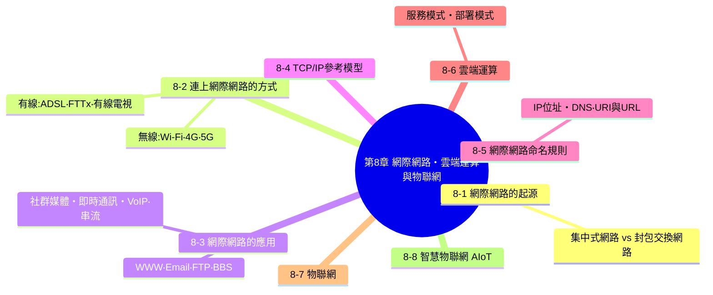

**這一章要帶學生建立的核心能力：**

1. 網際網路不是憑空存在的神秘雲霧，它是由實體的線路、明確的通訊協定（TCP/IP）、以及一套嚴謹的定址規則（IP 位址、DNS）所構成的具體系統。
2. **IP 位址與子網路遮罩的計算**是這一章的重頭戲——這些計算題看似複雜，但只要掌握「先轉二進位、再套用位元運算」這個核心方法，就能有系統地解出所有題型，這也是本講義花費最多篇幅補充的部分。
3. 雲端運算與物聯網代表了網際網路應用的最新演進方向，理解它們的服務模式與部署模式，能幫助學生看懂新聞中常見的科技名詞。

---

## 8-1　網際網路的起源

網際網路的發展，經歷了從「集中式網路」演進到「封包交換網路」的關鍵轉折：

<table>
<tr>
<td width="50%">

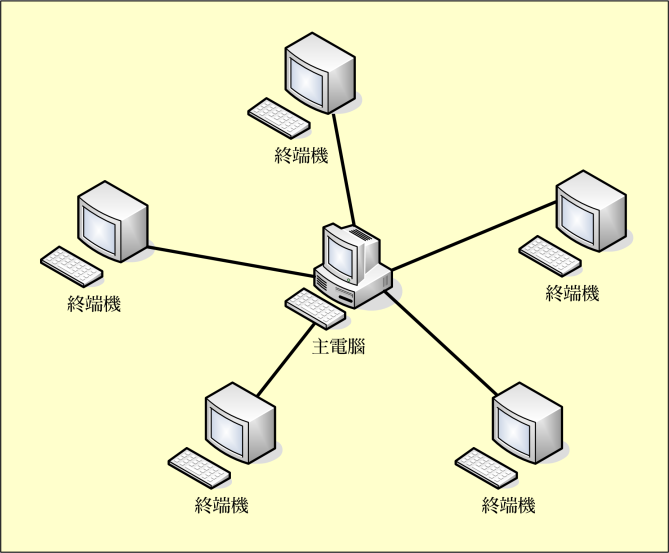
*集中式網路*

</td>
<td width="50%">

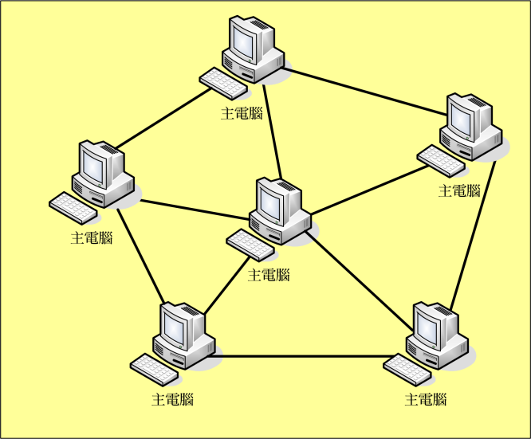
*封包交換網路*

</td>
</tr>
</table>

**集中式網路** 由一部主電腦連接多部終端機，所有運算都集中在主電腦處理，一旦主電腦故障，整個網路就會癱瘓。**封包交換網路** 則沒有單一的中心，每部主電腦都可以直接或間接與其他主電腦相連，資料被拆解成一個個「封包」，透過網路中多條可能的路徑傳遞，即使某條路徑或某部電腦故障，資料仍然可以繞道傳送——這種「去中心化、能夠自我修復」的設計思維，正是網際網路能夠承受區域故障、維持全球運作的關鍵。

### Internet 發展過程

- **ARPANET**：美國國防部於 1969 年建立，是網際網路的前身，最初目的是研究即使部分節點遭受攻擊摧毀，網路仍能維持運作的技術。
- **MILNET**：從 ARPANET 分割出來的軍用網路。
- **NSFNET**：美國國家科學基金會建立的網路，串連起各大學與研究機構，大幅擴展了網路的學術應用。
- **USENET**：早期的網路論壇系統，讓使用者能夠張貼文章、互相討論。
- **BITNET**：早期用於學術機構之間的網路。
- **Internet2**：由美國多所大學與企業合作建立的高速研究網路，做為新一代網路技術的試驗場域。

> **課堂重點**：ARPANET 之所以採用「封包交換」而非「集中式」架構，背後有冷戰時期的歷史背景——美國國防部希望即使部分通訊節點在核戰中被摧毀，剩餘的網路節點仍然能夠繼續運作、傳遞訊息，這種「去中心化以求生存」的設計思維，意外地也成就了今天網際網路強大的穩定性與擴展性。

---

## 8-2　連上網際網路的方式

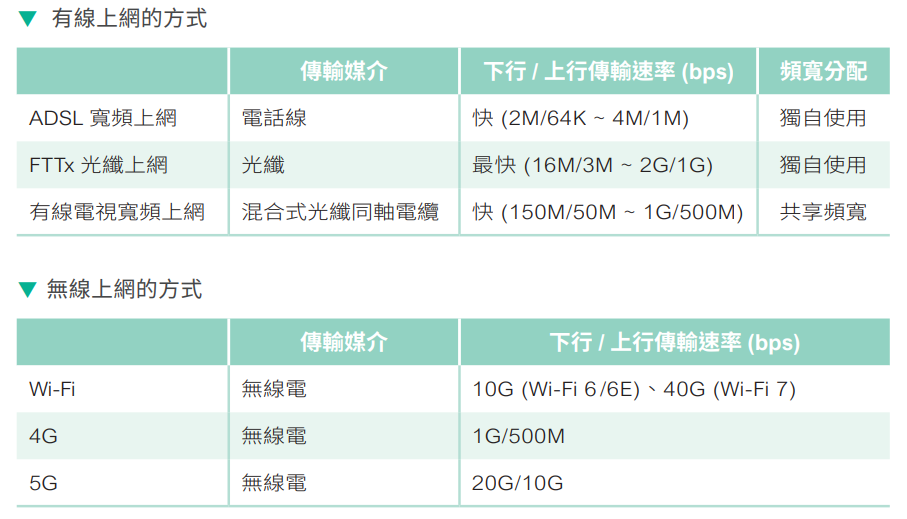

### 有線上網的方式

| 上網方式 | 傳輸媒介 | 下行/上行傳輸速率 | 頻寬分配 |
|---|---|---|---|
| ADSL 寬頻上網 | 電話線 | 快（2M/64K～4M/1M） | 獨自使用 |
| FTTx 光纖上網 | 光纖 | 最快（16M/3M～2G/1G） | 獨自使用 |
| 有線電視寬頻上網 | 混合式光纖同軸電纜 | 快（150M/50M～1G/500M） | 共享頻寬 |

<table>
<tr>
<td width="33%">

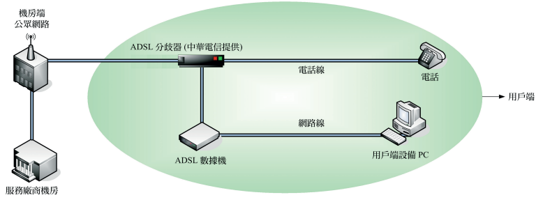
*ADSL 寬頻上網（圖片參考：中華電信）*

</td>
<td width="33%">

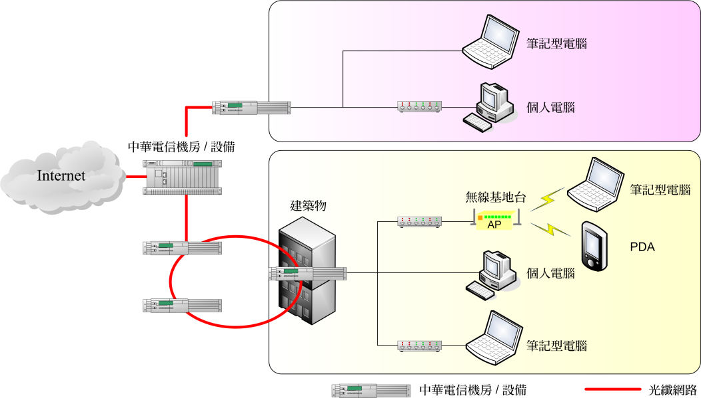
*FTTx 光纖上網（圖片參考：中華電信）*

</td>
<td width="33%">

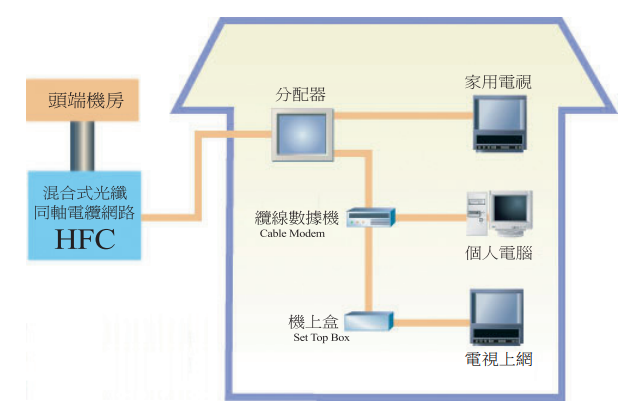
*有線電視寬頻上網（圖片參考：東森寬頻）*

</td>
</tr>
</table>

### 無線上網的方式

| 上網方式 | 傳輸媒介 | 下行/上行傳輸速率 |
|---|---|---|
| Wi-Fi | 無線電 | 10G（Wi-Fi 6/6E）、40G（Wi-Fi 7） |
| 4G | 無線電 | 1G/500M |
| 5G | 無線電 | 20G/10G |

> **課堂重點**：有線電視寬頻上網屬於「共享頻寬」——同一條纜線上的多戶居民共用相同的頻寬資源，因此在住戶集中使用網路的尖峰時段（例如晚間），實際速度可能會明顯下降；ADSL 與 FTTx 則是每戶「獨自使用」專屬頻寬，速度較不受鄰居使用狀況影響。

---

## 8-3　網際網路的應用

網際網路的應用非常多，常見的如下：

### 全球資訊網（WWW）

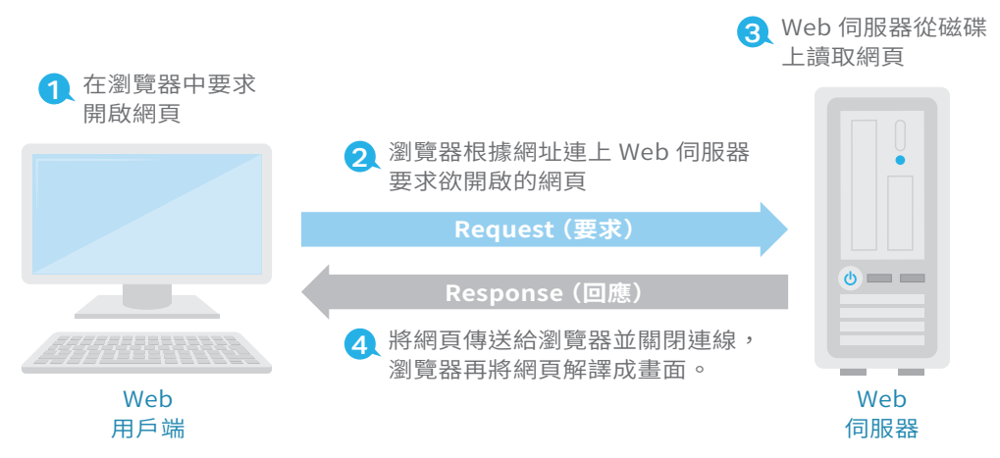

**全球資訊網（World Wide Web、WWW、W3、Web）** 使用 **HTTP（hypertext transfer protocol）** 通訊協定，Web 用戶端只要安裝瀏覽器軟體，就能透過該軟體連上全球各地的 Web 伺服器，進而瀏覽 Web 伺服器所提供的網頁。

### 電子郵件（E-mail）

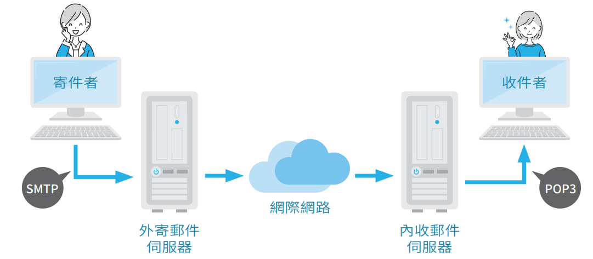

電子郵件的概念與生活中的郵件類似，不同的是寄件者不必將訊息寫在信紙上，而是使用電子郵件程式撰寫郵件。電子郵件程式用來傳送與接收郵件的通訊協定分別是 **SMTP**（Simple Mail Transfer Protocol）和 **POP**（Post Office Protocol），而 Web-Based Mail（網頁式電子郵件）則是使用 **HTTP**（HyperText Transfer Protocol）。

### 檔案傳輸（FTP）

**FTP（File Transfer Protocol）** 指的是在網路上傳送檔案的通訊協定，例如使用者可以登入 FTP 伺服器，然後將本機電腦的檔案上傳到該伺服器，或將該伺服器的檔案下載到本機電腦。

### 電子布告欄系統（BBS）

**BBS（Bulletin Board System）** 是一種早期的網路社群系統，使用者可以連線到 BBS 伺服器，在上面發表文章與回應、參與線上活動、分享檔案、玩遊戲、傳送電子郵件或進行即時的文字交談。例如批踢踢（ptt.cc）、批踢踢兔（ptt2.cc）、巴哈姆特電玩資訊站（bbs.gamer.com.tw）。

### 社群媒體

**社群媒體（social media）** 指的是透過網路平台讓人們創作、分享與交流內容，具有去中心化與雙向互動的特點，例如 Facebook、Instagram、Threads、Dcard、Discord、X、YouTube、TikTok、LinkedIn、Reddit、Snapchat、Podcast、部落格等。

### 即時通訊

**即時通訊（instant messaging）** 指的是兩個或多個使用者透過網際網路即時傳送文字、檔案、語音或視訊，只要安裝即時通訊軟體並註冊帳號（例如 Line、WhatsApp、Facebook Messenger、Telegram、WeChat…），就能得知對方的上線狀態，進行雙向或群組的即時溝通，例如語音通話、視訊通話或傳送文字、檔案、位置、貼圖等。

### 網路電話與視訊會議

**網路電話（VoIP，Voice over Internet Protocol）** 是一種語音通訊技術，它會先將聲音數位化，然後透過網際網路的 IP 通訊協定傳送給對方，再轉換回聲音。網路電話與即時通訊原屬於不同性質的應用，但因即時通訊軟體開始支援語音和視訊後，這兩種軟體的功能就已經不分軒輊，並應用到視訊會議。常見的視訊會議軟體有 Microsoft Teams、Google Meet、Zoom、FaceTime、Amazon Chime、Cisco Webex、GoTo Meeting 等。

### 多媒體串流技術

**多媒體串流技術（streaming）** 是一種網路多媒體播放方式，在伺服器收到用戶端觀看影音資料的要求後，會將影音資料分割成一個個封包，當封包陸續抵達用戶端後，就開始邊播邊接收，不必等整個檔案下載完畢。多媒體串流技術可以將影音資料由一點傳送到多點或多點，又分為下列幾種模式：

- **廣播（broadcast）**：訊號傳送給網路上所有裝置。
- **單播（unicast）**：訊號一對一傳送給指定裝置。
- **群播（multicast）**：訊號傳送給一群指定加入的裝置。

---

## 8-4　TCP/IP 參考模型

**TCP/IP 參考模型** 是實際應用在網際網路上的通訊協定模型，比第 7 章介紹的 OSI 七層模型更精簡，分成下列四個層次：

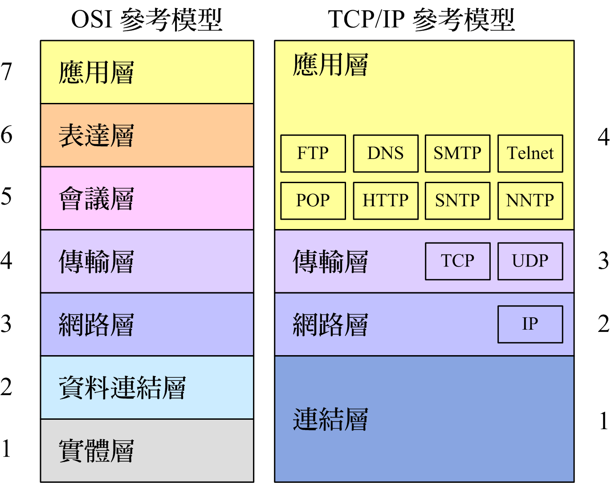

| OSI 七層 | | TCP/IP 四層 | 常見協定 |
|---|---|---|---|
| 7 應用層 | ┐ | | FTP、DNS、SMTP、Telnet |
| 6 表達層 | ├─→ | **應用層**（application layer） | POP、HTTP、SNTP、NNTP |
| 5 會議層 | ┘ | | |
| 4 傳輸層 | → | **傳輸層**（transport layer） | TCP、UDP |
| 3 網路層 | → | **網路層**（network layer） | IP |
| 2 資料連結層 | ┐ | | |
| 1 實體層 | ┘ | **連結層**（link layer） | |

- **應用層**：對應 OSI 模型的應用層、表達層、會議層，提供各種網路服務的通訊協定，例如 FTP、DNS、SMTP、POP、HTTP 等。
- **傳輸層**：對應 OSI 模型的傳輸層，負責端對端的資料傳輸，常見協定為 **TCP**（提供可靠、確認式傳輸）與 **UDP**（不保證送達，但速度較快，適合即時性應用）。
- **網路層**：對應 OSI 模型的網路層，負責封包的定址與路由，核心協定為 **IP**（Internet Protocol）。
- **連結層**：對應 OSI 模型的資料連結層與實體層，負責實際的訊號傳輸與硬體介面。

> **課堂記憶技巧（呼應學習評量第 5 題）**：判斷一個通訊協定屬於 TCP/IP 的哪一層，可以用「它處理的是使用者看得懂的內容，還是純粹的封包定址／傳輸機制」來判斷——**FTP、DNS、SMTP、POP、HTTP** 都是直接服務於使用者的具體應用（應用層）；**TCP、UDP** 負責資料能否可靠送達（傳輸層）；**IP** 負責封包要送到哪個位址（網路層）。

---

## 8-5　網際網路命名規則

Internet 的每部電腦都有一個編號和名稱，這個編號叫做 **IP 位址（IP address）**，而名稱叫做**網域名稱（domain name）**，至於網域名稱的命名方式則須遵循**網域名稱系統（DNS，Domain Name System）**。

### IP 位址

目前使用的 IP 定址方式為 **IPv4**，其 IP 位址是一個 **32 位元**的二進位數字，例如 10001100011000000011111000000110，為了幫助記憶，這串二進位數字被分成**四個 8 位元的十進位數字**，中間以小數點連接，於是變成 140.112.30.22。

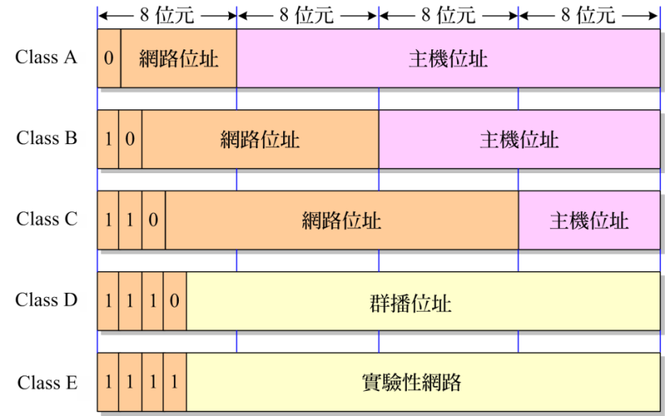

**網路等級（Class）**：IPv4 位址依照第一個數字的範圍，區分成 A、B、C、D、E 五個等級：

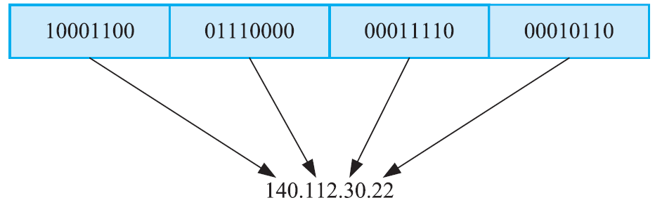

| Class | 第一個數字 | 遮罩位址 | 網路位址數目 | 最多可連接幾部主機 |
|---|---|---|---|---|
| A | 1～126 | 255.0.0.0 | 126（$2^7-2$，0.0.0.0 和 127.0.0.0 不能使用） | 16,777,214（$2^{24}-2$，x.0.0.0 和 x.255.255.255 不能使用） |
| B | 128～191 | 255.255.0.0 | 16,384（$2^{14}$） | 65,534（$2^{16}-2$，x.x.0.0 和 x.x.255.255 不能使用） |
| C | 192～223 | 255.255.255.0 | 2,097,152（$2^{21}$） | 254（$2^8-2$，x.x.x.0 和 x.x.x.255 不能使用） |
| D | 224～239 | （群播位址，不分配給一般主機） | | |
| E | 240～255 | （實驗性網路，保留使用） | | |

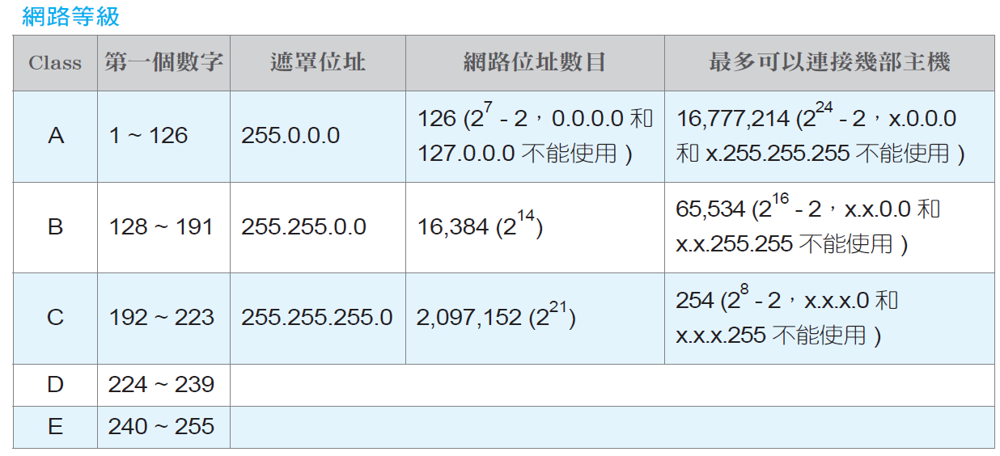

> **課堂重點：為什麼要扣掉 2 個位址？** 每個網路，主機位址「全部為 0」的那組保留作為**網路位址本身**（代表整個網段，不能指派給特定主機）；主機位址「全部為 1」的那組保留作為**廣播位址**（broadcast address，用來同時對該網段內所有主機發送訊息）。因此可用的主機數目公式固定是「$2^{\text{主機位元數}}-2$」，這個「-2」的原因，是初學者最容易忽略、也是評量中反覆出現的計算重點。

### IP 位址與子網路遮罩計算方法（本章計算題核心）

**子網路遮罩（subnet mask）** 是一組與 IP 位址一樣長度（32 位元）的數字，用來標示 IP 位址中「哪些位元屬於網路部分」、「哪些位元屬於主機部分」——遮罩中為 1 的位元對應網路部分，為 0 的位元對應主機部分。

**核心計算方法只有三個步驟，幾乎所有題型都是這三步驟的排列組合：**

**方法一：求「網路位址」與「主機位址」**（已知 IP 位址與遮罩）

把 IP 位址與遮罩都轉成二進位，逐位元做 **AND** 運算，結果就是網路位址；IP 位址扣掉網路位址部分（或者說，把遮罩為 0 的位元對應到的 IP 原始位元取出來），就是主機位址。

**範例**：IP 位址 140.175.1.68，採預設遮罩（Class B，255.255.0.0）

$$\text{網路位址} = 140.175.0.0 \qquad \text{主機位址} = 0.0.1.68$$

（因為預設遮罩前 16 位元為 1，直接取 IP 位址前兩個十進位數字 140.175 作為網路位址，其餘補 0；後 16 位元為 0，直接取 IP 位址後兩個十進位數字 1.68 作為主機位址，前面補 0）

**方法二：求「要劃分成 N 個子網路」所需的遮罩**

1. 求出「至少需要幾個位元，才能表示 N 個不同的子網路」：找出最小的 $n$，使得 $2^n \geq N$。
2. 把原本遮罩「借用」$n$ 個位元（從主機位元的最高位開始借），變成新的子網路遮罩。

**範例**：欲將一個 Class B 網路劃分成五個子網路，其子網路遮罩該設定為何？

1. $2^n\geq5$，最小的 $n=3$（因為 $2^3=8\geq5$，$2^2=4<5$，不夠用）
2. Class B 預設遮罩為 255.255.0.0（前 16 位元為網路位元），再借用 3 個位元：$16+3=19$ 位元為 1
3. 19 位元換算：前 2 個八位元（16 位元）全為 1，第 3 個八位元再借 3 位元為 1（11100000＝224），第 4 個八位元則全為 0
4. 答案：**255.255.224.0**

**方法三：求「要容納至少 N 個 IP 位址（主機）」所需的遮罩**

1. 求出「至少需要幾個位元，才能表示 N 台主機」：找出最小的 $h$，使得 $2^h-2\geq N$（扣掉網路位址與廣播位址）。
2. 剩下的位元（$32-h$）就是網路位元數，換算成遮罩。

**範例**：欲將 172.12.0.0 網路劃分成能夠容納 458 個 IP 位址的子網路，其子網路遮罩須設定為何？

1. 找最小的 $h$：$2^9-2=510\geq458$；$2^8-2=254<458$（不夠），故 $h=9$
2. 網路位元數 $=32-9=23$ 位元，172 屬於 Class B（預設 16 位元網路），此處直接以 23 位元計算遮罩：前 16 位元全 1，第 3 個八位元再借 $23-16=7$ 位元為 1（11111110＝254）
3. 答案：**255.255.254.0**

**範例**：IP 位址 140.175.1.68 所在的網路，若要劃分成四個大小相同的子網路，其子網路遮罩須設定為何？各子網路又包含幾部主機？

1. $2^n\geq4$，$n=2$
2. Class B 預設 16 位元 $+2=18$ 位元為網路位元：前 16 位元全 1，第 3 個八位元再借 2 位元（11000000＝192）
3. 答案：子網路遮罩為 **255.255.192.0**
4. 四個子網路的網路位址：

| 子網路 | 二進位（第三個八位元） | 網路位址 |
|---|---|---|
| 1 | 00000000 | 140.175.0.0 |
| 2 | 01000000 | 140.175.64.0 |
| 3 | 10000000 | 140.175.128.0 |
| 4 | 11000000 | 140.175.192.0 |

5. 剩餘主機位元數 $=32-18=14$ 位元，每個子網路可容納主機數 $=2^{14}=$ **16,384 部**

> **課堂重點：三種計算方法的判斷口訣**——看題目**問的是什麼**：問「這個 IP 屬於哪個網段」→ 用方法一（AND 運算）；問「要分成幾個子網路，遮罩怎麼設」→ 用方法二（先算子網路數要幾個位元）；問「要容納幾台主機，遮罩怎麼設」→ 用方法三（先算主機數要幾個位元，注意要扣 2）。務必讓學生分辨清楚題目問的究竟是「子網路數」還是「主機數」，這是最容易混淆、也是失分最多的地方。

### DNS

**DNS** 規定主機名稱的每個部分必須以小數點隔開，例如 ntucsa.csie.ntu.edu.tw。

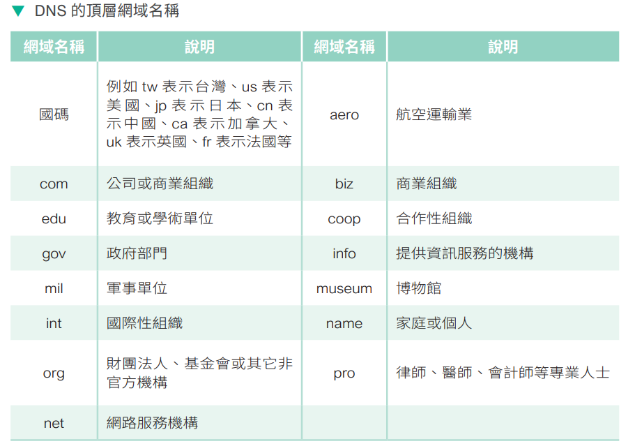

| 網域名稱 | 說明 |
|---|---|
| com | 公司或商業組織 |
| edu | 教育或學術單位 |
| gov | 政府部門 |
| mil | 軍事單位 |
| int | 國際性組織 |
| org | 財團法人、基金會或其它非營利機構 |
| net | 網路服務機構 |
| aero | 航空運輸業 |
| biz | 商業組織 |
| coop | 合作社組織 |
| info | 提供資訊服務的機構 |
| museum | 博物館 |
| name | 家庭或個人 |
| pro | 律師、醫師、會計師等專業人士 |

> **課堂重點（呼應學習評量第 6 題）**：**中文網域名稱**（例如「台灣.tw」這類中文網址）的註冊服務在台灣是由 **TWNIC（台灣網路資訊中心）** 負責管理；至於一般網域名稱的整體協調管理，則有 ICANN、IETF 等國際組織參與制定標準，學生只需要記得「**.tw** 相關的網域註冊找 TWNIC」即可。

### URI 與 URL

超連結的定址方式稱為 **URI（Universal Resource Identifier）**，指的是 Web 上各種資源的網址，而 **URL（Universal Resource Locator）** 則是 URI 的子集。URI 通常包含下列幾個部分：

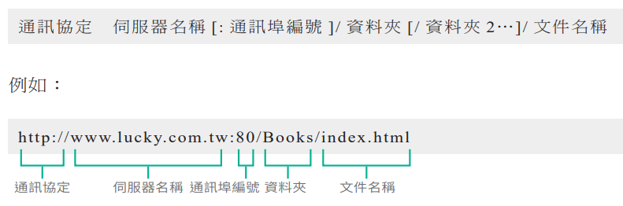

**通訊協定：伺服器名稱[:連接埠編號]/資料夾1/資料夾2…/文件名稱**

**範例**：`http://www.lucky.com.tw:80/Books/index.html`

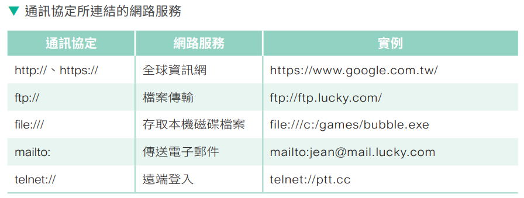

| 通訊協定 | 說明 | 範例 |
|---|---|---|
| http:// / https:// | 全球資訊網 | https://www.google.com.tw/ |
| ftp:// | 檔案傳輸 | ftp://ftp.lucky.com/ |
| file:// | 存取本地端檔案 | file:///c:/games/bubble.exe |
| mailto: | 傳送電子郵件 | mailto:jean@mail.lucky.com |
| telnet:// | 遠端登入 | telnet://ip.tt |

> **課堂重點（呼應學習評量第 12 題）**：不同的 URI 通訊協定，其後面接續的格式規則並不完全相同——最容易出錯的是 **mailto** 協定，它的正確寫法是 **`mailto:使用者@網域`**（冒號後面直接接電子郵件地址，中間**沒有** `//`），而不是像 http、ftp 那樣寫成 `mailto://...`，這是本章學習評量第 12 題「下列哪個 URI 的寫法錯誤」的判斷關鍵。

## 8-6　雲端運算

<table>
<tr>
<td width="55%">

雲端運算的「雲」指的是網路，也就是將軟硬體與資料放在網路上，讓使用者透過網路取得資料並進行處理。即便沒有高效能的電腦或龐大的資料庫，只要能連上網路，就能即時處理大量資料。

</td>
<td width="45%">

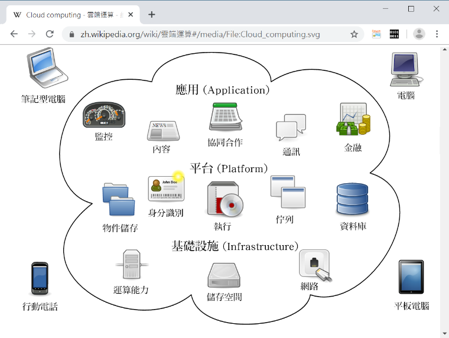
*雲端運算示意圖（圖片來源：維基百科 CC-BY-SA 3.0 Sam Johnston）*

</td>
</tr>
</table>

### 雲端運算的服務模式

根據美國國家標準與技術研究院（NIST）的定義，雲端運算有下列三種服務模式：

<table>
<tr>
<td width="33%">

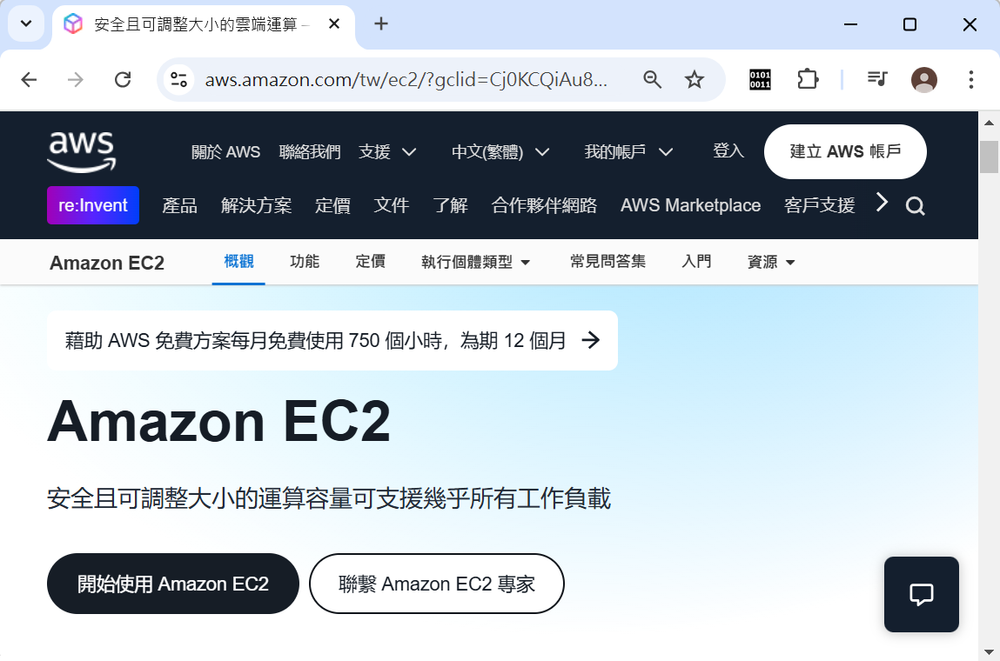
*Amazon EC2 屬於 IaaS 服務模式*

</td>
<td width="33%">

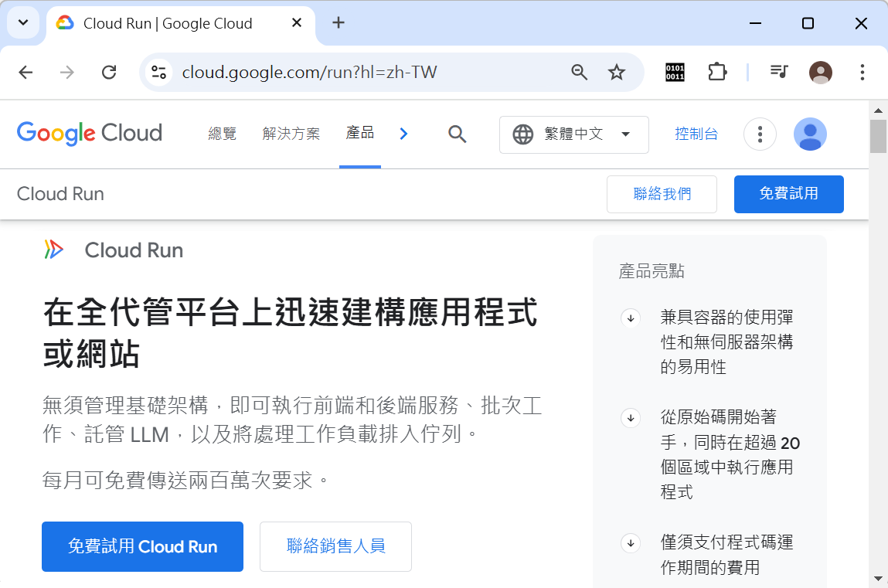
*Google Cloud Run 屬於 PaaS 服務模式*

</td>
<td width="33%">

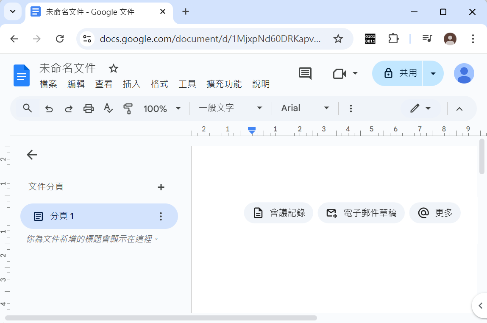
*Google Docs 屬於 SaaS 服務模式*

</td>
</tr>
</table>

- **基礎設施即服務（IaaS，Infrastructure as a Service）**：指的是提供設備或專業，協助企業建置或使用雲端服務，例如 IBM 公司的伺服器虛擬化服務、Amazon EC2——使用者取得的是「虛擬化的硬體資源」（虛擬主機、儲存空間、網路），自己還要負責安裝作業系統與應用程式。
- **平台即服務（PaaS，Platform as a Service）**：指的是將不同應用軟體整合在同一介面，例如 Google 將搜尋引擎、Google Maps、Google Docs、Gmail 等服務整合在一起；Google Cloud Run 讓開發者只要專心寫程式碼，不需要管理底層伺服器與作業系統。
- **軟體即服務（SaaS，Software as a Service）**：指的提供平台服務上的各種應用軟體，以趨勢科技的「智慧型防護網」服務為例，電腦只要連上網路，遠端的防毒署就會自動進行掃毒，使用者不再需要自行下載病毒碼及更新程式；Gmail、Google Docs 這類「打開瀏覽器就能直接使用」的服務也屬於 SaaS。

> **課堂記憶技巧（呼應學習評量第 17 題）**：三種服務模式可以用「使用者自己動手做的部分有多少」來排序記憶——**IaaS 給你一塊空地和建材（要自己蓋房子）、PaaS 給你蓋好結構的毛胚屋（自己裝潢）、SaaS 直接給你拎包入住的成屋（什麼都不用做，打開瀏覽器就能用）**。像 Google Docs 這種「線上文件服務」，使用者不需要安裝任何軟體、也不需要處理任何底層架構，打開瀏覽器就能直接編輯文件，正是典型的 **SaaS**。

### 雲端運算的部署模式

根據美國國家標準與技術研究院（NIST）的定義，雲端運算有下列幾種部署模式：

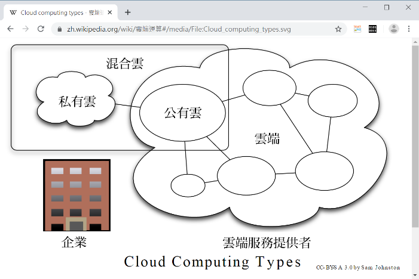
*圖片來源：維基百科 CC-BY-SA 3.0 Sam Johnston*

- **公有雲（public cloud）**：由雲端服務供應商建置，向社會大眾開放使用，例如 Google 地圖、Gmail 這類任何人都能申請帳號使用的服務。
- **私有雲（private cloud）**：由單一企業或組織獨自建置與使用，僅供內部人員存取，資料掌控度與安全性較高，但建置與維護成本也較高。
- **混合雲（hybrid cloud）**：結合公有雲與私有雲，企業可以把敏感資料留在私有雲，把不涉及機密、需要大量彈性運算資源的工作交給公有雲處理。

> **課堂重點（呼應學習評量第 18 題）**：Google 地圖是**任何人都可以免費申請帳號、透過瀏覽器直接使用**的服務，開放給社會大眾使用，因此屬於**公有雲**部署模式。

### 課堂重點：雲端運算的風險（呼應學習評量第 19 題）

雲端運算雖然帶來便利，但**並非完全沒有風險**——常見的疑慮包括：

- **資料安全與隱私**：資料存放在第三方伺服器上，存在被駭客入侵、內部人員不當存取，甚至供應商本身發生資料外洩的風險。
- **服務中斷**：一旦網路連線中斷或雲端服務商發生故障，使用者可能暫時無法存取自己的資料與服務。
- **廠商鎖定（vendor lock-in）**：習慣使用特定雲端平台的服務與格式後，未來要轉換到其他供應商可能面臨相容性與遷移成本的問題。

> **課堂重點**：千萬不要誤以為「雲端運算沒有資料失竊的風險」——這正是本章學習評量第 19 題刻意設計的錯誤敘述，資料放上雲端固然由專業廠商代為管理與備份，但並不代表就此與資安風險絕緣，使用者仍然需要做好帳號密碼保護、權限控管等基本資安措施。

---

## 8-7　物聯網

**物聯網（IoT，Internet of Things）** 指的是將物體連接起來所形成的網路，通常是在物體上安裝感測器和通訊晶片，然後經由網際網路連接起來，再透過特定的程序進行遠端控制，以應用到智慧家庭、智慧城市、智慧建築、智慧交通、智慧製造、智慧零售、智慧醫療、智慧農業、環境監測、犯罪防治等領域。

### 物聯網的架構


*利用物聯網的技術打造智慧交通控制系統（圖片來源：shutterstock）*

物聯網的架構通常分成三個層次：

- **感知層**：負責感測、蒐集現實世界的資料，例如各種感測器（溫度、濕度、光線、動作感測器）、RFID、WSN（無線感測網路）、GPS 等。
- **網路層**：負責把感知層蒐集到的資料傳輸出去，常見的技術有 4G/5G、Wi-Fi、ZigBee、LPWAN（低功耗廣域網路）等。
- **應用層**：負責將傳輸上來的資料進行處理、分析，並提供給使用者實際應用的服務介面，例如智慧家庭 App、智慧交通控制中心的儀表板。

> **課堂比喻**：可以把物聯網的三層架構比喻成人體的感官系統——**感知層**就像眼睛、耳朵、皮膚（負責感覺周遭環境的變化）；**網路層**就像神經系統（負責把感覺到的訊息傳遞到大腦）；**應用層**就像大腦（負責分析這些訊息、做出判斷或反應）。

### 資訊部落：LPWAN（低功耗廣域網路）

**LPWAN（Low Power Wide Area Network）** 是一種無線傳輸技術，具有長距離、低功耗、低速度、低資料量、低成本等特點，適合需要低速傳輸的物聯網應用。

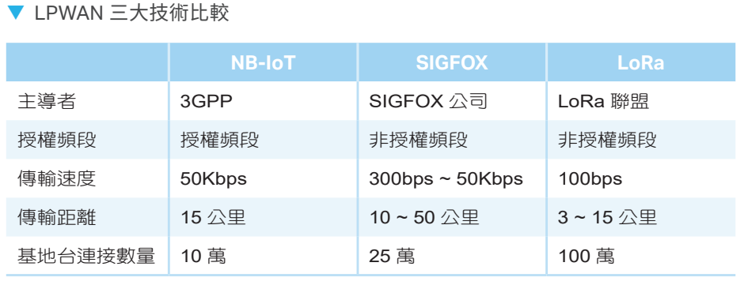

| | NB-IoT | SIGFOX | LoRa |
|---|---|---|---|
| **主導者** | 3GPP | SIGFOX 公司 | LoRa 聯盟 |
| **授權頻譜** | 授權頻譜 | 非授權頻譜 | 非授權頻譜 |
| **傳輸速度** | 50Kbps | 300bps～50Kbps | 100bps |
| **傳輸距離** | 15公里 | 10～50公里 | 3～15公里 |
| **基地台建置量** | 10萬 | 25萬 | 100萬 |

> **課堂重點**：這張比較表很適合搭配一個生活例子講解——想像在偏遠山區佈建大量野生動物追蹤器或農田土壤感測器，這些裝置往往一顆電池要撐好幾年、資料量也很小（只需傳送簡短的座標或數值），這正是 LPWAN 技術「犧牲傳輸速度，換取超長距離與超低功耗」設計精神最能派上用場的場景，與追求高速傳輸的 Wi-Fi、5G 恰好形成鮮明對比。

---

## 8-8　智慧物聯網

**智慧物聯網（AIoT）** 是人工智慧（AI）結合物聯網（IoT）的應用，有別於傳統的物聯網是將資料上傳到雲端做運算，再將結果傳送到用戶端，可能會發生傳輸延遲或回應不夠即時等問題，**AIoT 則是採取邊緣運算（edge computing）**，也就是將部分的人工智慧、機器學習等運算能力植入用戶端的裝置，讓裝置能夠做出即時且具有智慧的回應。

> **課堂重點**：這正好呼應第 2 章提過的 NPU（神經處理器）概念——AIoT 裝置之所以能在裝置本身（而不是把資料傳回遠端雲端伺服器）就完成 AI 運算，靠的正是內建的 NPU 等專用 AI 晶片，讓「邊緣運算」得以實現。**傳統 IoT**：感測器→（上傳）→雲端AI運算→（下載結果）→裝置反應，中間有網路延遲；**AIoT**：感測器→裝置本身內建AI直接判斷→立即反應，大幅縮短反應時間，特別適合自駕車煞車判斷、工廠瑕疵品即時分揀等「差一秒都不行」的應用場景。

---

## 本章總結

| 小節 | 核心觀念一句話 |
|---|---|
| 8-1 網際網路的起源 | 從集中式演變為封包交換網路，去中心化設計成就了高穩定性 |
| 8-2 連上網際網路的方式 | 有線(ADSL/FTTx/有線電視)各有速率與頻寬分配特性，無線靠Wi-Fi/4G/5G |
| 8-3 網際網路的應用 | WWW/Email/FTP/BBS/社群媒體/即時通訊/VoIP/串流各有專屬協定 |
| 8-4 TCP/IP參考模型 | 四層對應OSI七層，應用層協定最多，網路層核心是IP |
| 8-5 網際網路命名規則 | IP位址32位元分ABC等級；子網路遮罩計算是本章核心計算題 |
| 8-6 雲端運算 | IaaS/PaaS/SaaS由自己動手做到拎包入住；公有/私有/混合雲看部署方式 |
| 8-7 物聯網 | 感知層蒐集、網路層傳輸、應用層分析，三層架構如同人體感官系統 |
| 8-8 智慧物聯網 | AIoT用邊緣運算取代雲端運算，換取更即時的智慧回應 |

### 關鍵詞彙表（Glossary）

`集中式網路` `封包交換網路` `ARPANET` `ADSL` `FTTx` `有線電視寬頻` `WWW` `HTTP` `SMTP` `POP` `FTP` `BBS` `社群媒體` `即時通訊` `VoIP` `串流` `廣播` `單播` `群播` `TCP/IP參考模型` `TCP` `UDP` `IP` `IP位址` `Class A~E` `子網路遮罩` `網路位址` `主機位址` `廣播位址` `DNS` `TWNIC` `URI` `URL` `雲端運算` `IaaS` `PaaS` `SaaS` `公有雲` `私有雲` `混合雲` `物聯網IoT` `感知層` `網路層` `應用層` `LPWAN` `NB-IoT` `SIGFOX` `LoRa` `智慧物聯網AIoT` `邊緣運算`

---

## 第 8 章　學習評量

> 以下為課本第 8 章隨附之官方學習評量，題目逐字謄錄。答案為課本官方解答，並在其下補充**完整解說與計算過程**，方便課堂上直接點開講解、對答案。

### 一、選擇題

**1. IP 位址 11001100011000000011111000000110 可以表示成下列何者？**
A. 204.104.30.6　B. 204.112.30.6　C. 204.112:15:12　D. 204.104.15.6

<details>
<summary>▶ 參考答案與解說</summary>

**答案：B　204.112.30.6**

將 32 位元二進位數字每 8 位元分成一組，各自轉換成十進位：

$$11001100=204 \quad 01110000=112 \quad 00011110=30 \quad 00000110=6$$

合併後得到 **204.112.30.6**。

> **解題技巧**：這類題目的關鍵是**先正確地將 32 位元切成 4 組（每組 8 位元）**，再逐組轉換成十進位，切割位置錯誤是最容易失分的地方，建議每 4 位元用底線或空格輔助分隔，減少數錯位數的機率。

</details>

---

**2. 下列何者最有可能是行政院國家科學委員會的網址？**
A. www.nsc.net.tw　B. www.nsc.edu.tw　C. www.nsc.com.tw　D. www.nsc.gov.tw

<details>
<summary>▶ 參考答案與解說</summary>

**答案：D　www.nsc.gov.tw**

行政院國家科學委員會是**政府機關**，依照網域名稱命名慣例，政府部門應使用 **.gov** 網域，因此最可能的網址是 www.nsc.gov.tw。.net 通常用於網路服務機構，.edu 用於教育學術單位，.com 用於一般商業組織。

</details>

---

**3. URL 中開頭的 https:// 指的是下列何者？**
A. 瀏覽器版本　B. 通訊協定　C. HTML 網頁　D. 固定的開頭

<details>
<summary>▶ 參考答案與解說</summary>

**答案：B　通訊協定**

https（HyperText Transfer Protocol Secure）是網頁瀏覽時使用的加密版通訊協定，屬於 URI 組成中的「通訊協定」部分，用來告知瀏覽器該用什麼方式與伺服器溝通。

</details>

---

**4. 網際網路採取下列哪種通訊協定？**
A. IPX　B. AppleTalk　C. TCP/IP　D. X.25

<details>
<summary>▶ 參考答案與解說</summary>

**答案：C　TCP/IP**

TCP/IP 是網際網路採用的標準通訊協定組合，是本章 8-4 節介紹的核心主題。IPX、AppleTalk 分別是早期 Novell NetWare、Apple 電腦所使用的區域網路協定；X.25 則是較早期的封包交換網路標準，皆非目前網際網路採用的協定。

</details>

---

**5. 在 TCP/IP 參考模型中，下列哪個通訊協定屬於應用層？**
A. TCP　B. UDP　C. FTP　D. IP

<details>
<summary>▶ 參考答案與解說</summary>

**答案：C　FTP**

FTP（檔案傳輸協定）直接服務於使用者傳輸檔案的需求，屬於應用層。TCP、UDP 屬於傳輸層；IP 屬於網路層，皆非應用層協定。

</details>

---

**6. 中文網域名稱註冊服務由哪個機構負責？**
A. TWNIC　B. IETF　C. APNIC　D. ISOC

<details>
<summary>▶ 參考答案與解說</summary>

**答案：A　TWNIC**

TWNIC（台灣網路資訊中心）負責台灣地區網域名稱（包括中文網域名稱）的註冊管理服務。IETF（網際網路工程任務小組）負責制定網際網路技術標準；APNIC 是亞太地區的網路位址管理機構；ISOC（Internet Society）是推動網際網路發展的國際性組織，皆非台灣中文網域名稱的直接註冊管理機構。

</details>

---

**7. 下列哪種通訊協定可以在郵件伺服器之間傳送電子郵件？**
A. MAPI　B. SMS　C. NNTP　D. SMTP

<details>
<summary>▶ 參考答案與解說</summary>

**答案：D　SMTP**

SMTP（Simple Mail Transfer Protocol）正是負責在郵件伺服器之間傳送電子郵件的通訊協定。MAPI 是微軟 Outlook 等郵件用戶端與伺服器溝通的介面協定；SMS 是手機簡訊技術；NNTP 是網路新聞群組（Usenet）使用的協定，皆非郵件伺服器間傳送郵件的協定。

</details>

---

**8. 下列何者可以用來解譯網域名稱？**
A. TCP　B. SSL　C. IP　D. DNS

<details>
<summary>▶ 參考答案與解說</summary>

**答案：D　DNS**

DNS（Domain Name System，網域名稱系統）的核心功能，正是將人類容易記憶的網域名稱（如 www.google.com）解譯（轉換）成電腦實際用來定址的 IP 位址。

</details>

---

**9. IPv6 可能的位址數目是 IPv4 的幾倍？**
A. 32　B. 96　C. $2^{96}$　D. $2^{128}$

<details>
<summary>▶ 參考答案與解說</summary>

**答案：C　$2^{96}$**

IPv4 使用 32 位元定址，可能的位址數目為 $2^{32}$；IPv6 使用 128 位元定址，可能的位址數目為 $2^{128}$。兩者的倍數關係：

$$\dfrac{2^{128}}{2^{32}}=2^{128-32}=2^{96}$$

</details>

---

**10. 若要舉辦視訊會議，您認為可以使用下列哪套軟體？**
A. Chrome　B. Opera　C. Zoom　D. Word

<details>
<summary>▶ 參考答案與解說</summary>

**答案：C　Zoom**

Zoom 是專門設計用來進行視訊會議的軟體。Chrome、Opera 是網頁瀏覽器；Word 是文書處理軟體，皆非視訊會議工具。

</details>

---

**11. IP 位址的第一個數字是 140，表示該位址隸屬於哪種網路等級？**
A. Class A　B. Class B　C. Class C　D. Class D

<details>
<summary>▶ 參考答案與解說</summary>

**答案：B　Class B**

依照 8-5 節的網路等級表：Class A 第一個數字範圍為 1～126，Class B 為 128～191，Class C 為 192～223。140 落在 128～191 的範圍內，因此屬於 **Class B**。

</details>

---

**12. 下列哪個 URI 的寫法錯誤？**
A. mailto://jean@lucky.com　B. ftp://ftp.lucky.com　C. file:///c:/Windows/win.ini　D. http://www.lucky.com

<details>
<summary>▶ 參考答案與解說</summary>

**答案：A（此為錯誤寫法）**

mailto 協定的正確寫法是 **`mailto:使用者@網域`**，冒號後面直接接電子郵件地址，**不需要加上 `//`**。選項 A 誤加了 `//`，是常見的錯誤寫法。ftp、file、http 協定則確實需要在冒號後面加上 `//`，選項 B、C、D 寫法皆正確。

</details>

---

**13. 如欲將一個 Class B 網路劃分成五個子網路，其子網路遮罩須設定為何？**
A. 255.255.0.0　B. 255.255.224.0　C. 255.255.240.0　D. 255.255.248.0

<details>
<summary>▶ 參考答案與解說</summary>

**答案：B　255.255.224.0**

**步驟 1**：求出至少需要幾個位元才能表示 5 個子網路：$2^3=8\geq5$（$2^2=4<5$ 不夠用），需要 **3** 個位元。

**步驟 2**：Class B 預設網路位元為 16，借用 3 個位元後變成 $16+3=19$ 位元：前 2 個八位元全為 1，第 3 個八位元前 3 位元為 1（**11100000＝224**），第 4 個八位元全為 0。

答案：**255.255.224.0**

</details>

---

**14. 假設網路 163.13.0.0 的子遮罩為 255.255.255.192，下列何者屬於不同的子網路？**
A. 163.13.25.72　B. 163.13.23.71　C. 163.13.48.96　D. 163.13.80.71

<details>
<summary>▶ 參考答案與解說</summary>

**答案：A**

> **提醒**：這一題的子遮罩、IP 位址數值較多，建議實際帶學生在黑板上逐一將每個選項轉成二進位、套用遮罩進行 AND 運算演練，比單純背答案更能建立扎實的計算能力。一般化的判斷方法為：把子遮罩與各選項的 IP 位址都轉成二進位，逐位元做 AND 運算求出各自的網路位址，再比較哪一個選項算出來的網路位址，與其餘選項不同，那一個就是答案。

</details>

---

**15. 假設主機的 IP 位址為 152.40.5.77，遮罩為 255.255.255.252，那麼主機的網路編號為何？**
A. 152.40.5.72　B. 152.40.5.64　C. 152.40.5.70　D. 152.40.5.76

<details>
<summary>▶ 參考答案與解說</summary>

**答案：D　152.40.5.76**

遮罩最後一個八位元為 252（11111100），代表第 4 個八位元的區塊大小為 $256-252=4$，也就是每 4 個位址一組：0～3、4～7、8～11……72～75、**76～79**、80～83……

IP 位址最後一個數字為 77，落在 **76～79** 這個區塊內，因此網路編號（該區塊的起始位址）為 **152.40.5.76**。

</details>

---

**16. 如欲將 IP 位址 140.112.30.22、140.112.30.80 劃分成兩個子網路，子遮罩應設定為下列何者？**
A. 255.255.255.254　B. 255.255.255.192　C. 255.255.255.248　D. 255.255.255.224

<details>
<summary>▶ 參考答案與解說</summary>

**答案：B　255.255.255.192**

**先驗證為什麼不能用更少的位元**：若只借 1 個位元（遮罩 255.255.255.128，區塊大小 128），則 22 與 80 都落在 0～127 這同一個區塊內，**無法**把兩者分到不同子網路。

**改借 2 個位元**（遮罩 255.255.255.192，區塊大小 $256-192=64$）：區塊劃分為 0～63、64～127、128～191、192～255。

- 22 落在 **0～63** 區塊
- 80 落在 **64～127** 區塊

兩者恰好落在不同區塊，成功劃分成兩個子網路，且使用的位元數（2 個）已是能達成目標的最少位元數。

答案：**255.255.255.192**

</details>

---

**17. 像 Google Docs 這種線上文件服務屬於雲端運算的哪種服務模式？**
A. IaaS　B. PaaS　C. SaaS　D. DaaS

<details>
<summary>▶ 參考答案與解說</summary>

**答案：C　SaaS**

Google Docs 是使用者打開瀏覽器就能直接使用的完整應用服務，不需要處理任何底層架構或平台環境，符合軟體即服務（SaaS）「拎包入住」的特性。

</details>

---

**18. Google 地圖屬於雲端運算的哪種部署模式？**
A. 公有雲　B. 私有雲　C. 混合雲　D. 社群雲

<details>
<summary>▶ 參考答案與解說</summary>

**答案：A　公有雲**

Google 地圖是任何人都可以免費申請帳號、透過瀏覽器直接使用的服務，向社會大眾開放，符合公有雲（public cloud）的部署模式定義。

</details>

---

**19. 下列關於雲端運算的敘述何者錯誤？**
A. 雲端運算沒有資料失竊的風險　B. 使用者無須知道服務提供的細節　C. Gmail 屬於 SaaS 服務模式　D. 租用雲端運算服務能夠節省成本

<details>
<summary>▶ 參考答案與解說</summary>

**答案：A（此為錯誤敘述）**

雲端運算**並非完全沒有資料失竊的風險**——資料存放在第三方伺服器上，依然存在遭駭客入侵、帳號密碼外洩、供應商本身發生資安事件等風險，使用者仍須落實基本的資安防護措施。選項 B、C、D 皆為正確敘述：雲端運算的精神正是讓使用者不必了解服務提供的技術細節；Gmail 確實屬於 SaaS 服務；企業租用雲端服務通常能省去自建機房、硬體採購與維護的成本。

</details>

---

**20. 下列關於物聯網的敘述何者正確？**
A. 不會使用到無線網路技術　B. 屬於 VoIP 的應用　C. 主要用來遠端管理伺服器　D. 將物體連接起來所形成的網路

<details>
<summary>▶ 參考答案與解說</summary>

**答案：D**

物聯網（IoT）的定義正是「將物體連接起來所形成的網路」。選項 A 錯誤：物聯網裝置經常仰賴無線網路技術（如 Wi-Fi、ZigBee、LPWAN、4G/5G）進行資料傳輸。選項 B 錯誤：VoIP 是網路電話技術，與物聯網是不同的應用領域。選項 C 錯誤：物聯網的應用範圍廣泛（智慧家庭、智慧城市、智慧醫療等），並非「主要用來遠端管理伺服器」，遠端伺服器管理屬於另一個技術領域的應用。

</details>

### 二、練習題

**1. 簡單說明 TCP/IP 參考模型分成哪四個層次？以及各個層次的主要工作為何？**

<details>
<summary>▶ 參考答案</summary>

TCP/IP 參考模型分成下列四個層次：

- **應用層**（application layer）：對應 OSI 模型的應用層、表達層、會議層，提供各種網路服務的通訊協定，例如 FTP、DNS、SMTP、POP、HTTP 等。
- **傳輸層**（transport layer）：負責端對端的可靠傳輸，主要協定為 TCP（可靠傳輸）與 UDP（快速但不保證送達）。
- **網路層**（network layer）：負責封包的定址與路由選擇，核心協定為 IP。
- **連結層**（link layer）：對應 OSI 模型的資料連結層與實體層，負責實際的訊號傳輸與硬體介面。

</details>

---

**2. 如欲將 172.12.0.0 網路劃分成能夠容納 458 個 IP 位址的子網路，其子網路遮罩須設定為何？**

<details>
<summary>▶ 參考答案</summary>

**步驟 1**：找出最小的主機位元數 $h$，使得 $2^h-2\geq458$：

$$2^9-2=510\geq458 \quad（2^8-2=254<458\text{，不夠}）$$

故 $h=9$。

**步驟 2**：網路位元數 $=32-9=23$ 位元。172.12.0.0 屬於 Class B（預設 16 位元網路位元），借用 $23-16=7$ 個位元：前 2 個八位元全為 1，第 3 個八位元前 7 位元為 1（**11111110＝254**）。

答案：**255.255.254.0**

</details>

---

**3. 假設子遮罩採取預設值，試問，IP 位址 140.175.1.68 所在的網路編號與主機編號為何？**

<details>
<summary>▶ 參考答案</summary>

140 屬於 Class B，預設遮罩為 255.255.0.0（前 16 位元為網路位元）。

**網路位址為 140.175.0.0，主機位址為 0.0.1.68。**

</details>

---

**4. 承上題，如欲將所在的網路劃分成四個大小相同的子網路，其子遮罩須設定為何？又各個子網路包含幾部主機？**

<details>
<summary>▶ 參考答案</summary>

**步驟 1**：$2^n\geq4$，$n=2$，Class B 預設 16 位元 $+2=18$ 位元為網路位元，第 3 個八位元前 2 位元為 1（**11000000＝192**）。

子網路遮罩為 **255.255.192.0**。

**四個子網路的網路位址如下：**

```
10001100.10101111.00000000.00000000  (140.175.0.0)
10001100.10101111.01000000.00000000  (140.175.64.0)
10001100.10101111.10000000.00000000  (140.175.128.0)
10001100.10101111.11000000.00000000  (140.175.192.0)
```

**主機數目**為 $2^{14}=$ **16,384 部**（$32-18=14$ 個主機位元）。

</details>

---

**5. 簡單說明何謂雲端運算並舉出一個實例。**

<details>
<summary>▶ 參考答案</summary>

雲端運算的「雲」指的是網路，也就是將軟硬體與資料放在網路上，讓使用者透過網路取得資料並進行處理，即便沒有高效能的電腦或龐大的資料庫，只要能連上網路，就能即時處理大量資料。實例：**Google Drive、Gmail、Amazon EC2、Google Docs** 等（任舉一項）。

</details>

---

**6. 簡單說明在雲端運算的服務模式中，基礎設施即服務（IaaS）、平台即服務（PaaS）、軟體即服務（SaaS）的意義為何並各舉出一個實例。若有廠商透過官方網站提供軟體讓使用者在線上使用，那麼這是屬於哪種服務模式？**

<details>
<summary>▶ 參考答案</summary>

**設備服務（IaaS，Infrastructure as a Service）** 指的是提供設備或專業，協助企業建置或使用雲端服務，例如 **IBM 公司的伺服器虛擬化服務**；**平台服務（PaaS，Platform as a Service）** 指的是將不同應用軟體整合在同一介面，例如 **Google 將搜尋引擎、Google Maps、Google Docs、Gmail 等服務整合在一起**；**軟體服務（SaaS，Software as a Service）** 指的提供平台服務上的各種應用軟體，以趨勢科技的「智慧型防護網」服務為例，電腦只要連上網路，遠端的防毒署就會自動進行掃毒，使用者不再需要自行下載病毒碼及更新程式。

若有廠商透過官方網站提供軟體讓使用者在線上使用（不需下載安裝、打開瀏覽器就能用），這屬於 **SaaS** 服務模式。

</details>

---

**7. 簡單說明何謂物聯網並舉出一個實例。**

<details>
<summary>▶ 參考答案</summary>

物聯網（IoT，Internet of Things）指的是將物體連接起來所形成的網路，通常是在物體上安裝感測器和通訊晶片，然後經由網際網路連接起來，再透過特定的程序進行遠端控制。實例：**智慧家庭（透過手機 App 遠端控制家中的燈光、冷氣、電鎖）**（或其他智慧城市、智慧交通等領域的實例）。

</details>

---

**8. 簡單說明物聯網的架構分成哪三個層次？以及各個層次的功能為何？**

<details>
<summary>▶ 參考答案</summary>

物聯網的架構通常分成三個層次：

- **感知層**：負責感測、蒐集現實世界的資料，例如各種感測器、RFID、無線感測網路（WSN）、GPS 等。
- **網路層**：負責把感知層蒐集到的資料傳輸出去，常見技術有 4G/5G、Wi-Fi、ZigBee、LPWAN 等。
- **應用層**：負責將傳輸上來的資料進行處理、分析，並提供給使用者實際應用的服務介面。

</details>

---

*本講義圖片素材取自《最新計算機概論》第十二版 第 8 章 原版簡報，內文為教學擴寫版本，並針對 IP 位址與子網路遮罩計算補充完整方法與範例；學習評量題目依課本原文謄錄，答案在課本官方解答基礎上，補齊完整計算過程與解說，僅供授課教師課堂講解使用。*
