# 第 9 章　資訊安全

> 本講義以《最新計算機概論》第十二版 第 9 章 PPT 的架構為骨架，重新撰寫為適合課堂詳細講解的完整教學文字稿。圖片素材取自原簡報；內文除擴寫解說外，特別針對「各種惡意程式的分辨」「對稱式與非對稱式加密的運作流程」補充了具體比較與生活化說明。

## 本章學習地圖

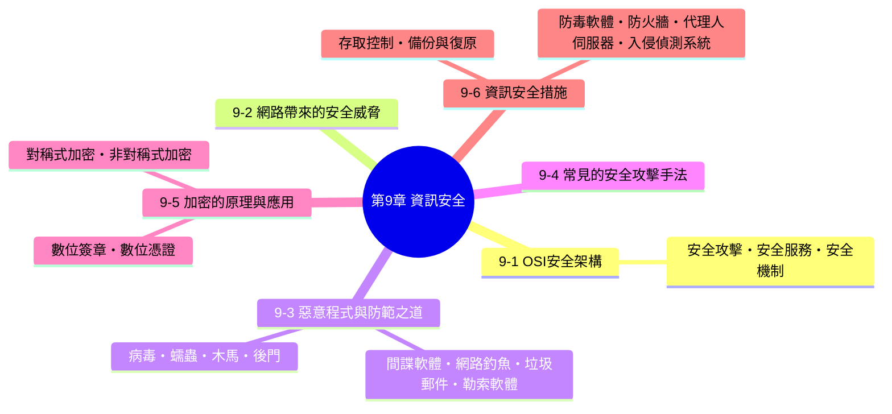

**核心概念：**

1. 資訊安全不是單一產品或單一動作就能達成的，它是一套完整的思考架構——OSI 安全架構把資訊安全拆解成「攻擊有哪些手法」「該提供哪些防護服務」「用什麼機制實現這些服務」三個層次，理解這個架構，才能有系統地認識後面所有具體的攻擊手法與防禦工具。
2. 「電腦病毒」在日常口語中常被拿來泛指所有惡意程式，但病毒、蠕蟲、木馬、後門、間諜軟體等其實各有明確定義與差異，分辨清楚才能對症下藥。
3. 加密技術是資訊安全的核心武器——對稱式加密與非對稱式加密各有優缺點，兩者巧妙搭配，才撐起了我們每天使用的網路銀行、電子簽章、HTTPS 網站背後的安全機制。

---

## 9-1　OSI 安全架構

根據 **BS 7799** 對於資訊安全管理系統（**ISMS**，Information Security Management System）的定義：「對組織來說，資訊是一種資產，和其它重要的營運資產一樣有價值，所以要持續受到適當保護，而資訊安全可以保護資訊不受威脅，確保組織持續營運，將營運損失降到最低，得到最大的投資報酬率與商機」。

為了有效評估組織的資訊安全需求，**ITU-T** 定義了 **X.800（Security Architecture for OSI）** 建議書，其重點包含三大部分：

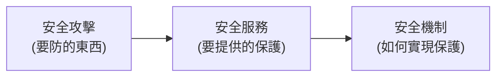

- **安全攻擊（security attack）**：任何危害組織資訊安全的行為，又分為主動式攻擊與被動式攻擊（詳見下方說明）。
- **安全服務（security service）**：系統應該提供哪些種類的保護，例如認證、保密性、完整性等（詳見下方說明）。
- **安全機制（security mechanism）**：用來偵測、預防或從安全攻擊中復原的具體技術手段，例如加密技術、存取控制、防火牆等，也就是本章後半段要詳細介紹的內容。

### 安全攻擊

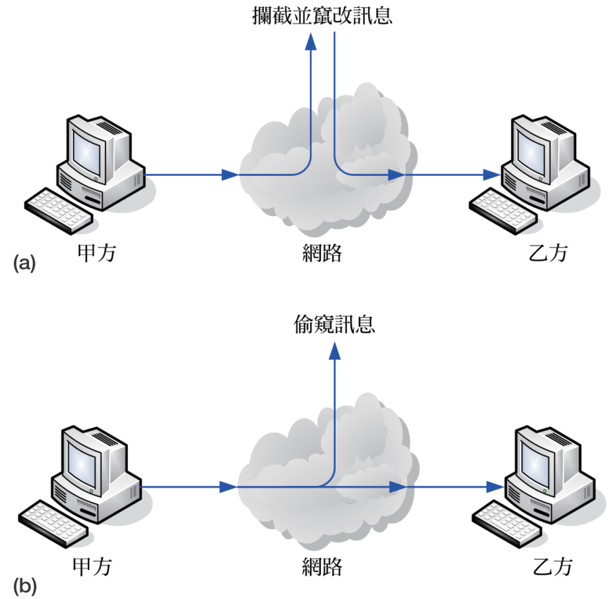

- **主動式攻擊（active attacks）**：攻擊者主動介入、竄改或偽造通訊內容，例如攔截封包後竄改內容再轉送、偽裝成合法使用者發送假訊息。這類攻擊會實際改變系統或資料的狀態，通常事後可以被偵測到。
- **被動式攻擊（passive attacks）**：攻擊者只是在旁竊聽、側錄通訊內容，並不介入或改變傳輸的資料，例如竊聽網路封包、側錄使用者輸入的密碼。由於沒有改變任何資料，這類攻擊往往更難被即時察覺。

> **課堂記憶技巧**：可以用「小偷 vs 竊聽器」來比喻——**主動式攻擊**像是小偷闖進屋子亂翻東西、甚至掉包（會留下痕跡）；**被動式攻擊**像是在你家裝了竊聽器，只是默默聽你講話的內容（不會留下明顯痕跡，但一樣造成隱私侵害）。

### 安全服務

系統必須具備下列幾種安全服務，才能有系統地抵禦攻擊：

- **認證（authentication）**：確認通訊雙方的身分確實是其所宣稱的身分，防止有人冒名頂替。
- **存取控制（access control）**：控制誰可以存取哪些資源，防止未經授權的存取。
- **保密性（confidentiality）**：確保資訊只有被授權的人才能閱讀，防止被竊聽或窺視。
- **完整性（integrity）**：確保資訊在傳輸過程中沒有被竄改，接收端收到的內容與發送端送出的內容完全一致。
- **不可否認性（nonrepudiation）**：確保發送者事後不能否認自己發送過某筆資訊，接收者也不能否認自己收過某筆資訊，這是電子簽章、線上交易等應用的重要基礎。

> **課堂重點**：「保密性」與「完整性」是最常被搞混的兩個概念——**保密性關心的是「資料有沒有被看到」，完整性關心的是「資料有沒有被改過」**。舉例來說，如果有人竊聽了你的加密郵件卻看不懂內容（保密性沒被破壞），但把郵件中的某個數字竄改後轉送出去（完整性被破壞），這就是兩者獨立存在的最佳例證。

### 安全機制

安全機制又分為下列兩種類型：

- **特定安全機制（specific security mechanisms）**：針對特定安全服務所設計的技術，例如加密技術（保護保密性）、數位簽章（保護不可否認性）。
- **一般安全機制（pervasive security mechanisms）**：不特別針對某一項安全服務，而是提供整體性防護的技術與管理措施，例如資安政策、稽核紀錄、資安教育訓練等。

---

## 9-2　網路帶來的安全威脅

常見的網路安全問題首推**駭客入侵**與**電腦病毒肆虐**，所謂**駭客（hacker）** 指的是未經授權而擅自存取他人電腦的人。

發展迄今，電腦病毒已經演變成一個全面性的泛稱，涵蓋了「電腦病毒／電腦蠕蟲／特洛伊木馬」、「間諜軟體」、「網路釣魚」、「垃圾郵件」、「勒索軟體」等不同類型的**惡意程式（malware）**。

> **課堂重點**：日常口語中「中毒了」往往泛指電腦受到任何惡意程式感染，但嚴謹來說，「電腦病毒」只是惡意程式（malware）底下的其中一種類型，下一節會把各種類型的定義與差異逐一釐清，這是本章學習評量第 7、10 題的判斷基礎。

---

## 9-3　惡意程式與防範之道

### 電腦病毒、電腦蠕蟲、特洛伊木馬、後門、間諜軟體

| 類型 | 說明 |
|---|---|
| **電腦病毒**（virus） | 一種會自我複製、依附於開機磁區或其它檔案的程式，通常會潛伏在電腦中伺機感染更多檔案，等到電腦符合特定時間或特定條件才會發病。 |
| **電腦蠕蟲**（worm） | 會透過網路自我複製到其它電腦的程式。 |
| **特洛伊木馬**（trojan horse） | 會偽裝成看似無害的軟體，在使用者下載並執行該軟體後，就會植入電腦並取得控制權，伺機進行惡意行為。 |
| **後門**（back door） | 程式設計人員留在程式中的秘密入口，用來在除錯階段獲得特殊權限或迴避認證程序，若後門忘記關閉，就會對電腦造成威脅。另一種「後門」則是攻擊者透過特洛伊木馬所植入，藉以遙控受害的電腦。 |
| **間諜軟體**（spyware） | 通常是透過「特洛伊木馬」、「後門」或在使用者下載程式的同時一起下載到電腦，並在不知不覺的情況下安裝或執行某些工作，進而監看、記錄並回報使用者的資訊。 |
| **網路釣魚**（phishing） | 誘騙使用者透過電子郵件或網站提供其資訊的手段。 |
| **垃圾郵件**（spam） | 具有未經使用者同意、與使用者的需求不相干、以不當的方式取得電子郵件地址、廣告性質、散布的數量龐大等特性，最常見的就是網路釣魚郵件和各種廣告。 |
| **勒索軟體**（ransomware） | 又稱為「勒索病毒」或「綁架病毒」，一旦入侵電腦，就會將電腦鎖起來或是將硬碟上的某些檔案加密，然後出現畫面要求受害者支付贖金。 |
| **殭屍程式**（zombie） | 會命令被感染的電腦對其它電腦發動攻擊的程式。 |

### 電腦病毒／電腦蠕蟲／特洛伊木馬的比較

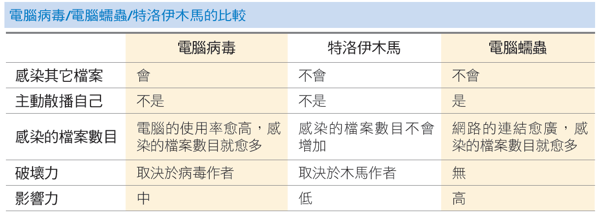

| | 電腦病毒 | 特洛伊木馬 | 電腦蠕蟲 |
|---|---|---|---|
| **感染其它檔案** | 會 | 不會 | 不會 |
| **主動散播自己** | 不是 | 不是 | 是 |
| **感染的檔案數目** | 電腦的使用率愈高，感染的檔案數目就愈多 | 感染的檔案數目不會增加 | 網路的連結愈廣，感染的檔案數目就愈多 |
| **破壞力** | 取決於病毒作者 | 取決於木馬作者 | 無 |
| **影響力** | 中 | 低 | 高 |

> **課堂重點（呼應學習評量第 7 題）**：這張表格是分辨三者最重要的依據，關鍵判斷點有三個：**① 會不會感染、依附在其它檔案上？**（只有病毒會）**② 會不會主動透過網路自我複製散播？**（只有蠕蟲會）**③ 是不是偽裝成正常軟體騙人執行？**（這是木馬的特徵）。值得特別注意的是，電腦蠕蟲本身「破壞力」欄位是「無」，但「影響力」卻是「高」——這是因為蠕蟲雖然通常不會直接破壞檔案內容，但透過網路瘋狂自我複製會大量佔用網路頻寬與系統資源，照樣能讓整個網路癱瘓，這正是本章學習評量常考的易混淆點：**「會傳染其它檔案」是電腦病毒的特徵，不是蠕蟲，也不是木馬**。

### 電腦病毒的感染途徑

- 透過網路自動向外散播
- 透過電子郵件自動向外散播
- 透過即時通訊自動向外散播
- 透過部落格、FB、IG、X 等社群媒體進行散播
- 偽裝成吸引人的檔案誘騙下載

### 電腦病毒的防範之道

- 安裝防毒軟體並持續更新。
- 安裝 IP 路由器或防火牆。
- 持續更新作業系統、瀏覽器、即時通訊與電子郵件軟體。
- 定期利用雲端硬碟或外部儲存裝置備份資料。
- 勿使用來路不明的光碟、隨身碟或行動硬碟開機。
- 勿使用來路不明的 Wi-Fi。
- 勿使用公共場所的 USB 充電孔。
- 勿隨意點取即時通訊、簡訊或電子郵件中夾帶的網址。
- 勿隨意下載軟體、影片、圖片、音樂、遊戲等檔案。
- 勿開啟或執行盜版軟體、來路不明的檔案、程式或電子郵件的附加檔案之前，必須開啟防毒軟體的即時掃描功能。
- 在其它電腦使用過的外部儲存裝置要盡快先進行掃毒，才能在自己電腦使用。
- 製作緊急救援光碟。

> **課堂重點**：這一長串防範之道，可以歸納成一句核心原則——**「來路不明的東西一律不要碰，該更新的軟體一律保持最新」**。與其死背條列項目，不如理解每一條背後的邏輯：不明的 USB、光碟、Wi-Fi、充電孔都可能是病毒的載體；不更新軟體則會讓已知的資安漏洞一直開著大門迎接攻擊。

### 間諜軟體

間諜軟體通常是由下列程式所組成：

- 鍵盤側錄程式
- 螢幕擷取程式
- 事件記錄程式

**間諜軟體的防範之道**：

- 安裝防間諜軟體並持續更新。
- 持續更新作業系統、瀏覽器、即時通訊與電子郵件軟體。
- 在下載、儲存與安裝程式的同時，必須提高警覺並仔細閱讀授權合約，勿隨意下載、儲存與安裝來路不明的程式。
- 慎選瀏覽的網站。

### 網路釣魚

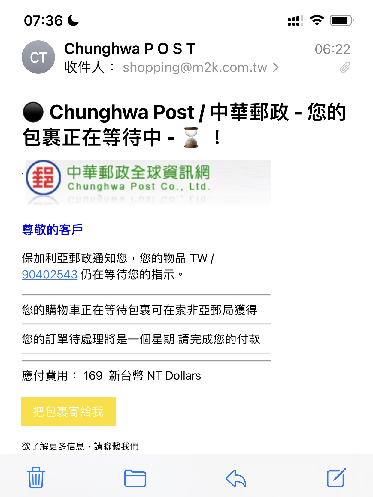
*網路釣魚郵件*

**網路釣魚（phishing）** 是誘騙使用者透過網頁、電子郵件、即時通訊或簡訊提供其資訊的手段，還有另一種更高明的手段叫做**網址嫁接**。

**網路釣魚的防範之道**：

- 安裝防網路釣魚與網址嫁接並持續更新。
- 持續更新作業系統、瀏覽器、即時通訊與電子郵件軟體。
- 在合法公司通常不會以即時通訊或簡訊要求敏感資訊，一旦遇到類似的情況，務必提高警覺。
- 拒絕來路不明的即時通訊或簡訊。
- 在網頁上填寫重要資訊時，務必確認網站內容的正確性。

### 垃圾郵件

**垃圾郵件（span）** 指的是具有下列特性的電子郵件，例如網路釣魚郵件和各種廣告：

- 未經使用者的同意或使用者的需求不相干。
- 以不當的方式取得電子郵件地址，且散布的數量龐大。
- 廣告性質。

**垃圾郵件的防範之道**：

- 安裝防垃圾郵件軟體並持續更新。
- 持續更新電子郵件軟體。
- 不要隨意公開自己的電子郵件地址。
- 根據用途使用不同的電子郵件地址。
- 不要開啟來路不明或疑似為垃圾郵件的電子郵件。

### 勒索軟體

**勒索軟體（ransomware）** 又稱為「勒索病毒」或「綁架病毒」，一旦入侵電腦，就會將電腦鎖起來或是將硬碟上的某些檔案加密，然後出現畫面要求受害者支付贖金，若不從的話，就毀損解密金鑰。

**勒索軟體的防範之道**：

- 安裝防毒軟體並持續更新病毒碼。
- 持續更新作業系統、瀏覽器、即時通訊與電子郵件軟體。
- 定期利用雲端硬碟或外部的儲存裝置備份資料。
- 勿隨意點取即時通訊、簡訊或電子郵件夾帶的網址。
- 勿隨意下載軟體、影片、圖片、音樂、遊戲等檔案。
- 慎選瀏覽的網站，避免遭到誘騙或被植入惡意程式。

> **課堂重點（呼應學習評量第 13 題）**：觀察上面幾種惡意程式的「防範之道」，會發現有大量重複的共通原則（持續更新軟體、勿隨意點擊不明連結、定期備份資料等）——這正說明了資訊安全的防範策略往往是「多管齊下、彼此重疊」的，並不存在單一一勞永逸的解法，這也是本章學習評量第 13 題「下列何者是預防電腦病毒比較適當的方式」的出題精神：**多種防範措施同時落實，才是真正有效的資安習慣**，而非依賴單一手段（例如誤以為「不要接收電子郵件」就能杜絕病毒，這既不切實際、也忽略了病毒有多種其他傳播途徑）。

---

## 9-4　常見的安全攻擊手法

除了上一節介紹的各種惡意程式，攻擊者還會採用下列多種攻擊手法：

- **惡意程式攻擊**：如前一節所介紹的病毒、蠕蟲、木馬等。
- **暴力攻擊（brute force attack）**：透過窮舉法，把所有可能的密碼組合都嘗試一遍，直到破解成功為止。
- **阻斷服務攻擊（DoS，Denial of Service）、分散式阻斷服務攻擊（DDoS，Distributed DoS）**：透過大量的請求癱瘓目標伺服器或網路，使其無法正常提供服務給合法使用者；DDoS 則是同時動用大量（可能是被入侵控制的殭屍電腦組成的）電腦一起發動攻擊，威力更強、也更難防禦。
- **偽裝攻擊**：偽裝成合法的使用者或系統，藉此騙取信任或權限。
- **利用漏洞入侵**：針對軟體或系統中尚未修補的安全漏洞進行攻擊。
- **竊聽攻擊**：在網路上側錄、截取傳輸中的資料。
- **點擊詐欺（click fraud）**：透過自動化程式或人力大量點擊網路廣告，藉此詐取廣告費用或消耗對手的廣告預算。
- **無線網路盜連**：未經授權盜用他人的無線網路連線。
- **無線網路攻擊**：針對無線網路的安全弱點進行攻擊，例如破解 Wi-Fi 密碼、偽造無線基地台誘騙裝置連線。
- **社交工程（social engineering）**：利用人性的弱點（信任、恐懼、好奇、貪念等），誘騙受害者洩漏機密資訊或執行危險動作，而不是直接攻擊技術層面的漏洞。

> **課堂重點（呼應學習評量第 4 題）**：不同攻擊手法「破解密碼」的目的與手段並不相同——**暴力攻擊**是完全不需要事先了解受害者、純粹靠運算能力窮舉密碼組合；**社交工程**則是完全不需要任何技術手段，單純利用人性弱點誘騙受害者「自己把密碼交出來」，兩者恰好是「純技術」與「純心理」這兩個極端的代表，值得對照講解，幫助釐清各種攻擊手法的核心邏輯。

## 9-5　加密的原理與應用

**加密（encryption）** 的目的是資訊保密，常見的加密方式有「**對稱式加密**」（秘密金鑰）與「**非對稱式加密**」（公開金鑰）。

### 對稱式加密

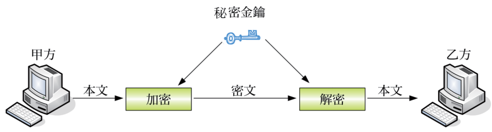

**對稱式加密（symmetric encryption）** 又稱為秘密金鑰（secret key），發訊端（以下稱甲方）與收訊端（以下稱乙方）必須協商一個不對外公開的秘密金鑰，甲方在將資訊傳送出去之前先以秘密金鑰加密（encryption），而乙方在收到經過加密的資訊之後就以秘密金鑰解密（decryption）。

**優點**：加解密運算速度快，適合大量資料的加密。
**缺點**：甲乙雙方必須先想辦法安全地交換這把共同的秘密金鑰——**金鑰在傳遞過程中若被攔截，整套加密就失去意義**，這正是對稱式加密最大的罩門，也是下面非對稱式加密之所以被發明出來的原因。

### 非對稱式加密

<table>
<tr>
<td width="55%">

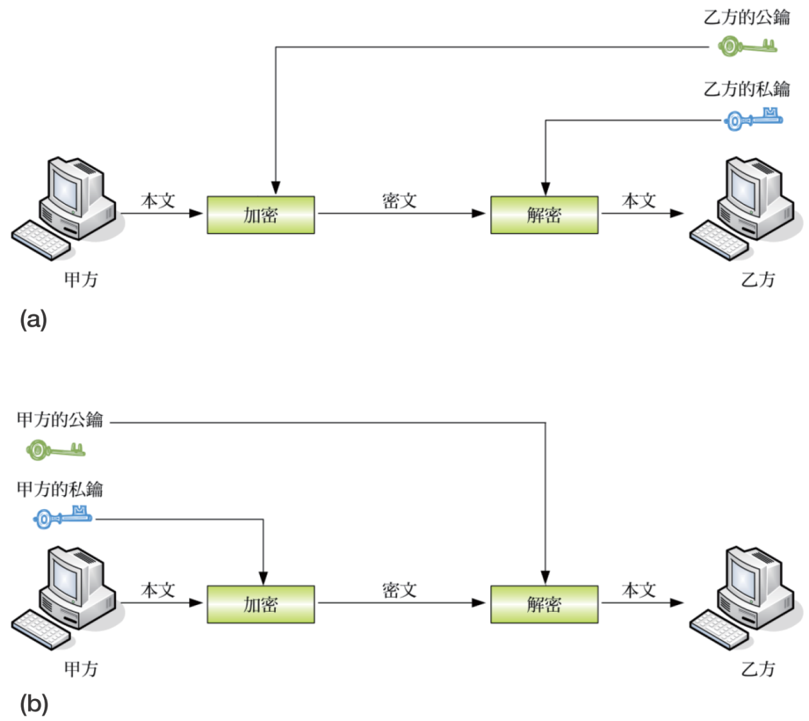

</td>
<td width="45%">

**非對稱式加密（asymmetric encryption）** 又稱為公開金鑰（public key），發訊端與收訊端各有一對公鑰（public key）和私鑰（private key），在將資訊以公鑰加密之後，必須使用對應的私鑰才能解密，而在將資訊以公鑰加密之後，必須使用對應的私鑰才能解密。

</td>
</tr>
</table>

**運作邏輯**：公鑰可以公開給任何人，私鑰則必須自己妥善保管、絕不外流。這一對金鑰有個巧妙的數學特性——**用其中一把加密的內容，只有用另一把才能解開**。因此非對稱式加密可以有兩種應用方向：

- **保密傳輸**：甲方用**乙方的公鑰**加密，只有持有對應**私鑰**的乙方才能解密——即使加密後的內容被攔截，沒有乙方的私鑰也無法解讀，確保了「保密性」。
- **來源證明（數位簽章的基礎）**：甲方用**自己的私鑰**加密，任何人都可以用**甲方的公鑰**解密驗證——因為只有甲方擁有那把私鑰，能夠成功解密就證明這份資料確實出自甲方之手，確保了「不可否認性」。

**優點**：不需要事先交換秘密金鑰，解決了對稱式加密「金鑰配送」的難題。
**缺點**：運算複雜度高，加解密速度比對稱式加密慢很多。

> **課堂重點（呼應學習評量第 5、14 題）**：對稱式加密下，若有 N 個使用者兩兩之間都要能夠安全通訊，需要協商 $N(N-1)/2$ 組不同的秘密金鑰（因為每一對使用者都需要一把專屬的共同金鑰），使用者數量增加時，金鑰管理的複雜度會暴增，這正是對稱式加密在大規模應用時的痛點；而非對稱式加密下，每個使用者只需要一對公私鑰（N 個使用者只需要 N 對金鑰），大幅簡化了金鑰管理。**實務上，目前主流做法是兩者截長補短**：先用非對稱式加密安全地交換一把「臨時的對稱式金鑰」，之後雙方再改用速度快的對稱式加密進行實際的大量資料傳輸，這正是 HTTPS 等現代網路安全協定背後採用的策略。

### 數位簽章

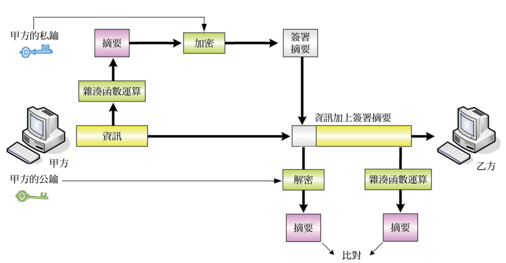

當非對稱式加密應用於來源證明時，發訊端以自己的私鑰將資訊加密所得到的密文就是所謂的**數位簽章（digital signature）**。

**數位簽章的產生與驗證流程**：

1. 甲方將原始資訊，透過**雜湊函數運算**，產生一段長度固定的「摘要」（可以想成資料的指紋，資料只要有一絲變動，算出來的摘要就會完全不同）。
2. 甲方用**自己的私鑰**將這段摘要加密，得到「簽署摘要」，也就是數位簽章。
3. 甲方把「原始資訊」加上「簽署摘要」一起傳送給乙方。
4. 乙方收到後，一方面用**甲方的公鑰**解密簽署摘要，還原出原始的摘要；另一方面，也把收到的原始資訊，同樣透過雜湊函數運算，重新算出一次摘要。
5. **比對**這兩個摘要是否一致：若一致，代表資訊確實出自甲方之手（不可否認性），而且傳輸過程沒有被竄改（完整性）；若不一致，代表資訊可能被竄改過，或簽章並非真正來自甲方。

> **課堂比喻**：數位簽章的精神很像在合約上蓋一個「無法被複製、且與合約內容綁定」的專屬印章——如果合約內容被偷偷改了一個字，這個印章比對起來就會兜不攏，任何人都能立刻發現合約被動過手腳；而且因為印章是用只有本人才有的私鑰蓋出來的，事後也無法抵賴「這不是我簽的」。

### 數位憑證

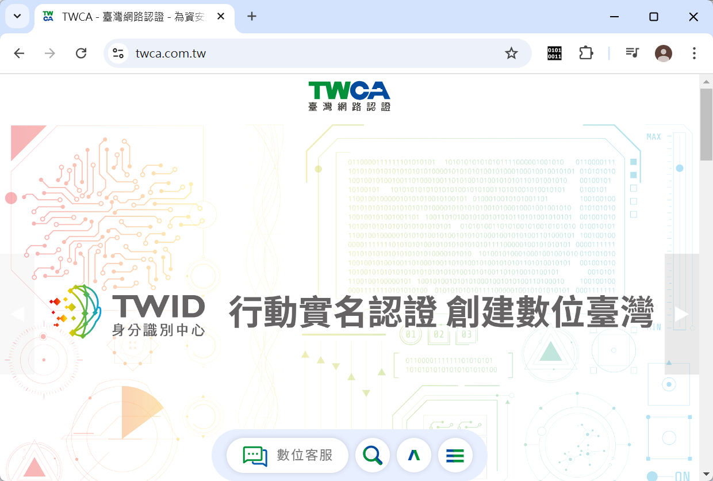

**數位憑證（DC，digital certificate）** 是驗證使用者身份的工具，包含使用者身份識別與公鑰、憑證序號、有效期限、數位簽章演算法等資訊。

數位憑證的格式與內容是遵循 **ITU（國際電信聯盟）** 所建議的 **X.509** 標準。

> **課堂重點**：數位憑證要解決的問題是——「當你拿到一把聲稱屬於某人的公鑰時，你怎麼知道這把公鑰真的是那個人的，而不是冒名頂替者提供的假公鑰？」數位憑證正是由公正的第三方機構（憑證授權中心，CA，Certificate Authority）驗證身份後所核發，並在憑證上蓋上 CA 自己的數位簽章做擔保——這正是我們瀏覽 HTTPS 網站時，瀏覽器能夠信任該網站身份的底層機制。

---

## 9-6　資訊安全措施

常見的資訊安全措施如下：

### 存取控制

**存取控制（access control）** 指的是系統必須控制哪些人能夠存取資源，以及他們能夠在哪些情況下存取哪些資源，而**身份認證（authentication）** 則是存取控制最重要的環節。身分認證通常可以透過「帳號與密碼」、「持有的物件」、「生物特徵」等方式來做鑑定。

> **課堂重點（呼應學習評量第 12 題）**：關於密碼設定，有幾個常見迷思務必澄清——**密碼的長度與安全性有直接關係**（並非無關），愈長、愈複雜的密碼愈難被暴力攻擊破解；不建議使用生日等容易被他人得知或猜到的資訊作為密碼；密碼盡量不要寫在紙上到處放；使用者應該定期變更密碼，降低密碼一旦外洩後被長期濫用的風險。

### 備份與復原

<table>
<tr>
<td width="45%">

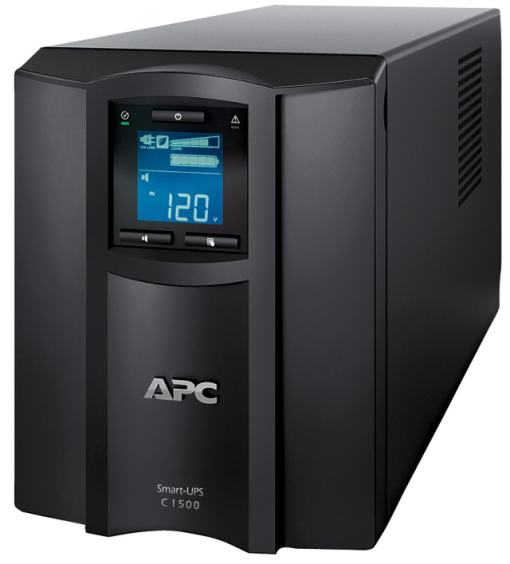
*不斷電系統（圖片來源：amazon.com）*

</td>
<td width="55%">

- **預防電力中斷**：安裝不斷電系統（UPS），避免因突發性停電導致資料遺失或硬體損壞。
- **災害復原方案**：
  - **緊急方案**（emergency plan）：災害發生當下的應變流程。
  - **備份方案**（backup plan）：資料備份的策略與頻率規劃。
  - **復原方案**（recovery plan）：災後如何從備份還原系統與資料。
  - **測試方案**（test plan）：定期演練前述方案，確保真正發生災害時方案確實可行。

</td>
</tr>
</table>

> **課堂重點**：很多組織會制定備份方案，卻疏忽了「測試方案」這一環——**備份檔案如果從來沒有實際演練復原過，你永遠不會知道它到了緊要關頭是否真的能夠成功還原**，這也是資安管理中經常被忽略、卻至關重要的一環。

### 防毒軟體

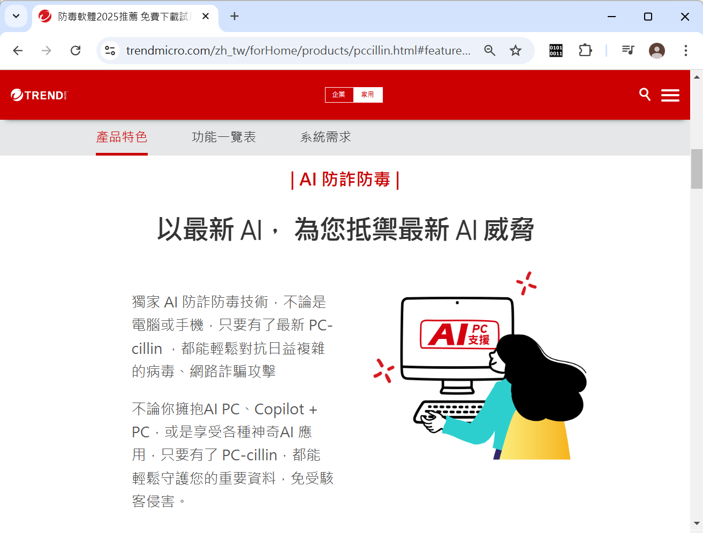
*趨勢科技 AI 防詐防毒*

防毒軟體就是用來防治電腦病毒的軟體，目前的防毒軟體大都能防治電腦病毒／電腦蠕蟲／特洛伊木馬、間諜軟體、網路釣魚、垃圾郵件、勒索軟體等惡意程式。除了傳統防毒方式，還有雲端防毒。

### 防火牆

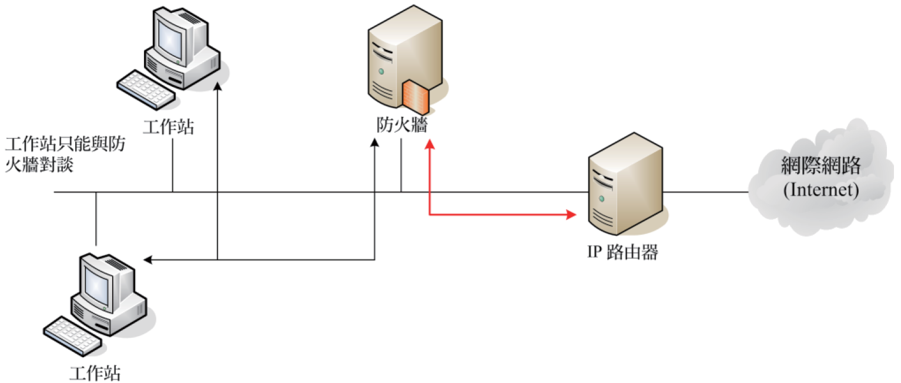

**防火牆（firewall）** 是一種用來分隔兩個不同網路的安全裝置，例如私人網路與網際網路，它會根據預先定義的規則過濾進出網路的封包，只有符合規則的封包才能通過，不符合規則的封包就予以丟棄，屬於「封包過濾型防火牆」。

防火牆又分為下列兩種類型：

- **硬體防火牆**：獨立的實體設備，通常部署在網路的邊界，效能較高、較不佔用主機資源。
- **軟體防火牆**：安裝在個人電腦或伺服器上的程式，設定較有彈性，但會佔用主機本身的運算資源。

### 代理人伺服器

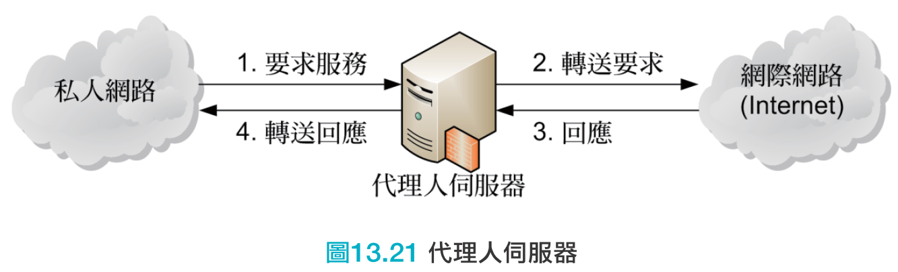

**代理人伺服器（proxy server）** 是在私人網路與網際網路之間擔任中介的角色，兩端的存取動作都必須透過代理人伺服器。

> **課堂重點（呼應學習評量第 15 題）**：防火牆與代理人伺服器都位在私人網路與外部網路的交界處，功能卻不盡相同——**防火牆的核心任務是「依規則過濾封包，阻擋不該進出的流量」；代理人伺服器的核心任務則是「代替使用者向外發出請求、再把結果轉交回來」**，附帶的效果包括隱藏內部網路的真實位址、快取常用資源以加速存取、集中控管內部使用者對外的存取行為。實務上，許多網路架構會同時部署防火牆與代理人伺服器，兩者分工合作、並不互相取代。

### 入侵偵測系統

相較於防毒軟體、防火牆或代理人伺服器是**被動阻擋**網路攻擊，**入侵偵測系統（IDS，intrusion detection system）** 則是**主動偵測**網路攻擊，常用的入侵偵測方法如下：

- **異常統計偵測法（statistical anomaly detection）**：建立系統正常運作時的行為模式基準，一旦偵測到明顯偏離基準的異常活動，就發出警示。
- **規則偵測法（rule-based detection）**：依照事先定義好的已知攻擊特徵規則庫進行比對，偵測到符合已知攻擊模式的行為就發出警示。
- **蜜罐（honeypots）**：刻意佈建一個看似有價值、實則沒有真實資料的誘餌系統，引誘攻擊者上鉤，藉此觀察攻擊手法、爭取應變時間，同時讓攻擊者遠離真正重要的系統。

> **課堂總結：防毒軟體、防火牆、代理人伺服器、入侵偵測系統的分工**——可以用「城堡防禦」來比喻：**防火牆**是城牆上的守衛，依照通行證規則決定誰能進出；**代理人伺服器**是城門口的傳令兵，代替城內居民去跟外界打交道，避免居民直接曝露在外；**防毒軟體**是城內的醫生，負責治療已經混入城內的病原體；**入侵偵測系統**則是城牆上主動巡邏、留意可疑動靜的哨兵，而**蜜罐**則是刻意擺放的假寶庫，專門用來誘捕小偷。

---

## 本章總結

| 小節 | 核心觀念一句話 |
|---|---|
| 9-1 OSI安全架構 | X.800建議書把資安拆解成攻擊、服務、機制三層次，是理解全章的骨架 |
| 9-2 網路帶來的安全威脅 | 駭客與惡意程式是網路安全最主要的兩大威脅來源 |
| 9-3 惡意程式與防範之道 | 病毒會感染檔案、蠕蟲會主動散播、木馬會偽裝，防範原則多管齊下 |
| 9-4 常見的安全攻擊手法 | 暴力攻擊靠運算、社交工程靠人性，攻擊手法各有不同的施力點 |
| 9-5 加密的原理與應用 | 對稱式加密快但金鑰配送難，非對稱式加密解決配送難題但速度慢 |
| 9-6 資訊安全措施 | 存取控制、備份復原、防毒、防火牆、代理人伺服器、入侵偵測缺一不可 |

### 關鍵詞彙表（Glossary）

`ISMS` `X.800` `安全攻擊` `安全服務` `安全機制` `主動式攻擊` `被動式攻擊` `認證` `存取控制` `保密性` `完整性` `不可否認性` `駭客` `惡意程式` `電腦病毒` `電腦蠕蟲` `特洛伊木馬` `後門` `間諜軟體` `網路釣魚` `網址嫁接` `垃圾郵件` `勒索軟體` `殭屍程式` `暴力攻擊` `阻斷服務攻擊DoS` `分散式阻斷服務攻擊DDoS` `點擊詐欺` `社交工程` `加密` `對稱式加密` `秘密金鑰` `非對稱式加密` `公開金鑰` `私鑰` `數位簽章` `雜湊函數` `數位憑證` `憑證授權中心CA` `X.509` `不斷電系統UPS` `防毒軟體` `防火牆` `代理人伺服器` `入侵偵測系統IDS` `蜜罐`

---

## 第 9 章　學習評量

> 以下為課本第 9 章隨附之官方學習評量，題目逐字謄錄。答案為課本官方解答，並在其下補充**完整解說**，方便課堂上直接點開講解、對答案。

### 一、選擇題

**1. 下列何者是以公開金鑰為基礎的加密演算法？**
A. DES　B. AES　C. RC4　D. RSA

▶ 參考答案與解說

**答案：D　RSA**

RSA 是最知名的非對稱式（公開金鑰）加密演算法。DES、AES、RC4 都是**對稱式加密**（秘密金鑰）演算法，雙方使用同一把金鑰加解密，與 RSA 使用公私鑰配對的方式不同。

---

**2. 下列何者應該不是電腦病毒的發作症狀？**
A. 發出奇怪的聲音或訊息　B. USB 埠故障　C. 無故自動關機或重新開機　D. 經常執行的程式突然無法執行

▶ 參考答案與解說

**答案：B　USB 埠故障**

USB 埠故障通常是**硬體實體損壞**的問題（例如接頭氧化、電路損毀），電腦病毒是軟體層級的惡意程式，一般不會直接造成 USB 埠這類實體硬體的故障。發出怪聲異常訊息、無故關機重開機、程式無法正常執行，則都是電腦感染病毒時常見的軟體層級異常症狀。

---

**3. 下列何者是檔案加密的特性？**
A. 用來保護資料不被偷窺　B. 用來防止電腦中毒　C. 用來提升電腦的效能　D. 用來保護硬體不被損壞

▶ 參考答案與解說

**答案：A　用來保護資料不被偷窺**

檔案加密的核心目的正是資訊保密（保密性），確保只有持有正確金鑰的人才能讀取檔案內容，防止資料被窺視。加密與防止電腦中毒、提升效能、保護硬體皆無直接關係。

---

**4. 下列哪種安全攻擊手法的目的是要破解密碼？**
A. 阻斷服務攻擊　B. 網路連線盜連　C. 社交工程　D. 暴力攻擊

▶ 參考答案與解說

**答案：D　暴力攻擊**

暴力攻擊（brute force attack）的定義正是透過窮舉法，嘗試所有可能的密碼組合直到破解成功，目的明確就是破解密碼。阻斷服務攻擊的目的是癱瘓服務而非破解密碼；社交工程是利用人性弱點誘騙受害者主動洩漏資訊，手段上不算是直接「破解」密碼。

---

**5. 在使用對稱式加密的前提下，N 個使用者需要協商幾個秘密金鑰？**
A. N(N-1)/2　B. N²　C. N　D. 2N

▶ 參考答案與解說

**答案：A　N(N-1)/2**

對稱式加密下，每一對使用者之間都需要一把專屬的共同秘密金鑰才能安全通訊。N 個使用者兩兩配對的組合數為 $\binom{N}{2}=\dfrac{N(N-1)}{2}$ ，這正是需要協商的金鑰數目，也是使用者數量增加時金鑰管理會急遽複雜化的原因。

---

**6. 下列哪個安全服務類別會要求系統必須確保資訊不會外洩，包括不被竊聽和不被監控流量？**
A. 認證　B. 完整性　C. 保密性　D. 不可否認性

▶ 參考答案與解說

**答案：C　保密性**

保密性（confidentiality）關心的正是「資訊會不會被不該看到的人看到」，包括防止竊聽與監控流量。認證關心身分是否為真；完整性關心資料有沒有被竄改；不可否認性關心事後能否否認曾經發送或接收過某筆資訊，皆非本題描述的重點。

---

**7. 下列何者會傳染其它檔案？**
A. 電腦病毒　B. 間諜軟體　C. 特洛伊木馬　D. 垃圾郵件

▶ 參考答案與解說

**答案：A　電腦病毒**

依照 9-3 節的比較表，**只有電腦病毒具備「感染其它檔案」的特性**，會自我複製並依附在其它檔案上；特洛伊木馬與電腦蠕蟲都不會感染其它檔案（蠕蟲是主動透過網路自我複製到其它「電腦」，而非感染「檔案」）；間諜軟體、垃圾郵件則與「感染檔案」的概念無關。

---

**8. 下列哪種手段會透過網域名稱伺服器（DNS）將合法的網站重新導向到看似原網站的錯誤 IP 位址？**
A. 間諜軟體　B. 網址嫁接　C. 網路釣魚　D. 殭屍程式

▶ 參考答案與解說

**答案：B　網址嫁接**

網址嫁接（pharming）正是透過竄改 DNS 解析結果，把使用者原本要連往合法網站的請求，偷偷重新導向到攻擊者架設的偽冒網站（其外觀通常與原網站幾可亂真），藉此騙取使用者輸入的帳號密碼等機密資訊——這是比一般網路釣魚更難察覺的進階手法，因為使用者輸入的網址本身並沒有錯，錯的是背後被竄改的 DNS 解析結果。

---

**9. 下列哪種手段會誘騙使用者透過電子郵件或網站提供其資訊？**
A. 電腦病毒　B. 勒索軟體　C. 特洛伊木馬　D. 網路釣魚

▶ 參考答案與解說

**答案：D　網路釣魚**

網路釣魚（phishing）的定義正是誘騙使用者透過電子郵件或網站提供其個人資訊。電腦病毒、勒索軟體、特洛伊木馬的攻擊手段與目的皆與「誘騙使用者主動提供資訊」不同。

---

**10. 下列何者會命令被感染的電腦對其它電腦發動攻擊？**
A. 間諜軟體　B. 殭屍程式　C. 後門　D. 電腦蠕蟲

▶ 參考答案與解說

**答案：B　殭屍程式**

殭屍程式（zombie）的定義正是會命令被感染的電腦，對其它電腦發動攻擊（例如成為 DDoS 攻擊中的一員）。間諜軟體負責監看回報使用者資訊；後門是留下的秘密入口；電腦蠕蟲負責透過網路自我複製，皆非直接命令受感染電腦去攻擊其它電腦的定義。

---

**11. 下列何者能夠主動偵測網路攻擊？**
A. 防毒軟體　B. 防火牆　C. 入侵偵測系統　D. 代理人伺服器

▶ 參考答案與解說

**答案：C　入侵偵測系統**

依照 9-6 節的說明，防毒軟體、防火牆、代理人伺服器都是**被動阻擋**網路攻擊的機制；只有**入侵偵測系統（IDS）** 具備主動偵測網路攻擊行為（例如透過異常統計偵測法、規則偵測法）的能力，並在偵測到可疑活動時發出警示。

---

**12. 下列關於密碼設定的說明何者錯誤？**
A. 不要使用諸如生日之類的密碼　B. 盡量不要將密碼寫在紙上　C. 密碼的長度與安全性無關　D. 使用者應該定期變更密碼

▶ 參考答案與解說

**答案：C（此為錯誤敘述）**

**密碼的長度與安全性有直接關係**——密碼愈長、字元組合愈複雜，能夠抵抗暴力攻擊窮舉的能力就愈強，兩者並非無關。選項 A、B、D 皆為正確的密碼安全建議：避免使用容易被猜到的生日等個人資訊、避免把密碼寫在容易被他人看到的紙上、應定期更換密碼降低外洩後被長期濫用的風險。

---

**13. 下列何者是預防電腦病毒比較適當的方式？**
A. 不要執行來路不明的檔案　B. 不要接收電子郵件　C. 不要使用即時通訊和臉書　D. 不要進行線上交易

▶ 參考答案與解說

**答案：A　不要執行來路不明的檔案**

「不要執行來路不明的檔案」是實際可行、且真正對症下藥的防範措施，直接切斷病毒最常見的入侵管道之一。選項 B、C、D 則是因噎廢食的做法——完全不使用電子郵件、即時通訊、社群媒體或線上交易，不僅不切實際，也忽略了病毒的傳播途徑並不僅限於這些管道，正確的防範之道應該是提高警覺、做好各項資安措施，而非因此完全放棄使用這些現代生活不可或缺的服務。

---

**14. 在使用非對稱式加密的前提下，假設甲方要傳送一份只有乙方能夠解密的資訊，那麼甲方必須使用下列何者進行加密？**
A. 甲方的公鑰　B. 乙方的公鑰　C. 甲方的私鑰　D. 乙方的私鑰

▶ 參考答案與解說

**答案：B　乙方的公鑰**

要達成「只有乙方能解密」的保密傳輸效果，甲方必須用**乙方的公鑰**加密——因為乙方的公鑰所加密的內容，只有對應的**乙方私鑰**才能解開，而乙方的私鑰只有乙方自己持有，因此可以確保只有乙方才能成功解密這份資訊。若誤用甲方自己的金鑰加密，則無法達到「只有乙方能解密」的效果。

---

**15. 下列何者可以用來分隔兩個不同網路與網際網路，然後根據預先定義的規則過濾進出網路的封包？**
A. 防毒軟體　B. 防火牆　C. 入侵偵測系統　D. 代理人伺服器

▶ 參考答案與解說

**答案：B　防火牆**

防火牆（firewall）的定義正是用來分隔兩個不同網路的安全裝置，並根據預先定義的規則過濾進出網路的封包，只有符合規則的封包才能通過。防毒軟體針對的是惡意程式；入侵偵測系統負責主動偵測攻擊行為；代理人伺服器負責代理存取請求，三者皆非「依規則過濾封包」的定義。

### 二、簡答題

**1. 簡單說明何謂電腦病毒？舉出三種電腦病毒的發作症狀與防範之道。**

▶ 參考答案

**電腦病毒（virus）** 是一種會自我複製、依附於開機磁區或其它檔案的程式，通常會潛伏在電腦中伺機感染更多檔案，等到電腦符合特定時間或特定條件才會發病。

**發作症狀**（任舉三項）：發出奇怪的聲音或訊息、無故自動關機或重新開機、經常執行的程式突然無法執行、電腦運作速度異常變慢、檔案無故消失或損毀。

**防範之道**（任舉三項）：安裝防毒軟體並持續更新、持續更新作業系統與瀏覽器等軟體、勿使用來路不明的隨身碟或光碟開機、勿隨意點取郵件或訊息中夾帶的不明網址、定期備份重要資料。

---

**2. 我們可以隨意下載網路上的圖片、影片、音樂或程式嗎？簡單說明其中隱藏的安全威脅。**

▶ 參考答案

**不建議隨意下載。** 來路不明的圖片、影片、音樂或程式檔案，可能被植入電腦病毒、電腦蠕蟲、特洛伊木馬或間諜軟體等惡意程式，一旦下載並開啟或執行，就可能導致電腦感染惡意程式、個人資料遭竊、電腦被植入後門遭到遠端控制，甚至成為殭屍程式被利用來攻擊其它電腦。建議只從信任的官方或授權來源下載檔案，並在開啟前先以防毒軟體進行掃描確認安全無虞。

---

**3. 簡單說明在網路攻擊中，DNS（Domain Name System）伺服器為何經常成為被攻擊的對象？**

▶ 參考答案

由於 DNS 伺服器負責轉換主機名稱與 IP 位址，為了提供服務，就必須對外開放，因而容易成為被攻擊的對象。一旦攻擊者成功竄改 DNS 伺服器的解析結果（例如發動網址嫁接攻擊），就能把大量使用者原本要前往合法網站的連線，重新導向到偽冒的惡意網站，達到大規模欺騙使用者的效果，這也是 DNS 伺服器安全性特別受到重視的原因。

---

**4. 簡單說明對稱式加密的原理，以及其優缺點。**

▶ 參考答案

**原理**：對稱式加密（symmetric encryption）又稱為秘密金鑰（secret key），發訊端與收訊端必須協商一個不對外公開的秘密金鑰，發訊端在將資訊傳送出去之前先以此秘密金鑰加密，收訊端在收到經過加密的資訊之後，就以同一把秘密金鑰解密。

**優點**：加解密運算速度快，適合大量資料的加密。

**缺點**：發訊端與收訊端必須先想辦法安全地交換這把共同的秘密金鑰，金鑰在傳遞過程中若被攔截，整套加密機制就會失去保護效果；當使用者數量增加時，需要協商與管理的金鑰數量會以 $N(N-1)/2$ 的速度快速增加，金鑰管理的複雜度隨之大幅提升。

---

**5. 名詞解釋：主動式攻擊、被動式攻擊、惡意程式、社交工程、暴力攻擊、勒索軟體、後門、電腦蠕蟲、特洛伊木馬、間諜軟體、網路釣魚、垃圾郵件、駭客、網址嫁接、防火牆、代理人伺服器、數位憑證、生物辨識裝置。**

▶ 參考答案

- **主動式攻擊**：攻擊者主動介入、竄改或偽造通訊內容的攻擊方式。
- **被動式攻擊**：攻擊者只在旁竊聽、側錄通訊內容，不介入或改變傳輸資料的攻擊方式。
- **惡意程式（malware）**：泛指電腦病毒、電腦蠕蟲、特洛伊木馬、間諜軟體、勒索軟體等各種對電腦或使用者造成危害的程式總稱。
- **社交工程**：利用人性的弱點（信任、恐懼、好奇、貪念等）誘騙受害者洩漏機密資訊或執行危險動作的攻擊手法。
- **暴力攻擊**：透過窮舉法，嘗試所有可能的密碼組合直到破解成功的攻擊手法。
- **勒索軟體**：一旦入侵電腦，就會將電腦鎖起來或?將硬碟上的某些檔案加密，並要求受害者支付贖金的惡意程式。
- **後門**：程式設計人員留在程式中的秘密入口，或攻擊者植入用來遙控受害電腦的秘密管道。
- **電腦蠕蟲**：會透過網路自我複製到其它電腦的惡意程式。
- **特洛伊木馬**：偽裝成看似無害的軟體，誘騙使用者下載執行後植入電腦並取得控制權的惡意程式。
- **間諜軟體**：在使用者不知情的情況下安裝，進而監看、記錄並回報使用者資訊的惡意程式。
- **網路釣魚**：誘騙使用者透過電子郵件或網站提供其個人資訊的手段。
- **垃圾郵件**：未經使用者同意、與需求不相干、以不當方式取得信箱地址且大量散布的廣告性電子郵件。
- **駭客**：未經授權而擅自存取他人電腦的人。
- **網址嫁接**：透過竄改 DNS 解析結果，將合法網站的連線重新導向到偽冒網站的攻擊手法。
- **防火牆**：用來分隔兩個不同網路，並依預先定義規則過濾進出封包的安全裝置。
- **代理人伺服器**：在私人網路與網際網路之間擔任中介角色，代為轉發存取請求的伺服器。
- **數位憑證**：驗證使用者身份的工具，包含使用者身份識別與公鑰、憑證序號、有效期限等資訊，格式遵循 X.509 標準。
- **生物辨識裝置**：利用指紋、臉部、虹膜等生物特徵進行身份認證的裝置。

---

*本講義圖片素材取自《最新計算機概論》第十二版 第 9 章 原版簡報，內文為教學擴寫版本；學習評量題目依課本原文謄錄，答案在課本官方解答基礎上，補齊完整解說（含官方原本僅標示「參閱本書第9章」的簡答題完整內容），僅供授課教師課堂講解使用。*
