# 第 10 章　程式語言

## 本章學習地圖

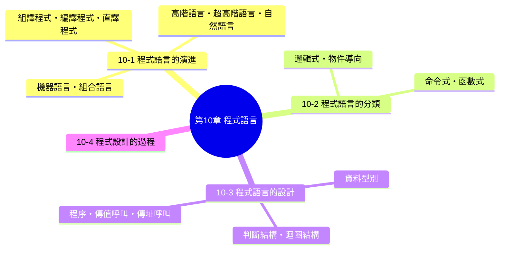
```mermaid
mindmap
  root((第10章 程式語言))
    10-1 程式語言的演進
      機器語言‧組合語言
      高階語言‧超高階語言‧自然語言
      組譯程式‧編譯程式‧直譯程式
    10-2 程式語言的分類
      命令式‧函數式
      邏輯式‧物件導向
    10-3 程式語言的設計
      資料型別
      判斷結構‧迴圈結構
      程序‧傳值呼叫‧傳址呼叫
    10-4 程式設計的過程
```

**核心概念：**

1. 程式語言不是一夕之間就長成今天的樣子，它經歷了從「機器聽得懂但人看不懂」到「人看得懂、機器需要翻譯」的五代演進，理解這條演進脈絡，才能明白為什麼今天幾乎沒有人直接用機器語言寫程式。
2. 程式語言依照「解決問題的思考方式」可以分成命令式、函數式、邏輯式、物件導向四大典範，同一個問題，用不同典範的語言來解，寫法可能天差地遠。
3. 不管用哪種程式語言，「資料型別、判斷結構、迴圈結構、程序呼叫」這幾個基本設計元素幾乎是所有程式語言的共同骨架——學會用流程圖畫出判斷與迴圈結構、學會追蹤程式碼的執行結果，是這一章最重要的實作能力。

---

## 10-1　程式語言的演進

**指令（instruction）** 是指揮電腦完成一項基本任務的命令，**程式（program）** 是一組有順序的指令集合，而**程式語言（program language）** 則是用來撰寫程式的語言，演進如下：

- 第一代語言－機器語言
- 第二代語言－組合語言
- 第三代語言－高階語言
- 第四代語言－超高階語言
- 第五代語言－自然語言

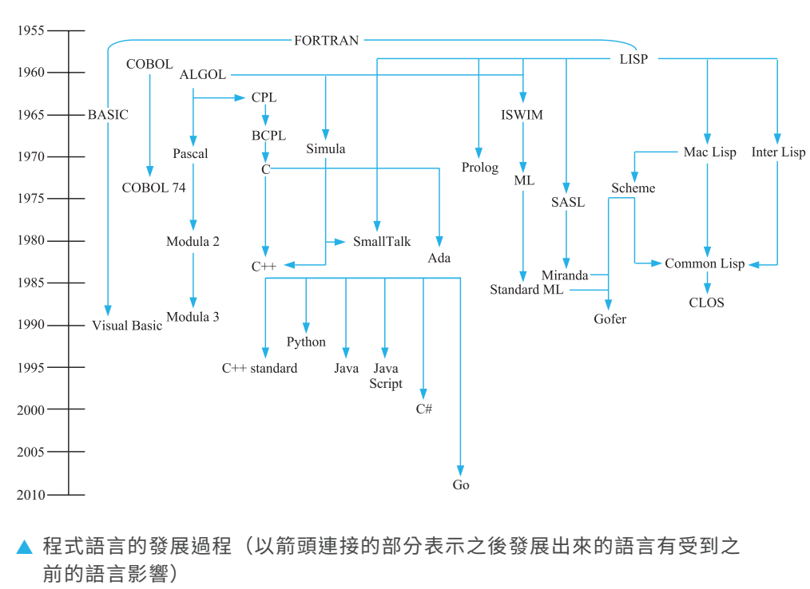

### 10-1-1　第一代語言－機器語言

**機器語言（machine language）** 的每個指令都是由 0 與 1 組合而成，包含了**運算碼（op-code）**與**運算元（operand）**兩個部分。屬於機器相關語言，不具有可攜性——也就是說，同一段機器語言程式，換一台不同架構的電腦幾乎就無法直接執行，因為不同 CPU 架構的機器語言指令編碼方式並不相同。

### 10-1-2　第二代語言－組合語言

**組合語言（assembly language）** 所撰寫的程式必須經過**組譯程式（assembler）**轉換成目的碼或機器語言，才能執行。組合語言用比較接近英文的「助憶符號」（例如 LDA、ADD、STA）取代機器語言的 0、1 數字組合，大幅提升了人類閱讀與撰寫程式的方便性，但仍然需要對電腦硬體架構有相當程度的了解。

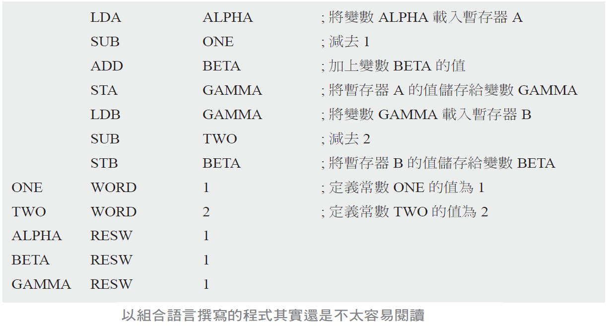

> **課堂重點**：即使組合語言已經比機器語言好讀懂許多，這張範例圖的標題依然寫著「以組合語言撰寫的程式其實還是不太容易閱讀」——像 `LDA ALPHA`（把變數 ALPHA 載入暫存器 A）這樣簡短的指令，做的事情其實非常有限，要完成一個稍微複雜一點的運算，就得寫上一長串指令，這也是後續高階語言誕生的重要推力。

**組譯程式（assembler）** 能夠將以組合語言撰寫的程式轉換成**目的碼（object code）**，裡面包含機器指令、資料值及這些項目的位址。目的碼通常無法直接在記憶體執行，必須透過**載入程式（loader）**載入記憶體執行。

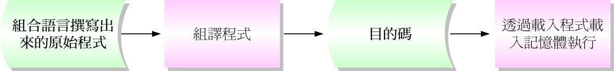

### 10-1-3　第三代語言－高階語言

高階語言的語法近似於英文，屬於機器無關語言，所撰寫的程式必須經過**直譯程式**或**編譯程式**轉換成目的碼或機器語言，才能執行。以高階語言撰寫的程式碼，例如以下 C 語言的例子，明顯比組合語言更接近英文、更容易理解：

```c
int COMPARE(int x, int y)
{
    if (x > y)
        return -1;
    else{
        if (x == y) return 0;
        else return 1;
    }
}
```

### 10-1-4　第四代語言－超高階語言

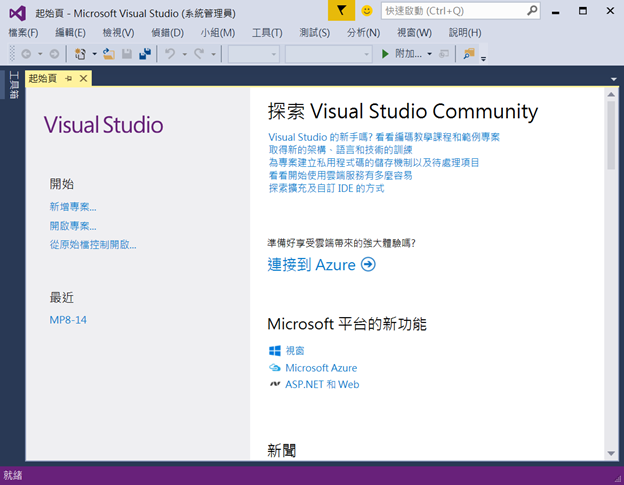

使用者只要在套裝軟體內選取工具、介面、資料庫或控制項，就可以快速完成程式的開發，例如 Visual Studio 提供了 Visual Basic、Visual C++、Visual C# 等程式語言的整合開發環境。

### 10-1-5　第五代語言－自然語言

高階語言的語法雖然近似於英文，但實際上仍有一段差距，而**自然語言（natural language）** 則突破了這些限制，使用者能夠以多種方式來描述同一件事，例如 *Give me the sales report*、*I want the sales report* 是不同的敘述，但電腦程式能同時聽懂並回應成業務報表。

目前電腦處理自然語言的能力正在快速提升，主要是在人工智慧的應用，例如 AI 聊天機器人，並發展出 **Vibe Coding**（一種讓開發者用自然語言描述需求、由 AI 直接生成程式碼的新興開發模式）一詞。

> **課堂重點**：五代語言的演進，其實是一條「愈來愈貼近人類思考方式、愈來愈遠離機器運作邏輯」的道路——機器語言要人「遷就電腦」，自然語言則讓電腦「遷就人」。這條演進路線的代價，是需要愈來愈複雜的翻譯機制（組譯程式、編譯程式、直譯程式，乃至於今天的大型語言模型）在背後默默把人類的意圖轉換成電腦真正看得懂的指令。

### 編譯程式、直譯程式與程式執行的過程

**編譯程式（compiler）** 能夠將以高階語言撰寫的程式轉換成目的碼，裡面包含機器指令、資料值及這些項目的位址，目的碼通常無法直接在記憶體執行，必須透過載入程式載入記憶體執行。編譯程式主要由下列三者所組成：

- **分析程式**（scanner）
- **剖析程式**（parser）
- **目的碼產生程式**（code generator）

**直譯程式（interpreter）** 和編譯程式一樣會根據文法對原始程式進行語法分析及語意剖析，不同的是**直譯程式不會產生目的碼，而是每翻譯一行敘述，就立刻執行該敘述**。

程式執行的過程如下：

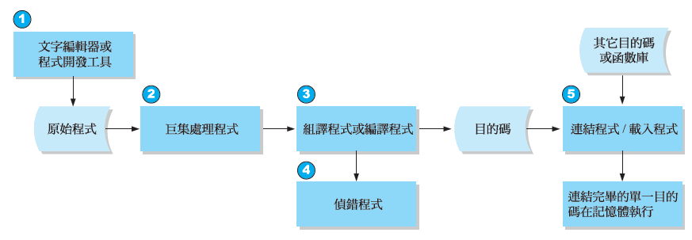

> **課堂重點（呼應學習評量第 13 題）**：**編譯程式**是把整份程式「一次全部翻譯完」再執行，好處是執行速度快（翻譯好之後就能重複執行、不用每次都重新翻譯），但翻譯過程需要花時間，而且要等全部翻譯完才能開始執行、發現錯誤；**直譯程式**則是「翻一句、做一句」，好處是可以立即看到執行結果、方便除錯，但因為每次執行都要重新翻譯一次，執行速度通常比編譯後的程式慢。**C、C++、FORTRAN 屬於編譯式語言；Python、JavaScript 則是典型的直譯式語言**——這正是本章學習評量第 13 題的判斷依據。

---

## 10-2　程式語言的分類

程式語言依照解決問題的思考方式（典範，paradigm），可以分成下列四大類型：

### 10-2-1　命令式

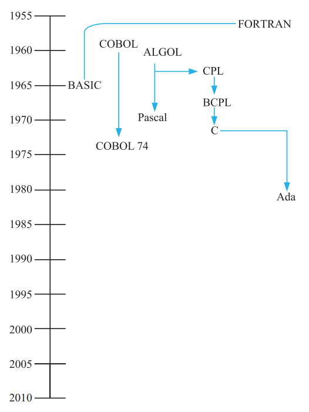

**命令式（imperative paradigm）** 是傳統的程式設計過程，又稱為**程序式（procedural paradigm）**，整個程式是由一連串的命令與敘述所組成，只要逐步執行這些命令與敘述，就能得到結果。知名的命令式程式語言包括 FORTRAN、COBOL、ALGOL、BASIC、Pascal、C 等。

### 10-2-2　函數式

**函數式（functional paradigm）** 程式語言的代表首推 **LISP**，其它知名的還有 ML、Miranda、Gofer、Scheme、CLOS 等，它是將整個程式視為數個基本函數的組合，例如：

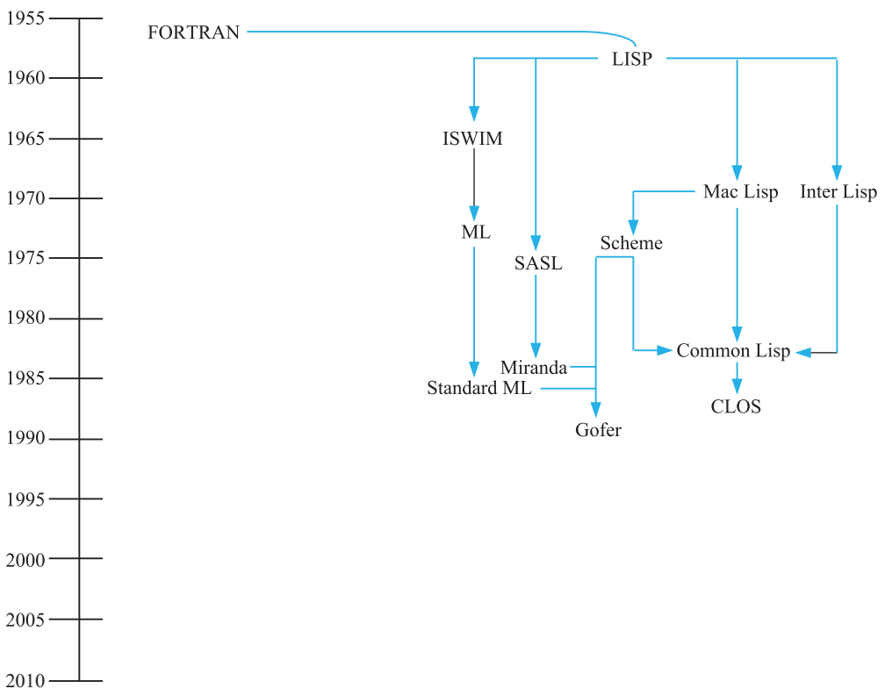

```lisp
(define (length x)
  (cond ((null? X) 0)
        (else (+ 1 (length (cdr x))))))

(define (append x z)
  (cond ((null? x) z)
        (else (cons (car x) (append (cdr x) z)))))

(define (square n) (* n n))
(map square '(1 2 3 4 5))

(define x 0)
(let ((x 2) (y x)) y)
(let* ((x 2) (y x)) y)
```

> **課堂重點**：函數式語言最大的特色，是把「計算」看成數學上函數的求值過程，**盡量避免像命令式語言那樣改變變數的狀態（side effect）**——這正是上面範例中 `let` 與 `let*` 的差異所在：`let` 裡面的 `y x` 用的是外層原本的 `x`（結果 `y` 得到 0），`let*` 則允許依序使用同一個 `let*` 區塊中剛剛定義好的 `x`（結果 `y` 得到 2），這種「值從哪裡來」必須被精確定義清楚的特性，正是函數式語言的設計精神。

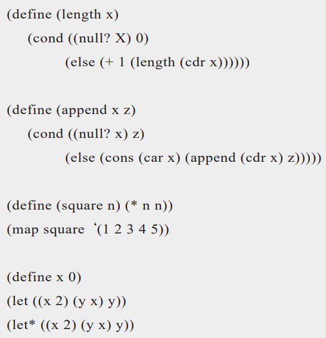

### 10-2-3　邏輯式

**邏輯式（logic paradigm）** 程式語言的代表首推 **PROLOG**，由於具有邏輯推理性，故應用至搜尋資料庫、定義演算法、研究人工智慧、開發專家系統。下面是一個例子：假設系統存在著如下規則：

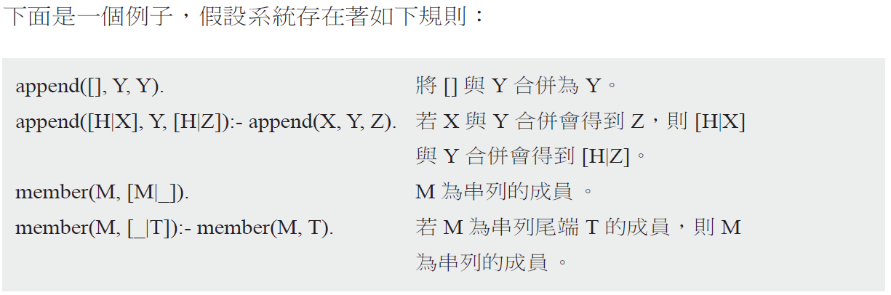

```prolog
append([], Y, Y).
append([HX], Y, [HZ]) :- append(X, Y, Z).

member(M, [M_]).
member(M, [_T]) :- member(M, T).
```

（第 1 行：若 X 合併 Y 得到 Y，即代表 X 為空串列；第 2 行：若 X 與 Y 合併得到得到 Z、則 [HX] 與 Y 合併會得到 [HZ]；第 3 行：M 為串列的成員；第 4 行：若 M 為串列尾端 T 的成員，則 M 為串列 [_T] 的成員）

理解這兩個規則的意義後，我們就可以來進行查詢：

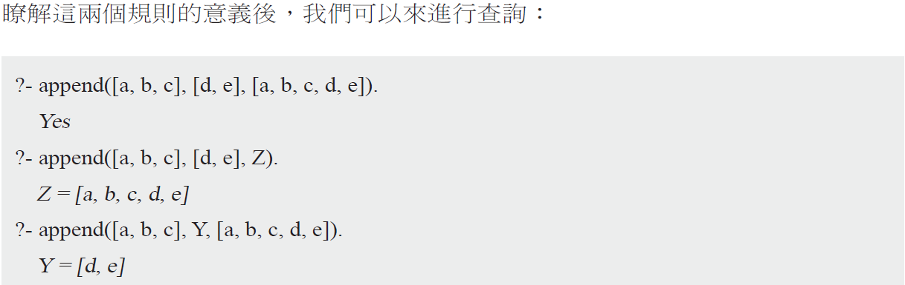

```prolog
?- append([a, b, c], [d, e], Y).
Yes
?- append([a, b, c], [d, e], Z).
Z = [a, b, c, d, e]
?- append([a, b, c], Y, [a, b, c, d, e]).
Y = [d, e]
```

> **課堂重點**：邏輯式語言與前面命令式、函數式語言最大的不同，在於**程式設計人員不需要告訴電腦「該怎麼做（how）」，只需要告訴電腦「事實與規則是什麼（what）」**，然後由 PROLOG 內建的推理引擎，自動去搜尋符合規則的答案。這種「宣告式」的思考方式，特別適合用在需要大量邏輯推理與搜尋的應用場景，例如專家系統、自然語言處理的早期研究。

### 10-2-4　物件導向

**物件導向程式設計（OOP，Object Oriented Programming）** 是軟體發展過程中極具影響性的突破，優點是物件可以在不同的應用程式中被重複使用。

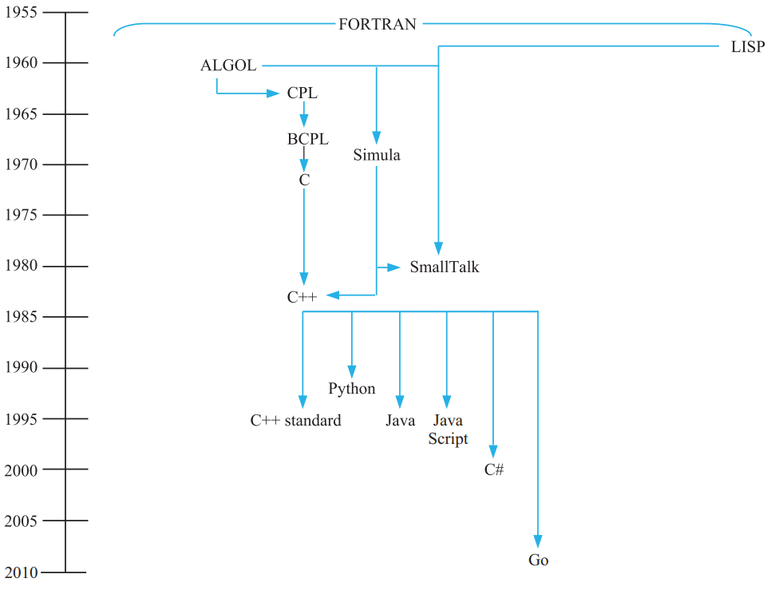

知名的物件導向式程式語言包括 Simula、SmallTalk、C++、Java、Python、C#、Go 等，其中：

- **C++** 為 AT&T 貝爾實驗室承襲 C 語言的理念所發展出的物件導向式語言。
- **Java** 為 Sun 公司承襲 C++ 的理念所發展出來的物件導向程式語言。
- **C#** 是 Microsoft 公司根據 C/C++ 所發展出的程式語言，具有跨平台、型別安全、物件導向等特性。C# 的語法類似 C/C++ 和 Java，因此，熟悉 C/C++ 或 Java 的人很快就能學會 C#。
- **Python** 是荷蘭程式設計師 Guido van Rossum 於 1990 年代初期所發展，具有語法簡潔、跨平台、直譯式等特性，非常適合機器學習、深度學習、自然語言處理、電腦視覺、大數據分析、科學計算、網路程式設計、遊戲開發等。
- **JavaScript** 是 Netscape 公司於 1995 年針對 Netscape Navigator 瀏覽器的應用所開發的程式語言，之後 Netscape 公司將 JavaScript 交給國際標準組織 ECMA 進行標準化，稱為 ECMAScript（ECMA-262）。
- **Go**（又稱為 Golang）是由 Google 於 2007 年開始開發，並於 2009 年首次發表的程式語言，具有單純易學、高效能、物件導向、跨平台、開放原始碼等特點。

### 各種程式語言的程式碼範例

<table>
<tr>
<td width="50%">

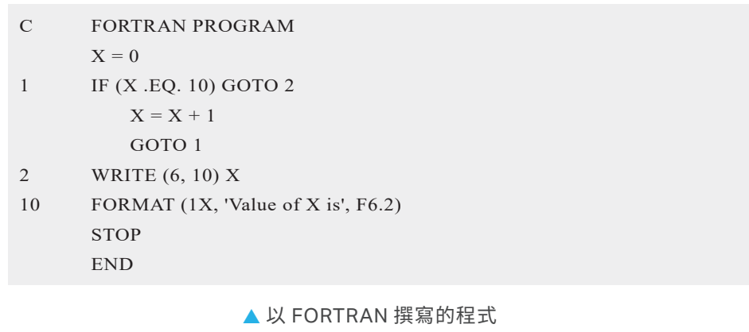
*以 FORTRAN 撰寫的程式*

</td>
<td width="50%">

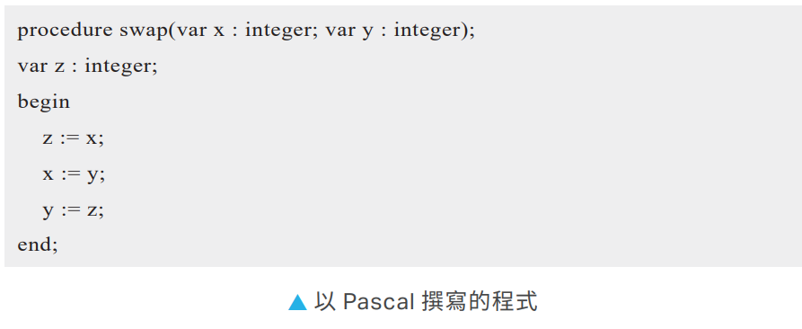
*以 Pascal 撰寫的程式*

</td>
</tr>
<tr>
<td width="50%">

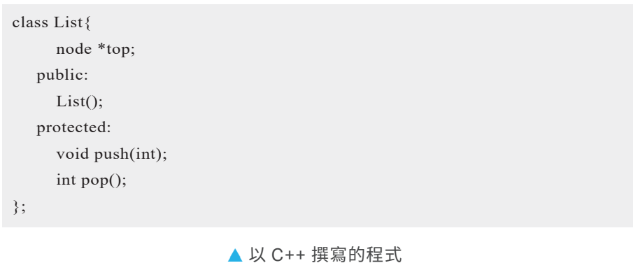
*以 C++ 撰寫的程式*

</td>
<td width="50%">

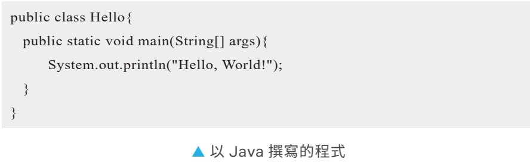
*以 Java 撰寫的程式*

</td>
</tr>
<tr>
<td width="50%">

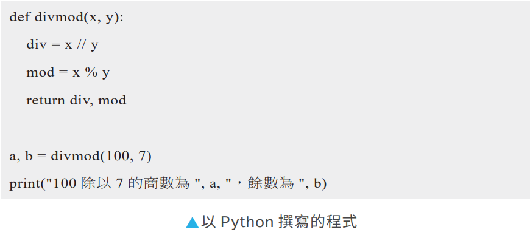
*以 Python 撰寫的程式*

</td>
<td width="50%">

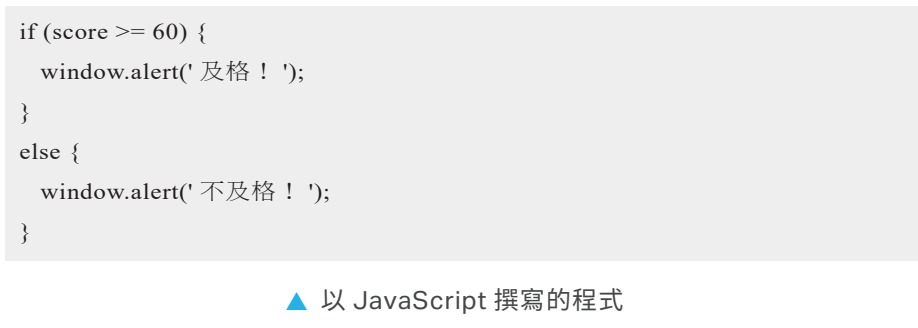
*以 JavaScript 撰寫的程式*

</td>
</tr>
<tr>
<td width="50%">

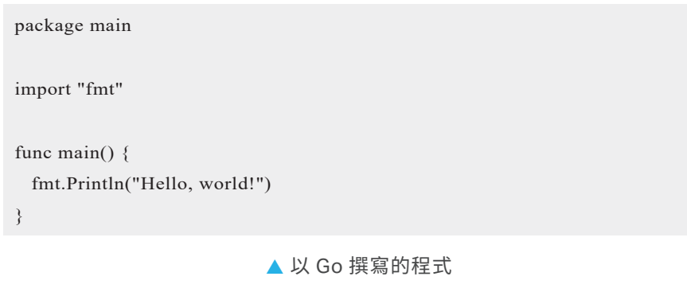
*以 Go 撰寫的程式*

</td>
<td width="50%"></td>
</tr>
</table>

> **課堂討論**：比較上面幾段程式碼，觀察即使是完成類似的工作（定義函式、輸出訊息），不同語言在語法風格上的差異——例如 Python 不需要用大括號 `{}` 界定程式區塊、而是靠**縮排**；Go 語言的函式定義使用 `func` 關鍵字且回傳型別寫在參數之後；C++、Java 則需要明確宣告類別（class）結構。這種「殊途同歸」的觀察，有助於建立跨語言遷移的學習信心。

## 10-3　程式語言的設計

不管使用哪一種程式語言，幾乎都會包含「資料型別」、「流程控制」、「程序」這三大設計元素。

### 10-3-1　資料型別

**資料型別（data type）** 決定了資料將占用的記憶體空間、能夠表示的範圍及程式處理資料的方式。

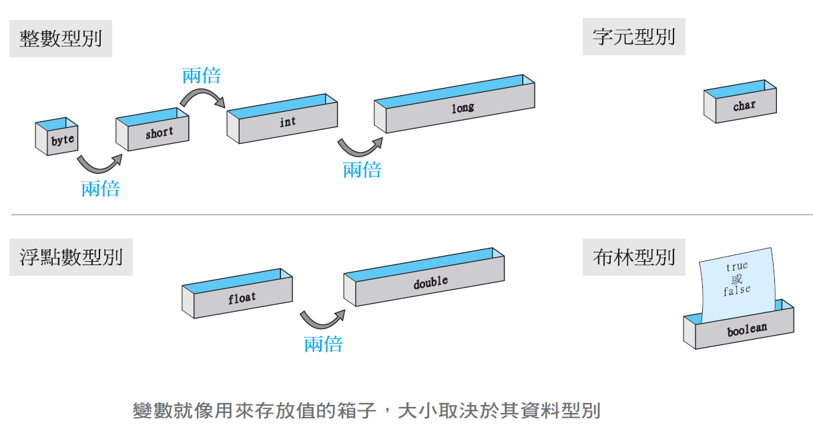

- **變數（variable）**：程式執行過程中，其值可以被改變的資料。
- **常數（constant）**：程式執行過程中，其值不能被改變的資料。例如：

```c
final float PI = 3.14159;
```

- **列舉（enum）**：把一組有限的、有意義的名稱集合起來，例如：

```c
enum weekdays {sun, mon, tue, wed, thu, fri, sat};
```

- **結構（struct）**：把多個不同型別的資料組合成一個新的複合型別，例如：

```c
struct card{
    int pips;
    char suit;
};
```

- **陣列（array）**：陣列雖然只有一個名稱，卻可以用來存放多個資料：

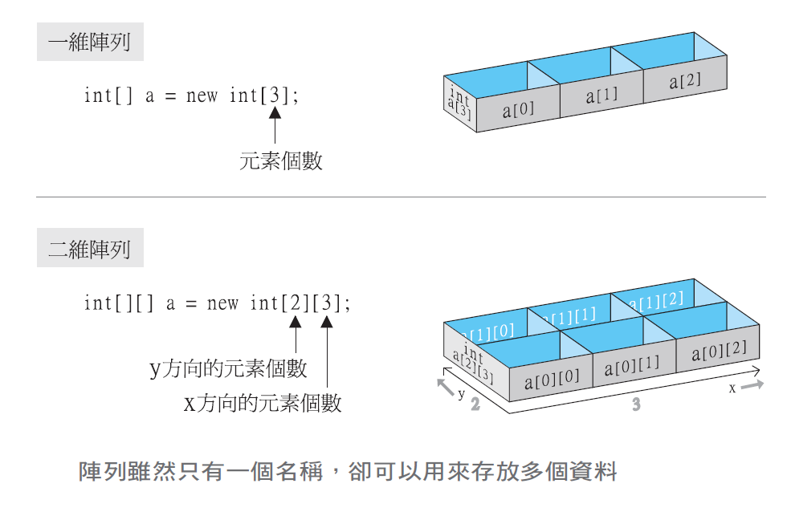

```c
// 一維陣列
int[] a = new int[3];

// 二維陣列
int[][] a = new int[2][3];
```

> **課堂重點（呼應學習評量第 9 題）**：**陣列最適合用來存放一連串具有相同型別的資料**——例如一次要記錄全班 30 位同學的分數，宣告一個長度 30 的整數陣列，就能用同一個變數名稱、透過索引（index）來存取每一筆分數，不需要另外宣告 30 個獨立的變數，這正是陣列存在的核心價值。

### 10-3-2　流程控制

流程控制決定了程式敘述執行的順序，主要分成**判斷結構**與**迴圈結構**兩大類。

#### 判斷結構

**第一種：單向判斷（if）**

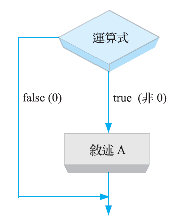

```
if (expression)
    statementA
```

只有當運算式（expression）成立（非 0，也就是 true）時，才會執行敘述 A；不成立（0，也就是 false）則直接跳過，繼續往下執行。

**第二種：雙向判斷（if-else）**

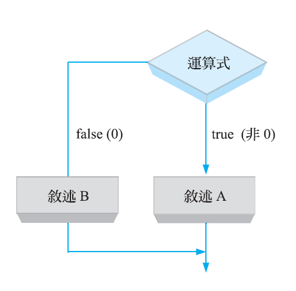

```
if (expression)
    statementA
else
    statementB
```

運算式成立執行敘述 A，不成立則執行敘述 B，兩者只會擇一執行。

**第三種：多向判斷（switch-case）**

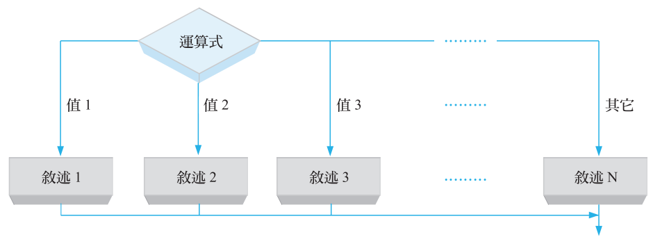

```
switch (expression){
    case value1:
        statement
    case value2:
        statement
    …
    default:
        statementN
}
```

依照運算式的結果，比對符合哪一個 `case` 的數值，就執行對應的敘述；如果都不符合，則執行 `default` 底下的敘述。適合用在需要根據同一個變數的多種可能數值，分別執行不同動作的情境（例如依照月份判斷該月有幾天）。

#### 迴圈結構

**第一種：前測式迴圈（while）**

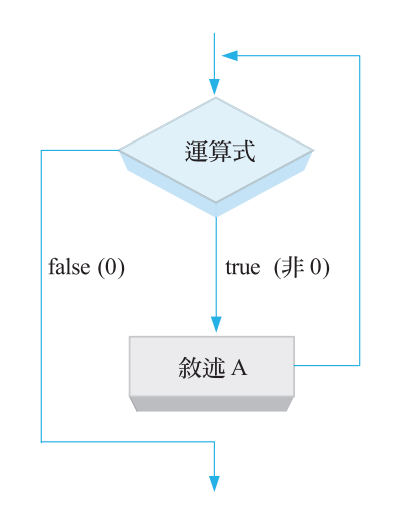

```
while(expression)
    statementA
```

**先檢查**運算式是否成立，成立才執行敘述 A，執行完再回頭檢查一次，直到運算式不成立為止——因此 while 迴圈有可能**一次都不執行**（如果一開始運算式就不成立）。

**第二種：後測式迴圈（do-while）**

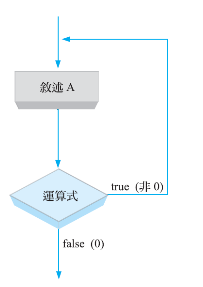

```
do
    statementA
while(expression);
```

**先執行**一次敘述 A，執行完之後才檢查運算式是否成立，成立就再執行一次，直到運算式不成立為止——因此 do-while 迴圈**至少會執行一次**，即使一開始運算式就不成立，這是 while 與 do-while 兩者最關鍵的差異。

**第三種：計數式迴圈（for）**

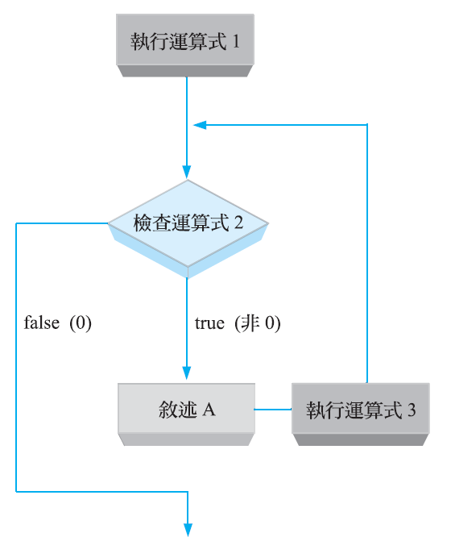

```
for(expression1, expression2, expression3)
    statementA
```

`expression1` 通常是初始化（例如設定計數器的起始值）、`expression2` 是終止條件（決定何時停止迴圈）、`expression3` 通常是每次迴圈執行完後的遞增或遞減動作。for 迴圈把「初始化、條件判斷、遞增遞減」三件事集中寫在同一行，特別適合用在「已知要重複執行固定次數」的情境。

> **課堂重點（呼應學習評量第 11 題與練習題第 4、5、6 題）**：`if`、`switch` 屬於**判斷結構**，並不是迴圈；只有 `for`、`while`、`do-while` 三者才屬於**迴圈控制結構**，這是最基本、也最容易在選擇題中被拿來混淆的分類問題。三種迴圈的核心差異，可以用「檢查時機」來記憶：**while 先檢查再做（可能一次都不做）、do-while 先做再檢查（至少做一次）、for 適合已知重複次數的情境**。

### 10-3-3　程序

**程序（procedure）** 是將一段具有某種功能或重複使用的敘述寫成獨立的程式單元，然後給予名稱，供後續呼叫使用。

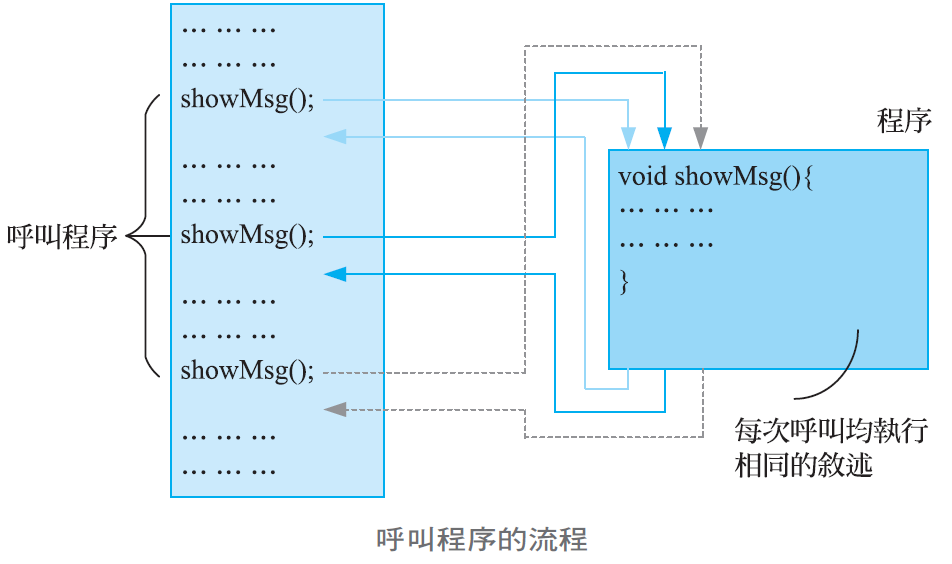

<table>
<tr>
<td width="50%">

上圖左側是「呼叫程序」，右側是被呼叫的「程序」本身（`showMsg()`）。每次呼叫程序中執行到 `showMsg();` 時，程式的執行流程就會跳轉到程序內部，執行完程序裡的敘述後，再跳回呼叫的地方繼續往下執行。**這樣做的好處是同一段敘述不必重複撰寫很多次，只要寫成一個程序，需要用到的地方直接呼叫即可**，大幅提升程式碼的重複利用性與維護性。

</td>
<td width="50%">

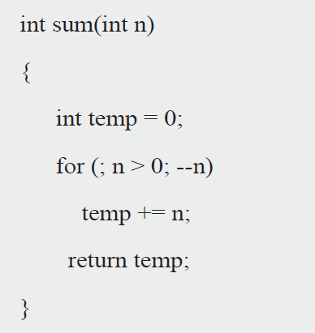

</td>
</tr>
</table>

### 傳值呼叫 vs. 傳址呼叫

呼叫程序、傳遞參數的方式，主要分成兩種：

**傳值呼叫（call by value）**


```c
main()
{
    int x = 1, y = 100;
    swap(x, y);
    printf("%d %d\n", x, y);  /* 會印出 1  100*/
}

swap(int i, int j)
{
    int temp;
    temp = i;
    i = j;
    j = temp;
}
```

傳值呼叫時，程序接收到的只是原變數**數值的副本**，程序內部對參數的任何修改，**都不會影響到原本呼叫端的變數**——這正是上面範例中，即使 `swap` 函式內部確實交換了 `i` 與 `j` 的值，但呼叫端的 `x`、`y` 最終仍然維持原值（1、100）沒有被交換的原因。

**傳址呼叫（call by reference）**

```c
main()
{
    int x = 1, y = 100;
    swap(&x, &y);
    printf("%d %d\n", x, y);  /* 會印出 100  1*/
}

swap(int *i, int *j)
{
    int temp;
    temp = *i;
    *i = *j;
    *j = temp;
}
```

傳址呼叫時，程序接收到的是原變數在記憶體中的**位址**，程序內部透過這個位址直接存取、修改原變數的內容，因此**程序內部的修改，會直接反映到呼叫端的原變數上**——這正是上面範例中，呼叫 `swap(&x, &y)` 之後，呼叫端的 `x`、`y` 真的被交換成了（100、1）的原因。

> **課堂重點**：傳值呼叫與傳址呼叫最關鍵的差異，可以用一句話總結——**傳值呼叫像是給對方一份「影印本」，對方在影印本上塗改，不會影響到你手上的正本；傳址呼叫則是直接把「正本的所在位置（地址）」告訴對方，對方直接跑去修改正本本身**。這也是為什麼上面兩段程式碼，明明都呼叫了功能相同的 `swap` 函式，最終印出的結果卻完全不同（傳值呼叫印出未交換的 1 100；傳址呼叫印出已交換的 100 1）。

---

## 10-4　程式設計的過程

完整的程式設計過程通常包含下列五個步驟：

1. **定義與分析問題**：釐清程式要解決的問題究竟是什麼，需要哪些輸入、要產生哪些輸出。
2. **設計演算法**：規劃解決問題的具體步驟與邏輯，常用流程圖或虛擬碼（pseudocode）來表達。
3. **撰寫程式**：選定程式語言，把設計好的演算法實際轉換成程式碼。
4. **偵錯與測試**：檢查程式是否有語法錯誤（編譯期就能抓到）或邏輯錯誤（要靠測試各種情境才能發現），確保程式的執行結果符合預期。
5. **維護與更新**：程式上線後，仍需要持續依照使用者的回饋、需求變化或環境改變，進行修正與更新。

> **課堂重點（呼應學習評量第 10 題）**：這五個步驟的**順序不能顛倒**——一定要先清楚定義問題，才能設計出對應的演算法；演算法設計好，才能據此撰寫程式；程式寫完才能進行偵錯與測試；上線之後才會進入長期的維護與更新階段。常見的誤區是「還沒想清楚問題就急著動手寫程式」，這往往會導致程式寫到一半才發現方向錯誤，必須大幅修改甚至砍掉重練，白白浪費許多時間。

### 資訊部落：網頁設計相關的程式語言

常見的如下：

<table>
<tr>
<td width="50%">

- **HTML**（HyperText Markup Language）
- **CSS**（Cascading Style Sheets）
- **用戶端 Scripts**
  - JavaScript
- **伺服器端 Scripts**
  - PHP、Java、C#（搭配 ASP.NET）、Python（搭配 Django、Flask）、JavaScript（搭配 Node.js）、Go 等

</td>
<td width="50%">

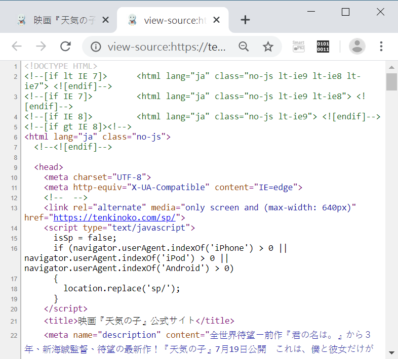<br>
<i>網頁的原始碼</i>
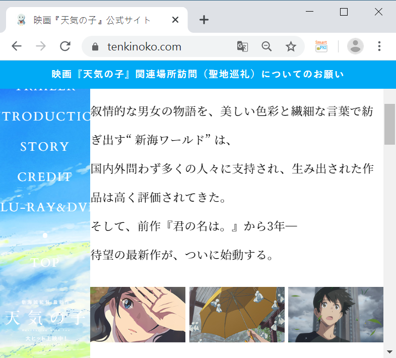<br>
<i>網頁的瀏覽結果</i>

</td>
</tr>
</table>

> **課堂重點**：網頁設計的程式語言可以分成「使用者看得到成果、但看不到程式碼」的**伺服器端**語言（例如 PHP、Java 在伺服器上執行完，只把最終結果的 HTML 送到瀏覽器），以及「程式碼本身會被下載到使用者的瀏覽器上執行」的**用戶端**語言（例如 JavaScript）。HTML、CSS 本身嚴格來說並不是「程式語言」（沒有邏輯運算能力），而是分別負責網頁的**內容結構**與**外觀樣式**的標記語言。

---

## 本章總結

| 小節 | 核心觀念一句話 |
|---|---|
| 10-1 程式語言的演進 | 機器語言到自然語言的五代演進，愈晚期愈貼近人類思考、愈需要複雜翻譯機制 |
| 10-2 程式語言的分類 | 命令式重步驟、函數式重函數組合、邏輯式重規則推理、物件導向重物件重用 |
| 10-3 程式語言的設計 | 資料型別、判斷/迴圈結構、程序呼叫是幾乎所有程式語言的共同骨架 |
| 10-4 程式設計的過程 | 定義問題→設計演算法→撰寫程式→偵錯測試→維護更新，順序不可顛倒 |

### 關鍵詞彙表（Glossary）

`指令` `程式` `程式語言` `機器語言` `組合語言` `組譯程式` `目的碼` `載入程式` `高階語言` `超高階語言` `自然語言` `Vibe Coding` `編譯程式` `直譯程式` `分析程式` `剖析程式` `目的碼產生程式` `命令式` `函數式` `邏輯式` `物件導向` `資料型別` `變數` `常數` `列舉` `結構` `陣列` `判斷結構` `if` `if-else` `switch-case` `迴圈結構` `while` `do-while` `for` `程序` `傳值呼叫` `傳址呼叫`

---

## 第 10 章　學習評量

> 以下為課本第 10 章隨附之官方學習評量，題目逐字謄錄。答案為課本官方解答，並在其下補充**完整解說**，方便課堂上直接點開講解、對答案。

### 一、選擇題

**1. 下列何者的執行速度最快？**
A. 機器語言　B. 組合語言　C. BASIC　D. C++

<details>
<summary>▶ 參考答案與解說</summary>

**答案：A　機器語言**

機器語言是 CPU 可以直接執行的 0、1 指令，不需要經過任何翻譯轉換的過程，因此執行速度最快。組合語言需要經過組譯程式轉換；BASIC、C++ 屬於高階語言，需要經過直譯或編譯程式轉換成機器語言才能執行，都比機器語言多了一層（或多層）轉換的時間成本。

</details>

---

**2. 下列關於程序的敘述何者錯誤？**
A. 可提高程式的執行速度　B. 可提高程式的可讀性　C. 可使程式的結構較清晰　D. 利於多人分工共同完成較大的程式

<details>
<summary>▶ 參考答案與解說</summary>

**答案：A（此為錯誤敘述）**

使用程序（procedure）主要的好處是提高程式的**可讀性**、讓程式**結構更清晰**、方便**多人分工**開發較大型的程式（每人負責不同程序）。但呼叫程序本身需要額外的跳轉與返回開銷，**並不會提高程式的執行速度**，甚至可能因為多了呼叫的額外負擔而略微降低執行效率，這是選項 A 錯誤之處。

</details>

---

**3. 下列何者不是高階語言優於低階語言的地方？**
A. 可讀性較高　B. 執行速度較快　C. 學習容易　D. 具有可攜性

<details>
<summary>▶ 參考答案與解說</summary>

**答案：B（此為錯誤敘述）**

高階語言的語法貼近英文，可讀性較高、較容易學習，而且是機器無關語言，具有良好的可攜性（同一份原始碼，換一台電腦重新編譯或直譯後大多能繼續執行）。但高階語言需要經過編譯或直譯轉換成機器語言才能執行，這個轉換過程會產生額外的負擔，**執行速度通常比直接執行機器語言或組合語言慢**，因此「執行速度較快」並不是高階語言優於低階語言的地方。

</details>

---

**4. 下列何者不屬於高階語言？**
A. Ada　B. Python　C. 機器語言　D. Go

<details>
<summary>▶ 參考答案與解說</summary>

**答案：C　機器語言**

機器語言是**第一代語言**，由 0、1 組成，並非高階語言。Ada、Python、Go 都是語法貼近英文、機器無關的高階語言。

</details>

---

**5. 下列何者可以將組合語言撰寫的程式轉換成機器語言？**
A. 編譯程式　B. 直譯程式　C. 翻譯程式　D. 組譯程式

<details>
<summary>▶ 參考答案與解說</summary>

**答案：D　組譯程式**

組譯程式（assembler）的定義正是將以組合語言撰寫的程式轉換成目的碼或機器語言。編譯程式、直譯程式是用來轉換**高階語言**撰寫的程式；「翻譯程式」並非本章介紹的正式名詞。

</details>

---

**6. 下列關於 Java 的敘述何者錯誤？**
A. 可攜性高　B. Java 和 C++ 一樣能夠處理指標　C. 屬於物件導向式語言　D. Java 程式的執行速度通常比 C 慢

<details>
<summary>▶ 參考答案與解說</summary>

**答案：B（此為錯誤敘述）**

Java 基於安全性與穩定性的考量，**刻意不提供 C++ 那種可以直接操作記憶體位址的指標（pointer）功能**，這是 Java 與 C++ 的重要差異之一，因此選項 B 的敘述錯誤。Java 確實具有高可攜性（「一次編寫、到處執行」是 Java 的招牌特色）、屬於物件導向式語言，而且由於 Java 程式是先編譯成中介的位元碼（bytecode）再透過虛擬機器執行，執行速度通常比直接編譯成機器碼的 C 慢。

</details>

---

**7. 下列哪個程式語言不適合用來從事網頁設計？**
A. 組合語言　B. HTML　C. PHP　D. CSS

<details>
<summary>▶ 參考答案與解說</summary>

**答案：A　組合語言**

組合語言是與特定機器硬體架構緊密相關的低階語言，並非為了網頁設計而生，完全不適合用來從事網頁設計。HTML、CSS、PHP 都是本章「資訊部落」介紹過的網頁設計相關語言。

</details>

---

**8. 下列何者不是物件導向式程式語言？**
A. C#　B. Python　C. C　D. Java

<details>
<summary>▶ 參考答案與解說</summary>

**答案：C　C**

C 語言是**命令式（程序式）**程式語言，並不支援物件導向的類別、繼承、多型等特性（C++ 才是在 C 的基礎上加入物件導向特性而發展出來的語言）。C#、Python、Java 皆是本章介紹過的物件導向式程式語言代表。

</details>

---

**9. 下列何者最適合用來存放一連串具有相同型別的資料？**
A. 陣列　B. 字串　C. 浮點數　D. 結構

<details>
<summary>▶ 參考答案與解說</summary>

**答案：A　陣列**

陣列（array）的設計目的正是用同一個變數名稱，透過索引存放與存取一連串具有**相同型別**的資料。字串是字元陣列的一種特例；浮點數是單一數值的資料型別；結構則是用來組合**不同型別**資料的複合型別，皆不符合本題「一連串相同型別資料」的描述。

</details>

---

**10. 下列何者是正確的程式設計過程？**
A. 設計演算法、定義問題、撰寫程式、測試與偵錯、維護與更新　B. 定義問題、設計演算法、撰寫程式、測試與偵錯、維護與更新　C. 定義問題、撰寫程式、設計演算法、測試與偵錯、維護與更新　D. 設計演算法、定義問題、撰寫程式、維護與更新、測試與偵錯

<details>
<summary>▶ 參考答案與解說</summary>

**答案：B**

正確的程式設計過程依序為：**定義與分析問題 → 設計演算法 → 撰寫程式 → 偵錯與測試 → 維護與更新**，順序不能顛倒——必須先清楚定義問題，才能據此設計演算法；演算法確立後才進行程式撰寫；程式寫完才能測試除錯；上線後才進入長期維護階段。

</details>

---

**11. 下列何者不屬於迴圈控制結構？**
A. if　B. for　C. do　D. while

<details>
<summary>▶ 參考答案與解說</summary>

**答案：A　if**

`if` 屬於**判斷結構**，用來依條件決定是否執行某段敘述，並不會重複執行，因此不屬於迴圈控制結構。`for`、`do`（do-while）、`while` 都是本章介紹的三種迴圈結構。

</details>

---

**12. 在進行網頁設計時，下列何者不屬於伺服器端 Script？**
A. ASP　B. CGI　C. PHP　D. JavaScript

<details>
<summary>▶ 參考答案與解說</summary>

**答案：D　JavaScript**

JavaScript 原生設計上主要是**用戶端**（client-side）Script，程式碼會被下載到使用者的瀏覽器上執行（雖然搭配 Node.js 也能用於伺服器端，但依課本分類，JavaScript 歸類於用戶端 Script）。ASP、CGI、PHP 則都是在伺服器端執行、處理完後才把結果送回瀏覽器的伺服器端 Script 技術。

</details>

---

**13. 下列哪個程式語言是以直譯方式執行？**
A. C#　B. FORTRAN　C. C　D. Python

<details>
<summary>▶ 參考答案與解說</summary>

**答案：D　Python**

Python 是典型的**直譯式**語言，程式執行時是一行一行被直譯程式翻譯並立即執行。C#、FORTRAN、C 則都需要先經過**編譯**，產生目的碼或執行檔之後才能執行，屬於編譯式語言。

</details>

---

**14. 為了降低維護程式的困難度，下列何者錯誤？**
A. 加入註解　B. 撰寫說明文件　C. 活用小技巧　D. 遵守程式碼撰寫慣例

<details>
<summary>▶ 參考答案與解說</summary>

**答案：C（此為錯誤敘述）**

「活用小技巧」聽起來像是聰明的做法，但程式設計中過度取巧、標新立異的寫法（例如刻意精簡到難以理解的一行流語法），往往會**犧牲程式碼的可讀性**，讓其他人（甚至未來的自己）難以理解與維護，反而**提高**了維護的困難度。加入註解、撰寫說明文件、遵守程式碼撰寫慣例（coding convention）才是真正能降低維護困難度的正確做法。

</details>

---

**15. 下列何者是正確的程式執行過程？**
A. 編譯、編輯、偵錯、連結／載入　B. 編輯、編譯、連結／載入、偵錯　C. 編輯、連結／載入、編譯、偵錯　D. 編輯、編譯、連結／載入、偵錯

<details>
<summary>▶ 參考答案與解說</summary>

**答案：D**

正確的程式執行過程依序為：**編輯**（撰寫原始碼）→ **編譯**（轉換成目的碼）→ **連結／載入**（連結所需的函式庫、載入記憶體）→ **偵錯**（執行並檢查結果、修正錯誤），這與 10-1 節「程式執行的過程」示意圖的流程一致。

</details>

### 二、練習題

**1. 簡單說明「機器相關」、「可攜性」、「跨平台」的意義。**

<details>
<summary>▶ 參考答案</summary>

不同的電腦平台有不同的機器語言，撰寫出來的程式無法互相移植，必須重新撰寫以符合電腦平台的暫存器組態與指令集，這種與特定硬體架構緊密綁定、無法直接搬到別的平台使用的特性，就稱為**「機器相關」**；相對地，**「可攜性」（portability）** 指的是程式不依賴特定硬體架構，可以在不同的電腦平台上執行或經過重新編譯後執行；**「跨平台」** 則是可攜性的具體展現，意指同一份程式碼（或經過少量修改）能夠在 Windows、macOS、Linux 等不同作業系統或硬體架構上順利運作。

</details>

---

**2. 簡單比較低階語言與高階語言的優缺點。**

<details>
<summary>▶ 參考答案</summary>

高階語言的優點是與機器無關，具有可攜性，容易閱讀與學習，函式庫可以擴充，缺點則是需要經過編譯程式或直譯程式轉換成機器語言，執行速度較慢，而且多了變數宣告、函式呼叫、迴圈、流程控制等敘述，所占用的記憶體較大；反之，低階語言的優點是執行速度較快，而且少了變數宣告、函式呼叫、迴圈、流程控制等敘述，所占用的記憶體較小，缺點則是與機器相關，不具有可攜性，不易閱讀與學習。

</details>

---

**3. 分別舉出三種屬於命令式、函數式及物件導向式程式語言。**

<details>
<summary>▶ 參考答案</summary>

**命令式**：Basic、COBOL、Pascal、C…（任舉三項）；**函數式**：LISP、ML、Miranda、Gofer、Scheme、CLOS…（任舉三項）；**物件導向式**：C++、C#、Java…（任舉三項）。

</details>

---

**4. 針對下列程式碼描繪流程圖（此為 Java 語法）：**

```java
if (score >= 60) System.out.println(" 及格！ ");
else System.out.println(" 不及格！ ");
```

<details>
<summary>▶ 參考答案</summary>

這是一個典型的**雙向判斷結構（if-else）**，流程圖畫法請參照 10-3-2 節「第二種判斷結構」：

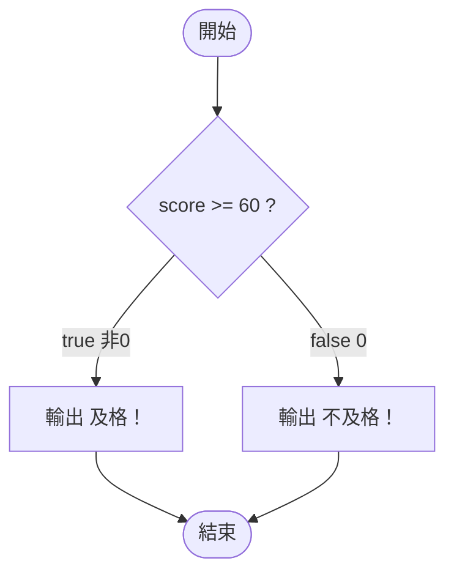
```mermaid
flowchart TD
    A([開始]) --> B{score >= 60 ?}
    B -->|true 非0| C[輸出 及格！]
    B -->|false 0| D[輸出 不及格！]
    C --> E([結束])
    D --> E
```

判斷 `score >= 60` 這個運算式：條件成立（true）就執行「輸出 及格！」；條件不成立（false）就執行「輸出 不及格！」，兩者只會擇一執行，執行完畢後流程圖收斂到同一個結束點。

</details>

---

**5. 寫出下列程式碼的執行結果會顯示什麼？（此為 Java 語法）**

```java
int sum = 0;
for (int i = 2; i <= 10; i+=2) sum = sum + i;
System.out.println("2 到 10 之間所有偶數的總和為 " + sum);
```

<details>
<summary>▶ 參考答案與完整追蹤過程</summary>

**逐步追蹤 `for` 迴圈的執行過程**：`i` 從 2 開始，每次遞增 2，直到 `i` 超過 10 為止，每一輪都把 `i` 累加到 `sum`：

| 迴圈輪次 | i | 執行 sum = sum + i | sum（累加後） |
|---|---|---|---|
| 1 | 2 | 0 + 2 | 2 |
| 2 | 4 | 2 + 4 | 6 |
| 3 | 6 | 6 + 6 | 12 |
| 4 | 8 | 12 + 8 | 20 |
| 5 | 10 | 20 + 10 | 30 |
| — | 12 | 12 > 10，條件不成立，迴圈結束 | — |

答案：**2 到 10 之間所有偶數的總和為 30**

</details>

---

**6. 針對下列程式碼描繪流程圖（此為 Java 語法）：**

```java
do
    System.out.println(++i);
while (i < 10);
```

<details>
<summary>▶ 參考答案</summary>

這是一個典型的**後測式迴圈（do-while）**，流程圖畫法請參照 10-3-2 節「第二種迴圈結構」：

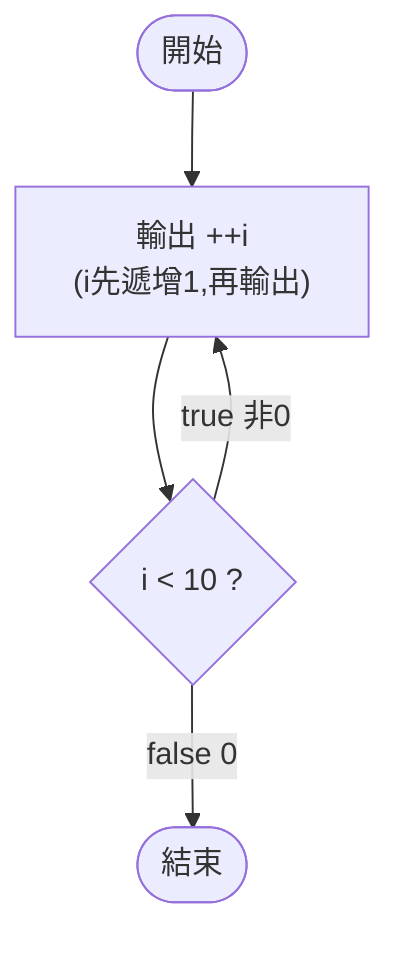
```mermaid
flowchart TD
    A([開始]) --> B["輸出 ++i<br/>(i先遞增1,再輸出)"]
    B --> C{i < 10 ?}
    C -->|true 非0| B
    C -->|false 0| D([結束])
```

**關鍵重點**：do-while 迴圈的特色是**先執行一次敘述，再檢查條件**，因此不論 `i` 一開始的值是多少，`System.out.println(++i);` 這一行**至少會被執行一次**，執行完才檢查 `i < 10` 是否成立，成立就繼續回頭再執行一次，直到 `i` 不小於 10 為止（也就是 `i` 遞增到 10 時，該次輸出仍會執行，輸出完後檢查 `10 < 10` 為 false，迴圈才停止）。

</details>

---

*本講義圖片素材取自《最新計算機概論》第十二版 第 10 章 原版簡報，內文為教學擴寫版本；學習評量與練習題題目依課本原文謄錄，答案在課本官方解答基礎上，補齊完整解說與流程圖繪製說明（含官方原本僅標示「參閱本書第10-3-2節」的練習題完整內容），僅供授課教師課堂講解使用。*
