# 第 11 章　演算法

## 本章學習地圖

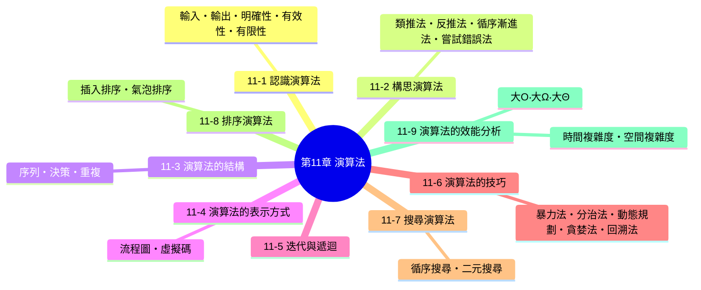

**核心概念：**

1. 演算法不是抽象的數學遊戲，而是解決真實問題的具體步驟集合——折紙鶴的摺法、找出兩數最大公因數的方法，都是演算法，理解「演算法必須符合的五個條件」，才能判斷一段步驟集合夠不夠格稱為演算法。
2. 迭代與遞迴是實現演算法的兩種思考方式，同一個問題（例如計算階乘）用兩種方式都能解，但背後的執行邏輯與效能表現截然不同。
3. 分析演算法的「時間複雜度」（大 O 記號）是這一章最重要的實作能力——學會分析一段程式碼要跑多久、學會比較不同演算法的效能高下，是資訊科學最核心的基本功之一。

---

## 11-1　認識演算法

**演算法（algorithm）** 是一群明確、可執行且有順序的步驟集合，目的是要解決某個問題或完成某件工作，例如折紙鶴的演算法、歐幾里德演算法（求兩數最大公因數）。

演算法必須符合下列五個條件：

- **輸入（input）**：演算法可以有零個或多個外部提供的輸入資料。
- **輸出（output）**：演算法至少要產生一個輸出結果。
- **明確性（definiteness）**：演算法中每一個步驟的敘述都必須清楚明確，不能有模糊或模稜兩可的地方。
- **有效性（effectiveness）**：演算法中每一個步驟都必須是可執行的，而且能在有限時間內完成。
- **有限性（finiteness）**：演算法必須在執行有限個步驟之後就會結束，不能無止盡地執行下去。

> **課堂重點（呼應學習評量第 5 題）**：「有限性」是最常被拿來出題考驗理解程度的條件——舉例來說，「步驟1：從自然數中挑選一個奇數；步驟2：重複步驟1」這樣的步驟集合，因為永遠不會停止（沒有明確的終止條件），**不符合有限性**，因此不能算是一個合格的演算法，即使每個步驟本身都清楚明確、可以執行。

---

## 11-2　構思演算法

資訊科學領域中解決問題的基本原則如下：

- **階段一**：分析問題。
- **階段二**：想出解決問題的演算法。
- **階段三**：擬定演算法的步驟集合並轉換成程式。
- **階段四**：評估該程式的精確度及用來解決其它類似問題的潛力。

至於如何在階段二中想出解決問題的演算法，常見的有下列幾種方法：

- **類推法**：參考過去解決類似問題的經驗與做法，套用到目前的新問題上。
- **反推法（backward）**：從問題的目標（終點）往回推導，逐步找出要達成目標所需要的前置步驟。
- **循序漸進法（stepwise refinement）**：先寫出解決問題的大致步驟，再逐步把每個步驟精煉、細分成更具體的子步驟，直到每個步驟都清楚到可以直接轉換成程式碼為止。
- **嘗試錯誤法（try and error）**：先嘗試一種可能的做法，如果行不通，就修正做法或換一種方式再試，透過反覆試誤逐漸逼近正確的解法。

> **課堂重點（呼應學習評量第 4 題）**：這四種構思技巧並不互斥，實務上經常會交互運用——例如先用類推法參考類似問題的解法架構，再用循序漸進法把大致的解法逐步細化成具體步驟。練習題第 4 題「構思一個演算法，令它計算兩個正整數的平均值，然後使用虛擬碼表示該演算法」正是循序漸進法的具體演練：先確立大方向（把兩數相加、除以2），再用虛擬碼把每個步驟寫清楚。

---

## 11-3　演算法的結構

演算法通常是由下列三種結構所組成：

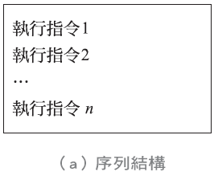

<table>
<tr>
<td width="33%">


*(a) 序列結構*

</td>
<td width="33%">

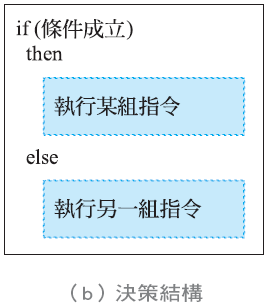
*(b) 決策結構*

</td>
<td width="33%">

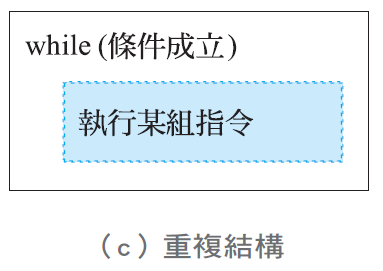
*(c) 重複結構*

</td>
</tr>
</table>

- **序列（sequence）**：指令依照撰寫的順序，一條接著一條依序執行，執行指令1、執行指令2……執行指令 n。
- **決策（decision）**：依照條件是否成立，選擇要執行哪一組指令（例如 `if...then...else`），這正是第 10 章介紹過的判斷結構。
- **重複（repetition）**：只要條件成立，就重複執行某組指令（例如 `while` 迴圈），這正是第 10 章介紹過的迴圈結構。

> **課堂連結**：這一節的三種結構，本質上就是第 10 章「程式語言的設計」中判斷結構與迴圈結構的抽象化版本——演算法關心的是「解決問題的邏輯步驟」，而程式語言則是把這套邏輯步驟，用某種特定語法具體實現出來。

---

## 11-4　演算法的表示方式

### 11-4-1　流程圖

**流程圖（flowchart）** 是以圖形符號表示演算法，下圖是使用流程圖表示序列、決策及重複等三種結構：

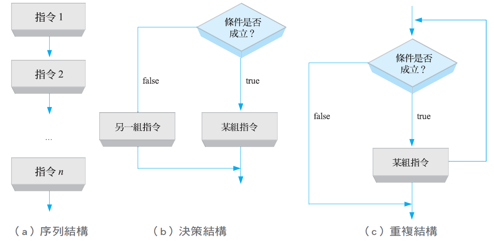

### 11-4-2　虛擬碼

**虛擬碼（pseudocode）** 是以近似於英文但語法更為精確的方式來描述問題的解法，下圖是使用虛擬碼表示序列、決策及重複等三種結構：

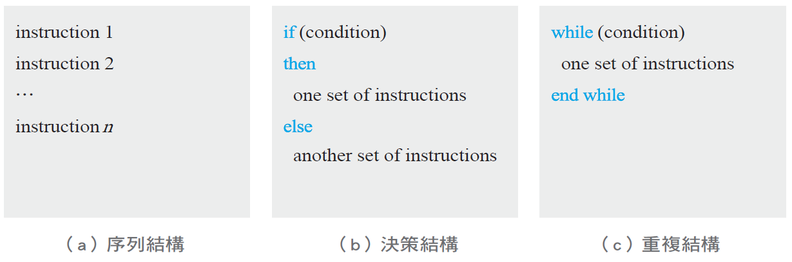

> **課堂重點（呼應練習題第 4 題）**：流程圖用「圖形」表達邏輯、直覺易懂，但畫起來較費工；虛擬碼用「近似英文的文字」表達邏輯，寫起來較快、也比較貼近實際程式碼的結構，方便之後直接轉換成正式的程式語言。以下是練習題第 4 題「計算兩個正整數的平均值」的虛擬碼參考寫法：

```
Algorithm: Find Average
Input: Two integers
Return: The average of the two integers
1. add the two integers
2. divide the result of step 1 by 2
3. return the result of step 2
End Finding Average
```

---

## 11-5　迭代與遞迴

### 迭代

**迭代（iteration）** 是以迴圈（loop）的方式重複執行某組指令，比方說，假設要計算 $n!$ （ $n$ 階層），其公式定義如下：

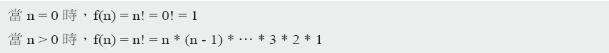

$$n! = \begin{cases}n! = n \times (n-1)!, & n>0 \\ n!=1, & n=0\end{cases}$$

我們可以使用迭代的方式將計算 $n!$ 的演算法撰寫成如下程式：

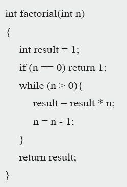

```c
int factorial(int n)
{
    int result = 1;
    if (n <= 0) return 1;
    while (n > 0){
        result = result * n;
        n = n - 1;
    }
    return result;
}
```

### 遞迴

我們可以將待解問題分割成多個小範圍的問題，個別解決這些小問題，會比一次解決一個大問題來得容易，這種以此方式撰寫演算法的方式就是遞迴（recursive）。我們以計算 $n!$ （ $n$ 階層）為例，其公式定義為：

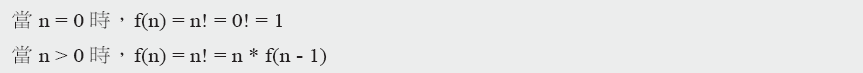

我們可以使用遞迴的方式將計算 $n!$ 的演算法撰寫成如下程式（以 n=3 為模擬執行過程）：

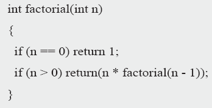

```c
int factorial(int n)
{
    if (n == 0) return 1;
    else return n * factorial(n - 1);
}
```

**以 n=3 為例，模擬 factorial(3) 的執行過程**：

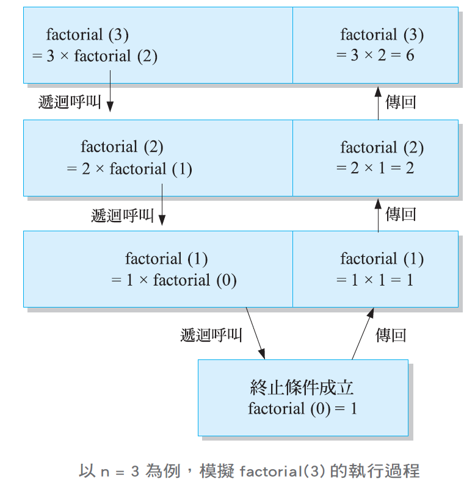

呼叫 `factorial(3)` 之後，會不斷向下遞迴呼叫 `factorial(2)`、`factorial(1)`，直到遇到終止條件 `factorial(0) = 1`，才開始一層一層把結果**傳回**上一層：`factorial(1) = 1×1 = 1` → `factorial(2) = 2×1 = 2` → `factorial(3) = 3×2 = 6`。

> **課堂重點（呼應學習評量第 15、16 題）**：**每一個遞迴演算法都必須有明確的「終止條件」（base case）**，否則就會無止盡地遞迴下去，違反 11-1 節提到的「有限性」——上面例子中的 `factorial(0) = 1` 正是終止條件。迭代與遞迴經常可以互相轉換、解決同一個問題（例如計算費伯納西數列，詳見本章練習題第 15、16 題），但兩者的**效能表現可能天差地遠**——這正是 11-9 節效能分析要探討的重點：迭代版本的階乘計算時間複雜度是 $O(n)$ ，但某些問題若用遞迴實作不當（例如遞迴版費伯納西數列出現大量重複計算），時間複雜度可能會暴增到 $O(2^n)$ 。

## 11-6　演算法的技巧

設計演算法時，常見的技巧如下：

- **暴力法（brute force）**：不做任何取巧的最佳化，直接窮舉所有可能的解答，逐一檢查是否符合要求。實作簡單，但當問題規模變大時，效率往往很差。
- **分治法（divide and conquer）**：把一個大問題拆解成幾個較小的子問題，分別解決之後，再把子問題的解答合併成原問題的解答（例如本章 11-7 節的二元搜尋、常見的合併排序法）。
- **動態規劃（dynamic programming）**：把問題拆解成多個重疊的子問題，並且**把已經解過的子問題答案儲存起來**，避免重複計算，藉此大幅提升效率（正是用來優化「遞迴版費伯納西數列」大量重複計算問題的標準做法）。
- **貪婪法（greedy method）**：每一步都選擇當下看起來最好（局部最佳）的選項，不考慮整體是否為最佳解，實作簡單快速，但不一定能得到全域最佳解。
- **回溯法（backtracking）**：一邊嘗試往下解，一邊檢查是否違反限制條件，一旦發現此路不通，就退回上一步，改嘗試其它可能的選項，是解決「八皇后問題」等組合最佳化問題的經典技巧。

### 範例：八皇后問題

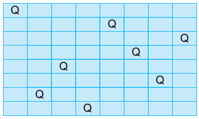

**八皇后問題（eight queens puzzle）** 是要在 8×8 西洋棋盤上放置 8 個皇后棋子，而且任兩個皇后都不能互相攻擊（也就是任兩個皇后不能位於同一列、同一行，也不能位於同一條對角線上）。

> **課堂重點（呼應練習題第 12 題）**：八皇后問題在 8×8 棋盤上共有 $C_8^{64}$ （即從 64 個格子中選出 8 個格子放置皇后的組合數）＝**4,426,165,368** 種擺放方式，但真正皇后間互不攻擊的解法，扣除掉旋轉、鏡射對稱重複計算的部分，只有 **92 個**（其中 11 種基本解各自對應 8 種旋轉鏡射變化、1 種基本解本身具有對稱性只對應 4 種變化，即 $11\times8+1\times4=92$ ）——這正是回溯法大顯身手的經典題目：與其暴力窮舉全部 44 億種擺法，回溯法會**一邊放置皇后、一邊檢查是否違反限制，一旦發現衝突就立刻回溯**，不必浪費時間往下探索註定失敗的分支，大幅減少了實際需要檢查的可能性數量。

---

## 11-7　搜尋演算法

**搜尋（search）** 是在眾多資料中找到符合條件的資料，而且搜尋演算法大致上可以分為下列兩種類型：

- **循序搜尋（sequential search）**：又稱為線性搜尋（linear search），它會從頭開始，一筆一筆往下找符合條件的資料。
- **非循序搜尋（nonsequential search）**：非循序搜尋不會依照順序一筆一筆往下找符合條件的資料，常見的有二元搜尋、二元樹搜尋等。

### 循序搜尋

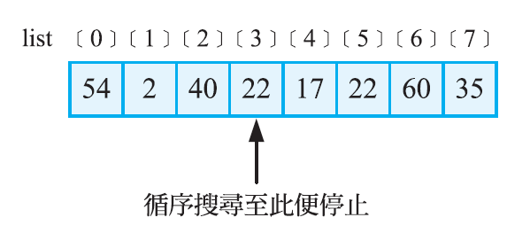

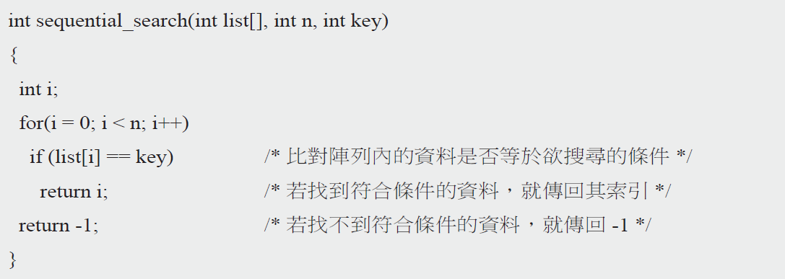

```c
int sequential_search(int list[], int n, int key)
{
    int i;
    for(i = 0; i < n; i++)
        if (list[i] == key)     /* 比對陣列內的資料是否等於欲搜尋的條件 */
            return i;            /* 若找到符合條件的資料，就傳回其索引 */
    return -1;                   /* 若找不到符合條件的資料，就傳回 -1 */
}
```

循序搜尋的邏輯很直覺——從索引 0 開始，逐一比對每個元素是否等於欲搜尋的鍵值（key），找到就傳回索引，找不到就傳回 -1。**優點是不要求資料事先排序**；**缺點是當資料量龐大、且要找的資料剛好在很後面（或根本不存在）時，效率很差**。

### 非循序搜尋（二元搜尋）

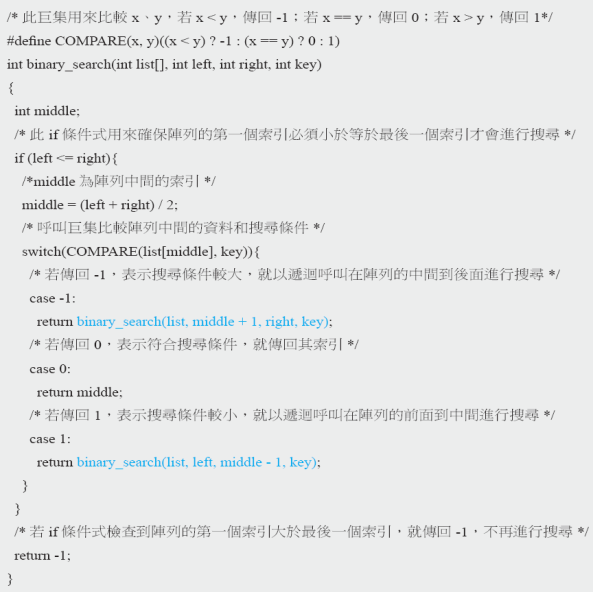

```c
/* 此巨集用來比較 x、y，若 x<y，傳回 -1；若 x==y，傳回 0；若 x>y，傳回 1 */
#define COMPARE(x, y)((x < y) ? -1 : (x == y) ? 0 : 1)

int binary_search(int list[], int left, int right, int key)
{
    int middle;
    /* 此 if 條件式用來確保陣列的第一個索引必須小於等於最後一個索引才會進行搜尋 */
    if (left <= right){
        /* middle 為陣列中間的索引 */
        middle = (left + right) / 2;
        /* 呼叫巨集比較陣列中間的資料和搜尋條件 */
        switch(COMPARE(list[middle], key)){
            /* 若傳回 -1，表示搜尋條件較大，就以遞迴呼叫在陣列的中間到後面進行搜尋 */
            case -1:
                return binary_search(list, middle + 1, right, key);
            /* 若傳回 0，表示符合搜尋條件，就傳回其索引 */
            case 0:
                return middle;
            /* 若傳回 1，表示搜尋條件較小，就以遞迴呼叫在陣列的前面到中間進行搜尋 */
            case 1:
                return binary_search(list, left, middle - 1, key);
        }
    }
    /* 若 if 條件式檢查到陣列的第一個索引大於最後一個索引，就傳回 -1，不再進行搜尋 */
    return -1;
}
```

**二元搜尋（binary search）** 的前提是**資料必須事先排序**，每次都拿中間的元素跟搜尋目標比較：如果相等就找到了；如果目標比中間值小，就只在左半邊繼續搜尋；如果比中間值大，就只在右半邊繼續搜尋——**每比較一次，可搜尋的範圍就縮小一半**，這正是二元搜尋速度遠比循序搜尋快的原因（時間複雜度 $O(\log_2n)$ ，遠優於循序搜尋的 $O(n)$ ）。

> **課堂重點（呼應學習評量第 19、20、21 題）**：以在 10 筆已排序資料 {10, 20, 30, 40, 50, 60, 70, 80, 90, 100} 中尋找 80 為例——循序搜尋必須從頭比對到第 8 個元素才找到，共需要 **8 次**比較；二元搜尋則是先比中間值 50（80 較大，往右半邊找），再比 80（正好命中），只需要 **2 次**比較，資料量愈大，兩者的效率差距會愈明顯。二元搜尋函式常見的兩種實作方式是「遞迴」（如上方程式碼）與「while 迴圈」，兩者邏輯相通，可以互相改寫（詳見本章練習題第 21 題的參考解答）。

---

## 11-8　排序演算法

**排序（sort）** 是將多個資料由小到大或由大到小依序排列，目的通常有兩個，其一是幫助搜尋，其二是在串列中進行比對。

### 11-8-1　插入排序

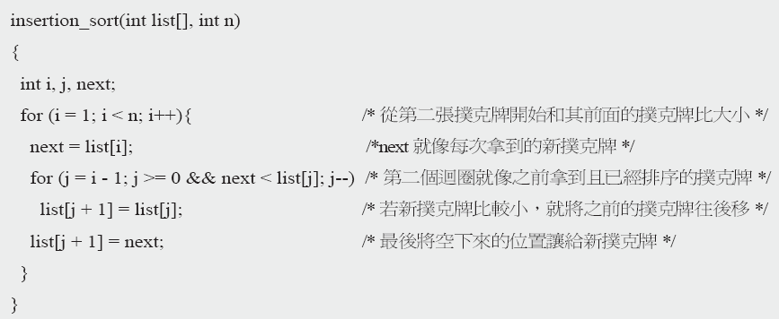

```c
insertion_sort(int list[], int n)
{
    int i, j, next;
    for (i = 1; i < n; i++){                              /* 從第二張撲克牌開始和其前面的撲克牌比大小 */
        next = list[i];                                    /* next 就像每次拿到的新撲克牌 */
        for (j = i - 1; j >= 0 && next < list[j]; j--)      /* 第二個迴圈就像之前拿到且已經排序的撲克牌 */
            list[j + 1] = list[j];                          /* 若新撲克牌比較小，就將之前的撲克牌往後移 */
        list[j + 1] = next;                                 /* 最後將空下來的位置讓給新撲克牌 */
    }
}
```

**插入排序（insertion sort）** 的邏輯就像玩撲克牌時整理手牌——每次拿到一張新牌（`next`），就從手上已經排好序的牌堆中，由後往前找到正確的插入位置，把新牌插進去。

**插入排序實例**：以紙筆模擬插入排序將 {5, 4, 3, 2, 1} 由小到大排序的過程：

<table>
<tr>
<td width="50%">

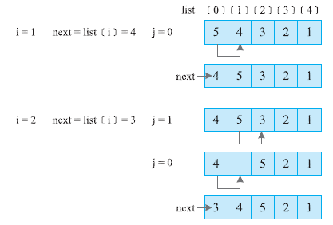

</td>
<td width="50%">

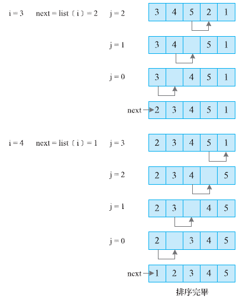

</td>
</tr>
</table>

### 11-8-2　氣泡排序

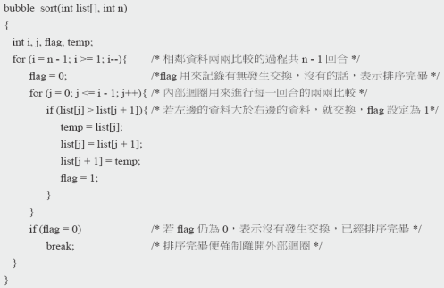

```c
bubble_sort(int list[], int n)
{
    int i, j, flag, temp;
    for (i = n - 1; i >= 1; i--){         /* 相鄰資料兩兩比較的過程共 n-1 回合 */
        flag = 0;                          /* flag 用來記錄有無發生交換，沒有的話，表示排序完畢 */
        for (j = 0; j <= i - 1; j++){       /* 內部迴圈用來進行每一回合的兩兩比較 */
            if (list[j] > list[j + 1]){     /* 若左邊的資料大於右邊的資料，就交換，flag 設定為 1 */
                temp = list[j];
                list[j] = list[j + 1];
                list[j + 1] = temp;
                flag = 1;
            }
        }
        if (flag == 0)                     /* 若 flag 仍為 0，表示沒有發生交換，已經排序完畢 */
            break;                          /* 排序完畢便強制離開外部迴圈 */
    }
}
```

**氣泡排序（bubble sort）** 的原理是將相鄰資料兩兩比較來完成排序，若資料個數為 $n$ ，則比較的過程將分成 $n-1$ 個回合，第 1 回合會將最大的資料像「氣泡」般浮現在從右邊數來的第 1 個位置（由小到大排序）。

**氣泡排序實例**：以紙筆模擬氣泡排序將 {5, 4, 3, 2, 1} 由小到大排序的過程：

<table>
<tr>
<td width="50%">

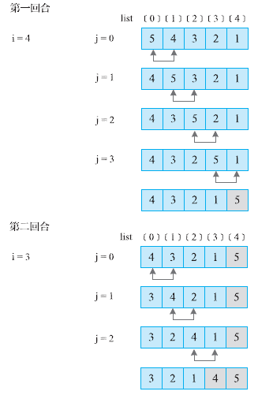

</td>
<td width="50%">

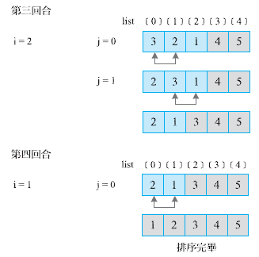

</td>
</tr>
</table>

> **課堂重點（呼應學習評量練習題第 7、8 題）**：插入排序與氣泡排序的時間複雜度都是 $O(n^2)$ （因為都需要用兩層迴圈進行資料兩兩比較），但實際運作的邏輯完全不同——**插入排序是「把新資料插入已排序好的區段」，氣泡排序則是「相鄰資料兩兩比較並交換」**。氣泡排序程式碼中的 `flag` 變數是一個常見的效能優化技巧：如果某一回合完全沒有發生任何交換，就代表資料已經排序完成，可以提早跳出迴圈，不需要再做剩餘的回合。

---

## 11-9　演算法的效能分析

通常我們會從下列兩個面向來做分析：

- **時間複雜度（time complexity）**：演算法執行完畢所需的時間。
- **空間複雜度（space complexity）**：演算法執行完畢所需的記憶體空間。

### 分析加總演算法的程式步驟個數

我們通常會針對程式中每一行敘述，計算其**執行一次所需的步驟數（s/e，steps per execution）**乘上**執行的頻率**，加總得到總步驟數：

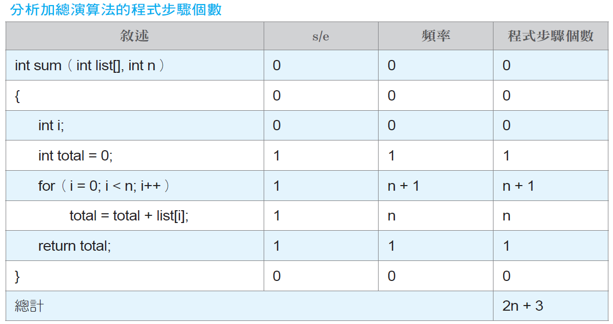

| 敘述 | s/e | 頻率 | 程式步驟個數 |
|---|---|---|---|
| `int sum(int list[], int n)` | 0 | 0 | 0 |
| `{` | 0 | 0 | 0 |
| `int i;` | 0 | 0 | 0 |
| `int total = 0;` | 1 | 1 | 1 |
| `for (i = 0; i < n; i++)` | 1 | n+1 | n+1 |
| `total = total + list[i];` | 1 | n | n |
| `return total;` | 1 | 1 | 1 |
| `}` | 0 | 0 | 0 |
| **總計** | | | **2n+3** |

> **課堂重點（呼應學習評量第 9 題）**：這種「逐行列出 s/e 與頻率、相乘後加總」的分析方法，是求出精確步驟數（例如上表的 $2n+3$ ）最嚴謹的做法。不過要特別注意，`for` 迴圈的**條件判斷**會比迴圈內部的敘述多執行一次（因為迴圈結束時還要再檢查一次條件才會跳出），這正是上表中 `for` 那一行的頻率是 $n+1$ 、而不是 $n$ 的原因，這也是初學者在計算頻率時最容易算錯的地方。

### 大 O、大 Ω、大 Θ 記號

時間複雜度的表示方式有下列幾種，我們通常比較在意理論上限 O，因而多半是以理論上限 O() 來描述時間複雜度：

- **理論上限 O( )（唸做 "big-O"）**：若 $f(n)=O(g(n))$ ，代表若存在正的常數 $c$ 和 $n_0$ ，對所有 $n \geq n_0$ 時， $f(n) \leq cg(n)$ 均成立。
- **理論下限 Ω( )（唸做 "omega"）**：若 $f(n)=\Omega(g(n))$ ，代表若存在正的常數 $c$ 和 $n_0$ ，對所有 $n \geq n_0$ 時， $f(n) \geq cg(n)$ 均成立。
- **理論上下限 Θ( )（唸做 "theta"）**：若 $f(n)=\Theta(g(n))$ ，代表若存在正的常數 $c_1$ 、 $c_2$ 和 $n_0$ ，對所有 $n \geq n_0$ 時， $c_1g(n) \leq f(n) \leq c_2g(n)$ 均成立，例如若 $f(n)=2n+3$ ，則 $f(n)=\Theta(n)$ 。

> **課堂重點（呼應學習評量第 11、13 題）**：找出符合 $O(g(n))$ 定義的常數 $c$ 與 $n_0$ ，關鍵是要找到一組**讓不等式恰好成立、且愈晚開始成立（ $n_0$ 愈大也沒關係，只要存在即可）**的組合。例如 $f(n)=5n+3$ ，取 $c=6$ 、 $n_0=3$ ：當 $n\geq3$ 時， $5n+3\leq6n$ 恆成立（因為 $5n+3\leq6n \Leftrightarrow 3\leq n$ ），因此 $f(n)=O(n)$ ， $c=6$ 、 $n_0=3$ 。同樣的方法，可以推得 $f(n)=6n^2+7n+3=O(n^2)$ （取 $c=7$ 、 $n_0=8$ ）、 $f(n)=2^n+n^2+5=O(2^n)$ （取 $c=2$ 、 $n_0=5$ ）。

### 常見的時間複雜度等級

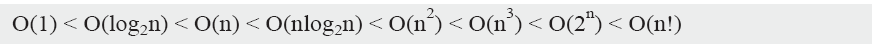

| 複雜度等級 | 名稱 | 表示方式 |
|---|---|---|
| Constant（常數） | | $O(1)$ |
| Logarithmic（對數） | | $O(\log_2n)$ |
| Linear（線性） | | $O(n)$ |
| Log Linear（對數線性） | | $O(n\log_2n)$ |
| Quadratic（平方） | | $O(n^2)$ |
| Cubic（立方） | | $O(n^3)$ |
| Exponential（指數） | | $O(2^n)$ |
| Factorial（階乘） | | $O(n!)$ |

**成長速度由慢到快排列**：

$$O(1)<O(\log_2n)<O(n)<O(n\log_2n)<O(n^2)<O(n^3)<O(2^n)<O(n!)$$

> **課堂重點（呼應學習評量第 2、14、22 題）**：這條成長速度的排序公式，是本章計算題最重要的參考基準，務必熟記——尤其要注意有些看似不同的複雜度，經過數學化簡後其實是**同一個等級**，例如 $4^{\log_2n}=(2^2)^{\log_2n}=2^{2\log_2n}=(2^{\log_2n})^2=n^2$ ，也就是說 $O(4^{\log n})$ 其實等同於 $O(n^2)$ ；同理 $O(2^{\log_2n})=O(n)$ 。這種「先化簡再比較」的技巧，正是學習評量第 14、22 題的解題關鍵。

### 最佳情況、最差情況、平均情況

在分析時間複雜度時，我們通常會針對最佳、最差及平均三種情況討論，比方說，循序搜尋的時間複雜度分析如下（假設有 $n$ 個資料）：

- **最佳情況（best case）**： $O(1)$ ，第一筆就找到資料，此時只做一次比較。
- **最差情況（worst case）**： $O(n)$ ，最後一個才找到資料，或者，找到最後還是沒有找到資料，此時已經做 $n$ 次比較。
- **平均情況（average case）**： $O(n)$ ，找到資料平均要做 $(n+1)/2$ 次比較。

> **課堂重點（呼應學習評量第 24 題）**：不同演算法適合用不同的角度去評估——**循序搜尋不要求資料排序，最差情況要比較到最後一筆（ $O(n)$ ）；二元搜尋則要求資料必須事先排序，換來的代價是最差情況只需要 $O(\log_2n)$ 次比較**，這正是「用排序的額外成本，換取搜尋效率大幅提升」的經典取捨（trade-off），也是學習評量第 24 題「在 n 個已排序的數字中尋找特定數字，最差情況的時間複雜度為何」的解題依據——因為資料已經排序，應該採用二元搜尋，答案是 $O(\log_2n)$ ，而不是循序搜尋的 $O(n)$ 。

---

## 本章總結

| 小節 | 核心觀念一句話 |
|---|---|
| 11-1 認識演算法 | 演算法必須符合輸入、輸出、明確性、有效性、有限性五個條件 |
| 11-2 構思演算法 | 類推、反推、循序漸進、嘗試錯誤是構思演算法常見的四種方法 |
| 11-3 演算法的結構 | 序列、決策、重複三種結構是所有演算法的共同骨架 |
| 11-4 演算法的表示方式 | 流程圖重直覺圖像化，虛擬碼重精確文字化，兩者各有優勢 |
| 11-5 迭代與遞迴 | 迭代靠迴圈重複執行，遞迴靠自我呼叫並仰賴明確的終止條件 |
| 11-6 演算法的技巧 | 暴力法窮舉、分治法拆解、動態規劃存結果、貪婪法看當下、回溯法能撤退 |
| 11-7 搜尋演算法 | 循序搜尋O(n)不需排序，二元搜尋O(logn)需要事先排序但效率高很多 |
| 11-8 排序演算法 | 插入排序像整理撲克牌，氣泡排序像相鄰兩兩比較，都是O(n²) |
| 11-9 演算法的效能分析 | 大O描述上限成長速度，是比較不同演算法效能最重要的工具 |

### 關鍵詞彙表（Glossary）

`演算法` `輸入` `輸出` `明確性` `有效性` `有限性` `類推法` `反推法` `循序漸進法` `嘗試錯誤法` `序列` `決策` `重複` `流程圖` `虛擬碼` `迭代` `遞迴` `終止條件` `暴力法` `分治法` `動態規劃` `貪婪法` `回溯法` `八皇后問題` `循序搜尋` `二元搜尋` `插入排序` `氣泡排序` `時間複雜度` `空間複雜度` `大O` `大Ω` `大Θ` `最佳情況` `最差情況` `平均情況`

---

## 第 11 章　學習評量

> 以下為課本第 11 章隨附之官方學習評量，題目逐字謄錄，共 24 題。答案為課本官方解答，並在其下補充**完整計算過程與解說**（部分並以程式實際執行結果核對），方便課堂上直接點開講解、對答案。

**1. 簡單說明何謂演算法並舉出一個實例。**

<details>
<summary>▶ 參考答案</summary>

演算法（algorithm）是一群明確、可執行且有順序的步驟集合，目的是要解決某個問題或完成某件工作。實例：**折紙鶴的演算法**（或歐幾里德演算法、插入排序演算法等）。

</details>

---

**2. $O(2^n)$ 、 $O(n^{100})$ 、 $O(n!)$ 和 $O(n^2\log n)$ 的複雜度何者最高？**

<details>
<summary>▶ 參考答案與解說</summary>

**答案： $O(n!)$**

雖然在 $n$ 較小時， $n^{100}$ 的數值看起來遠大於 $n!$ （例如 $n=10$ 時 $n^{100}\approx10^{100}$ ，而 $10!\approx3.6\times10^6$ ），但**階乘的成長速度長期而言會超越任何固定次方的多項式或固定底數的指數函數**。取對數比較可以清楚看出交叉點：當 $n=150$ 時， $\ln(n!)\approx605$ ，已經超過 $\ln(n^{100})\approx501$ ；而 $\ln(2^n)$ 在同樣的 $n$ 下只有約 104，遠遠落後。因此當 $n$ 足夠大之後， $O(n!)>O(n^{100})>O(2^n)>O(n^2\log n)$ ，複雜度最高的是 $O(n!)$ 。

</details>

---

**3. 分析氣泡排序的時間複雜度。**

<details>
<summary>▶ 參考答案</summary>

氣泡排序需要進行 $n-1$ 個回合，第 $i$ 回合需要比較 $n-i$ 次，總比較次數約為 $(n-1)+(n-2)+\cdots+1=\dfrac{n(n-1)}{2}$ ，因此氣泡排序的時間複雜度為 **$O(n^2)$**。

</details>

---

**4. 構思一個演算法，令它計算兩個正整數的平均值，然後使用虛擬碼表示該演算法。**

<details>
<summary>▶ 參考答案</summary>

```
Algorithm: Find Average
Input: Two integers
Return: The average of the two integers
1. add the two integers
2. divide the result of step 1 by 2
3. return the result of step 2
End Finding Average
```

</details>

---

**5. 試問，下列的步驟集合可以構成一個演算法嗎？說明其原因。**

**步驟 1：從自然數中挑選一個奇數。**
**步驟 2：重複步驟 1。**

<details>
<summary>▶ 參考答案</summary>

**不可以**，因為不符合**有限性**的條件——步驟 2 會不斷重複步驟 1，沒有任何終止條件，導致這個步驟集合永遠不會結束，違反了演算法必須在有限步驟內結束的基本要求。

</details>

---

**6. 下列的虛擬碼中，`statement` 總共會執行幾次？**

```
A = 5;
while (A < 10){
    statement;
    A = A - 2;
}
```

<details>
<summary>▶ 參考答案與完整追蹤過程</summary>

**答案：無限多次**

逐步追蹤 `A` 的變化： $A=5\to3\to1\to-1\to-3\to-5\to\cdots$ ，`A` 每次遞減 2，數值只會愈來愈小，**永遠不會等於或超過 10**，因此 `A < 10` 這個條件永遠成立，迴圈永遠不會停止，`statement` 會被**無限多次**執行。這一題示範了 11-1 節「有限性」原則在實際程式碼中的體現——一個沒有正確終止條件的迴圈，就不符合演算法的基本要求。

</details>

---

**7. 以紙筆模擬插入排序將 {35, 50, 15, 3, 28, 66} 由小到大排序的過程。**

<details>
<summary>▶ 參考答案與完整追蹤過程</summary>

依照 11-8-1 節插入排序的邏輯（`next` 是每次要插入的新元素，從陣列索引 1 開始，往前找到正確的插入位置）：

| 步驟 | next | 插入後的陣列 |
|---|---|---|
| 初始 | — | [35, 50, 15, 3, 28, 66] |
| i=1 | 50 | [35, 50, 15, 3, 28, 66]（50 比 35 大，不動） |
| i=2 | 15 | [15, 35, 50, 3, 28, 66]（15 依序小於 50、35，插到最前面） |
| i=3 | 3 | [3, 15, 35, 50, 28, 66]（3 比所有前面的都小，插到最前面） |
| i=4 | 28 | [3, 15, 28, 35, 50, 66]（28 插入 15 和 35 之間） |
| i=5 | 66 | [3, 15, 28, 35, 50, 66]（66 比所有前面的都大，不動） |

**排序結果：{3, 15, 28, 35, 50, 66}**

</details>

---

**8. 以紙筆模擬氣泡排序將 {35, 50, 15, 3, 28, 66} 由小到大排序的過程。**

<details>
<summary>▶ 參考答案與完整追蹤過程</summary>

依照 11-8-2 節氣泡排序的邏輯（相鄰兩兩比較，較大者往右移，每回合结束後最大值會「浮」到正確位置）：

| 回合 | 過程 | 結果 |
|---|---|---|
| 第1回合 | 35,50→不換；50,15→換；50,3→換；50,28→換；50,66→不換 | [35, 15, 3, 28, 50, 66] |
| 第2回合 | 35,15→換；35,3→換；35,28→換；35,50→不換 | [15, 3, 28, 35, 50, 66] |
| 第3回合 | 15,3→換；15,28→不換；28,35→不換 | [3, 15, 28, 35, 50, 66] |
| 第4回合 | 3,15→不換；15,28→不換 | [3, 15, 28, 35, 50, 66]（flag=0，提早結束） |

**排序結果：{3, 15, 28, 35, 50, 66}**（與插入排序結果相同，但實際比較與交換的過程不同）

</details>

---

**9. 分析使用遞迴的方式計算 $n!$ 的時間複雜度。**

<details>
<summary>▶ 參考答案</summary>

**答案： $O(n)$**

| 敘述 | s/e | 頻率 (n==0) | 頻率 (n>0) | 步驟數 (n==0) | 步驟數 (n>0) |
|---|---|---|---|---|---|
| `if (n == 0)` | 1 | 1 | n | 1 | n |
| `return 1;` | 1 | 1 | 1 | 1 | 1 |
| `else` | 0 | 0 | 0 | 0 | 0 |
| `return (n * factorial(n - 1));` | 1 | 0 | n-1 | 0 | n-1 |
| **總計** | | | | **2** | **2n** |

由於遞迴呼叫 `factorial(n-1)` 會一路遞迴 $n$ 次直到 $n=0$ 終止，總步驟數約為 $2n$ ，因此時間複雜度為 **$O(n)$**。

</details>

---

**10. 分析下列程式的 $O()$ ，該函式可以用來計算參數 $x$ 的 $n$ 次方。**

```c
long int power(unsigned int x, unsigned int n)
{
    if (n == 0) return 1;
    if (n == 1) return x;
    if (isEven(n)) return power(x * x, n / 2);
    else return power(x * x, n / 2) * x;
}
```

<details>
<summary>▶ 參考答案與解說</summary>

**答案： $O(\log_2n)$**

這個函式採用「**快速冪（exponentiation by squaring）**」的技巧：每次遞迴呼叫，指數 $n$ 都會**減半**（ $n \to n/2$ ），而不是像陽春的做法一次只減 1。假設遞迴深度為 $T(n)$ ，則 $T(n)=T(n/2)+O(1)$ ，這種「每次規模減半」的遞迴關係式，解出來的時間複雜度正是 **$O(\log_2n)$**——這正是分治法能夠大幅提升效率的經典範例，比起單純用迴圈從 1 乘到 $n$ 次（ $O(n)$ ），快速冪只需要 $O(\log_2n)$ 次乘法就能算出結果。

</details>

---

**11. 分析下列多項式的 $O()$ ，並找出符合的常數 $c$ 和 $n_0$ ：**

**(1) $5n+3$　(2) $6n^2+7n+3$　(3) $2^n+n^2+5$**

<details>
<summary>▶ 參考答案與完整驗算</summary>

**(1) $O(n)$ ， $c=6$ ， $n_0=3$**

驗證：當 $n\geq3$ 時， $5n+3\leq6n \Leftrightarrow 3\leq n$ ，恆成立。

**(2) $O(n^2)$ ， $c=7$ ， $n_0=8$**

驗證：當 $n\geq8$ 時， $6n^2+7n+3\leq7n^2 \Leftrightarrow 7n+3\leq n^2$ 。代入 $n=8$ ： $59\leq64$ 成立；代入 $n=7$ ： $52\leq49$ 不成立，因此 $n_0=8$ 是最小的合法門檻。

**(3) $O(2^n)$ ， $c=2$ ， $n_0=5$**

驗證：當 $n\geq5$ 時， $2^n+n^2+5\leq2\times2^n \Leftrightarrow n^2+5\leq2^n$ 。代入 $n=5$ ： $30\leq32$ 成立；代入 $n=4$ ： $21\leq16$ 不成立，因此 $n_0=5$ 是最小的合法門檻。

</details>

---

**12. 針對第 11-6 節所提及的「八皇后問題」想出一種其它解法。**

<details>
<summary>▶ 參考答案</summary>

八皇后問題在 8×8 棋盤上共有 $C_8^{64}$ （4,426,165,368）種擺放方法，但皇后間互不攻擊的解法只有 $11\times8+1\times4=92$ 個。除了課本介紹的**回溯法**（一邊嘗試擺放、一邊檢查是否違規，違規就退回上一步重新嘗試）之外，也可以採用以下解法（任舉一種）：

- **暴力法**：窮舉所有 $C_8^{64}$ 種擺放組合，逐一檢查是否滿足互不攻擊的條件——雖然一定能找到答案，但效率遠不如回溯法。
- **基因演算法 / 模擬退火法等啟發式演算法**：把每一種擺放方式視為一個「個體」，透過適應度函數（衡量互相攻擊的皇后對數）評估優劣，並模擬演化的過程（交配、突變、汰弱留強）逐步逼近或找到合法解，適合用在棋盤規模更大（例如 n 皇后問題的 n 很大）時，回溯法窮舉也開始吃力的情況。

</details>

---

**13. 分析下列多項式的 $O()$ ：**

**(1) $\sum_{i=1}^{n}i$　(2) $\sum_{i=1}^{n}i^2$　(3) $\sum_{i=1}^{n}1$　(4) $n^3/\log_2n+2n+5$　(5) $\log_22^{2^n}$**

<details>
<summary>▶ 參考答案與解說</summary>

**(1) $O(n^2)$**： $1+2+\cdots+n=\dfrac{n(n+1)}{2}$ ，展開後最高次方為 $n^2$ 。

**(2) $O(n^3)$**： $1^2+2^2+\cdots+n^2=\dfrac{n(n+1)(2n+1)}{6}$ ，展開後最高次方為 $n^3$ 。

**(3) $O(n)$**： $1+1+\cdots+1$ （共 $n$ 項） $=n$ 。

**(4) $O(n^3)$**： $n^3/\log_2n$ 的成長速度雖然略低於 $n^3$ （因為除以了一個持續變大的 $\log_2n$ ），但仍遠高於後面的 $2n+5$ ，且不屬於任何更低一級的標準複雜度類別，因此以最貼近的標準等級 $O(n^3)$ 表示。

**(5) $O(2^n)$**：利用對數的性質化簡： $\log_2(2^{2^n})=2^n$ （因為 $\log_2(2^x)=x$ ，這裡 $x=2^n$ ），故 $O(2^n)$ 。

</details>

---

**14. 試比較 $n^2$ 、 $(3/2)^n$ 、 $4^{\log n}$ 等時間複雜度的成長速度（假設對數底為 2）。**

<details>
<summary>▶ 參考答案與完整推導</summary>

**先化簡 $4^{\log_2n}$**：

$$4^{\log_2n}=(2^2)^{\log_2n}=2^{2\log_2n}=(2^{\log_2n})^2=n^2$$

所以 $4^{\log_2n}$ 其實與 $n^2$ **同一個複雜度等級**（都是 $\Theta(n^2)$ ）！而 $(3/2)^n$ 屬於指數成長，長期而言必定超越任何多項式成長的函數。

**結論**： $n^2=4^{\log_2n}<(3/2)^n$ （將這三個時間複雜度取對數再做比較即可得證： $\log(n^2)=2\log n$ 、 $\log(4^{\log n})=2\log n$ 兩者相等；而 $\log((3/2)^n)=n\log(3/2)$ 是 $n$ 的線性函數，成長速度遠快於 $2\log n$ 這種對數函數）。

</details>

---

**15. 使用 C 語言撰寫一個函式，令它使用迭代的方式計算「費伯納西」數列（Fibonacci）的前 10 個數字，其公式定義如下：**

**當 $n=0$ 時， $fibo(n)=fibo(0)=0$ ；當 $n=1$ 時， $fibo(n)=fibo(1)=1$ ；當 $n\geq2$ 時， $fibo(n)=fibo(n-1)+fibo(n-2)$**

<details>
<summary>▶ 參考答案</summary>

```c
#include <stdio.h>

int fibo(int n)
{
    int fn;      /*宣告變數 fn 代表 fibo(n)*/
    int fn1;     /*宣告變數 fn1 代表 fibo(n-1)*/
    int fn2;     /*宣告變數 fn2 代表 fibo(n-2)*/
    if (n == 0) return 0;     /*當 n=0 時，fibo(n)=fibo(0)=0*/
    else if (n == 1) return 1; /*當 n=1 時，fibo(n)=fibo(1)=1*/
    else{                       /*當 n≥2 時，fibo(n)=fibo(n-1)+fibo(n-2)*/
        fn2 = 0;
        fn1 = 1;
        for (int i = 2; i <= n; i++){
            fn = fn1 + fn2;
            fn2 = fn1;
            fn1 = fn;
        }
    }
    return fn;
}

int main()
{
    /*使用迴圈印出費伯納西數列的前 10 個數字*/
    for (int i = 0; i < 10; i++)
        printf("%d\n", fibo(i));
}
```

**執行結果（前 10 個費伯納西數）**：0, 1, 1, 2, 3, 5, 8, 13, 21, 34

</details>

---

**16. 承上題，但這次改用遞迴的方式。**

<details>
<summary>▶ 參考答案</summary>

```c
#include <stdio.h>

int fibo(int n)
{
    if (n == 0) return 0;
    else if (n == 1) return 1;
    else return fibo(n - 1) + fibo(n - 2);
}

int main()
{
    /*使用迴圈印出費伯納西數列的前 10 個數字*/
    for (int i = 0; i < 10; i++)
        printf("%d\n", fibo(i));
}
```

**執行結果（前 10 個費伯納西數）**：0, 1, 1, 2, 3, 5, 8, 13, 21, 34（與迭代版本結果完全相同）

</details>

---

**17. 以 $O()$ 分析第 15 題的時間複雜度。**

<details>
<summary>▶ 參考答案</summary>

**答案： $O(n)$**

第 15 題的迭代版本，用一個 `for` 迴圈從 2 執行到 $n$ ，迴圈內每次只做固定次數的加法與賦值運算，因此時間複雜度與 $n$ 成正比，為 **$O(n)$**。

</details>

---

**18. 以 $O()$ 分析第 16 題的時間複雜度。**

<details>
<summary>▶ 參考答案</summary>

**答案： $O(2^n)$**

第 16 題的遞迴版本，每呼叫一次 `fibo(n)`，就會分裂成兩個子呼叫 `fibo(n-1)` 與 `fibo(n-2)`，形成一棵遞迴呼叫樹，樹的節點數量隨著 $n$ 呈指數成長，且過程中會有大量**重複計算**（例如計算 `fibo(5)` 時，`fibo(3)` 會被重複計算好幾次），因此時間複雜度為 **$O(2^n)$**，遠遠劣於迭代版本的 $O(n)$——這正是 11-6 節提到「動態規劃」技巧（把算過的子問題結果存起來，避免重複計算）能夠大幅優化效能的典型應用場景。

</details>

---

**19. 假設要使用循序搜尋從 {10, 20, 30, 40, 50, 60, 70, 80, 90, 100} 中找出 80，必須做過幾次比較？**

<details>
<summary>▶ 參考答案</summary>

**答案：8 次**

循序搜尋從頭開始逐一比對：10、20、30、40、50、60、70、**80**（第 8 個元素），找到 80 時已經做了 **8 次**比較。

</details>

---

**20. 承上題，但這次改用二元搜尋。**

<details>
<summary>▶ 參考答案與完整追蹤過程</summary>

**答案：2 次**

陣列索引 0~9（值 10~100）， $left=0$ ， $right=9$ ：

- 第 1 次比較： $middle=(0+9)/2=4$ （值為 50）。 $80>50$ ，往右半邊找： $left=5$ ， $right=9$ 。
- 第 2 次比較： $middle=(5+9)/2=7$ （值為 80）。**找到！**

共比較 **2 次**，遠比循序搜尋的 8 次快上許多。

</details>

---

**21. 第 11-7 節的二元搜尋函式 `binary_search()` 是使用遞迴的方式撰寫而成，請使用 `while` 迴圈改寫這個函式。**

<details>
<summary>▶ 參考答案</summary>

```c
int binary_search(int list[], int left, int right, int key)
{
    int middle;
    while (left <= right){
        middle = (left + right) / 2;
        switch (COMPARE(list[middle], key)){
            case -1:
                left = middle + 1;
                break;
            case 0:
                return middle;
            case 1:
                right = middle - 1;
        }
    }
    return -1;
}
```

**改寫的邏輯**：原本遞迴版本每次呼叫 `binary_search(list, middle+1, right, key)` 或 `binary_search(list, left, middle-1, key)`，改成直接更新 `left` 或 `right` 變數，並讓 `while (left <= right)` 迴圈持續執行，直到找到資料（`return middle`）或搜尋範圍不再合法（`left > right`，跳出迴圈後 `return -1`）為止，兩種寫法的執行邏輯完全相同，只是遞迴版本靠函式呼叫堆疊來記錄搜尋範圍，迴圈版本則直接用變數覆寫來記錄。

</details>

---

**22. 假設有四個演算法的時間複雜度為 $O(n^{100})$ 、 $O(n!)$ 、 $O(2^{\log n})$ 、 $O(1.1^n)$ ，請依照由小到大的順序排列。**

<details>
<summary>▶ 參考答案與解說</summary>

**答案： $O(2^{\log n})<O(n^{100})<O(1.1^n)<O(n!)$**

先化簡 $O(2^{\log_2n})$ ：由於 $2^{\log_2n}=n$ （對數與指數互為反函數），因此 $O(2^{\log_2n})$ 其實就是 $O(n)$ ，是四者中成長最慢的線性複雜度。 $O(n^{100})$ 是次數很高的多項式， $O(1.1^n)$ 雖然底數只比 1 大一點點，但仍屬於指數成長，長期必定超越任何固定次方的多項式； $O(n!)$ 則是成長最快的階乘複雜度。

</details>

---

**23. 以 $O()$ 分析下列迴圈的時間複雜度：**

**(1)**
```c
for (i = 1; i <= n; i++)
    for (j = 1; j <= i; j++)
        x++;
```

**(2)**
```c
for (i = 1; i <= n; i++)
    for (j = 1; j <= i; j++)
        for (k = 1; k <= j; k++)
            x++;
```

**(3)**
```c
for (i = 1; i < n; i *= 3)
    for (j = 0; j < n; j++)
        x++;
```

<details>
<summary>▶ 參考答案與完整推導</summary>

**(1) $O(n^2)$**

內層迴圈的執行次數會隨外層 $i$ 而變化：當 $i=1$ 時內層跑 1 次， $i=2$ 跑 2 次……$i=n$ 跑 $n$ 次，總執行次數為 $1+2+\cdots+n=\dfrac{n(n+1)}{2}=O(n^2)$ 。

**(2) $O(n^3)$**

比 (1) 多一層迴圈，執行次數為 $\displaystyle\sum_{i=1}^{n}\sum_{j=1}^{i}j=\sum_{i=1}^n\dfrac{i(i+1)}{2}=O(n^3)$ 。

**(3) $O(n\log n)$**

外層迴圈 $i$ 從 1 開始，每次乘以 3（ $1,3,9,27,\ldots$ ），直到 $i\geq n$ 才停止，因此**外圈執行 $1+\log_3n$ 次**；**內圈執行 $n$ 次**，兩者相乘共執行 $(1+\log_3n)\times n$ 次，而且對數底數只對於漸進符號差了常數倍（ $\log_3n=\dfrac{\log_2n}{\log_23}$ ，只差一個常數倍率），故時間複雜度為 **$O(n\log n)$**。

</details>

---

**24. 在 n 個已排序的數字中尋找特定數字，最差情況的時間複雜度為何？**

<details>
<summary>▶ 參考答案</summary>

**答案： $O(\log_2n)$**

由於資料已經排序，應該採用**二元搜尋**（而非循序搜尋）以獲得最佳效率，二元搜尋每比較一次就能把搜尋範圍縮小一半，因此最差情況（找不到資料，或資料剛好在搜尋範圍縮到剩 1 筆時才確認）的時間複雜度為 **$O(\log_2n)$**，遠優於循序搜尋在最差情況下的 $O(n)$ 。

</details>

---

*本講義圖片素材取自《最新計算機概論》第十二版 第 11 章 原版簡報，內文為教學擴寫版本；學習評量題目依課本原文謄錄，答案在課本官方解答基礎上補齊完整計算過程與解說（含官方原本僅標示「參閱本書」的題目完整內容），部分程式碼追蹤結果並以實際執行程式核對無誤，僅供授課教師課堂講解使用。*
