# 第 12 章　資料結構

## 本章學習地圖

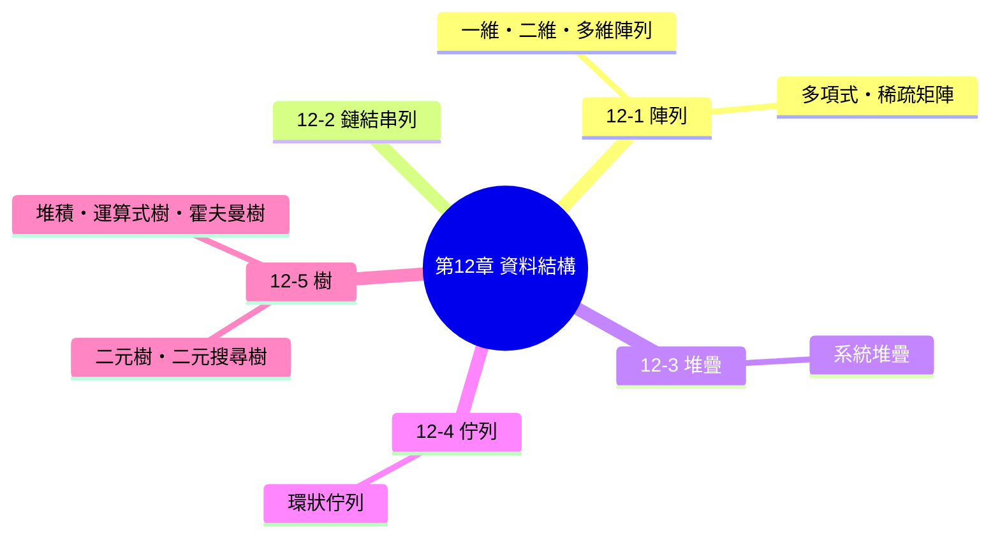
```mermaid
mindmap
  root((第12章 資料結構))
    12-1 陣列
      一維‧二維‧多維陣列
      多項式‧稀疏矩陣
    12-2 鏈結串列
    12-3 堆疊
      系統堆疊
    12-4 佇列
      環狀佇列
    12-5 樹
      二元樹‧二元搜尋樹
      堆積‧運算式樹‧霍夫曼樹
```

**核心概念：**

1. 資料結構是「組織資料的方式」，不同的組織方式各有優缺點——陣列存取快但大小固定、鏈結串列大小彈性但存取較慢、堆疊「後進先出」、佇列「先進先出」，理解每種結構的特性，才能在對的場合選對的工具。
2. 樹狀結構（特別是二元樹）是這一章的重頭戲，「走訪」（前序、中序、後序）是理解與操作樹狀結構最基本、也最重要的能力，務必練到看到樹就能直接手寫出三種走訪結果。
3. 運算式樹、二元搜尋樹、堆積、霍夫曼樹，都是二元樹的「特化應用」——同一套樹狀結構的概念，可以延伸出計算機科學中好幾個重要的實務問題（計算機運算式解析、資料搜尋、優先權管理、資料壓縮編碼）。

---

## 12-1　陣列

**陣列（array）** 是把多個相同型別的資料，存放在一塊連續的記憶體空間，並透過索引（index）存取。

### 一維陣列

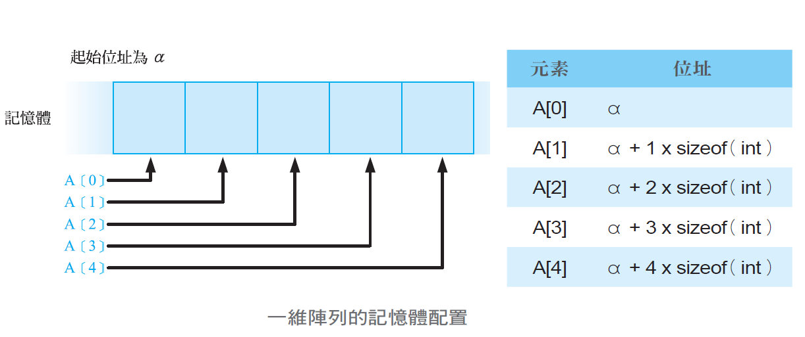

一維陣列宣告後，記憶體會配置一塊連續空間，每個元素依索引順序排列，可以透過「陣列起始位址 + 索引 × 元素大小」直接計算出任一元素的實際記憶體位址，這正是陣列能夠「隨機存取（random access）」、存取速度飛快的原因。

### 二維陣列

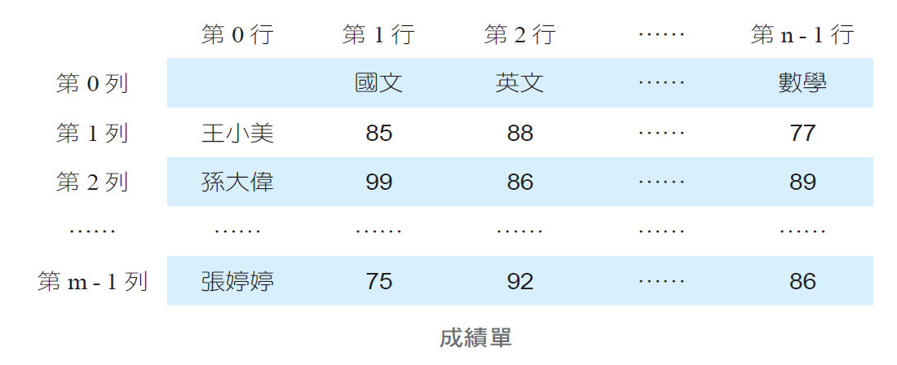

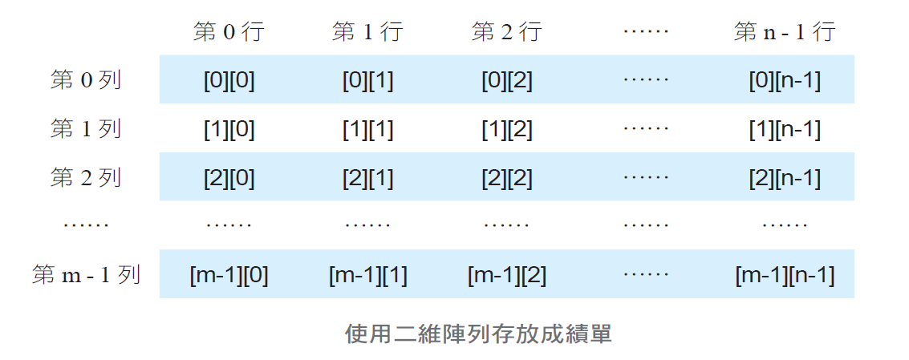

二維陣列可以想成是「表格」，用兩個索引（列、行）來定位一個元素，例如成績表中「第幾位學生」、「第幾科」。

### 不同維度的陣列

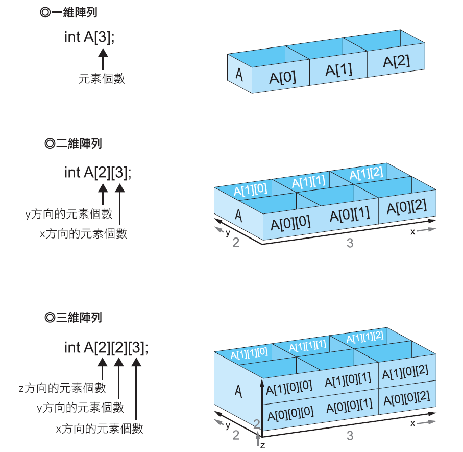

陣列不限於一維、二維，也可以擴充到三維甚至更高維度，只是隨著維度增加，宣告與存取的索引也會愈來愈複雜。

### 陣列的應用：多項式與稀疏矩陣

**存放多項式**：使用陣列 `Polynomial[]` 存放多項式 $c_nX^n+c_{n-1}X^{n-1}+\cdots+c_1X^1+c_0X^0$ ，以 $8X^4-6X^2+3X^5+5$ 為例，`Polynomial[]={5,3,8,0,-6,0,5}`：

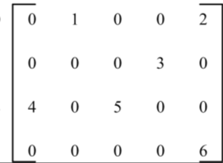

**存放稀疏矩陣**：當矩陣中絕大多數元素都是 0（稀疏矩陣，sparse matrix）時，若還是用二維陣列把所有元素（包括一大堆 0）都存起來，會非常浪費記憶體空間。改用陣列只記錄「非零元素的列、行、值」，可以大幅節省空間：

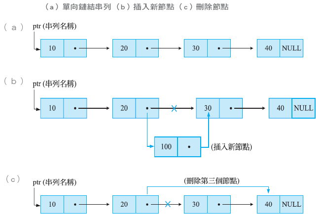

> **課堂重點**：稀疏矩陣的儲存技巧，展現了資料結構設計的核心精神——**針對資料的實際分布特性選擇最適合的儲存方式**，而不是無腦套用最直覺（卻可能很浪費）的二維陣列做法。這種「只記錄有意義的資訊、省略重複或無意義的空白」的思維，在後面的霍夫曼編碼（第 12-5-5 節）中也會再次出現。

---

## 12-2　鏈結串列

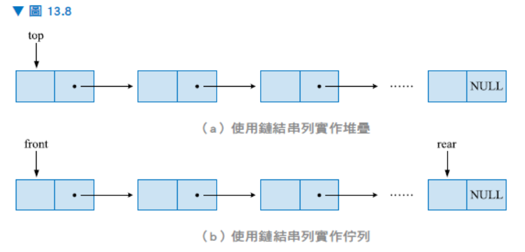

**鏈結串列（linked list）** 是由一連串的**節點（node）**所組成，每個節點包含**資料欄位**與**指標欄位**（指向下一個節點的位址），節點在記憶體中不需要連續排列，靠指標把它們「串」起來。

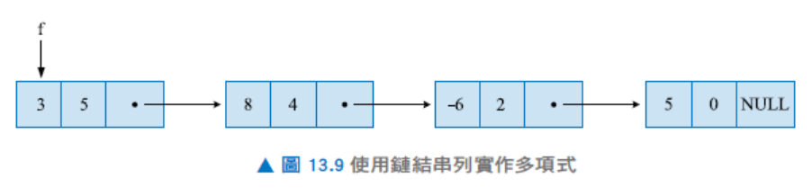

**鏈結串列的應用**：

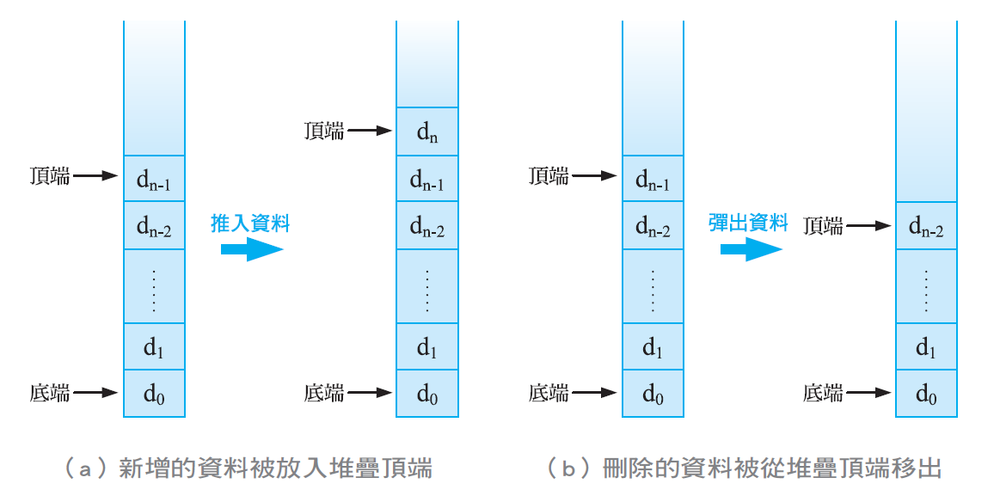

鏈結串列可以用來實作堆疊、佇列等其它資料結構，因為它的大小可以動態增長或縮減，不像陣列宣告時就必須固定大小。

> **課堂重點（呼應練習題第 11 題）**：陣列與鏈結串列最核心的取捨（trade-off）——**陣列存取任一元素的速度快（ $O(1)$ ，可以直接用索引計算位址），但大小固定，插入/刪除中間元素需要搬移大量資料；鏈結串列插入/刪除節點很有效率（不需要搬移其它節點，只要改指標），但存取任一元素必須從頭開始沿著指標一路走訪（ $O(n)$ ），無法隨機存取**。

### 練習題第 11 題參考解答

第 12-2 節定義的 `list_node`、`list_pointer` 結構，建立一個函式建立包含兩個節點的鏈結串列，第一個節點的資料為 100、第二個節點的資料為 1000，第一個節點的指標指向第二個節點，第二個節點的指標指向 NULL：

```c
list_pointer create()
{
    list_pointer node1, node2;
    node1 = (list_pointer)malloc(sizeof(list_node));
    node2 = (list_pointer)malloc(sizeof(list_node));
    node1->data = 100;
    node1->link = node2;
    node2->data = 1000;
    node2->link = NULL;
    return node1;
}
```

---

## 12-3　堆疊

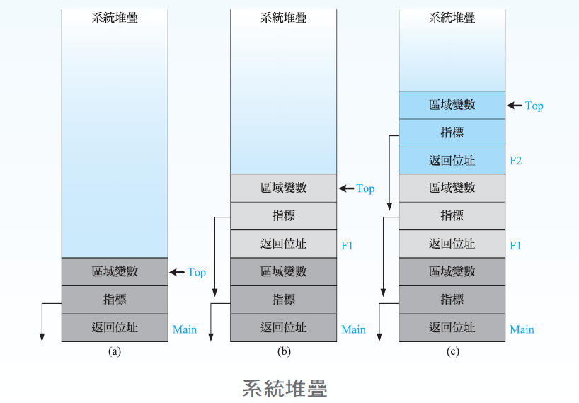

**堆疊（stack）** 是一種**後進先出（LIFO，Last In First Out）**的資料結構，資料只能從堆疊的頂端（top）進行插入（push）與刪除（pop）動作，就像一疊盤子，只能從最上面拿、也只能往最上面疊。

**堆疊的應用**：

- **資料反轉（data reversing）**：利用堆疊「後進先出」的特性，可以輕易把資料順序反轉過來。
- **資料剖析（data parsing）**：例如程式語言的編譯器，利用堆疊來檢查括號是否成對出現、剖析運算式的結構。
- **回溯（backtracking）**：利用堆疊記錄走過的路徑，一旦此路不通，就能「回溯」到上一步（第 11 章「回溯法」與八皇后問題正是這個概念的實際應用）。

### 資訊部落：系統堆疊


當程式呼叫函式（或發生遞迴呼叫）時，電腦會利用**系統堆疊（system stack）**記錄每一層呼叫的返回位址、區域變數等資訊——每呼叫一層函式，就 push 一份新的堆疊訊框（stack frame）；函式執行完畢返回時，就把該層的堆疊訊框 pop 掉，程式才能正確跳回呼叫者原本執行的位置繼續執行。

> **課堂連結**：這正好呼應第 11 章「遞迴」——遞迴呼叫之所以能夠正確運作、一層層往下呼叫又一層層返回，背後仰賴的正是系統堆疊的「後進先出」特性，這也是遞迴呼叫層數太深時會發生「stack overflow（堆疊溢位）」錯誤的原因：系統堆疊的空間並非無限大。

### 堆疊操作模擬（呼應學習評量第 1、2 題）

**範例 1**：假設堆疊 $S=(A,B,C,D,E)$ ，其中 E 為頂端，A 為底端，經過 pop、pop、push F、push G、push H、pop 的動作後，堆疊的最終狀態為何？

| 操作 | 堆疊狀態（由底到頂） |
|---|---|
| 初始 | A, B, C, D, E |
| pop | A, B, C, D |
| pop | A, B, C |
| push F | A, B, C, F |
| push G | A, B, C, F, G |
| push H | A, B, C, F, G, H |
| pop | A, B, C, F, G |

**答案： $S=(A,B,C,F,G)$**

**範例 2**：假設堆疊 $S=(A,B,C)$ ，其中 C 為頂端，A 為底端，經過 pop、push D、push E、pop、push F 的動作後，堆疊的最終狀態為何？

| 操作 | 堆疊狀態（由底到頂） |
|---|---|
| 初始 | A, B, C |
| pop | A, B |
| push D | A, B, D |
| push E | A, B, D, E |
| pop | A, B, D |
| push F | A, B, D, F |

**答案： $S=(A,B,D,F)$**

---

## 12-4　佇列

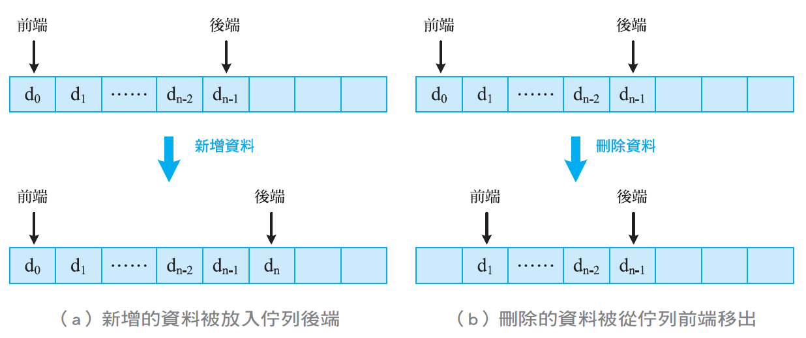

**佇列（queue）** 是一種**先進先出（FIFO，First In First Out）**的資料結構，資料從**尾端（rear）**加入（enqueue），從**前端（front）**刪除（dequeue），就像排隊買票，先來的人先買到、先離開。

佇列經常應用於**工作排程（job scheduling）**，例如印表機的列印佇列、CPU 的工作排程。

### 佇列的實作與環狀佇列

一般用陣列實作佇列時，如果每次 dequeue 都只是移動 `front` 指標而不搬移資料，久而久之陣列前端會出現一大段「用過就浪費」的空間。**環狀佇列（circular queue）** 把陣列的頭尾邏輯上接起來，讓 `front`、`rear` 可以循環使用整個陣列空間，不會浪費。

<table>
<tr>
<td width="50%">

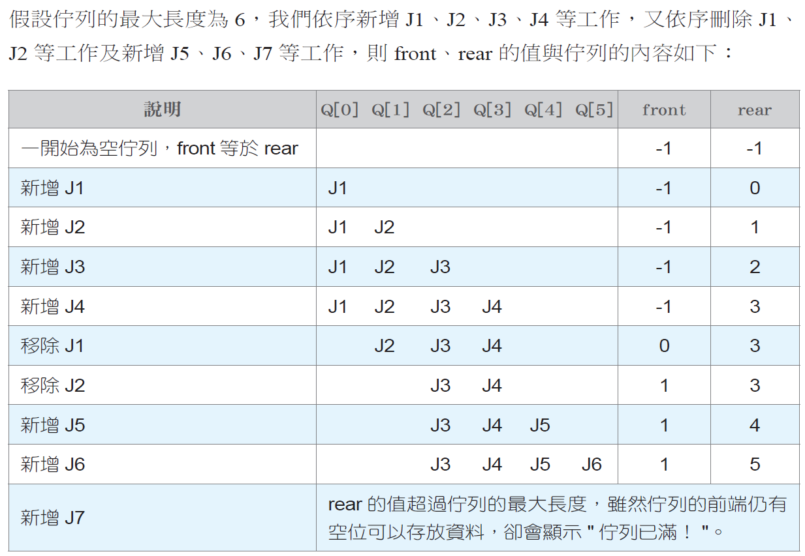

</td>
<td width="50%">

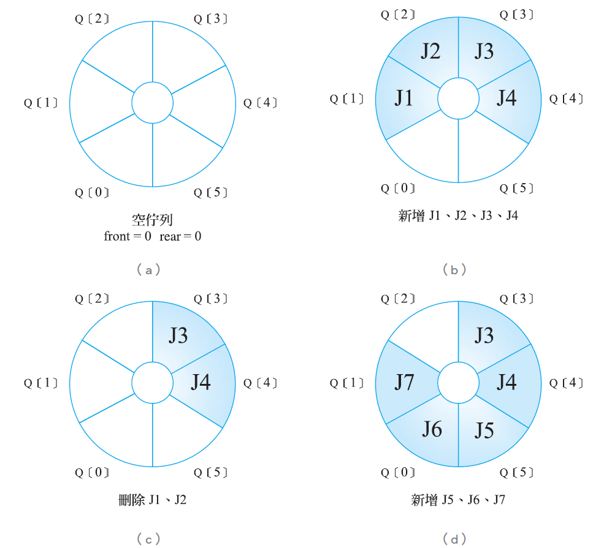

</td>
</tr>
</table>

### 環狀佇列模擬（呼應學習評量第 9、10 題）

**範例 1**：假設環狀佇列（大小為 6，Q[0]~Q[5]）的初始狀態為空佇列，`front=0`、`rear=0`，經過下面新增及刪除的動作後，`front`、`rear` 的值與環狀佇列的最終狀態為何？

**動作序列**：enqueue A、enqueue B、enqueue C、dequeue、enqueue D、enqueue E、enqueue F、dequeue、dequeue

| 說明 | Q[0] | Q[1] | Q[2] | Q[3] | Q[4] | Q[5] | front | rear |
|---|---|---|---|---|---|---|---|---|
| 一開始為空佇列，front 等於 rear | | | | | | | 0 | 0 |
| add A | | A | | | | | 0 | 1 |
| add B | | A | B | | | | 0 | 2 |
| add C | | A | B | C | | | 0 | 3 |
| delete | | | B | C | | | 1 | 3 |
| add D | | | B | C | D | | 1 | 4 |
| add E | | | B | C | D | E | 1 | 5 |
| add F | F | | B | C | D | E | 1 | 0 |
| delete | F | | | C | D | E | 2 | 0 |
| delete | F | | | | D | E | 3 | 0 |

**答案：front=3、rear=0**，佇列內容為 Q[3]D、Q[4]E、Q[0]F（有效資料為 D, E, F）

> **課堂提醒**：`rear` 指標在陣列最後一格（索引5）之後繼續新增，會**環繞（wrap around）**回到索引0（即 `add F` 之後 `rear` 從 5 變成 0，公式為 $rear=(rear+1)\bmod6$ ），這正是「環狀」佇列名稱的由來。

**範例 2**：假設環狀佇列的初始狀態如下圖（Q[1]=A、Q[2]=B、Q[3]=C、Q[4]=D，`front=0`、`rear=4`），經過下面新增及刪除的動作後，`front`、`rear` 的值與環狀佇列的最終狀態為何？

**動作序列**：dequeue、dequeue、enqueue E、F、G、H、dequeue

| 說明 | front | rear |
|---|---|---|
| 初始（A,B,C,D 已在佇列中） | 0 | 4 |
| dequeue（刪除 A） | 1 | 4 |
| dequeue（刪除 B） | 2 | 4 |
| enqueue E | 2 | 5 |
| enqueue F | 2 | 6 |
| enqueue G | 2 | 7 |
| enqueue H（環繞回0） | 2 | 0 |
| dequeue（刪除 C） | 3 | 0 |

**答案：front=3、rear=0**，佇列內容為 D、E、F、G、H（有效資料共 5 筆）

## 12-5　樹

**樹（tree）** 是一種階層式（hierarchical）的資料結構，由節點（node）與連接節點的邊（edge）所組成。

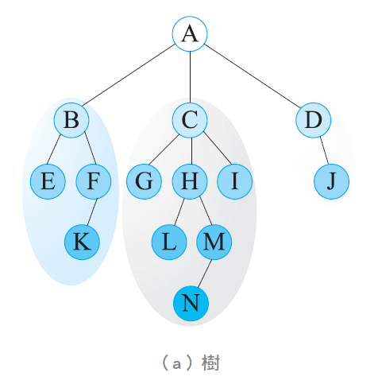

**相關名詞**：

- **分支度（degree）**：一個節點所擁有的子節點數目。
- **終端節點（terminal node）**：分支度為 0 的節點，也就是沒有任何子節點的節點（又稱樹葉節點、葉節點）。
- **非終端節點（nonterminal node）**：分支度不為 0 的節點。
- **階層（level）**：樹根的階層通常定義為 1，每往下一層，階層數加 1。
- **父節點（parent）**：直接連接在某節點上一層的節點。
- **子節點（child）**：直接連接在某節點下一層的節點。
- **兄弟（sibling）**：擁有相同父節點的節點彼此互為兄弟。
- **祖先（ancestor）**：從樹根到某節點路徑上所經過的所有節點。
- **子孫（descendant）**：以某節點為起點，往下延伸能到達的所有節點。
- **高度（height）或深度（depth）**：樹中階層的最大值。
- **樹林（forest）**：由零個或多個不相交的樹所組成的集合。

> **課堂重點（呼應學習評量第 23、26 題）**：上圖 (a) 中，以節點 B 為例，B 的分支度為 2（有 E、F 兩個子節點），B、C 互為兄弟節點（都是 A 的子節點）；節點 E、F、L、M、G、I、J 都是終端節點（樹葉）。判斷這些名詞最快的方法，就是直接在樹狀圖上圈出目標節點的**上一層（父節點）**與**下一層（子節點）**，其它名詞大多可以由此直接推導出來。

### 12-5-1　二元樹

**二元樹（binary tree）** 是每個節點最多有兩個子節點的樹，對高度為 $h$ 的二元樹來說，全部涵蓋最多總共有 $2^0+2^1+\cdots+2^{h-1}=2^h-1$ 個節點。

<table>
<tr>
<td width="50%">

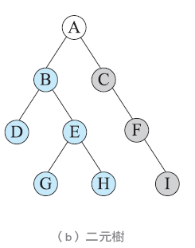

</td>
<td width="50%">

使用陣列存放二元樹：

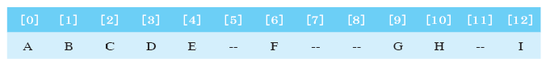

</td>
</tr>
</table>

使用鏈結串列存放二元樹：

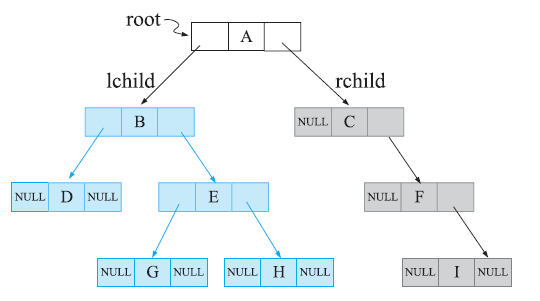

> **課堂重點**：用陣列存放二元樹時，若節點在陣列中的索引為 $i$ （從1開始），則其左子節點索引為 $2i$ 、右子節點索引為 $2i+1$ 、父節點索引為 $\lfloor i/2\rfloor$——這種「用數學公式直接算出親子關係」的特性，正是後面 12-5-3 節「堆積」選擇用陣列（而非鏈結串列）實作的主要原因。而鏈結串列存放二元樹，則是每個節點多包含兩個指標欄位（`lchild`、`rchild`），分別指向左右子節點，若無子節點則指標指向 NULL。

### 樹的走訪（Traversal）

樹的走訪，是指依照特定順序拜訪樹中所有節點恰好一次，二元樹常見的走訪方式有三種，皆以「根節點（root）」相對於「左子樹（L）」、「右子樹（R）」的拜訪順序來命名：

**中序走訪（inorder，左→根→右）**

```c
inorder(tree_pointer root)
{
    if (root){
        inorder(root->lchild);
        printf("%d ", root->data);
        inorder(root->rchild);
    }
}
```

右圖二元樹（A為根，B、C為A的子節點，D、E為B的子節點，F為C的子節點，G、H、I為……）的中序走訪結果為 **DBGEHACFI**。

**前序走訪（preorder，根→左→右）**

```c
preorder(tree_pointer root)
{
    if (root){
        printf("%d ", root->data);
        preorder(root->lchild);
        preorder(root->rchild);
    }
}
```

同一棵二元樹的前序走訪結果為 **ABDEGHCFI**。

**後序走訪（postorder，左→右→根）**

```c
postorder(tree_pointer root)
{
    if (root){
        postorder(root->lchild);
        postorder(root->rchild);
        printf("%d ", root->data);
    }
}
```

同一棵二元樹的後序走訪結果為 **DGHEBIFCA**。

> **課堂重點（呼應學習評量第 12 題）**：**只知道前序（或只知道後序）走訪結果，無法唯一還原出原本的二元樹**——因為缺少了「哪些節點屬於左子樹、哪些屬於右子樹」的分界資訊；但**只要同時擁有「前序＋中序」或「後序＋中序」兩種走訪結果，就能唯一還原出原本的二元樹**（中序走訪結果提供了關鍵的左右子樹分界資訊）。若只有前序和後序走訪結果，同樣無法保證還原出唯一的二元樹。這個結論正是練習題第 17、20、21 題「從兩種走訪結果反推二元樹」得以成立的理論基礎。

### 12-5-2　二元搜尋樹

**二元搜尋樹（binary search tree）** 是滿足下列條件的二元樹：

- 每個節點包含唯一的鍵值（key）。
- 左右子樹亦為二元搜尋樹。
- 左子樹的鍵值必須小於其樹根的鍵值。
- 右子樹的鍵值必須大於其樹根的鍵值。

**單例來說**：將數字串列 {25, 30, 24, 58, 45, 26, 12, 14} 建構為二元搜尋樹的過程如下：

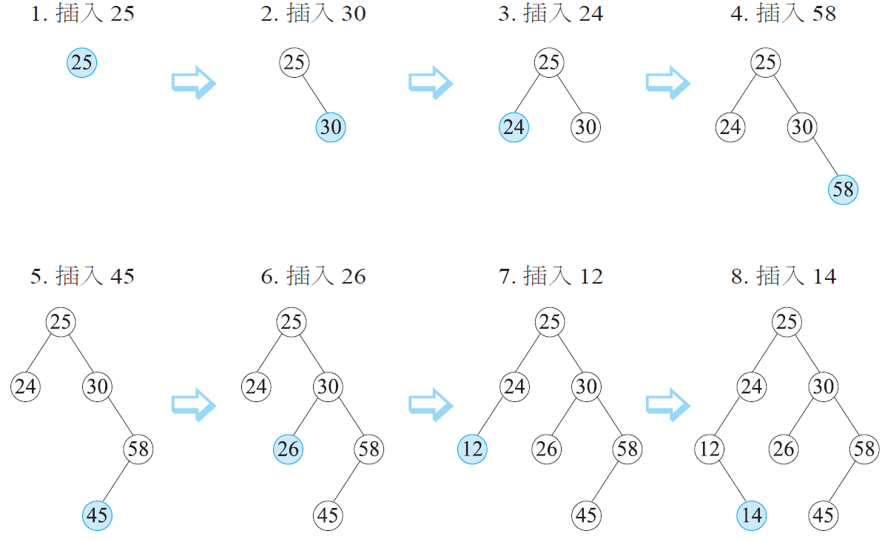

**刪除節點 25 的結果**（刪除有兩個子節點的節點時，習慣做法是用其中序後繼——也就是右子樹中最小的節點——來取代）：

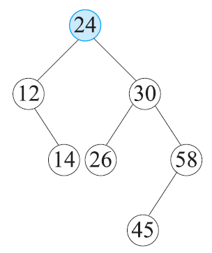

> **課堂重點**：二元搜尋樹之所以叫「搜尋」樹，是因為它的結構天生就適合拿來搜尋資料——搜尋時，只要拿目標值和目前節點比較：**比目前節點小就往左子樹找、比目前節點大就往右子樹找**，每比較一次就能排除掉一整個子樹的搜尋範圍，這正是第 11 章「二元搜尋」演算法時間複雜度能達到 $O(\log_2n)$ 的資料結構基礎。

---

### 12-5-3　堆積

**堆積（heap）** 是一種特殊形式的完整二元樹，實作時通常用陣列儲存。要理解堆積，得先認識兩個相關名詞：

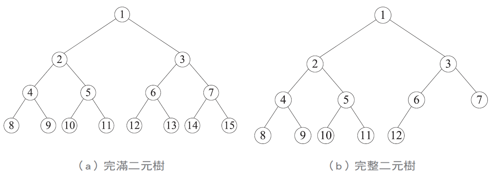

- **完滿二元樹（full binary tree）**：高度為 $h$ 且節點個數為 $2^h-1$ 的二元樹（每一層都填滿）。
- **完整二元樹（complete binary tree）**：高度為 $h$ 、節點個數為 $n$ ，且節點順序對應至高度為 $h$ 之完滿二元樹的節點編號 $1\sim n$ 的二元樹（除了最後一層，其它層都填滿，且最後一層的節點由左往右依序排列，不能有空缺）。

堆積又分為下列兩種類型：

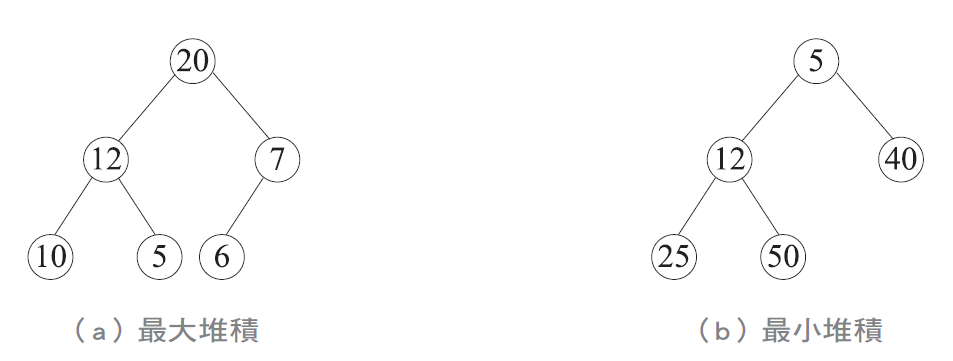

- **最大堆積（max heap）**：是一種形式特殊的完整二元樹，每個內部節點的鍵值一律**大於等於**其子節點的鍵值。
- **最小堆積（min heap）**：是一種形式特殊的完整二元樹，每個內部節點的鍵值一律**小於等於**其子節點的鍵值。

> **課堂重點**：堆積的用途是**快速找出一堆資料中的最大值或最小值**——因為最大堆積的樹根永遠是整棵樹中最大的數值（最小堆積的樹根永遠是最小值），不需要搜尋整棵樹，直接讀取樹根即可，時間複雜度只要 $O(1)$ ，這正是堆積常被用來實作「優先權佇列（priority queue）」的原因。

### 堆積的插入

**範例**：在下圖的最大堆積 {20, 12, 7, 10, 5, 6} 中插入 25：

<table>
<tr>
<td width="33%">

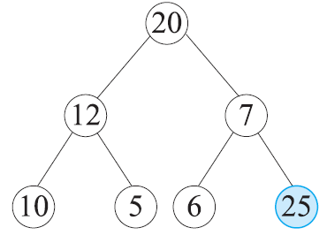

</td>
<td width="33%">

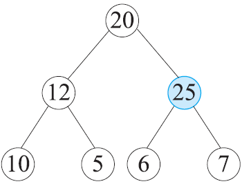

</td>
<td width="33%">

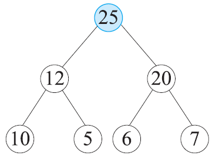

</td>
</tr>
</table>

**插入步驟**：① 先把新元素放入完整二元樹的**下一個空位**（維持完整二元樹的形狀）；② 將新元素與其**父節點**比較，若新元素較大（違反最大堆積的規則），就與父節點**交換**；③ 重複步驟②，直到新元素不再大於父節點，或新元素已經到達樹根為止（這個「一路往上比較交換」的動作稱為**上濾，percolate up**）。

以插入 25 為例：25 先放入 7 的右子節點位置 → 25>7，交換，25 上升到 7 原本的位置 → 25>20，再交換，25 成為新的樹根。

### 堆積的刪除

**範例**：在下圖的最大堆積 {20, 12, 7, 10, 5, 6} 中刪除一個節點（刪除樹根）：

<table>
<tr>
<td width="25%">

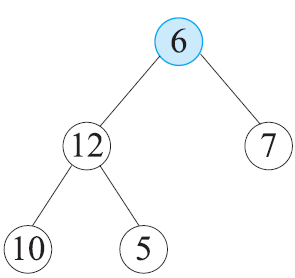

</td>
<td width="25%">

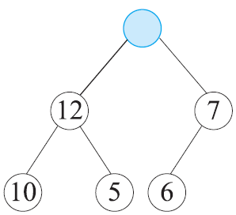

</td>
<td width="25%">

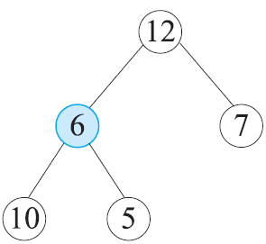

</td>
<td width="25%">

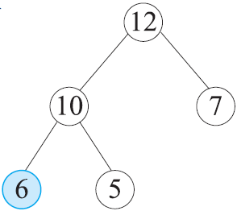

</td>
</tr>
</table>

**刪除步驟**（刪除的目標通常是樹根，也就是最大值）：① 取出樹根的值（也就是要刪除、傳回的值）；② 把**完整二元樹中最後一個節點**的值搬移到樹根位置，並移除原本最後一個節點（維持完整二元樹的形狀）；③ 將新的樹根與其**較大的子節點**比較，若小於該子節點（違反最大堆積規則），就與該子節點**交換**；④ 重複步驟③，直到新的節點值不再小於任一子節點，或已經到達葉節點為止（這個「一路往下比較交換」的動作稱為**下濾，percolate down**）。

以刪除樹根（值為 20）為例：先把最後一個節點 6 搬到樹根 → 6 比左子節點 12 小，交換 → 6 現在的子節點是 10（原本 12 的子節點），6 比 10 小，再交換 → 最終樹根變成 12，其左子節點為 10、10 的子節點為 6 與 5，右子節點仍為 7。

> **課堂重點（呼應學習評量第 28 題）**：用陣列實作堆積時，若節點索引為 $i$ ，其左子節點索引為 $2i$ 、右子節點索引為 $2i+1$ 、父節點索引為 $\lfloor i/2\rfloor$ ，這些**索引全部可以用數學公式直接算出，不需要額外的指標欄位**，因此尋找一個節點的子節點或父節點，時間複雜度都是 $O(1)$ 。而堆積的「分支度」，因為是完整二元樹的特性，除了最後一層外，每個節點的分支度均為 0（樹葉）或 2（有兩個子節點），**不會有分支度恰好為 1 的節點**（除了完整二元樹最後一層可能出現的特例）。新增一個數值到包含 $n$ 個節點的最大堆積，由於新節點最多要一路上濾到樹根，樹的高度為 $O(\log n)$ ，因此時間複雜度為 $O(\log n)$ 。

---

### 12-5-4　運算式樹

**運算式樹（expression tree）** 指的是滿足下列條件的二元樹：

- 終端節點為運算元（operand）。
- 非終端節點為運算子且其樹根為運算子。

下面是將 $A*(B+C)-D$ 建構為運算式樹的過程：

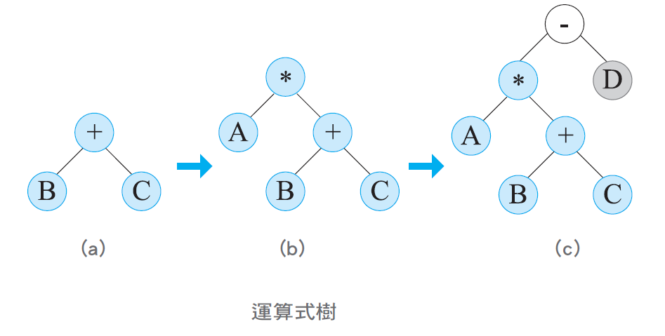

**建構方法**：依照運算子的優先順序和結合性，將運算式加上括號，例如 $A*(B+C)-D$ 加上括號後為 $((A*(B+C))-D)$ ，由最內側的括號開始依次建構運算式樹，如上圖 (a)(b)(c) 所示：先建構 $(B+C)$ 的子樹，再建構 $A*(B+C)$ （以 `*` 為樹根，左子樹為 A，右子樹為剛才的 `+` 子樹），最後建構整個 $A*(B+C)-D$ （以 `-` 為樹根，左子樹為剛才的 `*` 子樹，右子樹為 D）。

> **課堂重點**：運算式樹建好之後，剛好對應了運算式的三種表示法——**中序走訪運算式樹會得到中序表示式（infix）、前序走訪會得到前序表示式（prefix）、後序走訪會得到後序表示式（postfix）**，這正是第 12 章運算式表示法轉換題目背後真正的資料結構原理。

### 12-5-5　霍夫曼樹

**霍夫曼樹（Huffman tree）** 是一種特殊的二元樹，用來實現霍夫曼編碼——讓出現頻率愈高的符號，對應到愈短的編碼（詳見第 3 章 3-11-2 節）。

假設 A、B、C、D、E 等五個符號的出現頻率為 0.18、0.20、0.35、0.15、0.12，那麼我們可以依照前述步驟建構如下的霍夫曼樹：

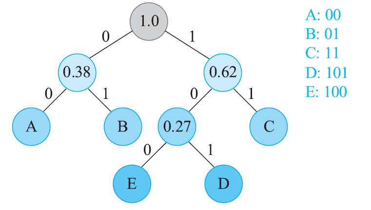

依照上圖，各符號的編碼為：A: 00、B: 01、C: 11、D: 101、E: 100。

> **課堂重點**：霍夫曼樹的建構過程，正是第 12-5-3 節「堆積」的絕佳實務應用——建構霍夫曼樹時，每次都要從所有候選節點中找出**頻率最小的兩個**進行合併，這個「反覆找出最小值」的操作，用最小堆積（min heap）來實作，效率遠比每次都線性掃描所有節點來得快，這也是為什麼堆積在資料結構的實務應用中佔有重要地位。

---

## 本章總結

| 小節 | 核心觀念一句話 |
|---|---|
| 12-1 陣列 | 連續記憶體、索引直接定位，存取快但大小固定 |
| 12-2 鏈結串列 | 節點靠指標相連，插入刪除有效率但不能隨機存取 |
| 12-3 堆疊 | 後進先出，是系統堆疊、遞迴呼叫、回溯法的底層基礎 |
| 12-4 佇列 | 先進先出，環狀佇列讓陣列空間得以循環使用不浪費 |
| 12-5 樹 | 二元樹三種走訪(前中後序)+二元搜尋樹+堆積+運算式樹+霍夫曼樹 |

### 關鍵詞彙表（Glossary）

`陣列` `一維陣列` `二維陣列` `多項式` `稀疏矩陣` `鏈結串列` `節點` `堆疊` `後進先出LIFO` `push` `pop` `系統堆疊` `佇列` `先進先出FIFO` `enqueue` `dequeue` `環狀佇列` `樹` `分支度` `終端節點` `非終端節點` `階層` `父節點` `子節點` `兄弟` `祖先` `子孫` `高度` `深度` `樹林` `二元樹` `前序走訪` `中序走訪` `後序走訪` `二元搜尋樹` `堆積` `最大堆積` `最小堆積` `完滿二元樹` `完整二元樹` `上濾` `下濾` `運算式樹` `霍夫曼樹`

---

## 第 12 章　學習評量

> 以下為課本第 12 章隨附之官方學習評量，題目逐字謄錄，共 28 題。答案為課本官方解答，並在其下補充**完整計算過程與解說**（絕大多數並以程式實際執行結果核對），方便課堂上直接點開講解、對答案。

**1. 假設堆疊 $S=(A,B,C,D,E)$ ，其中 E 為頂端，A 為底端，試問，在經過下面推入及彈出的動作後，堆疊的最終狀態為何？**

`pop　pop　push F　push G　push H　pop`

<details>
<summary>▶ 參考答案</summary>

依序執行：pop（剩ABCD）、pop（剩ABC）、push F（ABCF）、push G（ABCFG）、push H（ABCFGH）、pop（剩ABCFG）。

**答案： $S=(A,B,C,F,G)$**

</details>

---

**2. 假設堆疊 $S=(A,B,C)$ ，其中 C 為頂端，A 為底端，試問，在經過下面推入及彈出的動作後，堆疊的最終狀態為何？**

`pop　push D　push E　pop　push F`

<details>
<summary>▶ 參考答案</summary>

依序執行：pop（剩AB）、push D（ABD）、push E（ABDE）、pop（剩ABD）、push F（ABDF）。

**答案： $S=(A,B,D,F)$**

</details>

---

**3. 假設主程式 Main 呼叫了函式 A，而函式 A 呼叫了函式 B，待函式 B 執行完畢後，函式 A 又接著呼叫函式 C，待函式 C 執行完畢後，函式 A 才算執行完畢得以返回主程式 Main，試描繪系統堆疊內的變化。**

<details>
<summary>▶ 參考答案</summary>

系統堆疊的變化過程如下（由下往上為堆疊由底到頂）：

```
① 呼叫 A：       [Main] → [Main, A]
② A 呼叫 B：     [Main, A] → [Main, A, B]
③ B 執行完畢返回： [Main, A, B] → [Main, A]        (B 的堆疊訊框被 pop 掉)
④ A 呼叫 C：     [Main, A] → [Main, A, C]
⑤ C 執行完畢返回： [Main, A, C] → [Main, A]        (C 的堆疊訊框被 pop 掉)
⑥ A 執行完畢返回： [Main, A] → [Main]              (A 的堆疊訊框被 pop 掉，返回 Main)
```

每呼叫一層函式，就在系統堆疊 push 一個新的堆疊訊框；函式執行完畢返回時，就把該堆疊訊框 pop 掉，程式流程回到呼叫者原本執行的位置——這正是系統堆疊「後進先出」特性最典型的應用。

</details>

---

**4. 將 $(A+B)*5+(15*C+2)/7+6$ 由中序表示法轉換成後序表示式。**

<details>
<summary>▶ 參考答案與解說</summary>

**答案：`AB+5*15C*2+7/+6+`**

轉換技巧：依序處理每個括號內的運算，並把運算子移到對應運算元的後面——$(A+B)\to AB+$ ； $15*C\to15C*$ ； $(15*C+2)\to15C*2+$ ； $(A+B)*5\to AB+5*$ ； $(15*C+2)/7\to15C*2+7/$ ；最後把三個部分依加法運算子串起來：`AB+5*` + `15C*2+7/` + `+6+`。

</details>

---

**5. 將 $(8+2*5)/(1+3*2-4)$ 由中序表示法轉換成後序表示式。**

<details>
<summary>▶ 參考答案</summary>

**答案：`825*+132*+4-/`**

$(8+2*5)\to8\ 25*+$ ； $(1+3*2-4)\to1\ 32*+4-$ ；兩者用 `/` 結合：`825*+` + `132*+4-` + `/`。

</details>

---

**6. 將 $((A+B)*C+D)/(E+F+G)$ 由中序表示法轉換成前序表示式。**

<details>
<summary>▶ 參考答案</summary>

**答案：`/+*+ABCD+E+FG`**

由最內側括號開始逐步建構： $(A+B)\to+AB$ ； $(A+B)*C\to*+ABC$ ； $((A+B)*C+D)\to+*+ABCD$ ； $(E+F+G)$ 依序結合為 $+E+FG$ ；最後把分子、分母用 `/` 結合：`/` + `+*+ABCD` + `+E+FG`。

</details>

---

**7. 將 $A/B-C+D*E-A*C$ 由中序表示法轉換成後序表示式。**

<details>
<summary>▶ 參考答案</summary>

**答案：`AB/C-DE*+AC*-`**

依運算子優先順序（`*`、`/` 優先於 `+`、`-`，同優先權由左至右結合）逐步轉換： $A/B\to AB/$ ； $(A/B)-C\to AB/C-$ ； $D*E\to DE*$ ； $(A/B-C)+D*E\to AB/C-DE*+$ ； $A*C\to AC*$ ；最後： $AB/C-DE*+AC*-$ 。

</details>

---

**8. 求出下列前序運算式的值（A=3、B=8、C=3、D=9、E=3）：**

**(1) $-+*/4237\ 2$　(2) $+*A-BC/DC$**

<details>
<summary>▶ 參考答案與完整計算過程</summary>

**(1) 答案：11**

由內而外逐步計算： $/42=4/2=2$ ； $*23$……應為 $*(/42)3=2*3=6$ ； $+(6)7=6+7=13$ ； $-(13)2=13-2=11$ 。

**(2) 答案：18**

代入 A=3、B=8、C=3、D=9、C=3： $-BC=B-C=8-3=5$ ； $*A(-BC)=A*5=3*5=15$ ； $/DC=D/C=9/3=3$ ； $+(15)(3)=15+3=18$ 。

</details>

---

**9. 假設環狀佇列的初始狀態為如下圖的空佇列，試問，在經過下面新增及刪除的動作後，front、rear 的值與環狀佇列的最終狀態為何？**

`enqueue A　enqueue B　enqueue C　dequeue　enqueue D　enqueue E　enqueue F　dequeue　dequeue`

<details>
<summary>▶ 參考答案與完整追蹤過程</summary>

（陣列大小為 6，Q[0]~Q[5]，初始 front=0、rear=0）

| 說明 | Q[0] | Q[1] | Q[2] | Q[3] | Q[4] | Q[5] | front | rear |
|---|---|---|---|---|---|---|---|---|
| 一開始為空佇列，front 等於 rear | | | | | | | 0 | 0 |
| add A | | A | | | | | 0 | 1 |
| add B | | A | B | | | | 0 | 2 |
| add C | | A | B | C | | | 0 | 3 |
| delete | | | B | C | | | 1 | 3 |
| add D | | | B | C | D | | 1 | 4 |
| add E | | | B | C | D | E | 1 | 5 |
| add F | F | | B | C | D | E | 1 | 0 |
| delete | F | | | C | D | E | 2 | 0 |
| delete | F | | | | D | E | 3 | 0 |

**答案：front=3、rear=0**，佇列內容為 D（Q[3]）、E（Q[4]）、F（Q[0]）。

</details>

---

**10. 假設環狀佇列的初始狀態為如下圖，試問，在經過下面新增及刪除的動作後，front、rear 的值與環狀佇列的最終狀態為何？**

（初始：Q[1]=A、Q[2]=B、Q[3]=C、Q[4]=D，front=0、rear=4）

`dequeue　dequeue　enqueue E、F、G、H　dequeue`

<details>
<summary>▶ 參考答案與完整追蹤過程</summary>

（陣列大小為 8，Q[0]~Q[7]）

| 說明 | front | rear |
|---|---|---|
| 初始（Q[1]A、Q[2]B、Q[3]C、Q[4]D） | 0 | 4 |
| dequeue（刪除 A） | 1 | 4 |
| dequeue（刪除 B） | 2 | 4 |
| enqueue E | 2 | 5 |
| enqueue F | 2 | 6 |
| enqueue G | 2 | 7 |
| enqueue H（rear 環繞回0） | 2 | 0 |
| dequeue（刪除 C） | 3 | 0 |

**答案：front=3、rear=0**，佇列內容為 D（Q[4]）、E（Q[5]）、F（Q[6]）、G（Q[7]）、H（Q[0]）。

</details>

---

**11. 請根據第 12-2 節所定義的 `list_node`、`list_pointer` 結構，撰寫一個函式建立包含兩個節點的鏈結串列，而且這兩個節點的資料為 100、1000，第一個節點的指標指向第二個節點，第二個節點的指標指向 NULL，如下圖。**

<details>
<summary>▶ 參考答案</summary>

```c
list_pointer create()
{
    list_pointer node1, node2;
    node1 = (list_pointer)malloc(sizeof(list_node));
    node2 = (list_pointer)malloc(sizeof(list_node));
    node1->data = 100;
    node1->link = node2;
    node2->data = 1000;
    node2->link = NULL;
    return node1;
}
```

</details>

---

**12. 我們可以從前序走訪結果或後序走訪結果推斷出唯一的二元樹嗎？簡單說明其原因。**

<details>
<summary>▶ 參考答案</summary>

**不能。** 我們可以從「前序追蹤結果和中序追蹤結果」推斷出唯一的二元樹，或從「後序追蹤結果和中序追蹤結果」推斷出唯一的二元樹，但**不能單獨從前序追蹤結果或後序追蹤結果推斷出唯一的二元樹**，另外，若從前序追蹤結果和後序追蹤結果，則可能推斷出不是唯一的二元樹。

**原因**：中序走訪結果之所以是關鍵，是因為它提供了「樹根左邊的節點屬於左子樹、右邊的節點屬於右子樹」這項分界資訊；單靠前序（根→左→右）或後序（左→右→根）走訪結果，雖然能知道誰是樹根，卻無法判斷剩餘的節點該如何切分成左右兩個子樹，因此無法保證還原出唯一的樹狀結構。

</details>

---

**13. 寫出下列二元樹的前序、中序與後序走訪結果。**

（樹的結構：H 為根，唯一子節點 A；A 的子節點為 B、C；B 的子節點為 D、E；D 的右子節點為 I（無左子節點）；E 的子節點為 J（左）、K（右）；C 的子節點為 F、G；F 的子節點為 L、M；G 的左子節點為 N（無右子節點））

<details>
<summary>▶ 參考答案（已以程式重新建樹並執行驗證）</summary>

**前序追蹤：HABDIEJKCFLMGN**

**中序追蹤：DIBJEKALFMCNGH**

**後序追蹤：IDJKEBLMFNGCAH**

</details>

---

**14. 將 $a/b**c*d-e$ 描繪成運算式樹。**

<details>
<summary>▶ 參考答案</summary>

依照運算子優先順序（`**` 冪次 > `*`、`/` > `+`、`-`）， $a/b**c*d-e$ 應理解為 $((a/(b**c))*d)-e$ ，建構出的運算式樹（以 `-` 為樹根）：

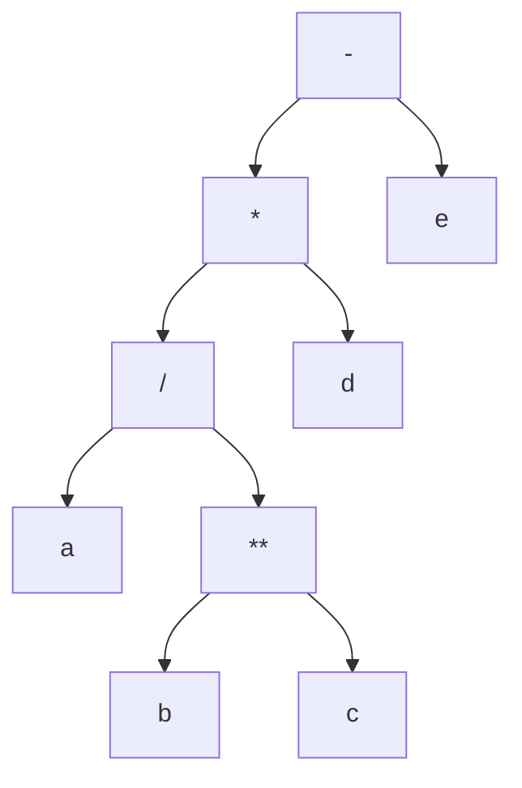
```mermaid
graph TD
    Root["-"] --> Star["*"]
    Root --> e["e"]
    Star --> Slash["/"]
    Star --> d["d"]
    Slash --> a["a"]
    Slash --> Pow["**"]
    Pow --> b["b"]
    Pow --> c["c"]
```

樹根為 `-`，左子樹為 `*`（其左子樹又是 `/`，`/` 的左右子樹分別為 `a` 與 `**`(b,c)；`*` 的右子樹為 `d`），右子樹為 `e`。

</details>

---

**15. 假設有一個數字串列為 14, 15, 5, 9, 8, 19, 2, 6, 4, 20, 17, 10, 7, 13，請回答下列問題：**

**(1) 將這數字串列建構為二元搜尋樹。(2) 寫出該二元搜尋樹的後序走訪結果。(3) 寫出該二元搜尋樹包含幾個樹葉與深度。**

<details>
<summary>▶ 參考答案（已以程式建構BST並執行驗證）</summary>

**(1) 依序插入後的二元搜尋樹結構**：

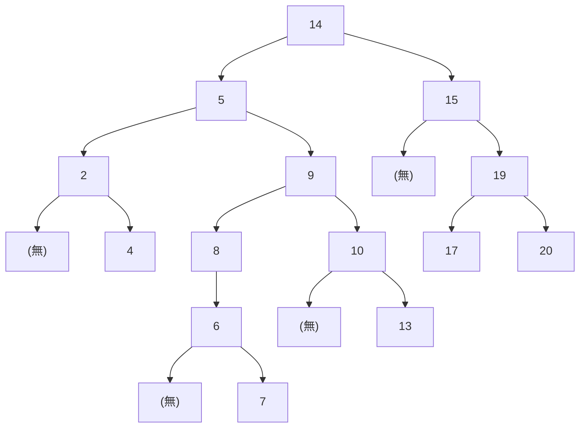
```mermaid
graph TD
    N14["14"] --> N5["5"]
    N14 --> N15["15"]
    N5 --> N2["2"]
    N5 --> N9["9"]
    N2 --> N2L["(無)"]
    N2 --> N4["4"]
    N9 --> N8["8"]
    N9 --> N10["10"]
    N8 --> N6["6"]
    N10 --> N10L["(無)"]
    N10 --> N13["13"]
    N6 --> N6L["(無)"]
    N6 --> N7["7"]
    N15 --> N15L["(無)"]
    N15 --> N19["19"]
    N19 --> N17["17"]
    N19 --> N20["20"]
```

**(2) 後序走訪結果：4, 2, 7, 6, 8, 13, 10, 9, 5, 17, 20, 19, 15, 14**

**(3) 樹葉個數：5 個**（4、7、13、17、20）；**深度：6**（14→5→9→8→6→7 這條路徑最長，共6層）

</details>

---

**16. 寫出堆疊、佇列、樹等資料結構的應用各兩種。**

<details>
<summary>▶ 參考答案</summary>

**堆疊**：遞迴函數呼叫（系統堆疊）、運算式表示法轉換（中序轉後序/前序）（另外資料反轉、走迷宮／回溯法亦可）。

**佇列**：作業系統的工作排程；印表機的列印佇列。

**樹**：排序（例如堆積排序）、搜尋（例如二元搜尋樹）（另外決策樹、霍夫曼編碼壓縮亦可）。

</details>

---

**17. 假設有棵二元樹的中序走訪結果為 AIBHCGDFE，後序走訪結果為 ABICHDGEF，試問，其前序走訪結果為何？**

<details>
<summary>▶ 參考答案（已以程式重建二元樹並執行驗證）</summary>

**答案：FGHIABCDE**

由後序走訪的最後一個節點（F）可知樹根為 F，再對照中序走訪找出 F 左右兩側的節點分別屬於左右子樹，遞迴地重複此過程即可還原整棵樹，最終得到前序走訪結果為 **FGHIABCDE**。

</details>

---

**18. 假設有棵二元樹的深度為 k，試問，它最多包含幾個節點？**

<details>
<summary>▶ 參考答案</summary>

**答案： $2^0+2^1+\cdots+2^{k-1}=2^k-1$**

深度為 k 的二元樹，第 1 層（樹根）最多 $2^0=1$ 個節點，第 2 層最多 $2^1=2$ 個節點……第 k 層最多 $2^{k-1}$ 個節點，全部加總即為等比級數 $2^0+2^1+\cdots+2^{k-1}=2^k-1$ ，這正是「完滿二元樹」節點數目的公式。

</details>

---

**19. (1) 求出後序運算式 $AB*CD+-A/$ 的值，其中 $A=2$ 、 $B=3$ 、 $C=4$ 、 $D=5$ 。**

**(2) 將運算式 $/*+ABC/D-EF$ 由前序表示法轉換成中序表示法。**

<details>
<summary>▶ 參考答案與完整計算過程</summary>

**(1) 答案：-1.5**

依序運算： $AB*=2*3=6$ ； $CD+=4+5=9$ ； $(AB*)(CD+)-=6-9=-3$ ； $(以上結果)A/=-3/2=-1.5$ 。

**(2) 答案： $((A+B)*C)/(D/(E-F))$**

由樹根 `/` 開始，左子樹為 $*+ABC\to(A+B)*C$ ，右子樹為 $/D-EF\to D/(E-F)$ ，合併得 $((A+B)*C)/(D/(E-F))$ 。

</details>

---

**20. 假設二元樹的前序走訪結果為 ABCDE，中序走訪結果為 CBDAE，試描繪該二元樹。**

<details>
<summary>▶ 參考答案（已以程式重建並執行驗證）</summary>

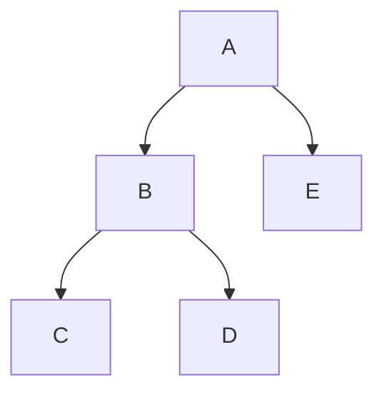
```mermaid
graph TD
    A --> B
    A --> E
    B --> C
    B --> D
```

樹根為 A（前序第一個），左子樹（中序中 A 左側的 C、B、D）以 B 為根（前序中僅次於 A 的節點），B 的左子節點為 C、右子節點為 D；A 的右子樹只有 E 一個節點。

</details>

---

**21. 假設二元樹的後序走訪結果為 HAIECJDKFBG，中序走訪結果為 HACEIGJDBKF，試描繪該二元樹。**

<details>
<summary>▶ 參考答案（已以程式重建並執行驗證）</summary>

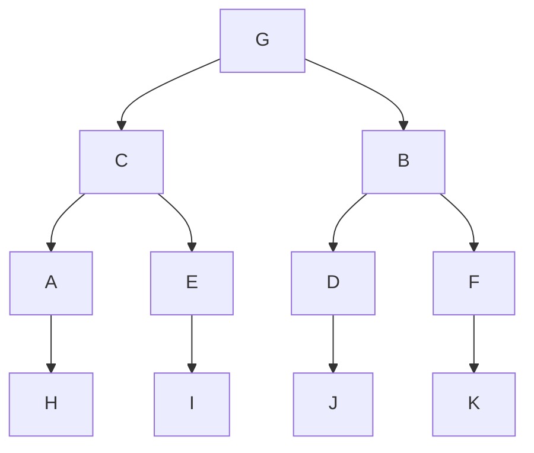
```mermaid
graph TD
    G --> C
    G --> B
    C --> A
    C --> E
    A --> H
    E --> I
    B --> D
    B --> F
    D --> J
    F --> K
```

樹根為 G（後序最後一個節點），左子樹以 C 為根（C 左子樹為 A，A 有左子節點 H；C 右子樹為 E，E 有右子節點 I），右子樹以 B 為根（B 左子樹為 D，D 有左子節點 J；B 右子樹為 F，F 有左子節點 K）。

</details>

---

**22. 假設有下列 10 筆資料，讀取頻率均不同，試建立一棵霍夫曼樹使其平均搜尋次數最少。**

| 資料 | a | b | c | d | e | f | g | h | k | m |
|---|---|---|---|---|---|---|---|---|---|---|
| 機率 | 0.12 | 0.07 | 0.04 | 0.21 | 0.06 | 0.08 | 0.05 | 0.03 | 0.25 | 0.09 |

<details>
<summary>▶ 參考答案（已以程式執行標準霍夫曼演算法驗證，取最小兩者合併）</summary>

依序每次合併目前機率最小的兩個節點：

$(h,c)$ ： $0.03+0.04=0.07$ → $(g,e)$ ： $0.05+0.06=0.11$ → $(b,(hc))$ ： $0.07+0.07=0.14$ → $((ge),f)$ ： $0.11+0.08=0.19$ → $((hcb),m)$ ： $0.14+0.09=0.23$ → $(((ge)f),a)$ ： $0.19+0.12=0.31$ → $((hcbm),d)$ ： $0.23+0.21=0.44$ → $((gefa),k)$ ： $0.31+0.25=0.56$ → $0.44+0.56=1.0$ （樹根）

**各符號編碼與長度**（依合併樹回推）：

| 符號 | d | k | a | m | b | c/h的組合… | … |
|---|---|---|---|---|---|---|---|
| 編碼長度 | 2 | 2 | 3 | 4 | 4 | 5 | 5 |

**平均編碼長度**（依機率加權）約為 **3.03 位元／符號**。

> **教學提醒**：霍夫曼樹在遇到「多個節點機率相同」的情況時（例如本題中 g=0.05、h=0.03、c=0.04 等數值接近的節點），合併順序可能有不同的合法選擇，導致最終畫出的樹形狀不完全相同，但只要確實每次都合併「當下最小的兩個」，算出來的**整體平均編碼長度必定相同（最優）**，這是霍夫曼演算法「貪婪法即為最優解」的重要特性，繪圖時只要掌握「每次挑最小兩個合併」的原則即可，不必要求學生畫出與課本完全一致的形狀。

</details>

---

**23. 假設有棵樹如下，請回答下列問題：**

（樹的結構：A 為根，子節點 B、C、D；B 的子節點 E；C 的子節點 F、G；D 無子節點；E 的子節點 H；F 的子節點 I、J；G 的子節點 K；H 的子節點 L；K 的子節點 M）

**(1) 寫出該樹的深度。(2) 寫出節點 B、H 的階度。(3) 寫出該樹的終端節點。(4) 寫出節點 A、K 的分支度。(5) 寫出節點 C 的兄弟節點與子節點。**

<details>
<summary>▶ 參考答案</summary>

**(1) 深度為 5。**

**(2) B 的階度為 2；H 的階度為 4。**

**(3) 終端節點為 B、I、J、L、M。**

**(4) A 的分支度為 3，K 的分支度為 1。**

**(5) C 的兄弟節點為 B、D，子節點為 E、F。**

</details>

---

**24. 將 $(A-B)/(C*D+E)$ 描繪成運算式樹。**

<details>
<summary>▶ 參考答案</summary>

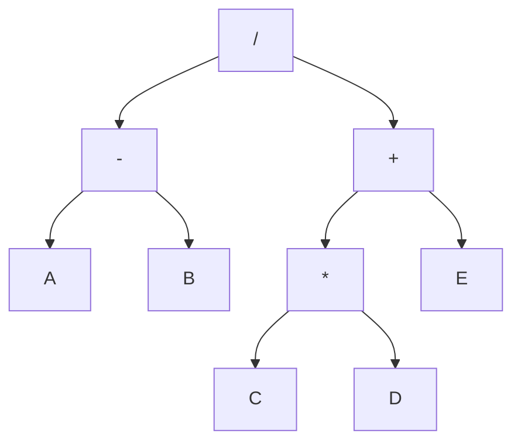
```mermaid
graph TD
    Root["/"] --> Sub["-"]
    Root --> Add["+"]
    Sub --> A
    Sub --> B
    Add --> Mul["*"]
    Add --> E
    Mul --> C
    Mul --> D
```

樹根為 `/`，左子樹為 `-`（子節點 A、B），右子樹為 `+`（左子節點為 `*`，`*` 的子節點為 C、D；右子節點為 E）。

</details>

---

**25. 假設字母 A、B、C、D 的出現頻率分別為 0.5、0.25、0.125、0.125，試問，若以霍夫曼編碼，每個字母的長度平均為幾個位元？**

<details>
<summary>▶ 參考答案與完整計算過程</summary>

**答案：9/4（即 2.25 位元）**

依機率建構霍夫曼樹：先合併最小的兩者 C(0.125)、D(0.125) → 0.25；再與 B(0.25) 合併 → 0.5；最後與 A(0.5) 合併 → 1.0（樹根）。各字母的編碼長度為：**A=1 位元、B=2 位元、C=3 位元、D=3 位元**。

題目詢問的是「每個字母的長度平均」（即單純對 4 個字母的編碼長度取算術平均，而非依出現機率加權平均）：

$$\dfrac{1+2+3+3}{4}=\dfrac{9}{4}=2.25\text{位元}$$

> **教學提醒**：這一題容易與「依機率加權的平均編碼長度」搞混——若是計算加權平均（也就是實際編碼一大段文字時，平均每個字母耗用的位元數），則應為 $0.5\times1+0.25\times2+0.125\times3+0.125\times3=1.75$ 位元，與本題「每個字母的長度平均」（單純算術平均）是不同的問題，作答前務必看清楚題目問的是哪一種平均。

</details>

---

**26. 假設有棵樹如下，請回答下列問題：**

（樹的結構：A 為根，子節點 B、C、D；B 的子節點 E、F；C 的子節點 G、H；D 的子節點 I、J；G 的子節點 K、L、M）

**(1) 寫出該樹的根節點。(2) 寫出該樹的樹葉節點。(3) 寫出節點 D 的分支度。(4) 寫出該樹的前序走訪結果。(5) 寫出該樹的後序走訪結果。**

<details>
<summary>▶ 參考答案</summary>

**(1) 根節點為 A。**

**(2) 樹葉節點為 K、F、L、M、H、I、J。**

**(3) D 的分支度為 3。**

**(4) 前序走訪結果：ABEKFCGLMDHIJ**

**(5) 後序走訪結果：KEFBLMGCHIJDA**

</details>

---

**27. 解釋何謂二元搜尋樹（binary search tree）、完整二元樹（complete binary tree）、最大堆積（max heap），並分別舉出一棵高度為 3 的樹。**

<details>
<summary>▶ 參考答案</summary>

**二元搜尋樹（binary search tree）** 是一種形式特殊的二元樹，它必須滿足後述條件：每個節點包含唯一的鍵值；左右子樹亦為二元搜尋樹；左子樹的鍵值必須小於其樹根的鍵值；右子樹的鍵值必須大於其樹根的鍵值。

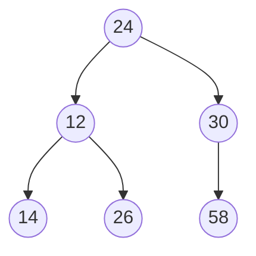
```mermaid
graph TD
    N24((24)) --> N12((12))
    N24 --> N30((30))
    N12 --> N14((14))
    N12 --> N26((26))
    N30 --> N58((58))
```

**完整二元樹（complete binary tree）** 是高度為 h、節點個數為 n 且節點順序對應至高度為 h 之完滿二元樹的節點編號 1~n 的二元樹，而**完滿二元樹（full binary tree）** 是高度為 h 且節點個數為 $2^h-1$ 的二元樹。

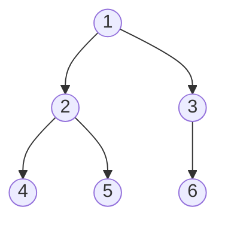
```mermaid
graph TD
    N1((1)) --> N2((2))
    N1 --> N3((3))
    N2 --> N4((4))
    N2 --> N5((5))
    N3 --> N6((6))
```

**最大堆積（max heap）** 是一種形式特殊的完整二元樹，每個內部節點的鍵值一律大於等於其子節點的鍵值。

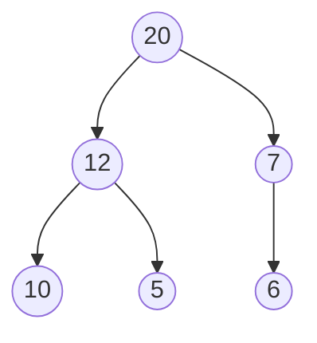
```mermaid
graph TD
    N20((20)) --> N12((12))
    N20 --> N7((7))
    N12 --> N10((10))
    N12 --> N5((5))
    N7 --> N6((6))
```

</details>

---

**28. 假設使用陣列來實作最大堆積，下列敘述何者錯誤？**

A. 尋找一個節點的子節點的時間複雜度為 O(1)
B. 尋找一個節點的父節點的時間複雜度為 O(1)
C. 節點的分支度（degree）為 0 或 2
D. 新增一個數值到包含 n 個節點的最大堆積的時間複雜度為 O(log n)

<details>
<summary>▶ 參考答案與解說</summary>

**答案：C（此為錯誤敘述）**

用陣列實作堆積時，節點索引 $i$ 的左子節點為 $2i$ 、右子節點為 $2i+1$ 、父節點為 $\lfloor i/2\rfloor$ ，這些索引都可以用公式**直接算出**，因此選項 A、B（尋找子節點、父節點的時間複雜度為 $O(1)$ ）皆正確。選項 D 也正確：新節點插入後最多上濾至樹根，樹高為 $O(\log n)$ ，故時間複雜度為 $O(\log n)$ 。

選項 C 錯誤：完整二元樹（堆積的底層結構）**最後一層可能只有部分節點被填滿**，這種情況下，最後一層最右側、只有單一左子節點、沒有右子節節的節點，其分支度會是 **1**，並非只能是 0 或 2，因此「節點的分支度為 0 或 2」的敘述並不精確，這是本題的錯誤之處。

</details>

---

*本講義圖片素材取自《最新計算機概論》第十二版 第 12 章 原版簡報，內文為教學擴寫版本；學習評量題目依課本原文謄錄，答案在課本官方解答基礎上補齊完整計算過程與解說，絕大多數題目的樹狀結構重建、走訪結果、運算式轉換皆以程式實際執行核對無誤，僅供授課教師課堂講解使用。*
