# 第 13 章　資料庫、資料倉儲與大數據

## 本章學習地圖

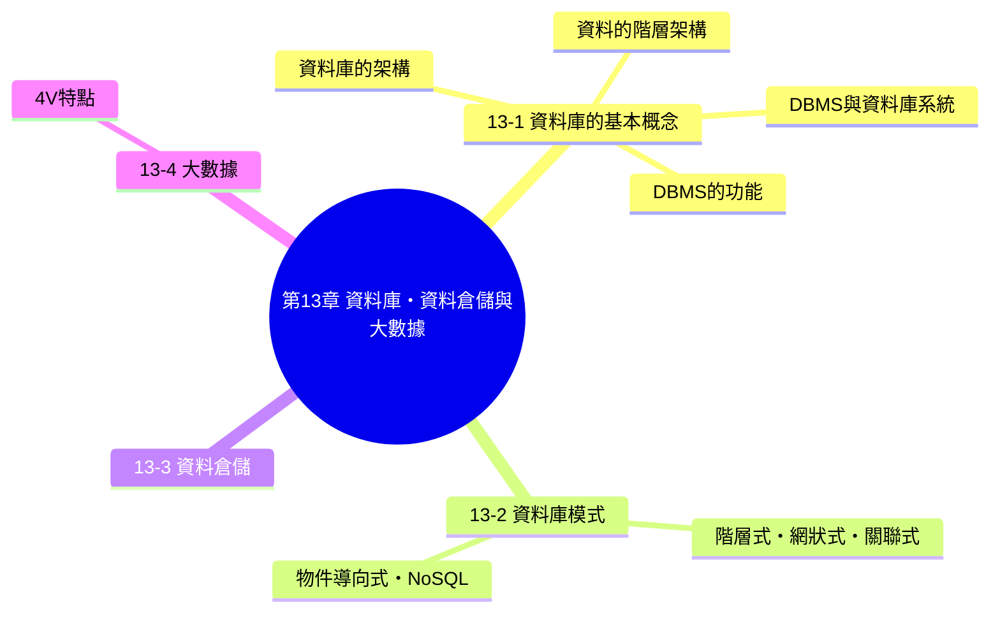

**核心概念：**

1. 「資料」與「資訊」不是同一件事——資料是尚未處理的原始素材，資訊則是經過處理、對人有意義的成果，資料庫存在的目的，正是要有系統地管理資料，好讓我們能從中萃取出有用的資訊。
2. DBMS（資料庫管理系統）不是憑空多出來的麻煩，而是解決傳統檔案處理系統「資料重複、難以共享、缺乏一致性」等痛點的解方——理解 DBMS 解決了什麼問題，比死背它的功能列表更重要。
3. 資料庫模式（階層式、網狀式、關聯式……）決定了資料被組織與存取的方式，而資料倉儲、大數據則是資料庫概念在「巨量資料時代」進一步延伸出來的應用與挑戰。

---

## 13-1　資料庫的基本概念

- **資料（data）**：資料是尚未處理的文字、圖形、音訊、視訊等。
- **資訊（information）**：資訊是已經處理的文字、圖形、音訊、視訊等。
- **資料庫（database）**：資料庫是一組相關資料的集合，這些資料之間可能具有某些關聯，允許使用者從不同的觀點來加以存取。

> **課堂比喻**：可以用「食材與料理」來比喻資料與資訊的差別——一堆散落的食材（生米、生肉、生菜）就像是「資料」，本身還不能直接食用；經過烹調、擺盤之後端上桌的一道菜，才是「資訊」——資料庫扮演的角色，就像是一間管理良好的廚房儲藏室，把各種食材依照特定規則分類存放，讓廚師（使用者）需要時能快速找到、靈活搭配組合出各種不同的料理（資訊）。

### 13-1-1　資料的階層架構

資料的階層架構如下，由小到大依序為：

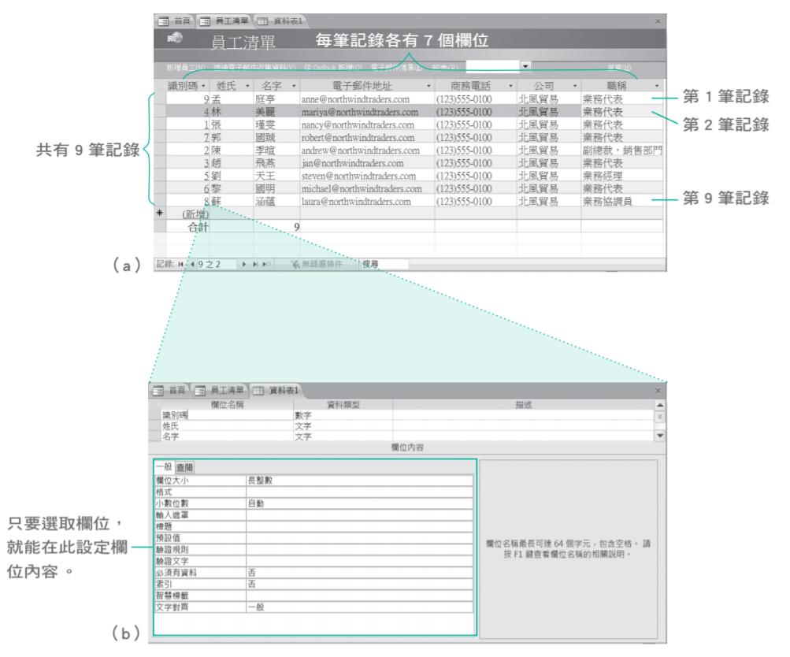

- **位元（bit）**：最小的資料單位，只有 0 與 1 兩個值（詳見第 3 章）。
- **字元（character）**：由若干位元組成，用來表示一個文字符號，例如一個英文字母、一個數字。
- **欄位（field）**：由若干字元組成，表示某一項特定屬性的資料，例如「姓名」欄位、「學號」欄位。
- **記錄（record）**：由一個或多個欄位所組成，代表一筆完整的資料項目，例如某一位學生的姓名、學號、生日等欄位合起來，就是這位學生的一筆記錄。
- **檔案（file）**：由多筆相關的記錄所組成，例如全班同學的記錄集合起來，就是一個「學生資料檔案」。
- **資料庫（database）**：由一個或多個相關的檔案（或資料表）所組成，是資料階層架構的最頂層。

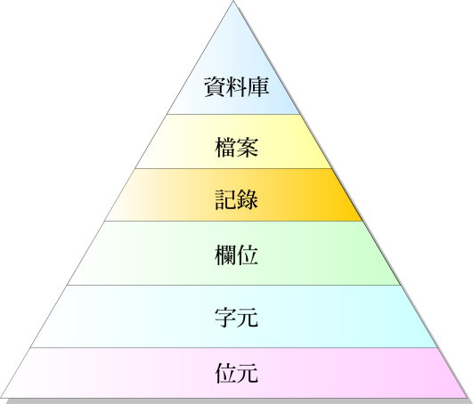

> **課堂重點（呼應學習評量第 4 題）**：這條階層架構的方向是**「小單位組合成大單位」**——位元組成字元、字元組成欄位、欄位組成記錄、記錄組成檔案、檔案組成資料庫，每一層都是由下一層的元素累積組合而成。特別留意：「記錄是由一個或多個欄位所組成」，而不是「用來識別記錄的欄位稱為主鍵」這句話本身雖然正確描述了主鍵的定義，卻不屬於這條「小到大」階層架構要表達的核心概念，這是學習評量第 4 題的判斷細節。

### 13-1-2　資料庫的架構

**ANSI/SPARC** 將資料庫的架構定義成如下圖的三個層次：

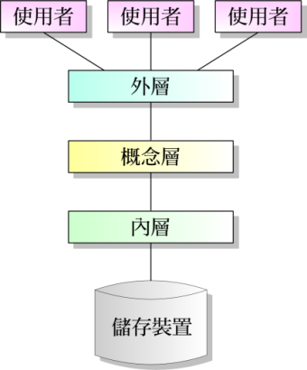

- **外層（external level）**：最貼近使用者的層次，讓不同的使用者可以依照自己的需求，看到資料庫中不同的「視界（view）」，同一個資料庫可以對應多個不同的外層視界。
- **概念層（conceptual level）**：描述整個資料庫的邏輯結構，也就是資料庫中有哪些資料表、資料表之間有什麼關聯，是介於外層與內層之間的抽象層次。
- **內層（internal level）**：最貼近實體儲存裝置的層次，描述資料實際上是如何被儲存在硬碟等儲存裝置中的。

> **課堂重點（呼應學習評量第 7 題）**：這三層架構的設計精神，正是**「讓不同層次的使用者，只需要關心與自己相關的細節，不必被其它層次的複雜性干擾」**——一般使用者透過外層的視界操作資料庫，不需要知道資料實際上是怎麼被儲存在硬碟的；而負責資料庫底層儲存優化的工程師，則可以在不影響使用者操作介面的前提下，調整內層的儲存方式。負責「描述整個資料庫的結構」的正是**概念層**，這是本章學習評量第 7 題的判斷關鍵。

### 13-1-3　DBMS 與資料庫系統

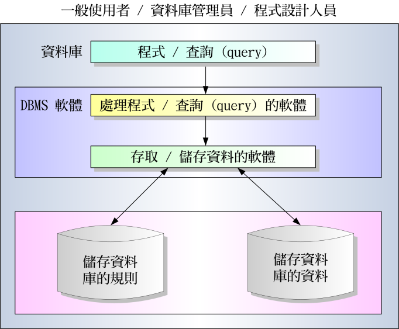
*圖片參考：Database Systems / Ramez Elmasri*

**DBMS（DataBase Management System，資料庫管理系統）** 是用來操作與管理資料庫的軟體，而**資料庫系統（database system）** 則是資料庫與 DBMS 的組合，目的是以電腦化方式將資料集中管理與控制，主要包含下列四個成員：

- **硬體（hardware）**
- **軟體（software）**
- **資料（data）**
- **使用者（user）**：又分為
  - **終端使用者（end user）**：實際使用資料庫應用程式的一般人員。
  - **應用程式設計師（application programmer）**：負責開發存取資料庫的應用程式。
  - **資料庫管理師（DBA，database administrator）**：負責資料庫的整體管理、權限控管、效能調校等工作。
  - **資料庫設計師（database designer）**：負責規劃資料庫的結構設計。

### 13-1-4　DBMS 的功能

下面的例子是一個**關聯式資料庫（relational database）**，也就是資料庫內包含數個資料表，而且資料表之間會有共通的欄位，使資料表之間產生關聯：

<table>
<tr>
<td width="55%">

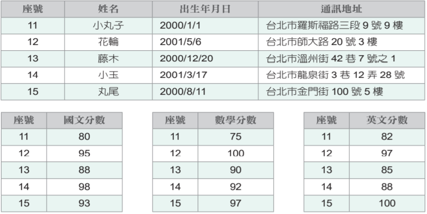

</td>
<td width="45%">

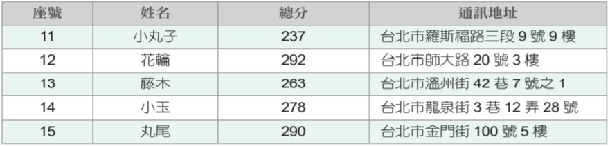

</td>
</tr>
</table>

DBMS 具備下列功能：

- **資料字典（data dictionary）**：儲存資料庫中所有資料表、欄位的定義與結構描述（「描述資料的資料」，也就是後設資料 metadata）。
- **資料維護**：新增、修改、刪除資料表中的記錄。
- **資料擷取**：透過查詢語言（如 SQL）從資料庫中找出符合條件的資料。
- **資料完整性**：確保資料符合預先定義的規則（例如成績必須介於 0～100 之間）。
- **資料安全性**：透過權限控管，確保不同使用者只能存取被授權的資料範圍。
- **資料備份與還原**：定期備份資料庫，並在發生故障時能夠還原資料。
- **資料同步控制**：確保多人同時存取資料庫時，資料不會發生衝突或錯誤。
- **交易完成與回轉**：確保一連串相關的資料庫操作（交易，transaction）要嘛全部成功執行、要嘛全部復原，不會發生「執行到一半就中斷」導致資料處於不一致狀態的情況。

**資料字典**：

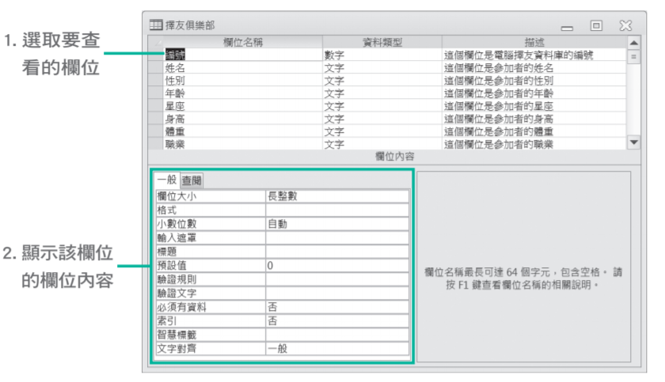

**資料擷取**：

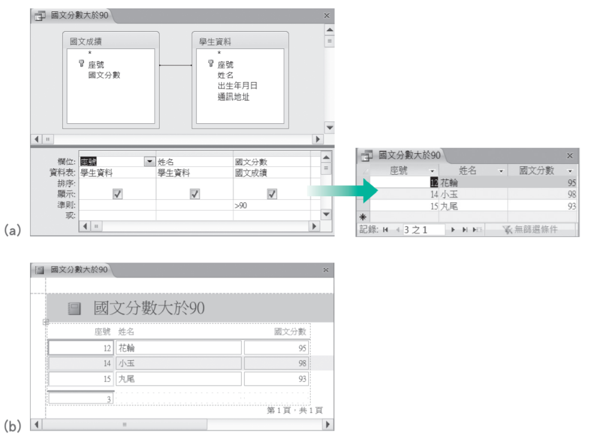

> **課堂重點（呼應學習評量第 5 題）**：這一題的「資料同步控制（data concurrency control）」特別容易混淆——它要防範的是**多人同時存取資料庫時可能發生的錯誤**，包括「更新遺失」（兩人同時修改同一筆資料，其中一人的修改被另一人覆蓋而遺失）、「讀取到被刪除的資料」（讀取當下資料正好被另一人刪除）、「資料被鎖定」（正常的同步控制機制，暫時鎖定正在被修改的資料，避免他人同時修改）。但**「資料加總錯誤」與多人同時存取的同步問題無關**，比較像是資料完整性或程式邏輯本身的問題，這是學習評量第 5 題「若沒有使用資料同步控制，下列哪個錯誤不會發生」的判斷關鍵。

### DBMS 相較於傳統檔案處理系統的優缺點

早期許多組織是使用**檔案處理系統（file processing system）** 來存放與管理資料，這種方式雖然設計較簡單、存取速度較快、開發成本較低，卻有著資料重複、不易共享、格式不統一、資料與應用程式高度相依、無法建立關聯等問題，因為組織內不同部門可能擁有各自的資料檔案，而這些資料檔案的格式是針對各個部門經常使用的應用程式所制定。

反之，**資料庫管理系統（DBMS）** 則有下列優點：

- **減少資料重複**：DBMS 可以有效整合各個資料表之間的關聯，減少重複的資料表，例如只要維持「國文成績」、「數學成績」、「英文成績」等三個資料表，就可以算出總分，而不必再維持一個「總分」資料表。
- **資料共享並維持一致性**：DBMS 允許多個使用者同時存取資料庫，並維持資料庫的一致性，例如火車票預售系統可以被多個使用者同時存取，但在使用者劃下某個座位後，該座位就不能再預售給其它使用者。
- **資料獨立（data independence）**：傳統的檔案處理系統是將資料檔案的結構嵌入存取程式，一旦資料檔案的結構有變動，所有存取資料檔案的程式都必須修改；反之，DBMS 的存取程式並不會受到資料檔案的結構變動而必須修改，因為資料檔案的結構是存放在 DBMS 的**資料字典**。
- **提供不同的觀點或不同的視界來檢視資料**：DBMS 可以根據既有的資料表與使用者實際的需求產生新的資料表，例如結合「國文成績」、「數學成績」、「英文成績」等三個資料表可以產生「總分」資料表（正如上方範例所示）。
- **提供多重使用者介面**：DBMS 可以針對同一個資料庫提供不同的介面給使用者，例如一般使用者可以透過自然語言、表單或圖形介面來存取資料庫，而應用程式設計師可以透過程式語言介面來存取資料庫。
- **確保安全性**：DBMS 可以針對不同的使用者設定存取權限，例如某甲只能讀取資料庫的內容，但不能進行更新，而某乙只能查詢特定資料庫的內容，但不能查詢其它資料庫的內容。
- **完整性限制**：DBMS 可以針對不同性質的資料庫欄位設定限制，保持資料的正確性與一致性，例如數學分數應該是介於 0 到 100 之間的整數、學生的姓名欄位不能是空白的。

雖然 DBMS 的優點相當多，但它並不是沒有缺點，例如：

- 初期投資成本較高，包括添購軟硬體及教育訓練的費用。
- 定義及處理資料的時間較長。
- 為了提供安全性、資料共享、維持一致性、完整性限制等功能，可能會浪費資源。
- 若缺乏良好管理，可能會危及資料的安全性與正確性。
- 長期管理不易，資訊部門的負擔愈來愈沉重，因為系統往往會日趨複雜。
- 一旦系統停擺，可能會導致組織癱瘓。

正因為使用 DBMS 要負擔不少額外的成本，所以並不是每種情況都適合使用 DBMS，比方說，若資料和應用程式都很簡單且不會變動，或是不需要讓多個使用者同時存取資料庫，那麼使用檔案管理系統可能會比 DBMS 來得適合。

> **課堂重點（呼應學習評量第 1、3 題）**：不是所有場合都需要動用 DBMS 這種「重裝備」——像是選課系統、進銷存系統、病歷系統這類**資料量大、需要多人同時存取、且資料之間彼此關聯密切**的應用，非常適合用資料庫管理系統處理；但像是「簡報」這種單純的檔案（一個人製作、內容不需要與其它資料產生關聯查詢），就完全不需要動用資料庫管理系統，用一般的檔案儲存與管理即可，這正是學習評量第 1 題「下列何者不適合以資料庫管理系統來處理」的判斷邏輯——**關鍵不在於檔案大小，而在於資料是否需要被多方共享、關聯查詢、同步更新**。

---

## 13-2　資料庫模式

**資料庫模式（database model）** 指的是資料庫存放資料所必須遵循的規則與標準，資料庫通常是根據特定的資料庫模式所設計，例如階層式、網狀式、關聯式、物件導向式等，有些資料庫則是結合了關聯式與物件導向式的特點，屬於物件關聯式，另外還有 **NoSQL 資料庫**泛指非關聯式資料庫。

### 階層式資料庫

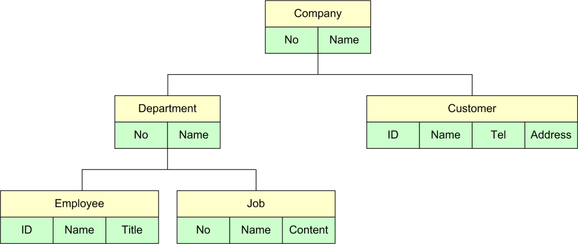

**階層式資料庫（hierarchical database）** 是以樹狀結構的形式呈現，每個實體都只有一個父節點，但可以有多個子節點，就像父親與子女的關係一樣。

### 網狀式資料庫

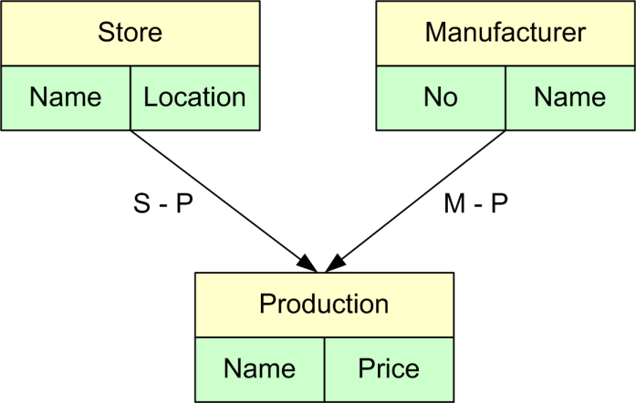

**網狀式資料庫（network database）** 以有向圖形結構的形式呈現，每個實體可以有多個子節點，也可以有多個父節點，同時使用存取徑徑表示資料表之間的鏈結。

### 關聯式資料庫

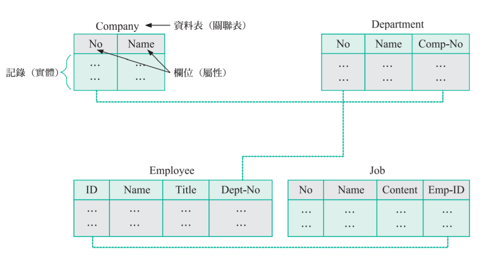

**關聯式資料庫（RDB，relational database）** 是由列與行所構成的資料表（table）來存放資料，不同的資料表之間有共通的欄位，使資料表之間產生**關聯（relation）**。這是目前應用最廣泛的資料庫模式，也是本章前面 DBMS 範例所採用的模式。

### 物件導向式資料庫

**物件導向式資料庫（OODB，object-oriented database）** 是以物件來存放資料，而物件包含資料與用來處理資料的動作，優點是存取資料的速度較快，能夠存放更多類型的資料，包括文字、圖形、聲音、影像、空間資訊、即時資訊等，例如地理資訊系統（GIS，Geographical Information System）可以存放地圖與空間資訊。

### NoSQL 資料庫

**NoSQL 資料庫**泛指非關聯式資料庫，和關聯式資料庫主要的差別在於不使用 SQL 查詢語言，不使用固定欄位或格式存放資料，能夠彈性增加或縮減所管理的資料量，適合用來管理大型分散式系統的資料，能夠針對圖像、影音、網站、社群媒體等不同形式的資料進行快速檢索。

> **課堂重點（呼應學習評量第 9、16 題）**：**MySQL、SimpleDB、MariaDB 等都可能被歸類在不同的資料庫模式下**，判斷的關鍵在於它們是否使用 SQL 查詢語言、是否要求固定的欄位結構——例如 SimpleDB 是 Amazon 提供的非關聯式資料庫服務，屬於 NoSQL 資料庫；**Google BigTable 同樣是 NoSQL 資料庫，而非關聯式資料庫**（這是學習評量第 16 題的常見誤植陷阱）。此外，**「資料表之間可以透過 INSERT 指令合併成一個資料表」的說法並不正確**——INSERT 指令的作用是「新增一筆記錄」，並非用來合併資料表，這也是學習評量第 16 題的判斷細節之一。

## 13-3　資料倉儲

**資料倉儲（data warehouse）** 是一種資料儲存理論，目的是從多種資料來源擷取資料，然後透過特殊的資料儲存架構，分析出潛在的有價值的資訊，進而支援企業的決策支援系統，協助管理者進行商業決策，建構商業智慧，快速回應外在環境的變動。

資料倉儲的資料具有下列幾個特點：

- **主題導向（subject-oriented）**：資料倉儲是圍繞著特定的分析主題（例如「銷售分析」、「客戶行為分析」）來組織資料，而不是像一般作業型資料庫那樣依照日常交易流程組織資料。
- **整合性（integrated）**：資料倉儲的資料通常來自組織內多個不同來源的系統，需要經過整合，統一資料格式、單位與編碼方式，消除不一致的地方。
- **時間變動性（time-variant）**：資料倉儲會保留資料在不同時間點的歷史紀錄，方便進行長期的趨勢分析（例如比較近五年的營收變化），這與一般作業型資料庫通常只保留「當下最新狀態」的做法不同。
- **非揮發性（nonvolatile）**：資料一旦寫入資料倉儲，通常就不會再被更新或刪除，只會不斷新增最新的資料，確保歷史分析結果的穩定與一致。

資料倉儲可以做為**資料探勘（data mining）** 和**線上分析處理（OLAP，OnLine Analytical Processing）** 等分析工具的資料來源，而且資料倉儲中的資料必須經過篩選與轉換，分析工具才能得到正確的分析結果。

> **課堂重點**：資料倉儲與一般（作業型）資料庫最大的不同，在於**用途的差異**——一般資料庫（例如銀行的交易系統）著重「即時、正確地處理當下發生的交易」，資料經常被新增、修改；資料倉儲則著重「長期累積歷史資料、支援分析決策」，資料寫入後通常不再更動。可以把一般資料庫比喻成「收銀台的即時帳本」，資料倉儲則像是「公司多年累積下來、專門用來做年度趨勢分析的歷史檔案庫」。

---

## 13-4　大數據

**大數據（big data）** 又稱為巨量資料、海量資料，指的是資料量巨大到無法在一定時間內以人工或常規軟體進行擷取、處理、分析與整合。

大數據有四個主要的特點，稱為 **4V**：

- **Volume（容量）**：資料量極為龐大，經常以 TB、PB 甚至更大的單位來計算。
- **Variety（多樣性）**：資料型態多元，除了結構化的表格資料，還包含大量非結構化資料，例如文字、圖片、影音、社群媒體貼文等。
- **Velocity（速度）**：資料產生與更新的速度非常快，經常需要近乎即時的處理與分析（例如社群媒體上瞬息萬變的討論趨勢）。
- **Veracity（真實性）**：資料的來源與品質參差不齊，需要進行資料清理與驗證，才能確保分析結果的可靠性。

**大數據分析所涉及的技術包括**：

<table>
<tr>
<td width="50%">

- **資料蒐集**
- **資料儲存**：例如 Apache Hadoop 提供了大數據分析所需的分散式儲存框架。
- **資料分析**
- **資料視覺化**：例如 Tableau 提供了視覺化的分析平台，協助使用者快速理解龐雜的資料。

</td>
<td width="50%">

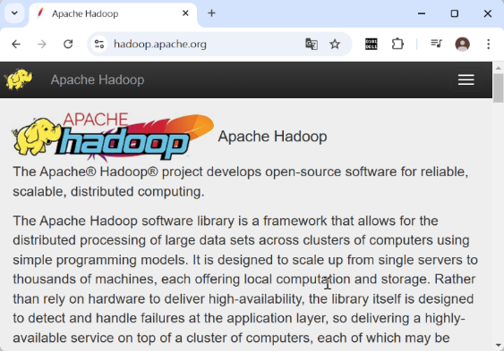

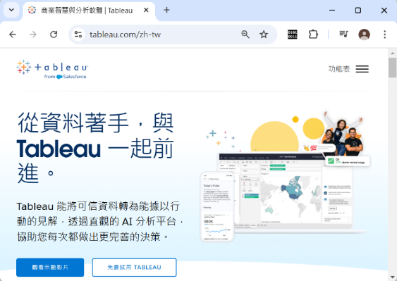

</td>
</tr>
</table>

**大數據分析的應用**十分廣泛，涵蓋商業決策、精準行銷、醫療診斷、城市治理（智慧城市）、金融風險控管等領域，正是第 2 章介紹過的機器學習與人工智慧技術得以發揮威力的重要基礎——**演算法再聰明，也需要有足夠份量、足夠多樣、足夠即時、足夠真實可靠的資料**才能訓練出有用的模型，這正是大數據 4V 特性與 AI 應用之間密不可分的關聯。

> **課堂重點（呼應學習評量第 8、13 題）**：Hadoop 正是能夠儲存並管理大數據的雲端平台代表，具備**分散式儲存**的能力，可以把龐大的資料拆分儲存在許多台電腦上，並平行處理運算，這正是它能夠應付「巨量資料」規模的關鍵設計。而透過分析社群媒體、消費紀錄等大數據，企業可以運用**資料探勘、機器學習**等技術，深入分析顧客的消費行為與偏好，進而提供精準行銷或個人化推薦服務。

---

## 本章總結

| 小節 | 核心觀念一句話 |
|---|---|
| 13-1 資料庫的基本概念 | 資料需經處理才成資訊，DBMS解決檔案系統重複、不易共享的痛點 |
| 13-2 資料庫模式 | 階層式如樹狀、網狀式多對多、關聯式用資料表、NoSQL不用固定格式 |
| 13-3 資料倉儲 | 主題導向、整合性、時間變動性、非揮發性，支援企業決策分析 |
| 13-4 大數據 | 4V(容量/多樣性/速度/真實性)定義巨量資料，是AI訓練的重要基礎 |

### 關鍵詞彙表（Glossary）

`資料` `資訊` `資料庫` `位元` `字元` `欄位` `記錄` `檔案` `外層` `概念層` `內層` `DBMS` `資料庫系統` `終端使用者` `應用程式設計師` `資料庫管理師DBA` `資料庫設計師` `資料字典` `資料完整性` `資料安全性` `資料同步控制` `交易完成與回轉` `檔案處理系統` `資料獨立` `資料庫模式` `階層式資料庫` `網狀式資料庫` `關聯式資料庫` `物件導向式資料庫` `NoSQL資料庫` `資料倉儲` `主題導向` `整合性` `時間變動性` `非揮發性` `資料探勘` `線上分析處理OLAP` `大數據` `4V` `Volume` `Variety` `Velocity` `Veracity` `Hadoop` `Tableau`

---

## 第 13 章　學習評量

> 以下為課本第 13 章隨附之官方學習評量，題目逐字謄錄。答案為課本官方解答，並在其下補充**完整解說**，方便課堂上直接點開講解、對答案。

### 一、選擇題

**1. 下列何者不適合以資料庫管理系統來處理？**
A. 選課系統　B. 進銷存系統　C. 簡報　D. 病歷系統

▶ 參考答案與解說

**答案：C　簡報**

選課系統、進銷存系統、病歷系統都需要處理大量、彼此關聯、且經常需要多人同時存取的資料，非常適合使用資料庫管理系統。「簡報」通常是單一使用者製作、內容相對獨立、不需要與其它資料產生關聯查詢的單純檔案，用一般的檔案儲存即可，不需要動用資料庫管理系統這種「重裝備」。

---

**2. 下列何者不是資料庫管理系統？**
A. Access　B. IBM DB2　C. SQL Server　D. ChatGPT

▶ 參考答案與解說

**答案：D　ChatGPT**

Access、IBM DB2、SQL Server 都是知名的資料庫管理系統軟體。ChatGPT 是生成式 AI 聊天機器人，並非資料庫管理系統。

---

**3. 下列何者不是資料庫管理系統的優點？**
A. 初期投資成本較低　B. 支援多人同時存取　C. 維持資料的一致性　D. 提供使用者權限控管

▶ 參考答案與解說

**答案：A（此為錯誤敘述）**

資料庫管理系統的**初期投資成本其實較高**（包括添購軟硬體及教育訓練的費用），這是 DBMS 的缺點而非優點。支援多人同時存取、維持資料的一致性、提供使用者權限控管，才是 DBMS 真正的優點。

---

**4. 在資料的階層架構中，下列哪個敘述錯誤？**
A. 用來識別記錄的欄位稱為主鍵　B. 記錄是由一個或多個欄位所組成　C. 資料庫是資料檔案的集合　D. 使用者存取資料的單位為位元

▶ 參考答案與解說

**答案：D（此為錯誤敘述）**

使用者實際存取與操作資料時，感受到的最小有意義單位通常是**欄位或記錄**（例如「姓名」欄位、「一筆學生記錄」），而不是位元——位元是電腦內部儲存資料最底層的技術單位，使用者在操作資料庫時，並不會以「位元」作為存取的單位。選項 A、B、C 皆正確描述了資料階層架構的相關概念。

---

**5. 在資料庫的交易處理中，若沒有使用資料同步控制（data concurrency control），下列哪個錯誤不會發生？**
A. 更新遺失　B. 讀取到被刪除的資料　C. 資料被鎖定　D. 資料加總錯誤

▶ 參考答案與解說

**答案：C（此為不會發生的選項，也就是答案）**

**「資料被鎖定」其實正是資料同步控制機制運作時會出現的正常現象**（為了避免多人同時修改同一筆資料而暫時鎖定），如果**沒有**使用資料同步控制，資料反而**不會**被鎖定，因此選項 C 是「沒有同步控制時不會發生」的情況，也就是本題答案。更新遺失、讀取到被刪除的資料，則都是缺乏同步控制時真正可能發生的錯誤；資料加總錯誤則與同步控制較無直接關聯，比較屬於資料完整性或程式邏輯層面的問題。

---

**6. 以學生基本資料為例，下列何者最適合作為主鍵欄位？**
A. 姓名　B. 生日　C. 學號　D. 性別

▶ 參考答案與解說

**答案：C　學號**

主鍵（primary key）必須是能夠**唯一識別**每一筆記錄的欄位。姓名可能重複（同名同姓）、生日可能重複（同一天出生的學生不只一位）、性別的可能值極少且大量重複，都不適合作為主鍵；**學號通常是學校特別設計、確保每位學生獨一無二的編號**，是最適合的主鍵欄位。

---

**7. 在資料庫架構中，下列哪個層次負責描述整個資料庫的結構？**
A. 外部層　B. 概念層　C. 內部層　D. 視界層

▶ 參考答案與解說

**答案：B　概念層**

概念層（conceptual level）的定義正是描述整個資料庫的邏輯結構，包括有哪些資料表、資料表之間有什麼關聯。外部層描述的是個別使用者看到的視界；內部層描述的是資料實際儲存在硬體上的方式；「視界層」並非 ANSI/SPARC 三層架構中的正式名稱。

---

**8. 下列何者是一個能夠儲存並管理大數據的雲端平台？**
A. MySQL　B. Objectivity　C. Access　D. Hadoop

▶ 參考答案與解說

**答案：D　Hadoop**

Apache Hadoop 是知名的開放原始碼大數據儲存與處理框架，具備分散式儲存與運算的能力，能夠應付巨量資料的規模。MySQL、Access 是傳統的關聯式資料庫管理系統；Objectivity 是物件導向式資料庫，皆非專為大數據雲端儲存管理而設計的平台。

---

**9. 下列何者屬於 NoSQL 非關聯式資料庫？**
A. MySQL　B. SimpleDB　C. Access　D. MariaDB

▶ 參考答案與解說

**答案：B　SimpleDB**

SimpleDB 是 Amazon 提供的非關聯式（NoSQL）資料庫服務。MySQL、Access、MariaDB 都是使用 SQL 查詢語言、採用固定欄位結構的關聯式資料庫管理系統。

---

**10. 關聯式資料庫的查詢語言叫做什麼？**
A. OQL　B. SQL　C. RQL　D. MySQL

▶ 參考答案與解說

**答案：B　SQL**

SQL（Structured Query Language，結構化查詢語言）是關聯式資料庫的標準查詢語言。OQL 是物件導向資料庫使用的查詢語言；RQL 並非本章介紹的標準查詢語言名稱；MySQL 則是一套資料庫管理系統軟體，而非查詢語言本身。

---

**11. 假設在學生資料庫中，有學號、生日、年紀、性別、住址等欄位，試問，下列哪個欄位屬於衍生性欄位？**
A. 生日　B. 年紀　C. 性別　D. 住址

▶ 參考答案與解說

**答案：B　年紀**

**衍生性欄位（derived field）** 指的是其數值可以由其它欄位計算得出、不需要另外儲存的欄位——「年紀」可以透過「生日」與目前日期計算得出（每年還會隨時間改變），因此屬於衍生性欄位，嚴謹的資料庫設計通常不會直接儲存這類會隨時間過期、且可被計算得出的資料。生日、性別、住址則都是需要直接儲存、無法從其它欄位推算出來的原始欄位。

---

**12. 假設在銀行資料庫中，每位客戶至少有一個以上的帳戶，那麼客戶與帳戶之間的關係屬於下列何者？**
A. 一對多　B. 多對多　C. 一對一　D. 多對一

▶ 參考答案與解說

**答案：A　一對多**

一位客戶可以擁有多個帳戶（例如活存帳戶、定存帳戶），但一個帳戶通常只屬於一位客戶，這種「一邊是一、另一邊可以是多」的關聯，正是典型的**一對多（one-to-many）**關係。

---

**13. 下列哪種技術可以幫助網站分析顧客的消費行為？**
A. 網路探勘　B. 管理資訊系統　C. 語音辨識　D. 專家系統

▶ 參考答案與解說

**答案：A　網路探勘**

網路探勘（web mining，泛指從網路上蒐集的大量資料中進行資料探勘分析）可以協助網站分析顧客在網路上的瀏覽、點擊、購買等消費行為模式。管理資訊系統、語音辨識、專家系統則分別是不同性質的技術與系統，並非專門用來分析網站顧客消費行為的技術。

---

**14. 下列哪種使用者負責管理與維護資料庫？**
A. 終端使用者　B. 應用程式設計師　C. 資料庫管理師　D. 資料庫設計師

▶ 參考答案與解說

**答案：C　資料庫管理師**

資料庫管理師（DBA，database administrator）的職責正是負責資料庫的整體管理與維護（包括權限控管、效能調校、備份還原等）。終端使用者只是單純使用資料庫應用程式；應用程式設計師負責開發存取資料庫的應用程式；資料庫設計師負責規劃資料庫的結構設計，三者皆非「管理與維護資料庫」的主要負責角色。

---

**15. 假設學生資料表包含（學號、姓名、名次）等欄位，若將此資料表劃分為兩個資料表甲和乙，那麼下列哪個分割方式不會造成資料遺失，其中畫底線者表示為主鍵？**
A. 甲(學號、名次)、乙(姓名、名次)　B. 甲(學號、名次)、乙(學號、姓名)　C. 甲(學號、姓名)、乙(姓名、名次)　D. 甲(學號、名次)、乙(名次、學號)

▶ 參考答案與解說

**答案：B**

選項 B 的甲、乙兩個資料表都包含**學號**這個共同欄位，而學號是能唯一識別每位學生的主鍵，因此可以透過學號將甲、乙兩個資料表重新**連結（join）** 回完整的原始資料（學號、姓名、名次），不會造成資料遺失。其它選項的兩個資料表之間，若不是缺乏可靠的共同鍵值可供連結（例如姓名可能重複、名次也可能因同分而重複），就是分割方式本身有問題，可能導致資料在重新組合時發生混淆或遺失對應關係。

---

**16. 下列關於關聯式資料庫的敘述何者正確？**
A. 一個關聯式資料庫可以包含多個資料表（table）　B. SQL Server 和 Google BigTable 均屬於關聯式資料庫　C. 資料表之間可以透過 INSERT 指令合併成一個資料表　D. 資料表中不同列的相同欄位可以儲存不同類型的資料

▶ 參考答案與解說

**答案：A**

一個關聯式資料庫本來就可以（而且通常會）包含多個彼此有關聯的資料表，這正是關聯式資料庫的基本定義，敘述正確。選項 B 錯誤：Google BigTable 屬於 **NoSQL** 非關聯式資料庫，並非關聯式資料庫。選項 C 錯誤：INSERT 指令的作用是在資料表中**新增一筆記錄**，並不是用來「合併」兩個資料表的指令。選項 D 錯誤：關聯式資料庫講求資料型別的一致性，同一個欄位（直行）中的所有資料，**應該屬於相同的資料型別**，不應該儲存不同類型的資料，這正是關聯式資料庫維持資料完整性的基本要求。

---

**17. 下列存取資料庫的行為，何者合乎資訊倫理？**
A. 進入學校教務系統修改自己的英文成績　B. 在圖書館的資訊系統查詢計算機概論書單　C. 利用職務上臨時給的帳號讀取工作無關的機密資料　D. 入侵學校網站修改網頁上的錯字

▶ 參考答案與解說

**答案：B**

在圖書館資訊系統中查詢書單，是系統本來就開放給一般使用者的正常、合法用途，符合資訊倫理。選項 A 屬於未經授權竄改自己的成績記錄，是嚴重違反資訊倫理與校規的行為；選項 C 屬於濫用職務授權的帳號存取與工作無關的機密資料，違反第 9 章介紹過的存取控制與資訊倫理原則；選項 D 即使動機是「好意糾正錯字」，但**未經授權入侵系統**本身就已經違法違規，不能因為目的良善就合理化未經授權的存取行為。

### 二、簡答題

**1. 簡單說明常見的資料庫模式有哪些？**

▶ 參考答案

資料庫模式（database model）指的是資料庫存放資料所必須遵循的規則與標準，資料庫通常是根據特定的資料庫模式所設計，例如**階層式、網狀式、關聯式、物件導向式**等，有些資料庫則是結合了關聯式與物件導向式的特點，屬於**物件關聯式**，另外還有 **NoSQL** 資料庫泛指非關聯式資料庫。

---

**2. 簡單說明何謂 DBMS？比較 DBMS 與檔案管理系統的優缺點。**

▶ 參考答案

**DBMS**（DataBase Management System，資料庫管理系統）是用來操作與管理資料庫的軟體，例如 Microsoft Access、SQL Server、Oracle Database、IBM DB2、MySQL、MariaDB 等。

早期許多組織是使用**檔案處理系統（file processing system）** 來存放與管理資料，這種方式雖然設計較簡單、存取速度較快、開發成本較低，卻有著資料重複、不易共享、格式不統一、資料與應用程式高度相依、無法建立關聯等問題，因為組織內不同部門可能擁有各自的資料檔案，而這些資料檔案的格式是針對各個部門經常使用的應用程式所制定。

反之，資料庫管理系統（DBMS）則有下列優點：

- **減少資料重複**：DBMS 可以有效整合各個資料表之間的關聯，減少重複的資料表，例如只要維持「國文成績」、「數學成績」、「英文成績」等三個資料表，就可以算出總分，而不必再維持一個「總分」資料表。
- **資料共享並維持一致性**：DBMS 允許多個使用者同時存取資料庫，並維持資料庫的一致性，例如火車票預售系統可以被多個使用者同時存取，但在使用者劃下某個座位後，該座位就不能再預售給其它使用者。
- **資料獨立（data independence）**：傳統的檔案處理系統是將資料檔案的結構嵌入存取程式，一旦資料檔案的結構有變動，所有存取資料檔案的程式都必須修改；反之，DBMS 的存取程式並不會受到資料檔案的結構變動而必須修改，因為資料檔案的結構是存放在 DBMS 的資料字典。
- **提供不同的觀點或不同的視界來檢視資料**：DBMS 可以根據既有的資料表與使用者實際的需求產生新的資料表，例如結合「國文成績」、「數學成績」、「英文成績」等三個資料表可以產生「總分」資料表。
- **提供多重使用者介面**：DBMS 可以針對同一個資料庫提供不同的介面給使用者，例如一般使用者可以透過自然語言、表單或圖形介面來存取資料庫，而應用程式設計師可以透過程式語言介面來存取資料庫。
- **確保安全性**：DBMS 可以針對不同的使用者設定存取權限，例如某甲只能讀取資料庫的內容，但不能進行更新，而某乙只能查詢特定資料庫的內容，但不能查詢其它資料庫的內容。
- **完整性限制**：DBMS 可以針對不同性質的資料庫欄位設定限制，保持資料的正確性與一致性，例如數學分數應該是介於 0 到 100 之間的整數、學生的姓名欄位不能是空白的。

雖然 DBMS 的優點相當多，但它並不是沒有缺點，例如：初期投資成本較高，包括添購軟硬體及教育訓練的費用；定義及處理資料的時間較長；為了提供安全性、資料共享、維持一致性、完整性限制等功能，可能會浪費資源；若缺乏良好管理，可能會危及資料的安全性與正確性；長期管理不易，資訊部門的負擔愈來愈沉重，因為系統往往會日趨複雜；一旦系統停擺，可能會導致組織癱瘓。

正因為使用 DBMS 要負擔不少額外的成本，所以並不是每種情況都適合使用 DBMS，比方說，若資料和應用程式都很簡單且不會變動，或是不需要讓多個使用者同時存取資料庫，那麼使用檔案管理系統可能會比 DBMS 來得適合。

---

**3. 簡單說明何謂關聯式資料庫。**

▶ 參考答案與完整解說

**關聯式資料庫（RDB，relational database）** 是由列與行所構成的資料表（table）來存放資料，不同的資料表之間有共通的欄位，使資料表之間產生**關聯（relation）**。例如 Company、Department、Employee、Job 四個資料表，可以分別透過 Company 的 No 與 Department 的 Comp-No、Department 的 No 與 Employee 的 Dept-No、Employee 的 ID 與 Job 的 Emp-ID 這些共通欄位，把原本分散的資料表串連起來，查詢出「某公司底下有哪些部門、部門底下有哪些員工、員工目前負責哪些工作」這類跨資料表的複合資訊。關聯式資料庫是目前應用最廣泛的資料庫模式，使用 SQL 作為標準查詢語言。

---

**4. 簡單說明何謂資料倉儲。**

▶ 參考答案

資料倉儲（data warehouse）是一種資料儲存理論，目的是從多種資料來源擷取資料，然後透過特殊的資料儲存架構，分析出潛在的有價值的資訊，進而支援企業的決策支援系統，協助管理者進行商業決策，建構商業智慧，快速回應外在環境的變動。資料倉儲的資料具有**主題導向、整合性、時間變動性、非揮發性**等特點，可以做為資料探勘和線上分析處理（OLAP）等分析工具的資料來源。

---

**5. 簡單說明何謂大數據？主要有哪些特點？**

▶ 參考答案

大數據（big data）又稱為巨量資料、海量資料，指的是資料量巨大到無法在一定時間內以人工或常規軟體進行擷取、處理、分析與整合。大數據有四個主要的特點，稱為 **4V**：**Volume（容量）**、**Variety（多樣性）**、**Velocity（速度）**、**Veracity（真實性）**。

---

*本講義圖片素材取自《最新計算機概論》第十二版 第 13 章 原版簡報，內文為教學擴寫版本；學習評量題目依課本原文謄錄，答案在課本官方解答基礎上補齊完整解說，僅供授課教師課堂講解使用。*
