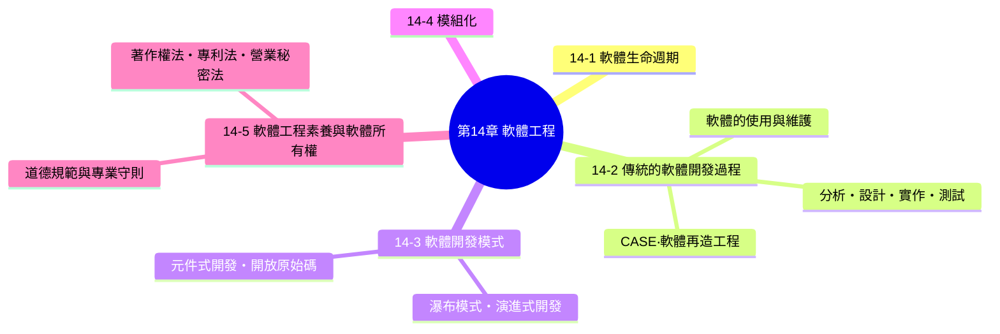
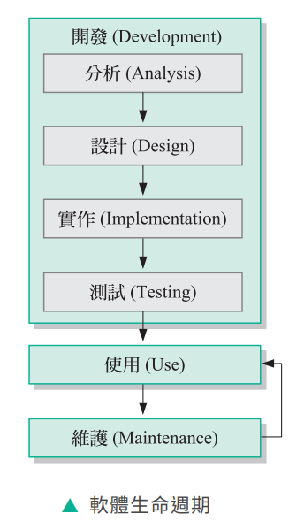
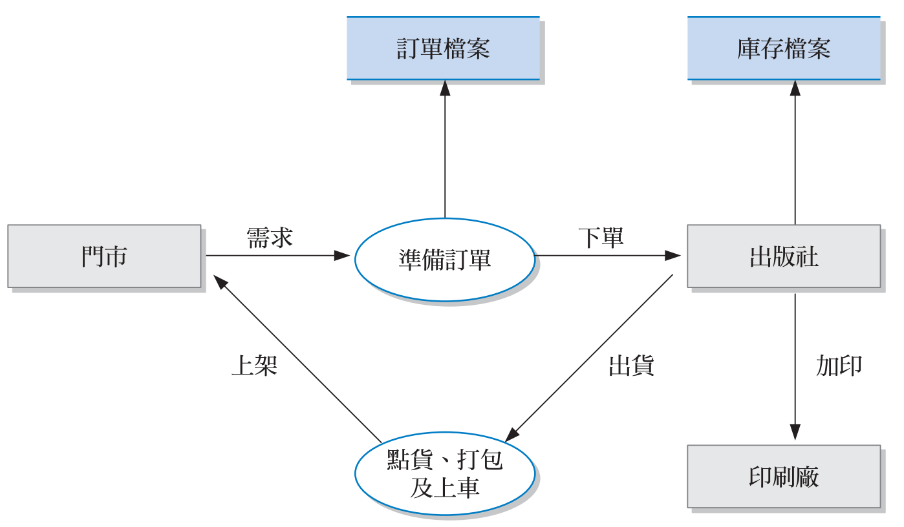
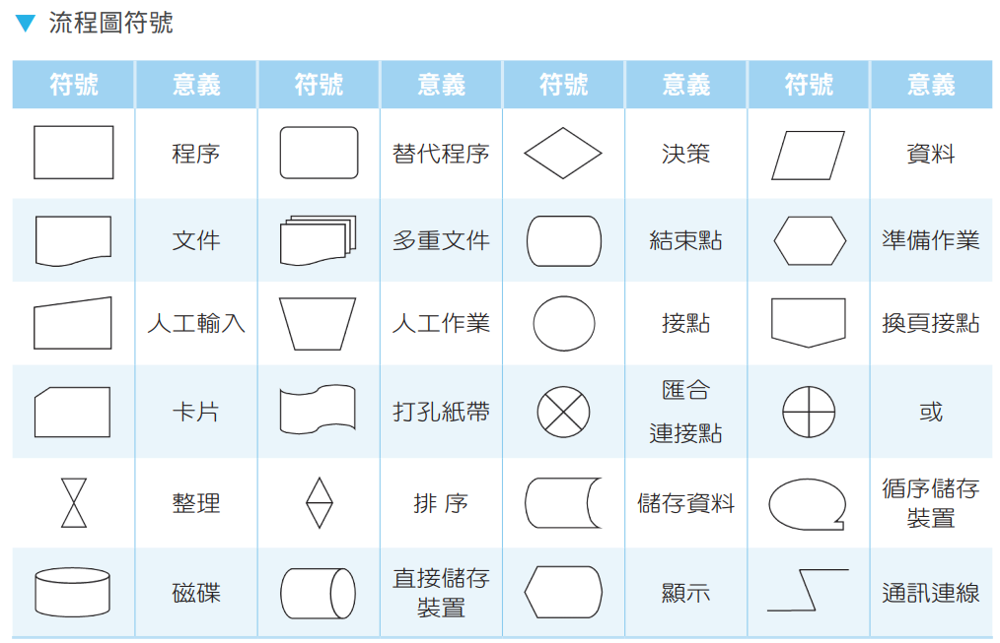
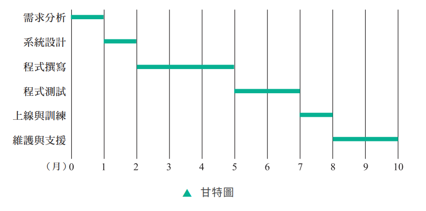
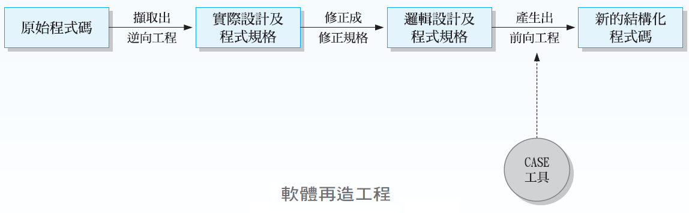
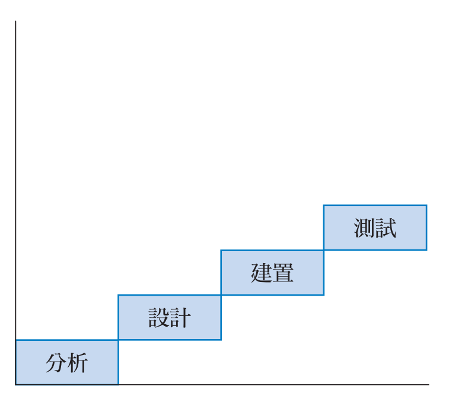
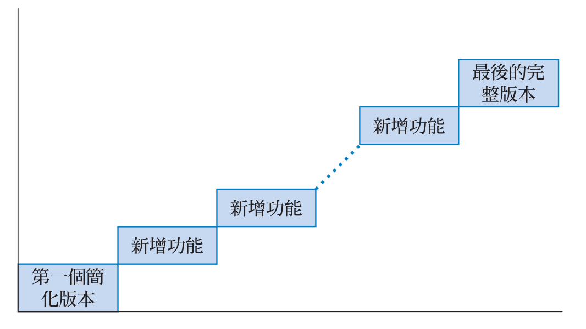
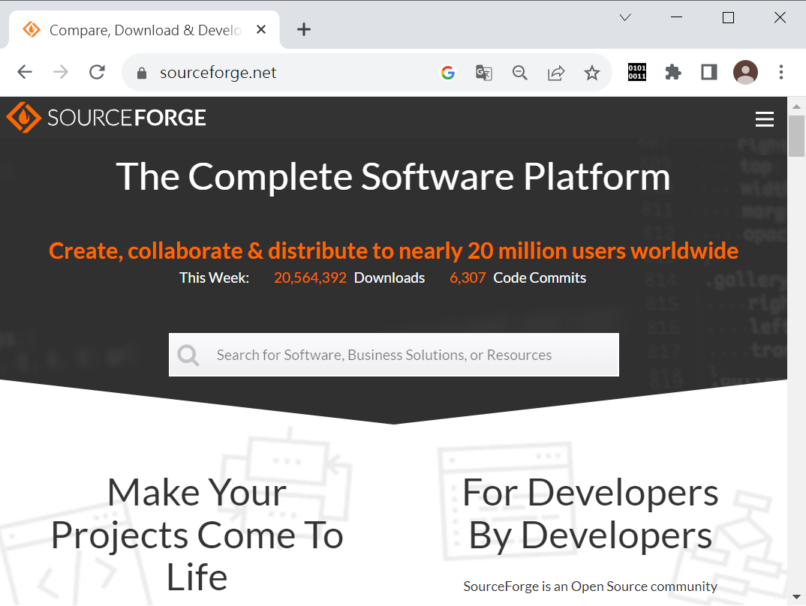
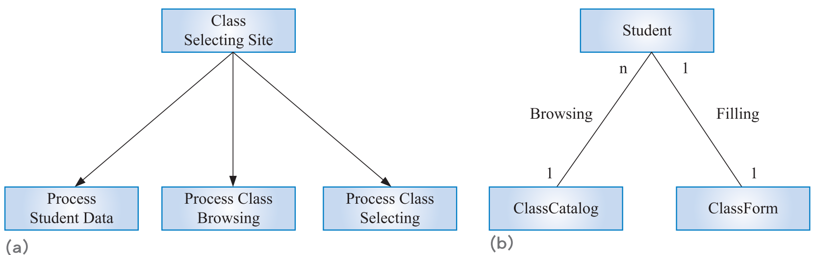

# 第 14 章　軟體工程

## 本章學習地圖

**核心概念：**

1. 軟體不是憑感覺、憑天分就能寫出來的——軟體工程是一門「有系統、有組織、合乎成本」開發高品質軟體的工程學科，就像蓋房子需要建築工程的方法論，開發軟體也需要一套嚴謹的流程。
2. 「軟體生命週期」提醒我們：**寫完程式只是開始，不是結束**——軟體上線後還要經歷長期的使用與維護，而且維護往往比最初開發花費更多的時間與成本。
3. 不同的軟體開發模式（瀑布模式、增量式開發、拋棄式原型……）各自適合不同的專案情境，沒有一種模式是萬用的，理解每種模式的優缺點與適用時機，才能替專案選對開發方式。

---

## 14-1　軟體生命週期

根據 Ian Sommerville 教授在《Software Engineering》一書中的定義，**軟體工程（software engineering）** 是一門研究軟體開發知識的工程學科，目的是以有系統、有組織且合乎成本的方式開發出高品質的軟體。

軟體的生命週期可以分成兩大部分：

- **開發（Development）**：包含分析（Analysis）、設計（Design）、實作（Implementation）、測試（Testing）四個階段，這正是下一節「傳統的軟體開發過程」要詳細介紹的內容。
- **使用與維護（Use & Maintenance）**：軟體開發完成、上線之後，會進入「使用」與「維護」不斷循環的階段——使用過程中發現問題或有新需求，就進行維護（修改、更新），維護完成後繼續使用，如此循環，直到軟體真正被淘汰為止。

> **課堂重點**：許多初學者誤以為「軟體開發完成、上線」就代表工作結束，但實際上，根據軟體工程的實務經驗，**軟體上線後的「維護」階段，往往佔了整個軟體生命週期中最長的時間、耗費最多的成本**——包括修補上線後才發現的錯誤、因應法規或環境變化進行調整、新增使用者要求的新功能等，這也是為什麼許多公司會有專門的「維護團隊」，持續照顧已經上線的軟體產品。

---

## 14-2　傳統的軟體開發過程

傳統的軟體開發過程包含下列四個階段：

### 14-2-1　分析階段

**分析（analysis）** 階段的目的是建議軟體該提供哪些服務，以及外界如何與軟體互動，其工作重點如下：

- 定義問題（本質、範圍與目標）
- 提出解決方案
- 評估可行性
- 蒐集與分析現有的軟體
- 訂定軟體的需求規格

**資料流程圖範例**：

> **課堂重點（呼應學習評量第 1、7 題）**：分析階段的核心任務是**「定義問題」**——在還沒想清楚「軟體到底要解決什麼問題」之前就急著動手設計或撰寫程式，往往會導致後續工作方向錯誤、白白浪費心力。**資料流程圖（DFD，Data Flow Diagram）** 正是分析階段常用的工具，用來表示軟體系統中資料的流向——例如上圖範例中，「訂單」從門市流向倉庫，「出貨」再從倉庫流向客戶，這種圖形化的呈現方式，能幫助分析師與客戶確認彼此對系統運作流程的理解是否一致。

### 14-2-2　設計階段

**設計（design）** 階段的目的是針對軟體的需求規格發展一套詳細的實作計畫，該計畫將會在實作階段轉化為程式。我們可以從下列幾個方面來發展軟體的實作計畫：

- 輸出需求
- 輸入需求
- 檔案與資料庫
- 流程圖

**ANSI 流程圖符號**：

> **課堂重點**：設計階段的工作，本質上是把分析階段「軟體該做什麼」的需求規格，轉譯成「軟體具體該怎麼做」的實作藍圖——流程圖正是這個轉譯過程最常用的工具之一，用標準化的符號（例如菱形代表判斷、矩形代表處理程序）描繪程式的執行邏輯，方便後續實作階段的程式設計師依樣施工。

### 14-2-3　實作階段

**實作（implementation）** 階段的目的是將軟體的實作計畫轉化為程式，其工作重點包括專案排程、撰寫程式、建立檔案與資料庫，常見的專案排程工具有**甘特圖（Gantt chart）**。

**甘特圖範例**：

有經驗的程式設計師會繪製流程圖（flow chart）、撰寫虛擬碼（pseudocode）與軟體文件（document），其中軟體文件又分為下列幾種：

- **使用者文件（user document）**：教使用者如何操作軟體的說明文件（例如使用手冊）。
- **系統文件（system document）**：描述軟體內部系統設計與架構的文件，方便日後維護人員理解系統結構。
- **技術文件（technical document）**：記錄軟體開發過程中的技術細節，例如 API 規格、資料庫結構設計文件。

> **課堂重點（呼應學習評量第 6 題）**：甘特圖是一種以橫條圖呈現專案排程的工具，橫軸是時間、縱軸是各項工作項目，每個橫條代表一項工作預計進行的起訖時間，能一目了然地看出專案中各項工作的先後順序與時間重疊情況，是實作階段規劃專案時程時非常實用的工具。至於「系統文件」是**軟體開發過程中會產生的正式文件**，「使用說明」、「虛擬碼」、「測試數據」則分別屬於使用者文件、設計/實作階段的產出、測試階段的產出，並非同一類別的系統文件本身，這是學習評量第 6 題的判斷細節。

### 14-2-4　測試階段

**測試（testing）** 階段的目的是追求軟體的品質保證，其工作重點是針對軟體進行除錯與驗證。軟體測試又分為下列兩種：

- **白箱測試（white box testing）**：測試人員了解程式內部的邏輯結構，針對程式碼的執行路徑進行測試，常用方法包括：
  - **帕雷托法則（Pareto principle）**：又稱 80/20 法則，應用在軟體測試上，意指「大約 80% 的錯誤，通常集中在 20% 的程式碼中」，測試時可以優先針對這些容易出錯的關鍵程式碼加強測試。
  - **基本路徑測試（basic path testing）**：設計一組測試資料，讓軟體中的每個敘述都至少被執行到一次，確保程式碼的每一條執行路徑都經過驗證。
- **黑箱測試（black box testing）**：測試人員不需要了解程式內部的邏輯結構，只針對輸入與輸出的對應關係進行測試，常用方法包括：
  - **邊界值分析（boundary value analysis）**：針對輸入資料的邊界值（例如最大值、最小值、剛好超出範圍的值）進行測試，因為程式錯誤經常發生在邊界條件的判斷上。
  - **Beta 測試（Beta testing）**：讓軟體在正式發行前，先開放給一部分實際使用者在真實環境中試用，蒐集使用者回饋以發現潛在問題。

> **課堂重點（呼應學習評量第 9 題）**：「設計一組測試資料，讓軟體中的每一個敘述都會被執行到」正是**基本路徑測試**的定義——這種測試方法著重的是程式碼的**涵蓋率（coverage）**，確保沒有任何一行程式碼是完全沒被測試過的「死角」。而「帕雷托法則」則是提供一種**優先順序**的思考方式（該把測試資源優先集中在哪裡），兩者概念不同，容易在考題中互相替換做為誘答選項。

### 資訊部落：軟體的使用與維護

在軟體開發完成後，就會進入使用與維護的循環階段，此時的工作重點如下：

- **軟體轉換**：
  - **直接轉換（direct conversion）**：在某個時間點，直接關閉舊系統、啟用新系統，成本低但風險最高（一旦新系統出問題，沒有退路）。
  - **先導式轉換（pilot conversion）**：先在組織內選定一小部分單位試用新系統，確認無誤後再推廣到整個組織。
  - **階段式轉換（phased conversion）**：把新系統拆成幾個功能模組，分階段逐步導入，取代舊系統的對應功能。
  - **平行轉換（parallel conversion）**：讓新舊系統同時運作一段時間，比對兩者的執行結果，確認新系統穩定無誤後才停用舊系統，風險最低但需要同時維運兩套系統，成本較高。
- **檔案與資料庫轉換**
- **設備轉換**
- **教育訓練**
- **安全稽核**
- **軟體評估**
- **軟體維護**

> **課堂重點（呼應學習評量第 8 題）**：四種軟體轉換方式最適合用「風險 vs 成本」的天平來比較記憶——**直接轉換風險最高、成本最低；平行轉換風險最低、成本最高**（因為要同時維運新舊兩套系統）；先導式轉換、階段式轉換則介於兩者之間，差別在於「先導式」是先在**小範圍單位**試用新系統確認無誤，「階段式」則是把新系統拆成**多個功能模組**分批導入。學習評量第 8 題描述「讓現有的軟體和新的軟體同時運作，確定沒問題後，再停用現有的軟體」，正是**平行轉換**的定義。

### 資訊部落：電腦輔助軟體工程（CASE）

**電腦輔助軟體工程（CASE，computer-aided software engineering）** 是使用電腦軟體將軟體開發的工作加以自動化，減少軟體分析師所要做的大量重複工作。

CASE 工具通常是由數個程式所組成，包括專案規劃工具、專案管理工具、文件製作工具、介面設計工具、程式設計工具、程式產生器、原型建立及模擬工具等。

### 資訊部落：軟體再造工程

**軟體再造工程（software reengineering）** 指的是更新並改造老化的軟體，也就是從現有的軟體中擷取隱含的規格，然後據此產生新的結構化程式碼（structured program code），而不必從頭開發新的軟體。

> **課堂重點**：軟體再造工程的價值在於「**不必砍掉重練**」——許多組織內部運作多年的老舊系統，即使程式碼架構已經過時、難以維護，卻往往蘊藏著多年累積、早已不成文的業務邏輯與規則。軟體再造工程正是設法把這些隱藏在老舊程式碼裡的「規格」重新萃取出來，再用現代化的結構化程式碼重新實作，藉此保留原本系統的核心邏輯價值，同時擺脫老舊程式碼難以維護的包袱。

---

## 14-3　軟體開發模式

常見的軟體開發模式如下：

### 瀑布模式

**瀑布模式（waterfall model）** 是將軟體開發過程分為數個獨立的階段，每個階段都會產生一份或多份經過核准的文件，下一個階段必須等到上一個階段完成才能開始。

> **課堂重點（呼應學習評量第 13 題）**：瀑布模式的名稱由來，正是因為它的流程就像瀑布一樣**「只能往下流、不能逆流」**——開發過程嚴謹、每個階段都有清楚的文件產出，非常適合**需求明確、開發過程中不會經常變動**的大型軟體專案；但缺點是**時間較長且缺乏彈性**，一旦某個階段已經完成才發現前面階段的問題，往往要付出很大的代價才能回頭修正。瀑布模式**並不會**在一開始就先開發一個初始版本給使用者試用——這正好是後面「演進式開發」的做法，兩者不應該混為一談，這是學習評量第 13 題的判斷關鍵。

### 演進式開發

演進式開發強調「邊做邊修正」，透過與使用者的持續互動，逐步逼近真正符合需求的軟體，又可以細分為以下兩種：

**增量式開發**

**增量式開發（incremental development）** 是先找出使用者最明確的需求或優先權最高的需求，據此開發一個初始版本給使用者試用，然後依照使用者的其它需求新增功能，直到開發出符合需求的軟體。

**拋棄式原型**

**拋棄式原型（throwaway prototyping）** 是快速開發一個低成本的實驗性軟體給使用者試用，然後以使用者滿意的原型作為最終軟體的設計樣板，重新開發出符合需求的軟體。

> **課堂重點（呼應學習評量第 14 題）**：增量式開發與拋棄式原型最大的差異，在於「原型／初版是否會被保留、繼續擴充」——**增量式開發的初始版本會被保留下來，之後不斷在其基礎上新增功能**；**拋棄式原型則是把原型當作純粹的「溝通樣板」，用來確認使用者真正的需求，等需求確認清楚後，原型本身就會被丟棄，重新開發正式的軟體**。這也是為什麼「最好不要將原型直接當作正式上線的軟體交給使用者」——拋棄式原型在開發時通常著重「快速做出來給使用者看」，往往沒有考慮到效能、安全性、可維護性等正式軟體應具備的品質，如果直接拿來正式上線，容易埋下隱患，這正是學習評量第 14 題的判斷關鍵。拋棄式原型也**不屬於元件式開發**（詳見下方元件式開發的介紹），兩者是不同的開發模式。

### 元件式開發

**元件式開發（CBSE，Component-Based Software Engineering）** 是利用現有的軟體元件來整合成所需的軟體，不需要每個功能都從零開始重新撰寫，而是善用已經開發、測試過的現成元件（例如函式庫、API、套件）快速組裝出新軟體，藉此縮短開發時間、提升軟體品質的穩定度。

> **課堂重點（呼應學習評量第 11 題）**：元件式開發的精神，很像蓋房子時**直接採用預鑄好的建材**（例如現成的門窗、樓梯），而不是每一根梁柱都從頭鑄造——「利用現有的軟體元件來整合成所需的軟體」正是元件式開發最精準的定義，這也是本章學習評量第 11 題「下列何者是利用現有的軟體元件來整合成所需的軟體」的標準答案。

### 開放原始碼發展模式

**開放原始碼發展模式（open source development model）** 其實是演進式開發的一種變形，開放原始碼軟體的開發者在釋出軟體的同時會一併釋出原始碼及相關文件，其它人可以免費使用、修改與散布，無須取得授權，而且從開放原始碼軟體衍生出來的作品也是免費的。

> **課堂重點（呼應學習評量第 12 題）**：**Linux** 正是開放原始碼發展模式最經典的代表——它的核心原始碼完全公開，全世界的開發者都能自由查看、修改、貢獻程式碼，這種「眾人協作、持續演進」的開發方式，也呼應了「開放原始碼發展模式其實是演進式開發的一種變形」這句話：軟體透過社群不斷的回饋與貢獻，一步步演進得更加成熟完善，這正是本章學習評量第 12 題「Linux 的開發模式屬於下列何者」的判斷依據。

### 六種軟體開發模式總整理

| 開發模式 | 核心精神 | 適合情境 |
|---|---|---|
| 瀑布模式 | 階段分明、循序漸進，前一階段完成才能進行下一階段 | 需求明確、變動少的大型專案 |
| 增量式開發 | 保留初始版本，依序新增功能 | 需求可以逐步釐清、允許軟體逐步成長的專案 |
| 拋棄式原型 | 原型用完即丟，只為確認需求 | 使用者說不清楚自己要什麼的專案 |
| 元件式開發 | 組裝現成元件，不重新造輪子 | 有大量可重複使用的現成元件可用的專案 |
| 開放原始碼發展模式 | 原始碼公開，社群協作演進 | 需要廣大社群共同開發、維護的軟體 |

## 14-4　模組化

**模組化（modularity）** 是將軟體分成數個容易理解、容易處理且互相溝通的單元，常見的模組化工具如下：

- **結構圖（structure chart）**
- **類別圖（class chart）**
- **UML（unified modeling language，統一模型語言）**

<table>
<tr>
<td width="50%">

*(a) 結構圖*

</td>
<td width="50%">

（同一張圖右半部）
*(b) 類別圖*

</td>
</tr>
</table>

上圖 (a) 結構圖展示了一個「選課網站」如何被拆解成「處理學生資料」、「處理選課瀏覽」、「處理選課」三個子模組，各自負責較小範圍、容易理解的工作；(b) 類別圖則進一步描繪出 Student、ClassCatalog、ClassForm 這幾個類別之間的關聯，以及彼此之間的數量對應關係（例如一位 Student 可以瀏覽 n 個 ClassCatalog，但填寫 1 份 ClassForm）。

> **課堂重點**：模組化的核心價值，在於「**化整為零、各個擊破**」——一個龐大複雜的軟體系統，如果不拆解成較小的模組，開發與維護時會非常困難（改一個地方可能牽動全身）；拆解成模組之後，每個模組可以獨立開發、獨立測試，模組之間只透過清楚定義的介面溝通，如此一來，即使日後某個模組需要修改，也能將影響範圍侷限在該模組內，大幅降低維護的複雜度與風險，這正好呼應第 12 章「資料結構」與程式設計中「函式／程序」把重複邏輯獨立出來的精神——模組化正是這種思維在「整個軟體系統」層次的實踐。

---

## 14-5　軟體工程素養與軟體所有權

### 14-5-1　道德規範與專業守則

從事軟體工程相關工作的人員，除了具備技術能力，也應該遵守相關的職業道德規範。以 ACM（Association for Computing Machinery，美國電腦協會）所訂定的專業守則為例，內容大致包含四大類：

**① 一般的道德規範**

- 造福社會與人類
- 避免危害他人
- 必須誠實及值得信賴
- 必須公正沒有歧視
- 尊重包括著作權與專利在內的所有權
- 適當引用他人的智慧財產
- 尊重他人隱私
- 尊重機密

**② 更多的專業職責**

- 努力實現高品質、高效能並尊重專業工作的過程與產品
- 獲得並維持專業能力
- 了解並尊重專業工作相關的法令
- 接受並提供適當的專業稽核
- 對於電腦系統及其影響給予全面性的完整評估，包括其潛在的風險
- 尊重契約、同意書及指派給您的職責
- 改善大眾對於電腦化及其後果的了解
- 只有在獲得授權時才能存取電腦及通訊資源

**③ 組織的領導權責**

- 宣示身為組織成員對於社會的責任，並鼓勵接受這樣的責任
- 負責管理設計與建置資訊系統的人員和資源，以提供工作品質
- 了解並支援經適當授權使用組織內電腦及通訊資源的行為
- 確保使用者及會受到系統影響的人，在評估與設計系統需求時，有管道表達其需求，而且將來開發出來的系統必須經過驗證並確認符合這些需求
- 宣示並支持那些用來保護使用者及會受到系統影響的人其尊嚴的政策
- 提供機會讓組織成員學習關於系統的原理與限制

**④ 遵循這套規範**

- 支持並發揚光大這套規範
- 如違反這套規範將視同違反 ACM 的會員規定

> **課堂重點**：這套守則雖然條列繁多，但可以歸納出一條貫穿全部的核心精神——**軟體工程師手上握有的技術能力，能夠深刻影響社會大眾與使用者的權益，因此必須以高度的責任感自我要求**，不論是誠實、避免危害他人、尊重智慧財產與隱私，或是對系統風險的完整揭露，本質上都是在提醒軟體從業人員：**寫程式不只是技術活，更是一份對社會負責任的專業工作**。

### 14-5-2　軟體所有權相關的法律

**著作權法**

所謂著作包括語文著作、音樂著作、戲劇、舞蹈著作、美術著作、攝影著作、圖形著作、視聽著作、錄音著作、建築著作與**電腦程式著作**，所以軟體也在著作權法的保護範圍內。

**專利法**

專利法除了和著作權法一樣可以保護開發者的產品與技術，不被他人抄襲或模仿，更可以將專利授權給他人，令其所發明的產品與技術被更廣泛的使用。

**營業秘密法**

營業秘密法是用來保護隱含在產品與技術背後的方法、技術、製程、配方、程式、設計或其它可用於生產、銷售或經營之資訊，避免這些資訊洩漏出去給競爭對手或社會大眾知道。

> **課堂重點（呼應學習評量第 4、5 題）**：這三種法律的保護對象與精神各有側重——**著作權法**保護的是「表達的形式」（例如程式碼本身的撰寫方式），創作完成當下自動產生保護，不需申請（詳見第 6 章）；**專利法**保護的是「技術方法本身」，需要經過申請、審查核准才能取得，優點是核准後可以授權他人使用，讓技術被更廣泛應用（同時取得授權金），這正是學習評量第 5 題「哪種法律可以令發明者的產品與技術被更廣泛的使用」的判斷依據；**營業秘密法**保護的則是「不公開才有價值」的機密資訊（例如可口可樂的配方），一旦這類資訊透過專利申請公開，反而會喪失其作為營業秘密的價值，因此企業通常會審慎評估——**究竟該替某項技術申請專利（換取法律保護，但技術內容會被公開），還是把它當作營業秘密永久保密（不公開，但也少了專利授權他人使用的彈性）**，這是實務上常見的策略選擇。

> **課堂重點（呼應學習評量第 9、15 題）**：**數學公式本身屬於自然法則的發現，並不能申請專利**——專利保護的是具體的技術發明（例如利用某數學公式實作出來的具體演算法裝置或製程），而非抽象的數學公式本身，這是學習評量第 9 題的判斷依據。此外，隨著生成式 AI 的普及，**「擅自拿他人創作來訓練 AI 模型」** 已經成為當前極具爭議、也最容易誤觸法律風險的行為之一——未經授權使用他人受著作權保護的作品（文章、圖片、音樂等）作為訓練資料，可能構成重製權的侵害，這正是本章學習評量第 15 題「下列哪種行為可能會有侵權的風險」的核心命題精神，也呼應了第 2 章「生成式 AI 的限制與挑戰」中提過的智慧財產權爭議。

---

## 本章總結

| 小節 | 核心觀念一句話 |
|---|---|
| 14-1 軟體生命週期 | 開發只是起點，使用與維護才是軟體生命週期中最長的階段 |
| 14-2 傳統的軟體開發過程 | 分析定義問題→設計轉化藍圖→實作寫程式→測試求品質保證 |
| 14-3 軟體開發模式 | 瀑布嚴謹循序、增量保留擴充、原型用完即丟、元件組裝現成品 |
| 14-4 模組化 | 化整為零，用結構圖/類別圖/UML拆解複雜系統為易懂單元 |
| 14-5 軟體工程素養與軟體所有權 | ACM專業守則講責任感；著作權/專利/營業秘密各有保護重點 |

### 關鍵詞彙表（Glossary）

`軟體工程` `軟體生命週期` `分析階段` `設計階段` `實作階段` `測試階段` `資料流程圖DFD` `ANSI流程圖` `甘特圖` `使用者文件` `系統文件` `技術文件` `白箱測試` `帕雷托法則` `基本路徑測試` `黑箱測試` `邊界值分析` `Beta測試` `軟體轉換` `直接轉換` `先導式轉換` `階段式轉換` `平行轉換` `CASE` `軟體再造工程` `瀑布模式` `演進式開發` `增量式開發` `拋棄式原型` `元件式開發CBSE` `開放原始碼發展模式` `模組化` `結構圖` `類別圖` `UML` `ACM專業守則` `著作權法` `專利法` `營業秘密法`

---

## 第 14 章　學習評量

> 以下為課本第 14 章隨附之官方學習評量，題目逐字謄錄。答案為課本官方解答，並在其下補充**完整解說**，方便課堂上直接點開講解、對答案。

### 一、選擇題

**1. 在傳統的軟體開發過程中，哪個階段的工作重點是定義問題？**
A. 分析　B. 設計　C. 實作　D. 測試

▶ 參考答案與解說

**答案：A　分析**

分析（analysis）階段的工作重點正是定義問題（本質、範圍與目標）、提出解決方案、評估可行性、訂定軟體的需求規格，是四個階段中最先進行、也是奠定後續開發方向的基礎階段。

---

**2. 在傳統的軟體開發過程中，哪個階段的工作重點是撰寫程式？**
A. 分析　B. 設計　C. 實作　D. 測試

▶ 參考答案與解說

**答案：C　實作**

實作（implementation）階段的目的是將軟體的實作計畫轉化為程式，工作重點包括專案排程、撰寫程式、建立檔案與資料庫。

---

**3. 若要針對正在進行的專案提出排程，可以使用下列哪種圖表？**
A. 文氏圖　B. 資料流程圖　C. 實體關係圖　D. 甘特圖

▶ 參考答案與解說

**答案：D　甘特圖**

甘特圖（Gantt chart）正是實作階段常用的專案排程工具，能夠以橫條圖呈現各項工作的時程規劃。文氏圖用於表示集合關係；資料流程圖用於分析階段表示資料流向；實體關係圖用於資料庫設計階段表示資料實體間的關聯，皆非專案排程工具。

---

**4. 下列哪種法律可以用來保護隱含在產品與技術背後的方法？**
A. 著作權法　B. 專利法　C. 公平交易法　D. 營業秘密法

▶ 參考答案與解說

**答案：D　營業秘密法**

營業秘密法保護的正是隱含在產品與技術背後的方法、技術、製程、配方等不公開的機密資訊。著作權法保護表達的形式；專利法保護已公開申請的技術發明；公平交易法規範市場競爭秩序，皆非本題描述的重點。

---

**5. 下列哪種法律可以令發明者的產品與技術被更廣泛的使用？**
A. 著作權法　B. 專利法　C. 公平交易法　D. 營業秘密法

▶ 參考答案與解說

**答案：B　專利法**

專利法除了保護發明者的產品與技術不被他人抄襲或模仿，更可以將專利**授權**給他人，令其所發明的產品與技術被更廣泛的使用（同時取得授權金），這是專利法有別於著作權法、營業秘密法的特色。

---

**6. 下列何者通常不屬於系統文件？**
A. 流程圖　B. 使用說明　C. 虛擬碼　D. 測試數據

▶ 參考答案與解說

**答案：B　使用說明**

「使用說明」屬於**使用者文件（user document）**，是教使用者如何操作軟體的文件，與描述軟體內部系統設計與架構的「系統文件」性質不同。流程圖、虛擬碼是設計/實作階段常見的系統文件產出；測試數據則是測試階段產出的紀錄，也常被歸類在系統相關文件中。

---

**7. 下列哪種工具可以用來表示軟體中的資料流向？**
A. 資料流程圖　B. 資料字典　C. 實體關係圖　D. 結構圖

▶ 參考答案與解說

**答案：A　資料流程圖**

資料流程圖（DFD，Data Flow Diagram）的定義正是用來表示軟體系統中資料的流向。資料字典用來記錄資料表與欄位的定義（詳見第 13 章）；實體關係圖用於資料庫設計，表示資料實體間的關聯；結構圖用於模組化，表示模組之間的階層關係，皆非專門用來表示「資料流向」的工具。

---

**8. 下列哪種軟體轉換方式是讓現有的軟體和新的軟體同時運作，確定沒問題後，再停用現有的軟體？**
A. 直接轉換　B. 平行轉換　C. 階段式轉換　D. 導入式轉換

▶ 參考答案與解說

**答案：B　平行轉換**

平行轉換（parallel conversion）的定義正是讓新舊系統同時運作一段時間，確認新系統穩定無誤後才停用舊系統，風險最低但需要同時維運兩套系統，成本較高。直接轉換是立即關閉舊系統、啟用新系統；階段式轉換是分批導入新系統的各個功能模組；「導入式轉換」並非本章介紹的正式名稱。

---

**9. 下列哪種測試方法是設計一組測試資料讓軟體的每個敘述都會被執行到？**
A. 帕雷托法則　B. 基本路徑測試　C. 邊界值分析　D. Beta 測試

▶ 參考答案與解說

**答案：B　基本路徑測試**

基本路徑測試（basic path testing）的定義正是設計一組測試資料，讓軟體中的每個敘述都至少被執行到一次，屬於白箱測試的方法。帕雷托法則是提供優先順序的判斷原則（80%錯誤集中在20%程式碼）；邊界值分析、Beta 測試則屬於黑箱測試的方法，皆非本題描述的定義。

---

**10. 下列何者不在著作權法的保護範圍內？**
A. 美術創作　B. 電腦程式　C. 建築著作　D. 政府公文

▶ 參考答案與解說

**答案：D　政府公文**

依照著作權法的規定，政府機關製作的公文等具有公共性質的文件，通常不受著作權法保護，這正好呼應第 6 章學習評量提過的觀念。美術創作、電腦程式、建築著作則都是著作權法明文保護的著作類型。

---

**11. 下列何者是利用現有的軟體元件來整合成所需的軟體？**
A. 瀑布模式　B. 增量式開發　C. 元件式開發　D. 拋棄式原型

▶ 參考答案與解說

**答案：C　元件式開發**

元件式開發（CBSE）的定義正是利用現有的軟體元件來整合成所需的軟體，不需要每個功能都從零開始重新撰寫。瀑布模式、增量式開發、拋棄式原型都是不同性質的軟體開發模式，並非以「整合現有元件」為核心精神。

---

**12. Linux 的開發模式屬於下列何者？**
A. 元件式開發　B. 開放原始碼　C. 敏捷式開發　D. 瀑布模式

▶ 參考答案與解說

**答案：B　開放原始碼**

Linux 是開放原始碼發展模式最經典的代表，其核心原始碼完全公開，全世界的開發者都能自由查看、修改、貢獻程式碼，透過社群協作持續演進。

---

**13. 下列關於瀑布模式的敘述何者錯誤？**
A. 開發過程嚴謹　B. 開發過程不會經常變動的大型軟體適合採取瀑布模式　C. 時間較長且缺乏彈性　D. 通常會先開發一個初始版本給使用者試用

▶ 參考答案與解說

**答案：D（此為錯誤敘述）**

「先開發一個初始版本給使用者試用」是**增量式開發**的做法，並非瀑布模式的特色。瀑布模式強調的是階段分明、循序漸進，每個階段都要等到上一階段完成、產出核准文件後才能開始，並不會在一開始就先做出一個版本讓使用者試用。選項 A、B、C 皆正確描述了瀑布模式的特性。

---

**14. 下列關於拋棄式原型的敘述何者錯誤？**
A. 適合用來開發使用者無法明確描述其需求的軟體　B. 最好不要將原型直接當作正式上線的軟體交給使用者　C. 屬於元件式開發的一種　D. 比瀑布模式更能貼近使用者的需求

▶ 參考答案與解說

**答案：C（此為錯誤敘述）**

拋棄式原型屬於**演進式開發**的一種，並非元件式開發。元件式開發的核心精神是「整合現有的軟體元件」，與拋棄式原型「快速做出實驗性原型、確認需求後即丟棄重做」的精神並不相同，兩者是不同類別的開發模式。選項 A、B、D 皆正確描述了拋棄式原型的特性。

---

**15. 下列哪種行為可能會有侵權的風險？**
A. 下載與使用免費軟體　B. 擅自拿他人創作來訓練 AI 模型　C. 備份自己購買的音樂 CD　D. 使用創用 CC 授權作品設計網頁

▶ 參考答案與解說

**答案：B　擅自拿他人創作來訓練 AI 模型**

未經授權使用他人受著作權保護的創作（文章、圖片、音樂等）作為 AI 模型的訓練資料，可能構成重製權等著作權的侵害，是當前極具爭議、也最容易誤觸法律風險的行為之一。下載使用免費軟體（在授權範圍內）、備份自己合法購買的音樂 CD（個人合理使用範圍）、使用創用 CC 授權作品（本來就開放在授權條款範圍內使用）設計網頁，皆屬於合法、不具侵權風險的行為。

### 二、簡答題

**1. 簡單說明傳統的軟體開發過程包含哪四個階段？以及其目的為何？**

▶ 參考答案

傳統的軟體開發過程包含下列四個階段：

- **分析階段**：目的是建議軟體該提供哪些服務，以及外界如何與軟體互動。
- **設計階段**：目的是針對軟體的需求規格發展一套詳細的實作計畫。
- **實作階段**：目的是將軟體的實作計畫轉化為程式。
- **測試階段**：目的是追求軟體的品質保證，針對軟體進行除錯與驗證。

---

**2. 簡單說明 AI 創作是否受著作權法保護。**

▶ 參考答案

目前台灣（以及多數國家）的著作權法，保護的對象是「人類精神智慧的創作」，**純粹由 AI 自動生成、沒有人類實質創作投入的內容，原則上不受著作權法保護**（因為著作權要求須具備「人格」與「原創性」的展現，而 AI 本身不具有法律上的人格）。不過，若使用者對 AI 生成的內容進行了具有原創性的**篩選、編排、調整、後製**等實質性的人類智慧貢獻，這部分經過人類創意投入的成果，則有可能被認定受著作權法保護，實務上仍須視個案中人類參與創作的程度而定，這也是目前生成式 AI 快速發展下，法律與實務都還在持續討論與釐清的新興議題。

---

**3. 簡單說明軟體文件又分為哪三種？**

▶ 參考答案

軟體文件分為下列三種：

- **使用者文件（user document）**：教使用者如何操作軟體的說明文件。
- **系統文件（system document）**：描述軟體內部系統設計與架構的文件。
- **技術文件（technical document）**：記錄軟體開發過程中的技術細節。

---

**4. 簡單說明常見的軟體轉換方式有哪些？**

▶ 參考答案

常見的軟體轉換方式有下列四種：

- **直接轉換（direct conversion）**：直接關閉舊系統、啟用新系統，成本低但風險最高。
- **先導式轉換（pilot conversion）**：先在組織內選定一小部分單位試用新系統，確認無誤後再推廣。
- **階段式轉換（phased conversion）**：把新系統拆成幾個功能模組，分階段逐步導入。
- **平行轉換（parallel conversion）**：讓新舊系統同時運作一段時間，確認新系統穩定後才停用舊系統，風險最低但成本較高。

---

**5. 簡單說明在軟體開發模式中，瀑布模式和演進式開發有哪些優缺點？**

▶ 參考答案

**瀑布模式**：優點是開發過程嚴謹、每個階段都有清楚的文件產出，適合需求明確、開發過程中不會經常變動的大型軟體專案；缺點是時間較長且缺乏彈性，一旦某階段完成後才發現前面階段的問題，往往要付出很大的代價才能回頭修正。

**演進式開發**（包含增量式開發、拋棄式原型）：優點是能夠及早讓使用者參與、及早獲得回饋，比瀑布模式更能貼近使用者真正的需求，特別適合使用者一開始無法明確描述需求的專案；缺點是若管理不當，可能因為需求反覆變動而導致專案範圍不斷擴張（scope creep），難以掌控最終的開發時程與成本。

---

**6. 簡單說明何謂拋棄式原型？將原型當作正式上線的軟體可能會有哪些問題？**

▶ 參考答案

拋棄式原型（throwaway prototyping）是快速開發一個低成本的實驗性軟體給使用者試用，然後以使用者滿意的原型作為最終軟體的設計樣板，重新開發出符合需求的軟體。

若將原型直接當作正式上線的軟體交給使用者，可能會有下列問題：原型在開發時通常著重「快速做出來給使用者看」，往往沒有考慮到**效能、安全性、可維護性、例外狀況處理**等正式軟體應具備的品質要求，程式碼品質可能較為粗糙、缺乏完整測試，若直接拿來正式上線使用，容易產生系統不穩定、資安漏洞、難以長期維護等隱患。

---

**7. 簡單說明何謂開放原始碼發展模式並舉出一個實例。**

▶ 參考答案

開放原始碼發展模式（open source development model）其實是演進式開發的一種變形，開放原始碼軟體的開發者在釋出軟體的同時會一併釋出原始碼及相關文件，其它人可以免費使用、修改與散布，無須取得授權，而且從開放原始碼軟體衍生出來的作品也是免費的。實例：**Linux**（或 MySQL、Python、LibreOffice 等，詳見第 6 章）。

---

**8. 舉例說明何謂元件式軟體工程（CBSE）？**

▶ 參考答案

元件式軟體工程（CBSE，Component-Based Software Engineering）是利用現有的軟體元件來整合成所需的軟體，不需要每個功能都從零開始重新撰寫，而是善用已經開發、測試過的現成元件快速組裝出新軟體。實例：開發一個網站時，直接採用現成的金流付款元件（如綠界、藍新金流的付款 API）、現成的會員登入元件（如 Google、Facebook 登入 API），而不必自行從零開發付款與登入機制。

---

**9. 簡單說明何謂專利法？數學公式可以申請專利嗎？**

▶ 參考答案

專利法是用來保護發明者的產品與技術，不被他人抄襲或模仿的法律，除了保護的效果與著作權法類似，更可以將專利授權給他人，令其所發明的產品與技術被更廣泛的使用。

**數學公式本身不能申請專利**——專利保護的是具體的技術發明（例如應用該數學公式實作出來的具體演算法裝置、製程或系統），而數學公式本身屬於抽象的自然法則或科學原理的發現，並非專利法保護的「發明」範疇，這也是各國專利法普遍採行的基本原則。

---

**10. 著作人需要為自己的著作申請著作權嗎？其著作人格權可以轉讓或出售嗎？而其著作財產權有期限嗎？**

▶ 參考答案

**著作人不需要為自己的著作申請著作權**——依照著作權法的規定，著作完成的當下，著作權就自動產生，不需要另外申請登記（這與需要提出申請、經過審查的專利權不同，詳見第 6 章）。

**著作人格權不可以轉讓或出售**——著作人格權（例如姓名表示權、禁止不當修改權）專屬於著作人本身，具有一身專屬性，無法透過買賣、贈與等方式轉讓給他人，也不會因著作人死亡而消滅著作人格權的保護（部分權利在著作人死後仍受一定程度的保護）。

**著作財產權則有保護期限**——依照台灣著作權法的規定，著作財產權的保護期間原則上為**著作人終身加計死亡後 50 年**（若為法人著作或特殊類型著作，則有不同的計算方式），保護期限屆滿後，該著作即進入公共領域，任何人皆可自由利用。

---

*本講義圖片素材取自《最新計算機概論》第十二版 第 14 章 原版簡報，內文為教學擴寫版本；學習評量題目依課本原文謄錄，答案在課本官方解答基礎上補齊完整解說（含官方原本僅標示「參閱本書第14章」的簡答題完整內容），僅供授課教師課堂講解使用。*
